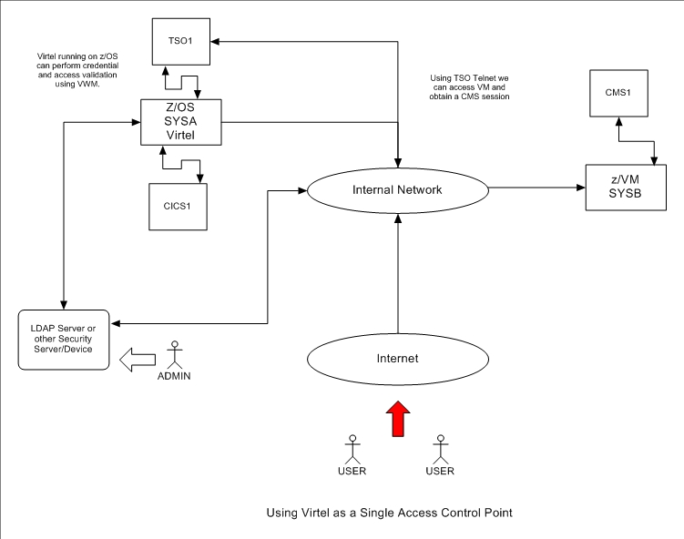
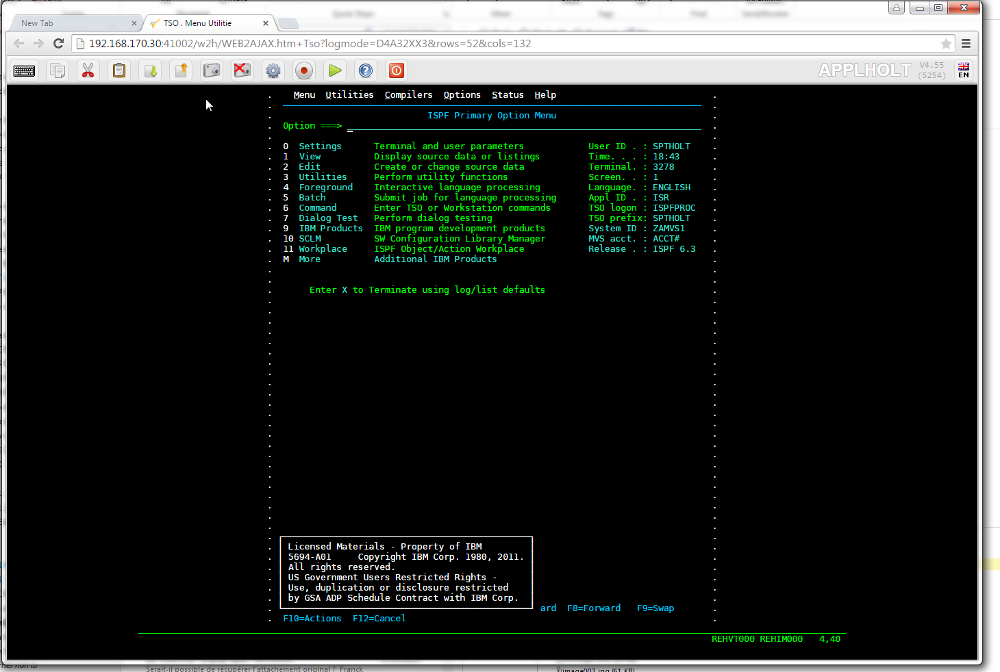
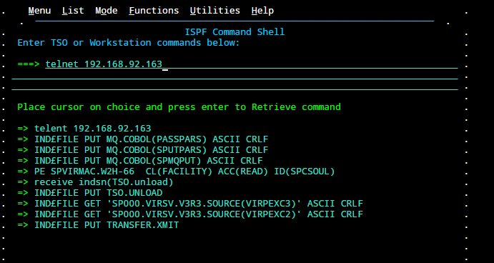
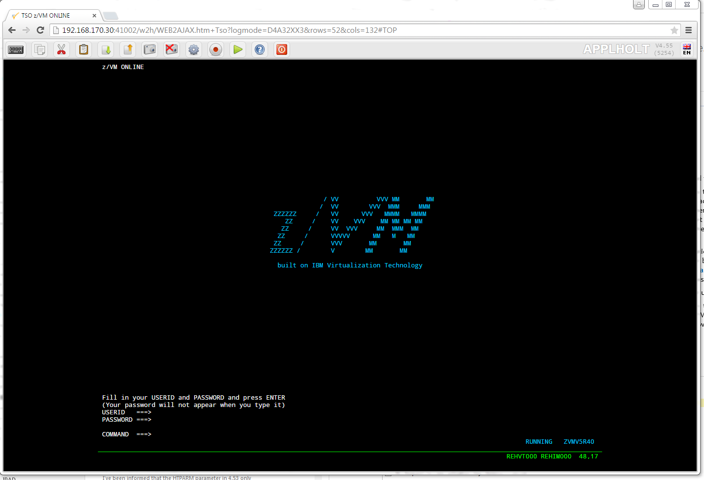

.. _tn201515:

Using Virtel as a Secure Single Access Control Point
====================================================

For reasons of network infrastructure it is not always possible to
implement a single access control point (SACP) gateway. SACPs are useful
in that they provide a single control point in the communication path
setup where user security and application access validation can be
performed. Because of the legacy application requirements most mainframe
environments have costly independent or duplicated communication paths
to reach 3270 applications running on different LPARs. With this
environment it is sometimes difficult to implement single access control
points. Often security database/environments are cloned or duplicated so
as to provide the necessary credential information to perform access
control. There is an inherent cost in supporting such an
infrastructures; not only with supporting the underlying software
subsystems, like VTAM, TELNET etc. but also in providing resources to
maintain such environments.

In this newsletter we show how Virtel can be used as a SACP for 3270
applications running in z/OS and z/VM environments. We also illustrate
that by using the TSO Telnet client on z/OS we can access z/VM without
the need for VTAM or 3270 emulation server products on z/VM. Using
Virtel as a SACP reduces the software and hardware costs and provides a
suitable vehicle for performing security and access validation at
different levels.

|image0|

*Figure 1 Network Example with Virtel as a SACP*

In our network example all setup connections are processed by Virtel.
Using the Web Modernisation feature of Virtel scenarios can be employed
to control not only user validation via the z/OS security subsystem but
also application access through Virtel’s network access capabilities.
Virtel supports SSO and pass ticket generation and also interfaces with
SSL to provide secure communications. As well as providing its own
Network Access feature Virtel can also co-exist and interface with a
variety of other Network Access products like TPX and NVAS.

Through the use of telnet Virtel can access applications not supported
by an underlying VTAM subsystem. In our example we gain access to the
CMS application of VM by passing through TSO and using TSO Telnet as a
client to z/VM’s telnet server. No specific setup is required other than
to have the telnet server running on z/VM.

A user gains access to z/VM by first logging onto TSO through Virtel and
establishing a telnet session:-

|image1|

*Figure 2 Logon onto TSO*

Once in TSO, we select option 6 and enter the TSO telnet client command,
pointing the IPL address at the z/VM system. In our case the command is:-

::

	telnet 192.168.92.163

|image2|

*Figure 3 Telnet to z/VM*

Once the telnet command has been executed a z/VM window will be opened
in the Virtel session.

|image3|

*Figure 4 VM Session via TSO Telnet*

From here a user can logon with their VM Users id and access CMS. As the
TSO telnet session is running in “Transparent mode” full 3270 capability
is provided across a variety of 3270 display types. See the TSO HELP
TELNET for more information.

