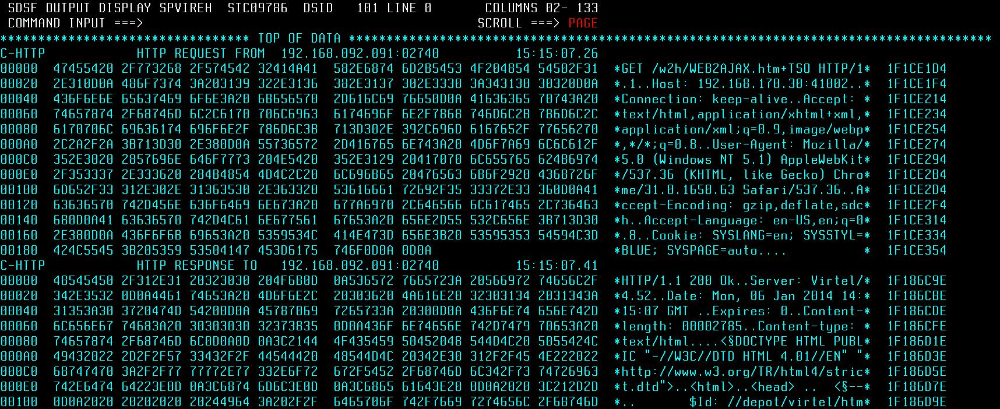
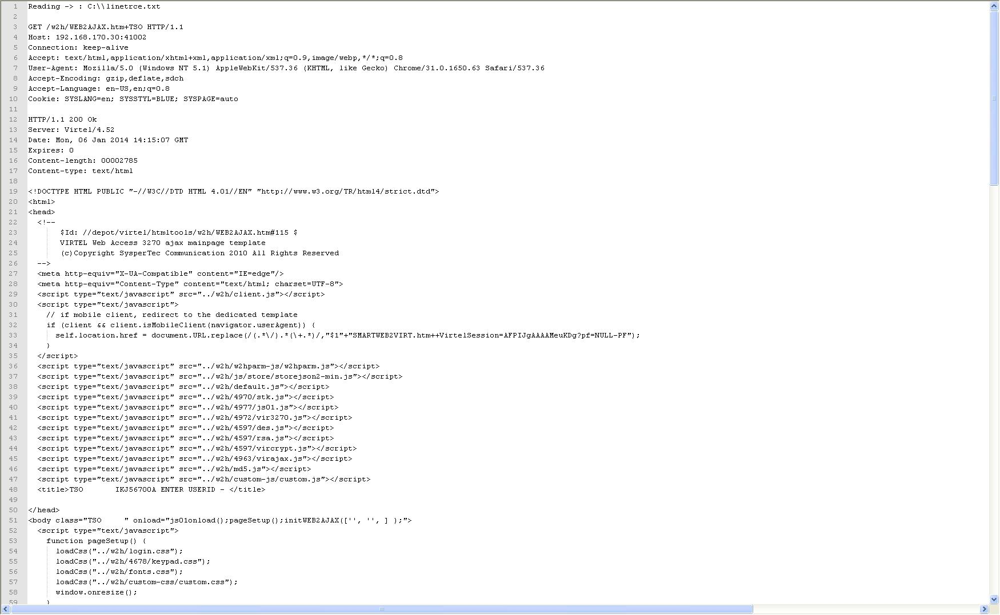
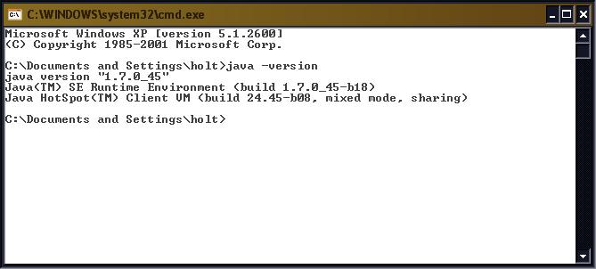

Formatting VIRTEL Line Trace
============================

When taking a VIRTEL Line line the output is the standard IBM dump
format. This can be formatted with the traceFormatter program which will
scan through the line output and attempt to recreate the original HTML
messages.

|image0|

*Figure 1. Example of output from Virtel Line Trace*

The traceFormatter reproduces the HTML captured by the Virtel Line
trace. This and can be used for protocol debugging.

|image1|

*Figure 2. Example of a formatted Line Trace*

Running traceFormatter

Step 1 Capture a line trace and download the output to your workstation.

Capture diagnostic information on mainframe:-

f virtel,trace,l=linename Start line trace

Perform debugging work

f virtel,notrace,l=linename Stop line trace

Using the XDC line command of SDSF save the VIRTRACE file. FTP this file
to your work station.

**Step 2 Running the Java program**

Obtain a copy of the ***traceFormatter.jar*** program. It is normally
located on the server Partage (`\\\\HOLT-WIN7 <file:///\\HOLT-WIN7>`__)
in the \\java\\traceformatter directory. Copy the directory to your c:
drive. You should now have a local copy. Ensure you have a copy of the
Java runtime library installed. To check, issue the following command
“java -version” from a Windows command window. This will test that Java
is installed correctly in your Windows environment. If it is not
installed you will need to down load the latest stable JRE copy and
ensure that it is in you PATH environment.

|image2|

*Figure3. Output from the java -version command*

**Step 3 Creating the trace listing.**

Copy the mainframe trace listing into the c:\\traceformatter directory.
Run the following DOS command(s).

cd c:\\traceformatter

**java -jar dist/traceFormatter.jar trace.trc VIRTELLINE**

**This will create a file within the directory with the following format
– YYYYMMDD\_HHMMSS. This is the output from the trace program. Browse
with NotePad++, KEDIT or some other suitable program.**

**
Command line format**

**traceFormatter.jar trace.trc [tracetype]**

**tracetype = VIRTELLINE \|\| IBM3270 \|\| TRSF \|\| PASSPORTLL**

