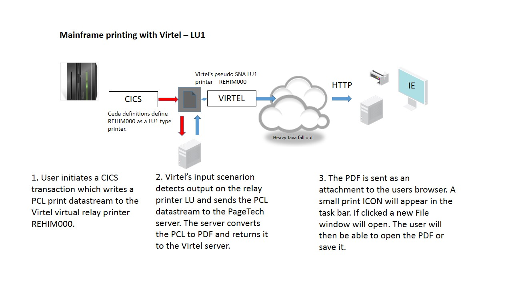

Mainframe printing with Virtel 4.56
===================================

This newsletters highlights some of the ways you can configure Virtel to
utilize its printing capabilities. First and foremost let’s understand
what Virtel can support with regard to printing. Just for clarification
Virtel currently doesn’t support seamless or unattended printing. In
other words a user cannot initiate a print transaction from CICS and
expect the output to automatically pop out on the users default
workstation printer. This is because Virtel is restricted to whatever
the browser printer functionality provides. See the section :ref:`“Seemless or
unattended printing” <#_bookmark01>` at the end of this document. However, having said
that there are several ways mainframe printing can be achieved. This
newsletter highlights the Virtel features that support mainframe
printing.

In the scenarios that follow user involvement is required. The supported
LU printer types are LU Type 1(SNA SCS) and LU Type 0/3(3270
datastream).

Depending on the Virtel printer configuration one of several things can
happen:- 

- Printer Type LU0 or LU3 (Non SNA/3270 data streams)

	Print data will be sent to the Virtel client and will appear in a new browser window. (*Default action.*)

	Virtel Option:  AutoPrint set on.

	A Windows “Print” window will automatically open. User can then select to print the output data.

- Printer Type LU1 (SNA/SCS)

	Print data will be sent to Virtel as an attached file. This will drive a Windows “Save As or Open” window which will enable the user to open the file or save it. This file contains the RAW print data. This of course could include PCL data which could be further processed by external programs or printed by a printer that supports PCL datastreams. For example the file could be converted to a PDF. There are many PCL to PDF conversion products on the open market.

Setting up Virtel to print from the mainframe.
----------------------------------------------

LU3 Type printing (3270)
^^^^^^^^^^^^^^^^^^^^^^^^

The following scenario demonstrates Virtel printing using the mainframe to a LU3 printer (NON-SCS). The user submits a batch job to print a file. The user has specified in the JCL that the JES2 output destination for this print job is a JES2 destination called EDSPRT. The user utilizes VTAM printer software to print to VTAM printers. In this case we are using VJRS, an Syspertec internal JES writer tool, but it could equally be IBM’s JES328X, INFOPRNT or any comparable software such as Natural’s COMPLETE NatSPool. Whatever software is used it will have the capability of associating a JES2 DESTID with a remote 3270 printer and extracting the output from the JES spool and sending it to a LU printer.

|image0| *Fig. 1 - Printing LU3*

Virtel pretends to be that remote 3270 printer through its relay LU associated with a user’s terminal session. In our case the printer name is REHIP000. This is set up in the terminal section of Virtel which can be accessed using F2 from the Virtel Configuration Menu. The following screen shot shows a terminal definition screen in Virtel. I’m using a prefix of REH in my example. The shipped defaults are prefixed RHT. 

.. note::
	Terminal REHIP000 is a second relay associated with terminal relay REHVT000, both of which are located within the *W2HPOOL. REHVIP000 is designated as type “P” – LU3 3270 printer.

In the shipped sample definitions the LU Type 1 (RHTIM000) is associated
with the relay terminal definition RHTVT000. To use LU T3 (3270
datastream) the RHTVT000 definition must be updated to associate the
printer terminal RHTIP000 with RHTVT000.

|image1| *Fig. 2 - Example of Virtel terminal definitions.*

The virtual relay definitions that Virtel uses to support VTAM terminals
and applications is defined in the VIRTAPPL VTAM definition. This can be
found in the shipped VIRT\*\*\*.CNTL library. Here is an example:-

::

	VIRTAPPL VBUILD TYPE=APPL
	*  ------------------------------------------------------------------ * 
	*  Product : VIRTEL                                                   * 
	*  Description : Main ACB for VIRTEL application                      * 
	*  ------------------------------------------------------------------ * 
	VIRTEL APPL EAS=160,AUTH=(ACQ,BLOCK,PASS,SPO),ACBNAME=VIRTEL
	*  ------------------------------------------------------------------ * 
	*  RHTVTxxx : VTAM application relays for VIRTEL Web Access           * 
	*  ------------------------------------------------------------------ * 
	RHTVT??? APPL AUTH=(ACQ,PASS),MODETAB=ISTINCLM,DLOGMOD=SNX32702,EAS=1
	*  ------------------------------------------------------------------ * 
	*  RHTIMxxx : Printer relays for VIRTEL Web Access terminals          * 
	*  ------------------------------------------------------------------ * 
	RHTIM??? APPL AUTH=(ACQ,PASS),MODETAB=ISTINCLM,DLOGMOD=SCS,EAS=1
	RHTIP??? APPL AUTH=(ACQ,PASS),MODETAB=ISTINCLM,DLOGMOD=DSILGMOD,EAS=1

.. note::
	Do not modify the ??? to a numeric number. These are VTAM model APPL definitions and the ??? is a valid string in this context.

There is no need to modify this definition. It should be copied to the
VTAMLST library and activated.

When Virtel detects that is has printer output, it will collect it from
the printer relay LU and send it to the associated terminal session.
When the session receives the output it will be displayed in a new
browser window. Here is a screen shot of my terminal session before I
have sent any output.

|image2| *Fig. 3 - Example of Virtel Browser screen before print data has been sent.*

Note that in the bottom corner you can see the two virtual SNA LUs that
Virtel is using to represent this browser session to VTAM. The first
name, REHVT000, is the 3270 terminal LU and the second, REHIP000, is the
associated SNA printer attached to REHVT000.

The Virtel VJRS program is used to emulate a VTAM printer interface and
is run as a started task. When it detects output destined for one of its
defined printers it will grab the spooled output from JES2 and drive the
virtual printer REHIP000.

The VJRS definition looks like:-

::

	* ----------------------------------------------------------------------------* 
	* - PRINTER CONTROL STATEMETS FOR VJRS UTILITY.                              -* 
	* -                                                                          -* 
	* - COL 1 JES DESTID                                                         -* 
	* - COL 10 VIRTEL LU RELAY PRINTER DEFAULT LOGMODE                           -* 
	* - COL 19 PRINTER TYPE                                                      -* 
	* - S = SCS PRINTER. LU TYPE 1 SNA SCS                                       -* 
	* - N = 3270 PRINTER. LU TYPE 3 NON-SNA DSILGMOD                             -* 
	* ----------------------------------------------------------------------------* 
	*      *        *  * 
	EDSPRT1 REHIM000 S
	EDSPRT  REHIP000 N

The Virtel relay LU printer name REHIP000 has been associated with JES2 destination EDSPRT. The following JCL is used to print some data to the JES2 destination EDSPRT.

::

	//SPTHOLTP JOB 'VJRSTEST',CLASS=A,MSGCLASS=Z,NOTIFY=SPTHOLT
	//STEP1 EXEC PGM=IEBGENER
	//SYSPRINT DD DUMMY
	//SYSUT2 DD SYSOUT=A,DEST=EDSPRT
	//SYSUT1 DD DSN=SPTHOLT.TEST.PRINTS(TEST),DISP=SHR
	//SYSIN DD DUMMY
	/*

.. note::

	The JRP program in the CBT archive File 755 can be used in place of VJRS. This is freely available under the terms and conditions of CBT.

Once Virtel detects output on its relay LU it will send it to the
browser. This can be seen by the fact that a small printer icon will
appear in the task bar. See the screen shot below:-

|image3| *Fig. 4 - Print data received by browser. Printer ICON displayed in Task Bar.*

Pressing the ICON will open a second browser window which will reveal the print data. See the following screen shot:-

|image4| *Fig. 5 - Print data displayed in second browser window.*

From this window the print data can be printed using the normal windows
menu dialogs. Virtel does have an Auto-print option in the Virtel
settings panel. This will automatically open up the Windows Print dialog
so that you can just click print to print the print data. Once you have
printed your output you can close the Virtel Print window and continue
with your terminal session.

LU1 Type printing SCS
^^^^^^^^^^^^^^^^^^^^^

In this scenario we demonstrate printing from CICS and converting the
output to a PDF. The Virtel setup for this requires the use of a third
party product to convert the PCL data stream to a PDF. A PageTech server
environment is set up to perform this conversion.

|image5| *Fig. 6 - LU1 (SCS) printing flow with external print server*

In this scenario we have defined a SCS printer (LU1) in CICS and
associated it with the netname REHIM000. This will be the relay LU name
that Virtel will use to represent the printer. Here is a view of the
CICS definition as displayed by the CEDA transaction:-

|image6| *Fig 7 - CEDA of LU T1 printer definition used by Virtel*

Note that in the bottom right of the screen the two relay LU names
associated with this browser session are displayed. The REHVT000 is the
terminal and the REHIM00 is the attached LU1 printer. A CICS transaction
will be invoked by the user which will acquire the printer and write a
PCL data stream to terminal EHS0. This PCL Data stream will be sent to
the LU REHIM00. Virtel will detect the output and using the scenario
SCENFPDF will send the print data stream to the PageTech server
environment where the data will be converted to a PDF file. When the PDF
is returned back to the Virtel server, from the PageTech server, it will
be sent as a mulit-attachment PDF MIME to the browser. The user will
then be able to save or open the PDF file.

The Virtel transaction that performs this process is defined with the
following fields.

|image7| *Fig. 8 - Virtel Transaction Detail for CICS transaction*

The transaction’s external name is CICSHP and this name will be
displayed in the Virtel application menu. The TIOA at logon field is a
formatted character string that will simulate logging onto CICS and
invoking the CICS transaction. The input scenario, SCENPPDF, will be
triggered when Virtel detects output from the CICS transaction. Virtel’s
scenario language is used to perform Virtel’s modernization and
integration features. See appendix for an example of the PDF conversion
scenario.

When the input scenario detects the print data stream it will send it to
the PageTech server for conversion to a PDF file. The PDF returned by
the PageTech servers will be sent to the browsers as a file attachment.
This attachment can then be saved or printed.

The CICS transaction is initiated from the Virtel Application menu by
selecting the CICSHP menu option. This will automatically signon to
CICS, acquire the printer and return a PCL stream to Virtel. The PCL
data stream will be input to the external server.

|image8| *Fig. 9 - The Virtel Application Menu Screen*

After conversion to PDF virtel will return the PDF as an attachment to
the user’s browser. A window will open to enable the user to save or
open the PDF file.

|image9| *Fig. 10 - Processing a PDF File*

TSO Printing
------------

A lot of customers use GDDM’s ADMOPUT program to print from TSO. In this
section we see how to define the GDDM ADMOPUT interface to Virtel. Both
LU1 and LU3 are supported by Virtel. ADMOUT runs normally runs as a
started task. It services “queues” that have been set up to control the
printing of alphanumeric files. Details of setting up ADMOPUT can be
found in the IBM’s GDDM Administration Guide – SC33-0871-02.

The following is an example of printing with GDDM.

Create the printer definitions in the ADMPRINT job and run the job to
build the request queues. In this example REHIP000 is a LU3 3270 printer
and REHIM000 is a LU1 SCS printer. These should exist as VTAM APPLS and
should be installed as part of the Virtel installation:-

::

	REHIM??? APPL AUTH=(ACQ,PASS),MODETAB=ISTINCLM,DLOGMOD=SCS,EAS=1
	REHIP??? APPL AUTH=(ACQ,PASS),MODETAB=ISTINCLM,DLOGMOD=DSILGMOD,EAS=1

The printer definitions for ADMPRINT should look like this:-

::

	* **********************************************************************
	*                                                                      *
	*  CONTROL STATEMENTS                                                  *
	*                                                                      *
	*                                                                      *
	*  TIMER DEFINES THE POLL INTERVAL IN TENS OF SECS
	*  EXTRA DEFINES THE NUMBER OF PRINTERS THAT CAN BE DYNAMICALLY ADDED
	*                                                                      *
	HEADER TIMER=4,EXTRA=30
	*                                                                      *  
	*  ADD MORE PRINTER STATEMENTS HERE AS REQUIRED                        *
	PRINTER REHIP000,SIZE=1920          PRINTER NAME,BUFFER SIZE
	PRINTER REHIM000,SIZE=1920          PRINTER NAME,BUFFER SIZE
	PRINTER R1AIM000,SIZE=1920          PRINTER NAME,BUFFER SIZE
	PRINTER R2AIM000,SIZE=1920          PRINTER NAME,BUFFER SIZE
	* 
	*  PQECNT DEFINES THE MAXIMUM NUMBER OF PRINT REQUESTS WHICH CAN BE    *
	*  ACTIVE AT ONE TIME. INCREASE THE NUMBER IF REQUIRED                 *
	*                                                                      *
	TRAILER PQECNT=186 ACTIVE PRINT REQUEST LIMIT
	END

Activate the GDDM ADMOPUT VTAM APPL:-

::

	GDDMAPPL VBUILD TYPE=APPL
	*  ------------------------------------------------------------------ *
	*  GDDM : ADMOPUT GDDM ACB * 
	*  ------------------------------------------------------------------ * 
	GDDMPRT1 APPL AUTH=(ACQ,PASS),MODETAB=ISTINCLM,EAS=1

Start the GDDM ADMOPUT task. The VTAM APPL must be active. The following JCL is an example:-

::

	//SPTHOLTG JOB CLASS=A,MSGCLASS=X,NOTIFY=&SYSUID,REGION=64M
	//GDDMPRT1 EXEC PGM=ADMOPUT,DYNAMNBR=N,REGION=0K,
	// PARM='NAME=GDDM,MAXPRTRS=0010'
	//STEPLIB DD DSN=GDDM.SADMMOD,DISP=SHR
	//ADMSYMBL DD DSN=GDDM.SADMSYM,DISP=SHR
	//ADMGGMAP DD DSN=GDDM.SADMMAP,DISP=SHR
	//ADMPRNTQ DD DSN=SPTHOLT.ZAMVS1.REQUEST.QUEUE,DISP=SHR
	//*ADMDEFS DD DSN=YOUR.ADMDEFS,DISP=SHR
	//SYSABEND DD SYSOUT=*

When the ADMOPUT successfully starts it will write a message to the console log:-

::

	@19 ADM2000 I ADMOPUT(GDDM). TO TERMINATE, REPLY 'STOP', 'STOPQ', OR 'STOPS'

Now we can start Virtel making sure that we have a second relay printer
associated with a 3270 session. In this case we start a TSO session. We
can see that the TSO 3270 screen REHVT000 is associated with printer
REHIP000.

|image10| *Fig. 11 - 3270 LU with relay printer REHIP000*

Next, we allocate the queue file to our TSO session with an allocate command:-

::

	alloc f(ADMPRNTQ) DA(ZAMVS1.REQUEST.QUEUE) SHR REUSE

This is the same file that is allocated in the ADMOPUT task. Next we
place a print request into the print queue by call ADMOPRT from within
our TSO session:-

::

	Call 'gddm.sadmmod(admoprt)' 'gddm.smallfle on rehip000 (nocc'

This will place a request to print the file myhlq.gddm.smallfle to the
printer defined as REHIP000. The ‘nocc’ option tells GDDM not to insert
any carriage control characters. If we look at the request queue using
the GDDM print queue manager we should be able to see the print request.

|image11| *Fig. 12 - GDDM Print Queue*

When GDDM polls the GDDM request queue it will see the request for
REHIP000. It will convert the output, set up a session with REHIP000 and
send the output to what it believes is a LU3 printer. Virtel will
receive the output from GDDM and convert it to HTML. A small printer
ICON will appear on the Virtel Task Bar when the printed output is ready
to be processed. See the red line in the screen shot below.

|image12| *Fig. 13 - Print request ready for processing*

Prerssing the printer ICON will process the output. For LU Type3 a
second browser window will be open and the output displayed. For LU
Type1 the file will be download to the users PC for further processing.
In our example we are using LU Type3 sp after clicking the printer ICON
a second browser window is opened displaying the contents of the file.
From here the file can be printed or saved for furrther processing.

|image13| *Fig. 14 - Second Browser window containing print. LU3 behaviour*

Once the print output has been processed the browser window should be
closed and ENTER should be pressed on the TSO session to clear the
printer ICON.

Printing and MAKEPDF
--------------------

MAKEPDF is a program that creates PDFs using standard output files as
its input data. It is included in the delivered Virtel product and runs
as a external service of the Virtel VIRSV service. MAKEPDF requires
conrol statements as well as the raw data to construct the PDF. The
control statements provide the layout, image and control information.
Three separate files are involved – the DOCOPT, INPUT and LAYOUT files.
These files are created by the user and the uploaded to the SAMPTRSF W2H
directory. Samples are provided below. These work with the SCENFLND
scenarion. See :ref: `Appendix B <#_appendix_b>`:-

::

	scenvjrs-docopt_l.txt
	
	<!--VIRTEL start="{{{" end="}}}"-->
	{{{CREATE-VARIABLE-IF(APPLICATION-IS-CONNECTED) "$PDFAPP$"}}}	
	{{{PDF-NEW-DOCOPT "1"}}}
	DOCINFO TITLE="{{{NAME-OF (PRINT-RELAY)}}}-{{{NAME-OF (DATE-TIME)}}}" 
	AUTHOR="{{{NAME-OF (USER)}}}" SUBJECT="" KEYWORDS="" 
	CREATOR="{{{CURRENT-VALUE-OF "$PDFAPP$"}}}" 
	PRODUCER="VIRTEL ({{{NAME-OF(VIRTEL)}}})"				
	PAGE SIZE=A4 LANDSCAPE

	DefineOverlay GreenBar Top=0.5 Bottom=0.5 Left=0.5 Right=0.5
	BarHeight=0.5 BarColor=LiteGreen NudgeRight=-2 NudgeDown=1
	DefineFont Font1 Native=Courier
	DefineFont Font2 Native=Helvetica
	DefineDefaultFont Native=Courier
	DefaultFontSize 8 9
	SetVar GlobalVar1 = "VJRS Test Print"

	scenvjrs-input_l.txt

	<!--VIRTEL start="{{{" end="}}}" -->
	{{{PDF-NEW-INPUT}}}{{{PDF-USE-DOCOPT "1"}}}{{{PDF-USE-LAYOUT "1"}}}
	{{{PDF-LINES-PER-PAGE (50)}}}
	{{{FOR-EACH-VALUE-IN "$PRINT$"}}}{{{CURRENT-VALUE-OF "$PRINT$"}}}
	{{{END-FOR "$PRINT$"}}}

	scenvjrs-layout_l.txt

	<!--VIRTEL start="{{{" end="}}}" -->
	{{{PDF-NEW-LAYOUT "1"}}}

	At (0.5" 8.0")
	ApplyOverlay GreenBar
	TextBegin
	Font Font1 Size(8 9) fill(black)
	PageContents Lines(all)
	FontEnd
	TextEnd
	; Place some text outside box
	TextBegin
	Font Font2 size(10 12) fill(teal)
	Map "Document=" at(0.5" 8.29")
	Map GlobVar1
	FontEnd
	TextEnd
	;

An input scenario is required to access the control files, the raw print
data and to interface with the external service that calls MAKEPDF. A
PDF file is rerturned to the user once the processing of the raw data is
complete. A “printer” ICON will appear in the toolbar indicating that
the PDF is ready to be printed. The external service program that
creates the PDF is called VIRSVPDF and this is linkedited with the
MAKEPDF program. See the Virtel User Guide for further information on
how to setup and run MAKEPDF.

The following is an example of a PDF created by MAKEPDF using the output
from a utility listing. The output was sent to JES2 and then extracted
by the VJRS program and sent to Virtel an SCS data stream.

|image14| *Fig. 15 - Multi-Page PDF listing using MAKEPDF*

Virtel delivers the VIRSVPDF program as an example of a MAKEPDF external service. This program is designed only to produce 1 page per   service call. For producing PDF’s with multiple pages please contact the Syspertec support centre for further advice. The scenario  associated with this landscape printing is called SCENFLND. See :ref:`Appendix B. <#_appendix_b>`

.. _#_bookmark01:

Seamless or unattended printing
-------------------------------

The scenarios in this newsletter have demonstrated some of the print
options that Virtel currently supports. As you can see user involvement
is required in any print scenario that has been initiated from the
mainframe. Because of restriction within JavaScript and the browser
support seamless or unattended printing is not available by default.
This is more of a security feature than anything. Virtel is a “thin”
client solution, a web application that runs within the browser and is
“restricted” to whatever services or facilities the browser provides.
Unlike other terminal emulators, like IBM’s PCOMM, which is considered a
“fat client”, Virtel doesn’t have accesses to the same rich capabilities
that this Java application can provide. For this reason Virtel customer
are restricted to some extent to whatever printing facilities the
Javascript/HTML and browsers can support. Of course, on the positive
side, a thin client doesn’t have all the Java release complications that
people have experienced in the past. There is no applet download,
security setup or ongoing support issues which have plagued users since
the birth of the Java Applet. This was one of the reasons why people
moved away from “fat clients” towards a thin client solution which
required no changes to their PC. Despite these limitations Virtel does
have considerable printing within its scenario language.

Having said that Virtel can be configured to support seamless printing
but at a browser level. This configuration is outside the support
currently offered by SysperTec but we highlight what options are
available. Users who undertake implementing these options do so in the
knowledge that these are not supported options.

Firefox: Seamless browser printing using the JavaScript print command.
^^^^^^^^^^^^^^^^^^^^^^^^^^^^^^^^^^^^^^^^^^^^^^^^^^^^^^^^^^^^^^^^^^^^^^

In this example we set up a Virtel Transaction so that the browser
window can be printed directly to the default printer through a
“Printer” icon. The printer “ICON” will be added to the Virtel task bar.

Setting up Firefox

Enter “about:config” in the Firefox address bar. This will bring up the
Firefox preferences. Right click on any preference and select New
Boolean. Add the preference print.always.print.silent, press OK and then
set the option to “true”. Close and restart the Firefox browser. From
now on any JavaScript print(); command will print directly to the
printer using the current configured print settings.

Adding the printer ICON to the task bar.

We use a custom.js file to add a printer ICON to the task bar. This
customized option is applied to a CICS transaction CLI-10 in our list of
transactions. Using the ADMIN HTML panel will update the transaction
Option field with an option definition called CICSPRNT

|image15| *Fig. 16 - Setting the transaction option*

We press the “Spanner” icon on the right to create and validate the
relevant files.

|image16| *Fig. 17 - Creating and Validating the Option files*

The validation process creates the javascript file option.CICSPRNT.js
which is uploaded to Virtel. Within this file we identify the two
customization files that will be used for this CICS transaction. In this
case /option/custCSS.CICSPRNT.js and /option/custJS.CUSTPRNT.js. For
this example we are only interested on the custJS.CUSTPRNT.js file. We
must also ensure that we have a direct/path transaction for the /option/
directory pointing to the Virtel CLI-DIR. We add another transaction to
support the /option/ directory path location being CLI-DIR. This is the
directory where we will load up our custJS.CUSTPRNT.js file. Be sure to
save your changes to the transaction before exiting. You must save the
updates then return to the transaction list where you will be asked to
confirm the update. Do not use the browser back key – this will lose the
update. Go back via the option menu hierarchy.

|image17| *Fig. 18 - Creation a transaction for the option directory*

Next we create our customized JavaScript file which will added the print
ICON to the task bar and associate a function which will be executed
when the user presses the print ICON. Our custJS.CICSPRNT.js looks like
this. Details about toolbar customization can be found in the Virtel
User Guide:-

::

	//CLI-DIR
	function after\_standardInit() {
	addtoolbarbutton(000,"print.ico","Print Screen",do\_print);
	}

	function do\_print() {
	window.print();
	}

We upload custJS.CICSPRNT.js and a print.ICO image to the CLI directory using Virtel’s Drag and Drop facility found in the Virtel Admin. Portal. When we load up the CICS transaction we can now see the printer ICON in the tool bar – the first ICON on the toolbar. Pressing it will print the browser screen without the standard Printer Pop-Up appearing. The output will appear on the users default printer.

|image18| *Fig. 19 - Printer ICON in the tool bar*

Chrome: Seamless browser printing using the kiosk options.
^^^^^^^^^^^^^^^^^^^^^^^^^^^^^^^^^^^^^^^^^^^^^^^^^^^^^^^^^^

The same behavior can be displayed in Chrome if we start Chrome with the –kiosk-printing option:-

::

	“C:\\Program Files (x86)\\Google\\Chrome\\Application\\chrome.exe" --kiosk-printing

When the press the Print ICON the browser image appears on the default
printer. There is no intervening “setup” window. We can also use the
–kiosk option to hide the URL bar and specify the target URL in the
command line:-

::

	C:\\nodeJS>"C:\\Program Files(x86)\\Google\\Chrome\\Application\\chrome.exe" --kiosk-printing –kiosk http://192.168.170.33:41002/w2h/WEB2AJAX.htm+Cics

|image19| *Fig. 20 - Full screen kiosk display with Chrome*

The browser window can be closed with ALT-F4.

Appendices
----------

Appendix A
^^^^^^^^^^

::

	SCENPPDF SCREENS APPL=SCENPPDF
	*
	* SCENARIO TO CONVERT PCL TO PDF AND SEND TO PRINT SERVER
	*
		SCENARIO INPUT
	*
	* Test if the browser request specified pf=SCENARIO-PRINT
	*
			COPY$ INPUT-TO-VARIABLE,FIELD='PF',VAR='PF',TYPE=REPLACE
			IF$ NOT-FOUND,THEN=NOPARAMS 
			CASE$ 'PF', 												*
				(EQ,'SCENARIO-PRINT',PRINT), 							*
				ELSE=NOPARAMS 4
	*
	* process the request for printing
	*
	PRINT 	EQU * 
	*  
	* Get the VIRTEL APPLID, terminal name, and printer name  
	*  
			COPY$ SYSTEM-TO-VARIABLE,VAR='APPLID',  					*
				FIELD=(NAME-OF,VIRTEL)  
			COPY$ SYSTEM-TO-VARIABLE,VAR='TERMINAL',  					*
				FIELD=(NAME-OF,PSEUDO-TERMINAL)  
			COPY$ SYSTEM-TO-VARIABLE,VAR='PRINTER',  					*
				FIELD=(NAME-OF,PRINT-RELAY)  
	*  
	* Use the timestamp to generate a document name  
	*  
			POP$ ALL-VALUES-OF,VAR='TIMESTAMP'  
			COPY$ SYSTEM-TO-VARIABLE,VAR='TIMESTAMP',  					*
				FIELD=(NAME-OF,DATE-TIME)  
			COPY$ LIST-TO-VARIABLE, For VIRTEL 4.47+  					*
				VAR='DOCNAME',TYPE=REPLACE,  *
				LIST=(VARIABLE,'PRINTER',STRING,'-',  					*
				VARIABLE,'TIMESTAMP')  
	*
	* The PCL input file has been written to $PRINT$ by VIR0915I
	*
			IF$ EXISTS-VARIABLE,'$PRINT$',ELSE=NOPRINTD  
	*
	* Set up the outbound HTTP call to the PCL-to-PDF converter
	* See job PCL2PDF for definition of IP address of PCL2PDF server
	*
			OPTION$ FOR-HTTP, 											*
				(METHOD,'POST'), 										*
				(SITE,'pcl2pdf.yourcompany.com'), 						*	
				(TO,'/pdfconv.php'), 									*
				(HEADER,'Content-Type: text/pcl'), 						*
				(FILE-OUT,'$PRINT$'), 									*
				(FILE-IN,'PDFDATA'), 									*
				(RET-CODE,'RETCODE'), 									*
				TOVAR='HTTPARM'
	*  
	* Issue a progress message to the console  
	*  
			ERROR$ 0,  													*
				'*APPLID',' ','*TERMINAL',' ','*PRINTER',' ', 			*
				'SCENPPDF SENDING DOCUMENT ','*DOCNAME',  				*
				' TO PCL2PDF SERVER'  
	*
	* Call the PCL-to-PDF converter
	*
			POP$ ALL-VALUES-OF,VAR='PDFDATA'
			POP$ ALL-VALUES-OF,VAR='RETCODE'
			SEND$ TO-LINE, 												*
				LINE='PCL2PDF', 										*
				PARMS='HTTPARM', 										*
				ERROR=HTTPFAIL
	*  
	* Check for successful HTTP response  
	*  
			IF$ NOT-EXISTS-VARIABLE,'RETCODE',THEN=HTTPINV  
			CASE$ 'RETCODE',  											*
				(BEGIN,'200',SENDPDF), 									*
				ELSE=HTTPERR  
	SENDPDF EQU *  
	*
	* Send PDF file to browser
	*
			COPY$ LIST-TO-VARIABLE, For VIRTEL 4.47+ 					*
				VAR='PDFNAME',TYPE=REPLACE, 							*
				LIST=(VARIABLE,'DOCNAME',STRING,'.pdf')  
			SEND$ AS-FILE,VAR='PDFDATA', 								*
				TYPE='application/pdf',NAME='*PDFNAME'
	*  
	* Issue a progress message to the console  
	*  
			ERROR$ 0,  													*
				'*APPLID',' ','*TERMINAL',' ','*PRINTER',' ',  			*
				'SCENPPDF DELIVERED DOCUMENT ','*DOCNAME',  			*
				' TO TERMINAL'  
	*
	NOPARAMS EQU *
	SCENARIO END
	*
	* Error exits
	*
	NOPRINTD EQU *  
			COPY$ LIST-TO-VARIABLE, For VIRTEL 4.47+  					*
				VAR='ERRMSG',TYPE=REPLACE,  							*
				LIST=(STRING,'NOTHING TO PRINT FOR ',  					*
				VARIABLE,'PRINTER')  
			GOTO$ CREAHTML  
	*  
	HTTPINV EQU *  
			COPY$ VALUE-TO-VARIABLE,  									*
				VAR='ERRMSG',TYPE=REPLACE,  							*
				VALUE='INVALID RESPONSE FROM PCL2PDF SERVER'  
			GOTO$ CREAHTML  
	*  
	HTTPERR EQU *  
			COPY$ LIST-TO-VARIABLE, For VIRTEL 4.47+  					*
				VAR='ERRMSG',TYPE=REPLACE,  							*
				LIST=(STRING,'PCL2PDF SERVER RETURNED ',  				*
				STRING,'HTTP CODE=',VARIABLE,'RETCODE')  
			COPY$ LIST-TO-VARIABLE, For VIRTEL 4.47+  					*
				VAR='RESPONSE',TYPE=REPLACE,  							*
				LIST=(VARIABLE,'PDFDATA')  
			GOTO$ SENDHTML
	*  
	HTTPFAIL EQU *
			COPY$ VALUE-TO-VARIABLE,  									*
				VAR='ERRMSG',TYPE=REPLACE, 								*
				VALUE='OUTBOUND CALL TO PCL2PDF SERVER FAILED'  
	CREAHTML EQU *  
			COPY$ LIST-TO-VARIABLE, For VIRTEL 4.47+ 					*
				VAR='RESPONSE',TYPE=REPLACE, 							*
				LIST=(STRING,'<html><head><title>SCENPPDF error</title><*
				/head><body>',VARIABLE,'ERRMSG', 						*
				STRING,' See messages in JESMSGLG for ', 			*
				VARIABLE,'APPLID', 										*
				STRING,'</body></html>')
			CONVERT$ EBCDIC-TO-ASCII,VAR='RESPONSE'
	SENDHTML EQU *  
	SENDHTML EQU *  
			ERROR$ 0,  													*
				'*APPLID',' ','*TERMINAL',' ','*PRINTER',' ',  			*
				'SCENPPDF ERROR: ',  									*
				'*ERRMSG'  
			COPY$ OUTPUT-FILE-TO-VARIABLE, 								*
				FILE='PDFFAILURE.htm',VAR='OUTPUTTXT'
				SEND$ AS-FILE,VAR='RESPONSE', 							*
				TYPE='text/HTML',NAME='FAILURE.htm'
	SCENARIO END
	*
	SCRNEND
	END

.. _#_appendix_b:

Appendix B
^^^^^^^^^^

::

	SCENFLND SCREENS APPL=SCENFLND
	* 
	*  SCENARIO TO CONVERT £PRINT£ FROM TO PDF. LANDSCAPE
	* 
	SCENARIO INPUT
	*  Test if the browser request specified pf=SCENARIO-PRINT
			COPY£ INPUT-TO-VARIABLE,FIELD='PF',VAR='PF',TYPE=REPLACE
			IF£ NOT-FOUND,THEN=NOPARAMS   
			CASE£ 'PF',(NE,'SCENARIO-PRINT',NOPARAMS)
	*  An ASCII print file has been written to £PRINT£ by VIR0915I
			IF£ EXISTS-VARIABLE,'£PRINT£',ELSE=NOPRINTD   
	*  Convert £PRINT£ file from ASCII to EBCDIC for MAKEPDF
			CONVERT£ ASCII-TO-EBCDIC,VAR='£PRINT£'
	*  Create INPUT file for MAKEPDF
			COPY£ OUTPUT-FILE-TO-VARIABLE,TYPE=LINEBUFFER, 				* 
				FILE='SCENVJRS-INPUT_L.TXT',VAR='INPUT'
	*  Create DOCOPT file for MAKEPDF
			COPY£ OUTPUT-FILE-TO-VARIABLE,TYPE=LINEBUFFER, 				* 
				FILE='SCENVJRS-DOCOPT_L.TXT',VAR='DOCOPT'
	*  Create LAYOUT file for MAKEPDF
			COPY£ OUTPUT-FILE-TO-VARIABLE,TYPE=LINEBUFFER, 				* 
				FILE='SCENVJRS-LAYOUT_L.TXT',VAR='LAYOUT'
	*  Initialize variables with defaults
			POP£ ALL-VALUES-OF,VAR='OUTPDF'
			POP£ ALL-VALUES-OF,VAR='ERRMSG'
	*  Call service program VJRS0200 which calls MAKEPDF
			VIRSV£ CALL-REUSE,('SERVPDF','VJRS0200'), 					* 
				(IN-VARIABLE,'INPUT',* 3), 								* 
				(IN-VARIABLE,'DOCOPT',* 1), 							* 
				(IN-VARIABLE,'LAYOUT',* 1), 							* 
				(OUT-VARIABLE,'OUTPDF',500K), 							* 
				(OUT-VARIABLE,'ERRMSG',160), 							* 
				(NUMBER,'2'), MAKEPDF TRACE LEVEL 						* 
				TRACE=(NO-APPLICATION-TRACE, VIRSV TRACE LEVEL 			* 
				NO-CALLS-TRACE,NO-DISPATCH-TRACE,NO-MEMORY-TRACE), 		* 
				ERROR=REJECT,TASKS=1
	*  Send PDF file to browser
			COPY£ SYSTEM-TO-VARIABLE,VAR='PRINTER', 					* 
				FIELD=(NAME-OF,PRINT-RELAY)
			COPY£ SYSTEM-TO-VARIABLE,VAR='TIMESTAMP', 					* 
				FIELD=(NAME-OF,DATE-TIME)
			COPY£ VALUE-TO-VARIABLE, For VIRTEL 4.46 					* 
				VAR='PDFNAME',TYPE=REPLACE, 							* 
				VALUE='my.pdf'
			COPY£ LIST-TO-VARIABLE, For VIRTEL 4.47+ 					* 
				VAR='PDFNAME',TYPE=REPLACE, 							* 
				LIST=(VARIABLE,'PRINTER',STRING,'-', 					* 
				VARIABLE,'TIMESTAMP',STRING,'.pdf')
			SEND£ AS-FILE,VAR='OUTPDF', 								* 
				TYPE='application/pdf',NAME='* PDFNAME'
	*  Issue a progress message to the console   
			ERROR£ 0,   * 
				'* APPLID',' ','* TERMINAL',' ','* PRINTER',' ',   		* 
				'SCENFLND DELIVERED DOCUMENT ','* PDFNAME',   			* 
				' TO TERMINAL'   
	* 
	NOPARAMS EQU * 
	SCENARIO END
	* 
	*  Error exits
	* 
	NOPRINTD EQU *    
			COPY£ LIST-TO-VARIABLE, For VIRTEL 4.47+   					* 
				VAR='ERRMSG',TYPE=REPLACE,   * 
				LIST=(STRING,'NOTHING TO PRINT FOR ',   				* 
				VARIABLE,'PRINTER')   
				GOTO£ CREAHTML   
	*    
	REJECT 		EQU * 
	CREAHTML 	EQU *    
			COPY£ LIST-TO-VARIABLE, For VIRTEL 4.47+   					* 
				VAR='RESPONSE',TYPE=REPLACE,   * 
				LIST=(STRING,'<html><head><title>SCENFLND error</title>
							  </head><body>',
				VARIABLE,'ERRMSG',   									* 
				STRING,'</body></html>')   
			CONVERT£ EBCDIC-TO-ASCII,VAR='RESPONSE'   
	SENDHTML EQU *    
			ERROR£ 0,   												* 
				'* APPLID',' ','* TERMINAL',' ','* PRINTER',' ',   		* 
				'SCENFLND ERROR: ',   									* 
				'* ERRMSG'   
			SEND£ AS-FILE,VAR='RESPONSE',   							* 
				TYPE='text/html',NAME='FAILURE.htm'   
	SCENARIO END
	* 
	SCRNEND
	END

.. |image2| image:: images/media/image3.jpeg
.. |image3| image:: images/media/image4.jpeg
.. |image4| image:: images/media/image5.jpeg

.. |image6| image:: images/media/image7.jpeg
.. |image7| image:: images/media/image8.jpeg
.. |image8| image:: images/media/image9.jpeg

.. |image12| image:: images/media/image13.png
.. |image13| image:: images/media/image14.png
.. |image14| image:: images/media/image15.png
.. |image15| image:: images/media/image16.png

.. |image18| image:: images/media/image19.png
.. |image19| image:: images/media/image20.png