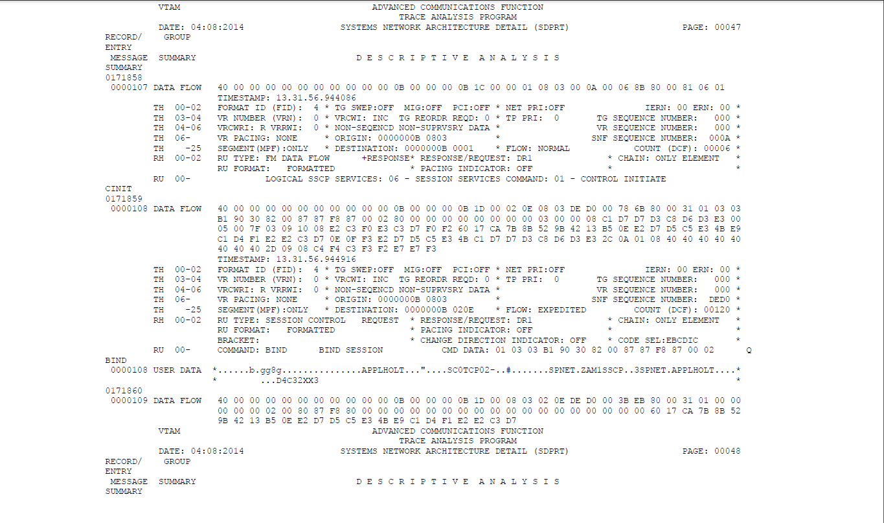

Taking a VTAM trace
===================

This newsletters provides details on how to take a VTAM buffer trace and
print the details. In this scenario we are taking a trace between VIRTEL
and TSO via the IBM network session monitor Netview Access (NVAS). In my
example the VIRTEL prefix for the relay is REH. Yours will be different.

|image1|

**Types of traces.**

There are two types of traces that are of interest, The VTAM buffer
trace and the VTAM internal trace. Both will write GTF USR records to a
GTF trace data set. Trace records can be identified as:-

- Type FE1 VTAM INTERNAL TRACE
- Type FEF VTAM BUFFER TRACE

Security
--------

To see the user data in the buffer contents of a trace record, set
CONFTXT=YES in the TSOKEY00 member of SYS1.PARMLIB before starting
TSO/VTAM.

**Start GTF**

First we need to start GTF. Use the following z/OS start command.

::

	S GTF.GTF

By default all USR records will be traced. This is specified in the
GTFPARM member of USER.PARMLIB. This member has the following
statement:-

::

	TRACE=USR

GTF will issue a WTO. Further trace options can be specified.
Reply “U” to message AHL125A to activate the GTF trace. Here is an
example from the console log of starting up GTF:-

::

	$HASP100 GTF ON STCINRDR
	IEF695I START GTF WITH JOBNAME GTF IS ASSIGNED TO USER START2
	, GROUP SYS1
	$HASP373 GTF STARTED
	IEF403I GTF - STARTED - TIME=11.05.36
	AHL121I TRACE OPTION INPUT INDICATED FROM MEMBER GTFPARM OF PDS
	USER.PARMLIB
	TRACE=USR
	AHL103I TRACE OPTIONS SELECTED --USR
	81 AHL125A RESPECIFY TRACE OPTIONS OR REPLY U
	R 81,U
	IEE600I REPLY TO 81 IS;U
	U
	AHL906I THE OUTPUT BLOCK SIZE OF 4096 WILL BE USED FOR OUTPUT 541
		DATA SETS:
			SYS1.TRACE
	AHL080I GTF STORAGE USED FOR GTF DATA: 542
		GTFBLOCK STORAGE 40K BYTES (BLOK= 40K)
		PRIVATE STORAGE 1024K BYTES (SIZE= 1024K)
		SADMP HISTORY 40K BYTES (SADMP= 40K)
		SDUMP HISTORY 40K BYTES (SDUMP= 40K)
		ABEND DUMP DATA 0K BYTES (ABDUMP= 0K)
	AHL031I GTF INITIALIZATION COMPLETE

**Starting the traces**

Now that GTF is running the VTAM LU tracing can be established. In this
instance we are only interested in the VTAM Buffer trace against
particular LUs. The following VTAM commands should be issued to start
tracing against those relevant VTAM logical units. In our case a session manager and TSO.

::

	F VTAM,TRACE,TYPE=BUF,AMOUNT=FULL,ID=TSO       
	F VTAM,TRACE,TYPE=BUF,AMOUNT=FULL,ID=EMSYAS01

Next, we need to enable VTAM to write all trace records to GTF. Issue
the following command:-

::

	F VTAM,TRACE,MODE=EXT,TYPE=VTAM,OPTION=ALL

Note: We haven’t issues a buffer trace against the Virtel Relay node
because we haven’t yet established a session between VIRTEL and NVAS.
Virtel wouldn’t have issued a OPNDST macro against the model VTAM
definition REHVIT??? so no real LU exists. Once we connect to NVAS using
Virtel the Virtel Relay LU REHVIT000 will be establish a session and then the  trace command can be
issued.

Connect Virtel to NVAS and then issue the following command to buffer
trace the Virtel Relay Session.

::

	F VTAM,TRACE,TYPE=BUF,AMOUNT=FULL,ID=REHVT000

**Stopping GTF and VTAM traces**

Once the diagnostic work has been completed GTF and the traces need to
be terminated. Issue the following commands:-

::

	P GTF 						         	<=== Stop GTF
	F VTAM,NOTRACE,TYPE=BUF,ID=x 			<=== Stop VTAM buffer trace
    F VTAM,NOTRACE,TYPE=VTAM 				<=== Stop VTAM tracing

**Printing the trace records with IPCS**

The are two possibilities that can be considered when printing VTAM
trace records. The first is to use IPCS to print the records. This
assumes that you are set up with the necessary IPCS directory file. The
following JCL will print the VTAM trace records that have been collected
in the SYS1.TRACE GTF file.

::

	//SPTHOLTD JOB ACCT#, JOB05832
	// SPTHOLT, **JOB STATEMENT GENERATED BY SUBMIT**
	// NOTIFY=SPTHOLT,CLASS=A,
	// MSGLEVEL=(1,1)
	//* TRACE TYPES
	//* FE1 VTAM INTERNAL
	//* FEF VTAM BUFFER
	//IPCSBAT EXEC PGM=IKJEFT01,DYNAMNBR=20,REGION=0M
	//IPCSDDIR DD DSN=SPTHOLT.DDIR,DISP=SHR
	//IPCSPRNT DD SYSOUT=*
	//TRACE DD DSN=SYS1.TRACE,DISP=SHR
	//SYSTSPRT DD SYSOUT=*
	//SYSTSIN DD *
	IPCS NOPARM
	DROPDUMP DDNAME(TRACE)
	SETDEF DDNAME(TRACE) NOCONFIRM
	GTFTRACE DDNAME(TRACE),USR(FEF),TERMINAL,NOPRINT
	END

**An example of the IPCS Output**

::

	USRFD FEF ASCB 00FB2480 JOBN VTAM
		BUFF SPNET.EMSYAS01 /SPNET.VTAM LRC(000,000) OUTBOUND COMPLETE SEGMENT
		VTAM TH=40000000 00000000 0000000B 0000000B 1C0000AD 0001061C 0152     RH=0B8000
						81060100 4E000000 0000002F 010303B1 90308000 *a...+...............*
						0787F887 00028000 00000018 5000007E 000900C4 *.g8g........&..=...D*
						E4D4D4E8 E2D3E404 D5E5C1E2 0005001E B81C90F3 *UMMYSLU.NVAS.......3*
						08D9C5C8 E5E3F0F0 F0000000 000E01C0 6D000000 *.REHVT000......._...*
						80000018 5000007E 40FF0000 00000000 00000000 *....&..= ...........*
						00000000 00C4E4D4 D4E8D7D3 E4000000 00000000 *.....DUMMYPLU.......*
						00000000 00000000 00000000 00000000 00000000 *....................*
						00000000 00000000 00000000 000D26E2 D5E7F3F2 *...............SNX32*
						F7F0F240 40404040 40404015 00010900 01010102 *702 ................*
						01030104 01050106 01070100 00151400 00000B00 *....................*
						AD000000 0B0966E2 D7D5C5E3 4040400E 0FF3E2D7 *.......SPNET ....3SP*
						D5C5E34B C5D4E2E8 C1E2F0F1 0E0FF3E2 D7D5C5E3 *NET.EMSYAS01..3SPNET*
						4BD9C5C8 E5E3F0F0 F0160E04 D5E5C1E2 08D9C5C8 *.REHVT000...NVAS.REH*
						E5E3F0F0 F02C0A01 08404040 40404040 402D0908 *VT000.... ..........*
						E2D5E7F3 F2F7F0F2 6017CA7B 8B529B42 118B0EE2 *SNX32702-..#.......S*
						D7D5C5E3 4BE9C1D4 F1E2E2C3 D7640C81 060402C0 *PNET.ZAM1SSCP..a....*
						A85C2F82 02C1892F 03038040 3F0180            *y*.b.Ai........ ... *
		GMT-04/08/2014 07:02:10.919391 LOC-04/08/2014 09:02:10.919391

	USRFD FEF ASCB 00FB2480 JOBN VTAM
		BUFF SPNET.VTAM /SPNET.EMSYAS01 LRC(000,000) INBOUND COMPLETE SEGMENT
		VTAM TH=40000000 00000000 0000000B 0000000B 1C000001 00AD061C 0006	    RH=8B8000
						810601 *a.. *

	GMT-04/08/2014 07:02:10.923040 LOC-04/08/2014 09:02:10.923040
	
	USRFD FEF ASCB 00FB8D00 JOBN NVAS
		BUFF SPNET.REHVT000 /SPNET.NVAS LRC(000,000) OUTBOUND COMPLETE SEGMENT
		VTAM TH=40000000 00000000 0000000B 0000000B 1D000966 00ADDC9B 0074		RH=6B8000
						31010303 B1903082 008787F8 80000280 00000000 *.......b.gg8........*
						18500000 7E000004 D5E5C1E2 0005001E B81C9008 *.&..=...NVAS........*
						D9C5C8E5 E3F0F0F0 6017CA7B 8B529B42 118B0EE2 *REHVT000-..#.......S*
						D7D5C5E3 4BE9C1D4 F1E2E2C3 D70E0FF3 E2D7D5C5 *PNET.ZAM1SSCP..3SPNE*
						E34BC5D4 E2E8C1E2 F0F12C0A 01084040 40404040 *T.EMSYAS01......... *
						40402D09 08E2D5E7 F3F2F7F0 F2                * ..........SNX32702 *
	
	GMT-04/08/2014 07:02:10.923780 LOC-04/08/2014 09:02:10.923780
	
	USRFD FEF ASCB 00FB8D00 JOBN NVAS
		BUFF SPNET.NVAS /SPNET.REHVT000 LRC(000,000) INBOUND COMPLETE SEGMENT
		VTAM TH=40000000 00000000 0000000B 0000000B 1D0000AD 0966DC9B 003B  	RH=EB8000
						31010000 00000002 008087F8 80000000 00000000 *..........g8........*
						00000000 00000000 00000060 17CA7B8B 529B4211 *...........-..#.....*
						8B0EE2D7 D5C5E34B E9C1D4F1 E2E2C3D7          *..SPNET.ZAM1SSCP... *

**Using ACFTAP**

ACFTAP is a program distributed by IBM and can be found in SYS1.MIGLIB.
It is used to process VTAM USR records in a GTF file. The following is
an example of the JCL used to run the ACFTAP program. This can be found
in SYS1.SAMPLIB.

::

	ACFTAP JCL Example

	//SPTHOLTA JOB 1,ASMSCEN,MSGCLASS=X,CLASS=A,NOTIFY=&SYSUID
	//ACFTAP PROC
	//ACFTAP EXEC PGM=ACFTAP,REGION=1M
	//STEPLIB DD DSN=SYS1.MIGLIB,DISP=SHR
	//SORTLIB DD DSN=SYS1.SORTLIB,DISP=SHR
	//SORTIN DD DSN=&&SORTI,UNIT=3390,
	// SPACE=(CYL,(10,5)),DISP=(NEW,DELETE),
	// DCB=(RECFM=F,LRECL=364,BLKSIZE=364)
	//SORTOUT DD DSN=&&SORTO,UNIT=3390,
	// SPACE=(CYL,(10,5)),DISP=(NEW,DELETE),
	// DCB=(RECFM=F,LRECL=364,BLKSIZE=364)
	//SORTWK01 DD DSN=&&TEMPD5,UNIT=3390,
	// SPACE=(CYL,(10,5),,CONTIG),
	// DISP=(NEW,DELETE)
	//SYSTEMP1 DD DSN=&&SORT1,UNIT=3390,
	// SPACE=(CYL,(10,5)),DISP=(NEW,DELETE),
	// DCB=(RECFM=F,LRECL=284,BLKSIZE=284)
	//SYSTEMP2 DD DSN=&&SORT2,UNIT=3390,
	// SPACE=(CYL,(10,5)),DISP=(NEW,DELETE),
	// DCB=(RECFM=F,LRECL=284,BLKSIZE=284)
	//SYSLDPRT DD SYSOUT=*
	//SYSLSPRT DD SYSOUT=*
	//SYSGSPRT DD SYSOUT=*
	//SYSSDPRT DD SYSOUT=*
	//SYSSSPRT DD SYSOUT=*
	//SYSNEPRT DD SYSOUT=*
	//SYSDTPRT DD SYSOUT=*
	//SYSVTPRT DD SYSOUT=*
	//SYSLUPRT DD SYSOUT=*
	//SYSPRINT DD SYSOUT=*
	//SYSIXPRT DD SYSOUT=*
	//SYSNTPRT DD SYSOUT=*
	//SYSNPPRT DD SYSOUT=*
	//SYSCSPRT DD SYSOUT=*
	//SYSCAPRT DD SYSOUT=*
	//SYSFRPRT DD SYSOUT=*
	//SYSTRACE DD DSN=SYS1.TRACE,DISP=SHR
	//SYSOUT DD SYSOUT=*
	// PEND
	//STEP1 EXEC ACFTAP
	//SYSIN DD DSN=USER.PARMLIB(ACFTAP),DISP=SHR

**ACFTAP Reports**

ACFTAP has several different reports. It is best to set up a PARMLIB
member and read the ACFTAP control statements from there. This way you
have control over what reports to print.

::

	Member ACFTAP in USER.PARMLIB

	SSPRT=YES
	NEPRT=NO
	SUMMARY=NO
	LSPRT=NO
	RRSUP=NO
	GSPRT=NO
	CSPRT=NO
	CAPRT=NO
	PRINT=NO
	DTPRT=NO
	SDPRT=NO
	VTPRT=NO
	LONGPIU=YES
	GO
	QUIT

Some examples of reports that can be produced by ACFTAP follow:-

|image2|
Fig.1 - Example of SDPRT detail report.

|image3|
Fig.2 - Example of SSPRT summary report.

Download me :download:`pdf <pdf/tn201410.pdf>`

