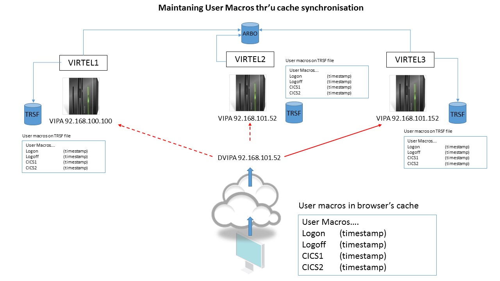
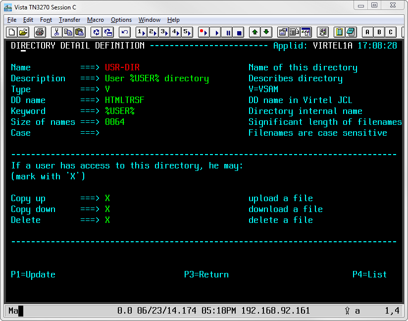
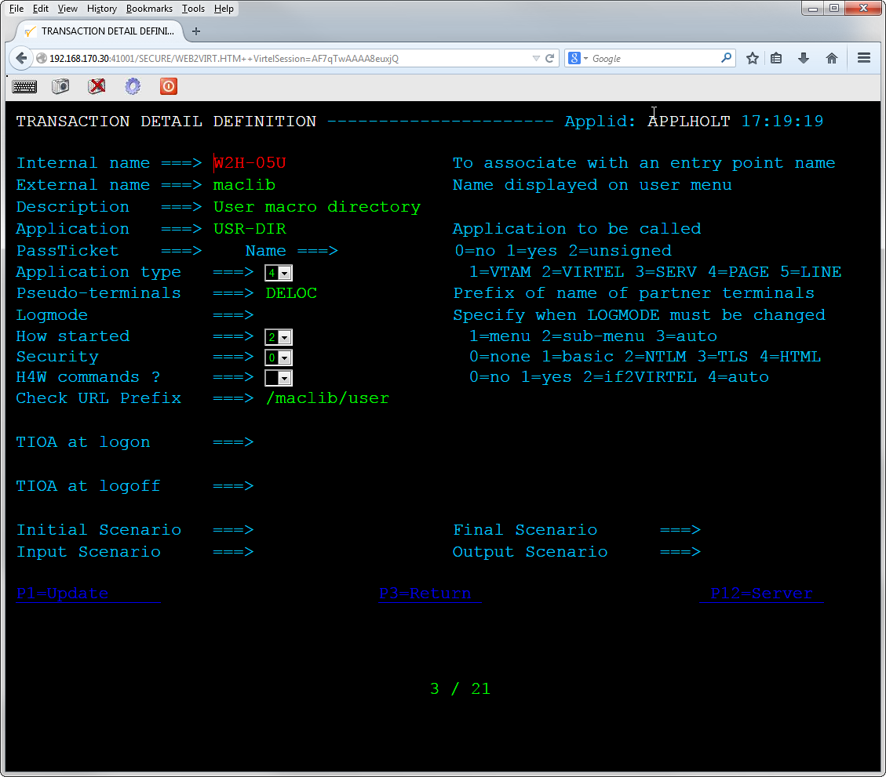
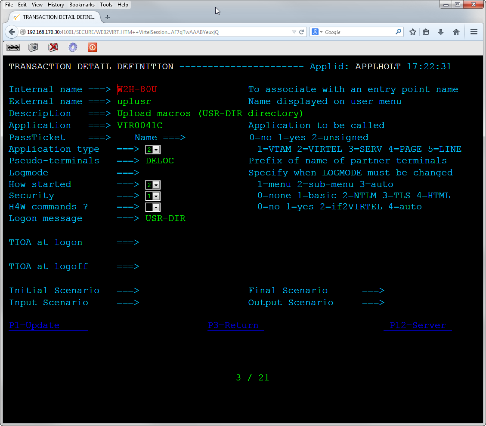
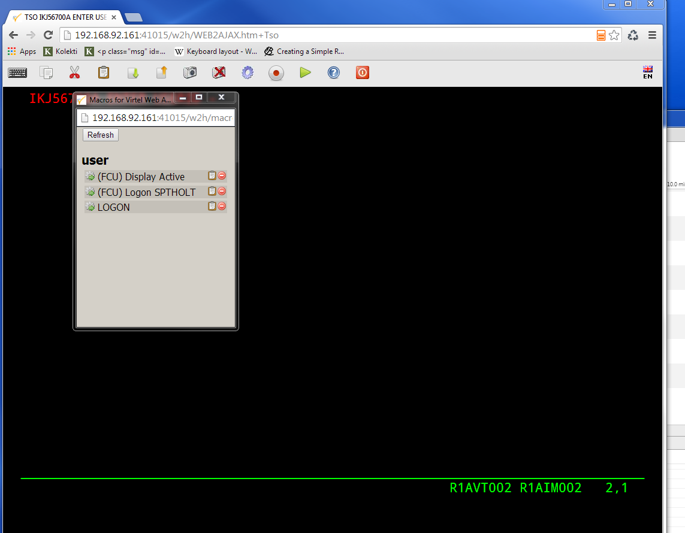
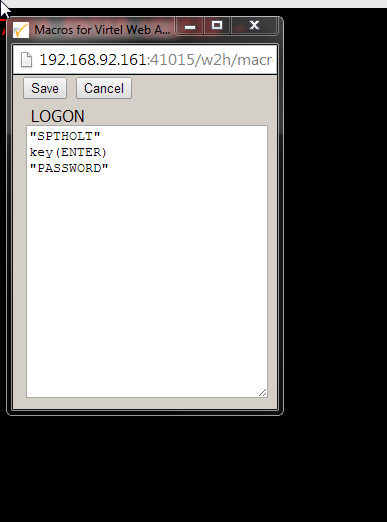

Sharing user macros across multiple instances of Virtel
=======================================================

Update PTF5056 introduced the sharing of user macros across multiple
instances of Virtel. This feature is particularly useful where a user
can connect to one of several instances of Virtel within in Sysplex
Distributed environment.

In the following scenario a user sessions can be directed to one of
three Virtel instances through the distributing Sysplex Distributor.

|User Macros|

User macros are maintained in the browser’s cache and in the TRSF files
through the %USR% directory entry defined in the ARBO file. Before
PTF5056, if the user added or updated a macro and then reconnected to a
different Virtel instance the macro entry maintained in the TRSF
wouldn’t reflect the latest updates, consequently any cache refresh
would lose those updates.

With PTF5056, a timestamp is used to synchronize user macros between the
browser’s cache and any local TRSF file that the user connects to. If
the timestamp in the cache is later than the macro entry in the local
TRSF file, the TRSF file will be updated. Conversely, if the macros in
the local TRSF is later than the cache equivalent, then the macro will
be reloaded in cache from the TRSF file.

Implementation of synchronized user macros requires that the USR-DIR
directory should be defined. See the following example.

|image1|

Also, the following transactions need to be defined in the W2H end
point:-

W2H-05U – maclib

|image2|

W2H-80U – uplusr

|image3|

Once these definitions are in place in the ARBO file and the UPDT5056
has been uploaded to your W2H-DIR you should be able to synchronize
macros across instances of Virtel.

Opening the Virtel macro pad should reveal the macros held within the
USR-DIR.

|image4|

The USER list in the above example has three macros. The small icons on
the right against each macro are “Edit” and “Delete” respectively.

Clicking the “Edit” icon will open a work pad where the macro can be
edited. Changes can then be saved or cancelled.

|image5|

Any changes made will be refelcted back to the local TRSF file. If a
subsequent logon is targeted to a different Virtel instance, and
consequently a different local TRSF, then the cache in the the browser
will updated the local TRSF file as the timestamp in the browser for the
macro will be later than the timestamp held in the TRSF file.

