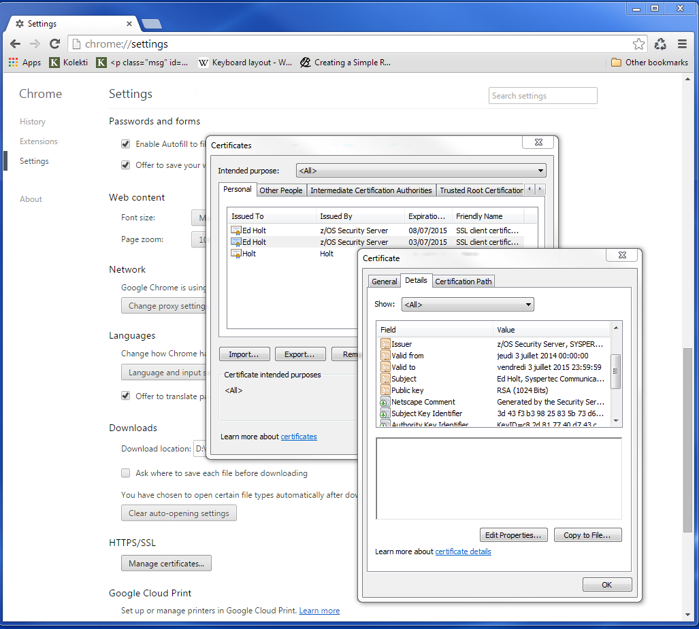
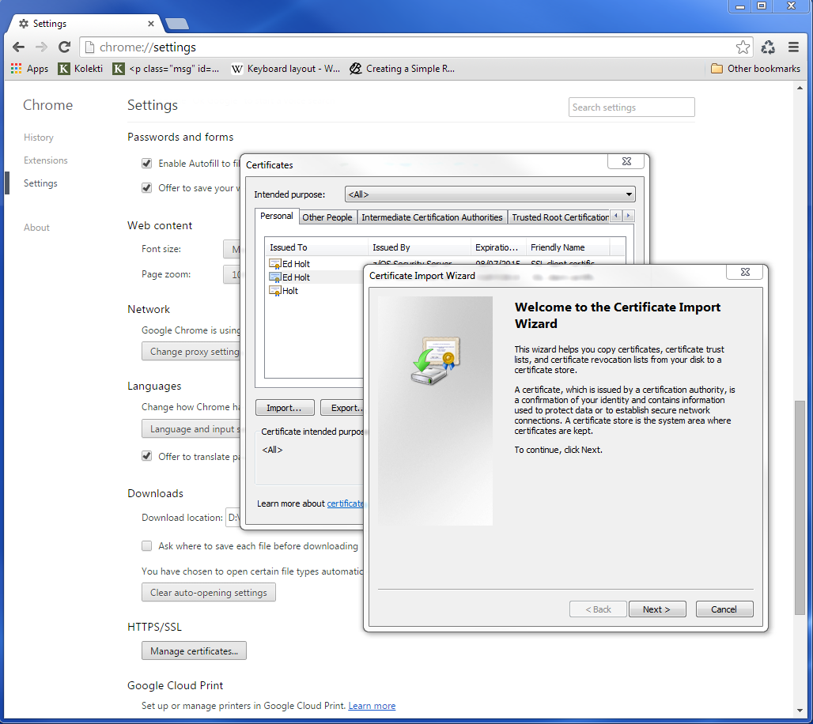
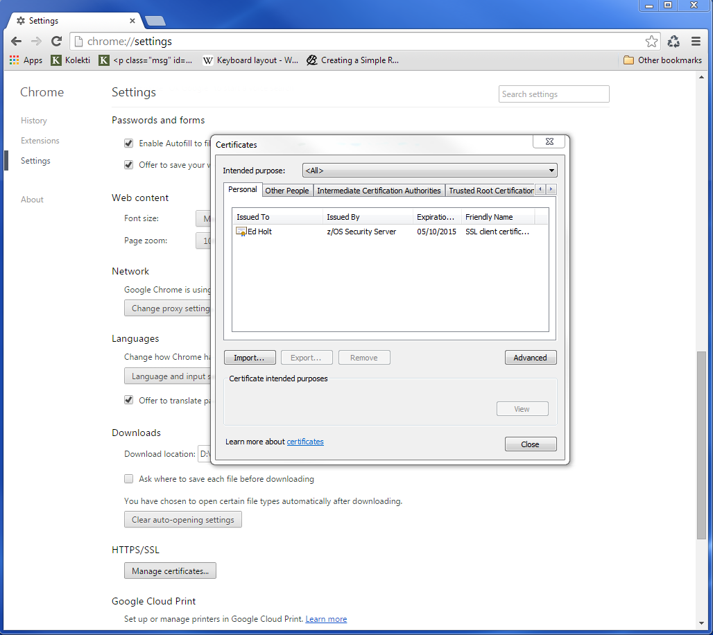
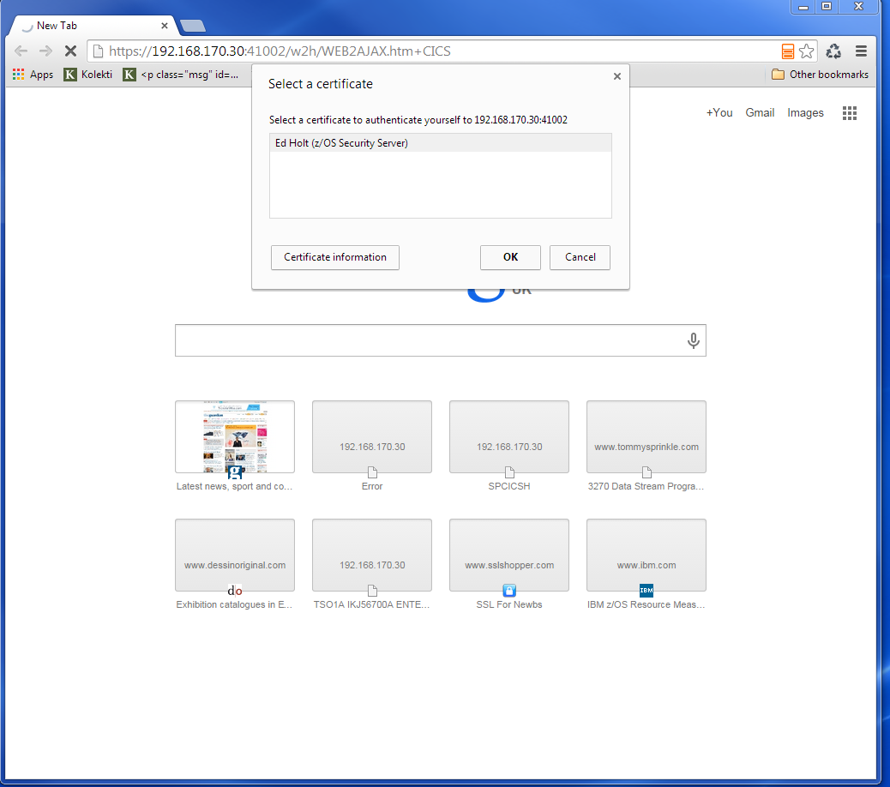
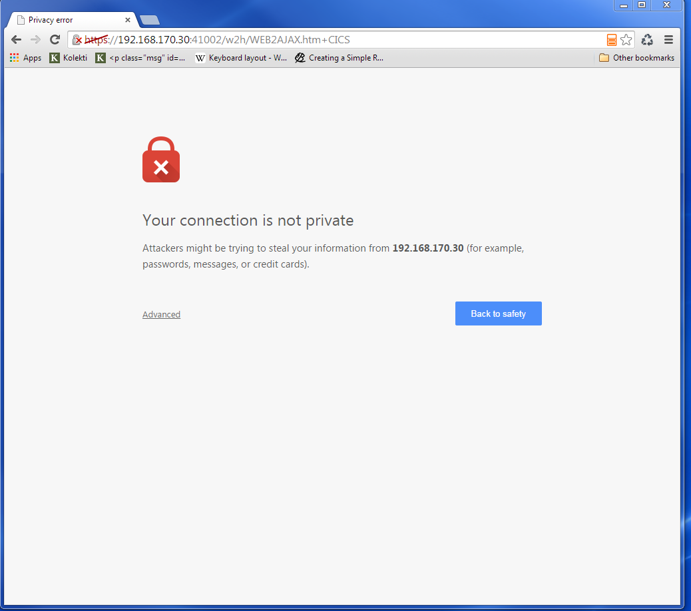
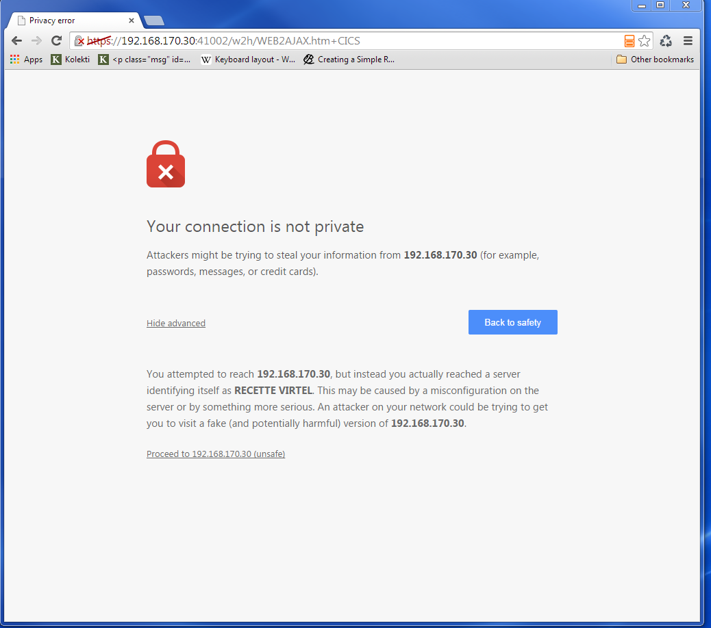
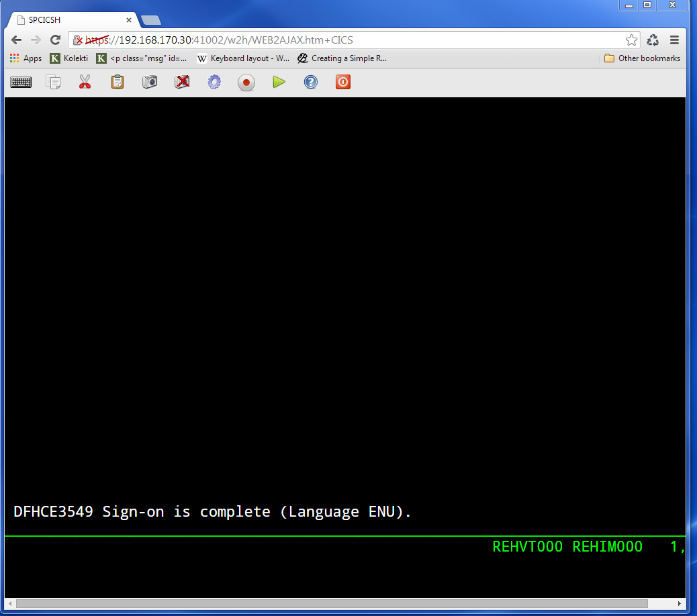

Virtel Security. Using server and client certificates
=====================================================

In this newsletter we look at setting up Virtel to work with client and
user certificates and to effectively remove the need for a user to
provide a user id and password. This is equivalent to the Express Logon
Feature (ELF) provided by Host on Demand and other telnet clients.

First, let’s review what is going on behind the scenes with certificate
authentication and X.509 certificate validation within TLS/SSL. The
guiding principle here is that Public Key Infrastructure (PKI) requires
that data encrypted with a public key can only be decrypted with a
private key and data encrypted with a private key can only be decrypted
with a public key. The secure session (https) that runs between the
browser and Virtel uses the Application Transparent Transport Layer
Security feature of z/OS Communications Server, also known as AT-TLS.
AT-TLS allows socket applications to access encrypted sessions by
invoking Secure Socket Layer (SSL) within the transport layer of the
TCP/IP stack. A policy agent (PAGENT) is used to configure AT-TLS using
parameter statements which will determine which sessions are to use
AT-TLS.

AT\_TLS inserts itself in the connection between the application and
browser. This means that the application will send and receive clear
text over the socket interface, but data over the network is encrypted
by system SSL. System SSL has three supported protocol levels:

TLSv1

SSLv2

SSLv3

In this configuration we will be using SSLv3.

The server / client process, which in Virtel’s case is the Virtel
started task (server) and the browser (client), implements the following
SSL protocol or handshake during the “hello” phase of establishing a
secure session:

1. The Client contacts the Server ;

2. The Server sends a certificate;

3. Server authentication is performed by the Client ;

4. Client sends the certificate;

5. Client authentication is performed by the Server ;

6. An encryption algorithm and single key is chosen to encrypt / decrypt
   data

The purpose of the authentication is to ensure that the server/client
are in fact who they say they are. This is to ensure that they
server/client private and public keys haven’t been stolen and are
purporting to be an entity that they aren’t and thereby compromising
security. Authentication uses X.509 digital certificates. Further
details of this handshake and the certificate exchange can be found in
Appendix B. TLS/SSL Security z/OS Communications Server: IP
Configuration Guide.

**Certificates **

What’s in a X.509 certificate?

Amongst other things it includes the Distinguished Name of the Server
(DNS), the public key of the Server, Distinguished Name of the Server
organization issuing the certificate and the issuer’s signature. If we
look at a certificate held with RACF we can see this information.
Certificates are identified by a combination of LABEL, USERID or
Certification Authority (CA).

READY

**RACDCERT ID(SPVIRSTC) LIST(LABEL('VIRTEL SSL DEMO')) **

Digital certificate information for user SPVIRSTC:

Label: VIRTEL SSL DEMO

Certificate ID: 2Qji1+XJ2eLjw+XJ2ePF00Di4tNAxMXU1kBA

Status: TRUST

Start Date: 2014/07/08 00:00:00

End Date: 2015/07/08 23:59:59

Serial Number:

>05<

Issuer's Name:

>CN=z/OS Security Server.O=SYSPERTEC.C=FR<

Subject's Name:

>CN=RECETTE VIRTEL.T=VIRTEL Web Access.O=SYSPERTEC.C=FR<

Key Usage: HANDSHAKE, DATAENCRYPT

Key Type: RSA

Key Size: 1024

Private Key: YES

Ring Associations:

Ring Owner: SPVIRSTC

Ring:

>VIRTRING<

Similar details can be found in the browser settings. For example here
is what Chrome displays in the HTTPS/SSL certificate database.

|image0|

**Types of certificates.**

Client certificate

Server certificate

Well-known Certificate Authority (CA) Signing certificate

RACF signing certificate

In this configuration we will be using self-signed server and client
certificates. In most installation you would use server and client
certificates signed by a well-known CA. These well-known CA certificates
are normally available in the RACF and browser key data bases.

**Configuring the certificates**

The first step is to create the necessary certificates. We require a
server certificate, a RACF signing certificate and a user certificate.

In the Virtel SAMPLIB there is a member called SSLSETUP. This will
initialize the SSL environment and create the RACF signing certificate.
Some of the steps may or may not be relevant so you will need to
customize SSLSETUP accordingly. For example, you might already be
running the PAGENT started task and have RACF definitions in place to
support the required SSL access.

The following is the certificate generation statement for the RACF
signing certificate.

//DCERTCA EXEC PGM=IKJEFT01

//SYSTSPRT DD SYSOUT=\*

//SYSTSIN DD \*

/\*-----------------------------------------------------------------\*/

/\* Delete previous signing certificate \*/

/\*-----------------------------------------------------------------\*/

RACDCERT CERTAUTH +

DELETE(LABEL('z/OS signing certificate'))

//\*-------------------------------------------------------------------\*

//\* CCERTCA : CREATE SIGNING CERTIFICATE \*

//\*-------------------------------------------------------------------\*

//CCERTCA EXEC PGM=IKJEFT1A

//SYSTSPRT DD SYSOUT=\*

//SYSTSIN DD \*

/\*-----------------------------------------------------------------\*/

/\* Create a signing certificate \*/

/\*-----------------------------------------------------------------\*/

RACDCERT CERTAUTH +

GENCERT +

WITHLABEL('z/OS signing certificate') +

SUBJECTSDN( +

CN('z/OS Security Server') +

O('SYSPERTEC') +

C('FR')) +

KEYUSAGE(CERTSIGN) SIZE(1024) +

NOTAFTER(DATE(2026-06-30))

If we list the certificate after we have created it will get the
following:-

READY

**RACDCERT CERTAUTH LIST(LABEL('z/OS signing certificate')) **

Digital certificate information for CERTAUTH:

Label: z/OS signing certificate

Certificate ID: 2QiJmZmDhZmjgalh1uJAoomHlYmVh0CDhZmjiYaJg4GjhUBA

Status: TRUST

Start Date: 2013/07/03 00:00:00

End Date: 2026/06/30 23:59:59

Serial Number:

>00<

Issuer's Name:

>CN=z/OS Security Server.O=SYSPERTEC.C=FR<

Subject's Name:

>CN=z/OS Security Server.O=SYSPERTEC.C=FR<

Key Usage: **CERTSIGN**

Key Type: RSA

Key Size: 1024

Private Key: YES

Ring Associations:

Ring Owner: SPVIRSTC

Ring:

>VIRTRING<

The key usage identifies this certificate as a signing certificate. This
certificate will be used to sign other certificates that we generate.

Next is the server certificate. Again we use RACF to generate the
certificate and use the RACF signing certificate to “sign” it. The
following extract is from the Virtel SAMPLIB member SSLUCERT.

//CCERTIF EXEC PGM=IKJEFT1A

//SYSTSPRT DD SYSOUT=\*

//SYSTSIN DD \*

/\*-----------------------------------------------------------------\*/

/\* Create a digital certificate \*/

/\*-----------------------------------------------------------------\*/

RACDCERT ID(SPVIRSTC) /\* VIRTEL userid \*/ +

GENCERT +

WITHLABEL('VIRTEL SSL DEMO') +

**SIGNWITH(CERTAUTH LABEL('z/OS signing certificate')) + **

SUBJECTSDN( +

CN('RECETTE VIRTEL') +

T('VIRTEL Web Access') +

O('SYSPERTEC') +

C('FR')) +

KEYUSAGE(HANDSHAKE DATAENCRYPT) SIZE(1024)

Note how we identify the signing certificate with the SIGNWITH parameter
using the same label information that we used when defining the RACF
signing certificate.

**Key rings**

Having generated two of our certificates we now need a place to keep
them. We place the certificates on a key ring and associate the key ring
with the VIRTEL server RACF user id (in our case SPVIRSTC). The member
SSLSETUP has some RACF commands to perform the key ring generation. Here
is an extract:

/\*-----------------------------------------------------------------\*/

/\* Create a keyring \*/

/\*-----------------------------------------------------------------\*/

RACDCERT ID(SPVIRSTC) /\* VIRTEL userid \*/ +

ADDRING(VIRTRING)

/\*-----------------------------------------------------------------\*/

/\* Add the certificate to the keyring \*/

/\*-----------------------------------------------------------------\*/

RACDCERT ID(SPVIRSTC) /\* VIRTEL userid \*/ +

CONNECT( +

ID(SPVIRSTC) +

**LABEL('VIRTEL SSL DEMO') + **

RING(VIRTRING) +

DEFAULT)

Again it is the label that identifies the key(certificate) that we want
to add to the key ring owned by user SPVIRSTC.

**User Certificate**

The next step is to create a user certificate which we will export and
import into our browser’s key data base. In the Virtel SAMPLIB member
SSLUCERT performs the task of creating the user certificate and creating
an “exportable” file.

//DCERTIF EXEC PGM=IKJEFT01

//SYSTSPRT DD SYSOUT=\*

//SYSTSIN DD \*

/\*-----------------------------------------------------------------\*/

/\* Delete previous digital certificate \*/

/\*-----------------------------------------------------------------\*/

RACDCERT ID(SPTHOLT) /\* client userid \*/ +

DELETE(LABEL('SSL client certificate'))

//\*-------------------------------------------------------------------\*

//\* UCERTIF : CREATE DIGITAL CERTIFICATE FOR USER \*

//\*-------------------------------------------------------------------\*

//UCERTIF EXEC PGM=IKJEFT1A

//SYSTSPRT DD SYSOUT=\*

//SYSTSIN DD \*

/\*-----------------------------------------------------------------\*/

/\* Create a digital certificate \*/

/\*-----------------------------------------------------------------\*/

RACDCERT ID(SPTHOLT) /\* client userid \*/ +

GENCERT +

WITHLABEL('SSL client certificate') +

**SIGNWITH(CERTAUTH LABEL('z/OS signing certificate')) + **

SUBJECTSDN( +

CN('Ed Holt') /\* client name \*/ +

O('Syspertec Communication') /\* company name \*/ +

C('France')) /\* country \*/ +

KEYUSAGE(HANDSHAKE) SIZE(1024)

/\*-----------------------------------------------------------------\*/

/\* Export the digital certificate and private key \*/

/\*-----------------------------------------------------------------\*/

RACDCERT ID(SPTHOLT) /\* client userid \*/ +

EXPORT(LABEL('SSL client certificate')) +

FORMAT(PKCS12DER) +

DSN(SPTHOLT.P12) +

PASSWORD('azj77sdmlizczxerghgbiadbbdbxnbsnbxiazb')

Again we sign the certificate with our RACF signing certificate. The
user certificate is also exported to a flat file – SPTHOLT.P12 in our
example (you can use your own naming conventions). This file must be
downloaded to the client workstation in binary mode and imported into
the browser’s key data base.

Note that the exported certificate is associated with a password. This
password will be required when importing the certificate on the client
workstation.

The final thing to do is to add the user certificate and the signing
certificate to the key ring associated with the Virtel server task user
id.

//\*-------------------------------------------------------------------\*

//\* Associate certificate with user id \*

//\*-------------------------------------------------------------------\*

//UCERTIF EXEC PGM=IKJEFT1A

//SYSTSPRT DD SYSOUT=\*

//SYSTSIN DD \*

/\*-----------------------------------------------------------------\*/

/\* Add certificate to Server ring \*/

/\*-----------------------------------------------------------------\*/

RACDCERT ID(SPVIRSTC) /\* client userid \*/ +

CONNECT (CERTAUTH +

**LABEL('z/OS signing certificate') + **

RING(VIRTRING) +

USAGE(CERTAUTH))

/\*-----------------------------------------------------------------\*/

/\* Add certificate to Server ring \*/

/\*-----------------------------------------------------------------\*/

RACDCERT ID(SPVIRSTC) /\* client userid \*/ +

CONNECT (ID(SPTHOLT) +

**LABEL('SSL client certificate') + **

RING(VIRTRING) +

USAGE(CERTAUTH))

/\*-----------------------------------------------------------------\*/

/\* Refresh the RACF profiles \*/

/\*-----------------------------------------------------------------\*/

SETROPTS RACLIST(DIGTRING) REFRESH

SETROPTS RACLIST(DIGTCERT) REFRESH

The “CONNECT CERTAUTH” tells RACF that this is a signing CA certificate
and the “CONNECT ID(SPTHOLT) indicates that the certificate labelled
‘SSL client certificate’ is associated with USERID SPTHOLT. This is how
Virtel obtains the USERID. Also, note that we refresh the RACF profiles
related to certificates and key rings.

If we list our key ring for user SPVIRSTC we should have three
certificates.

READY

**RACDCERT ID(SPVIRSTC) LISTRING(VIRTRING) **

Digital ring information for user SPVIRSTC:

Ring:

>VIRTRING<

Certificate Label Name Cert Owner USAGE DEFAULT

-------------------------------- ------------ -------- -------

VIRTEL SSL DEMO ID(SPVIRSTC) PERSONAL YES

z/OS signing certificate CERTAUTH CERTAUTH NO

SSL client certificate ID(SPTHOLT) CERTAUTH NO

**Importing the certificate on the client work station.**

To import the user certificate into the client workstation the P12 file
must be downloaded in binary and then the certificate import wizard is
run to import the certificate.

|image1|

After importing the following panel is displayed:-

|image2|

At this stage we have completed our certificate generation. Through the
use of the certificates we will be able to initiate a secure session
(https) with an application and obtain a user id.

**
PassTicket support**

The next step is to obtain a pass ticket in place of a password so that
Virtel can log on to the target application and present a user id and
password combination on behalf of the user. The following job will
enable PassTicket support for our target application SPCICSH and using
user id SPVIRSTC, out Virtel server user id. This job will have to be
customized accordingly:

//STEP1 EXEC PGM=IKJEFT1A,DYNAMNBR=20

//\* RDEFINE FACILITY IRR.RTICKETSERV

//SYSTSPRT DD SYSOUT=\*

//SYSTSIN DD \*

SETROPTS CLASSACT(APPL)

SETROPTS CLASSACT(PTKTDATA)

SETROPTS RACLIST(PTKTDATA)

SETROPTS GENERIC(PTKTDATA)

RDEFINE FACILITY IRR.RTICKETSERV

RDELETE PTKTDATA SPCICSH

RDELETE PTKTDATA IRRPTAUTH.SPCICSH.\*

RDEFINE PTKTDATA IRRPTAUTH.SPCICSH.\* UACC(NONE)

RDEFINE PTKTDATA **SPCICSH** SSIGNON(KEYMASKED(998A654FEBCDA123)) +

UACC(NONE)

//STEP1 EXEC PGM=IKJEFT1A,DYNAMNBR=20

//SYSTSPRT DD SYSOUT=\*

//SYSTSIN DD \*

PERMIT IRR.RTICKETSERV CL(FACILITY) ID(\ **SPVIRSTC**) ACC(READ)

PERMIT IRRPTAUTH.SPCICSH.\* CL(PTKTDATA) ID(SPVIRSTC) ACC(UPDATE)

SETROPTS REFRESH RACLIST(PTKTDATA)

SETROPTS REFRESH RACLIST(FACILITY)

In order for Virtel to generate PassTickets, you must also modify your
VIRTCT to include the parameter PASSTCK=YES and then reassemble the
VIRTCT. See chapter 6 of the Virtel Installation Guide for more details
on the Virtel VIRTCT.

**
PAGENT Configuration**

To enable system SSL sessions to take place between the browser and the
application we have to tell AT-TLS and SSL which sockets to intercept.
This is configured in the pagent configuration file which can be found
in /etc/pagent.conf. The two areas that we are interested in are the
TTLSEnvironmentAction section and the TTLSRule section.

TTLSEnvironmentAction **VIRTELenvir\_inSec**

{

HandshakeRole ServerWithClientAuth

Trace 7

TTLSKeyringParms

{

Keyring VIRTRING

}

TTLSEnvironmentAdvancedParms

{

SSLv2 On

SSLv3 On

TLSv1 On

ClientAuthType SAFCheck

}

TTLSCipherParmsRef VIRTELcipher

}

…………

…………

…………

TTLSRule VIRTELrule\_in\_eh

{

Jobname SPVIREH

LocalPortRange 41002

Direction Inbound

TTLSGroupActionRef VIRTELgroup

TTLSEnvironmentActionRef **VIRTELenvir\_inSec**

}

The TTLS Rule identifies Virtel Started task name via the Jobname
parameter and also the port number that can support secured sessions \_
https. In this case it is port 41002.

The rules section also identifies the environmental section. In this
case we have selected an environment section called VIRTELenvir\_insec.

In VIRTELenvir\_insec we identify that we want to use both server and
client certificates –

*HandShakeRole ServerWithClientAuth *

That the user certificate must be associated with a valid RACF userid –

*ClientAuthType SAFCheck*

The name of the keyring that holds the keys(certificates)

*Keyring VIRTRING*

A default pagent.conf is shipped with the SAMPLIB member SSLSETUP which
you can use to modify accordingly to define the above SSL sections.

To refresh a pagent.conf profile after you have made changes you can
issue the following z/OS command:-

F PAGENT,REFRESH

**
Virtel Configuration**

The final part in our configuration is to configure Virtel to use SSL to
obtain the user id and PassTicket support to create a password. We
configure Virtel in the transaction associated with our target
application, in this case the CICS application called SPCICSH.

|image3|

Note that PassTicket is set to 2. This will enable Virtel to generate a
temporary password. Security is set to 3. This indicates that Virtel
will receive a USERID based upon the user certificate used in the
authentication process. The TIOA at logon is a string that will logon to
the CICS application using the user id and password values that Virtel
has obtained.

With this configuration we can logon to our CICS application without the
user presenting any user id or password. This is very much like the
Express Logon Facility implemented in our Telnet clients.

**
Logon Example **

In the following screen shots we demonstrate logging into a CICS
application via a secure session (https) without specifying any user
id/password. Our initial URL is

https://192.168.170.30:41002/w2h/WEB2AJAX.htm+CICS; you will replace the
IP address with your own installation IP address or domain name.

|image4|

We are presented with a «  Select a certificate » window from the
browser requesting the certificate we wish to user for authenication
purposes. We select the certificate we downloaded.

The next panel is a warning panel which identifes that the certificate
we are using has not been authenticated by a well-known CA authority. We
are of course aware of this as we are using a RACF self signed
certifcate.

|image5|

We select Advanced and are then presented with information about the
certifciate.

|image6|

We select the “Proceed” link.

|image7|

We are signed into CICS without having to specify any user id or
password.

**Problems**

It is easy to miss something when configuring user certificate sign on.
Here are some general guidelines that should help in debugging
configuration errors.

1. Is AT-TLS active.

Issue the following z/OS command – D TCPIP,,N,TTLS

The response should be :-

EZD0101I NETSTAT CS V1R13 TCPIP 706

TTLSGRPACTION GROUP ID CONNS

VIRTELGROUP 00000002 3

1 OF 1 RECORDS DISPLAYED

END OF THE REPORT

1. PAGENT return codes

Common session startup/handshake errors are reported through messqge
EZD1287I. In the example below we can see that the handshake has failed
with a return code of 5003. Return codes under 5000 are generated by
System SSL and are defined in the System SSL Programming manual. Return
codes over 5000 are generated by AT-TLS and are defined in the IP
Diagnosis Guide. In the following the 5013 suggests that the browser has
sent clear text; in other words, http was used instead of https in the
URL.

BPXF024I (TCPIP) Oct 7 13:33:08 TTLS 83951769 : 15:33:08 TCPIP 367

EZD1281I TTLS Map CONNID: 000006A2 LOCAL: 192.168.170.30..41002

REMOTE: 192.168.92.62..57545 JOBNAME: SPVIREH USERID: SPVIRSTC TYPE:

InBound STATUS: Enabled RULE: VIRTELrule\_in\_eh ACTIONS: VIRTELgroup

VIRTELenvir\_inSec \*\*N/A\*\*

BPXF024I (TCPIP) Oct 7 13:33:08 TTLS 83951769 : 15:33:08 TCPIP 368

EZD1286I TTLS Error GRPID: 00000002 ENVID: 00000000 CONNID: 000006A2

LOCAL: 192.168.170.30..41002 REMOTE: 192.168.92.62..57545 JOBNAME:

SPVIREH USERID: SPVIRSTC RULE: VIRTELrule\_in\_eh RC: 5003 Data

Decryption

**EZD1287I TTLS Error RC: 5003 Data Decryption 369 **

LOCAL: 192.168.170.30..41002

REMOTE: 192.168.92.62..57545

JOBNAME: SPVIREH RULE: VIRTELrule\_in\_eh

USERID: SPVIRSTC GRPID: 00000002 ENVID: 00000000 CONNID: 000006A2

Common PAGENT return codes:-

7 No certificate

8 Certificate not trusted

109 No CA certificates on ring

202 Keyring does not exists

401 Certificate expired

402/12 Client and server cannot agree cipher suite

416 Virtel does not have permission to list keyring

431 Certificate is revoked

434 Certificate key not compatible with cipher suite

435 Certificate authority unknown

    5003 Browser sent clear text.

1. Virtel messages

VIRHT57E LINE IS NOT SET UP FOR HTTPS

    This means that the browser has sent encypted text (https) but that
    AT-TLS has not decrypted it before sending it to VIRTEL. The PAGENT
    rules haven’t correctly identified this port as a SSL jobname/port.
    Check the /etc/pagent.conf member. The message is a bit misleading
    as there is no line setup required by Virtel.

    Normally AT-TLS is transparent to VIRTEL. AT-TLS performs the
    decryption and transforms the https request into an http request
    before passing it to VIRTEL. The only case where VIRTEL is AT-TLS
    aware is when the VIRTEL transaction definition specifies SECURITY=3
    (TLS) and in this case VIRTEL will check that the session has been
    processed by AT-TLS and will issue an IOCTL to obtain the userid
    associated with the certificate.

    In the normal case, you should specify HandshakeRole Server,
    ClientAuthType Full, and ApplicationControlled Off in the AT-TLS
    rules, as in the example in VIRT447.SAMPLIB(SSLSETUP). VIRTEL does
    not issue an IOCTL to turn decryption on and off, so if you
    specified ApplicationControlled On then you would get VIRHT57E
    because AT-TLS has not been instructed to start decryption.

    If you still get an error when you have ApplicationControlled Off
    then we will need to see the SYSLOG (for the EZD TTLS messages), the
    JESMSGLG from the VIRTEL started task, and the SYSPRINT resulting
    from a z/OS command F VIRTEL,SNAP immediately after the error
    occurs. We would also like to see the exact URL which was entered at
    the browser, as well as the AT-TLS pagent.conf file.

**
z/OS IBM References**

• **SA22-7683 Security Server: RACF Security Administrator's Guide**

Chapter 21. RACF and Digital Certificates

• **SC24-5901 Cryptographic Services: System SSL Programming**

Chapter 12. Messages and Codes

• **SC31-8775 Communications Server: IP Configuration Guide**

Chapter 14. Policy-based networking

Chapter 18. Application Transparent Transport Layer Security (AT-TLS)
data protection

• **SC31-8776 Communications Server: IP Configuration Reference**

Chapter 21. Policy Agent and policy applications

• **GC31-8782 Communications Server: IP Diagnosis Guide**

Chapter 28. Diagnosing Application Transparent Transport Layer Security
(AT-TLS)

• **SC31-8784 Communications Server: IP Messages: Volume 2**

Chapter 10. EZD1xxxx messages

**Virtel References**

-  **VIRTEL Installation Guide**

PASSTCK parameter Page 66

-  **VIRTEL Connectivity Reference**

Transactions – PassTicket Parameter Page 93

Transactions – Security Parameter Page 94

-  **VIRTEL Web Access Guide**

Security – Data encryption by SSL Page 244

.. |image3| image:: images/media/image4.png

