Dynamic Directory Interface (DDI)
=================================

In this newsletter we discuss Virtel’s Dynamic Directory Interface, or
DDI and the new Administration GUI panel that can be used to perform
Virtel configuration. Some of these features are only available with
Virtel V4.54.

**Virtel Administrators**

The DDI and administration features should only be available to a Virtel
Administrator. A Virtel Administrator is defined through security
profiles. For example, with RACF, a user who had READ access to the
FACILITY profile VIRTEL.\* would be considered a super user or top level
administrator as they have total access to all VIRTEL transactions.
Likewise an administrator who only requires responsibility for managing
DDI would be restricted to a subset of Virtel transactions through RACF
profiles. See *Chapter 6 Security* in the *VIRTEL Installation guide*
for more details. By default a user has no access to any of the
administration transactions.

Dynamic directories use the symbolics %user% and %group% to determine
the directory name. Static directories, as defined in the ARBO load
configuration use the names USR-DIR, GRP-DIR and GLB-DIR.

Administration with Admin (HTML)
--------------------------------

Virtel now supports a GUI Administration from the Portal from where
configuration work can be performed. Selecting the Admin (HTML) will
display the home administration panel.

|image0|

As with the Admin (3270) screen, the same configuration functions can be
performed. For example, to list the lines select the lines button in the
top left corner. A list of lines will be displayed as displayed in the
next panel.

Selecting an entry will bring up an operations window from where an
operation can be selected. In this case it is Edit, Delete or Terminals
to list the associated terminals.

|image1|

If Edit is selected the parameters/options for the selected line entry
will be displayed.

|image2|

Additional operations are displayed in the top right of the edit display
window. Move the mouse over the icons to reveal the tool tips. For the
line edit these are Update, Terminals, Rules and Add.

|image3|

Refer to the Virtel Connectivity Users Guide for details of the
parameters and options for the Lines, Terminals and Entry Points.

**Working with Directories**

From the configuration Home Page you can select Directories to view the
directories defined to Virtel. The following is an example of a
directory list.

|image4|

Again, by selecting an entry we can Edit/Add, List the associated
elements or Delete the directory. The list operation will list all the
elements associated with the directory plus provide further operations
at an element level.

|image5|

The additional operations here are REFRESH, BATCH and EXPORT. Selecting
an individual entry brings up an operational panel which will enable me
to Copy or Delete the selected file. If BATCH has been selected then I
can perform a Batch copy all the entries I have selected.

The EXPORT option will export the selected entry details as an EXCEL
spread sheet. This can be used in a Change Management process.

**Batch Operations**

The Admin(HTML) also supports batch functions within some of its
operations. To copy a group of files from one directory to another use
the batch icon:-

|image6|

Selecting the batch ICON will bring up an element list where elements
for the operation can be selected.

|image7|

One the operation has been selected a confirmation panel will be
displayed. Selecting “YES” will invoke the operation. In the above
example we are copying elements from the CLI-DIR to the GLB-DIR
directory.

Dynamic Directory Interface
---------------------------

The DDI interface is intended for Virtel administrators who will manage
and perform Virtel configuration work on the Virtel elements held within
a user, group and global directory structure defined within DDI. These
elements consist of captured 3270 macros in the form of JSON arrays,
Java Script modules, presentation modules, aka scenarios or any other
suitable file structure that an administrator wishes to make available
to users. Although there appears to be a hierarchical order within the
DDI structure the directories are very much dynamic and have no
connection with higher or lower level structures. An administrator is
free to copy elements into any DDI structure level. For purposes of
design it might be wise to consider DDI as a hierarchical structure
although, as mentioned before, this is not enforced by Virtel. A DDI
layout could look something like:-

**Global/Public**

**\|**

**Group A Group B Group C**

**\| \| \|**

**User01 User02 User03 User05 User07 User08**

**Setting up to use DDI**

All of the ARBO constructs to support DDI are defined in VMACROS section
of the SAMPLIB(ARBOLOAD) member. You must customize the JCL and change
the SET VMACROS=NO statement to SET VMACROS=YES to install the DDI
constructs to your ARBO file.

***Note: Release V4.53 users of Macros***

*For users who implemented DDI in Virtel V4.53 (VMACROS=YES on the
ARBOLOAD) there are some changes that have to be made to the ARBO file
to work with DDI as distributed with V4.54. New constructs must be added
to the ARBO file and previous DDI constructs must be removed:-*

1. *Secure a copy of your macros.json from the /maclib directories.*

2. *Remove*

    *DDI constructs that used /maclib directory. 05A, 05U, 05G. *

    *These were allocated a transaction range of W2H-05\* (WEBHOST) and
    CLI-05\* (CLIHOST) in previous Virtel releases. These will have to
    be deleted manually using either the 3270 or the HTML administration
    portal.*

1. *Add*

    *Add the new DDI constructs by running the latest SAMPLIB(ARBOLOAD)
    with just VMACROS=YES. This will create the new CLI-03\* and
    W2H-03\* constructs. *

    *See the entries in the VMACROS section of the V4.54
    SAMPLIB(ARBOLOAD) member.*

    *If your macros are in local storage then they will automatically
    populated to the new DDI constructs – USER, GROUP and GLOBAL,
    otherwise upload (Drag and drop) them from you saved copies using
    the administration DDI and macros interface. *

**RACF Profiles**

RACF profiles must also be defined to restrict DDI usage to Virtel
administrators. In our example VIRTEL administrators are defined in the
RACF group SPGPTECH.

//\*---------------------------------------------------------\*

//\* RACF : AUTHORIZATIONS FOR VIRTEL DDI \*

//\*---------------------------------------------------------\*

//STEP1 EXEC PGM=IKJEFT01,DYNAMNBR=20

//SYSTSPRT DD SYSOUT=\*

//SYSTSIN DD \*

/\*-------------------------------------------------------\*/

/\* Setup for DDI \*/

/\*-------------------------------------------------------\*/

RDEF FACILITY SPVIRPLI.W2H-03G UACC(NONE) /\* W2H \*/

RDEF FACILITY SPVIRPLI.W2H-03U UACC(NONE) /\* W2H \*/

RDEF FACILITY SPVIRPLI.W2H-03A UACC(NONE) /\* W2H \*/

RDEF FACILITY SPVIRPLI.CLI-03G UACC(NONE) /\* CLI \*/

RDEF FACILITY SPVIRPLI.CLI-03U UACC(NONE) /\* CLI \*/

RDEF FACILITY SPVIRPLI.CLI-03A UACC(NONE) /\* CLI \*/

RDEF FACILITY SPVIRPLI.W2H-07 UACC(NONE) /\* W2H \*/

RDEF FACILITY SPVIRPLI.W2H-66 UACC(NONE) /\* W2H \*/

RDEF FACILITY SPVIRPLI.W2H-80U UACC(NONE) /\* W2H \*/

RDEF FACILITY SPVIRPLI.W2H-80G UACC(NONE) /\* W2H \*/

RDEF FACILITY SPVIRPLI.W2H-80A UACC(NONE) /\* W2H \*/

RDEF FACILITY SPVIRPLI.USR-DIR UACC(NONE) /\* W2H \*/

RDEF FACILITY SPVIRPLI.GRP-DIR UACC(NONE) /\* W2H \*/

RDEF FACILITY SPVIRPLI.GLB-DIR UACC(NONE) /\* W2H \*/

PE SPVIRPLI.W2H-03G CL(FACILITY) RESET

PE SPVIRPLI.W2H-03U CL(FACILITY) RESET

PE SPVIRPLI.W2H-03A CL(FACILITY) RESET

PE SPVIRPLI.CLI-03G CL(FACILITY) RESET

PE SPVIRPLI.CLI-03U CL(FACILITY) RESET

PE SPVIRPLI.CLI-03A CL(FACILITY) RESET

PE SPVIRPLI.W2H-07 CL(FACILITY) RESET

PE SPVIRPLI.W2H-66 CL(FACILITY) RESET

PE SPVIRPLI.W2H-80U CL(FACILITY) RESET

PE SPVIRPLI.W2H-80G CL(FACILITY) RESET

PE SPVIRPLI.W2H-80A CL(FACILITY) RESET

PE SPVIRPLI.USR-DIR CL(FACILITY) RESET

PE SPVIRPLI.GRP-DIR CL(FACILITY) RESET

PE SPVIRPLI.GLB-DIR CL(FACILITY) RESET

PE SPVIRPLI.W2H-07 CL(FACILITY) ACC(READ) ID(SPGPTECH)

PE SPVIRPLI.W2H-66 CL(FACILITY) ACC(READ) ID(SPGPTECH)

PE SPVIRPLI.W2H-03G CL(FACILITY) ACC(READ) ID(SPGPTECH)

PE SPVIRPLI.W2H-03U CL(FACILITY) ACC(READ) ID(SPGPTECH)

PE SPVIRPLI.W2H-03A CL(FACILITY) ACC(READ) ID(SPGPTECH)

PE SPVIRPLI.CLI-03G CL(FACILITY) ACC(READ) ID(SPGPTECH)

PE SPVIRPLI.CLI-03U CL(FACILITY) ACC(READ) ID(SPGPTECH)

PE SPVIRPLI.CLI-03A CL(FACILITY) ACC(READ) ID(SPGPTECH)

PE SPVIRPLI.W2H-80U CL(FACILITY) ACC(READ) ID(SPGPTECH)

PE SPVIRPLI.W2H-80G CL(FACILITY) ACC(READ) ID(SPGPTECH)

PE SPVIRPLI.W2H-80A CL(FACILITY) ACC(READ) ID(SPGPTECH)

PE SPVIRPLI.USR-DIR CL(FACILITY) ACC(READ) ID(SPGPTECH)

PE SPVIRPLI.GRP-DIR CL(FACILITY) ACC(READ) ID(SPGPTECH)

PE SPVIRPLI.GLB-DIR CL(FACILITY) ACC(READ) ID(SPGPTECH)

/\*-------------------------------------------------------\*/

/\* REFRESH THE RACF PROFILES \*/

/\*-------------------------------------------------------\*/

SETR REFRESH RACLIST(FACILITY)

/\*

//

**Capability Access.**

It is important to grant administrators capability access to enable
administrators’ access to another user’s element, i.e. user directories.
This access is controlled through the transaction code W2H-66.

**User access**

For security reasons users cannot upload DDI elements into their user or
group structures unless access is provided by the administrator to the
relevant DDI structures through READ access to the transaction
profiles:-

W2H-03W Access to the w2h toolkit directory.

W2H-03x Directory access

W2H-80x Upload access

**Group and User access with Admin HTML and 3270 transactions.**

As the Group and User name have now been replaced with the %user% and
%group% symbolic variable definitions the old Administration
transactions to list the USR-DIR and GRP-DIR are retired. The following
message will appear on the screen if you attempt to list the user and
group directories:-

|image8|

**
Accessing DDI **

Access to DDI is through the Virtel Administration portal Macros and
add-ons section. The Virtel Portal is normally accessible via the url
http://my.virtel.com:41001 where 41001 is the port defined for the
W-HTTP line associated with entry point WEB2HOST.

When you access the Virtel Portal you are presented with the following
screen:

|image9|

To check the setup of DDI, list the allocated directories through either
the Admin (3270) or Admin (HTML) options of the Virtel section. Once in
the main administration page, select directories to display a list of
directories. Check that the User, Group and Global macro directories are
listed.

If instead you use the 3270 admin panel to display the directories you
should see something like this:

|image10|

Here you can see that the GLOBAL, GROUP and USER directories have been
correctly defined in the ARBO update. Note, you cannot list the entries
(PF4) for the Group or User macro directories in this interface. You
must use the DDI interface. Also check that you can list some of the
transactions that support DDI. In the HTML administration panel it
should look something like this:-

|image11|

Again, we can see the DDI transactions W2H-03A, W2H-03G and W2H-03U have
been defined.

Return to the portal page and select Dynamic directory interface from
the Macros and Add-on section. This will take you to the DDI home page.
The following panel will be displayed:-

|image12|

This is the home administration panel for DDI. From here you can select
User, Group or Global directories. Selecting a tab takes you to the
corresponding directory where you can upload, delete, copy or download
Virtel elements. Moving the mouse over an entry and selecting it will
bring up a small panel where these operations, other than add, can be
executed. Add is through a “drop and drag” technique. For example,
select the user tab, press enter and enter a user name. Press the Green
tick to list the entries associated with the user. That user’s directory
will be displayed.

Note. After performing an operation press the “Green Tick” to relist the
directory.

Select an operation by clicking one of the tabs in the operation panel –
Copy, Delete or Download.

|image13|

**Adding an element**

To add an entry to the directory you need to upload the element. Drag
the element that you wish to upload into the area designated by the
dotted line. If the upload is successful the following screen update
will appear.

|image14|

To relist the elements in a directory click the “Green Tick”. The
directory will be relisted.

**Copying an element.**

You can copy an element to the same directory with a new name or copy to
the GLOBAL directory with the same of a new name. Fill in the details in
the operation panel and then the COPY tab.

Note: Current there is no way to copy to a GROUP directory. To perform
this function you must download the element first and then upload to the
GROUP directory by perform an Add function.

**Downloading an element**

The download option enables the download of a DDI element to the default
download directory of the associated browser.

Note: Do not download a Virtel Template (HTML file with imbedded VIRTEL
tags). The tags will be interpreted before the download destroying the
original source version.

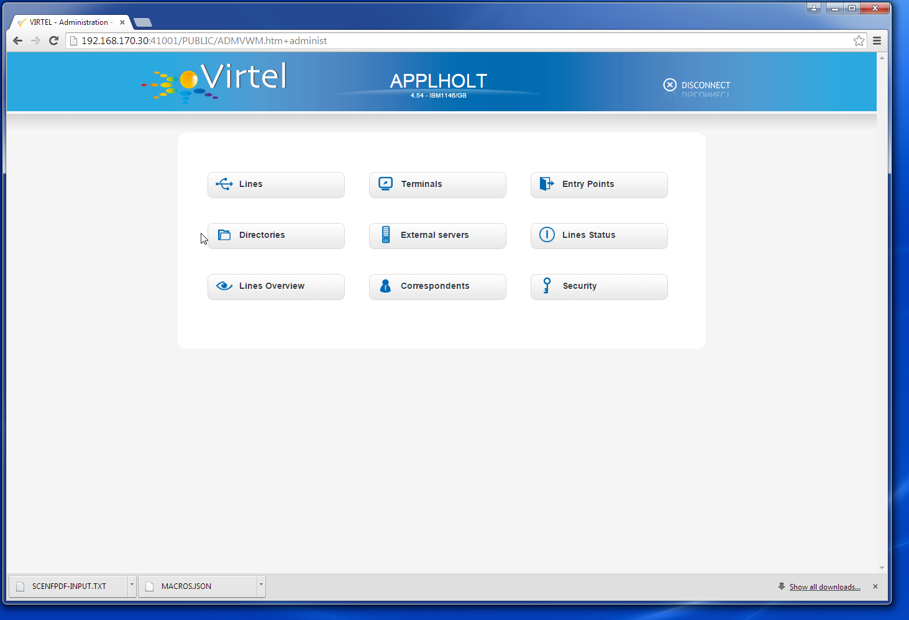
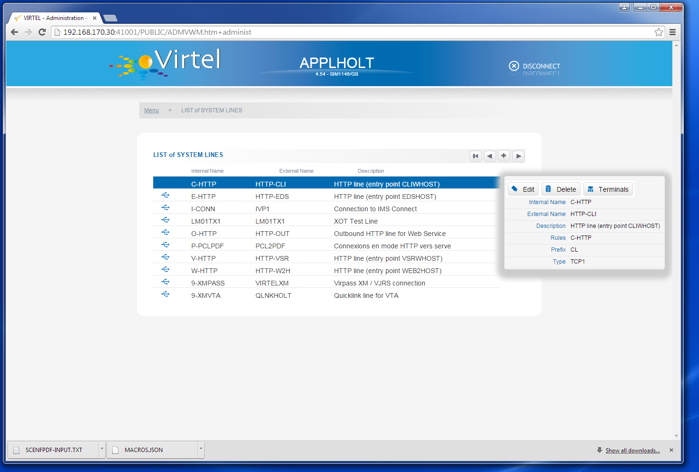
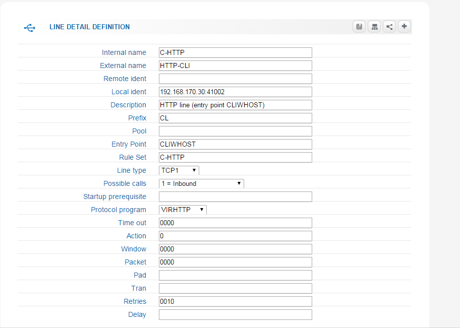

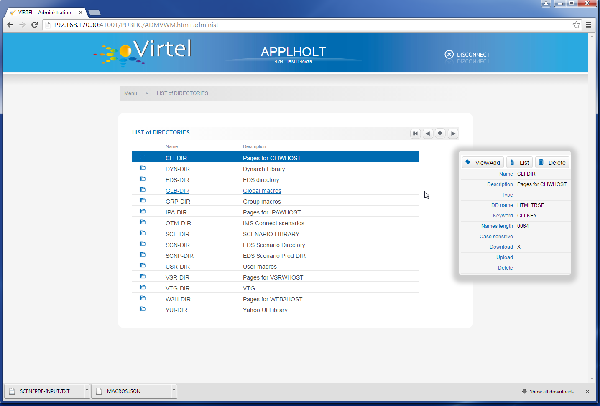
.. |image5| image:: images/media/image6.png
   :width: 6.30000in
   :height: 2.99028in
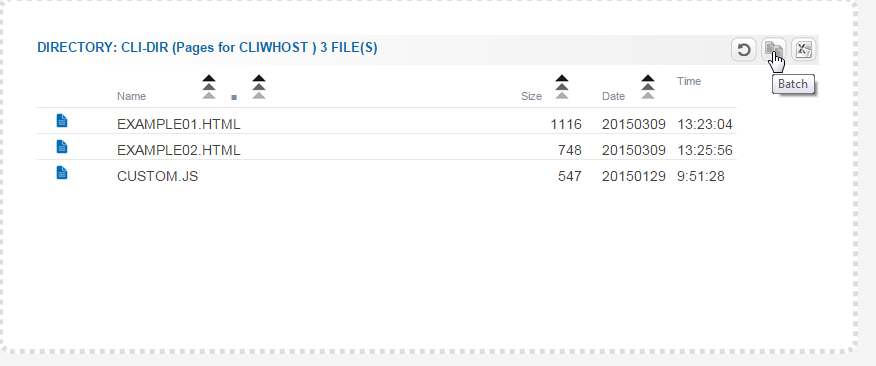
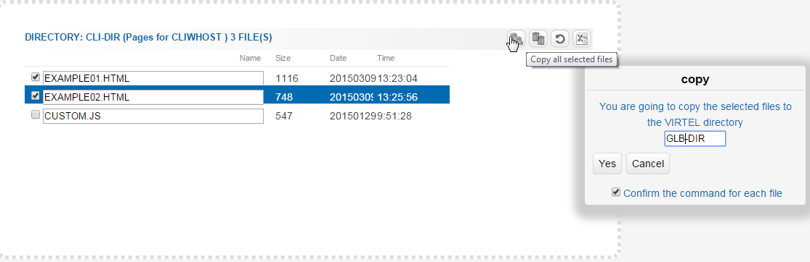
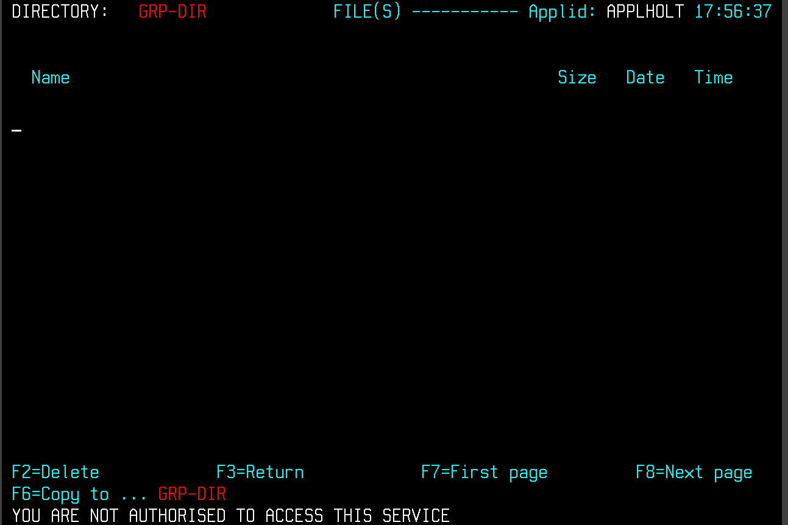
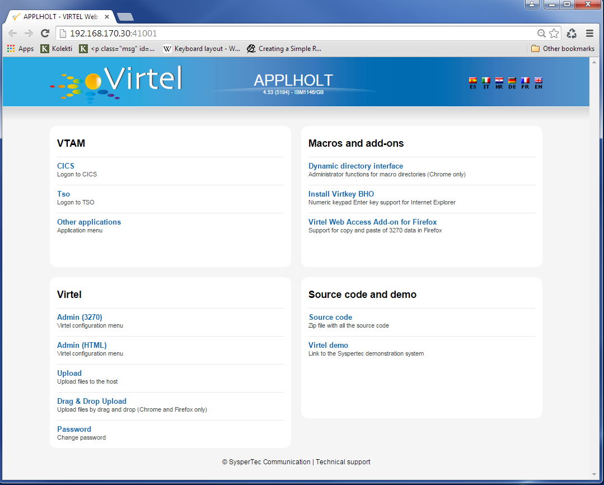
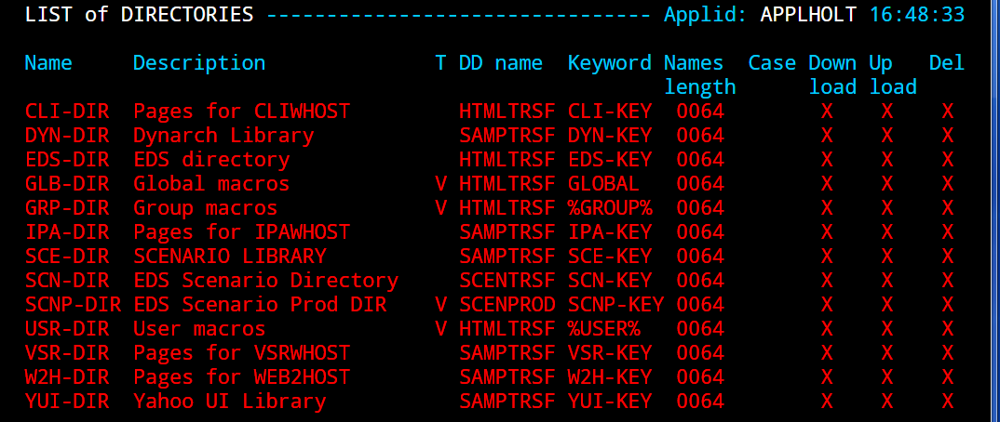
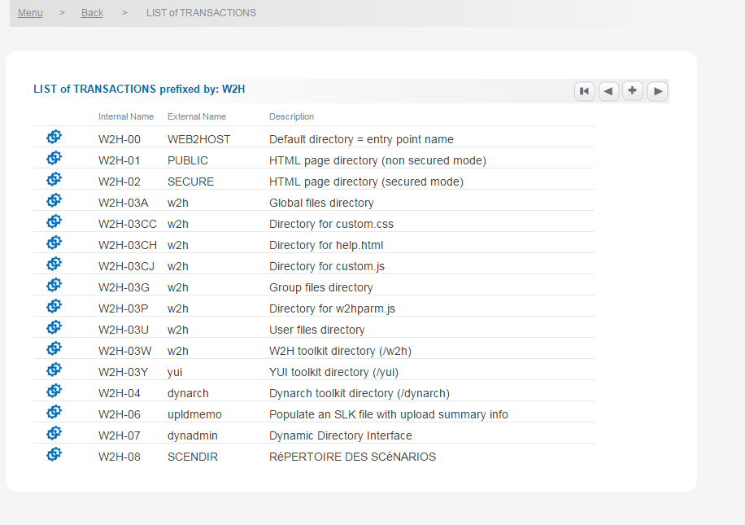
.. |image12| image:: images/media/image13.png
   :width: 6.30000in
   :height: 4.76736in
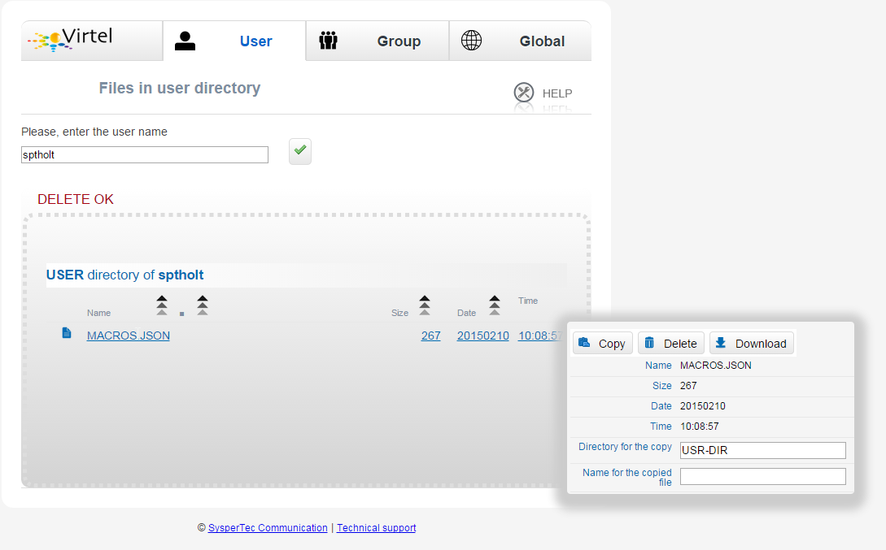
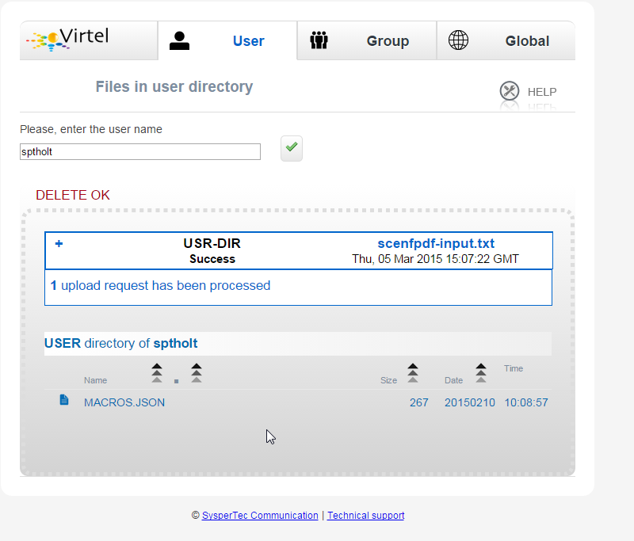
