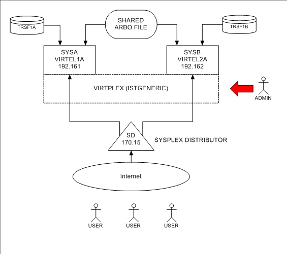
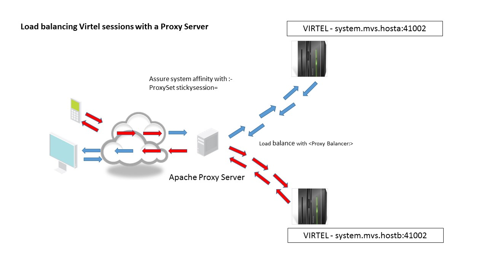

.. _tn201504:

Running multiple instances of Virtel
====================================

For High Availability and performance reasons it is often necessary to
run multiple copies of Virtel, preferably within separate LPARs on
separate physical machines. This newsletter discusses the issues raised
when implementing such a setup and how Virtel can exploit the IBM
Sysplex technologies. In the following example there are two instances
of Virtel running on separate physical machines sharing the same ARBO
configuration file. The configuration looks like this:-

|image0|

Virtel is using several Sysplex technologies to achieve this
configuration. For example, Virtel is using VTAM Generic Resources to
facilitate access to the Virtel Administration functions from either
instance of Virtel. VTAM generic resources can be used to distribute
workloads across applications that perform the same task or function.
Administration of the ARBO file is through the Virtel Administrator who
can logon on to Virtel using the generic Virtel ACB name VIRTPLEX. This
generic ACB enables management of the ARBO file through either VIRTEL1A
or VIRTEL2A. This can be useful, for example, If SYSA was down for
maintenance. VIRTEL administration could still conducted via VIRTEL2A
access. No change would be necessary to any session management tools.

Here are the relevant definitions required to support the VTAM generic
resource within Virtel.

**VIRTEL TCT**

GRNAME=VIRTPLEX, VTAM GENERIC RESOURCE NAME

**SYSPLEX definitions**

The ISTGENERIC structure will have to be allocated before you can use
VTAM generic resources. See the IBM Network Implementation Guide for
further information on configuring the CFRM.

Use the following command to display coupling allocation details for
ISTGENERIC.

::

    D XCF,STR,STRNM=ISTGENERIC

**VTAM displayof the generic resource**

The results from the D NET,ID=VTAMPLEX,E identifies the two Virtel
instances which are grouped into the generic resource name VIRTPLEX. The
example below shows VIRTEL1A and VIRTEL2A as participating in the
VIRTRPLEX resource name group.

::

  D NET,ID=VIRTPLEX,E 

  IST097I DISPLAY ACCEPTED
  IST075I NAME = VIRTPLEX, TYPE = GENERIC RESOURCE 917
  IST1359I MEMBER NAME OWNING CP SELECTABLE APPC
  IST1360I SPNET.VIRTEL1A ZAM1SSCP YES NO
  IST1360I SPNET.VIRTEL2A ZAM2SSCP YES NO
  IST2210I GR PREFERENCE TABLE ENTRY = **DEFAULT**
  IST2202I GREXIT = NO WLM = YES LOCLU = YES
  IST2204I LOCAPPL = YES PASSOLU = NO
  IST314I END

When the VIRTEL*A application is display in VTAM the following messages
are written to the console log:-

::

    D NET,ID=VIRTEL1A,E
    IST097I DISPLAY ACCEPTED
    IST075I NAME = SPNET.VIRTEL1A, TYPE = APPL 925
    IST486I STATUS= ACT/S, DESIRED STATE= ACTIV
    IST1447I REGISTRATION TYPE = CDSERVR
    IST1363I GENERIC RESOURCE NAME VIRTPLEX REPRESENTS SPNET.VIRTEL1A
    IST977I MDLTAB=***NA*** ASLTAB=***NA***
    IST861I MODETAB=***NA*** USSTAB=***NA***LOGTAB=***NA***
    IST934I DLOGMOD=***NA*** USS LANGTAB=***NA***
    IST1632I VPACING = 7
    IST1938I APPC = NO
    IST597I CAPABILITY-PLU ENABLED ,SLU ENABLED ,SESSION LIMIT NONE
    IST231I APPL MAJOR NODE = APPLVIPX
    IST654I I/O TRACE = OFF, BUFFER TRACE = OFF
    IST1500I STATE TRACE = OFF
    IST271I JOBNAME = SPVIR1A, STEPNAME = SPVIR1A, DSPNAME = ISTEBBDB
    IST228I ENCRYPTION = OPTIONAL , TYPE = DES
    IST1563I CKEYNAME = VIRTEL1A CKEY = PRIMARY CERTIFY = NO
    IST1552I MAC = NONE MACTYPE = NONE
    IST1050I MAXIMUM COMPRESSION LEVEL - INPUT = 0, OUTPUT = 0
    IST1633I ASRCVLM = 1000000
    IST1634I DATA SPACE USAGE: CURRENT = 0 MAXIMUM = 1280
    IST171I ACTIVE SESSIONS = 0000000001, SESSION REQUESTS = 0000000000
    IST206I SESSIONS:
    IST634I NAME STATUS SID SEND RECV VR TP NETID
    IST635I SC0TCP13 ACTIV-S CA7B8B52D125F31F 0003 0001 SPNET
    IST314I END

Message IST1363I confirms that VIRTEL operating under the ACB of VIRTEL1A is associated with the VTAM resource name VIRTPLEX.

**Using Virtel and VTAM Generic Resource Names to balance workload in a SYSPLEX environment.**

In the following configuration we can see how the VTAM generic resource
facility can also be used to distribute workloads across applications.
In this example there are several CICS TOR regions within CICSA, CICSB
and CICSC that are accessed through a VTAM generic resource name or
CICSPLEX group name. VIRTEL uses this name to access the CICS
application. The WLM and/or VTAM will distribute sessions across the
members of the CICS generic resource name.

|image1|

From a High Availability aspect both CICSA and CICSB could both be down
and service would still be provided by CICSC either through VIRTEL1A or
VIRTEL2A. In this configuration VIRTEL exploits SYSPLEX technologies to
provide a HA solution. The only VIRTEL requirement is to define a VIRTEL
transaction which targets CICSZ as the VTAM application, i.e. the VTAM
Generic Resource or CICSPLEX group name.

**Sharing the ARBO and other VSAM files**

In a SYSPLEX or sharing environment the VSAM files, like the ARBO file, must be shared only in READ mode. To support this the following TCT parameter should be coded:-

::
 
 VSAMTYP=READONLY

This VIRTCT parameter allows the setup of 'READ-ONLY' Virtels, to be used in production or in a Sysplex. Almost all Virtel VSAM files may be set to read-only mode. (But note that the VIRSWAP file; being a work file it cannot be read-only.) 

If this TCT value is coded then the following changes should also be made to the TCT.

- The MACRF statements should be amended from MACRF=(SEQ,DIR,OUT,LSR) to MACRF=(SEQ,DIR,LSR).

- The UFILE parameter string should also be changed from 0,10,01 to 0,10,05. For example:-

::
 
 HTMLTRSF,ACBH2,0,10,01 becomes HTMLTRSF,ACBH2,0,10,05

This will ensure the integrity of the VSAM files across a SYSPLEX or shared environment. When Virtel is started the following messages will be issued:-

::

 VIR0093I VTAM GENERIC RESOURCE NAME IS VIRTPLEX                 
 VIR0024I OPENING FILE VIRARBO                                   
 VIR0024I READ ONLY                                              
 VIR0024I OPENING FILE VIRSWAP                                   
 VIR0024I OPENING FILE VIRHTML                                   
 VIR0024I READ ONLY                                              
 VIR0024I OPENING FILE SAMPTRSF                                  
 VIR0024I READ ONLY                                              
 VIR0024I OPENING FILE HTMLTRSF                                  
 VIR0024I READ ONLY                                              
 VIR0024I ATTACHING SUBTASKS                                     

.. danger:: Do not set the SHROPTIONS to (4,3) as this will have undesirable results!

Using a READ only environment enables you to not only share the ARBO file but also the SAMP and HTML TRSF files.

**Virtel naming conventions with multiple tasks**

When running more than one VIRTEL STC care must be taken when defining
the VTAM relay names that each VIRTEL tasks will use. In the above
configuration each Virtel instance is running on a different LPAR, and
for the HA reasons, probably on a different physical machine; however,
the VTAM names employed must be unique. With Virtel you can define a
single configuration within the ARBO and TCT which contains a unique
pool of Virtel relays for each Virtel instance.

Here are two possible ways to define the relay pools for multiple Virtel
instances:

The first way is to include the SYSCLONE value as part of the LU name.
The relay definitions utilize the system symbolic SYSCLONE value in the
IEASYMxx member of PARMLIB. The clone value is taken from the system
symbolic &SYSCLONE and is identified in the VIRTEL definitions through
the + (plus) character:

::

  LIST of TERMINALS ---------------------------------- Applid: VIRTEL1A 15:11:01
  Terminal  Repeated Relay     Entry        Type   I/O  Pool      2nd  Relay       
  CLLOC000  0050                            3      3
  CLVTA000  0080     *W2HPOOL               3      3
  DELOC000  0010                            3      3
  DEVTA000  0016     *W2HPOOL               3      3
  W2HIM000  0080     R+IM000                1      1
  W2HTP000  0080     R+VT000                3      3    *W2HPOOL  R+IM000 

**TCT definition**

In the configuration above there are two Virtel STCs running on
different LPARS whose &SYSCLONE values are 1A and 2A. With the same TCT
being used for both VIRTEL1A and VIRTEL2A the following is specified in
the common TCT:-

::

    APPLID=VIRTEL+,
    SYSPLUS=YES,

This will means that the two Virtels STCs will have a VTAM APPLID of
VIRTEL1A and VIRTEL2A. The Virtel relay LU names are R1AVT000-079 for
LPAR 1A, and R2AVT000-079 for LPAR 2A.

Note: It is recommended that only the ARBO file can be shared in this
configuration.

The VTAM definition to support this configuration would like:-

::

    APPLVIPX VBUILD TYPE=APPL
    * ------------------------------------------------------------------ *
    * Product : VIRTEL                                                   *
    * Description : APPL for VIRTEL SYSPLEX (SPVIR1A and SPVIR2A)        *
    * ------------------------------------------------------------------ *
    VIRTEL&SYSCLONE APPL EAS=160,AUTH=(ACQ,BLOCK,PASS,SPO),               *
          ACBNAME=VIRTEL&SYSCLONE
    * ------------------------------------------------------------------ *
    * R&SYSCLONEVTxxx : VTAM application relays for VIRTEL Web Access    *
    * ------------------------------------------------------------------ *
    R&SYSCLONE.VT??? APPL AUTH=(ACQ,PASS),MODETAB=ISTINCLM,               *
          DLOGMOD=SNX32702,EAS=1
    * ------------------------------------------------------------------ *
    * R&SYSCLONEIMxxx : Printer relays for VIRTEL Web Access terminals   *
    * ------------------------------------------------------------------ *
    R&SYSCLONE.IM??? APPL AUTH=(ACQ,PASS),MODETAB=ISTINCLM,               *
          DLOGMOD=SCS,EAS=1
    R&SYSCLONE.IP??? APPL AUTH=(ACQ,PASS),MODETAB=ISTINCLM,               *
          DLOGMOD=DSILGMOD,EAS=1

Because this naming convention could be constraining if you want to use 4-character LU names, there is a second method which allows you to freely choose the LU names without the need to include the SYSCLONE   characters as part of the LU name. In the next example two pools are defined. Pool \*W1APOOL has relay names J000-J999, K000-K999, L000-L999 for LPAR 1 (with printer names Pnnn,Qnnn,Rnnn), and pool \*W2APOOL has relay names M000-M999, N000-N999, O000-O999 (with printer names Snnn,Tnnn,Unnn) for LPAR 2:-

::

    Terminal  Repeated Relay     Entry        Type   I/O  Pool     2nd  Relay       
    CLLOC000  0500                            3      3
    CLVTA000  1000     *W+POOL                3      3
    CLVTB000  1000     *W+POOL                3      3
    CLVTC000  1000     *W+POOL                3      3
    DELOC000  0010                            3      3
    DEVTA000  0016     *W+POOL                3      3
    W2HIP000  1000     P000                   1      1
    W2HIQ000  1000     Q000                   1      1
    W2HIR000  1000     R000                   1      1
    W2HIS000  1000     S000                   1      1
    W2HIT000  1000     T000                   1      1
    W2HIU000  1000     U000                   1      1
    W2HTJ000  1000     J000                   3      3    *W1APOOL P000
    W2HTK000  1000     K000                   3      3    *W1APOOL Q000
    W2HTL000  1000     L000                   3      3    *W1APOOL R000
    W2HTM000  1000     M000                   3      3    *W2APOOL S000
    W2HTN000  1000     N000                   3      3    *W2APOOL T000
    W2HTO000  1000     O000                   3      3    *W2APOOL U000

The VTAM definitions would be similar to those from the previous example except the &SYSCLONE would be replaced by the relay characters.

::

    APVIRT&SYSCLONE. VBUILD TYPE=APPL
    * ------------------------------------------------------------------*   
    * Product     :  VIRTEL                                             *   
    * Description :  Main ACB for VIRTEL application                    *   
    * ------------------------------------------------------------------*   
    VIRTEL&SYSCLONE APPL AUTH=(ACQ,BLOCK,PASS,SPO),EAS=160,               + 
                 ACBNAME=VIRTEL&SYSCLONE 
    * ------------------------------------------------------------------*   
    * Jxxx,Kxxx   : VTAM application relays for VIRTEL Web Access*   
    * Lxxx,Mxxx   : VTAM application relays for VIRTEL Web Access *
    * Nxxx,Oxxx   : VTAM application relays for VIRTEL Web Access*      
    * ------------------------------------------------------------------*   
    J??? APPL  AUTH=(ACQ,PASS),MODETAB=ISTINCLM,DLOGMOD=SNX32702,EAS=1
    K??? APPL  AUTH=(ACQ,PASS),MODETAB=ISTINCLM,DLOGMOD=SNX32702,EAS=1 
    L??? APPL  AUTH=(ACQ,PASS),MODETAB=ISTINCLM,DLOGMOD=SNX32702,EAS=1
    M??? APPL  AUTH=(ACQ,PASS),MODETAB=ISTINCLM,DLOGMOD=SNX32702,EAS=1   
    N??? APPL  AUTH=(ACQ,PASS),MODETAB=ISTINCLM,DLOGMOD=SNX32702,EAS=1
    O??? APPL  AUTH=(ACQ,PASS),MODETAB=ISTINCLM,DLOGMOD=SNX32702,EAS=1
    * ------------------------------------------------------------------*   
    * Pxxx,Qxxx   : Printer relays for VIRTEL Web Access terminals      *   
    * Rxxx,Sxxx   : Printer relays for VIRTEL Web Access terminals      * 
    * Txxx,Uxxx   : Printer relays for VIRTEL Web Access terminals      * 
    * ------------------------------------------------------------------*
    P??? APPL AUTH=NVPACE,EAS=1,PARSESS=NO,MODETAB=ISTINCLM,SESSLIM=YES     
    Q??? APPL AUTH=NVPACE,EAS=1,PARSESS=NO,MODETAB=ISTINCLM,SESSLIM=YES     
    R??? APPL AUTH=NVPACE,EAS=1,PARSESS=NO,MODETAB=ISTINCLM,SESSLIM=YES     
    S??? APPL AUTH=NVPACE,EAS=1,PARSESS=NO,MODETAB=ISTINCLM,SESSLIM=YES        
    T??? APPL AUTH=NVPACE,EAS=1,PARSESS=NO,MODETAB=ISTINCLM,SESSLIM=YES      
    U??? APPL AUTH=NVPACE,EAS=1,PARSESS=NO,MODETAB=ISTINCLM,SESSLIM=YES
      

**Using the Distributed VIPA with Virtel**

Using a Dynamic VIPA with IBM’s SYSPLEX Distributor (SD) you can balance
Virtel session workload across more than one Virtel STC. The
distributing TCPIP stack will balance workload across the participating
target TCPIP stacks. Allocation of new sessions on the IP side will
depend on the selected SD/WLM algorithm. For example this can be a Round
Robin policy or WLM policy workload algorithm. Access to the Virtel
tasks is through using distributed VIPA address which is defined in a
TCPIP profile. In the configuration above it is defined as
192.168.170.15. The relevant PROFILE definitions for TCPIP would look
like:-

::

    VIPADYNAMIC
    VIPARANGE DEFINE MOVEABLE NONDISRUPTIVE 255.255.255.0 192.168.170.20
    VIPADEFINE MOVE IMMED 255.255.255.0 192.168.170.15
    VIPADISTRIBUTE DEFINE TIMEDAFF 300 DISTMETHOD ROUNDROBIN 192.168.170.15
    DESTIP ALL
    ENDVIPADYNAMIC

It is essential to include the TIMEDAFF parameter in the VIPA definition
as this maintains session affinity. The TIMEDAFF facility ensures that a
user will always connect to the same VIRTEL while a session is open.
Also, it is recommended that the Virtel line W-HTTP (port 41001) is used
for Virtel Administration and line C-HTTP (port 41002) for user access
to applications.

Line W-HTTP should be defined using the base address of the LPAR (i.e.
the home address of the default interface) by specifying only the port
number. For example:

Local address ==> :41001

Line C-HTTP should be defined using the distributed VIPA address with port number:

Local address ==> 192.168.170.15:41002

The Virtel Line display command displays this configuration:

::

    F SPVIR1A,LINES
    VIR0200I LINES
    VIR0201I VIRTEL 4.54 APPLID=VIRTEL1A LINES
    VIR0202I INT.NAME EXT.NAME TYPE ACB OR IP
    VIR0202I -------- -------- ----- ---------
    VIR0202I C-HTTP HTTP-CLI TCP1 192.168.170.15:41002
    VIR0202I W-HTTP HTTP-W2H TCP1 :41001
    VIR0202I ---END OF LIST---

In this way the administrator can access a specific Virtel using port 41001 of the appropriate LPAR’s IP address, while the users can access both Virtels using port 41002 on the DVIPA address.

**Uisng Virtel with Apache Proxy as a load balancing mechanism**

Another way of balancing workloads across multiple Virtel instances is through an Apache Reverse Proxy Server. In this setup the proxy server load balances IP sessions across the known TCPIP stacks, very much like IBM’s Sysplex Distributor.

|image3|

Again, to maintain session affinity the correct load balancing parameters must be used. An example from the http.conf looks like this:-

::

    #
    # Virtel
    #
    ProxyPass / balancer://hostcluster/
    ProxyPassReverse / balancer://hostcluster/
    <Proxy balancer://hostcluster>
    BalancerMember http://syt00101.gzaop.local:41002 retry=5
    BalancerMember http://syt00101.gzaop.local:51002 retry=5
    ProxySet lbmethod=byrequests
    </Proxy>

For more information on setting up an Apache Proxy Server visit http://httpd.apache.org/docs/2.2/mod/mod_proxy_balancer.html

To use Apache as a Proxy Server it is essential that the correct configuration modules are loaded at startup:-

::

    #LoadModule foo_module modules/mod_foo.so
    LoadModule authz_host_module modules/mod_authz_host.so
    LoadModule auth_basic_module modules/mod_auth_basic.so
    LoadModule authn_file_module modules/mod_authn_file.so
    LoadModule authz_user_module modules/mod_authz_user.so
    #LoadModule authz_groupfile_module modules/mod_authz_groupfile.so
    LoadModule include_module modules/mod_include.so
    LoadModule log_config_module modules/mod_log_config.so
    LoadModule env_module modules/mod_env.so
    #LoadModule mime_magic_module modules/mod_mime_magic.so
    #LoadModule expires_module modules/mod_expires.so
    LoadModule headers_module modules/mod_headers.so
    LoadModule unique_id_module modules/mod_unique_id.so
    LoadModule setenvif_module modules/mod_setenvif.so
    LoadModule proxy_module modules/mod_proxy.so
    LoadModule proxy_connect_module modules/mod_proxy_connect.so
    #LoadModule proxy_ftp_module modules/mod_proxy_ftp.so
    LoadModule proxy_http_module modules/mod_proxy_http.so
    LoadModule mime_module modules/mod_mime.so
    #LoadModule dav_module modules/mod_dav.so
    #LoadModule dav_fs_module modules/mod_dav_fs.so
    LoadModule autoindex_module modules/mod_autoindex.so
    #LoadModule asis_module modules/mod_asis.so
    #LoadModule info_module modules/mod_info.so
    LoadModule cgi_module modules/mod_cgi.so
    LoadModule dir_module modules/mod_dir.so
    LoadModule actions_module modules/mod_actions.so
    #LoadModule speling_module modules/mod_speling.so
    #LoadModule userdir_module modules/mod_userdir.so
    LoadModule alias_module modules/mod_alias.so
    #LoadModule rewrite_module modules/mod_rewrite.so
    #LoadModule deflate_module modules/mod_deflate.so
    LoadModule proxy_balancer_module modules/mod_proxy_balancer.so 

Some other recommendations are:-

::

    * Timeouts
    SSLDisable
    SSLV3Timeout 18010
    * Format log with router information
    LogFormat "%h %l %u %t\"%r\" %>s %b \"%{Referer}i\" \"%{User-Agent}i\" \"%{BALANCER_WORKER_ROUTE}e\"" combined
    * set Max-Age to 12h (doesn't work with IE)  or 
    * enable mod_expires and set: (this should be checked)
    ExpiresActive On
    ExpiresDefault "access plus 16 h"

See https://httpd.apache.org/docs/2.2/mod/mod_expires.html for more information.

.. |image1| image:: images/media/image2.jpg
   :width: 6.17708in
   :height: 6.46875in

