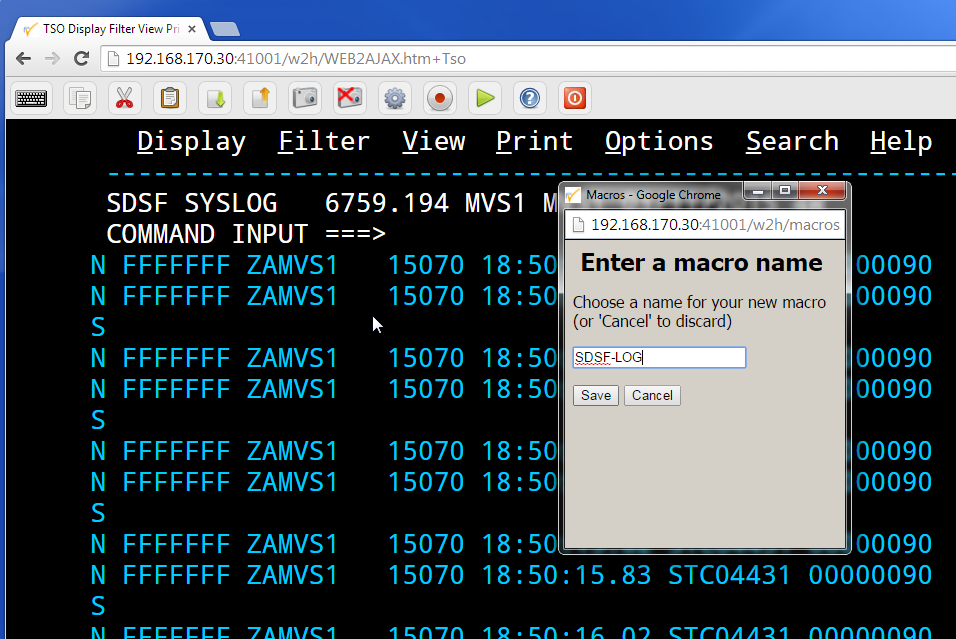
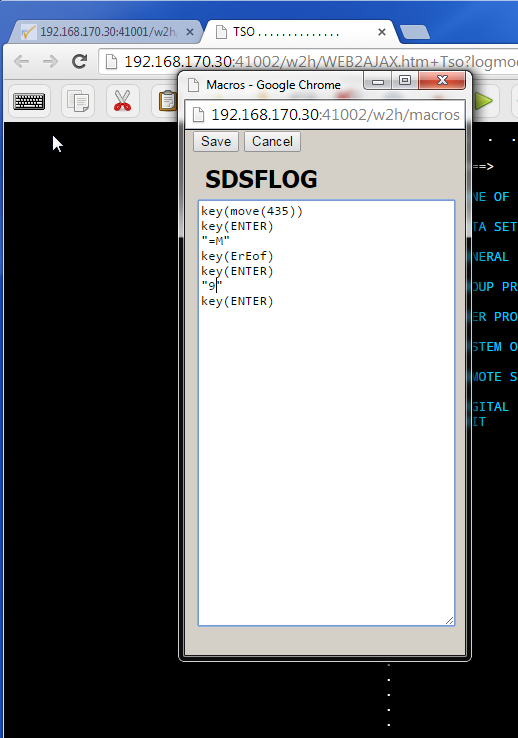
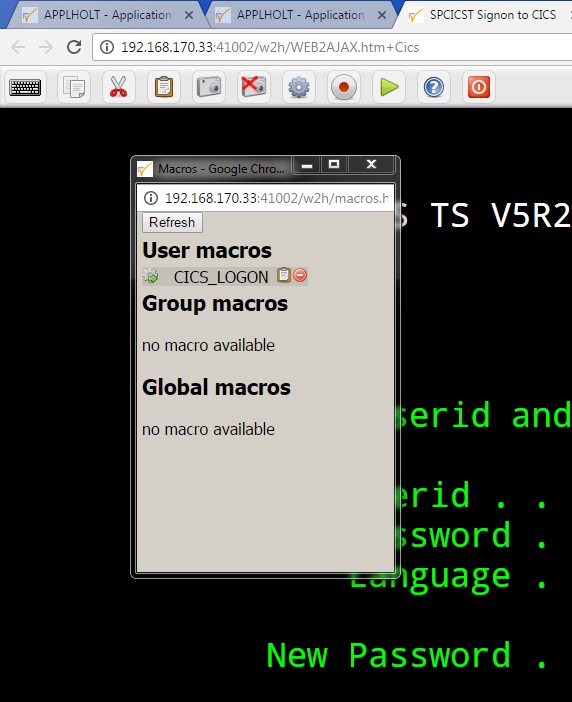

.. _tn201505:

Virtel Macros in Virtel 4.53
============================

Virtel macros capture keystroke operations which can subsequently be
used to automate 3270 functions. By default, macros are held within a JSON object and saved as a file in a users local storage. These file are suffixed with the .json qualifier. An example
of a JSON macro file is shown below:-

::

   {"macros":[{"name":"SDSF","rev":2,"def":["move(435)","ENTER",{"txt":"=M"},"ErEof","ENTER",{"txt":"6"},"ENTER"]}],"desc":"user
   macros","fmt":1,"user":"SPTHOLT"}

The macro interface can operate in two modes - local storage or DDI mode. In local storage mode macros are maintained in the user's local storage. In DDI mode the macros makes use of the DDI facility to store macros on the mainframe. Updates are automatically synchronized between a user's local storage and the DDI USR-DIR directory which is maintained in the HTML VSAM file in Virtel. Also, using DDI mode gives the users access to a GRP-DIR group directory and GLB-DIR global directory. These DDI directories would be maintained by the Virtel Administrator. 

**Updating custom.js to use Virtel Macros in DDI mode.**

Before you can use the DDI  Virtel macro facility a custom.js file must be created or updated and placed in the CLI-DIR. The useVirtelMacros flag must be added and set to true. Also, the transaction CLI-03CJ must be modified so that the Application field points to CLI-DIR and not W2H-DIR.

The following is an example of a customised custom.js:-

::

   /*
   * (c)Copyright SysperTec Communication 2014 All Rights Reserved
   * VIRTEL Web Access customer-specific javascript functions
   */
   /*
   * To open an application (issued from applist transaction) in a new TAB instead of the same (or a new) window
   * 2014-02-21 : Add "options" field to place eventual options for the new tab knowing that such option can eventually disturb the
   * function, for example, in FF, new tab could be transformed as a new window if the passed options are not compatible with the
   * option active for the opener !
   */
   // Specify macros to be held on host site
   
   w2hparm.useVirtelMacros = true;

   // Declare the function so that it is known for VWA
   
   var after_responseHandle;
   function before_launchApplink(href) {
      return {
         url: href,              // Return received URL
         target: '_blank',       // Target is a new TAB
         options: ''             // "menubar,location,toolbar,status,resizable,scrollbars" -> Removed from main function due to not necessary
      };
   }

**The Macro Interface**

You can capture and list macros by using the two macro ICONS functions
displayed in the Virtel tool bar. These are the red record/stop button
and the green triangular display button. Regardless of which mode you are running the macro interface presents the same functions. In local mode the interface will look like this:-

|image7|

whereas in DDI mode the interface looks like this:-

|image8|

**The Record function**

|image0|

Figure 1 - The Macro Record ICON

The record function is a on/off button that will record key strokes.
When recording, the ICON will flash until it is clicked at which point
it will stop recording and save the key strokes to a macros.JSON file. A
save panel will be displayed asking for the name of the macro entry.
Note that an ENTER/PFK key must be pressed at least once, i.e. data must
be sent by some key operation in order to create and save an entry
within the macro.JSON file.

|image1|

Figure 2 - Saving a macro

**The display function**

The green triangular button will display the macros available to the user. For local mode these will be macros in the local storage, for DDI mode these will be the macros maintained in the user,
group and global directories. From the list you will be able to delete, edit or execute a macro.

|image2|

Within the user macro list there are two additional commands, edit and
delete. The “edit” option will open an editor where you can edit the
user macro as shown below:-

|image3|

**Macro format and commands**

The format of the macro.json is embedded JSON structures. Each name structure represents a keystroke macro identified by the “name” keyword.

::

   Name:    The name of the macro entry.
   Rev:     The “rev” is a user revision keyword.
   Def:     The “def” keyword identifies the commands and entry values. The macro editor supports the following commands:-

   -  "any string of characters to input into 3270 screen"
   -  move(pos)
   -  copy(startRow,startCol,endRow,endCol)
   -  paste(pos)
   -  paste(pos,nbRows,nbCols)
   -  key(keyIdentifier)

**Macro example**

::

   {"macros":[
   {
   "name":"SDSFLOG",
   "rev":2,
   "def":["move(435)","ENTER",{"txt":"=M"},"ErEof","ENTER",{"txt":"6"},"ENTER"]
   },
   {
   "name":"SDSFDA",
   "rev":1,
   "def":[77,"ENTER",53,"ENTER",100,97,"ENTER"]
   }
   ],"fmt":1}

**Managing and uploading a macro**

Although macros can be captured and saved in a user’s directory, USR-DIR, they can also be uploaded to any one of the DDI macro directories – user, group or global. To upload a macro.JSON file use the DDI interface from the Administration portal. It would be normal practice for an administrator to capture and create macros in their user directory. These would then be exported using the EXPORT option. This would create a macros.JSON file. The macro.JSON file could then be uploaded to any one of the three DDI macro directories - USER, GROUP or GLOBAL using the DDI interface. Once uploaded , the macros can be modified for general use, and then copied to any other directory within the macros DDI directory structure. This facility enables an administrator to make macros available at any User, Group or Global level. The DDI upload process is through a drag and drop operation within the directory list operation of the ADMIN(HTML) interface or the file list operation with the DDI interface. In both cases the drop area is designated by a series of dotted lines.

|image4|

Dragging a file into this area will automatically start the upload
function. Once the file has been upload reload the page to clear the
upload results message.

|image5|

.. |image0| image:: images/media/image1.png
   :width: 6.30000in
   :height: 1.51389in

.. |image2| image:: images/media/image3.png
   :width: 2.75000in
   :height: 3.75799in

.. |image4| image:: images/media/image5.png
   :width: 4.51042in
   :height: 3.34652in
.. |image5| image:: images/media/image6.png
   :width: 4.46875in
   :height: 3.34565in
.. |image7| image:: images/media/image7.png
