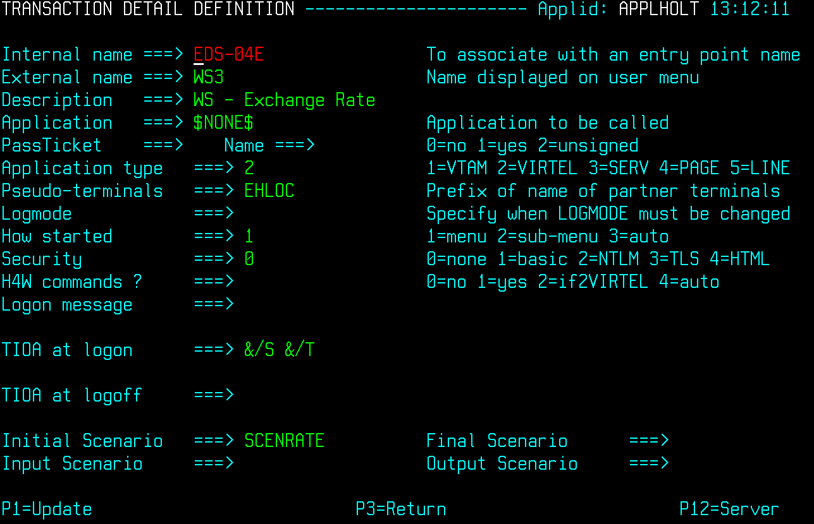
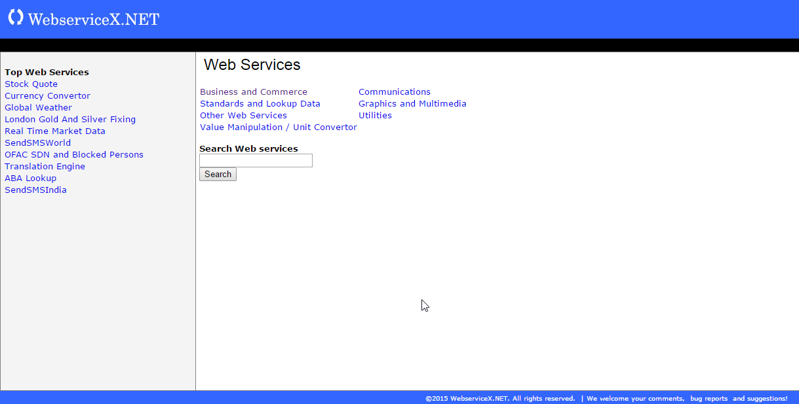

.. _tn201506:

An example of using web services with Virtel Integration
========================================================

Web services (WS) are one of the foundation blocks of the Services Oriented
Architecture blue print. This blue print forms the basis on which many
of today’s e-commerce infrastructures are built, but what is a web
services? Simply put, web services are discoverable services that are
made available from a business's web server for web users or other
web-connected programs to use. Client programs or systems interact with
the web service using SOAP (Simple Object Access Protocol) messages,
which are conveyed using the standardized protocols of HTTP with XML
serialization. The support web services or operations, message formats
and data structures supported by a web service are described by an XML
document using Web Service Data Language (WSDL). Web services are
discoverable through UDDI servers or equivalent. UDDI (Universal
Description, Discovery, and Integration) is an XML based registry for
businesses worldwide to list themselves on the Internet. Its ultimate
goal is to streamline online transactions by enabling companies to find
one another on the Web and make their systems interoperable for
e-commerce. Once a web service has been identified it can be used by
exploiting the contents of the published WSDL. When using web services,
message exchange is through the open and standardized SOAP format. As an
example, a program wishing to know the current exchange rate between two
currencies can send a SOAP message request to a web service provider and
the results will be returned in a SOAP message response.

In this newsletter we demonstrate how Virtel can interface between a
legacy batch application and a web service to retrieve the exchange rate
between two currencies. The exchange rate web service is provided by a
web service hosted by `www.webservicex.net <http://www.webservicex.net>`__.

An overview of the service is displayed below.

|image0|

*Figure 1 - Overview of web services elements.*

Breaking down the individual actions we can anaylze the components
involved.

1. Connection to the Virtel Server is through a batch application. In
   this case we are using REXX to connect to the Virtel server using
   REXX socket fuctions. The batch application runs as a batch task
   invoking TCPIP to initialize and connect a socket to VIRTEL. The
   batch application sends a URL request to VIRTEL, effectively
   emulatiing a browser. The URL request identifies the VIRTEL line,
   template and transaction. Virtel is unaware that it is conversing
   with a batch program. The following is the JCL that invokes the REXX
   batch application.

::   

    //LIBS JCLLIB ORDER=SPTHOLT.VIRTEL.REXX
    //*
    //* LINE 41002 CLIHOST
    //* LINE 41102 EDSHOST
    //* LINE 41001 W2HHOST
    //*
    //CLIENT EXEC ISPF,HLQ=ISP
    PROFILE PREFIX(SPTHOLT)
    ISPSTART CMD(%RXCVIRT)
    //REQUESTS DD *
    192.168.170.30:41102 /ws1.html+ws3?FromCurrency=EUR&ToCurrency=GBP
    /*

When running the REXX batch application the following URL is sent to
Virtel:-

::

    SEND-> GET /WS1.HTML+WS3?FROMCURRENCY=EUR&TOCURRENCY=GBP
        HTTP/1.1 Host: 192.168.170.30:41002
        Connection: keep-Accept:text/html,application/xhtml+xml,
        application/xml;q=0.9,image/webp,*/*;q=0.8
 
        Read from 192.168.170.30
 
    Virtel IP Address: 192.168.170.30
    LINE: HTTP-E
    Port: 41102
    Template: WS1.HTML
    Transaction: WS3
    Parameters: FROMCURRENCY=EUR,TOCURRENCY=GBP

2. When Virtel receives the URL it invokes the transaction associated
   with the Line related to the IP address and port. In this case it is
   line E-HTTP which has an entry point of EDSPOINT. Within that entry
   point, transaction WS3 is defined which has an initial scenario of
   SCENRATE. It is this initial scenario that connects to the web
   service, sends and receives the relevant SOAP messages and returns
   the results to the batch application. This is an example of Virtel’s
   web integration.

    |image1| 
    *Figure 2 - User elements*

    The user elements involved in this stage of the transaction are the
    batch application, REXX code RXCVIRT, the html template WS1.HTML
    that Virtel will return, the presentation module code SCENRATE and
    the SOAP message template exchange.xml . The template will contain
    the response from the web service. Let’s take a look at these user
    elements. The template looks like this:-

**WS1.HTML**    

::    

    <!DOCTYPE html>
    <!--
    To change this license header, choose License Headers in Project
    Properties.
    To change this template file, choose Tools \| Templates
    and open the template in the editor.
    -->
    <html>
        <head>
            <!--VIRTEL start="{{{" end="}}}" -->
            <title>Web Services Example 1</title>
            <meta charset="UTF-8">
            <meta name="viewport" content="width=device-width, initial-scale=1.0">
        </head>
        <body>
            Answer is {{{CURRENT-VALUE-OF "CANSWER"}}}
        </body>
    </html>

The Virtel tag language is embedded in the html element to obtain
the contents of the variable CANSWER which will contain the results
from the web service. This is an example of the Virtel Web Access
toolkit. This user element is used at the end of the scenario when
Virtel sends the response to the initial URL that was initial posted
by the REXX batch application. If we trace the Virtel line E-HTTP
when we run the batch application we can see the data flow.

**Outbound Message from batch application**

::

 E-HTTP HTTP REQUEST FROM 192.168.170.030:02027
 13:03:57.12
 
 00000 47455420 2F575331 2E48544D 4C2B5753 333F4652 4F4D4355 5252454E 43593D45 *GET /WS1.HTML+WS3?FROMCURRENCY=E*
 00020 55522654 4F435552 52454E43 593D4742 50202020 20202020 20202020 20202020 *UR&TOCURRENCY=GBP *
 00040 48545450 2F312E31 0D0A486F 73743A20 3139322E 3136382E 3137302E 33303A34 *HTTP/1.1..Host: 192.168.170.30:4*
 00060 31303032 0D0A436F 6E6E6563 74696F6E 3A206B65 65702D61 6C697665 0D0A4163 *1002..Connection: keep-alive..Ac*
 00080 63657074 3A207465 78742F68 746D6C2C 6170706C 69636174 696F6E2F 7868746D *cept: text/html,application/xhtm*
 000A0 6C2B786D 6C2C6170 706C6963 6174696F 6E2F786D 6C3B713D 302E392C 696D6167 *l+xml,application/xml;q=0.9,imag*
 000C0 652F7765 62702C2A 2F2A3B71 3D302E38 0D0A0D0A                            *e/webp,*/*;q=0.8.... *

**Inbound Message flow to batch application**

::

 E-HTTP HTTP RESPONSE TO 192.168.170.030:02027
 13:03:57.62
 
 00000 48545450 2F312E31 20323030 204F6B0D 0A536572 7665723A 20566972 74656C2F *HTTP/1.1 200 Ok..Server: Virtel/*
 00020 342E3534 0D0A4461 74653A20 53756E2C 20323220 4D617220 32303135 2031323A *4.54..Date: Sun, 22 Mar 2015 12:*
 00040 30333A35 3720474D 54200D0A 45787069 7265733A 20300D0A 436F6E74 656E742D *03:57 GMT ..Expires: 0..Content-*
 00060 6C656E67 74683A20 30303030 30303037 0D0A436F 6E74656E 742D7479 70653A20 *length: 00000007..Content-type: *
 00080 74657874 2F68746D 6C0D0A0D 0A30302E 37323336                            *text/html....00.7236 *

.. note::

    The inbound message is not using the template WS1.HTML in the above example, but rather just returning the CANSWER variable.

3. The scenario associated with the transaction WS3 is a Virtel initial
   scenario. It is defined with the following attributes:-

    |image2|
    *Figure 3 - WS3 Transaction definition*

    The key points are the *Application type 2*, a VIRTEL program, and
    *TIOA at logon* set to &/S which initiates the VIRTEL presentation
    module SCENRATE that contains the INITIAL scenario. It is the
    scenario within this presentation module that does all the work. See
    Appendix A for a complete list of the presentation module SCENRATE.
    This module must be assembled. The presentation module contains only
    one scenario, an initial scenario which is invoked when an &/S order
    is found in a TIOA connection script (see “Connection /
    Disconnection Scripts” in the *VIRTEL Connectivity Reference*
    manual).

    The layout of the scenario within the presentation module SCENRATE
    can be defined as an output structure, defined between the OUTPUT
    MAP$ and OUTPUT MAP$ END, followed by the SCENARIO logic. The logic
    steps of the scenario can be broken down thus:-

    a) Create variables from URL – FROMCURRENCY, TOCURRENCY

    b) Set variable SITE to URL of web services provider and access port - `www.webservices.net:80 <http://www.webservices.net:80>`__

    c) Read in SOAP template from Virtel TRSF file – exchange.xml.

    d) Build options file for $POST SOAP request – OPTION$ in Virtel variable REQP.

    e) Send SOAP request to web services provider.

    f) Test results and depending on return code take appropriate action. This is achieved using a Virtel CASE$ statement.

    g) Copy Virtel ANSWER variable to a COMMAREA as mapped by the OUTPUT map area.

    h) Copy the formatted COMMAREA to a Virtel variable called CANSWER.

    i) Send template with CANSWER. This will cause the tagged area of the template WS1.HTML to be populated with the CANSWER variable or just send CANSWER variable.

    j) Disconnect the session with the batch application.

The user elements involved in the SOAP message request is template exchange.xml. The XML file looks like:-

**exchange.xml**

::

    <?xml version="1.0" encoding="UTF-8"?><!--VIRTEL start="{{{" end="}}}"
    -->{{{ SET-CONTENT-TYPE "text/xml"}}}{{{SET-OUTPUT-ENCODING-UTF-8
    ""}}}{{{SET-LOCAL-OPTIONS (XML-ESCAPES)}}}
    <soap12:Envelope xmlns:xsi="http://www.w3.org/2001/XMLSchema-instance"
    xmlns:xsd="http://www.w3.org/2001/XMLSchema"
    xmlns:soap12="http://www.w3.org/2003/05/soap-envelope">
        <soap12:Body>
            <ConversionRate xmlns="http://www.webserviceX.NET/">
                <FromCurrency>{{{TRIMMED-VALUE-OF "FromCurrency"}}}</FromCurrency>
                <ToCurrency>{{{TRIMMED-VALUE-OF "ToCurrency"}}}</ToCurrency>
            </ConversionRate>
        </soap12:Body>
    </soap12:Envelope>

The scenario takes the parameters from the URL and places them in Virtel
variables. This is an example of how Virtel’s integration works; through
a combination of scenario programmable elements and an Initial scenario.
The following is an extract from the scenario showing the relevant COPY$
statements:-

::

    START       SET$ ENCODING,UTF-8,'IBM1147'
                COPY$ INPUT-TO-VARIABLE,FIELD='FROMCURRENCY',             *
                    VAR='FROMCURRENCY',                                   *
                    TYPE=REPLACE
    *
                COPY$ INPUT-TO-VARIABLE,FIELD='TOCURRENCY',               *
                    VAR='TOCURRENCY',                                     *
                    TYPE=REPLACE
    *

Again, Virtel tag language is used to populate the template with the
correct information for the web services request. The “TRIMMED-VALUE-OF”
of statements extract the values from the Virtel variables and place
them in the XML SOAP message template.

The OPTION$ and SEND$ complete the SOAP message, sending it to the web
service via the O-HHTP line, as identified in the SEND$ statement:-

::

    SENDREQ OPTION$ FOR-HTTP,(METHOD,'POST'),(SITE,'*SITE'),(TO,            *
                    '/CurrencyConvertor.asmx'),                             *
                    (HEADER,'Content-Type: application/soap+xml'),          *
                    (FILE-OUT,'REQFILE'),(FILE-IN,                          *
                    'ANSWER'),(RET-CODE,'RETCODE'),TOVAR='REQP'
            SEND$ TO-LINE,LINE='O-HTTP',PARMS='REQP',MAXTIME=1000,          *
                    ERROR=NOTOK

An analysis of the VIRTEL LOG can see the request being sent out to the
web services provider.

::

        13.02.15 STC05752 VIR0200I LINE=E-HTTP,TRACE
        13.02.15 STC05752 VIR0062I HTTP-EDS TRACE ACTIVE
        13.03.57 STC05752 VIRT906I HTTP-EDS SOCKET 00020000 CALL FROM 192.168.170.030:02027
        13.03.57 STC05752 VIRHT51I HTTP-EDS CONNECTING EHLOC015 TO 192.168.170.030:02027
        13.03.57 STC05752 VIRHT51I HTTP-OUT CONNECTING EHLOC015 TO 173.201.044.188:00080 
        13.03.57 STC05752 VIRT922W HTTP-OUT SOCKET 00000000 ENDED FOR 173.201.044.188:00080
        13.03.57 STC05752 VIR0052I EHLOC015 DISCONNECTED AFTER 0 MINUTES
        13.03.57 STC05752 VIRT922W HTTP-EDS SOCKET 00020000 ENDED FOR 192.168.170.030:020

The CASE$ statement following the SEND$ tests the return code from the
web service and determines the appropriate action. Return codes
beginning with 2 or 5 are accepted as OK, whereas anything else is
considered not OK. The ANSWER variable is filled with the data returned
from the web service:-

::

            CASE$ 'RETCODE',(BEGIN,'2',OK),(BEGIN,'5',OK),                  *
                    ELSE=NOTOK
    *
    NOTOK COPY$ VALUE-TO-VARIABLE,VAR='ANSWER',VALUE='KO',TYPE=REPLACE
    OK    EQU *

The ANSWER variable contains the result from the web service. This is
converted to EBCDIC and then copied to the COMMAREA variable. The
COMMAREA variable is then copied to a Virtel CANSWER variable and passed
back to the batch application through the template WS1.HTML:-

::

            CONVERT$ ASCII-TO-EBCDIC,VAR='ANSWER'
    OUTPUT  MAP$ FROM-VARIABLE,VAR='ANSWER'           Answer -> Commarea
    OUTPUT  MAP$ TO-VARIABLE,VAR='CANSWER'            Commarea -> Variable
            CONVERT$ EBCDIC-TO-ASCII,VAR='CANSWER'
            SEND$ AS-ANSWER,VAR='CANSWER',TYPE='text/html'
            ACTION$ DISCONNECT

The COMMAREA variable is a special variable that Virtel can use to
interface with application programs that communicate through a COMMAREA
structure, such as CICS or IMS. The Virtel modernisation and integration
tool kits provide significate program capability to utilize a COMMAREA
intermediate buffer in processing requests and returning responses
between Virtel and COMMAREA related programs.

See “Virtel Modernisation and Virtel Integration chapters “ in the
*VIRTEL Web Access Guide* manual) for more information.

In the Virtel line trace for the line O-HTTP the SOAP messages can be
traced:-

**Outbound SOAP message to web services server**

::

    *POST /CurrencyConvertor.asmx HTT*
    *P/1.1..Host: www.webservicex.net*
    *:80..Content-Type: application/s*
    *oap+xml..Content-length: 0000042*
    *3....<?xml version="1.0" encodin*
    *g="UTF-8"?>..<soap12:Envelope xm*
    *lns:xsi="http://www.w3.org/2001/*
    *XMLSchema-instance" xmlns:xsd="h*
    *ttp://www.w3.org/2001/XMLSchema"*
    * xmlns:soap12="http://www.w3.org*
    */2003/05/soap-envelope">.. <soa*
    *p12:Body>.. <ConversionRate x*
    *mlns="http://www.webserviceX.NET*
    */">.. <FromCurrency>EUR</Fr*
    *omCurrency>.. <ToCurrency>G*
    *BP</ToCurrency>.. </Conversio*
    *nRate>.. </soap12:Body>..</soap*
    *12:Envelope> *

**Inbound SOAP message from web services server**

::

    *HTTP/1.1 200 OK..Cache-Control: *
    *private, max-age=0..Content-Leng*
    *th: 380..Content-Type: applicati*
    *on/soap+xml; charset=utf-8..Serv*
    *er: Microsoft-IIS/7.0..X-AspNet-*
    *Version: 4.0.30319..X-Powered-By*
    *: ASP.NET..Date: Sat, 21 Mar 201*
    *5 15:58:29 GMT....<?xml version=*
    *"1.0" encoding="utf-8"?><soap:En*
    *velope xmlns:soap="http://www.w3*
    *.org/2003/05/soap-envelope" xmln*
    *s:xsi="http://www.w3.org/2001/XM*
    *LSchema-instance" xmlns:xsd="htt*
    *p://www.w3.org/2001/XMLSchema"><*bastet
    *soap:Body><ConversionRateRespons*
    *e xmlns="http://www.webserviceX.*
    *NET/"><ConversionRateResult>0.72*
    *36</ConversionRateResult></Conve*
    *rsionRateResponse></soap:Body></*
    *soap:Envelope> *

4. The web services provided by
   `www.webserviceX.net <http://www.webserviceX.net>`__ can be
   discovered and exploited by analysis of the associated WSDLs. The
   home page of the site lists the most popular web services that the
   provider supports:-

    |image3|

The Web Service that the batch application invokes is Currency
Calculator. This web service provides realtime exchange rate data
for a large number of global currencies. If we view the WSDL of the
Currency convertor we can see the operations provided by this
particular service. The WSDL can be seen by using the following
URL:-

::

    http://www.webservicex.net/CurrencyConvertor.asmx?WSDL

In the service element of the WSDL we can see that the web service
supports different protocols to the same service, that being
CurrencyConvertor. The web service supports SOAP 1.0, SOAP 1.2, HTTP
GET and HTTP POST. In this example the SOAP 1.2 POST implementation
of CurrencyConvertor is being used:-

::    

    <wsdl:service name="CurrencyConvertor">
    <wsdl:port name="CurrencyConvertorSoap" binding="tns:CurrencyConvertorSoap">
    <soap:address location="http://www.webservicex.net/CurrencyConvertor.asmx"/>
    </wsdl:port>
    <wsdl:port name="CurrencyConvertorSoap12" binding="tns:CurrencyConvertorSoap12">
    <soap12:address location="http://www.webservicex.net/CurrencyConvertor.asmx"/>
    </wsdl:port>
    <wsdl:port name="CurrencyConvertorHttpGet" binding="tns:CurrencyConvertorHttpGet">
    <http:address location="http://www.webservicex.net/CurrencyConvertor.asmx"/>
    </wsdl:port>
    <wsdl:port name="CurrencyConvertorHttpPost" binding="tns:CurrencyConvertorHttpPost">
    <http:address location="http://www.webservicex.net/CurrencyConvertor.asmx"/>
    </wsdl:port>
    </wsdl:service>

It is not the intention of the newsletter to delve into the WSDL
structure, there are many excellent books, journals and internet
pages devoted to this subject. The following URL,

::

    http://www.webservicex.net/CurrencyConvertor.asmx?op=ConversionRate

provides details on the structure on the SOAP request and response
messages. This is useful for building the exchange.xml template and
for analysing the response message within the scenario.

**SOAP 1.2 Example**

The following is a sample SOAP 1.2 request and response. The placeholders shown need to be replaced with actual values.

*REQUEST message*

::

    POST /CurrencyConvertor.asmx HTTP/1.1
    Host: www.webservicex.net
    Content-Type: application/soap+xml; charset=utf-8
    Content-Length: length

    <?xml version="1.0" encoding="utf-8"?>
    <soap12:Envelope
    xmlns:xsi="http://www.w3.org/2001/XMLSchema-instance"
    xmlns:xsd="http://www.w3.org/2001/XMLSchema"
    xmlns:soap12="http://www.w3.org/2003/05/soap-envelope">
        <soap12:Body>
            <ConversionRate xmlns="http://www.webserviceX.NET/">
                <FromCurrency>**AFA**\ </FromCurrency>
                <ToCurrency>**DZD**\ </ToCurrency>
            </ConversionRate>
        </soap12:Body>
    </soap12:Envelope>

*RESPONSE message*

::

    <?xml version="1.0" encoding="utf-8"?>
    <soap12:Envelope
    xmlns:xsi="http://www.w3.org/2001/XMLSchema-instance"
    xmlns:xsd="http://www.w3.org/2001/XMLSchema"
    xmlns:soap12="http://www.w3.org/2003/05/soap-envelope">
        <soap12:Body>
            <ConversionRateResponse xmlns="http://www.webserviceX.NET/">
                <ConversionRateResult>double</ConversionRateResult>
            </ConversionRateResponse>
        </soap12:Body>
    </soap12:Envelope>

5. After receiving the SOAP response the scenario will search for the
   element ConversionRateResult and extract the value and placing in to
   the Virtel ANSWER variable. If there is an error, the
   ConversionRateResult value will contain details of the web services
   error. The scenario will copy this error message to the ANSWER
   variable. In both cases the results are contained within the
   ConversionRateResult element. These operations are executed through
   the MAP$ EVENTUAL-AREA statement:-

::   

                MAP$ EVENTUAL-AREA,FROM-CONSTANT,'0',WHEN=(ELEMENT,              *
                    'ConversionRateResult'),EVENT='Response',LENGTH=6

The RESPONSE format area is designated by the O00000001 MAP$ BEGIN,
EVENT=RESPONSE and terminated by the O00000001 MAP$ END. The value
is mapped by the MAP$ AREA,WITH ‘ConversionRateResult’ statement:-

::

    O0000001    MAP$ BEGIN,EVENT='Response'
                MAP$ AREA,WITH='ConversionRateResult',TYPE=9,LENGTH=6
    O0000001    MAP$ END

If the response message from the web service does not contain the
element ConversionRateResult then the OFAULT area is mapped out
within an XML structure in preparation to return to the batch
application. The ‘fault’ elements will be extracted from the SOAP
response:-

::

    OFAULT      MAP$ BEGIN,EVENT='Fault'
                MAP$ AREA,WITH='faultcode',TYPE=X,LENGTH=32
                MAP$ AREA,WITH='faultstring',TYPE=X,LENGTH=32
                MAP$ AREA,WITH='faultactor',TYPE=X,LENGTH=32
                MAP$ AREA,FROM-CONSTANT,' ',LENGTH=32
    OFAULT      MAP$ END

6. When the batch application receives the response to the original URI
   request the answer will be contained within the WS1.HTML template,
   where the CANSWER area has been captured. The first character of the
   CANSWER area, as posted by the scenario, will either be a 0 or a 1. A
   zero indicates success, a one indicates an error:-

**Result:**

::

    !DOCTYPE html>

    <!-- To change this license header, choose License Headers in
    Project Properties. To change this template file, choose Tools \|
    Templates and open the template in the editor. -->
    <html>
        <head>
            <title>Web Services Example 1</title>
            <meta charset="UTF-8">
            <meta name="viewport" content="width=device-width, initial-scale=1.0">
        </head>
        <body>
            Answer is 00.7312             *[The first zero is a return code]*
        </body>
    </html>

Instead of returning the template, the scenario can just return the
CANSWER variable within a HTTP response. This is achieved by adding
the following three lines to the scenario:-

::

    label       CONVERT$ EBCDIC-TO-ASCII,VAR='CANSWER'
                SEND$ AS-ANSWER,VAR='CANSWER',TYPE='text/html'
                ACTION$ DISCONNECT

Instead of returning the template, the HTTP response will now just
contain the variable CANSWER, which is all that is required by the
batch application.

::

    ISPSTART CMD(%RXCVIRT)  
        Result: 0.7312

.. note::
    
    All the source related to this newsletter can be downloaded from the
    Virtel FTP web site. The file name is zostn2501506.zip.
    
**Appendix A SCENRATE Scenario**

::

    SCENRATE    SCREENS APPL=SCENRATE,EXEC=NO
                SCENARIO INITIAL
    *
    * Output structure definition
    *
    OUTPUT      MAP$ BEGIN
                MAP$ EVENTUAL-AREA,FROM-CONSTANT,'0',WHEN=(ELEMENT,           *
                    'ConversionRateResult'),EVENT='Response',LENGTH=6
                MAP$ ELSETHEN-AREA,FROM-CONSTANT,'1',EVENT='Fault',LENGTH=1
    OENV        MAP$ BEGIN,TOP,WITH='soap:Envelope'
    *HEADER     MAP$ BEGIN,WITH='soap:Header'
    *HEADER     MAP$ END
    OBODY       MAP$ BEGIN,WITH='soap:Body'
    *
    OFAULT      MAP$ BEGIN,EVENT='Fault'
                MAP$ AREA,WITH='faultcode',TYPE=X,LENGTH=32
                MAP$ AREA,WITH='faultstring',TYPE=X,LENGTH=32
                MAP$ AREA,WITH='faultactor',TYPE=X,LENGTH=32
                MAP$ AREA,FROM-CONSTANT,' ',LENGTH=32
    OFAULT      MAP$ END
    *
    O0000001    MAP$ BEGIN,EVENT='Response'
                MAP$ AREA,WITH='ConversionRateResult',TYPE=9,LENGTH=6
    O0000001    MAP$ END
    *
    OBODY       MAP$ END
    OENV        MAP$ END
    OUTPUT      MAP$ END
    *
    START       SET$ ENCODING,UTF-8,'IBM1147'
                COPY$ INPUT-TO-VARIABLE,FIELD='FROMCURRENCY',                 *
                    VAR='FROMCURRENCY',                                       *
                    TYPE=REPLACE
    *
                COPY$ INPUT-TO-VARIABLE,FIELD='TOCURRENCY',                   *
                    VAR='TOCURRENCY',                                         *
                    TYPE=REPLACE
    *
                COPY$ VALUE-TO-VARIABLE,VAR='SITE',                           *
                    VALUE='www.webservicex.net:80',                           *
                    TYPE=REPLACE
    *
                COPY$ OUTPUT-FILE-TO-VARIABLE,FILE='exchange.xml',            *
                    VAR='REQFILE'
    *
                SENDREQ OPTION$ FOR-HTTP,(METHOD,'POST'),(SITE,'*SITE'),(TO,  *
                    '/CurrencyConvertor.asmx'),                               *
                    (HEADER,'Content-Type: application/soap+xml'),            *
                    (FILE-OUT,'REQFILE'),(FILE-IN,                            *
                    'ANSWER'),(RET-CODE,'RETCODE'),TOVAR='REQP'
                SEND$ TO-LINE,LINE='O-HTTP',PARMS='REQP',MAXTIME=1000,        *
                    ERROR=NOTOK
                CASE$ 'RETCODE',(BEGIN,'2',OK),(BEGIN,'5',OK),                *
                    ELSE=NOTOK
    *
    NOTOK       COPY$ VALUE-TO-VARIABLE,VAR='ANSWER',VALUE='KO',TYPE=REPLACE
    OK          EQU *
                CONVERT$ ASCII-TO-EBCDIC,VAR='ANSWER'
    OUTPUT      MAP$ FROM-VARIABLE,VAR='ANSWER' Answer -> Commarea
    OUTPUT      MAP$ TO-VARIABLE,VAR='CANSWER' Commarea -> Variable
                CONVERT$ EBCDIC-TO-ASCII,VAR='CANSWER'
                SEND$ AS-ANSWER,VAR='CANSWER',TYPE='text/html'
                ACTION$ DISCONNECT
    *
                SCENARIO END
                SCRNEND
                END

**Appendix B RXCVIRT REXX CLIST**

::

    /*Rexx------------------------------------------------------------------

     Syspertec
     www.syspertec.com
     Extract Batch call to Virtel to invoke web services
     Author: Ed Holt

     Maintenance
     Date         By             Description
     01/03/2015   ESH            Created

     Notes:

     ----------------------------------------------------------------------*/
    trace 0
    debug = 0
    /*********************************************************************/
    /* Open connection with Virtel                                       */
    /*********************************************************************/
    call read_requests            /* Read in control cards         */

    do i = 1 to requests.0
       n = 1
       clisock = ''
       parse upper var requests.i string':'port url
       parse upper var string ipaddr
       ipaddress.0 = 1
       ipaddress.1 = ipaddr
       call  init_sock
       response = ''
       request = build_request()     /* Build request block           */
       call process                  /* Process request               */
       /***************************************************************/
       /* Look for URL= in response. If found the request page from   */
       /* virtel. HTTP 302                                            */
       /***************************************************************/
       keyword="URL="
       url = substr(search_line(keyword,response),length(keyword)+1)
       if (url <> '') then do
         request = build_request()   /* Build request block           */
         call process                /* Process request               */
       end
       call clean_up                 /* Clean up socket               */
    end
    exit 0

    /***************************************************************/
    /* read_requests                                               */
    /*                                                             */
    /* Read in control cards                                       */
    /***************************************************************/
    read_requests:
    "EXECIO * DISKR  REQUESTS ( FINIS STEM requests."
    return

    /***************************************************************/
    /* build_request                                               */
    /*                                                             */
    /* build request area                                          */
    /***************************************************************/
    build_request:
    http =       "HTTP/1.1"
    host =       "Host: 192.168.170.30:41002"
    connection = "Connection: keep-alive"
    accept     = "Accept: text/html,application/xhtml+xml"
    accept     = accept || ",application/xml;q=0.9,image/webp,*/*;q=0.8"
    useragent = "User-Agent: Mozilla/5.0 (Windows NT 6.3; WOW64) AppleWebKit/537.36"
    useragent = useragent || " (KHTML, like Gecko)"
    useragent = useragent || " Chrome/40.0.2214.115 Safari/537.36"
    acceptencoding = "Accept-Encoding: gzip, deflate, sdch"
    acceptlanguage = "Accept-Language: en-US,en;q=0.8"
    cookie     = "Cookie: SYSLANG=en; SYSSTYL=BLUE; SYSPAGE=auto"
    eol        = "0d0a"x
    request = "GET" url http || eol || host || eol
    request = request || connection || eol
    request = request || accept || eol
    requesv = request || useragent || eol
    requesw = request || acceptencoding || eol
    requesx = request || acceptlanguage || eol
    requesz = request || cookie || eol
    request = request || eol
    return request

    /***************************************************************/
    /* Process                                                     */
    /*                                                             */
    /* Send request to server and get response.                    */
    /* Test for "Error" or "Shutdown". Also, if srchflag, check to */
    /* see if data has been located in response buffer.            */
    /***************************************************************/
    process:
    do n=1 by 1 until n = ipaddress.0
       data = get_data(ipaddress.n, request)

       if word(data,1) ¬= 'Error' & request ¬= 'SHUTDOWN' then do
          if srch ¬= '' & srchflag = 0 then
             say "Search keyword " || srch || " not found."
       end
       if word(data,1) = 'Error' then
          say "Server " || ipaddress.n " has experienced an error."
    end
    return

    /***************************************************************/
    /* init_sock                                                   */
    /*                                                             */
    /* Initialise socket                                           */
    /***************************************************************/
    init_sock:
    x='SOCKET'('SocketSetStatus')            /* Socket already?    */
    if word(x,1)='0' then
       x='SOCKET'('terminate')

    x='SOCKET'('initialize','rsclient')      /* Initialize Socket  */
    if word(x,1)¬='0' then do
       say 'Error initialising rsclient'
       exit
    end

    if ipaddress.n='none' then do            /* Get our IP address */
      x='SOCKET'('gethostid')
      if word(x,1)¬='0' then do
         say 'Error trying to get host id'
         call clean_up
         exit
      end
      else ipaddress.n=word(x,2)
    end

    x = 'SOCKET'('SOCKET')                   /* Open socket        */
    if word(x,1)¬='0' then do
       say 'Error issuing socket'
       call clean_up
       exit
    end

    clisock=WORD(x,2)                        /* Get Socket ID      */
    x='SOCKET'('gethostname')                /* Get host name      */
    if word(x,1)¬='0' then do
       say 'Error getting host name'
       call clean_up
       exit
    end

    hostname = word(x,2)
    x='SOCKET'('connect',clisock,'af_inet' port ipaddress.n)
    if word(x,1) = '61' then do             /* Socket refused      */
       call clean_up
       return "Error - No connection with " || ipaddress.n
    end
    if debug == 1 then
       say "Connected " || ipaddress.n      /* Connect Success     */

    if word(x,1)¬='0' then do
       call clean_up
       return "Error - issuing af_net with " || ipaddress.n
    end
    return

    /***************************************************************/
    /* get_data                                                    */
    /*                                                             */
    /* Set up socket, send request buffer and get response buffer. */
    /* Test for "Error" or "Shutdown". Also, if srchflag, check to */
    /* see if data has been located in response buffer.            */
    /***************************************************************/
    get_data:
    if debug == 1 then
       say "SEND->" request
    senddata = EBCDIC_to_ASCII(request)     /* Send Data           */
    x='SOCKET'('send',clisock,senddata)     /* on socket           */
    if word(x,1)¬='0' then do
       call clean_up
       return "Error - issuing send " || ipaddress.n
    end
    response = ''                           /* Initialize response */

    do
       x='SOCKET'('read',clisock)           /* Get data            */
       if word(x,1)¬='0' then do
          parse var x . error
          call clean_up
          return "Error - issuing recv " || ipaddress.n
       end
       if debug == 1 then
          say "Read from " || ipaddress.n
       if word(x,2)=='0' then leave         /* Null line? Abort    */
       parse var x . . dataline             /* Get data and convert*/

       dataline = ASCII_TO_EBCDIC(dataline) /* from a2e          */
       if debug == 1 then
          say "RECV <-" dataline

       response = dataline                  /* Build response buff.*/
       do until index(dataline,'0d'x)=0     /* Remove any lf       */
          parse var dataline nextline '0d'x dataline
          response = response || nextline   /* Build response buff.*/
       end
       parse var response  . 'text/html' answer 'HTTP' .
       x      = translate(answer,' ','25'x) /* Remove any LF       */
       answer = translate(x,' ','0d'x)      /* Remove any CR       */
       answer = strip(answer)
       rc = substr(answer,1,1)
       result = substr(answer,2)
       if (rc != 0) then
          Say 'Error: 'result
       else
          say 'Result: 'result
    end
    return 0

    /***************************************************************/
    /* search_lines                                                */
    /*                                                             */
    /* Search for argument within response buffer.                 */
    /***************************************************************/
    search_line:
    parse arg needle,haystack
    if index(haystack,needle) > 0 then do
     str = substr(haystack,index(haystack,needle))
     return substr(str,1,index(str,'"')-1)
    end
    return ''

    /***************************************************************/
    /* Clean_up                                                    */
    /*                                                             */
    /***************************************************************/
    clean_up:
    x='SOCKET'('Terminate','RSCLIENT')
    if debug == 1 then
       say "Terminate " || ipaddress.n
    return 0

    /***************************************************************/
    /*       EBCDIC To ASCII & ASCII To EBCDIC Translate Tables    */
    /***************************************************************/
    ASCII_to_EBCDIC: Procedure
    parse arg ASCII_data

    a2etab = '00010203 372D2E2F 1605250B 0C0D0E0F'x || ,
             '10111213 3C3D3226 18193F27 1C1D1E1F'x || ,
             '405A7F7B 5B6C507D 4D5D5C4E 6B604B61'x || ,
             'F0F1F2F3 F4F5F6F7 F8F97A5E 4C7E6E6F'x || ,
             '7CC1C2C3 C4C5C6C7 C8C9D1D2 D3D4D5D6'x || ,
             'D7D8D9E2 E3E4E5E6 E7E8E9AD E0BD5F6D'x || ,
             '79818283 84858687 88899192 93949596'x || ,
             '979899A2 A3A4A5A6 A7A8A9C0 4FD0A107'x || ,
             '20212223 24150617 28292A2B 2C090A1B'x || ,
             '30311A33 34353608 38393A3B 04143EFF'x || ,
             '41AA4AB1 9FB26AB5 BBB49A8A B0CAAFBC'x || ,
             '908FEAFA BEA0B6B3 9DDA9B8B B7B8B9AB'x || ,
             '64656266 63679E68 74717273 78757677'x || ,
             'AC69EDEE EBEFECBF 80FDFEFB FCBAAE59'x || ,
             '44454246 43479C48 54515253 58555657'x || ,
             '8C49CDCE CBCFCCE1 70DDDEDB DC8D8EDF'x

    EBCDIC_data = translate(ASCII_data,a2etab)
    return EBCDIC_data

    EBCDIC_to_ASCII: Procedure
    parse arg EBCDIC_data

    e2atab = '00010203 04050607 08090A0B 0C0D0E0F'x || ,
             '10111213 14151617 18191A1B 1C1D1E1F'x || ,
             '20212223 24252627 28292A2B 2C2D2E2F'x || ,
             '30313233 34353637 38393A3B 3C3D3E3F'x || ,
             '20414243 44454647 48499C2E 3C282B7C'x || ,
             '26515253 54555657 58592124 2A293B5F'x || ,
             '2D2F6263 64656667 68697C2C 255F3E3F'x || ,
             '70717273 74757677 78603A23 40273D22'x || ,
             '80616263 64656667 68698A8B 8C8D8E8F'x || ,
             '906A6B6C 6D6E6F70 71729A9B 9C9D9E9F'x || ,
             'A07E7374 75767778 797AAAAB AC5BAEAF'x || ,
             'B0B1B2B3 B4B5B6B7 B8B9BABB BC5DBEBF'x || ,
             '7B414243 44454647 4849CACB CCCDCECF'x || ,
             '7D4A4B4C 4D4E4F50 5152DADB DCDDDEDF'x || ,
             '5CE15354 55565758 595AEAEB ECEDEEEF'x || ,
             '30313233 34353637 3839FAFB FCFDFEFF'x
     ASCII_data = translate(EBCDIC_data, e2atab)
     return ASCII_data

.. |image0| image:: images/media/image1.jpg
   :width: 6.26806in
   :height: 3.52569in
.. |image1| image:: images/media/image2.jpg
   :width: 6.26806in
   :height: 3.52569in

