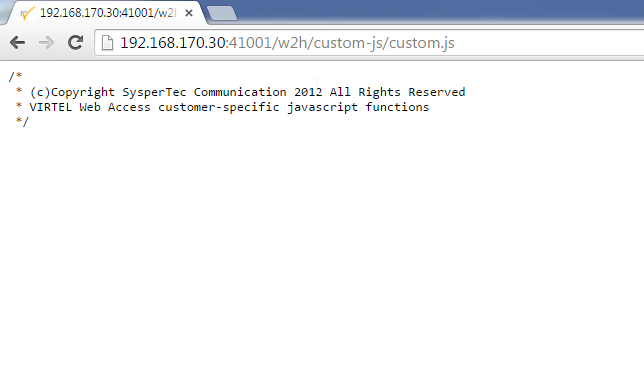

Customising Virtel with 'Options'
================================

As delivered, Virtel contains several web elements which can be
customised to turn on/off features and customise presentation. This
newsletter discusses how to implement a customised Virtel and how to
maintain those customisations across Virtel upgrades. The three main
elements which a customer might wish to customize are:-

+---------------+-------------------+-------------------------+----------------------------+
| **Element**   | **File Type**     | **Default Directory**   | **Description**            |
+===============+===================+=========================+============================+
| custom.css    | CSS               | W2H-DIR                 | CSS Presentation module    |
+---------------+-------------------+-------------------------+----------------------------+
| custom.js     | Javascript File   | W2H-DIR                 | Customised user options    |
+---------------+-------------------+-------------------------+----------------------------+
| w2hparm.js    | Javascript File   | W2H-DIR                 | Controls Virtel features   |
+---------------+-------------------+-------------------------+----------------------------+

*Table 1 – Virtel customise elements*

By default, these elements are shipped in the SAMPTRSF VSAM files and
are associated with transactions in the WEB2HOST and CLIHOST entry
points. In both case the default directory is the W2H-DIR directory
which is associated with the SAMPTRSF VSAM file. If you look at the
SAMPLIB(ARBOLOAD) file you will see that the CLI and W2H transactions
refer to the W2H-DIR.

+-------------------+-------------------+-------------------+-------------------------+-----------------+
| **Entry Point**   | **Transaction**   | **Prefix**        | **Default Directory**   | **VSAM File**   |
+===================+===================+===================+=========================+=================+
| CLIHOST           | CLI-03CC          | /w2h/custom-css   | W2H-DIR                 | SAMPTRSF        |
+-------------------+-------------------+-------------------+-------------------------+-----------------+
|                   | CLI-03CJ          | /w2h/custom-js    | W2H-DIR                 | SAMPTRSF        |
+-------------------+-------------------+-------------------+-------------------------+-----------------+
|                   | CLI-03P           | /w2h/w2hparm-js   | W2H-DIR                 | SAMPTRSF        |
+-------------------+-------------------+-------------------+-------------------------+-----------------+
| WEB2HOST          | W2H-03CC          | /w2h/custom-css   | W2H-DIR                 | SAMPTRSF        |
+-------------------+-------------------+-------------------+-------------------------+-----------------+
|                   | W2H-03CJ          | /w2h/custom-js    | W2H-DIR                 | SAMPTRSF        |
+-------------------+-------------------+-------------------+-------------------------+-----------------+
|                   | W2H-03P           | /w2h/w2hparm-js   | W2H-DIR                 | SAMPTRSF        |
+-------------------+-------------------+-------------------+-------------------------+-----------------+

*Table 2 – Virtel default directories*

During an upgrade the SAMPTRSF is replaced so it is important that any
changes made to these elements are stored in the CLI-DIR and not the
W2H-DIR. The CLI-DIR is associated with the HTMLTRSF VSAM file which is
not replaced as part of an upgrade or migration processes. This TRSF
contains user or customisable Virtel WEB elements.

**How to customise.**

A copy of the default source can be viewed by using a browser to display
the file. For example, to display the shipped custom.css file enter the
following `URL:- <file:///D:\Documents\SysperTec\Newsletters\->`__

192.168.170.30:41001/w2h/custom-css/custom.css

This will display the default custom.css file. The ipaddress:port could
well be different, but as shipped the ipaddress:41001 URL is the W-HTTP
line. The resulting display in the browser is:-

/\*

\* VIRTEL Web Access style sheet for site customisation

\* (c)Copyright SysperTec Communication 2007,2010 All Rights Reserved

\* $Id$

\*/

.myCICSname #toolbar {

background-color:yellow;

}

Using the C-HTTP LINE ipaddress:41002 URL instead of ipaddress:41001
will present the same details as the W-HTTP line because both line
/entry point / transaction refer to the same web element located on the
SAMPTRSF file.

The css file can be saved from the browser display and then customised.
It can then be uploaded to the CLI-DIR directory using the
administration portal. Following the upload the relevant transaction(s)
must be updated to point to the customise web element which is now in
the CLI-DIR directory associated with the HTMLTRSF file. In most case
you would only update the CLI transactions, leaving the W2H transactions
to default to the WEB-DIR.

Updating the transaction can be done online using the Virtel 3270
Administration panels or through an ARBO upload. To use the ARBO
uploaded process, unload the current ARBO, update the relevant
transaction and reload the ARBO. Reloading the ARBO can be a “full
reload” to an empty ARBO file, maintaining the previous ARBO files as a
backup, or by using the ARBO “REPLACE” option and just submitting the
TRANSACTION statements that need to be replace, i.e. a partial ARBO
upload.

Once you have updated the transactions any references to custom.css via
the C-HTTP entry point will be resolved by locating the updated element
on the HTMLSAMP VSAM file and not the default SAMPTRSF VSAM file.

The following display shows that the custom.js file has been customised
as transaction CLI-03CJ now refers to the CLI-DIR:-

|image0|

When we view the custom.js element associated with the transaction in
the CLIHOST (41002) entry point we get the following display in the
browser:-

|image1|

If we display the default custom.js element associated with the
transaction in the WEB2HOST toolkit (41001) entry point we get the
following display:-

|image2|

We can see that the custom.js element is different between the default
in W2H-DIR and the modified version in the CLI-DIR directory. It is
important to note that you shouldn’t need to update any web element in
the W2H-DIR SAMPTRSF directory. This is a distributed target file and
shouldn’t hold any customised elements unless instructed by SysperTec
Suport. If you have modified elements in W2H-DIR it is probably a good
idea to move them to another directory, it doesn’t have to be CLI-DIR,
and update the transactions accordingly to point to the new directory.

**Customising elements.**

**File custom.css**

This module effects the presentation of web pages. The VIRTEL
administrator can customize the color settings for all applications or
for specific applications. The custom settings are defined in a style
sheet called custom.css which the administrator uploads to a VIRTEL
directory designated for storage of customer files (usually CLI-DIR).
For more information see *Virtel Web Access User Guide, Chapter 1.12,
Site Customization of Colors and Logo.*

**File custom.js**

To take into account site-specific JavaScript extensions for Web Access,
the WEB2AJAX.htm page template loads the /w2h/custom-js/custom.js file
when a session is started. An empty custom.js file is delivered as
standard in the W2HDIR directory. The CLI-03CJ (/w2h/custom-js)
transaction delivered as standard under the CLIWHOST entry point
references the W2H-DIR directory, but the administrator can modify this
transaction to reference a different directory containing a
site-specific version of custom.js. The CLI-DIR directory, which is
intended for client-specific files, may be

used for this purpose. See *Virtel Web Access User Guide, Chapter 1.13,
Site Customization of Javascript functions.*

**File w2hparm.js**

The VIRTEL Web Access user can use the Settings menu to modify certain
options such as font size, 3270 key mappings, and color schemes. The
user’s settings are stored in a browser local storage which remains
valid so long as cookies are not deleted from the workstation. The
settings stored in the user’s local storage override the default
settings for VIRTEL Web Access which are stored in the w2hparm.js file.
See “\ *Global modification of Web Access settings*\ ”, in the *Virtel
Web Access User Guide, chapter 1.7* for further details. The Web Access
Settings menu can be displayed with two different patterns, presented as
"Version 1" or "Version 2". This is controlled through the settings in
w2hparm.js See “\ *Choosing Web Access settings pattern*\ ”, in the
*Virtel Web Access User Guide, chapter 1.7* for further details.

**Alternatives forms of customization.**

If it is the case that only the W-LINE port (41001) is utilized in
Virtel, and not the C-LINE port (41002), then customization only applies
to the W2H transactions; pointing them to the modified elements saved in
the CLI-DIR directory. Alternatively, if you are maintaining only the
elements in the W2H-DIR then any Virtel upgrade will over write your
customized elements because an upgrade will replace the SAMPTRSF file.
To avoid losing modifications it would be necessary to save the elements
before updating the SAMPTRSF and then upload then saved elements to the
W2H-DIR after the upgrade.

.. |image1| image:: images/media/image2.png
   :width: 6.26806in
   :height: 3.18333in

