.. _tn201517:

Virtel Chinese Character Language Support
=========================================

In this newsletter we discuss the Chinese language support and provide
examples in both a mainframe application, ISPF, and a bespoke Web
modernisation application. Here is an example of our web modernisation
screen in Chinese.

|image0|

*Fig 1. - Virtel display of a Chinese screen*

**Setting up the windows environment**

To begin with you will need to install a PinYin tool of some description
and modify your windows environment to support Chinese (Simplified)
language. In our example we use the MicroSoft PinYin IME. The following
screen shot is an example of the Windows Language environment:-

|image1|

*Fig 2. - Setting language support in Windows*

You now have the option to select a Chinese language and using PinYin,
you will be able to enter Chinse characters using MicroSoft’s PinYin
Input Method Editor - IME. You might have to install this product. To
test the IME product open a NOTEPAD file, change to the Chinese
Simplified Language, and type some characters. The language tool bar
will look something like this :-

|image2|

*Fig 3. - Lanuage tool bar*

As you type characters a Chinese display will appear with the PinYin
translation. The character string in “Blue” can be selected to replace
the European characters that you have typed.

|image3|

*Fig 3. - PinYin demonstration in NotePad*

Once the Windows environment is set and the PinYin IME is working we can
continue to configure Virtel to support Simplified Chinese through the
IBM CodePage 1388. Virtel supports a variety of languages in SBCS and
DBCS, and this include Japanese as well as Chinese, but before doing
that we have to ensure that the backend applications can also support
DBCS.

**Application Modifications**

**IMS**

To support the VWM project demonstrated in this newsletter certain
application prerequisites were required. The VWM project utilized a back
end IMS application which delivered 3270 data streams which incorporated
DBCS characters. Also, the terminal receiving the datastreams must be
capable of supporting DBCS. As we shall see in the TSO ISPF example this
is a consideration that must be configured. For the IMS application, the
requirements were:-

In the IMS GEN:-

::

  TRANSACT Macro
  EDIT=ULC Must be specified
  TERMINAL Macro
      OPTIONS=(NOTRSOSI) (Must be specified for VIRTEL relay LUs and other DBCS terminals.)

This IMS applications also uses the following display formats:-

::

  APT510O, APT520O and APT530O. 

These will need to be assembled and installed into the IMS environment we will be testing against. The source and JCL to compile and install these modules can be found in *SP000.IMS.SOURCE* or obtained from the Syspertec FTP website.

IMS installation jobs:-

::

  MFSJCL    - Compile formats
  MFSSTAGE  - Install into IMS
  Source    - APT510, APT520, APT530

**TSO**

Within an ISPF context the terminal type receiving the DBCS data stream
must be configured to support DBCS and SBCS. This is configured by
setting the MIXED MODE attribute in the View and Edit settings of ISPF.

|image4|

*Fig 4. - Miwed mode support in ISPF*

Mixed mode, in ISPF, enables the display of both SBCS and DBCS
characters. If this flag turns off after setting it, it means that ISPF
cannot set the terminal to mixed mode. This is normally attributed to an
incorrect logmode. In the example above we are using the logmode
D4A32XX3 which should enable you to set the VIRTEL terminal to MIXED
MODE.

This is defined in the default logmode table for VTAM – ISTINCLM. The
assembler source for this module can be found in SYS1.SAMPLIB. The
sample entry looks like:-

::

  TITLE 'D4A32XX3'
  **********************************************************************
  *                                                                    *
  * 3274 MODEL 1A (LOCAL SNA) @OY02946                                 *
  * PRIMARY SCREEN 24 X 80 (1920)                                      *
  * ALTERNATE SCREEN TO BE DETERMINED BY APPLICATION                   *
  *                                                                    *
  **********************************************************************

  D4A32XX3 MODEENT
  LOGMODE=D4A32XX3,FMPROF=X'03',TSPROF=X'03',PRIPROT=X'B1',SECPROT=X'90',COMPROT=X'3080',RUSIZES=X'87C7',
      PSERVIC=X'028000000000000000000300',APPNCOS=#CONNECT 

**Configure Virtel to support Simplified Chinese.**

To configure Virtel to support Simplified Chinese the TCT must be
altered and recompiled and the Transaction Entry point and transactions
altered/added to the ARBO file.

1. **Virtel TCT Modifications**

    In the TCT modify the CHARSET key word to include the Chinese DBCS
    Codepage. In the example that follows we have modified the character
    sets loaded by Virtel to include the Chinese CodePage and have set
    that as the default Codepage to IBM1388, the Chinese Simplified
    Codepage used by Virtel:-

::

    DEFUTF8=IBM1388, DEFAULT OUTPUT ENCODING *
    CHARSET=(IBM1388, CHINESE SIMPLIFIED *
    IBM1047, US OPEN SYSTEMS *
    IBM933A, KOREAN *
    IBM0037, US EBCDIC *
    IBM1390,IBM1399), JAPANESE *

2. **Virtel Transaction Modifications**

    To support DBCS the entry type that is being used by VIRTEL must be
    configured with the EXTCOLOR=X option. In our example we are using
    the CLIWHOST entry point. This change can be done through batch,
    using the VIRCONF program, dynamically using the online
    administration interfaces. In our example we used the batch VIRCONF
    program to update the ARBO with the relevant changes to support the
    ISPF and IMS test applications.

    Appendix A is an example of the changes required to support the
    Chines test. You will note that there are some additional Virtel
    Transactions, Sub directories and Entry changes. The changes to the
    ARBO are as follows:-

3. **New Transactions**

::

    W2H-80C Enable upload of pages to CHI-DIR directory
    CLI-07 Support English display of IMS screens
    CLI-08 Support Chinese display of IMS screens
    CLI-59 IMS Access to IMS Application

4. **New Sub-Directory**

A new sub directory is required, CHI-DIR, to hold the Chinese pages produced by Virtel Screen Redesigner

**Updated Transaction Entry**

::

    Transaction CLIWHOST:-

        Add EXTCOLOR=X              To support DBCS characters.
        SCENDIR=SCE-DIR             To enable load of scenario from the  SCE-DIR.

5. **Virtel TRSF changes**

The relevant templates and scenarios used in the IMS demonstration
must be uploaded to the TRSF. These web elements can be found in the
SVN directors as detailed below. The following actions must be
performed to make the relevant templates stc availed to Virtel. The
templates and web artefacts produced by the Virtel Screen Designer
product must be uploaded to the relevant sub directories. Unless
stated all source references are directories and all members must be
copied up.

    **Source Target Directory**

::

    \svn\sysper\carcomp\GAP POC\carcomp VirtelSR\upload                 CHI-DIR, CLI-DIR
    \svn\sysper\carcomp\GAP POC\carcomp VirtelSR\\VSRwithOwn\\upload    CHI-DIR, CLI-DIR
    \svn\sysper\carcomp\GAP POC\carcomp
    VirtelSR\VSRwithOwn\upload\images                                   CHI-DIR, CLI-DIR
    \svn\sysper\carcomp\GAP POC\carcomp VirtelSR\Html\cn                CHI-DIR
    \svn\sysper\carcomp\GAP POC\carcomp VirtelSR\Html\us                CLI-DIR
    \svn\sysper\carcomp\GAP POC\carcomp VirtelSR\scenario\GAPPOCSC.390
    SCE-DIR

6. **Scenario GAPPOCSC**

The source for the scenario is listed in Appendix C. This can be
used to create a load module version of the scenario rather than a
.390 version. The scenario load module can then be stored in the
VIRTEL LOADLIB rather than maintained in a SCE-DIR directory.

**Running the IMS demo**

Point your VIRTEL at the initial template using the following url:-

::

  http://192.168.170.30:41002/cn/carcompPOC.htm

The following screen will appear

|image5|

Click on the logo to display the IMS logon screen:-

|image6|

Logon to IMS with your valid credentials. The IMS Session status screen
is displayed:-

|image7|

Enter the following display format command /FOR APT510O.

The IMS backend application will respond with the screen display but in
Chinese.

|image8|

Turn on the Chinese (Simplified) language in the language bar. This will
enable you to enter Chinese test (Using PinYin) into the input fields.

|image9|

Select the Chinese text from the PinYin display.

|image10|

This is the end of the IMS Chinese Language demonstration. The same
demonstration can be repeated using the English language. This is simply
a matter of changing the directory in the initial from …/cn/… to …/en/…
:-

`*http://192.168.170.30:41002/en/carcompPOC.htm* <http://192.168.170.30:41002/en/carcompPOC.htm>`__

Proceeding with the same scenario as described in the Chinese
demonstration we eventually show the final display, but now in the
English.

|image11|

**
TSO Demonstration**

The TSO test demonstrates how Chinese text can be used to edit a file.
The only requirement in this test is that the terminal type support
MIXED MODE. This is conjured by setting the EXTCOLOR=X on the CLIWHOST
entry point. In the ISPF Edit screen below we can see that the MIXED
MODE flag is set.

|image12|

If we use option 3.4 to list and edit a “CHINESE” edited file we get the
following display:-

|image13|

A “Hex On” of the file clearly shows that the transparent “SI x’0E’” and
“SO x’0F’” have been inserted into the file and encapsulate the DBCS
strings.

|image14|

**Entering Chinese characters.**

To enter Chinese characters into the file we must use WEB2VIRT template
and not the WEB2AJAX template. This is because the input variables are
not available to the PinYin program with WEB2AJAX. Using WEB2VIRT is
cumbersome in comparison to WEB2AJAX but nevertherless when we arrive at
the ISPF Edit page we can now enter characters using PinYin.

|image15|

Selecting the highlighted blue pinyin text will insert the characters
into the file.

**Appendix A. Example of VIRCONF**

Example of the batch VIRCONF job required to support Chinese Character
tests. This job must be run against the ARBO file when Virtel is down.

::

  //SPTHOLTA JOB 1,VIRCONF,CLASS=A,MSGCLASS=X,NOTIFY=&SYSUID
  // SET LOAD=SPTHOLT.VIRT453.LOADLIB
  // SET ARBO=SP000.SPVIREH.ARBO
  //CONFIG EXEC PGM=VIRCONF,PARM=LOAD
  //STEPLIB DD DSN=&LOAD,DISP=SHR
  //SYSPRINT DD SYSOUT=*
  //SYSUDUMP DD SYSOUT=*
  //VIRARBO DD DSN=&ARBO,DISP=SHR
    TRANSACT ID=W2H-80C, -
        NAME='uplchi', -
        DESC='Upload HTML pages (CHI-DIR directory)', -
        APPL=VIR0041C, -
        TYPE=2, -
        TERMINAL=DELOC, -
        STARTUP=2, -
        SECURITY=1, -
        LOGMSG=CHI-DIR
        TRANSACT ID=CLI-07, -
        NAME='en', -
        DESC='CLI directory (English version)', -
        APPL=CLI-DIR, -
        TYPE=4, -
        TERMINAL=CLLOC, -
        STARTUP=2, -
        SECURITY=0
        TRANSACT ID=CLI-08, -
        NAME='cn', -
        DESC='CHI directory (Chinese version) xxxxxxxxxxxxxxxxxx-
        ', -
        APPL=CHI-DIR, -
        PASSTCKT=0, -
        TYPE=4, -
        TERMINAL=CLLOC, -
        STARTUP=2, -
        SECURITY=0
        TRANSACT ID=CLI-59, -
        NAME=carcompAJAX, -
        DESC='IMS Access for carcomp POC (GAP)', -
        APPL=IMS3270, -
        TYPE=1, -
        TERMINAL=CLVTA, -
        STARTUP=1, -
        SECURITY=0, -
        TIOAEND='&#6D/rcl', -
        EXITMSGO=GAPPOCSC
        SUBDIR ID=CHI-DIR,
        DESC='Pages for Chinese POC',
        DDNAME=HTMLTRSF,
        KEY=CHI-KEY,
        NAMELEN=0064,
        AUTHUP=X,
        AUTHDOWN=X,
        AUTHDEL=X
        ENTRY ID=CLIWHOST, -
        DESC='HTTP entry point (CLIENT application)', -
        TRANSACT=CLI, -
        TIMEOUT=0005, -
        ACTION=0, -
        EMUL=HTML, -
        SIGNON=VIR0020H, -
        MENU=VIR0021A, -
        IDENT=SCENLOGM, -
        SCENDIR=SCE-DIR, -
        EXTCOLOR=X

**Appendix B. ERRORS**

**Screen Input Error**

ISPF TSO TPUT/TGET calls have a maximum buffer size. If this is exceeded
than then following error message will be displayed. Because with have
switched DBCS support on in our Virtel Entry Point, the size of the
buffer, that being 52 rows and 121 columns display as well as the
additional memory required to support DBCS characters exceeds the TSO
TGET buffer size. To remedy this problem we have to reduce the buffer
size. This can be done by changing the number of rows from 52 to 43.
With this configuration we no longer have the TGET error.

|image16|

**Appendix C. Source for scenario GAPSOCSC**

::

  * ---------------------------------------------------------------------
  * SCENARIO FOR carcomp POC (Global Account Payable)
  * checks the screen to send the related template
  * ---------------------------------------------------------------------
  GAPPOC    SCREENS APPL=GAPPOC
  *
            SCENARIO OUTPUT
  *
  *
  * checks the title
  *
            CASE$ (01,21,20), *
              (EQ,'Manual Payment Input',APT510), *
              (EQ,'Manual Payment Appro',APT520), *
              (EQ,'Manual Payment Enqui',APT530), *
              ELSE=CLASSIC
  *
  *
  * Screen 'Manual Payment Input' - MFS map APT510
  *
  APT510      DS 0H
              SET$ PAGE,'PGAPT510.html'
              SCENARIO END
  *
  *
  * Screen 'Manual Payment Approval' - MFS map APT520
  *
  APT520      DS 0H
              SET$ PAGE,'PGAPT520.html'
              SCENARIO END
  *
  *
  * Screen 'Manual Payment Enquiry ' - MFS map APT530
  *
  APT530      DS 0H
              SET$ PAGE,'PGAPT530.html'
              SCENARIO END
  *
  *
  * Screen is not related to a specific template
  * Use classic 3270 presentation sub-page
  *
  CLASSIC     DS 0H
              SET$ PAGE,'VSRajax.html'
              SCENARIO END
  *
              SCRNEND
              END

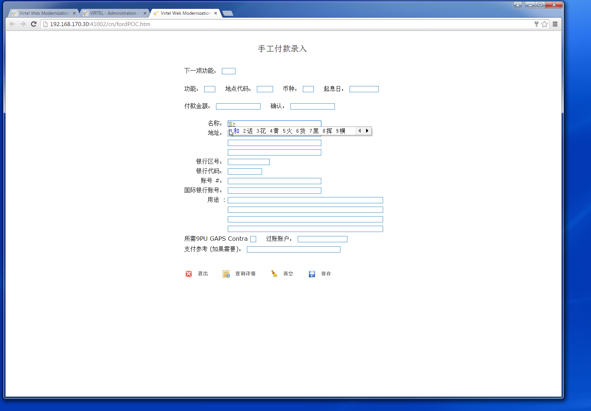
.. |image1| image:: images/media/image2.png
   :width: 4.59439in
   :height: 5.18822in
.. |image2| image:: images/media/image3.png
   :width: 6.09460in
   :height: 0.41672in
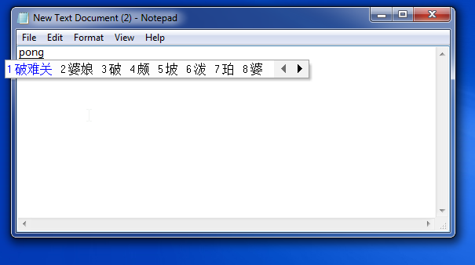
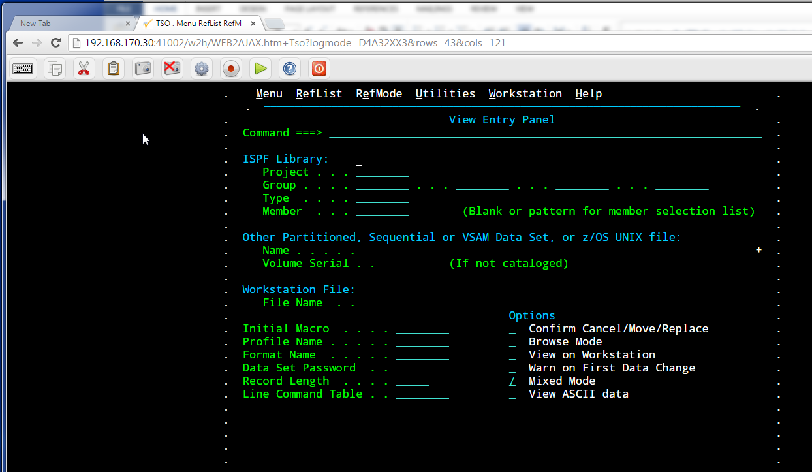
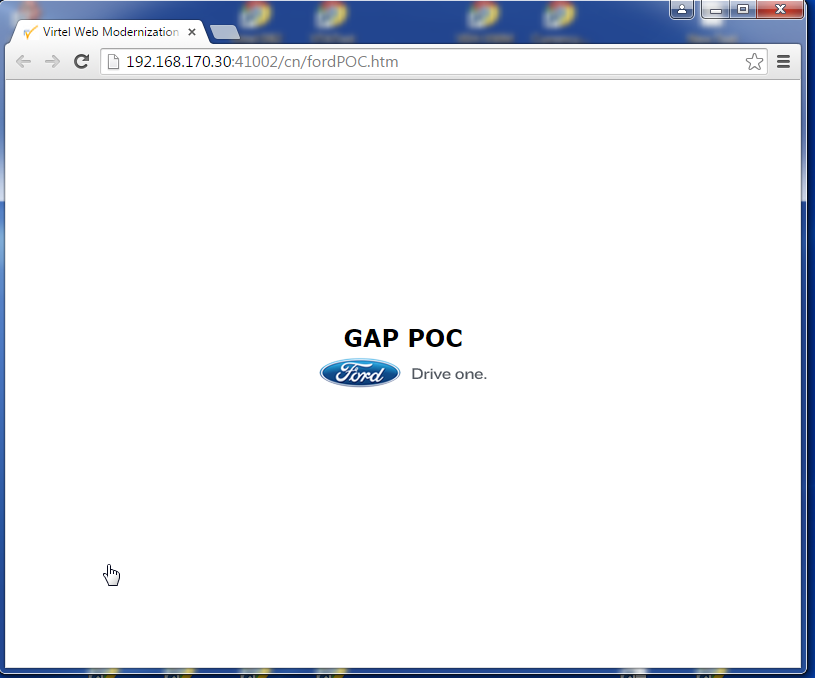
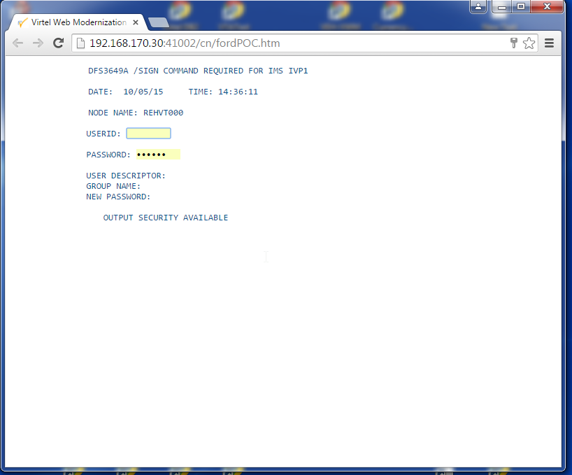
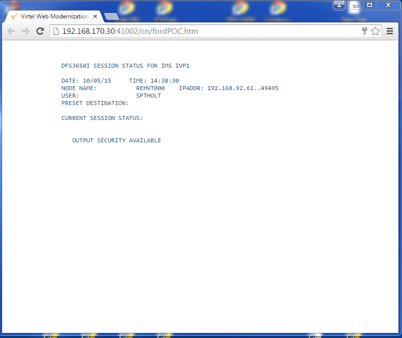
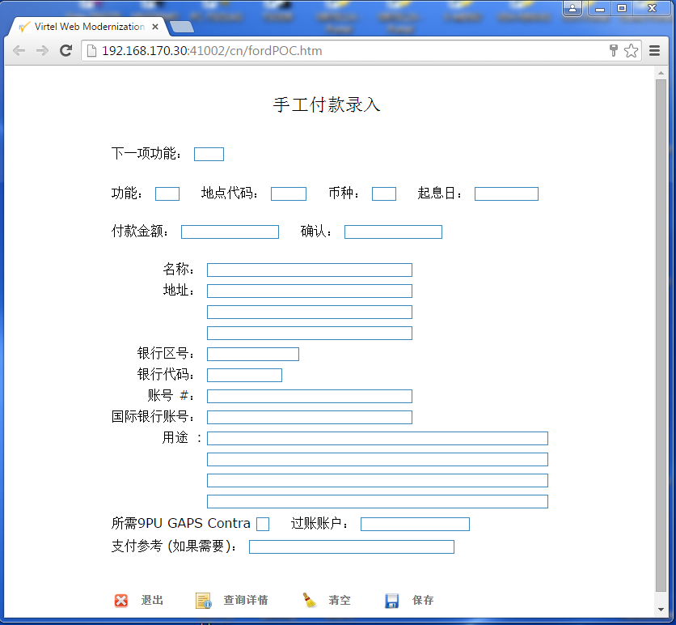
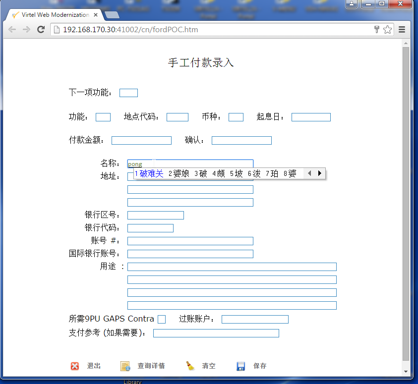

.. |image11| image:: images/media/image12.png
   :width: 4.79167in
   :height: 4.55187in
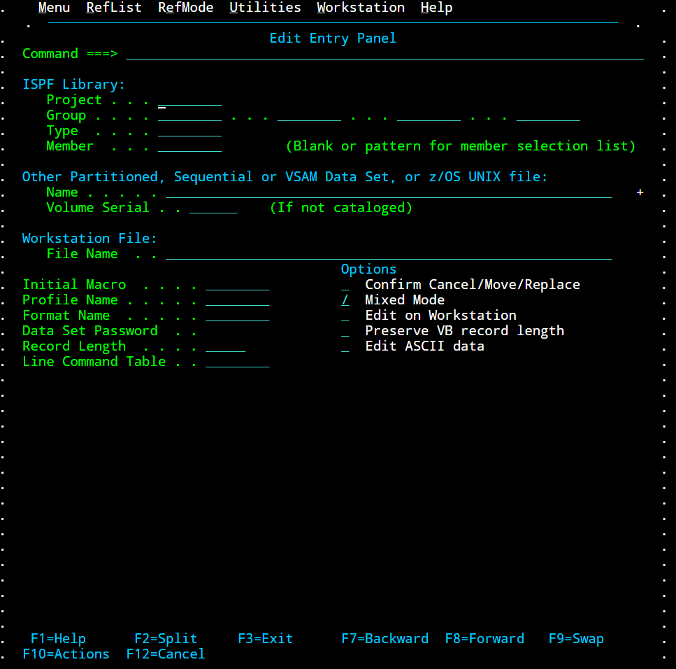
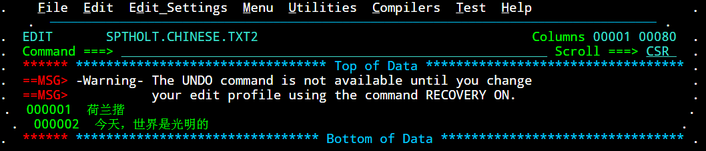
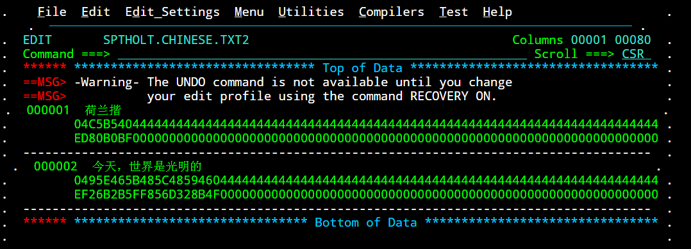
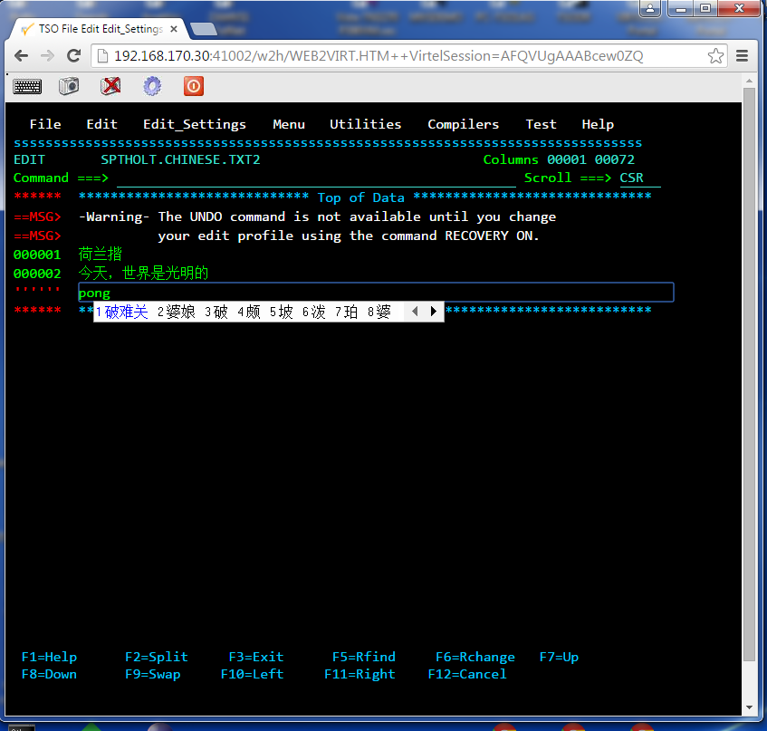
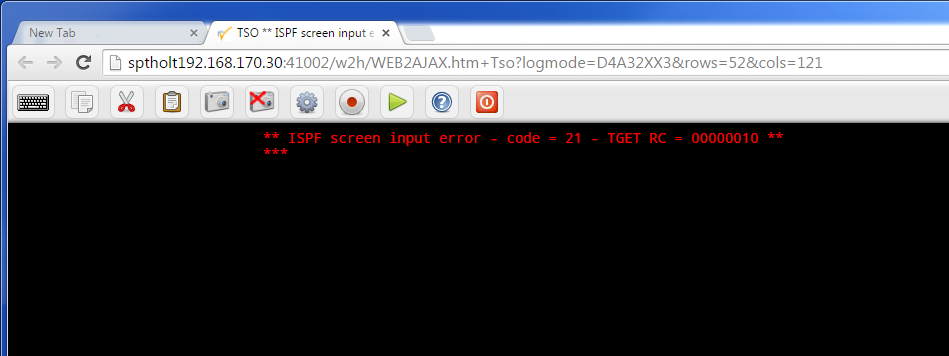
