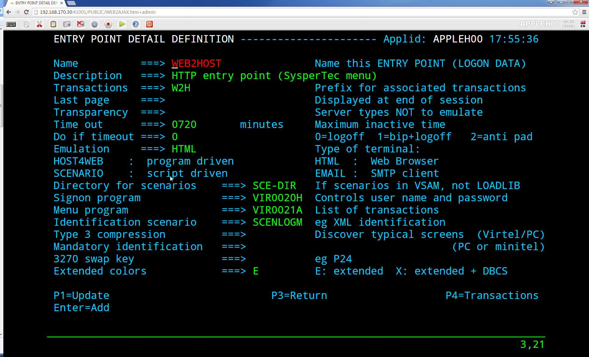
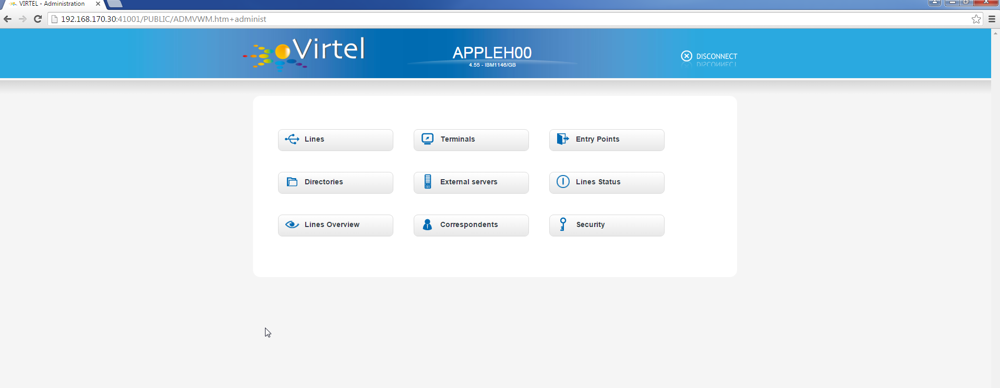

.. _tn201522:

What’s new in Virtel 4.55
=========================

The following newsletter discusses some of the new features that are available in Virtel Release 4.55.

**CICS QUICKLNK support for multiple CHANNEL and CONTAINER names**

Quicklink support has been enhanced to allow multiple channels and
contains. QuickLink is a protocol used in support of Syspertec’s Virtel
Transaction Gateway (VTG) product which is an alternative to IBM’s CTG
solution.

::

	OPTION$ FOR-QUICKLNK,
	(METHOD,'CALL-CONTAINER-LIST'),
	(PROGRAM,'*TARGET'),
	(CONTAINERS-FOR-QUESTION,'DATAIN'),
	(CONTAINERS-FOR-RESPONSE,'DATAOUT'),
	(CHANNEL,'*MYCHANNEL'),
	(TERMINAL,'CICS-TERMINAL'),
	(RET-CODE,'RETURN-CODE'),
	(RET-CICS1,'EIBRESP'),
	(RET-CICS2,'EIBRESP2'),
	TOVAR='MYPARMS'

**Improved SCREEN-PROCESSING facility**

This modification introduces a new screen processing facility by
allowing you to SET$ a SCREEN-POSITION, advancing the SCREEN-POSITION,
CASE$ for a SCREEN-POSITION and COPY$ to/from a SCREEN-POSITION.

Example:

Setting a screen position. (hh equals the number of lines in the column)

::

	SET$ SCREEN-POSITION,(lig,col,len,hh)

Advancing the position to next line:

::

	SET$ SCREEN-POSITION,TO-NEXT-LINE

If the next line is after the end of the current screen rectangle, it wraps to back to the beginning. This condition may be tested with:

::

	IF$ NOT-FOUND,THEN=...
	CASE$ which works with the current screen position:
	CASE$ CURRENT-SCREEN-POSITION,(EQ,'XXXX',ET1),...

CASE$ which works with current screen line, column, length, equal sign and hard coded column and length:-

::

	CASE$ (=,COL,LEN),(EQ,'XXXX',ET1),...
	COPY$ which works with current screen line, column, length, equal sign:
	COPY$ VARIABLE-TO-SCREEN,VAR='VAR1',SCREEN=(=,col,len)

**Support for MAP$ JSON input.**

Support is added to JSON format to be copied into a commarea. This complements the existing XML and QUERY data currently supported by the MAP$ statement.

::

	COMMAREA MAP$ FROM-VARIABLE,XML,VAR='MYINPUT' default
	COMMAREA MAP$ FROM-VARIABLE,QUERY,VAR='MYINPUT'
	COMMAREA MAP$ FROM-VARIABLE,JSON,VAR='MYINPUT'

Other supported MAP$ structures:-

::
	COMMAREA MAP$ FROM-INPUT,JSON (Input is in json format)
	COMMAREA MAP$ FROM-INPUT,JSON,FIELD='MYINPUT'

**New toolbar button to toggle the 3278T mode on/off.**

The 3278T button is hidden by default but can now be shown by selecting options in the user settings dialog.

**New UNLOAD command to unload ARBO.**

Following the performance improvements through the introduction of VSAM LSR the VIRCONF program was no longer able to access the ARBO VSAM file when VIRTEL was running. To compensate for this a new UNLOAD command has been added to VIRTEL which performs an ARBO UNLOAD.

Example:

::

	F virtel,unload

This command invokes the VIRCONF program which unloads the ARBO file. The following DD statement must be added to the Virtel procedure:-

::

	//SYSPUNCH DD DSN=SP000.VIRTELxx.VIRCONF.SYSIN,DISP=(,CATLG),
	// UNIT=SYSDA,VOL=SER=VVVVVV,SPACE=(TRK,(5,1)),
	// DCB=(RECFM=FB,LRECL=80,BLKSIZE=6080)

Or alternatively:-

::

	//SYSPUNCH DD SYSOUT=B

**Customization of the Virtel toolbar**

The toolbar elements can now be controlled through a user custom.js Javascript element. An example is provided below.

Sample customization code[in custom.js]:

::

	/*
	* Customize the location of dynamic toolbar buttons.
	* The calls to this function are ignored when they
	* return nothing, or an integer not greater than 0.
	*
	* Customizable buttons IDs :
	* > '3278T'
	* > 'document-print-preview'
	* > 'file-send'
	* > 'file-recv'
	* > 'printer'
	*/
	function customize\_toolbarButtonIndex(id) {
	if (id==='printer' \|\| id==='document-print-preview') {
	return getToolbarButtonIndex('disconnect') + 1;
	}
	}

**NEW MAP$ FROM-INPUT TO-VARIABLES parameter**

The MAP$ FROM-INPUT statement now has a new TO-VARIABLES parameter. This enables conversion of input directly to output variables without the need to go through an intermediate commarea.

Before you had to use three statements:-

::

	JSONAF1 MAP$ FROM-INPUT,JSON,FIELD='MYINPUT' 	generate commarea
	JSONAF1 MAP$ TO-VARIABLE,VAR='MYCRBO00'         copy commarea to variable
	JSONAF1 TOVAR$ FROM-VARIABLE,VAR='MYCRBO00'     generate variables

	This would convert the JSON input to variables with the names specified in the JSONAF1 MAP$. Now, the similar conversion can be achieved with 	just one statement:-

::

	JSONAF1 MAP$ FROM-INPUT,JSON,TO-VARIABLES,FIELD='MYINPUT'    generate variables

.. note::
	
	This new form of the instruction alleviates the need for an OCCURS=UNLIMITED at the end of a description.

**Allow re-execution of a MAP$ FROM-INPUT**

In the following scenario, the two 'MAP$ FROM-INPUT' will produce the same output.

Example:-

::

	JSON1 SCREENS APPL=JSON1
	*
	SCENARIO INITIAL
	*
	SET$ ENCODING,UTF-8,'IBM1147'
	JSONAF1 MAP$ BEGIN
	MAP$ AREA,WITH='inAFR',LENGTH=30
	MAP$ AREA,WITH='inICT',LENGTH=30
	*
	INSUBFS MAP$ BEGIN,WITH='friends'
	INSUBF MAP$ BEGIN,WITH=NEXT-ELEMENT,OCCURS=UNLIMITED
	MAP$ AREA,WITH='inRRN',LENGTH=17
	MAP$ AREA,WITH='inQtyT10',LENGTH=10,TYPE=9
	INSUBF MAP$ END
	INSUBFS MAP$ END
	JSONAF1 MAP$ END
	*
	JSONAF1 MAP$ FROM-INPUT,JSON,TO-VARIABLES,FIELD='MYINPUT'
	ERROR$ 0,'COUNT=','*INSUBF'
	DEBUG$ SNAP,TERMINAL
	PERFORM$ DECODE
	*
	JSONAF1 MAP$ FROM-INPUT,JSON,TO-VARIABLES,FIELD='MYINPUT'
	ERROR$ 0,'COUNT=','*INSUBF'
	DEBUG$ SNAP,TERMINAL
	PERFORM$ DECODE
	*
	SCENARIO END
	*
	DECODE SCENARIO SUBROUTINE
	DECODELOOP LABEL$
	IF$ NOT-EXISTS-VARIABLE,'inRRN',THEN=THEEND
	ERROR$ 0,'inRRN=','*inRRN'
	ERROR$ 0,'inQtyT10=','*inQtyT10'
	POP$ FIRST-VALUE-OF,VAR='inRRN'
	POP$ FIRST-VALUE-OF,VAR='inQtyT10'
	GOTO$ DECODELOOP
	THEEND LABEL$
	SCENARIO END
	*
	SCRNEND
	END ,

**New trimming functions. CASE$ RTRIM and LTRIM / EMPTY**

Two new optional parameters for the CASE$ instruction, RTRIM= and LTRIM=, allow the removal of one or more characters from the various operands of the CASE$ instruction before the comparisons are done.

Also, a new CASE$ condition EMPTY is added to allow testing whether a variable or a part of the screen buffer is empty. The empty condition can be tested after the variable or screen has been trimmed.

Examples:-

::

	  CASE$ 'MYVAR',                                *
	   (EMPTY,L2),                                  *
	   (CONTAINS,'*Val',L1)                         *
	   RTRIM=('\_',' '),                            *
	   LTRIM=('\_',' '),                            *
	   ELSE=other
	*
	  CASE$ (1,1,80),                               * 
	   (CONTAINS,'Val',L1),RTRIM=('\_',' ')

..note::

	1: CASE$ do not change the contents of the variables or parts of the screen being compared.

	2: If the variable being tested does not exist, (eg 'MYVAR' does not exist), it is not considered empty. Rather, the CASE$ branches at the ELSE= label.

LTRIM and RTRIM will trim both the value being tested (variable or part of the screen buffer) and the variable arguments, but not the static arguments.

For example:-

    (EQ,'*VAR1',label1) The value of the VAR1 variable will be trimmed prior to comparison.

    (EQ,'zagreb ',label2) The value of the string 'zagreb ' will NOT be trimmed – it is a static argument.

**New trimming functions. COPY$ RTRIM and LTRIM**

Two new optional parameters for the COPY$ LIST-TO-VARIABLE instruction, RTRIM= and LTRIM=, will trim one or more characters from the various variable operands of the COPY$ instruction prior to performing the copy.

Example:-

		COPY$ LIST-TO-VARIABLE,VAR='VAR1',                          *
			RTRIM=('\_',' '),LTRIM=('\_',' '),
		LIST=('string1','*var1',VARIABLE,'var2')

The variable VAR1 is created/modified, with 'string1' copied as is, var1 and var2 left and right trimmed.

**Indirection on OUTPUT-FILE-TO-VARIABLE FILE=**

This feature allows indirection of a file name. The filename is pointed to by the variable *variable\_name.

Example:-

::

	COPY$ OUTPUT-FILE-TO-VARIABLE,FILE='*MYFILE',VAR='MYRESULT'

**COPY$ VARIABLE-TO-VARIABLE**

Copies a source variable to a target variable. VAR= must specifies two variable names, the first being the source, the second the target.

TYPE=REP may be specified to mean the target variable should be replaced. Otherwise the new value is appended the target variable.

OFFSET= is the number of characters to skip in the string, defaulting to 0.

LENGTH= is how many characters to copy, defaulting to the remainder of the string from start. If length is longer than the string, padding occurs with the PAD= character. This defaults to the blank.

Example:-

::

COPY$ VARIABLE-TO-VARIABLE,
    VAR=('VAR1','VAR2'),
    OFFSET=8,LENGTH=5,PAD=' '

**COPY$ CURRENT-LINE enhancement**

This update complements the CASES$ CURRENT-SCREEN POSITION feature. It allows copying of current values of the field in the SCREEN-POSITION to a variable. The length of the returned value may be specified with the LENGTH= parameter.

Examples:-

::

	SET$ SCREEN-POSITION,(10,20,5,15) 
	SET$ SCREEN-POSITION,TO-NEXT-LINE
	COPY$ SYSTEM-TO-VARIABLE,VAR='L1',LENGTH=2,                       *
		FIELD=(VALUE-OF,CURRENT-LINE)
	COPY$ SYSTEM-TO-VARIABLE,VAR='C1',LENGTH=2,                       *
		FIELD=(VALUE-OF,CURRENT-COLUMN)
	COPY$ SYSTEM-TO-VARIABLE,VAR='L2',                                *
		FIELD=(VALUE-OF,CURRENT-LENGTH)
	COPY$ SYSTEM-TO-VARIABLE,VAR='H1',                                *
		FIELD=(VALUE-OF,CURRENT-HEIGHT)

**Virtel Memory Display**

The Memory display feature is a memory diagnostic tool created to trap possible invalid Virtel memory free requests. Such request can lead to ABEND0C4s and other unwanted behaviour. Virtel memory requests (PRENDRE and RENDRE) are tracked in a diagnostic storage area located above the bar.

The area is 1MB in size and can contain 65536 active storage requests. An active storage request is a storage area that has been gotten (PRENDRE) and is pending a Virtel storage release (RENDRE).

This diagnostic tool should only be used when recommended by Technical Support.

The feature is supported by the following command:-

::

	F VIRTEL,MEMDISPLAY

This produces a breakdown of the internal VIRTEL subpools. See the
following command response:-

:

	F SPTHOLTV,MEMDISPLAY
	VIR0200I MEMDISPLAY
	VIR0271I DISPLAY 763
	SP1=00024478 SP2=00000CCC SP3=00090DE0 SP4=000027E4 00910091 00030009 02430294 00090011
	SP5=00029293 SP6=0004DCF4 SP7=00000000 SP8=00000000 00A404C7 01370137 00000000 00000002
	POOL CONTROL BLOCK. SUBPOOL=1
	PAG=00108000 NFQ=00108008 #FQ=00000001 FRE=0000B2A0
	PAG=000F8000 NFQ=000F8008 #FQ=00000001 FRE=00000080
	PAG=000E8000 NFQ=000E8008 #FQ=00000001 FRE=00000078
	POOL CONTROL BLOCK. SUBPOOL=2
	PAG=1EC14000 NFQ=1EC14008 #FQ=00000004 FRE=0000F2F0
	POOL CONTROL BLOCK. SUBPOOL=3
	PAG=1ECC4000 NFQ=1ECC4008 #FQ=00000002 FRE=00006408
	PAG=1ED54000 NFQ=1ED54008 #FQ=00000002 FRE=00001750
	PAG=1EC74000 NFQ=1EC74008 #FQ=00000001 FRE=00000878
	PAG=1ED04000 NFQ=1ED04008 #FQ=00000001 FRE=00000878
	PAG=1ED94000 NFQ=1ED94008 #FQ=00000002 FRE=00002768
	PAG=1ECF4000 NFQ=1ECF4008 #FQ=00000002 FRE=000017F0
	PAG=1EE04000 NFQ=1EE04008 #FQ=00000001 FRE=00000878
	PAG=1ED74000 NFQ=1ED74008 #FQ=00000001 FRE=00000878
	PAG=1ECE4000 NFQ=1ECE4008 #FQ=00000001 FRE=00000878
	PAG=1EC64000 NFQ=1EC64008 #FQ=00000001 FRE=00000878
	POOL CONTROL BLOCK. SUBPOOL=4
	PAG=1EC04000 NFQ=1EC04008 #FQ=00000003 FRE=0000D750
	POOL CONTROL BLOCK. SUBPOOL=5
	PAG=1ED24000 NFQ=1ED24008 #FQ=00000001 FRE=0000A1D8
	PAG=1ED14000 NFQ=1ED14008 #FQ=00000001 FRE=000043B8
	PAG=1EC54000 NFQ=1EC54008 #FQ=00000001 FRE=000043B8
	PAG=1EBB4000 NFQ=1EBB4008 #FQ=00000001 FRE=000043B8
	POOL CONTROL BLOCK. SUBPOOL=6
	PAG=1EBF4000 NFQ=1EBF4008 #FQ=00000003 FRE=00000D40
	PAG=1EBE4000 NFQ=1EBE4008 #FQ=00000001 FRE=00000088
	PAG=1EBD4000 NFQ=1EBD4008 #FQ=00000001 FRE=000000B8
	PAG=1EBC4000 NFQ=1EBC4008 #FQ=00000001 FRE=000000D0
	PAG=1EBA4000 NFQ=1EBA4008 #FQ=00000001 FRE=00000108
	POOL CONTROL BLOCK. SUBPOOL=7
	PAG=00000000 NFQ=00000000 #FQ=00000000 FRE=00000000
	POOL CONTROL BLOCK. SUBPOOL=8
	PAG=00000000 NFQ=00000000 #FQ=00000000 FRE=00000000
	ALLOC=0001213K, FREE=0000314K, TOTAL=0001536K
	VIR0272I END

**Enablement/Dis-enablement**

The memory diagnostic tool is only activated through the following TCT parameter

::

	MEMORY=(ABOVE,MEMHST),

The memory diagnostic tool can be deactivated by the following command:-

::

	F VIRTEL,MEMDISPLAY,DISABLE

Operation
^^^^^^^^^

With the memory diagnostic tool active the following command be used to summarize the VIRTEL subpool active allocated memory:-

::

	F VIRTEL,MEMDISPLAY

The following will be displayed:-

::

	F SPTHOLTV,MEMDISPLAY
	VIR0200I MEMDISPLAY
	VIR0271I DISPLAY 978
	SP1=00024478 SP2=00001044 SP3=0008E35F SP4=00002F61
	00910091 00040009 02380294 000B0011
	SP5=000317DC SP6=0004DF73 SP7=00000000 SP8=00000220 00C504C7 01370137 00000000 00000002
	POOL CONTROL BLOCK. SUBPOOL=1
	PAG=00109000 NFQ=00109008 #FQ=00000001 FRE=0000B2A0
	PAG=000F9000 NFQ=000F9008 #FQ=00000001 FRE=00000080
	PAG=000E9000 NFQ=000E9008 #FQ=00000001 FRE=00000078
	POOL CONTROL BLOCK. SUBPOOL=2
	PAG=1EC14000 NFQ=1EC14008 #FQ=00000005 FRE=0000EF68
	POOL CONTROL BLOCK. SUBPOOL=3
	PAG=1ECD4000 NFQ=1ECD4008 #FQ=00000002 FRE=00009DF8
	PAG=1ED54000 NFQ=1ED54008 #FQ=00000002 FRE=00001750
	PAG=1EC84000 NFQ=1EC84008 #FQ=00000001 FRE=00000878
	PAG=1ED04000 NFQ=1ED04008 #FQ=00000001 FRE=00000878
	PAG=1ED94000 NFQ=1ED94008 #FQ=00000002 FRE=00002768
	PAG=1ECF4000 NFQ=1ECF4008 #FQ=00000001 FRE=00000878
	AG=1EE04000 NFQ=1EE04008 #FQ=00000001 FRE=00000878
	PAG=1ED74000 NFQ=1ED74008 #FQ=00000001 FRE=00000878
	PAG=1ECE4000 NFQ=1ECE4008 #FQ=00000001 FRE=00000878
	PAG=1EC64000 NFQ=1EC64008 #FQ=00000001 FRE=00000878
	POOL CONTROL BLOCK. SUBPOOL=4
	PAG=1EC04000 NFQ=1EC04008 #FQ=00000004 FRE=0000CFA0
	POOL CONTROL BLOCK. SUBPOOL=5
	PAG=1ECA4000 NFQ=1ECA4008 #FQ=00000002 FRE=0000D870
	PAG=1ED14000 NFQ=1ED14008 #FQ=00000001 FRE=000043B8
	PAG=1ED24000 NFQ=1ED24008 #FQ=00000001 FRE=000043B8
	PAG=1EC74000 NFQ=1EC74008 #FQ=00000001 FRE=0000A1D8
	PAG=1EC54000 NFQ=1EC54008 #FQ=00000001 FRE=0000A1D8
	PAG=1EBB4000 NFQ=1EBB4008 #FQ=00000001 FRE=000043B8
	POOL CONTROL BLOCK. SUBPOOL=6
	PAG=1EBF4000 NFQ=1EBF4008 #FQ=00000002 FRE=00000A50
	PAG=1EBE4000 NFQ=1EBE4008 #FQ=00000001 FRE=00000088
	PAG=1EBD4000 NFQ=1EBD4008 #FQ=00000001 FRE=000000B8
	PAG=1EBC4000 NFQ=1EBC4008 #FQ=00000001 FRE=000000D0
	PAG=1EBA4000 NFQ=1EBA4008 #FQ=00000001 FRE=00000108
	POOL CONTROL BLOCK. SUBPOOL=7
	PAG=00000000 NFQ=00000000 #FQ=00000000 FRE=00000000
	POOL CONTROL BLOCK. SUBPOOL=8
	PAG=1ECB4000 NFQ=1ECB4008 #FQ=00000001 FRE=0000FDB0
	ALLOC=0001240K, FREE=0000479K, TOTAL=0001728K
	VIR0272I END

The display response is split into a summary section for each subpool and a detailed allocated page block and free queue element display for each subpool.

In the summary display, each subpool has two displayed values. The top value is the amount of storage currently allocated and the value below represents the current allocation in 1K chunks and a peak allocation in 1K chunks.

For example in the above display in SP5 we can see that there is an allocated value of 317DC bytes, represented by 00C5 in 1K chunks, and a peak value of 04C7 in 1K chunks.

At the bottom of the display is a line which provide allocated, free and total values.

**Messages**

**VIRT0085I** INVALID MEMORY FREE REQUEST. ADDR=aaaaaaaa, SUBPOOL=ss, CALLER=aaaaaaaa'

Module : VIR0000
Meaning : The Virtel memory request is invalid because:-

- The subpool is invalid.

- The address to be freed is outside the associated subpool pages.

- The address to be freed is not found in the DSA table.

Action : Virtel continues. If you get a significant number of these messages you consider a schedule a restart of Virtel.

**VIRT0086E** GETMAIN FAILED. MEMORY DSA DISABLED.

Module :VIR0000

Meaning: Virtel was ubale to GETMAIN storage "above the bar" for the DSA table.

Action: Increase MEMLIMIT= in the JCL to provide more "above the bar" storage. Virtel continues but you should contact support if the problem continues. Suggest a default of MEMLIMIT=2G.

**VIRT0087E** FATAL DSA TABEL ERROR

Module :VIR0000

Meaning: The DSA memory table has been corrupted or has been invalidated. Memory diagnostics has been disabled.

Action: Virtel continues but you should consider a scheduled restart of Virtel.

**VIRT0088E** DSA TABLE FULL. MEMORY DIAGS. DISABLED

Module :VIR0000

Meaning: The DSA memory table is full and cannot store further entries. Memory diagnostics disabled.

Action: Virtel contines but you should contact support support. Schedule a restart of Virtel.

**TCT Parameters:**

New MEMORY parameter - MEMHST

MEMORY=(BELOW/ABOVE(DEBUG \| MEMHST \| ALLOW64BITS)

MEMORY=(ABOVE,MEMHST) turns on the Virtel memory diagnostic tool. This
should only be implemented when advised to do so by Technical Support.
Performance degradation might occur due to the additional monitoring
services. This will depend on VIRTEL demand.

Example:-

Use Virtel memory management with memory diagnostic tool and above the
bar storage.

MEMORY=(ABOVE,MEMHST,ALLOW64BITS)

**New diagnostic option - SNAPMSG**

The SNAPMSG enhancement allows a SNAP or DUMP to be taken whenever a
particular

message number is issued by VIRTEL. The command has an additional search
field which can be used to identify a message with a particular
character string. For example a specific return code.

The enhancement is defined within the TCT using the SNAPMSG= keyword or
as a command.

Command format:

F VIRTEL,SNAPMSG=msgno[,search],[S\|A]

TCT keyword:

SNAPMSG=(msgno,search,action)

Default search is none.

Default action is SNAP

Constraints:

All msgno are 8 characters.

The search field has is restricted to a maximum of 10 Characters.
Anything beyond this will be ignored.

Actions: S = SNAP or A = ABEND.

Virtel will abend with a U0999 abend code, reason code 15 if the ABEND
action is used.

**Messages**

**'VIR0262W SNAPMSG TRIGGERED - VIRTEL ABENDED \| SNAP TAKEN',**

Module :VIR0002

Meaning A message has been trapped by the SNAPMSG function. Action taken
will be either a SNAP dump or an ABEND of VirteL.

Action :Determined by TCT parameters or the action set in the SNAPMSG=
command.

Examples:-

TCT:

Snap message VIR2102W with search field USSTAB:

SNAPMSG=(VIR2102W,USSTAB,S),

Command:

Abend VIRTEL fi message VIR2102W is caught with search field USSX:

F VIRTEL,SNAPMSG=VIR2102W,USSX,A

Response:

**15.35.51 JOB05133 VIR0200I SNAPMSG=VIR2102W,USSX,A**

15.35.58 JOB05133 VIRHT51I HTTP-CLI CONNECTING CLVTA078 TO
192.168.092.061:49878

15.35.58 JOB05133 VIR2102W UNABLE TO LOAD THE TRANSACTION USSTAB USSX .
DEFAULT USSTAB USSVIRT WILL BE USED.

**15.35.58 JOB05133 VIR0055W SNAPMSG TRIGGERED - VIRTEL ABENDED**

15.35.58 JOB05133 VIR0700W ERROR IN TASK MAIN PSW= 078C1000 800E54FE

15.35.58 JOB05133 VIR0400 DATE=14 Dec 2015 TIME= 15:35:58 TASK=MAIN
ABEND=ASRA TERM=CLVTA078 APPLICATION=APPLHOLT

VERSION=4.55 MVS

15.35.58 JOB05133 VIR0016W ABEND ASRA TERM=CLVTA078 PROG= OFFSET=+0000

15.35.58 JOB05133 VIR0016W PSW = 078C1000 800E54FE 0002000D 00000000

15.35.58 JOB05133 VIR0016W R7 = VIR0010 +39C2

15.35.58 JOB05133 VIR0016W R8 = VIR0021W +1000

15.35.58 JOB05133 VIR0016W R10 = VIR0099 +0000

15.35.58 JOB05133 $HASP375 SPTHOLTV ESTIMATE EXCEEDED BY 78,000 LINES

15.36.02 JOB05133 VIR0038I SNAP COMPLETE

15.36.03 JOB05133 $HASP375 SPTHOLTV ESTIMATE EXCEEDED BY 138,000 LINES

15.36.04 JOB05133 IEA995I SYMPTOM DUMP OUTPUT 953

953 USER COMPLETION CODE=0999 REASON CODE=0000000F

953 TIME=15.35.58 SEQ=04869 CPU=0000 ASID=001C

953 PSW AT TIME OF ERROR 078C1000 800E54FE ILC 2 INTC 0D

953 ACTIVE LOAD MODULE ADDRESS=000E5178 OFFSET=00000386

953 NAME=VIR0002A

953 DATA AT PSW 000E54F8 - 00181610 0A0D9240 A7A7D208

953 GR 0: C4000000 1: C40003E7

953 2: 220B987C 3: 1EBF8278

953 4: 00035A4B 5: 00035A79

953 6: 00000000 7: 1EA8972A

953 8: 1EC6DDF0 9: 1EC0B778

953 A: 00036100 B: 1EBC4668

953 C: 000E5178 D: 0011CCE8

953 E: 0000002E F: 0000000F

953 END OF SYMPTOM DUMP

**
Virtel Logger extract and format program.**

VIR0002B is a program that can be run to extract the VIRTEL records from
the System Logger. The VIRTEL log is written to the system logger when
LOG=LOGGER is specified in the TCT.

Messages

**VIR0280I Parameter Error**

Module : VIR0002B

Meaning :Invalid parameters in PARM field.

Action :Correct PARM field and provide valid parameters.

**VIR0281E System Logger Error. xxxxxxxx. Return Code xx, Reason code
nnnn**

Module : VIR0002B

Meaning :Logger service has failed in routine *xxxxxxxx*

Action :Contact technical support.

**VIR0282W No records in range specified**

Module : VIR0002B

Meaning :The parameters provided in the PARM field did not select any
records from the log.

Action :Check that valid parameters have been provided.

**VIR0283W The log stream is empty**

Module : VIR0002B

Meaning :The log stream has no Virtel records.

Action :None.

**VIR0284W Records are not available. xxxxxxxx. Return code xx, Reason
code xxxx**

Module : VIR0002B

Meaning :Logger service failed to extract any records due to an error in
routine xxxxxxxx.

Action :Correct technical support.

**VIR0285E Unable to open DDNAME VIRLOG**

Module : VIR0002B

Meaning :The VIRLOG output DDNAME failed to open.

Action :Correct the JCL and rerun the job.

**
Program Details**

JCL Parameters:

(>nnn)

COPY [-------------------]

(fromdate[,todate])

(>nnn)

DELETE [-------------------]

(date)

Date format = yyyyddd

Examples:

COPY Copy all records

COPY(>2) Copy records older than 2 days

COPY(>0) Copy up to yesterday

DELETE(>2) Delete records older than 2 days

COPY(2015047) Copy records from 2015.047

COPY(2015047,2015048) Copy records from 2015.047

thru to 2015.048

DELETE(2015047) Delete records prior to 2015.047

COPY(>0),DELETE(>1) Will copy records from the previous

and earlier, and will then delete

from 2 days ago leaving about 24

hours of data in the log stream.

SAMPLE JCL:

//*

//* DESCRIPTION

//*

//LOGGER PROC P=

//S01 EXEC PGM=VIR0002B,PARM='&P'

//STEPLIB DD DSN=VIRTEL.LOADLIB,DISP=SHR

//VIRLOG DD SYSOUT=*,DCB=BLKSIZE=25500

// PEND

//S01 EXEC LOGGER,P='DELETE(>2)'

VIRLOG DCB LRECL=255,BLKSIZE=25500,RECFM=VB

**New JCL Parameters. IP= and CLONE=**

The purpose of this feature is to lower the coupling between the TCT,
ARBO and instances of VIRTEL so that there is less dependency on the
parameters defined in the ARBO and TCT for any one VIRTEL instance. This
feature enables JCL parameters to override parameters found in the TCT
and ARBO.

**IP=nnn.nnn.nnn.nnn keyword:-**

Currently the IP address used by VIRTEL for a particular line can be
derived from being:

a) Explicitly defined in the LINE definition in the ARBO statements

b) Defaults to the IP stack HOME address. The TCP/IP GETHOSTID function
is used to obtain this address.

This change implements the possibility to override option (b) with the
ability to specify the IP address as a keyword in the JCL PARM field. As
an example;-

//S01 EXEC PGM=VIR0000,PARM="01,MYAPPL,,192.168.0.123"

This reduces the need to specify the HOME address in the ARBO for
inbound lines thereby reducing the coupling between the various VIRTEL
instances that could be running within a complex and the ARBO
structures. Inbound address can just define the port via the :port
structure only rather than the full nnn.nnn.nnn.nnn:port specification.
The IP= keyword will provide the nnn.nnn.nnn.nnn address structure for a
particular instance of Virtel. So one ARBO file could provide common
port addresses and the VIRTEL instance complements this with a specific
IP address using the JCL IP= parameter.

This also allows VIRTEL to utilize a multi TCP/IP stack environment
without the need for duplicated ARBO files.

**CLONE=NN keyword:-**

Currently, VIRTEL makes use of the System Symbolic &SYSCLONE to enable
substitution of the "+" character with the two character symbolic value
of the System Symbolic. This can be used the TCT APPLID field and
terminal relay names defined in the ARBO. The purpose is to facilitate
the common use of an ARBO file across multiple instances of VIRTEL,
however, this feature is restricted to supporting only one instance of
VIRTEL per LPAR.

When multiple instances are required on any one LPAR the System Symbolic
&SYSCLONE and SYSPLUS=YES feature do not provide sufficient uniqueness,
consequently multiple ARBO files are required. This feature endeavours
to remove the restriction by providing an override through the use of
the CLONE=nn in the JCL parameter.

When specified, the CLONE value will override the IBM system symbolic
value and will be used to replace the "plus" character as defined in the
APPLID or terminal relay names.

JCL example:

//S01 EXEC PGM=VIR0000,PARM='EH,,,192.168.170.30,00'

This will start Virtel with the TCT called VIRTCTEH, use a default home
address of 192.168.170.30 and override and "+" character with the value
"00".

The APPLID=APPLEH+ keyword, as defined in the TCT, will become
APPLID=APPLEH00

The CLONE= value replaces the IBM symbolic value, consequently the
SYSCLONE-SYMBOL within scenario statements will now represent the JCL
CLONE= value in scenario statements such as:

VALUE-OF (SYSCLONE-SYMBOL)

or

COPY$ SYSTEM-TO-VARIABLE,VAR='VAR1', *

FIELD=(VALUE-OF,SYSCLONE-SYMBOL)

The CLONE= value will also override any &SYSCLONE symbolic that may be
specified in dataset names within the TCT. For example:

STATDSN=(SP000.SPVIREH.SYS&&SYSCLONE..STATA, STATS=MULTI*

SP000.SPVIREH.SYS&&SYSCLONE..STATB), STATS=MULTI*

The STATDSN keyword as defined in the TCT will allocate and use
datasets:-

SP000.SPVIREH.SYS00.STATA and SP00.SPVIREH.SYS00.STATB.

**New Messages**

**VIR0098E INVALID JCL PARM. JOB TERMINATING.**

Module :VIR0000

Meaning :The JCL PARM field is incorrect. Virtel cannot continue.

Action : Correct the VIRTEL JCL PARM field.

**VIR0089W HOST IPADDR. OVERRIDDEN FROM PARM WITH IP=nnn.nnn.nnn.nnn**

Module :VIR0000

Meaning :The ARBO didn't specify an IP address for this line. GETHOSTID
would have been used but this been overidden by the IP=address specified
in the JCL PARM.

Action : Virtel will use the IP address in the JCL PARM rather than
default to the IP address returned by GETHOSTID.

**D VIRTEL,LINES command response updated**

**VIR0202I ALLOCATED IP ADDRESS =nnn.nnn.nnn.nnn**

Module :VIR0002

Meaning :An additional message has been added to the F VIRTEL,LINES
command to indicate the IP address for lines that default to GETHOSTID
will be overridden with the IP= address specified in the JCL PARM of the
Virtel started task.

Action : Virtel will use the IP address in the JCL PARM rather than
default to the IP address returned by GETHOSTID.

**
Trace buffer enhancement and offload.**

This feature implements the following diagnostic enhancements:-

**External Trace buffers.**

This enhancement provides additional trace and diagnostic material
covering a longer time span. The current VIT trace buffer is 200K which
is insufficient to capture time related problems. 200K holds a couple of
second’s worth of trace data at the most. This change implements logic
which moves the trace buffer to external storage and chains the buffers
together. When a trace buffer fills it is automatically moved to
external storage above the 2GB storage bar. When taking a snap all trace
buffers are printed, first those above the bar and finally the current
trace buffer.

The external or historical trace facility is controlled by the TCT
TRACEON= parameter or the VIRTEL TRACE command. The Virtel Internal
Tracing (VIT) has several categories which control the amount of trace
data. The categories are:-

No tracing

Minimal tracing. No data elements

Tracing with data elements

Tracing with data elements and external archive

The active tracing category is displayed in the TRACE display message:-

F VIRTEL,TRACE,DISPLAY

F SPVIREH,TRACE,D

VIR0200I TRACE,D

VIR0208I VIRTEL INTERNAL TRACE = YYY. EXT. BUFFERS = 0001/00FF.

VIR0213I NO ACTIVE TRACES

Message VIR0208I indicates the VIT status through a three character Y \|
N display and also provides information about the current number of
external buffers used and the maximum available. The VIT display
indicators are as follows.

Y\|N No tracing or minimal tracing

Y\|N Data elements traced

Y\|N External Archive active

In the above example, YYY indicates full tracing (Data Elements) with
trace archive active. The default setting is YYN which is the equivalent
of TRACE=ON. By default external archive tracing is not turned on.

TCT option:

TRACEON= ON \| OFF \| (Y\|N,Y\|N,Y\|N)

Default = ON Equivalent VIT = YYN Tracing ON

OFF Equivalent VIT = NNN Tracing OFF

TRACEON=(n,n,n) n = Y\|N Set Tracing options

TRACEON=(N,N,N) Tracing OFF

TRACEON=(Y,N,N) Minimal tracing, no data elements

TRACEON=(Y,Y,N) Default Full tracing, no archive .

TRACEON=(Y,Y,Y) Full tracing with archive

Command Option:

The VIT tracing categories can be set through the F VIRTEL,TRACE command

F VIRTEL,TRACE,VIT=nnn nnn correspond to the three Y\|N indicators.

Example:

F VIRTEL,TRACE,VIT=YYY Turn on full VIT tracing plus external buffer
archive.

**Ability to offload trace buffers to a dataset.**

With the external VIT trace facility comes the ability to offload the
trace buffers to a dataset. This offload capability can be triggered
when the maximum number of external trace buffers have been reached, as
identified in message VIR0208I, or through an operator command:

F VIRTEL,TRACE,VIT=OFFLOAD.

Setting up for trace "OFFLOAD".

The trace buffers are offloaded to a GDG dataset which means historical
trace data can be kept. To set up the GDG see the below. This job can
also be found in the SAMPLIB dataset as member DEFTRGDG.

//*

//* DEFINE THE TRACE GDG DATASET

//*

//DELETE EXEC PGM=IDCAMS

//SYSPRINT DD SYSOUT=*

DELETE VIRTEL.TRACE.GDG GDG

DELETE VIRTEL.TRACE.GDG.DSCB NVSAM

SET MAXCC=0

//ALLOC1 EXEC PGM=IEFBR14

//FILE DD DSN=VIRTEL.TRACE.GDG.DSCB,

// UNIT=3390,DISP=(NEW,CATLG),

// SPACE=(TRK,(0,0)),VOL=SER=VVVVVV,

// DCB=BLKSIZE=13300

//*

//ALLOC2 EXEC PGM=IDCAMS

//SYSPRINT DD SYSOUT=*

//SYSIN DD *

DEF GDG(NAME(VIRTEL.TRACE.GDG) LIMIT(5) SCRATCH NOEMPTY)

/*

TCT option:-

The following TCT options have been added to support the OFFLOAD
facility. They are described below. Define the GDG dataset name to be
used for the OFFLOAD datasets. The default is VIRTEL.TRACE.GDG:-

TRCXDSN=gdgdsn

Define the number of external trace buffers and action to be taken when
that number is reached. Maximum is 999, minimum=1. Default = 255. Action
is either CLEAR (Default) or OFFLOAD:-

TRCXBUF=(nnn[,\ *CLEAR*\ \|OFFLOAD])

Example:

TRCXBUF=(10,OFFLOAD), EXT. TRACE BUFFERS

TRCXDSN=SP000.SPVIREH.TRACE.GDG, OFFLOAD DSN

TRACEON=(Y,Y,Y), TRACE WITH EXT.HISTORY

Note. If external buffering is not active any offload command will be
rejected.as invalid.

**New or altered Messages**

**VIR0208I VIRTEL INTERNAL TRACE = xxx. EXT. BUFFERS = yyyy/zzzz.**

Module :VIR0002

Meaning :Provides information about the Virtel Internal Trace status.

xxx = VIT status where x is either a Y or N.

x.. No tracing or minimal tracing.

.x. Full tracing but no archiving

..x Full tracing with external archiving

Action : None.

**VIR0072E TRACE TABLE ARCHIVE ERROR. ARCHIVE DISABLED. RC=xx, RE=xx**

Module :VIR0000

Meaning :Virtel was unable to archive the VIT current buffer. The return
and reason codes are displayed. Archive will be disabled.

Action : Contact Technical Support.

**VIR0073I TRACE TABLE ARCHIVE OFFLOADED**

Module :VIR0004

Meaning :The maximum number of external VIT buffers has been reached and
a VIT offload has been triggered.

Action : None.

**VIR0079E UNABLE TO ALLOCATE OFFLOAD DATASET. R15=RC,
R0=RE,DSN=gdgdsname**

Module :VIR0004

Meaning :Virtel was unable to allocate the offload GDG. The dynamic
allocation return and reason codes are displayed.

Action : Check the SVC99 codes to determine why the GDG could not be
allocated. Check that the correct GDG base name is being. For additional
support contact Technical Support.

**
USSTAB MSG10 Support**

VIRTEL 4.55 now implements the VIR0021W USSTAB menu program. This
program will interrogate the customers USSTAB module and create an
equivalent 3270 MAP. The MAP will be passed to the VIR0010 routine where
it will subsequently be converted into a HTML template and served to the
browser. The generated template will provide similar functionality to
that of the VTAM USSMSG10, that being a presentation screen and support
for USSCMD and USSPARM entries. This allows customers to maintain their
USSTAB MSG10 presentation for both VTAM and VIRTEL users without
modification. The customers assembled USSTAB module, normally found in
USER.VTAMLIB or an equivalent library, must be made available to VIRTEL.
This can be done by either copying the module to a VIRTEL steplib
library or concatenating the USER.VTAMLIB library into the VIRTEL
started procedure. SAMPLIB member USSVIRT can be used to generate the
default Virtel USSTAB USSVIRT.

**Note: This is a chargeable feature and you should contact your sales
representative for further details.**

**
Virtel Administration Enhancements**

idnode://7840

**
FAQ**

**Q**. I’ve just installed Virtel but when I try to execute the Admin
(HTML) from the W2H Administration Portal I get the message *“The
version of scenario of your scenario ‘ADMINVWM’ is “.” ‘20151215 is
required*.” My W2H session is then terminated.

|image0|

Figure 1 Error message when accessing Admin (HTML)

**Solution**

You will need to change the W2H entry point, WEB2HOST, to specify a
directory to search when loading scenarios. By default, scenarios are
loaded from the VIRTEL LOADLIB. For W2H they need to come from the
scenario SCE-DIR. Load up the Admin portal and select Admin (3270).
Navigate to the WEB2HOST entry and display the entry using PF12. Modify
the “Directory for scenarios” field to SCE-DIR. The display should look
like:-

|image1|

Figure 2 Entry Point display for WEB2HOST

Note that the scenario directory has to be SCE-DIR. Before the field was
blank indicating that scenarios should be loaded from LOADLIB. Press PF1
to confirm they update and then Press PF3 and the CLEAR to return back
to the portal screen. Press “CTRL-R” in your browser’s to refresh the
browser cache. Now select Admin (HTML) from the Administration options
and you should see the Administration panel.

|image2|

Figure 3 Administration Portal

.. |image0| image:: images/media/image1.png
   :width: 6.55251in
   :height: 3.13542in

