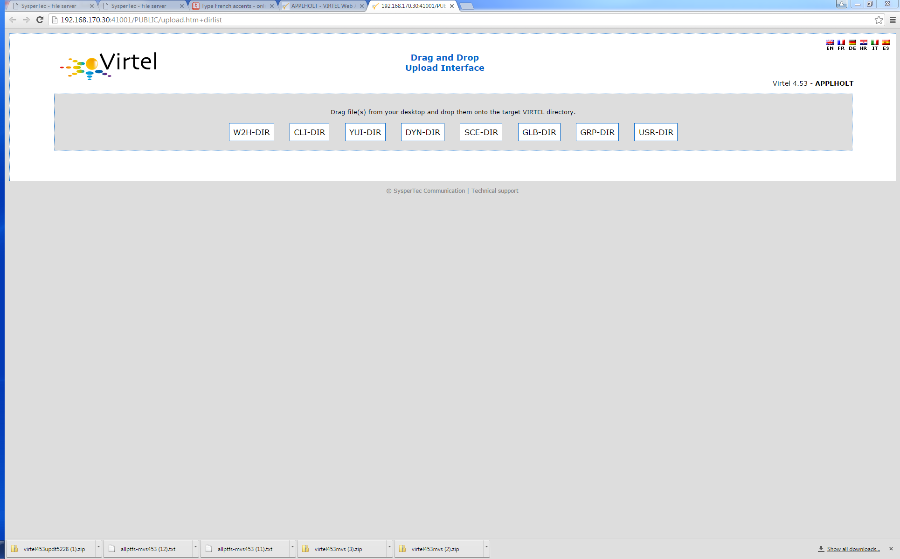
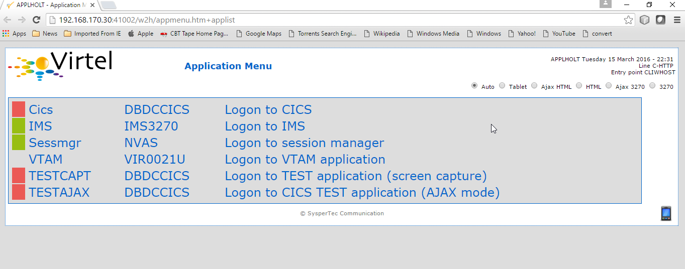
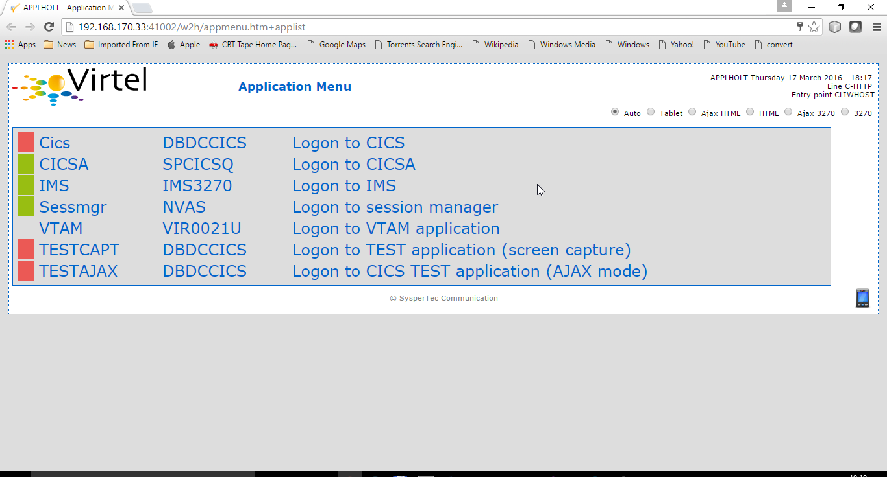
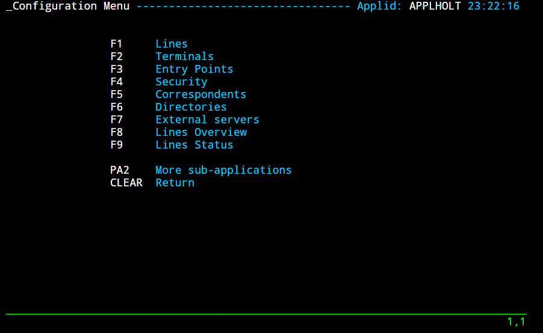
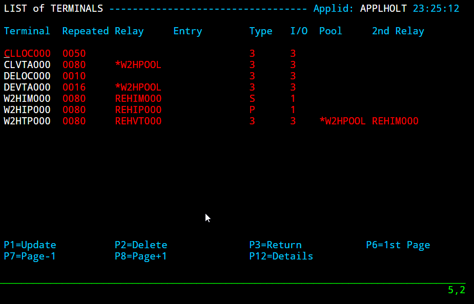

Installing Virtel V4.53 from scratch
====================================

**Cleaning up from a previous installation**

If you want to delete all the files from a previous installation use the
following job:-::

    //S00 EXEC PGM=ADRDSSU,REGION=0M
    //SYSPRINT DD SYSOUT=\*
    //TEMP DD DUMMY
    DUMP DATASET -
    (INCLUDE( -
    SPTHOLT.VIRT453.\*\* -
    )) -
    DELETE -
    PURGE -
    TOL(ENQF) -
    OUTDDNAME(TEMP)

**Getting the software**

#. Download relevant files from the FTP server: http://ftp.syspertec.com:-::

    /VIRTEL 4.53/Produits/virtel453mvs.zip
    /VIRTEL 4.53/Produits/allptfs-mvs453.txt
    /VIRTEL 4.53/Produits/virtel453updt5380.zip

#. Unzip “virtel453mvs.zip” into a folder on your workstation.
#. Print off the “install.txt” document.
#. Unzip “/VIRTEL 4.53/Produits/virtel453updt5380.zip” into a folder on your workstation.
#. Print off the readme document.

**Installing the software**

#. Upload to the mainframe and edit the text file $alocdsu. Run it to allocate a XMIT file.
#. Upload the XMIT file virt453.xmit to the file allocated by $alocdsu.
#. Upload to the mainframe and edit the text file $restdsu. Run it to restore and install VIRTEL from the uploaded XMIT file.
#. Upload text file allptfs-mvs453.txt to *yourqual.VIRT453.CNTL(PTF453MV).*
#. Modify and run job *yourqual.VIRT453.CNTL(ZAPJCL)*. This will apply maintenance to the VIRTEL load library.
#. Authorize the VIRTEL load library. Use the z/OS SETPROG APF command:-::

    SETPROG APF,ADD,DSN=yourqual.VIRT453.LOADLIB,[VOL=volser|SMS]

#. Edit the VIRTEL TCT member *yourqual.VIRT453.CNTL(VIRTCT01*) and assemble using *yourqual.VIRT453.CNTL(ASMTCT).* See note 6 of
   “install.txt” for further information.
#. Edit *yourqual.VIRT453.CNTL(ARBOLOAD)* and submit the job. This builds the default configuration and sample VTAMLST member. See note 8 of the “install.txt” for further information.
#. Copy *yourqual.VIRT453.CNTL(member)* to SYS1.VTAMLST. Member is either VIRTAPPL, the default member name, or the VTAM applid specified in the ARBOLOAD job on the NODEAPPL= statement. Activate the “member” with the z/OS command V NET,ACT,ID=member.
#. Edit member *yourqual.VIRT453.CNTL(VIRTEL4)* and copy to SYS1.PROCLIB as member VIRTEL. See notes 11,12 of the “install.txt”.
#. Start Virtel.

Note: You can run VIRTEL as a JOB rather than a STC. This can be useful
during testing. See the JCL below for an example:-::

//SPTHOLTV JOB 9000,'VIRTEL',CLASS=A,MSGCLASS=X,NOTIFY=&SYSUID
//VIRTEL PROC QUAL=SPTHOLT.VIRT453,
// TCT=01 = Change to 01
//\*-------------------------------------------------------------------\*
//\* PROCEDURE FOR VIRTEL STARTER EDITION                              \*
//\*-------------------------------------------------------------------\*
//VIRTEL EXEC PGM=VIR6000,TIME=1440,REGION=32M,PARM=&TCT
//STEPLIB DD DSN=&QUAL..LOADLIB,DISP=SHR
//DFHRPL DD DSN=&QUAL..LOADLIB,DISP=SHR
//SERVLIB DD DSN=&QUAL..SERVLIB,DISP=SHR
//VIRARBO DD DSN=&QUAL..ARBO,DISP=SHR
//VIRSWAP DD DSN=&QUAL..SWAP,DISP=SHR
//VIRHTML DD DSN=&QUAL..HTML,DISP=SHR
//SAMPTRSF DD DSN=&QUAL..SAMP.TRSF,DISP=SHR
//HTMLTRSF DD DSN=&QUAL..HTML.TRSF,DISP=SHR
//SYSOUT DD SYSOUT=\*
//VIRLOG DD SYSOUT=\*
//VIRTRACE DD SYSOUT=\*
//SYSPRINT DD SYSOUT=\*
//SYSUDUMP DD SYSOUT=\*
// PEND
//S01 EXEC VIRTEL

Once Virtel is started you now need to apply maintenance to the SAMPTRSF
file. This file contains all the related web elements used by VIRTEL.
Before doing so, just check that VIRTEL is running and has correctly
opened sessions to ports 41001 and 41002. Issue the following command:-::

    F VIRTEL,LINES

The output should be similar to:-::

    F VIRTEL,LINES
    +VIR0200I LINES
    +VIR0201I VIRTEL 4.53 APPLID=APPLHOLT LINES
    +VIR0202I INT.NAME EXT.NAME TYPE ACB OR IP
    +VIR0202I -------- -------- ----- ---------
    +VIR0202I C-HTTP HTTP-CLI TCP1 192.168.170.30:41002
    +VIR0202I W-HTTP HTTP-W2H TCP1 192.168.170.30:41001
    +VIR0202I ---END OF LIST---

**Applying maintenance to Virtel.**

Stop VIRTEL if it is running. ARBO updates can only be applied when Virtel is not running.

**ARBO Changes**

:ARBOMIGR: Adds the SCE-DIR (Scenario directory) for loading scenarios.
:ARBOMACR: Turns on the new macro support.

#. Upload the text files ARBOMACR and ARBOMIGR to yourqual.VIRT453.SAMPLIB.
#. Edit and run ARBOMACR and ARBOMIGR to apply maintenance to the ARBO file in preparation for the TRSF maintenance. Change the following SET XXXX=keywords in the JCL to reflect the relevant library names:-::

    // SET LOAD=yourqual.VIRT453.LOADLIB
    // SET ARBO=yourqual.VIRT453.ARBO

**MACLIB changes**

#. Upload the text file VIRTERM to yourqual.VIRT453.MACLIB. Reassemble TCT01 using *yourqual.VIRT453.CNTL(ASMTCT*).

Note: If the assembly fails because the at (@) character has been translated to a French accent à using codepage 1147 (French Euro) when doing the file upload.

**TRSF changes**

#. Start Virtel.
#. Using a Chrome Browser navigate to the Administration Virtel Portal which can be accessed through port 41001. The Drag and Drop upload feature is supported by Chrome and Firefox only.-::

    http://192.168.170.30:41001/

#. The following screen image should appear:-
    
    |image0|

#. Select Drag and Drop Upload and login with your credentials. The Drag and Drop Interface will be displayed.
    
    |image1|

#. Keeping this browser window open, go to your desktop directory where you unzipped the virtel453updt5380.zip file.
    
    |image2|

#. Open the SCE directory and select all the files (CTRL-A). Drag this selection across to the browser window and drop over the SCE-DIR ICON. This should start an upload of all the files in the SCE directory on your desktop into the SCE-DIR directory of the SAMP TRSF VSAM file. There should be 4 files.
    
    |image3|

#. Repeat the exercise, but this time with the W2H directory, dragging the 83 elements into the W2H-DIR directory.
#. After all the elements have been uploaded into the TRSF VSAM file, press CTRL-R in your browser to refresh the browser’s cache.

    Note: With some versions of Chrome there is a bug which prevents the upload from starting. In this case:-

    - Close the browser.
    - Re-open a browser window and type in the following URL replacing the IP stack address (192.168.170.30) with yours. The rest of the URL should be the same. For example:-::

        http://192.168.170.30:41001/SECURE/upload.htm+dirlist

    - This will open the Drag and Drop interface Window. Continue to upload the “w2h” and “sce” directories. Once these uploads have completed, CTRL-R in the browser to refresh the browser’s cache. Close the browser window and reopen the Virtel portal with the URL http://192.168.170.30:41001/

#. The last thing to do is to modify the WEB2HOST entry point to use the SCE-DIR. Stop VIRTEL and then run the following JCL:-::

    //--------------------------------------------------------------*
    //*                                                             *
    //* ARBO MIGRATION. UPDATE ARBO TO CHANGE WEB2HOSTS             *
    //*                                                             *
    //* Change Description Release                                  *
    //* UPDT5380 Change directory for WEB2HOST V453                 *
    //*                                                             *
    //*-------------------------------------------------------------*
    //*
    // SET LOAD=yourqual.VIRTnnn.LOADLIB
    // SET ARBO=yourqual.VIRTnnn.ARBO
    //*
    //CONFIG EXEC PGM=VIRCONF,PARM='LOAD,REPL',REGION=2M
    //STEPLIB DD DSN=&LOAD,DISP=SHR
    //SYSPRINT DD SYSOUT=*
    //SYSUDUMP DD SYSOUT=*
    //VIRARBO DD DSN=&ARBO,DISP=SHR
    //SYSIN DD *
    ENTRY ID=WEB2HOST, -
    DESC='HTTP entry point (SysperTec menu)', -
    TRANSACT=W2H, -
    TIMEOUT=0720, -
    ACTION=0, -
    EMUL=HTML, -
    SIGNON=VIR0020H, -
    MENU=VIR0021A, -
    IDENT=SCENLOGM, -
    EXTCOLOR=E, -
    SCENDIR=SCE-DIR

#. Start VIRTEL.

Virtel 4.53 maintenance is now complete.

**Basic health test of Virtel**

From the Virtel Portal Page select “Other Applications”. An application
menu should appear with some default applications. Note that your list
may be different.

|image4|

Figure Virtel Application Menu (APPLIST)

Select any application that is flagged green. If no applications are
flagged green (available) then configure you ARBO and add applications
relevant to your site. See the *Virtel Connectivity Guide* for more
information.

This completes the Virtel 4.53 installation, now let’s look at some
simple configuration.

**Configuring Virtel with VIRCONF program.**

This section looks at how to perform some simple configuration tasks using only the ARBO configuration statements and the VIRCONF program. Of course Virtel has other ways in which the Virtel configuration can be changed dynamically. For example you can logon to the Administration Panels through your browser or VTAM direct. See the Virtel User Guide for further information. In this section will focus on batch updates to the ARBO configuration using the VIRCONF program. When doing any work with VIRCONF Virtel must not be running.

The basic JCL for VIRCONF looks like this:-::

    //VIRCONF EXEC PGM=VIRCONF,PARM=‘LOAD | UNLOAD[,REPL | NOREPL] [,LANG = EN | FR’]
    //STEPLIB DD DSN=your.VIRTEL.LOADLIB,DISP=SHR
    //SYSPRINT DD SYSOUT=*
    //SYSUDUMP DD SYSOUT=*
    //VIRARBO DD DSN=your.ARBO,DISP=SHR,AMP=('RMODE31=NONE')
    //SYSPUNCH DD DSN=your.ARBO.CNTL,DISP=SHR

First, let’s get an overview of Virtel of some of its terminology. As delivered, when starting up Virtel 4.53 you should see two active ***LINES***. With Virtel running Issue the “\ *F VIRTEL,LINES*\ ” command:-::

    F VIRTEL,LINES
    +VIR0200I LINES
    +VIR0201I VIRTEL 4.53 APPLID=APPLHOLT LINES
    +VIR0202I INT.NAME EXT.NAME TYPE ACB OR IP
    +VIR0202I -------- -------- ----- ---------
    +VIR0202I C-HTTP HTTP-CLI TCP1 192.168.170.30:41002
    +VIR0202I W-HTTP HTTP-W2H TCP1 192.168.170.30:41001
    +VIR0202I ---END OF LIST---

These two ***LINES*** are related to two separate ***DOMAINS*** in VIRTEL. Each line is opened with a unique ***PORT*** number which identifies the Virtel domain. The default ports are 41001 and 41002. Port 41001 is considered an Administration interface into the ***Web2Host (W2H) domain*.** Port 41002 is the client interface into the ***Client*** (***CLI) domain.***

What’s in a domain? Well a domain is a container for related Virtel transactions. For example, in the ***W2H*** domain you will find Virtel Administration transactions plus a couple of VTAM applications, like TSO. The ***CLI*** domain is where the majority of customer applications are defined – things like production CICS, IMS and TSO applications. Virtel listens on the IP ports 41001 and 41002 are these are associated with ***LINES*** within Virtel. This information and other Virtel configuration data is stored and maintained in the ***ARBO*** VSAM file. The ***ARBO VSAM*** file is the main configuration file for VIRTEL. It contains all the configuration information for Virtel elements like ***TERMINAL, ENTRY POINTS, LINES, TRANSACTION*** and ***RULE*** definitions amongst other things.

|image5|

The VSAM ARBO configuration file can be unloaded through the VIRCONF program. To unload a copy of the data held in the ARBO VSAM file run the following ARBOUNLD job. You’ll need to stop Virtel first. The unload will write out to the SYSPUNCH DD file and create a ARBO configuration dadatset:-::

    // SET ARBO=SP000.SPVIREH.ARBO = Your ARBO file
    //*
    //DEL EXEC PGM=IEFBR14
    //DDA DD DSN=&SYSUID..VIRCONF.TEST.SYSIN,DISP=(MOD,DELETE),
    // UNIT=SYSDA,SPACE=(TRK,0)
    //*
    //UNLOAD EXEC PGM=VIRCONF,PARM=UNLOAD
    //STEPLIB DD DSN=&LOAD,DISP=SHR
    //SYSPRINT DD SYSOUT=*
    //SYSUDUMP DD SYSOUT=*
    //VIRARBO DD DSN=&ARBO,DISP=SHR,AMP=('RMODE31=NONE')
    //SYSPUNCH DD DSN=&SYSUID..VIRCONF.TEST.SYSIN,DISP=(,CATLG),
    // UNIT=SYSDA,VOL=SER=SPT308,SPACE=(CYL,(5,1)),
    // DCB=(RECFM=FB,LRECL=80,BLKSIZE=6080)

This file will be used through theis section to look at the
configuration elements that support Virtel.

Browse the dataset &SYSUID..VIRCONF.TEST.SYSIN and look for the
***LINE*** definitions.

** LINE Definitions**

Here is the line definition for the CLI domain. The ID= keyword is an internal Virtel, the NAME=key word is an external name; the name that is displayed in Virtel Commands. The LOCADDR= identifies the port that is
associated with this Virtel Domain (CLI). By default it will take the IP address from the TCPIP stack. If you are using a VIPA then you will need to specify it here. So if my VIPA is 192.168.170.22 then the LOCADDR
definition should be changed to:-::

    LOCADDR=192.168.170.22:41002
    LINE ID=C-HTTP,
    NAME=HTTP-CLI,
    **LOCADDR=:41002, **
    DESC='HTTP line (entry point CLIWHOST)',
    TERMINAL=CL,
    **ENTRY=CLIWHOST, **
    TYPE=TCP1,
    INOUT=1,
    PROTOCOL=VIRHTTP,
    TIMEOUT=0000,
    ACTION=0,
    WINSZ=0000,
    PKTSZ=0000,
    RETRY=0010,
    RULESET=C-HTTP

Note: Remember that if you are using a VIPA then you will have to change the LINE LOCADDR= definitions for other lines which default to the TCPIP stack. These lines can be identified as just having a port only
definition in the LOCADDR= keyword. The next important definition to discuss is the ENTRY=keyword. The defines a Virtel ***ENTRY POINT***

**ENTRY POINT Definitions**

An entry point is another container definition which contains all the transactions associated with a particular domain. So for the W2H domain I would have W2H transactions, the CLI domain CLI transactions. There is
always a default Entry Point associated with each line. This is identified by the ENTRY= keyword on the LINE statement. From the ARBO configuration file the ENTRY POINT looks like this:-::

    ENTRY **ID=CLIWHOST,** -
    DESC='HTTP entry point (CLIENT application)', -
    **TRANSACT=CLI,** -
    TIMEOUT=0015, -
    ACTION=0, -
    EMUL=HTML, -
    SIGNON=VIR0020H, -
    MENU=VIR0021A, -
    IDENT=SCENLOGM, -
    EXTCOLOR=E, -
    SCENDIR=SCE-DIR

The salient keywords here are the ID= and the TRANSACT= keywords. The ID= keyword defines that name of the entry point. If this is the default entry point for the line then it will match the ENTRY= keyword. The
TRANSACT= keyword identifies the prefix, normally 3 characters, of all the transactions that relate to this ENTRY POINT. So all transactions
that have an ID=CLI-something will be associated with his ENTRY POINT. This ENTRY POINT is associated by default to a LINE, in this case the
LINE that is servicing PORT 41002, and that PORT defines the CLI domain.
So they sequence for a transaction looks like:-::

    URL -> OSA -> TCPIP -> VIRTEL -> LINE(PORT) -> DOMAIN(W2H \| CLI) ->
    ENTRY POINT -> TRANSACTIONS -> TRANSACTION.

|image6|

**TRANSACTION Definitions**

As already stated transactions belong to a particular Virtel Entry Point and are identified within the entry point by the keyword TRANSACT=prefix. Here is a transaction definition from the ARBO configuration file:.::

    TRANSACT **ID=W2H**-00,
    **NAME=WEB2HOST**,
    DESC='Default directory = entry point name',
    APPL=W2H-DIR,
    TYPE=4,
    TERMINAL=DELOC,
    STARTUP=2,
    SECURITY=0

It belongs to the W2H administration domain because its ID= begins W2H. This would tie up with the ENTRY POINT definition for W2H. That would specify TRANSACT=W2H. Another thing to note is that the external name of
the transaction, as defined by the NAME= keyword, is the same as the ENTRY POINT name it belongs to. There must be at least one transaction which is the default transaction for the ENTRY POINT and this transaction has the same name as the ENTRY POINT. This comes into play when Virtel is searching for a transaction based upon the URL it has received. If VIRTEL is presented with a URL http://192.168.0.1:410001 this doesn’t identify any particular transaction, therefore the default transaction for the ENTRY POINT will be used. What the transaction does is determined by the other keywords which we will cover later.

So to summarise, we have a line which identifies a Virtel domain through its associated port number. The LINE is also associated with an Entry Point, which in turns identifies a collection of transactions through a
prefix setting.

LINE:PORT->

    ENTRY POINT->

        TRANSACTIONS

**Transaction Type 1 – VTAM Applications**

If we look at the transactions in the default ARBO configuration we can see that most are either Type 1, 2 or 4. Here were look at the type 1 transaction, a VTAM transaction. An example follows:-::

    TRANSACT ID=CLI-10,
    NAME='Cics',
    DESC='Logon to CICS',
    APPL= DBDCCICS,
    TYPE=1,
    TERMINAL=CLVTA,
    STARTUP=1,
    SECURITY=1,
    TIOASTA="Signon&/F&\*7D4EC9&'114BE9'&U&'114CF9'&P&/A"

In this transaction we define a CICS application who’s APPLID is DBDCCICS. The external name is CICS. So, the first question is how we can invoke this application. There are several ways but we will look at two methods. The first involves the default Entry Point transaction for this domain’s Entry Point. We can see that this is a CLI transaction so therefore it belongs to the CLI Entry Point which in turn is serviced by the LINE that identifies the CLI domain with port 41002:-::

URL->LINE:41002->CLI DOMAIN->CLIHOST(EP - CLIWHOST)->CLIHOST TRANSACTION(CLIWHOST)

If I fire the URL //HTTP:192.168.0.1:41002 to Virtel I should get something like this:-

|image7|

Now, it is very unlikely you will see exactly the same colours against these applications but nevertheless you should see the same Application in the Menus because they are all defined as CLI Type 1 or Type 2 applications in the default ARBO. In my case I have two applications which are “highlighted” green – IMS and Session manager. Now, if I select IMS3270 Virtel will log me onto that application. The CICS DBDCCICS application isn’t active so that’s why it is flagged RED. We got here through the URL //HTTP:192.168.0.1:41002. So how did that happen? Well we know that the URL will fire the default transaction for the Entry POINT CLIWHOST. That transaction is also called CLIWHOST, so let’s take a look at that transaction:-

    TRANSACT ID=CLI-00,
    NAME=CLIWHOST,
    DESC='Default directory = entry point name',
    APPL=CLI-DIR,
    TYPE=4,
    TERMINAL=CLLOC,
    STARTUP=2,
    SECURITY=0,
    TIOASTA='/w2h/appmenu.htm+applist'

If you look at the URL in the screen shot you can see that the string “/w2h/appmenu.htm+applist” has been added after the port 41002. This has come from the CLIWHOST transaction. So the process is that default URL
has been amended to identify a particular Virtel transaction by appending the string defined in the TIOASTA= keyword. That has caused Virtel to run the appmenu transaction passing it a parameter of applist.

If we search the ARBO load for a transaction called APPLIST this is what we find:-::

    TRANSACT ID=CLI-90,
    NAME='applist',
    DESC='List of applications for appmenu.htm',
    APPL=VIR0021S,
    TYPE=2,
    TERMINAL=CLLOC,
    STARTUP=2,
    SECURITY=1

Well, again it’s a CLI transaction so it is part of our domain, and it’s
a Type=2. A type 2 transaction is a means of invoking a program
internally within Virtel. So when this transaction is called, through
the updated URL, then the program VIR0021S will run. What VIR0021S does
is to build the APPLICATION MENU page and go and test all the Type=1
VTAM transactions to determine if they are ACTIVE in VTAM. If they are
active a green flag is set otherwise it is red. Also, VIR0021S enables
you to access the active applications from this menu page. This is the
sequence:-

URL->LINE:41002->CLI DOMAIN->CLIHOST(EP - CLIWHOST)->CLIHOST TRANSACTION
(CLIWHOST) ->

Build new URL -> URL //HTTP:192.168.0.1:41002/w2h/appmenu.htm+applist'
->

CALLS APPLIST transaction ->APPLIST->

APPLIST transaction will invoke internal program which will:-

TEST ALL VTAM APPLICATIONS (TYPE 1’s) and (TYPE 2’s) and build a HTML
template identifying ACTIVE (GREEN) and INACTIVE(RED) application status
for TYPE 1 VTAM applications. Template will be sent to the user’s
browser as a page.

Phew…

If you check the ARBO configuration you will see that in the CLI domain
there are only 5 Type 1 VTAM Transactions. This corresponds with the
Application Menu list.

The other method of invoking a transaction is through a full URL
reference that identifies the application through the URL. Here is an
example of accessing the IMS application through a URL

**http://192.168.0.1:41002/w2h/WEB2AJAX.htm+IMS **

We have appended some additional information after the port which will
enable Virtel to identify a transaction called IMS and attempt to logon
onto it as a VTAM application. The WEB2AJAX.HTM script kicks the process
off but the important thing from a VTAM application access is the suffix
of the application you want to log on to – in this case IMS. The +IMS
appended to the WEB2AJAX.htm is what Virtel requires. If we look for a
transaction called IMS in the ARBO configuration file we find the
following:-

TRANSACT ID=CLI-14,

NAME='IMS',

DESC='Logon to IMS',

APPL=IMS3270,

TYPE=1,

TERMINAL=CLVTA,

STARTUP=1,

SECURITY=1

So the sequence here is:-

URL->LINE:41002->CLI DOMAIN->CLIWHOST(EP - CLIWHOST)->CLI TRANSACTION
(IMS) ->

Logon to applid=IMS3270 using Virtel terminals prefixed CLTVTA.

Now we haven’t discussed terminals yet, and they are pretty important in
the context of Virtel. We will come to those later, for now though it’s
good enough to understand that you can access an application using a
default URL which will bring up some Menu List or Administration Portal
in the case of the W2H 42001 port. Or, we can use a full URL to identify
a specific transaction in the domain that I want to execute. In the case
of VTAM applications it is usually:-

http://192.168.0.1:41002/w2h/WEB2AJAX.htm+transaction where transaction
is a transaction defined to Virtel.

Question.

If I try http://192.168.0.1:41002/w2h/WEB2AJAX.htm+CICSA it doesn’t
work. I get some messages on the browser that looks like:-

|image8|

Figure Transaction not found error

And in the z/OS console I can see the following messages:-

VIRHT51I HTTP-CLI CONNECTING CLLOC049 TO 192.168.092.047:50678

VIRC121E PAGE NOT FOUND FOR CLLOC049 ENTRY POINT 'CLIWHOST' DIRECTORY '

176

CLIWHOST'(CLI-DIR CLI-KEY )

PAGE : 'FAVICON.ICO' URL : '/favicon.ico'

VIR0052I CLLOC049 DISCONNECTED AFTER 0 MINUTES

VIRHT54E INVALID REQUEST ON HTTP-CLI ENTRY POINT 'CLIWHOST' DIRECTORY '

178

W2H '

PAGE 'WEB2AJAX.HTM' URL '/w2h/WEB2AJAX.htm+CICSA'

TRANSACTION 'CICSA ' CALLER 192.168.092.047:50678

rejected transaction :CICSA

VIRT922W HTTP-CLI SOCKET 00010000 ENDED FOR 192.168.092.047:50678

So whats happening here, well the browser has connected, message
VIRHT51I, Virtel is then looking for a “FAVICON.ICO” to place in the top
left corner of the web page. We can ignore this. The we see that Entry
Point CLIWHOST has been unable to find the Transaction CICSA. The
browser session is the closed – message VIRT922W.

That sort of all ties up as we haven’t defined the CICSA transaction to
Virtel so there is no way we can log on to CICSA. We need to define a
CICSA transaction which reflects the VTAM application that we are trying
to logon onto.

**Defining a VTAM application to Virtel **

Using an existing CICS definition from the ARBO config we will define a
new CICS system. Here is our template taken from the ARBO config.

TRANSACT ID=CLI-10,

NAME='Cics',

DESC='Logon to CICS',

APPL=DBDCCICS,

TYPE=1,

TERMINAL=CLVTA,

STARTUP=1,

SECURITY=1

So, we modify it to look like this:-

TRANSACT ID=CLI-10A,

NAME='CICSA',

DESC='Logon to CICSA',

APPL=SPCICSQ,

TYPE=1,

TERMINAL=CLVTA,

STARTUP=1,

SECURITY=1

We have given the transaction a new transaction an internal ID of
CLI-10A. This should be unique. It is associated with the CLI domain so
will be accessible via the CLI port of 41002. The external name for this
application is CICSA. This is what will appear in the APPLICATION MENU.
Access to the application will be through the APPMENU if we do not use a
fully qualified URL to identify the transaction. The APPLID of the CICS
system is SPCICSQ. This is what we want Virtel to logon on to. The
terminals we are going to use to support this transaction are prefixed
CLVTA. We will discuss these terminal definitions later. The other
parameters will can leave as is. We add this to our ARBO config and
after the CLI-10 transaction.

Stop Virtel and the run an ARBO LOAD to load up the ARBO VSAM file. See
the JCL below:-

// SET LOAD=yourqual.VIRTnnn.LOADLIB

// SET ARBO=yourqual.VIRTnnn.ARBO

//LOAD EXEC PGM=VIRCONF,PARM=’LOAD,REPL’

//STEPLIB DD DSN=&LOAD,DISP=SHR

//SYSPRINT DD SYSOUT=\*

//SYSUDUMP DD SYSOUT=\*

//VIRARBO DD DSN=&ARBO,DISP=SHR,AMP=('RMODE31=NONE')

//SYSPUNCH DD DSN=&SYSUID..VIRCONF.TEST.SYSIN,DISP=OLD

This will rebuild the ARBO VSAM file and add in the new CICS
application. If we start up Virtel now we should see the following
APPMENU list display. I’ve accessed this with just the port number in my
URL http://192.168.170.33:41002.

|image9|

Figure Updating the APPLIST menu

To directly access my CICS definition I could use the fully qualified
URL of :-

http://192.168.170.33:41002/w2h/web2ajax.html+CICSA

Let’s try that and see if I can establish a session with CICS. Nope….I’m
taking straight back to the Virtel APPMENU. What’s in the VIRTEL log:-

19.24.11 JOB03882 VIRT906I HTTP-CLI SOCKET 00020000 CALL FROM
192.168.092.041:50751

19.24.11 JOB03882 VIRHT51I HTTP-CLI CONNECTING CLVTA079 TO
192.168.092.041:50734

19.24.11 JOB03882 VIR0919I CLVTA079 RELAY REHVT000(W2HTP000) ACTIVATED

19.24.11 JOB03882 VIR0919I CLVTA079 RELAY REHIM000(W2HIM000) ACTIVATED

19.24.11 JOB03882 VIR0915E CLVTA079(REHVT000) SESSION REQUEST REFUSED BY
SPCICSQ SENSE=08210000

19.24.11 JOB03882 VIR0052I CLVTA079 DISCONNECTED AFTER 0 MINUTES

19.24.11 JOB03882 VIR0918W W2HIM000 RELAY REHIM000 INACTIVATED

19.24.11 JOB03882 VIR0918W CLVTA079 RELAY REHVT000 INACTIVATED

19.24.11 JOB03882 VIRT922W HTTP-CLI SOCKET 00060000 ENDED FOR
192.168.092.041:50734

19.24.13 JOB03882 VIRHT51I HTTP-CLI CONNECTING CLLOC049 TO
192.168.092.041:50750

19.24.13 JOB03882 VIR0052I CLLOC049 DISCONNECTED AFTER 0 MINUTES

19.24.24 JOB03882 VIRT922W HTTP-CLI SOCKET 00020000 ENDED FOR
192.168.092.041:50751

I can see a call coming in from laptop, 192.168.092.41. Then some
activation messages with RELAY names and my session being refused
SPCICSQ. Let’s have a look in the CICS log:-

TNADDR DUMY,CSNE,19:24:11,192.168.92.41 50749

DFHZC6907 I 03/17/2016 19:24:11 SPCICSQ Autoinstall starting for netname
REHVT000. Network qualified name is SPNET.REHVT000.

DFHZC6908 I 03/17/2016 19:24:11 SPCICSQ Autoinstall in progress for
netname REHVT000. TN3270 IP address is 192.168.92.41 50734.

DFHZC6903 W 03/17/2016 19:24:11 SPCICSQ Autoinstall for terminal T000,
netname REHVT000 using model DFHLU2E2 failed.

DFHZC5983 E 03/17/2016 19:24:11 SPCICSQ Unable to replace T000

DFHZC6942 W 03/17/2016 19:24:11 SPCICSQ Autoinstall for terminal T000
failed.

DFHZC2411 E 03/17/2016 19:24:12 SPCICSQ DUMY CSNE REHVT000 attempted
invalid logon. ((7) Module name: DFHZATA)

NQNAME DUMY,CSNE,19:24:12,SPNET REHVT000

So I can see VIRTEL attempting to establish a session using a VTAM LU
name of REHVT000. That doesn’t exist in my CICS system so I will have
define it or use a different CICS system where it is defined. Virtel
requires that the RELAY LUNAME be defined to CICS as this name is
effectively representing a 3270 terminal within Virtel. Likewise, the
other relay name REHIM00, which was also activated as part of this
session set up, would also have to be defined. This LU represents a
printer which is associated with the terminal or relay REHVT000.

In my case, I stop Virtel, add some new ARBO transaction definition to
CICS systems that I know have the Virtel relay definitions defined. I
start up VIRTEL and access the APPMENU with URL
http://192.168.170.33:41002

|image10|

Figure Additional applications added to the CLI domain

I select CICSH and hopefully can logon; yes indeed I can. In fact I can
open another browser window and logon to TSO1A.

|image11|

Figure CICS Session activation

So now my browser is acting like a session manager with each tab
representing a different session. Two to the mainframe, CICS and TSO,
and one Virtel APPMENU display. Using Virtel in place of a session
manager is worth considering as it provides you with similar
functionality as a session manager but at no cost.

Note: As I have mentioned the ARBO VSAM file contains all the
configuration data. This is upload through an ARBO load job which reads
in a configuration data set. The ARBO program has some peculiarities in
that if you specify PARM option of NOREPL than it will not replace any
configurations elements it already finds and returns with a condition
code 0. That’s all well and good but if your trying to update the ARBO
and replace elements that’s not so good. You’ll think the ARBO has been
updated when in fact it hasn’t. To replace elements change the NOREPL to
REPL. NOREPL is also a default so add REPL into the PARM if it is not
already there.

I tend to delete and reallocate my ARBO file and always use NOREPL in my
ARBO build. Here is my JCL:-

//\* SAMPLE JOB TO ALLOC AN ARBO

//DEFINE EXEC PGM=IDCAMS

//SYSPRINT DD SYSOUT=\*

DELETE (SPTHOLT.VIRT453.ARBO) CLUSTER PURGE

SET MAXCC = 0

DEFINE CLUSTER(NAME(SPTHOLT.VIRT453.ARBO) -

KEYS(9 0) RECSZ(100 4089) FSPC(10 10) -

VOL(SPT30E) REC(250,50) SHR(1) SPEED) -

DATA(NAME(SPTHOLT.VIRT453.ARBO.DATA) CISZ(4096)) -

INDEX(NAME(SPTHOLT.VIRT453.ARBO.INDEX))

Another thing, from time to time ARBO updates are issued as a part of
maintenance. Any updates should be incorporated in a “master ARBO
configuration file” so that when you rebuild your ARBO you don’t regress
any changes. Likewise, when adding transactions etc. make sure that you
update a master ARBO configuration file and always keep a previous
backup.

**Terminals definitions**

We have mention terminals throughout the document so far but have not
really looked into them in great detail. A terminal in Virtel represents
a task or function that virtel has to do. Several different types of
work will run under a terminal definition with Virtel. If you look at
the Virtel log you will see terminals being allocated and deallocated as
URLs are processed – dealing with session connection, disconnection etc.
Terminals also have a counterpart which is related to VTAM units of
work, for example a CICS session. These related terminals are known as
relay terminals and are only ever used when a VTAM transaction is
involved. You defined some relay definitions in VTAM. By default they
began RHTVT\*\*\*, RHTIM\*\*\* and RHTIP\*\*\*\*. The IM and IP group
relays are terminals to support SCS and 3270 printers. Printer terminals
are associated with a screen terminal (RHTVT\*\*\*).

Let’s take a look at the terminal definitions that are delivered with
the base Virtel product. We can do in in one of three ways:-

1) Logon to Virtel Administration through its VTAM interface.

2) Access the 3270 Administration through a browser

3) Access the HTML GUI Administration interface through a browser.

I go for option 2, we will user the browser to access the Administration
panels. Start up Virtel and access the W2H domain using just the port
number in the URL.

http://192.168.0.1:41001

You should get a screen that looks like this:-

|image12|

Figure Virtel W2H Administration Portal

Select Admin(3270).That will take you to the 3270 administration pages.
The first page displayed should be the configuration menu :-

|image13|

Figure Virtel Configuration Display

Select PF2 to display the default terminal setup.

|image14|

So from the top down we have:-

CLLOC000 – CLLOC050 terminals defined for use in the CLI domain. Note
the CL prefix. This ties up with the TERMINAL= on the LINE definition.
We also have a group of 80 terminals (Repeated field) with have been
allocated a starting prefix of CLIVTA. This would tie up with the
transaction definitions and the TERMINAL= keyword. Whats interesting
about this group of terminals is that they have been allocated a pool
relay as defined by the \*poolname option in the relay column. So a
relay pool is where VIRTEL can grab a relay terminal when it wants iy
and return it to the pool when it has finished with it. This happens
during session initiation with a CICS system – a relay terminal is
grabbed, used for the CICS session and then when the user logs off it
relay terminal is released back to the pool.

We can see that there are two distinct groups that use the relay pool;
the terminals beginning CLVTA(CLI Domain) and another group, DEVTA. This
group belongs to the W2H domain. So, any VTAM transactions defined in
the administration domain can use the same pool as the CLI domain.

The pool name used by default is \*W2HPOOL. The POOL has 80 terminals
defined beginning W2HTP. These terminals have an associated relay
terminal prefixed REHVT which in turn has a second relay, normally a
printer, beginning REHIM\*\*\*.

If we look at our previous CICS failure we can see these terminals being
allocated and returned to the pool.

19.24.11 JOB03882 VIRT906I HTTP-CLI SOCKET 00020000 CALL FROM
192.168.092.041:50751

19.24.11 JOB03882 VIRHT51I HTTP-CLI CONNECTING **CLVTA079** TO
192.168.092.041:50734

19.24.11 JOB03882 VIR0919I **CLVTA079** **RELAY REHVT000(W2HTP000)
ACTIVATED**

19.24.11 JOB03882 VIR0919I **CLVTA079** **RELAY REHIM000(W2HIM000)
ACTIVATED**

19.24.11 JOB03882 VIR0915E **CLVTA079**\ (REHVT000) SESSION REQUEST
REFUSED BY SPCICSQ SENSE=08210000

19.24.11 JOB03882 VIR0052I **CLVTA079** DISCONNECTED AFTER 0 MINUTES

19.24.11 JOB03882 VIR0918W **W2HIM000 RELAY REHIM000** INACTIVATED

19.24.11 JOB03882 VIR0918W **CLVTA079** **RELAY REHVT000** INACTIVATED

19.24.11 JOB03882 VIRT922W HTTP-CLI SOCKET 00060000 ENDED FOR
192.168.092.041:50734

The terminal types and I/O fields are described in the Virtel
Connectivity Guide. If we look in the ARBO configuration file we can see
the definitions that support the TERMINAL configuration.

TERMINAL ID=CLLOC000, -

DESC='HTTP terminals (no relay)', -

TYPE=3, -

COMPRESS=2, -

INOUT=3, -

STATS=26, -

REPEAT=0050

TERMINAL ID=CLVTA000, -

RELAY=\*W2HPOOL, -

DESC='HTTP terminals (with relay)', -

TYPE=3, -

COMPRESS=2, -

INOUT=3, -

STATS=26, -

REPEAT=0080

TERMINAL ID=W2HTP000, -

RELAY=RHTVT000, -

POOL=\*W2HPOOL, -

DESC='Relay pool for HTTP', -

RELAY2=RHTIM000, -

TYPE=3, -

COMPRESS=2, -

INOUT=3, -

STATS=26, -

REPEAT=0080

|image15|

Figure Terminal Overview

Close the terminal screen by pressing PF3 the RETURN/ENTER key. You
should be back to the Administration Portal.

**
Adding a terminal definition pool**

Most Virtel users have large CICS or IMS environments that need to be
supported by Virtel. In order to do this we need to add terminal
definitions that will support thousands of users. In this section will
add a new terminal pool to our CLI domain capable of supporting up to
1000 concurrent users accessing a CICS application known as CICSPROD. We
also introduce the RULE statement to show how we can separate traffic by
IP address. Let’s look at a schematic.

|image16|

Figure Adding a new terminal pool

Our requirement is that any user coming in on port 192.0.2.\*\*\* or
192.0.3.\*\*\* should be routed to a particular entry point. Within this
entry point, the only VTAM transaction defined is PRODCICS. This VTAM
transaction uses a terminals prefix CLFD. The CLFD terminals pull a VTAM
relay from the \*FWDPOOL through terminal W2HD\*\*\*\*. The VTAM relay
is prefix TNCS\*\*\*\*. This prefix will corresponds to the VTAM
definitions and to the CICS terminal definitions.

Here is the ARBOLOAD definitions that supports this requirement.

TERMINAL ID=W2HD0000, -

RELAY=TNCD0000, -

POOL\ **=\*FWDPOOL**, -

DESC='Relay pool for FWD W2H', -

TYPE=3, -

COMPRESS=2, -

INOUT=3, -

STATS=26, -

REPEAT=1000

TERMINAL ID=\ **CLFD**\ 0000,

RELAY\ **=\*FWDPOOL**,

DESC='HTTP terminals (with relay)',

TYPE=3,

COMPRESS=2,

INOUT=3,

STATS=26,

REPEAT=1000

ENTRY ID=CLIWFWD1, -

DESC='HTTP entry point (FWD Test)', -

**TRANSACT=FWD**, -

TIMEOUT=0001, -

ACTION=0, -

EMUL=HTML, -

SIGNON=VIR0020H, -

MENU=VIR0021A, -

IDENT=SCENLOGM, -

EXTCOLOR=E

TRANSACT ID=\ **FWD**-00, -

NAME=CLIWFWD1, -

DESC='Default directory = CLIWFWD1', -

APPL=CLI-DIR, -

PASSTCKT=0, -

TYPE=4, -

TERMINAL=CLLC, -

STARTUP=2, -

SECURITY=0, -

TIOASTA='/w2h/appmenu.htm+applist'

TRANSACT ID=\ **FWD**-03W, -

NAME='w2h', -

DESC='W2H toolkit directory (/w2h)', -

APPL=W2H-DIR, -

PASSTCKT=0, -

TYPE=4, -

TERMINAL=CLLC, -

STARTUP=2, -

SECURITY=0

TRANSACT ID=\ **FWD**-11, -

NAME=CICSPROD, -

DESC='Logon to CICSPROD using TNCD\*\*\*\* LUs', -

APPL=TSO, -

PASSTCKT=0, -

TYPE=1, -

TERMINAL=\ **CLFD**, -

STARTUP=1, -

SECURITY=1

TRANSACT ID=\ **FWD**-90, -

NAME='applist', -

DESC='Application list', -

APPL=VIR0021S, -

PASSTCKT=0, -

TYPE=2, -

TERMINAL=CLLC, -

STARTUP=2, -

SECURITY=1

RULE ID=C100FWD1,

RULESET=C-HTTP,

STATUS=ACTIVE,

DESC='FWD Rule 1',

ENTRY=CLIWFWD1,

IPADDR=(EQUAL,192.0.3.000),

NETMASK=255.255.255.000

RULE ID=C100FWD2,

RULESET=C-HTTP,

STATUS=ACTIVE,

DESC='FWD Rule 2',

ENTRY=CLIWFWD1,

IPADDR=(EQUAL,192.0.2.000),

NETMASK=255.255.255.000

You will notice that the two rules, defined as C100FWD1 and C100FWD2
control the Entry point selection by comparing the incoming callers IP
address. If the IP address matches then the call will be routed towards
Entry Point CLIWFWD1. There are also some Administration transaction
that have been added to support administration functions within the
Entry Point. These are:-

FWD-00 Entry Point Transaction. Identifies our default domain directory
CLI-DIR

FWD-03W Identifies the Administration directory and provides a link to
it.

FWD-11 CICSPROD transaction. Type=1 (VTAM Application).

FWD-90 APPLIST MENU transaction

That’s enough about terminals for the moment.

.. |image0| image:: images/media/image1.png
   :width: 6.26806in
   :height: 3.90694in

.. |image2| image:: images/media/image3.png
   :width: 6.26806in
   :height: 1.67431in
.. |image3| image:: images/media/image4.png
   :width: 6.26806in
   :height: 2.41667in
.. |image4| image:: images/media/image5.png
   :width: 6.26806in
   :height: 1.80556in
.. |image5| image:: images/media/image6.jpg
   :width: 6.26806in
   :height: 3.88611in
.. |image6| image:: images/media/image7.jpg
   :width: 6.26806in
   :height: 4.07778in

.. |image8| image:: images/media/image9.png
   :width: 3.61458in
   :height: 1.89181in

.. |image10| image:: images/media/image11.png
   :width: 6.26806in
   :height: 3.35486in
.. |image11| image:: images/media/image12.png
   :width: 6.26806in
   :height: 3.54722in
.. |image12| image:: images/media/image13.png
   :width: 6.26806in
   :height: 3.31736in

.. |image15| image:: images/media/image16.jpg
   :width: 6.26806in
   :height: 4.17847in
.. |image16| image:: images/media/image17.jpg
   :width: 6.26806in
   :height: 5.39583in
