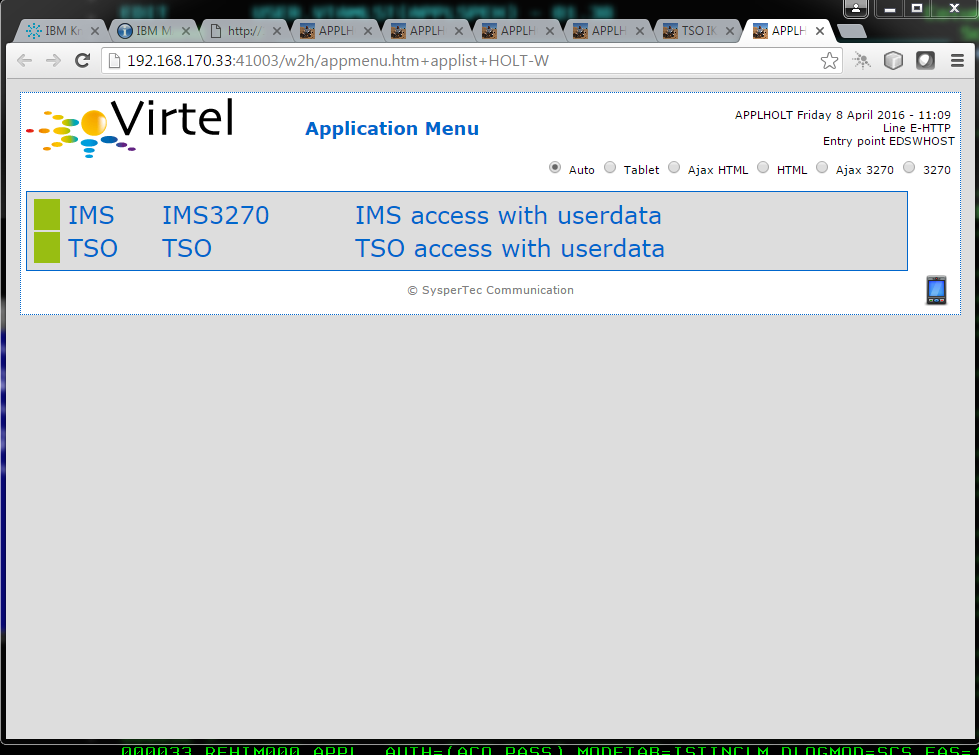
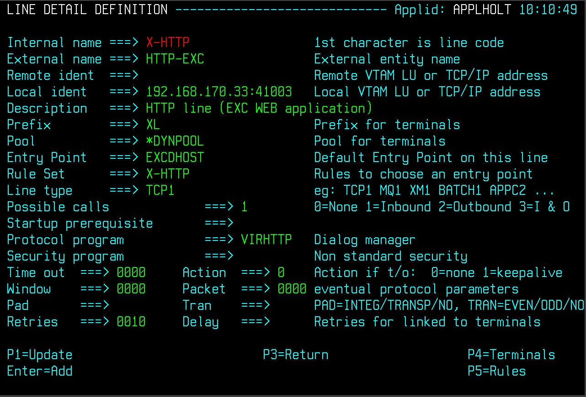
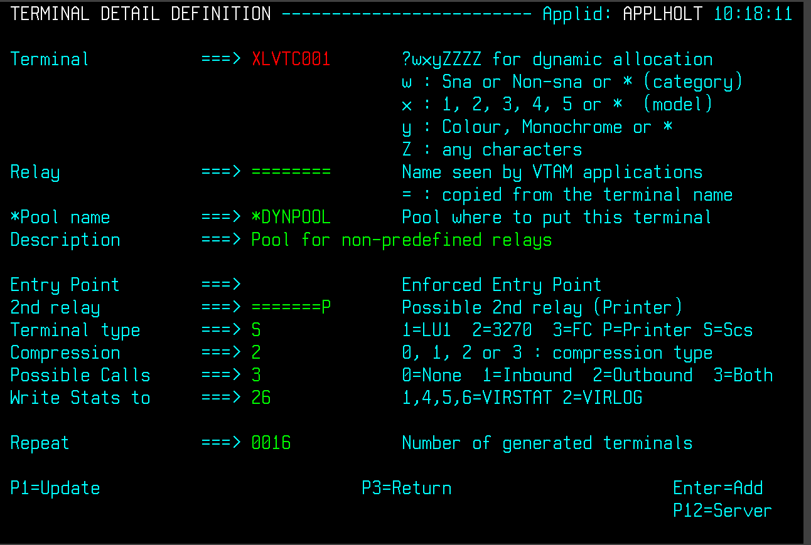
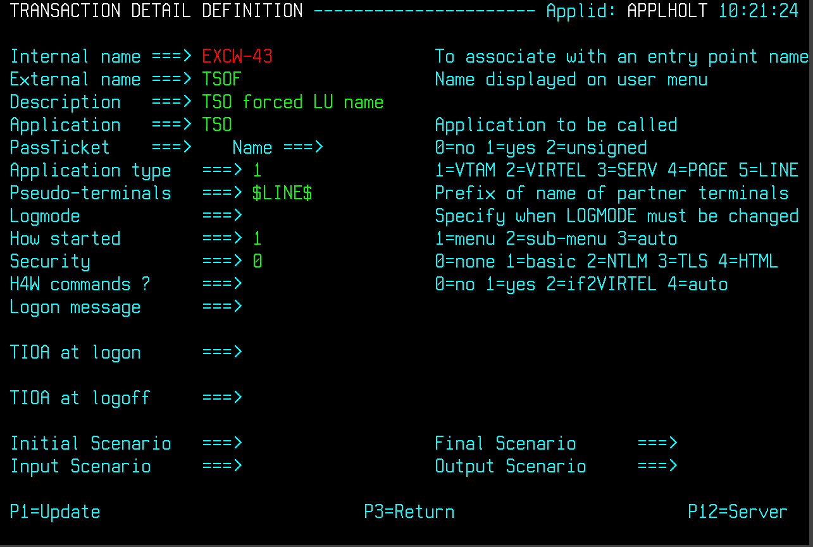
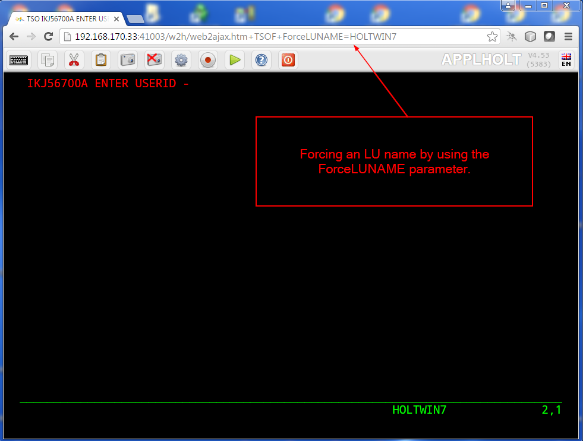

Controlling LU Names
====================

When a user connects to a 3270 application through VIRTEL Web Access,
VIRTEL makes it appear to the application as if the user is connecting
from a virtual 3270 terminal. In VTAM terms a virtual 3270 terminal is
called a *Logical Unit* or *LU*, and each LU has a unique eight
character name (*LU name)*. VIRTEL has at its disposal a pool of LUs
known to VTAM, whose names are specified in the VIRTEL configuration
file (the VIRARBO file). Normally when a user connects to a 3270
application, VIRTEL chooses any available LU from the pool.

While most mainframe applications will accept a connection from any LU
name, certain applications (particularly applications which run under
IMS) are sensitive to the LU name because they assign permissions to the
user based upon the LU name of the user’s terminal. LU nailing allows
VIRTEL to assign a particular LU name to a user based upon the user’s IP
address or upon a cookie presented by the user’s browser.

This document describes the following types of LU nailing:

-  LU nailing by work station name

-  LU nailing by LU (Pre-defined terminal)

-  LU nailing by LU (Non-predefined terminal)

-  LU nailing by IP address

-  LU nailing by cookie

-  LU nailing by URL

1. **
   LU nailing using a work station name (Predefined terminals) **

In this example we use a batch job on the user’s PC to initiate a
session with Virtel. The batch job obtains the terminal name of the work
station, opens a browser window and passes the work station name through
to Virtel. With a Virtel RULE we can test the name of the workstation
and assign a particular relay LUNAME from a Virtel terminal POOL.

Here is an example of a Virtel RULE.

RULE ID=ESH0000,

RULESET=E-HTTP,

STATUS=ACTIVE,

DESC='Rule for terminal EHPMA00',

ENTRY=EDSWHOST,

PARAM=EHPMA000, /\* Or EHPMA00\* \*/

NETMASK=255.255.255.255,

USERDATA=(EQUAL,HOLT-W)

The rule instructs Virtel to test the user data field passed in a URL
and if it matches the string HOLT-W than to assign an LU name prefix of
EHPMA00 and direct the terminal call to use an entry point of EDSWHOST.
A static rule would have to be built for each unique work station name.

Our EDSWHOST entry point looks like:-

ENTRY ID=EDSWHOST, -

DESC='EDS WEB ENTRY POINT (USERS WITH USERDATA)', -

TRANSACT=EDSW, -

TIMEOUT=0720, -

ACTION=0, -

EMUL=HTML, -

SIGNON=VIR0020H, -

MENU=VIR0021A, -

EXTCOLOR=X, -

ENDPAGE=CLOSE.HTM

In this entry point you would define the relevant transactions. In our
case we have defined the following:-

Entry point transaction

Transaction to access the /w2h directory

A VTAM transaction for IMS

A VTAM transaction for TSO

A Virtel application transaction to support an application menu list.

We reuse the EHLOC terminals that already exist for this line, but we
will need to define a unique pool for our VTAM applications. This is
prefixed with the EHVTS id:-

::

        TRANSACT ID=EDSW-00, -

        NAME=EDSWHOST, -

        DESC='HTML page directory (default access)', -

        APPL=W2H-DIR, -

        TYPE=4, -

        TERMINAL=EHLOC, -

        STARTUP=2, -

        SECURITY=0

        TRANSACT ID=EDSW-20, -

        NAME='w2h', -

        DESC='W2H toolkit directory (/w2h)', -

        APPL=W2H-DIR, -

        TYPE=4, -

        TERMINAL=EHLOC, -

        STARTUP=2, -

        SECURITY=0

        TRANSACT ID=EDSW-41, -

        NAME=IMS, -

        DESC='IMS access with userdata', -

        APPL=IMS3270, -

        PASSTCKT=0, -

        TYPE=1, -

        TERMINAL=EHVTS, -

        STARTUP=1, -

        SECURITY=0

        TRANSACT ID=EDSW-42, -

        NAME=TSO, -

        DESC='TSO access with userdata', -

        APPL=TSO, -

        PASSTCKT=0, -

        TYPE=1, -

        TERMINAL=EHVTS, -

        STARTUP=1, -

        SECURITY=0

        TRANSACT ID=EDSW-90, -

        NAME='applist', -

        DESC='List of applications for appmenu.htm', -

        APPL=VIR0021S, -

        TYPE=2, -

        TERMINAL=EHLOC, -

        STARTUP=2, -

        SECURITY=1

In VTAM we would have the following definition:-

::

        \* ------------------------------------------------------------------ \*

        \* LU Test : VTAM application relays with user data. \*

        \* ------------------------------------------------------------------ \*

        EHPMA000 APPL AUTH=(ACQ,PASS),MODETAB=ISTINCLM,DLOGMOD=SNX32702,EAS=1

        Or for EHPMA00\*

        \* ------------------------------------------------------------------ \*

        \* LU Test : VTAM application relays with user data. \*

        \* ------------------------------------------------------------------ \*

        EHPMA00? APPL AUTH=(ACQ,PASS),MODETAB=ISTINCLM,DLOGMOD=SNX32702,EAS=1

We also need a terminal and pool definition. Here is the pool definition:-

::

        TERMINAL ID=EHPMA000, -

        RELAY=EHPMA000, /\* Or EHPMA00\* \*/ -

        POOL=\*STAPOOL, -

        DESC='Terminal definition for EHPMA000', -

        TYPE=3, -

        COMPRESS=2, -

        INOUT=3, -

        STATS=26, -

        REPEAT=\ **0001 **

        …and a pool definition for out static pool:-

        TERMINAL ID=EHVTS000, -

        RELAY=\*STAPOOL, -

        DESC='Static definition pool', -

        TYPE=3, -

        COMPRESS=2, -

        INOUT=3, -

        STATS=26, -

        REPEAT=0010

This setup will support up to 10 predefined terminal definitions. For
each terminal we have to provide a static definition. Of course we could
have used a generic terminal definition of EHPMA00\* but this would only
work for numerically sequenced terminal names – EHPMA000 – EHPMA009.

Getting the PC workstation name to Virtel is through a batch job which
fires up the default browser and passes the work station name as a user
data parameter. Here is an example:-

::

        title Test Propagation of Userdata Parameter

        @echo on

        color 1f

        cls

        SET P1=%COMPUTERNAME:~0,6%

        start http://192.168.170.33:41003/w2h/appmenu.htm+applist+%P1% &goto:eof

        :exit

The SET command takes the first six characters of the work station name
and passes it into the start command. Following the Virtel transaction I
wish to execute which in this case is an APPLIST menu list.

The start command will open a default browser window and connect to
Virtel:-

|image0|

Figure 1 Passing User Data toVirtel

When a transaction is selected from the menu list the RULE will be
invoked to allocate the correct LUNAME.

|image1|

Figure 2 Selecting a LU name through a rule and work station id in the
URL

The Virtel RULE has forced an LU name prefixed EHPMA000 to be used from
the VIRTEL terminal pool associated with the Virtel line. In this case
relay LUNAME EHPMA000 has been allocated.

In the VTAM display we can see that a session has been set up using that
LU name:-

::

        D NET,ID=EHPMA000,E

        IST097I DISPLAY ACCEPTED

        IST075I NAME = SPNET.\ **EHPMA000**, TYPE = DYNAMIC APPL 073

        IST486I STATUS= ACT/S, DESIRED STATE= ACTIV

        IST1447I REGISTRATION TYPE = CDSERVR

        IST1629I MODSRCH = NEVER

        IST977I MDLTAB=\*\*\*NA\*\*\* ASLTAB=\*\*\*NA\*\*\*

        IST861I MODETAB=ISTINCLM USSTAB=\*\*\*NA\*\*\* LOGTAB=\*\*\*NA\*\*\*

        IST934I DLOGMOD=SNX32702 USS LANGTAB=\*\*\*NA\*\*\*

        IST1632I VPACING = 7

        IST1938I APPC = NO

        IST597I CAPABILITY-PLU ENABLED ,SLU ENABLED ,SESSION LIMIT NONE

        IST231I APPL MAJOR NODE = APPLSPEH

        IST1425I DEFINED USING MODEL EHPMA???

        IST654I I/O TRACE = OFF, BUFFER TRACE = OFF

        IST1500I STATE TRACE = OFF

        IST271I JOBNAME = SPVIREH, STEPNAME = SPVIREH, DSPNAME = IST217EE

        IST228I ENCRYPTION = OPTIONAL , TYPE = DES

        IST1563I CKEYNAME = EHPMA000 CKEY = PRIMARY CERTIFY = NO

        IST1552I MAC = NONE MACTYPE = NONE

        IST1050I MAXIMUM COMPRESSION LEVEL - INPUT = 0, OUTPUT = 0

        IST1633I ASRCVLM = 1000000

        IST1634I DATA SPACE USAGE: CURRENT = 0 MAXIMUM = 0

        IST1669I IPADDR..PORT 192.168.92.65..50027

        IST171I ACTIVE SESSIONS = 0000000001, SESSION REQUESTS = 0000000000

        IST206I SESSIONS:

        IST634I NAME STATUS SID SEND RECV VR TP NETID

        IST635I **TSO1A005** ACTIV-P CA7B8B52114E7A85 0000 0002 SPNET

        IST314I END

1. **Lu nailing using an LUNAME (Predefined terminal).**

Instead of passing a work station name in the user data field of the URL
in this example we are passing an LU name. Again with a Virtel RULE we
can extract the user data parameter from the URL and use that as the
Virtel relay LUNAME name. For this example the rule looks like:-

::

        RULE ID=ESH0001,

        RULESET=E-HTTP,

        STATUS=ACTIVE,

        DESC='Rule for terminal EHPMA00',

        ENTRY=EDSWHOST,

        PARAM=$URL$,

        NETMASK=255.255.255.255

We use the special PARAM=$URL$ which indicates that the VTAM LU Name to be used is the user data passed in the URL.

|image2|

Figure 3Using $URL$ to pass a LU name in the URL.

The user data in the URL, in this case EHPMA00\*, will be added to each
transaction in the APPLIST menu and used as the Virtel relay LUNAME.
When connecting to an application VIRTEL will use the LU name defined in
the URL. In this example we are using a generic LUNAME (This could
support a range from EHPMA000 through to EHPMA009.

1. ** Lu Nailing using an LU Name (No predefined terminal).**

Both of the above techniques require that a relay terminal be predefined
for each terminal. For some installations this could be a maintenance
headache and doesn’t scale up very well. Virtel provides a feature
whereby predefined names are not necessary. In this next example we look
at a technique that doesn’t require terminal predefinition. Virtel will
grab a terminal entry from a pool and use the LU name passed in the URL
as the relay LU name. To use this setup certain conditions must be in
place. Also note that no rules are required. Those definitions required
are:-

The HTTP Line must specify a pool name.

A pool name needs to be defined.

Transactions must specify $LINE$ in the “Pseudo-terminals” field.

Here is the line definition:-

|image3|

Figure 4 Line definition for non-predefined LU names.

And the Pool definition:-

|image4|

Figure 5 Pool definition for non-predefined LU Names

And an example of a transaction definition. Note that the
Psuedo-Terminal is defined as $LINE$. We have also assign a printer
definition to this setup. So if our LU relay name was HOLTWIN7 then our
associated printer LU would be HOLTWINP.

|image5|

Figure 6 Transaction definition for non-predefined LU Names

Accessing the transaction TSOF would be through the following URL
forcing the relay LU NAME to HOLTWIN7. We would still have to define a
terminal pool for \*DYNPOOL, but we avoid having to define individual
terminal definitions, or ranges of, for every static terminals.

|image6|

Figure 7 Access a Transaction with the ForceLUNAME parameter.

1. **LU Nailing using a cookie (Correspondent Sub Application)**

Virtel also can use cookies to select a relay LU name. Virtel uses a
cookie as a part of the “Correspondence Sub Application’. Within the
cookie sent to Virtel is a security token. This token is used to
identify a user and their associated VTAM LU relay name. A Correspondent
file is used to maintain the user details. The cookie can be sent to the
use as part of an Email from which the User selects a link to access
Virtel or it can be part of the ‘self-registration’ process. For further
information see *Virtel – How to Activate LU Nailing.*

1. **LU Nailing by IP**

This technique uses a rule to associate an IP address with an LU Name.
The rule is associated with a line. In the example below we define a
rule on line W-HTTP which will force a terminal connecting with IP
address 192.168.000.039 to use LU name RHTVT001. The LU name must be
pre-defined in a Virtel terminal pool.

::

    DETAIL of RULE from RULE SET: W-HTTP ------------- Applid: SPVIRBW
    14:30:38

    Name ===> WHT00110 Rule priority is per name

    Status ===> ACTIVE 15 Feb 2010 14:30:35 SPTBOWL

    Description ===> HTTP access from IP 192.168.0.39

    Entry point ===> WEB2HOST Target Entry Point

    Parameter ===> RHTVT001 &1 value or LUNAME

    Trace ===> 1=commands 2=data 3=partner

    C : 0=IGNORE 1=IS 2=IS NOT 3=STARTS WITH 4=DOES NOT 5=ENDS WITH
    6=DOES NOT

    1 IP Subnet ===> 192.168.000.039 Mask ===> 255.255.255.255

    0 Host ===>

    0 eMail ===>

    0 Calling DTE ===> Calling DTE address or proxy

    0 Called ===> Called DTE address

    0 CUD0 (Hex) ===> First 4 bytes of CUD (X25 protocol)

    0 User Data ===>

    0 Days ===> M: T: W: T: F: S: S:

    0 Start time ===> H: M: S: End time ===> H: M: S:

    P1=Update P3=Return Enter=Add

    P4=Activate P5=Inactivate P12=Entry P.

Figure 7 Rule to map IP address 192.168.100.nnn to LU pool RHTVT1xx

Multiple terminals can be defined with a rule by using the \* suffix. In
the following example a range of IP address is mapped to a pool of LU
names. Address range 192.168.100.0 through to 192.168.100.255 will be
assigned the next unused LU name in the range RHTVT1xx.

::

    DETAIL of RULE from RULE SET: W-HTTP ------------- Applid: SPVIRBW
    17:53:56

    Name ===> WHT00140 Rule priority is per name

    Status ===> ACTIVE 15 Feb 2010 17:53:49 SPTBOWL

    Description ===> HTTP access from IP 192.168.100.nnn

    Entry point ===> WEB2HOST Target Entry Point

    Parameter ===> RHTVT1\* &1 value or LUNAME

    Trace ===> 1=commands 2=data 3=partner

    C : 0=IGNORE 1=IS 2=IS NOT 3=STARTS WITH 4=DOES NOT 5=ENDS WITH
    6=DOES NOT

    1 IP Subnet ===> 192.168.100.000 Mask ===> 255.255.255.000

    0 Host ===>

    0 eMail ===>

    0 Calling DTE ===> Calling DTE address or proxy

    0 Called ===> Called DTE address

    0 CUD0 (Hex) ===> First 4 bytes of CUD (X25 protocol)

    0 User Data ===>

    0 Days ===> M: T: W: T: F: S: S:

    0 Start time ===> H: M: S: End time ===> H: M: S:

    P1=Update P3=Return Enter=Add

    P4=Activate P5=Inactivate P12=Entry P.

Figure8 Rule to map IP address 192.168.100.nnn to LU pool RHTVT1xx

The new rule is named WHT00140, the “IP Subnet” field specifies the IP
address 192.168.100.000, and the “Mask” is set to 255.255.255.000 to
indicate that only the first three octets of the IP address are tested
to determine whether the rule matches the IP address of the client
browser. The “parameter” field specifies a generic LU name RHTVT1\*
which signifies that any LU whose name begins with RHTVT1 may be
assigned to clients whose IP address matches this rule.

**Comparison Table**

+-------------------------------+---------------------------+----------------------------+-----------+--------------------------------------+
|                               | RULE DEFN                 | TERMINAL DEFN.             | COOKIES   | Terminal POOL definitions required   |
|                               |                           |                            |           |                                      |
|                               |                           |                            | USED      |                                      |
+===============================+===========================+============================+===========+======================================+
| By Work Station Name in URL   | Yes. 1 per work station   | Yes. Individual or group   | No        | Yes                                  |
+-------------------------------+---------------------------+----------------------------+-----------+--------------------------------------+
| By LUNAME in URL              | Yes. 1 generic Rule.      | Yes. Individual or group   | No        | Yes                                  |
+-------------------------------+---------------------------+----------------------------+-----------+--------------------------------------+
| By using Forced LU            | No                        | Pool Only                  | No        | Yes                                  |
+-------------------------------+---------------------------+----------------------------+-----------+--------------------------------------+
| Correspondent                 | Yes                       | Yes                        | Yes       | Yes                                  |
+-------------------------------+---------------------------+----------------------------+-----------+--------------------------------------+
| By IP                         | Yes                       | Yes                        | No        | Yes                                  |
+-------------------------------+---------------------------+----------------------------+-----------+--------------------------------------+

*References*

ForcedLUNAME *Virtel - Connectivity Guide, section 2.3.1.3*

Correspondent Management *Virtel - How to Activate LU Nailing.*

*Virtel - Web Access User Guide*

.. |image1| image:: images/media/image2.png
   :width: 5.16667in
   :height: 3.93654in
.. |image2| image:: images/media/image3.png
   :width: 6.26806in
   :height: 4.76736in

