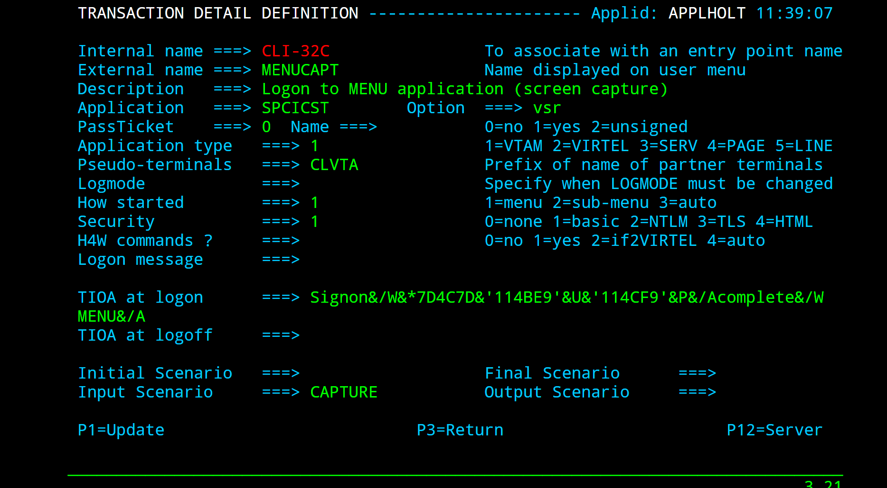
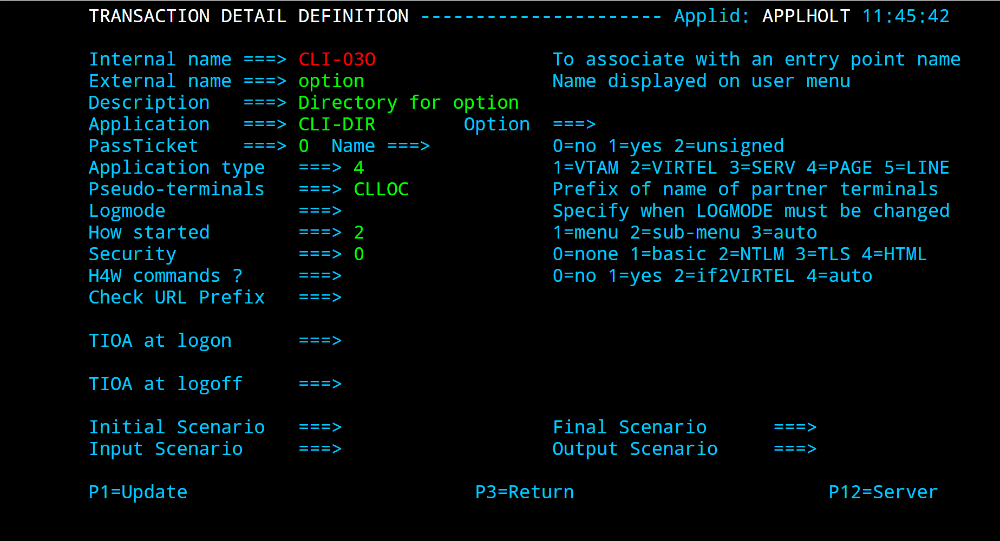
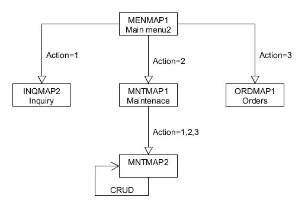
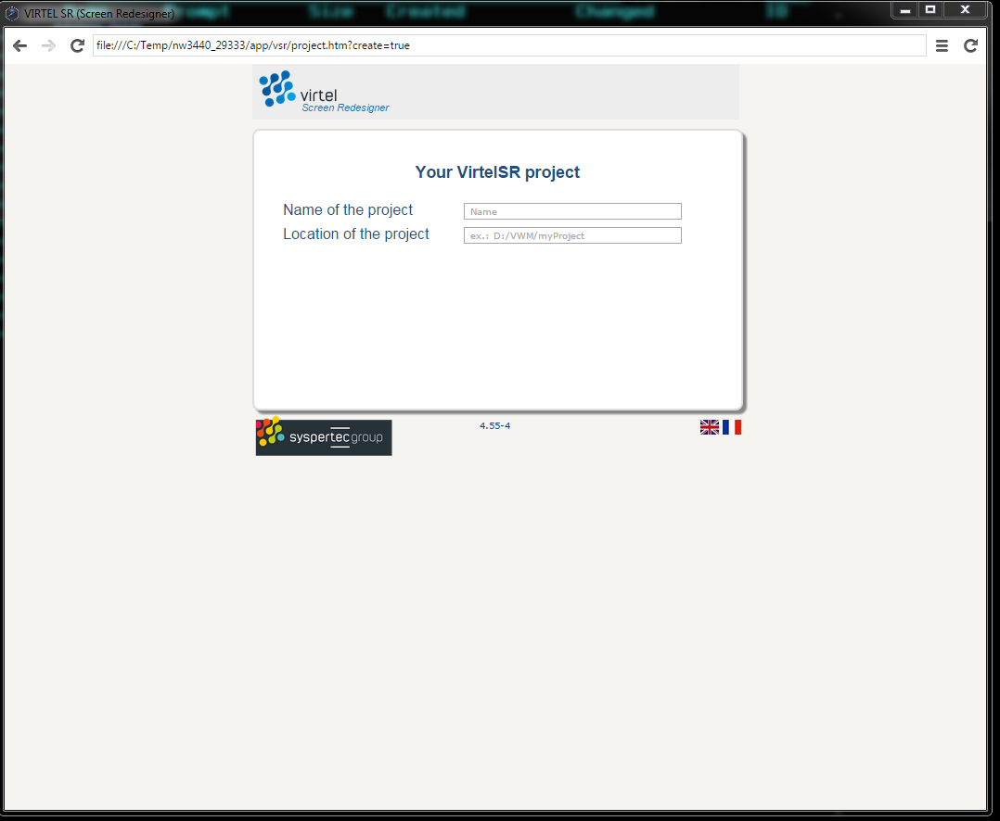
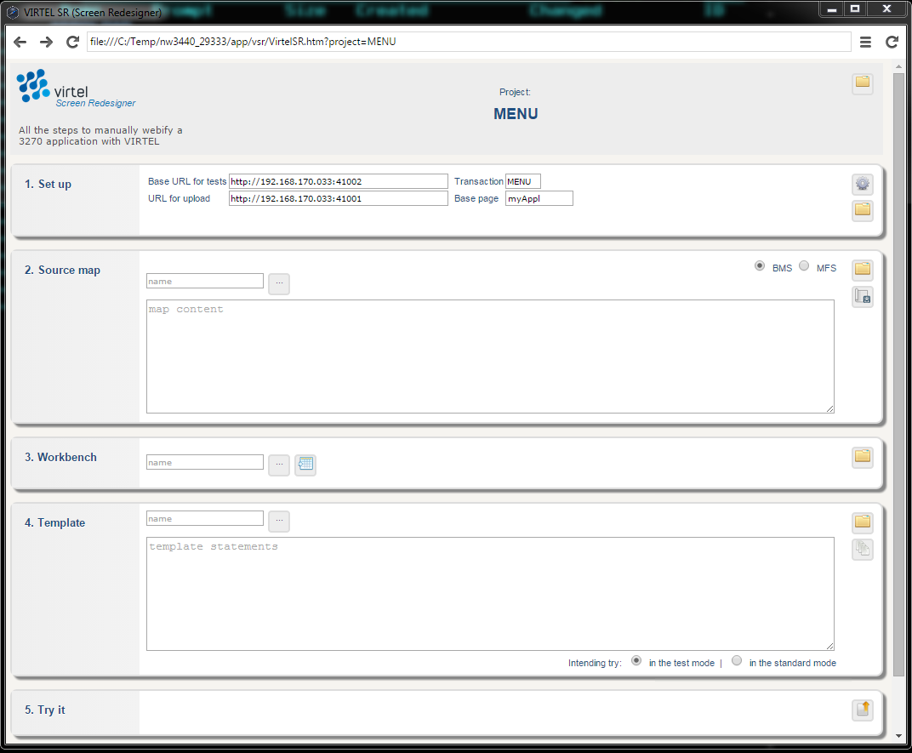
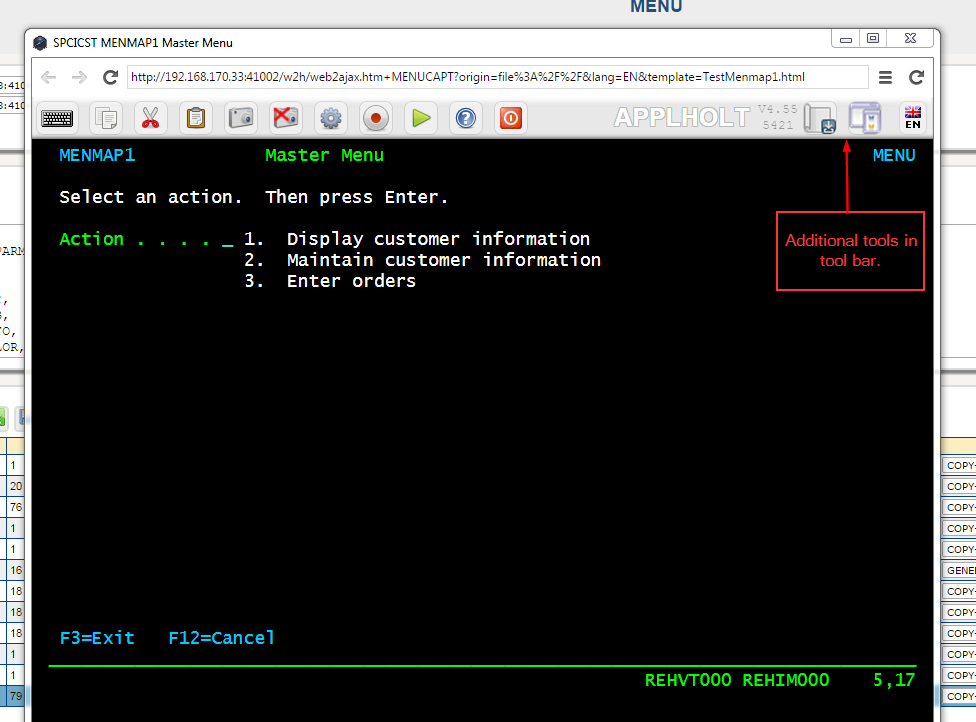
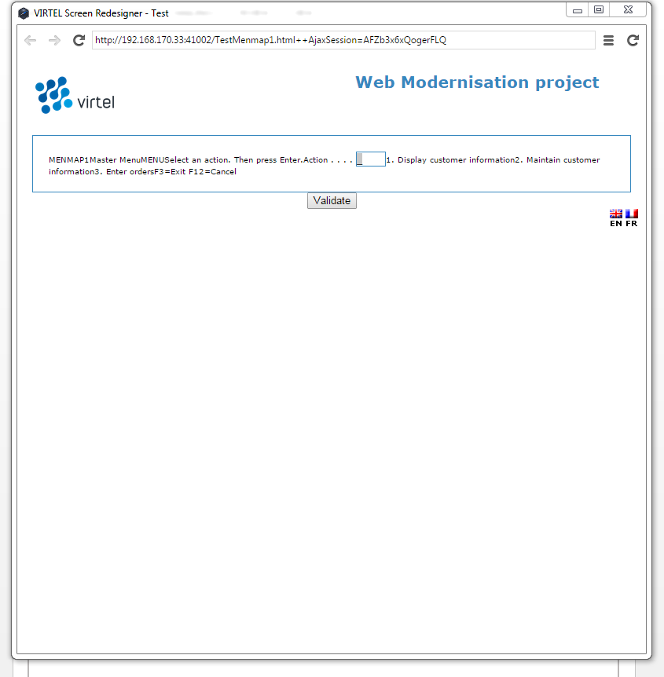
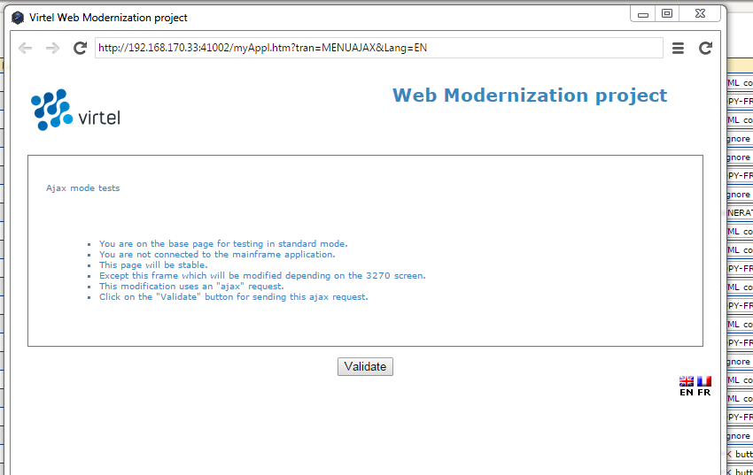
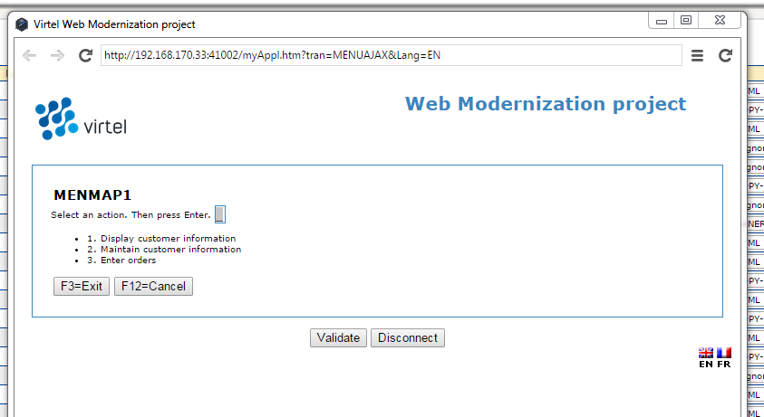

Virtel Screen Redesigner in action

==================================

In this newsletter we work through the Virtel Screen Redesigner and
present an actual modernization of a 3270 application. This newsletter
is not for the faint hearted and demands that your have a thorough
knowledge of web design. If you are not familiar with HTML, CSS and Java
script then do not continue. VSR is intended as a tool for web designers
who are familiar with these web components. Their functionality is used
as a part of a modernization project and is utilized extensively when
building a modernization project with VSR.

**Install VSR**

Installing VSR is a relatively simple. Download the VSR package and
extract to a directory. Create a shortcut to the VirtelSR.exe program.
That’s it. To remove it just delete the installation folder. The
extracted package provides an installation document which contains
further details.

**Using VSR and Virtel**

VSR utilizes the Virtel software as part of the modernization project. I
have started up an instance of Virtel which I will use in this VSR
example. We need to extract some information from Virtel and plug it
into the VSR setup menu.

Our Virtel is setup up to use the following lines:

F SPTHOLTV,LINES

VIR0200I LINES

VIR0201I VIRTEL 4.55 APPLID=APPLHOLT LINES

VIR0202I ALLOCATED IP ADDRESS = 192.168.170.033

VIR0202I INT.NAME EXT.NAME TYPE ACB OR IP

VIR0202I -------- -------- ----- ---------

**VIR0202I C-HTTP HTTP-CLI TCP1 :41002 **

**VIR0202I W-HTTP HTTP-W2H TCP1 :41001 **

VIR0202I ---END OF LIST---

We shall use the C-HTTP as the target line for out modernization
project. This will have the ip address:port of 192.168.170.033:41002.
This will be our “Base URL” for testing.

The W-HTTP address:port 192.168.170.033:41001 will be used for uploading
our modernized templates.

Next, we add the following two transactions to the CLIWHOST entry point
based upon the sample VSR transactions TESTCAPT and TESTAJAX which can
be found in the Virtel CLI-DIR directory. I use the Virtel
administration panel to create these new transactions. AS my VSR project
will be called MENU I create the transactions MENUCAPT and MENUAJAX.
MENU is also the CICS transaction that invokes our 3270 MENU
application.

Our MENUCAPT transaction looks like this:-

|image0|

And our MENUAJAX transaction look like this:

|image1|

The TIOA string enables Virtel to use logon to CICS using the user
id/password variables. The CICS application MENU is then called once
CICS processes the logon and returns a 3270 screen image with the word
“complete” in it.

**
The Options directory**

VSR has two modes of operation, Test mode and Standard mode. The CAPTURE
transaction requires the use of the options directory, note the vsr
value in the Option field. To support this we need to add the options
directory, as a transaction, to the CLI entry point. The following
transaction, CLI-03O, is added to CLIWHOST. It is modeled on the W2H
transaction CLI-03W.

|image2|

Our 3270 application front end screen looks like this:-

|image3|

**Mapping out the application**

Before we can build the scenarios that will modernize our application we
need to map out the navigability of the application and understand which
maps are called based upon user actions. Our application looks like
this:-

|image4|

Figure - MENU Maps layout

**Scenarios**

Within VSR we use Virtel scenarios to analyze a 3270 screen buffer in
order to produce the relevant HTML templates. Scenarios are loaded from
either the Virtel STEPLIB or a user defined VSAM file. In this example
we will loaded all the modernization scenarios for the Virtel STEPLIB.
First we must customize and assemble the MENUAJAX scenario. Using the
sample SELECTPG member in the Vitel SAMPLIB as a model we create member
MEMNUAJAX, and assemble it using the ASMTCT. This job can be found in
the Virtel CNTL library. See Appendix A for an example of MENUAJAX.

Having now prepared everything we are ready to build our modernization
project with Virtel VSR.

**Creating the VSR project**

I open the VSR shortcut that I created on my desktop and I am presented
with the initial VSR page where I can name and define my project
directory. The direct must exist prior to creating the project.

|image5|

Following through the VSR manual I create my project and plug in the
line variables that I extracted from my Virtel task. The VSR panel now
looks like this:-

|image6|

The main VSR panel is divided into 5 sections which help you to flow
through the process of modernization. The sections are:-

1. Setup Configuration information. The settings cogwheel icon on the
right will display and enable you to set the various settings for your
project.

2. Source Map Location of Maps

3. Workbench Work bench of maps, either converted from source or
manually created.

4. Template Generated template from workbench maps

5. Try it Display template either in Test Mode or Standard Mode.

Depending on selections within each section various ICONs will appear
providing additional functionality. Sections 2, 3 and 4 require input
sources. This is controlled by the selection ICON which is a button with
three dots on it. It is a toggle button which actives the selection
window to the left either as an input mode or in select mode. In input
mode you can type into the entry window. For example when saving a
template with a new name. I select mode it becomes a selection widget
listing files in a directory which you can select from.

According to the VSR manual we upload the preliminary files which will
support our modernization project into the CLI-DIR directory. Clicking
the upload ICON on the right hand side in section 5 of the screen opens
the Virtel drag and drop interface. From the modernization directory
that I created I drill down to the virtel\\cli-dir directory and upload
the files to the CLI-DIR using the drag and drop interface. As we will
be using “Test” mode in our modernization we also need to upload the
files in the development directory to CLI. The three files we move into
CLI are *custom.js*, *vsr.js* and *option.vsr*.

Note, these files are not required when modernizing in “standard” or
production mode.

|image7|

After successfully uploading the files I close the upload window and
refresh my VSR screen using refresh ICON in the top right corner.

The next stage is to download my first CICS MAP from the mainframe and
load it into VSR. The first MAP we are going to modernize is the main
menu map MENMAP1. This map is defined with the MENSET1 PDS map member on
the mainframe. I download the map as MENSET1.MAP and save it in MAP sub
directory. Next, in section 2 of the VSR project window I enter the name
of the map file and press the green LOAD ICON. The map loads and the
Source map section is updated.

|image8|

Having loaded my CICS MAP into VSR I can now create the work bench by
pressing the CREATE ICON in the workbench area. The workbench is filled
with rows, each row relating to a field with my CICS Map. I save the map
as a JSON file called menmap1.json. VSR saves workbench maps as JSON
files so I will use the JSON suffix for saving MAP elements.

|image9|

At this point I can start to modernize my 3270 MENMAP1 MAP using the
Choice column drop down. The drop down provides a variety on Virtel
conversion and design options. These options will generate the necessary
Virtel tags that will be the start of the modernization process. From
the workbench I can see that the map is made up of a total of 12
elements spread across 6 lines. Line 1 has three elements, Line 3 has 1,
Line 5 has 2, Line 6, 7 and 23 both have 1 element and finally line 24
has two elements. For this example I we change the ACTION line (5) and
its associated untitled elements on line (5,6,7) to become a select drop
down.

Following the VSR documentation I set the protected filed to the choice
“COPY-FROM” and the unprotected ACTION field to the choice
“GENERATE-HTML”. I have saved the workbench as MENMAP1. I then create
the template by pressing the “Create” ICON in the Template section of
the VSR display, section 5. This generates the Virtel tags which will
support my modernized template. I save the template as Testmenmap1. The
default extension of HTML will be added.

My VSR window now looks like:

|image10|

**Testing changes with “Test Mode”**

One of the features of VSR is that you can view your modernization
changes as you develop and before you commit them to standard or
production mode. To do this upload the generated template by pressing
the upload ICON upload button, the first ICON on the left in the “Try
it” section. After uploading the template display the template within a
Virtel capture window by pressing the “Try it” ICON, the second icon on
the left hand side right in section 5. Now the MENU page is redisplayed
in the capture window. Notice the two additional ICONS in the tool bar
area. The first one is “Capture BMS Map” the second is “View the
Modernized Rendering”. We use this second one so see what our modernized
screen looks like based upon the elements that we have copied from the
workbench into the template area. VSR will use Virtel to display the
template.

|image11|

After pressing the “render” ICON we are presented with are modernized
screen:-

|image12|

Nothing too exciting here. We can see that Virtel has taken the various
elements from the Map, created the Virtel tags within the template, and
displayed them without any special markup. Of course, the markup is down
to us and this is where we begin our modernization using our HTML, CSS
and Java script skills. The generated template statements form a
sub-page which is sent to the browser after combing it with top and
bottom sub-page elements. The top and bottom pages are called
PageTop.html and PageBottom.html and are located in the Options
directory of the project.

Our first modernization is to change the background colour. To do this
we need a css file to customize. One is provided, Visu.css, and is
include it in the PageTop.html file. This css file can be found in the
VIRTEL\\CLI-DIR sub directory of the project. We update visu.css and
save it as menu.css, keeping the original as a copy.

Next we need to update the PageTop.html to include our menu.css style
sheet. Here are the changes we made:-

<!--Stylesheet for the modernized application presentation -->

<!-- History 1. Style sheet visu.css replaced with menu.css

-->

<link type="text/css" rel="stylesheet" href="menu.css"/>

<link type="text/css" rel="stylesheet" href="../w2h/lang.css">

The updated files are uploaded to the CLI-DIR using the right hand
upload ICON in the try-it section. We must save the template in section
4 in order to pull in the modified pagetop.html file. This process
creates TestMenmap1.html which is a combination of the pageTop.html, our
Virtel template tags, and the pageBottom.html html elements. If we have
a look at the created TestMenmap1.html in the Template folder you can
see it has three distinct 
 areas. The top page identified by id
“headband”, the middle portion identified by id “dynamic”. The bottom
code is everything following this closing 
 on the dynamic area. If
you look at pageTop.html and pageBottom.html you will see how these two
elements split the dynamic 
 and the <form> elements. By default the
dynamic form is called “VirtelForm”.

We upload testmenmap1.html through the upload ICON in the ‘Try it’
section to the CLI-DIR directory and we re-capture and render our
changes to view the changes we have made. Here are the results:-

|image13|

Well, this confirms that our menu.css is being used to modernize our
presentation. We continue modifying our menu.css until we get the
desired look. We remove the Virtel logo and add our own, change a few
other things and end up with a page that looks like this:-

|image14|

So we have changed the static elements of our modernized display by
modifying the pageTop and pageBottom web elements but our dynamic middle
section, as represented by the template tags that VSR has generated
still looks very mucg the same. WE now turn our attention to modernizing
this area through working on the VSR workbench.

**VSR WorkBench Options**

**Line options**

If we right click on a line within the workbench we are presented with a
sub menu which provides us with some line editing tools. We will be
using these to help in our modernization.

|image15|

The first thing we are going to do is to make the first element in the
work a <h1> html element. To do this we insert a line before and after
and set those lines to html tags <h1> and </h1> respectively.

With the additional HTML rows are Workbench now looks like this:-

|image16|

We regenerate our template using the generate template in Section 4 of
VSR, save it then upload it. When we render the changes the modernized
screen looks like:-

|image17|

We modify the workbench again to remove some elements that we do not
require in our modernized screen and modify others. We perform the
following VSR tasks after modifying our workbench:-

3. Save the workbench

3. Export it as a XML file. (Easier when doing a lot of updates. You can
import the XML file).

4. Create the template

4. Save the template and build new test.HTML file.

5. Upload test.HTML file

5. Open the Capture window.

Our results look like this:-

|image18|

Our first screen looks slightly webified. A lot more to do but it is a
start.

**Using “Standard” or “Production Mode”**

In our previous modernization with “Test” mode there was no interaction
with the back end application. Virtel captured the screen that we wanted
to work on, applied the modernization templates that we had built and
should us the result. This was all done in the browser using HTML and
Javascript. Now we want to see what happens when we us the modernized
panel with the back end application. To do that we need to use VSR
“Standard” or “production” mode operation.

In standard mode we are dependent on a scenario to perform the
modernization work. When Virtel receives the 3270 buffer from the
application the scenario invoke the sub-page template that will capture
the relevant fields from within the 3270 buffer and build our modernized
screen before serving it to the browser as an AJAX request. We switch to
standard mode by selecting “in standard mode” at the bottom of the VSR
panel.

The first process is to save our template to a production name rather
than a test name as we did in “Test” mode. The name we chose must also
tie up with the scenario. In our example we have associated menu MENMAP1
with sub-page template ProdMenmap1.html. You can see this association if
you look at the scenario example in Appendix A. We perform this action
in the section 4 of the VSR panel, but changing the name to
ProdMenmap1.html. Pressing the ICON with the three dots allows us to
enter the name in the drop down. Next we upload our production template
to Virtel.

Now, before doing anything else we ensure that our MENUAJAX scenario has
been assembled and link edited into our Virtel user steplib. This is
normally a load library reserved for user modifications and proceeds the
distributed Virtel steplib library. Once successfully assembled and
linked we tell Virtel to load it in preparation for our standard test.
We issue the command:-

F Virtel,new=menuajax

This will load or refresh the copy of the scenario. We are now ready to
test our modernized template in production mode. Pressing the “Try it”
ICON, third one on the left hand side in section 5 we are presented with
the following “base” template. This is derived from the default
myAPPL.htm template.

|image19|

It contains top and bottom static areas and a dynamic sub-page middle
area which will be replaced by the sub-page template we have built.
Pressing validate will display our modernized template area.

|image20|

Now, if we select an action this should be passed to the application and
the application should return with the next panel in the navigation
sequence. We select option 1 and press enter. The screen is updated with
the next panel display un-modernized panel INQMAP2.

|image21|

All seems to be working. We have modernized the primary panel of our
application and tested that it works with the back end application.
There is still further work to be done. First we have to update the
default myAPPL.htm so that it has are static elements that we built in
the PageTop.html and PageBottom.html templates during “test mode”. Then
we have to navigate through our application capturing the MAPS and
modernizing each one. We also might have to refactor our scenario to put
in more meaningful business logic.

**
Appendix A**

\* ---------------------------------------------------------------------

\* SCENARIO FOR VIRTEL SCREEN REDESIGNER

\* Screen selection for MENU application

\* ---------------------------------------------------------------------

MENUAJAX SCREENS APPL=MENUAJAX

\*

SCENARIO OUTPUT

\*

\* Analyze the screen ident to be recognized:

\* - line AA

\* - column BB

\* - length CC

\* (fill in AA,BB and CC)

\*

\* Search for screen identifiers (e.g. XXXXXXXX, YYYYYYYY)

\* which have been chosen for Webified Presentation

\*

\* Code one or more IF$ or CASE$:

\*

\* CASE$ (AA,BB,CC), \*

\* (EQ,'XXXXXXXX',MENU00X), \*

\* (EQ,'YYYYYYYY',MENU00Y), \*

\* ELSE=CLASSIC

\*

PIVOT IF$ (01,02,07),EQ='MENMAP1',THEN=MENU00X,ELSE=OTHER1

\*

OTHER1 IF$ (01,02,07),EQ='MENMAP2',THEN=MENU00Y,ELSE=OTHER2

\*

OTHER2 IF$ (01,02,07),EQ='MENMAP3',THEN=MENU00Z,ELSE=CLASSIC

\*

\* Screen XXXXXXXX

\* Send the sub-page associated with this screen ident

\* (replace PGXXXXXX.html by the name chosen)

\*

MENU00X DS 0H

SET$ PAGE,'ProdMenumap1.html'

SCENARIO END

\*

\* Screen YYYYYYYY

\* Send the sub-page associated with this screen ident

\* (replace PGYYYYYY.html by the name chosen)

\*

MENU00Y DS 0H

SET$ PAGE,'ProdMenumap2.html'

SCENARIO END

\*

\* Screen ZZZZZZZZ

\* Send the sub-page associated with this screen ident

\* (replace PGZZZZZZ.html by the name chosen)

\*

MENU00Z DS 0H

SET$ PAGE,'ProdMenumap3.html'

SCENARIO END

\*

\* Screen ident not recognized

\* Use classic 3270 presentation sub-page

\*

CLASSIC DS 0H

SET$ PAGE,'VSRajax.html'

SCENARIO END

\*

SCRNEND

END

.. |image1| image:: images/media/image2.png
   :width: 5.76042in
   :height: 3.59819in

.. |image3| image:: images/media/image4.png
   :width: 5.78147in
   :height: 3.77083in

.. |image7| image:: images/media/image8.png
   :width: 6.26806in
   :height: 3.90000in
.. |image8| image:: images/media/image9.png
   :width: 6.02083in
   :height: 4.78678in
.. |image9| image:: images/media/image10.png
   :width: 6.26806in
   :height: 4.98750in
.. |image10| image:: images/media/image11.png
   :width: 6.26806in
   :height: 6.43681in

.. |image13| image:: images/media/image14.png
   :width: 4.52083in
   :height: 4.66458in
.. |image14| image:: images/media/image15.png
   :width: 4.69792in
   :height: 4.86447in
.. |image15| image:: images/media/image16.png
   :width: 6.26806in
   :height: 3.40764in
.. |image16| image:: images/media/image17.png
   :width: 6.26806in
   :height: 1.22917in
.. |image17| image:: images/media/image18.png
   :width: 6.26806in
   :height: 2.76528in
.. |image18| image:: images/media/image19.png
   :width: 6.26806in
   :height: 2.91250in

