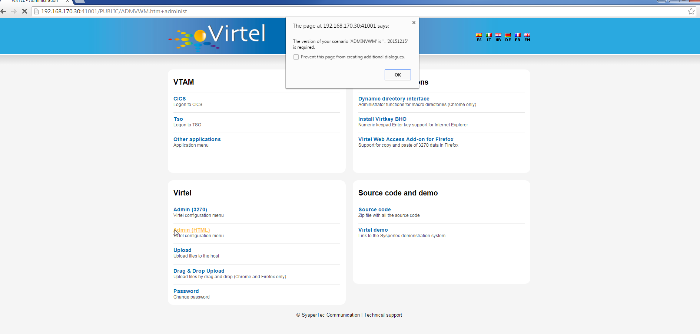

.. _tn201607:

What’s new in Virtel 4.56 (September 2016)
==========================================

The following newsletter discusses some of the new features that are available in Virtel Release 4.56 and also includes the features announced in Virtel 4.55.

**Pre-requisites before running Virtel 4.56**

Add ‘Option compatibility’ keyword to your TCT and re-assemble if you wish to maintain previous customised behaviour for CSS, w2HPARM and custom.js files. The “option” feature has been changed in Virtel 4.56.
The default is now “Option Transaction”. Before it was “Option Entry Point”. To maintain compatibility code the following TCT parameter and re-assemble the TCT using the Virtel 4.56 maclib library.

:: 	

	HTSETn = (OPTION-DEFAULT-COMPATIBILITY)                  /* n = 1-4 */

**MAXSOC TCT default**

The default for the MAXSOC parameter in the TCT has been increased from
50 to 1000.

**Virplex option**

The new Virplex feature of Virtel implements a dialog between two or
more Virtel lines sharing a common IP address. The feature enables
multiple Virtel instances to share the same ARBO and TRSF files and
removes the need of “Timed Affinity” which is required by dynamic
VIPA’s. Changes in the URL format know enable participating Virtels
within the Virplex to determine whether they are the target of the URL
or if the URL belongs to another Virtel. In the latter case the URL is
forwarded onto the target Virtel destination. For further information
see the Virplex Section in the Virtel V4.56 Communications Guide.

**Macro Editor**

The text area size of the macro editor has been increased from 2 lines to 8 lines.

**Virtel customisation - Extended Option enhancement.**

In order to address some customer requirements and to improve
performance, a new option feature has been implemented with VIRTEL 4.55.
This new feature changes the way Virtel accesses customization
parameters. Before Virtel customization was set at the Entry point level
whereas with this new option feature the customization level is the
VIRTEL transaction. In previous releases of Virtel, Entry Point
customization controlled features for all associated transactions
through three files. Those being:-

-  /w2h/custom-js

-  /w2h/custom-css

-  /w2h/custom-w2hparm

This meant that for every transaction customization features were
accessed regardless of whether they were required.

With this new feature additional customization granularity has been
added by allowing customization at the transaction level through the use
of the “option customization file”. An “option stub file” identifies
customization data pertaining to a specific transaction. To support this
feature a new option field has been added to the transaction definition
along with a new /option directory. An “option stub file” contains
defines the files which will be used to customize a particular
transaction. The statements within the “option stub file” identify the
custom.css, help, custom.js and w2hparm.js files related to the
transaction. See Technical Newsletter “\ *2016-11 Customizing Virtel
4.56*\ ” for more information.

**Template enhancements**

The VALUE-OF parameter has been updated to support the retrieval of the
application-options in a template: For example:-

::

	{{{ VALUE-OF (APPLICATION-OPTION) }}}

**Scenario enhancements**

The VALUE-OF in the scenario FIELD keyword has been updated to support
the application options. Here is an example of using the COPY$
statement:-

::

	COPY$ SYSTEM-TO-VARIABLE,VAR='VAR1',                x
		FIELD=(VALUE-OF,APPLICATION-OPTION)

**SET\| UNSET compatibility option**

To maintain compatibility with the previous customized
application-option support a new parameter has been introduced. This is
referred to as the OPTION-DEFAULT-COMPATIBILITY. See the following
examples. It sets the default option processing:-

Setting a page’s local default to compatibility:

::

	{{{ SET-LOCAL-OPTIONS (OPTION-DEFAULT-COMPATIBILITY) }}}

Un-setting the default compatibility default:

::

	{{{ UNSET-LOCAL-OPTIONS (OPTION-DEFAULT-COMPATIBILITY) }}}

When this option is set then tag parameter {{{ VALUE-OF(APPLICATION-OPTION) }}} will return 'compatibility' (without quotes).

*3270 Administration enhancements*

The value of this 'application option' is taken from the transaction definition. A new option field has been added to the transaction screen, next to the Application field. The maximum length is 32 bytes. The value will be right trimmed, removing any blanks or binary zeroes:-

::

	TRANSACTION DETAIL DEFINITION ---------------------- Applid: SPVIRPX1 18:40:05
	Internal name ===> ZLI-10 To associate with an entry point name
	External name ===> Cics Name displayed on user menu
	Description ===> Logon to CICS
	Application ===> DBDCCICS Option ===> <<<- New Option field
	PassTicket ===> Name ===> 0=no 1=yes 2=unsigned
	Application type ===> 1 1=VTAM 2=VIRTEL 3=SERV 4=PAGE 5=LINE
	Pseudo-terminals ===> ZLVTA Prefix of name of partner terminals
	Logmode ===> Specify when LOGMODE must be changed
	How started ===> 1 1=menu 2=sub-menu 3=auto
	Security ===> 1 0=none 1=basic 2=NTLM 3=TLS 4=HTML
	H4W commands ? ===> 0=no 1=yes 2=if2VIRTEL 4=auto
	Logon message ===>
	TIOA at logon ===>
	TIOA at logoff ===>
	Initial Scenario ===> Final Scenario ===>
	Input Scenario ===> Output Scenario ===>

**MQ Enhancement. TCT M3 and M4 keywords**

The TCT now supports the MQ keywords M3 and M4 in addition to M1 and M2. See the Virtel Installation guide for further information.

**Enhancement to the SCENARIO statement**

The SCENARIO statement has be enhanced to support the following options:-

- SCENARIO FAIL

Scenario processing stops. On the next POST the scenario will be restarted at its entry point.

- SUCCESS SCENARIO

Scenario continues normal purposing of the current message.

**New TRSF directory entry - DOC**

This directory has been added to the distributed SAMP TRSF files. It will contain administration and other pertinent documentation files.

**New FOREACH$/ENDFOR$ Scenario statements**

Allows a FOR EACH loop in scenarios thru two new instructions: FOREACH$ and ENDFOR$.

Example:-

Loop on a variable:

::

	LOOP1 FOREACH$ VALUE-IN-VARIABLE,VAR='TOTO'
	CASE$ CURRENT-FOREACH-VARIABLE-OF,LOOP1,(EQ,'XXXX',ET1)
	COPY$ SYSTEM-TO-VARIABLE,VAR='I1',LENGTH=2, \*
	FIELD=(VALUE-OF,CURRENT-FOREACH-INDEX),TYPE=REPLACE
	COPY$ SYSTEM-TO-VARIABLE,VAR='V1', \*
	FIELD=(VALUE-OF,CURRENT-FOREACH-VARIABLE),TYPE=REPLACE
	ERROR$ 0,'TOTO: ','\*I1','==','\*V1'
	ENDFOR$ LOOP1

Loop to print all values of a variable:

::

	LOOP2 FOREACH$ VALUE-IN-SCREEN,SCREEN=(1,1,80,24)
	COPY$ SCREEN-TO-VARIABLE,SCREEN=(=,01,80),VAR='screenL', X
		TYPE=REPLACE
	COPY$ SYSTEM-TO-VARIABLE,VAR='L1',LENGTH=2,
		FIELD=(VALUE-OF,CURRENT-LINE),TYPE=REPLACE
	ERROR$ 0,'line ','\*L1','==','\*screenL'
	ENDFOR$ LOOP2

Variables of a FOREACH loop may be referenced by the COPY$ statement. In the example below, the value of VAR1 which is copied is the current value in the FOREACH$ loop.

::

		LOOP1 FOREACH$ VALUE-IN-VARIABLE,VAR='VAR1'
		COPY$ VARIABLE-TO-SCREEN,VAR='VAR1',FOREACH=LOOP1,    *
		SCREEN=(=,=,=)
		COPY$ VARIABLE-TO-VARIABLE,VAR=('VAR1','VAR2'),FOREACH=LOOP1, *
		OFFSET=8,LENGTH=5,PAD=' '
		ENDFOR$ LOOP1

.. note:: 

FOREACH$ must have a label, and this label must match the ENDFOR$ parameter.

::

	FOREACH$ VALUE-IN-SCREEN updates CURRENT-SCREEN-POSITION (idnode://7707 ‘ = ' sign in COPY$ and CASE$).

**New settings parameter to inhibit CTRL-R key sequence.**

A new settings parameter has been added to inhibit CTRL-R being pass through to the browser and refreshing the screen.

**Macro keyboard mapping feature**

Macros can now be associated with a “ALT” or “CTRL” key sequence.

**Key definition enhancement for scripts**

Allows more 'user friendly' codings for PA/PF keys in a transaction
script. Function keys may now be specified as &\*key. For example :-

::

	&\*CLEAR
	&\*clear
	&\*ENTER
	&\*enter
	&\*PA1
	&\*pa1
	&\*PF24
	&\*Pf24

**FAQ**

The following questions address some of the more common issues when implementing this release of Virtel. 

**Q1**

My cursor disappears in a reverse video field.

*Solution*

This is probably due to the font and cursor selection. In the settings panel select BAR as the cursor and a font setting like Droid Sans Mono or DejaVu Sans Mono

**Q2** 

I’ve just installed Virtel but when I try to execute the Admin (HTML) from the W2H Administration Portal I get the message *“The version of scenario of your scenario ‘ADMINVWM’ is “.” ‘20151215 is
required*.” My W2H session is then terminated.

|image0| 

Figure 1 Error message when accessing Admin (HTML)

*Solution*

You will need to change the W2H entry point, WEB2HOST, to specify a directory to search when loading scenarios. By default, scenarios are loaded from the VIRTEL LOADLIB. For W2H they need to come from the scenario SCE-DIR. Load up the Admin portal and select Admin (3270). Navigate to the WEB2HOST entry and display the entry using PF12. Modify the “Directory for scenarios” field to SCE-DIR. The display should look
like:-

|image1| 

Figure 2 Entry Point display for WEB2HOST

.. note::

The scenario directory has to be SCE-DIR. Before the field was blank indicating that scenarios should be loaded from LOADLIB. Press PF1 to confirm they update and then Press PF3 and the CLEAR to return back to the portal screen. Press “CTRL-R” in your browser’s to refresh the browser cache. Now select Admin (HTML) from the Administration options
and you should see the Administration panel.

|image2| 

Figure 3 Administration Portal

**Q3** 

My customised custom.js no longer works.

*Solution*

Recompile your TCT with the option:-

::

	HTSETn = (OPTION-DEFAULT-COMPATIBILITY)                  /* n = 1-4 */

Virtel 4.56’s default option behaviour is “Option Transaction” and not “Option Entry Point”. To maintain compatibility with previous versions the TCT needs to be recompiled with the “Compatibility” option
parameter.

**Q4**

How do I migrate to Virtel 4.56

*Solution*

See the Virtel manual Virtel456 Migration User Guide.

**Q5**

I have installed Virtel V4.56 but my Virtel Studio scenarios are no longer in the SCE-DIR.

*Solution*

If your user scenarios were kept in the SCE-DIR directory than these would have been replaced by the new SCE-DIR within the SAMPTRSF VSAM file. Rebuild and upload you user scenarios to the new SCE-DIR.

.. note::

It is recommended that user scenarios are maintained in a separate directory associated with the HTMLTRSF VSAM file. In this way they will not be replaced with a new release of Virtel.

.. |image1| image:: images/media/image2.png
   :width: 6.26806in
   :height: 3.79444in
.. |image2| image:: images/media/image3.png
   :width: 6.26806in
   :height: 2.43611in