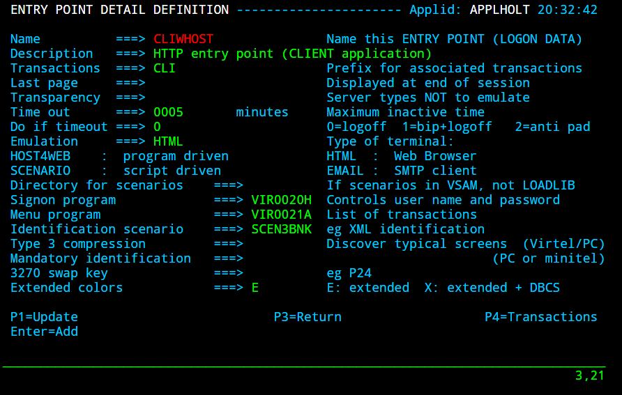
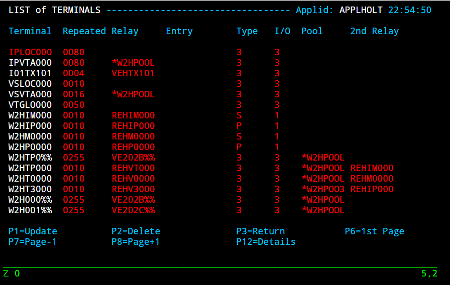

Nailing LUS with an Identification scenario
===========================================

**Note: The external programs used in this POC are not officially
supported.**

The following newsletter explains how to force a LUNAME from within an
identification scenario. The criteria being that the LUNAME is derived
from a computer name passed in the URI as the user data or routing
parameter. Within the Identification Scenario Virtel validates the
computer name against a DNS lookup. If the DNS is successful the
scenario checks to see whether the computer name forms part of the DNS
name. If so it builds a LUNAME by replacing the first character of the
terminal name with the character ‘V’. A session is then established
using this LUNAME. If the DNS validation is unsuccessful the the session
uses a normal LUNAME from the default Virtel pool associated with the
transaction.

For example, given the following two examples:

Computer name TE202B77 DNS name te202b77.myCompany.com IP 192.168.1.127

Computer name TE202B78 DNS name temppc.myCompany.com IP 192.168.1.128

Assume the following:-

The transaction being accessed is a session monitor. Depending on the LU
name will determine the applications available to the user. A user using
computer TE202B77 will be authorised to user all applications. A user
using computer TE202B78 will be restricted to non-authorised
applications only.

User A accesses the 3270 session monitor application using a .bat file
the extracts the computer name and build a URL. The URL is sent to
Virtel.

*http://192.168.70.33:41002/w2h/web2ajax.htm+mytpx+TE202B77 *

The Virtel identification scenario traps the inbound call and validates
the computer name against the IP address of the calling computer through
a DNS lookup. In the Virtel log we will see something like:-

VIRHT51I HTTP-CLI CONNECTING CLVTA009 TO 192.168.001.127:53411

Calling SERV3BNK WITH IP=192.168.001.127,LU=\*W2HPOOL,TERMINAL=,

ROUTING=TE202B77

DNS=te202b77.mycompany.com,TERMINAL=TE202B77

LUNAME=VE202B77

VIR0919I CLVTA009 RELAY VE202B77(W2HTP077) ACTIVATED

LOGON

As the DNS validation is considered successful the LUNAME VE202B77 is
created and will be used to establish a session with the session manager
identified as transaction MYTPX.

User B accesses the 3270 session monitor with the following URI.

*http://192.168.70.33:41002/w2h/web2ajax.htm+mytpx+TE202B78 *

The following messages appear in the log:-

VIRHT51I HTTP-CLI CONNECTING CLVTA009 TO 192.168.001.128:53622

Calling SERV3BNK WITH IP=192.168.001.128,LU=\*W2HPOOL,TERMINAL=,

ROUTING=TE202B78

DNS=temppc.syspertec.com,TERMINAL=TE202B78

VIR0919I CLVTA009 RELAY REHVT000(W2HTP000) ACTIVATED

LOGON

The DNS validation is considered to have been unsuccessful as the
computer name does not form part of the DNS named return following a
lookup by the IP address of the terminal. The LU assigned to the session
will be the next free LU in the pool associated with the transaction.

Based upon the LUNAME passed to the session manager will determine the
applications listed.

**Installation**

1. Install Virtel V4.56. This is required to support the Identification
   scenario delivered in this package. See the Technical Newsletter -
   ***2016/08 Installing Virtel V4.56 from scratch*** for further
   information.

2. Download TBANKEN.TRS from the Virtel FTP Server or save the TRS file
   if sent via email.

3. Upload to the mainframe into a dataset with the following DCB
   attributes:-

    LRECL=1024,BLKSIZE=6144,RECFM=FB,

    DSN=HLQ.TBANKEN.TRS

1. Run the following job. This will unterse the file and install the
   package libraries that are associated with this newsletter. Here is
   some sample JCL. Change accordingly.

    //jobcard JOB 9000,'ED...HOLT...',CLASS=A,MSGCLASS=X,NOTIFY=&SYSUID

    //S01 EXEC PGM=IEFBR14

    //DDA DD UNIT=SYSDA,

    // DSN=HLQ.TBANKEN.TEMP,DISP=(MOD,DELETE),

    // SPACE=(TRK,0)

    //S02 EXEC PGM=TRSMAIN,PARM=UNPACK

    //SYSPRINT DD SYSOUT=\*

    //INFILE DD DSN=HLQ.TBANKEN.TRS,DISP=SHR

    //OUTFILE DD UNIT=SYSDA,

    // DSN=HLQ.TBANKEN.TEMP,DISP=(,CATLG),

    // SPACE=(CYL,(10,10),RLSE)

    //S03 EXEC PGM=ADRDSSU,REGION=0M,COND=(0,NE)

    //SYSPRINT DD SYSOUT=\*

    //IN DD DSN=HLQ.TBANKEN.TEMP,DISP=SHR

    //OUT DD UNIT=SYSDA,VOL=SER=VVVVVV,DISP=SHR

    RESTORE INDDNAME(IN) -

    OUTDD(OUT) -

    DATASET(INCLUDE(\*\*)) -

    RENAMEU( -

    (SPTHOLT.\*\*,HLQ.\*\*) -

    ) -

    CATALOG BYPASSACS(\*\*) NMC NSC CANCELERROR

1. The following two libraries should now exist:-

    userid.TBANKEN.LOADLIB

    userid.TBANKEN.CNTL

1. Copy the members in userid.TBANKEN.LOADLIB to your Virtel 4.56
   library. There should be three members:-

    SCEN3BNK - Assembled Identification Scenario

    SERV3BNK - Service program called with the Identification Scenario

    VIRT3BNK - Virtel utility program that contains the following
    functions:-

    GETHOSTBA Lookup name by IP address.

    GETHOSTBN Lookup IP address by DNS name.

1. The userid.TBANKEN.CNTL contains the Identification Scenario source
   and some utility jobs. See the Scenario section for a listing of the
   Identification Scenario. Copy the scenario source (SCEN3BNK) to your
   userid .VIRTEL.CNTL library

**
Virtel Configuration**

**Identification Scenario**

To use this package we have to associate the Identification Scenario
with the line:port that we will be calling in on. In our example we are
using the line C-HTTP which is associated with Entry Point CLIWHOST. I
have updated the Entry Point and added the Identification Scenario
SCEN3BNK.

|image0|

**Terminal definitions**

For each terminal that we are going to dedicate a LU to we need to add a
terminal definition and associate it with a pool. Here is an example of
the terminal definitions required to support terminals in the LU ranges
VE202B00-FF and VE202C00-FF.

|image1|

**Scenario**

The identification scenario is responsible for validating the computer
name passed in the URI as the userdata parameter. The following is an
extract from the SCEN3BNK scenario which handles the DNS validation:-

\* ---------------------------------------------------------------------

\* Call GETHOSTBA function to retrieve DNS name given IP address -

\* ---------------------------------------------------------------------

1 COPY$ VALUE-TO-VARIABLE,VAR='FUNCTION',VALUE='GETHOSTBA'

2 COPY$ SYSTEM-TO-VARIABLE,FIELD=(VALUE-OF,USER-IP-ADDRESS), \*

VAR='PARM1',TYPE=REPLACE

3 COPY$ SYSTEM-TO-VARIABLE,FIELD=(VALUE-OF,RELAY), \*

VAR='PARM2',TYPE=REPLACE

4 COPY$ SYSTEM-TO-VARIABLE,FIELD=(VALUE-OF,QUERY), \*

VAR='PARM3',TYPE=REPLACE

5 COPY$ SYSTEM-TO-VARIABLE,FIELD=(VALUE-OF,ROUTING-PARAMETER), \*

VAR='PARM4',TYPE=REPLACE

\*

6 COPY$ SYSTEM-TO-VARIABLE,FIELD=(VALUE-OF,TRANSACTION-EXTERNAL),\*

VAR='TRANSACTION',TYPE=REPLACE

7 CASE$ 'TRANSACTION',(BEGIN,'TSO',CALLIT),ELSE=FINISH

CALLIT EQU \*

8 ERROR$ 0,'Calling SERV3BNK WITH IP=', \*

'\*PARM1',',LU=','\*PARM2',',QUERY=','\*PARM3', \*

',ROUTING=','\*PARM4'

9 VIRSV$ CALL-REUSE,('SCEN3BNK','SERV3BNK'), \*

(IN-VARIABLE,'FUNCTION'), \*

(IN-VARIABLE,'PARM1'), \*

(OUT-VARIABLE,'RESULT',256), \*

TASKS=1, \*

KEY=8, \*

ERROR=KO

10 ERROR$ 0,'DNS=','\*RESULT',',TERMINAL=','\*PARM4'

11 CONVERT$ EBCDIC-TO-UPPERCASE,VAR='RESULT'

12 CONVERT$ EBCDIC-TO-UPPERCASE,VAR='PARM4'

13 CASE$ 'RESULT',(CONTAINS,'\*PARM4',OK),ELSE=KO

OK EQU \*

\*

14 COPY$ VARIABLE-TO-VARIABLE, \*

VAR=('PARM4','MYSUFFIX'), \*

OFFSET=1,LENGTH=7,PAD=' ',TYPE=REPLACE

15 COPY$ LIST-TO-VARIABLE,LIST=('V','\*MYSUFFIX'), \*

VAR=MYLUNAME

\*

16 ERROR$ 0,'LUNAME=','\*MYLUNAME'

17 COPY$ VARIABLE-TO-SYSTEM,FIELD=(VALUE-OF,ROUTING-PARAMETER), \*

VAR='MYLUNAME'

18 GOTO$ FINISH

KO EQU \*

FINISH EQU \*

**
Logic**

1.  Create variable FUNCTION and set to GETHOSTBA. This is the
    GetHostByAddress utility function that will called from within the
    VIRTUTIL utility module.

2.  Get the callers IP Address and place in variable PARM1.

3.  Get the callers allocated LUNAME pool and place in variable PARM2.

4.  Get the callers query parameters and place in variable PARM3.

5.  Get the callers terminal name(userdata) and place in variable PARM4.

6.  Get the callers transaction and place in variable TRANSACTION.

7.  **If TRANSACTION begins with TSO continue, else exit scenario. Note
    this will have to be changed to support the transaction you want to
    nail LUs to.**

8.  Debugging message.

9.  Call VIRSV program and pass parameters. This will call program
    SCEN3BNK which will interface with the VIRTEL Utility program
    VIRT3BNK. The RESULT variable will contain the result of the
    GETHOSTBA call. If a non-zero return code is returned then the
    Identification Scenario is terminated.

10. Debugging message.

11. Convert RESULT to uppercase.

12. Convert PARM4 to uppercase.

13. Validate the terminal name against the returned DNS name. If
    successful continue else exit Identification Scenario.

14. Copy characters 1-7 of terminal name to variable MYSUFFIX.

15. Prefix MYSUFFIX variable with character ‘V’ and create variable
    MYLUNAME.

16. Debugging message.

17. Set System variable ROUTING-PARAMETER with the contents of variable
    MYLUNAME.

18. Exit Identification Scenario.

**Calling the browser**

The following \*.bat file obtains the computer name and takes the first
8 characters and places them into the URI before calling the browsers.

**Important. Change the transaction to the transaction that you wish to
nail LUs to. In this example the transaction is mytpx.**

title 3Banken Sample bat file passing the terminal name

@echo on

color 1f

cls

SET P1=%COMPUTERNAME:~0,8%

echo %P1%

start http://192.168.170.33:41002/w2h/web2ajax.htm+\ **mytpx**\ +%P1%
&goto:eof

:exit

rem if mozilla is installed

rem If exist "%PROGRAMFILES(X86)%\\mozilla firefox\\firefox.exe" start
firefox.exe http://192.168.170.33:41002/w2h/web2ajax.htm+mytpx+%P1%
&goto:eof

rem if ie is installed

rem If exist "%PROGRAMFILES(X86)%\\internet explorer\\iexplore.exe"
start iexplore.exe
http://192.168.170.33:41002/w2h/web2ajax.htm+mytpx+%P1% &goto:eof

rem :EXIT

