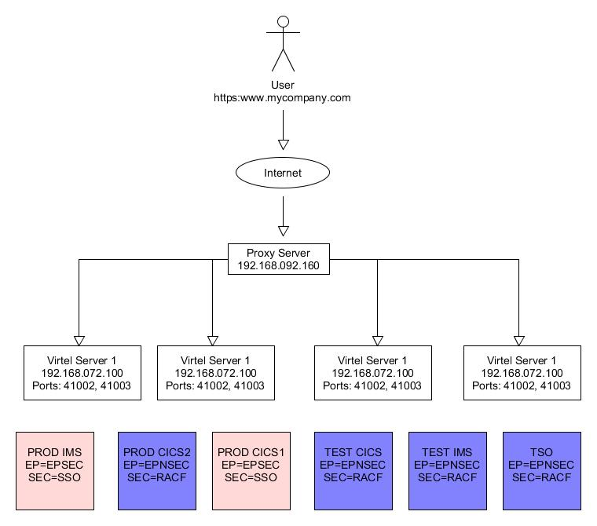

2017/01

In this newsletter we discuss how to protect access to business assets
using Virtel rules. In this scenario with have two types of business
assets or applications. The first type is the production assets which
are protected by LDAP and use SSO to facilitate security and automatic
logon without the user having to specify a userid and password. The
other type of business asset is a standard application, like TSO or
CICS, which requires the user to enter a userid and password when the
application is accessed. LDAP and SSO are not discussed in this
newsletter. There may be alternatives to this SSO setup but for our
scenario we are assuming two types of asset – secure (requiring no
application logon) and insecure (application logon required). The
scenario utilizes a proxy server to load balance across the Virtel
instances.

|image0|

From a Virtel perspective it has been decided that secure assets are
associated with port 41002, and non-secure through port 41003. Access to
the assets should only be through the proxy server using a secure port,
in our case the standard SSL port 443. Our goal is to protect the assets
from being accessed internal, or external, using the assigned Virtel IP
and port addresses. For example, John in accounts should be able to
access PROD IMS, but Peter, who works offsite at home, but still has
access via a VPN to the company, shouldn’t. In this simplistic scenario
anyone could in theory, access any one of the Virtel instances through
their internal IP address – 192.168.07x.10x:4100x and attempt to logon.
What is required is means to guarantee that access to any of the assets
should only be through the proxy server and not any other IP address.

Using Virtel Rules we can compare the calling IP address and if it
doesn’t match with the rule then the user will be re-directed to another
Virtel entry point. To implement this protection we use the following
ARBO statements for each line, 41002 and 41003:-

RULE ID=R0000100,

RULESET=C-HTTP, **< Our Line** 41002

STATUS=ACTIVE,

DESC='HTTP access (Test calling address)',

ENTRY=EPSEC, **< Associated Entry point**

IPADDR=(EQUAL,192.168.092.160), **< IP address of Proxy**

NETMASK=255.255.255.255

\*

RULE ID=R0000199,

RULESET=C-HTTP, **< Our Line 41002**

STATUS=ACTIVE,

DESC='HTTP access (Calling IP address not valid)',

ENTRY=EPREJECT

\*

RULE ID=R0000200,

RULESET=R-HTTP, **< Our Line 41003**

STATUS=ACTIVE,

DESC='HTTP access (Test calling address)',

ENTRY=EPSEC, **< Associated Entry point**

IPADDR=(EQUAL,192.168.092.160), **< IP address of Proxy**

NETMASK=255.255.255.255

\*

RULE ID=R0000299,

RULESET=R-HTTP, **< Our Line 41003**

STATUS=ACTIVE,

DESC='HTTP access (Calling IP address not valid)',

ENTRY=EPREJECT

ENTRY ID=EPREJECT,

DESC='Entry point for unauthorized HTTP users',

TRANSACT=REJ,

TIMEOUT=0720,

ACTION=0,

EMUL=HTML,

SIGNON=VIR0020H,

MENU=VIR0021A,

EXTCOLOR=X

\*

TRANSACT ID=REJ-00,

NAME=EPREJECT,

DESC="Default directory = entry point name",

APPL=CLI-DIR, **< User template directory**

TYPE=4,

TERMINAL=CLLOC,

STARTUP=2,

SECURITY=0

So what is happening here? When a user attempts to establish a session
Virtel will match the users calling IP address against the IPADDR in
rule R0000x00. If it matches then they will be able to access the entry
point defined in the rule – in this case EPSEC or EPNSEC. For line 41002
this Entry Point will contain a list of the W2H applications using SSO.
For line 41003, using Entry Point EPNSEC, this will contain a list of
W2H transactions which use standard RACF protection.

Now, if the calling IP addressed is not matched, the RULE fails and the
next rule in the ruleset is tested, in this case rule R0000x99. This is
a catch all rule. Any user falling into this rule will be directed to
entry point EPREJECT. The Entry Point EPREJECT only has one transaction,
its default transaction, and this will invoke the template page
EPREJECT.HTM.

To protect the business assets the calling IP address can only be that
of the proxy server - 192.168.092.160. Any other calling IP address will
be rejected by the Virtel ruleset. By default, the ruleset associated
with a line is normally the internal name of the line – C-HTTP for
example. How the rejected session is handled is up to the user. In the
following example, the default template EPREJECT.HTM, which is
associated with the entry point EPREJECT, looks like this:-

<!DOCTYPE HTML PUBLIC "-//W3C//DTD HTML 4.01 Transitional//EN"
"http://www.w3.org/TR/html4/loose.dtd">

<!--VIRTEL start="{{{" end="}}}" -->

<html>

</html>

This template must exist in the CLI-DIR directory as this is where the
Entry Point EPREJECT expects to find them. When the template is served
it will display the companies “public” web site.

To upload the ARBO statements to your ARBO use the following JCL:-

//\*

// SET LOAD=SPTHOLT.VIRT456.LOADLIB

// SET ARBO=SP000.SPVIREH0.ARBO1A

//\*

//DELETE EXEC PGM=VIRCONF,PARM='LOAD,NOREPL',REGION=2M

//STEPLIB DD DSN=&LOAD,DISP=SHR

//SYSPRINT DD SYSOUT=\*

//SYSUDUMP DD SYSOUT=\*

//VIRARBO DD DSN=&ARBO,DISP=SHR

//SYSIN DD \*

DELETE TYPE=RULE,ID=R0000100 Delete rule

DELETE TYPE=RULE,ID=R0000199 Delete rule

DELETE TYPE=RULE,ID=R0000200 Delete rule

DELETE TYPE=RULE,ID=R0000299 Delete rule

DELETE TYPE=ENTRY,ID=EPREJECT Entry point

DELETE TYPE=TRANSACT,ID=REJ-00 Delete transaction

\*

//CONFIG EXEC PGM=VIRCONF,PARM='LOAD,NOREPL',REGION=2M

//STEPLIB DD DSN=&LOAD,DISP=SHR

//SYSPRINT DD SYSOUT=\*

//SYSUDUMP DD SYSOUT=\*

//VIRARBO DD DSN=&ARBO,DISP=SHR

//SYSIN DD DSN=SPTHOLT.VIRTEL.CNTL(RULES),DISP=SHR

