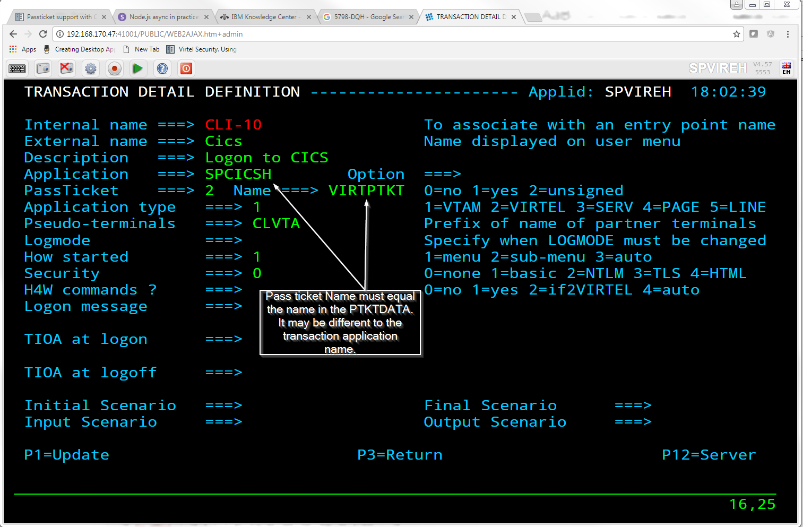

.. _#_tn201703:

Passticket support with CA Top Secret
=====================================

Supporting pass tickets with CA Top Secret requires the following
definitions.

1. Add the PTKTDATA class to the RDT

TSS ADDTO(RDT) RESCLASS(PTKTDATA) RESCODE(n) ACLST(ALL,READ,UPDATE)
MAXLEN(37)

Note: RESCODE should be in the range 101 to 13F to ensure that PTKTDATA
is a prefixed resource class.

2. Add the ownership of the PassTicket resource (IRRPTAUTH)

TSS ADDTO(owner) PTKTDATA(IRRPTAUTH)

Note: The resource can be one of the following where resource name is the Application Name defined in the NDT and ‘userid’ is the Userid:

PTKTDATA(IRRPTAUTH.name.)

or

PTKTDATA(IRRPTAUTH.name.userid)

Note: The name must equal the name in the Passticket field of the Virtel transaction. This can be different to the ACB or Virtel Application name.

|image0|

3. Define the application session key

TSS ADDTO(NDT) PSTKAPPL(name) SESSKEY(0123456789ABCDEF) SIGNMULTI

4. Permit access to the PassTicket resource

TSS PERMIT(stc‐userid) PTKTDATA(IRRPTAUTH.name) ACCESS(UPDATE)

Note: The stc-userid is the ACID of any started task that requires access to the PassTicket resource such as CA LDAP.

Reference: `CA Top Secret for z/OS <https://www.ca.com/us/services-support/ca-support/ca-support-online/support-by-product/ca-top-secret-for-zos.html>`__

