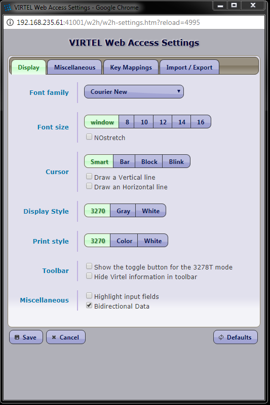

.. _#_tn201706:

What’s new in Virtel 4.57 (July 2017)
=====================================

The following newsletter itemises the updates that can be found in Virtel Release 4.57.

Migration considerations
------------------------

Option mode and Compatibility mode
~~~~~~~~~~~~~~~~~~~~~~~~~~~~~~~~~~

As of Virtel 4.56 two modes of customisation are available, the ‘option
mode’ and the older ‘compatibility’ mode. The new ‘option’ mode enables better granularity in setting options and customization. As of Virtel V4.56 this is the preferred mode for Virtel customisation. By default, neither mode is active. Certain steps must be followed to activate either "compatibility" or "option" mode. As distributed Virtel will use programmatically set defaults and search for customization elements from the W2H directories. See the default transactions shipped with Virtel for custom.js, custom.css, w2hparm.js elements.  

The previous “Compatibility “ mode is still supported. But requires users to re-assemble their TCTs with the ‘Option-default-compatibility’ keyword in the TCT. This will maintain previous customised behaviour for the custom.css, w2hparm.js and custom.js files.

*TCT keyword for compatibility mode*

::
 
 	HTSETn = (OPTION-DEFAULT-COMPATIBILITY) /* n = 1-4 */

The new “option” mode enables customization at a transaction level as well as the more global entry point or line level. The logic of using CLI-DIR to store customised versions of custom.js, w2hparm.js, custom.css etc. in the CLI-DIR has been deprecated as of release V4.56. To operate in "option mode" requires changes to the ARBO file with the additional of two new transactions to support the "option" pathname. See the ARBOLOAD (Option=YES) or ARBOMIGR in the SAMPLIB file for details on how to include these new transactions. 

Customers are advised to migrate old customisation elements to the new
“option” mode enabling those elements to be located through the use of
the /option/ pathname. Two new transactions have been added to support
the /option/ pathname. See the :ref:`Virtel Users Guide, Customizing Virtel using the Option mode. <#_V457UG_customizing_with_option>`.

Further details can also be found in the Virtel technical newsletter :ref:`TN2016-11 Customising Virtel in V4.56<#_tn201611>`.

.. danger:: Customers who have customized elements in the W2H-DIR stand the risks of having these overwritten by subsequent maintenance and Virtel release updates.

Presentation
------------

**5453 Add CSS rules for old versions of IE8**

Added CSS rules for older versions of IE where the logo's display codes
for the new graphics were not displayed with the correct size.

**5469 Customizable HELP solution**

Help panels can now be customized using the /option/pathToHelp key of
“option customisation” mode.

**5481, 5482 New “BiDirectional” Option**

The new BiDirectional option will now trigger the CSS unicodeBidi =
"bidi-override" style on the Virtel “printReady” HTML Div template. This
options enables user to have control on how text alignment should be
set. Right of the page or Left of the Page. 

|image0|

Figure 1 - BiDirectional Data Option

**5490 Disable Long Poll**

To support the i4web AS/400 interface a new option to disable “Long Poll” has been implemented. This can be defined in w2hparm.js or through a setting in the miscellaneous settings panel

**5501 Arabic support - Reverse screen display option.**

The “Alt-ENTER key” combination can globally switch the screen display
from 'left to right' to 'right to left' and return. This is the way some
countries support 3270 Arabic.

Note:-

-  The Alt-ENTER is active only if the 'Bidirectional data' Display
   option is set.

-  The Alt-ENTER key may be unset by going to w2h key mappings options.

-  The w2hparm.mirrorMode may be set in a w2hparm.js file to preset the
   option:-

::
 
	w2hparm.mirrorMode = true

|image3|

Figure 2 - Arabic Support using Right to Left presentation

**5504 continuing="YES" attribute to indicate a split input field**

Adds an attribute 'continuing="YES"' to a W2H SPAN for a 3270 field when
it is the continuation of a field. For example when the 3270 continues
after the end of a line and/or the screen.

Example:-

::
 
	<pre>
` for further information.

**5439 Mixed Case Passwords by VIRTCT parameter.**

**5444 RACROUTE,TOPS Mixed Case Passwords.**

This extends 4196 RACF mixed-case passwords to allow specifying, through
a VIRTCT parameter, that passwords should not be uppercased before
SIGNON. A new sub-parameter 'MIXEDCASE' of the TCT SECUR= parameter has
been added. This update also transposes update 4196 RACF mixed-case
passwords to Top Secret to allow automatic detection of mixed case
support.

Example:-

::
 
	SECUR=(RACROUTE,MIXEDCASE),

New Messages:-

::
 
	VIR08x3I MIXED-CASE PASSWORD SUPPORT IS ACTIVE

Indicates MIXEDCASE option has been set by user. X = 4 for Top Secret
and 6 for RACF.

**5443 IBM1160 and IBM0838 character set table for Thailand**

New external modules IBM0838 and IBM1160. IBM1160 contains the euro sign
where IBM0838 does not.

Example in the TCT code:-

::
 
	CHARSET=(IBM0838,IBM1160), * load Thai Charsets      *
	DEFUTF8=IBM1160,           * default to Thai Charset *

**5452 IBM0803 and IBM4899 OLDCODE character set for Hebrew.**

Two new external modules IBM0803 and IBM4899. IBM0803 is the “Hebrew Set
A old code” and IBM4899 is the “Hebrew Set A old code maximal set
including euro and new sheqel”.

**5459 Batch transfer of TRSF files**

This update allows exporting/importing of raw TRSF data files in batch.
See the section 'Virtel Batch – exporting/importing TRSF files<Virtel457UG>' in the
Virtel Users Guide.

**5496 Add Cucumber diagnostic support**

To aid in unit testing and diagnosis the Cucumber Diagnostic Tool is now
supported by Virtel.

**5498 Licence warning feature.**

A new licence warning feature has been added so that customers can be
made aware in advanced when the Virtel licence is about to expire. The
new TCT option “WARNING=” determines the number of days prior to issuing
a licence warning message.

Example:-

::
 

		* WARNING IF EXPIRE WITHIN 7 DAYS (DEFAULT)
				COMPANY='SYSPERTEC COMMUNICATION VIRTEL 5 MVS', *    X
				ADDR1='196 BUREAUX DE LA COLLINE',      *            X
				ADDR2='92213 SAINT-CLOUD CEDEX FRANCE', *            X 
				LICENCE='VIRTEL ... ', LICENCE NUMBER   *            X
				EXPIRE=(2017,05,05),                                 X
				WARNING=7,                                           X

The following messages will appear in the Virtel log:-

::
 
 00.00.01 JOB01373 ---- FRIDAY, 05 MAY 2017 ----	
 00.00.01 JOB01373 VIR0900I LICENCE VIRTEL MINITEL 001099900 (2017 - 05 - 05)
 00.00.01 JOB01373 VIR0901W LICENCE IS ABOUT TO EXPIRE

**5505 Add addition support to VIR0021W USS MSGTAB10 processor.**

This routine now supports system symbolics.

**5510 Provide Support for French Canadian translate tables.**

A new external module IBM0276 has been added to support French Canadian
translate tables.

Example in the TCT code the following:-

::
 
 CHARSET=IBM0276, load French Canadian table   *
 DEFUTF8=IBM0276, default translate table      *

Installation and Sample members
-------------------------------

**5441 Update Virtel procedure in SAMPLIB**

To accommodate the F VIRTEL,UNLOAD command a dummy SYSPUNCH statement has
been added to the distributed Virtel procedure member VIRTELS in the
SAMPLIB library.

**5454 Update installation member to 4.56**

Update installation modules to reflect Virtel 4.56

**5457 Update VSE Installation jobs**

Update VSE installation job s for z/VSE 6.2

**5468 Update ARBOMIGR and ARBOLOAD SAMPLIB members**

Update the members to support the Virtel 4.57 enhancements.

**5473 Add option transaction to ARBOLOAD and ARBOMIGR**

The transactions to support the /option/ pathname had been added.

**5491 Print scenario members added to the SCE-DIR directory.**

The SCENFPCL, SCENFPDF and SCENPPDF scenarios have been added to the
scenario directory as .390 members.

**5502 Increase space allocation in SAMPLIB member $alocdsu.**

Primary space allocation has been increased to avoid E37 abends during
installation.

Virtel Web Administration
-------------------------

**5442 Synchronise ADMINVWM to enable upgrade to V4.5x**

Update the ADMINVSC.VSC source so that it is compatible with the
corresponding ADMVWM.JS module.

**5464 DDI and macro enhancements**

This fix implements several new macro and DDI features. It incorporates
the following changes:-

-  A “Refresh” button has been added to the Global panel.

-  Fix a bug in removing records.

-  Improved keyboard mapping graphics.

**5484 Hotkey support for DDI macros**

Hotkey key mapping support for VIRTEL DDI macros.

**5485 Key mapping support for ALT+numeric.**

Enhancement of the hotkey to take a digit into account (requirement of
TOMY).

Update of the hotkey help messages accordingly.

**5487 DDI refresh macro enhancement**

To improve the synchronicity of macros stored within a user’s local
storage and those maintained on the mainframe. The following options are
now available in the w2hparm.js member:-

::
 
 w2hparm.useVirtelMacros = {“macrosAutoRefresh”:”*value”}*

Where value can be:-

::
 
 true | false[default] | “never” | “once” | “daily” | “session”

**5490 Disable Long Poll**

To support the i4web AS/400 interface a new option to disable “Long
Poll” has been implemented. This can be defined in w2hparm.js or through
a setting in the miscellaneous settings panel

Scenario Language
-----------------

**5434 Cursor position changed to an input field.**

A field colour is incorrectly changed from white to red. This is due to
the WEB2SUB.HTML page containing a {{{FIELD-WITH-CURSOR}}} statement.
Because the cursor is not in an input field, this triggers the creation
of a dummy input field to allow cursor positioning in classic pages with
a visible FORM.

A new “NOFIELD” option has been added as a fieldname to
{{{DEFAULT-FIELD-WITH-CURSOR "*fieldname*"}}} statement. This prevents
creation of a dummy input field.

**5458 COPY$ TO-SYSTEM NAME-OF RELAY**

Allows an IDENTIFICATION scenario to override the name of the relay
chosen by Virtel.

For example:-

::
 
 	COPY$ VARIABLE-TO-SYSTEM,VAR='VAR1',FIELD=(NAME-OF,RELAY)

An alternative is to use:-

::
 
	 (VALUE-OF,ROUTING-PARAMETER)

**5475 COPY$ NAME-OF TERMINAL**

Implement a new variant of COPY$:

::
 
 	COPY$ SYSTEM-TO-VARIABLE,VAR='TERMINAL', *
	FIELD=(NAME-OF,TERMINAL)

This acquires either the DNS name or IP Address of a terminal using a
DNS look up facility.

NOTE: For this to work, it is necessary to specify a value to the 3rd
sub-parameter of the TCP1= (or TCP2=) parameter in the VIRTCT. (Any
value may be specified). Not yet implemented in VSE.

Example:

::
 
 TCP1=(TCPIP,,DNS,65535),

During Virtel startup, the following messages will appear:

::
 
 	+VIRDNS1W TKP1 DNS SUBTASK DNS STARTING VIRDNS1
	+VIRDNS2W TKP1 DNS SUBTASK VIRDNS1 STARTED

Sample scenario:

::
 
	COPY$ SYSTEM-TO-VARIABLE,VAR='TERMINAL',                  *
	FIELD=(NAME-OF,TERMINAL)
	ERROR$ 0,'TERMINAL: ','*TERMINAL'

Sample output:

::
 
  	VIRHT51I DEMOHTTP CONNECTING HTLOC005 TO 192.168.092.058:53786
	TERMINAL: w8-jmsaby.syspertec.com

Two new modules are added to Virtel, VIRDNS1 and VIRDNS2. These support
an asynchronous use of the IBM GETNAMEINFO EZASMI API.

**5486 NAME-OF GROUP support**

Scenario NAME-OF construct now supports the GROUP option.

Example:-

::
 
 	{{{NAME-OF (LINE-EXTERNAL)}}}             *
	{{{NAME-OF (USER)}}}                      *
	{{{NAME-OF (GROUP)}}}                     *
	{{{NAME-OF (USER-IP-ADDRESS)}}}           *

Will produce:-

::
 
	HTTP-W2H\* SPTSABY\* SPGPTECH\* 192.168.092.091\*

Bug fixes
---------

- 5435 Global variable conflict between.
- 5436 Fix problem with OCCURS-UNLIMITED when analysing JSON objects.
- 5437 VSE - corrects TCT command display of BFVSAM and BUFDATA.
- 5438 Correct TCT command display and multi-line WTO
- 5440 ASRA abend entering Network Management sub-application (PA2 + PF6)
- 5445 TRACE SCENARIO statement produces spurious character in WTO
- 5446 url HOTSPOT in wrong position for multi-line output
- 5448 Error if password contains a non-alphanumeric character.
- 5448a Correct IE8 display. Potential blocking error.
- 5449 Macro check box not rendered correctly.
- 5450 Corrects updt5447. German translation was missing.
- 5451 Re-instate w2hparm.js default behaviour.
- 5455 Correct ADMIN HTML Rules display.
- 5460 Compatibility fix for settings panel.
- 5461 Avoid blank settings page with master/slave settings in screen capture.
- 5462 Files larger than 30K are incorrectly retrieved from CACHE.
- 5463 Correct processing of HTTP pseudo terminal with an @EIB.
- 5465 IE8 corrections for DDI and macro support.
- 5466 Correct macro API which blocked “Save” button.
- 5464 VIRSV Improve initialisation messages.
- 5470 Correct first line of screen when using logmode SNX32705
- 5471 Fix D23-002 ABEND due to incorrect URL
- 5472 Correct time column alignment in DDI display.
- 5478 Fix C03 ABEND on shutdown.
- 5479 Fix DDI “delete” bug.
- 5488 Fix DDI “save” bug.
- 5489 Corrections to the DDI macro interface.
- 5492 Support % character in HTML Signon password field.
- 5493 Fix ABEND878-10 ABEND.
- 5494 Correct ICON protocol. Issues incorrect NACK in some situations.
- 5495 Correct AutoPrint feature. Problem with printing multiple pages.
- 5497 Correct MIME error after upload.
- 5499 Correct CLONE= parameter to support either 1 or 2 characters.
- 5500 Fix bug in VIR0021W, USS MSGTAB10 processor.
- 5505 Correct Loop when ATTN key is pressed.
- 5506 Fix clean-up processing in VIR0021W. Stop LOAD failure.

.. |image1| image:: images/media/image2.png
   :width: 6.26806in
   :height: 3.78125in
.. |image3| image:: images/media/image3.png   