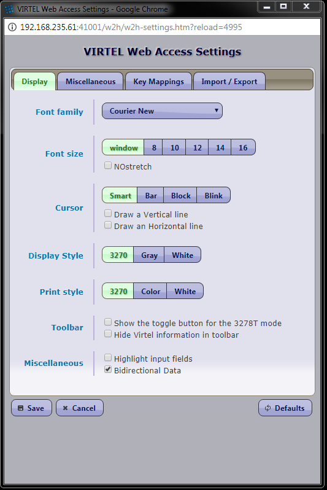
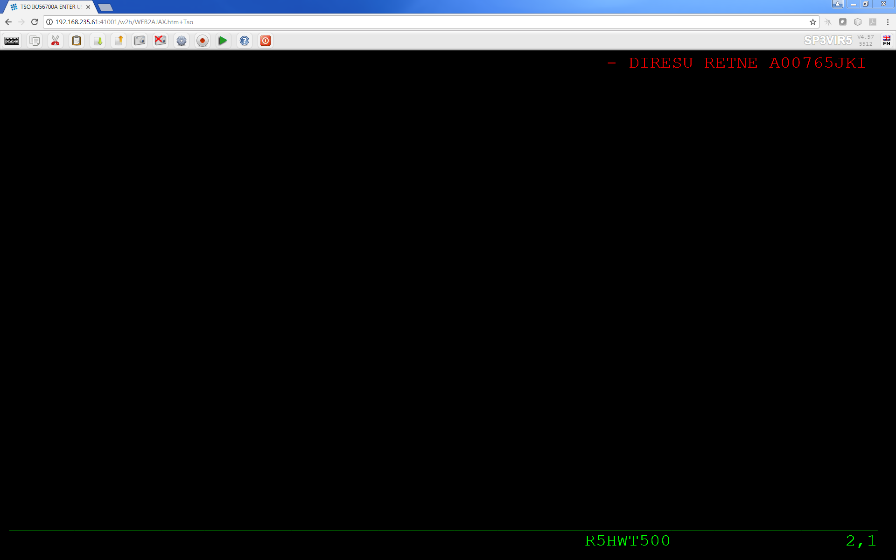

.. _tn201902:

What’s new in Virtel 4.59 (August 2019) Beta Release
=========================================================

The following newsletter summaries the new features and maintenance updates that can be found in Virtel Release 4.59. 

Installation changes
--------------------

Install JCL
^^^^^^^^^^^

**5725 Correct JCl for Codepage IBM0274**

- Include code page in installation process.

**5735 Add VIR0TNET**

- Include VIR0TNET module in installation.

SAMPLIB changes
^^^^^^^^^^^^^^^

**5728 Correct Virplex JCL**

- Sample JCL changed to make VIRHTML shareable

Migration considerations
------------------------

V4.59 None. 

There have been no changes to the ARBO which would require migration from V4.58 or V4.57. Customers who are migrating from older releases should review the 
“What’s new in Virtel V4.XX” newsletters to determine applicable migration actions for new distributed features. 
Depending on requirements not all actions may be applicable. These newsletters are available online at https://virtel.readthedocs.io/en/latest/ 

Fixes, changes and new features
-------------------------------

Presentation
^^^^^^^^^^^^

**5705 Minor presentation corrections**

- Correct problem in processing "global-settings" of w2hparm.js
- Correct problem in centrailzed backup.
- Correct problem of SESSKEY= synchronization

New help pages have been added for the Version 2 of VWH settings.

**5707 Correct Keybaord Macro settings**

- Macro keyboard (Hotkey Mapping) now correctly trigger assigned macros

**5708 Capture windows opens in background**

- Window foreground/background bug with IE11 in capture processing 

**5716 Centralized settings and Hotkey improvements**

- Improved centralized parameter support. Prevent blocking in certain conditions.

- HotKey modification. Userid must be present.

- Centralized processing now correctly tests security context.

**5719 Correct bug in DECLARE$**

- Fix single quote issue with DECLARE$ instruction

**5724 Password Bug**

- In security type=4 (HTML) some non-alphnumeric characters where incorrectly translated.

**5726 Userparm modification**

- Userparm updates are no longer tied to security context.

**5729 Long Poll Syncfronization**

- Correct code to avoid potential out-of-sync long poll response. Cause block of session

**5730 ASRA Abend in USERPARM**

- Avoid ASRA Abend when processing idential user parm updates for the same user.

**5733 API Enhancements**

- New methods added.

::
      getAjaxSession
      getVirtelSession
      removeOnLeaveDisconnect
      set_after_responseHandle
      set_after_standardInit

**5740 Error in T{{{PARAMETERS-CODE}}} tag**

The {{{PARAMETERS-CODE}}} tage was being generated with null.

**5741 Minor Presentation Enhancments**

- Improved compression and graphical rendering.
- Correct AJAX code in locating capability code.

**5744 New Structured fiedl to delete variable**

- Structured field FAE8 has been introduced. This allows deleting a Virtel variable before adding a new value.

**5746 Erroneous characters displayed after TSO sigon on with script**

Transaltion process modified to correct display. Old "translation" technique was being used. 

**5747 Separator Support in Appmenu**

- Separators can now be added to the APPLIST menu display. 

**5748 MAXIMUM-PASSWORD-LENGTH**

- The maximum length of a passport can now be dynamically set through tag or scenario language.

**5749 Initialize JavaScript variables correctly**

- Correct the way JavaScript variables are initialized. Bug that led to potential blocking.

**5750 Correct Tool bar display**

- When using transaction Security=4 the tool bar didn't display.  

**5751 Terminal lock**

- Correct potential terminal lock condition in IE6 when sending duplicate URLs.

**5755 NTLM Enhancement**

- Problem with NTLM security and IE11. Prevent loss of data.

.. raw:: latex

    \newpage 

Base Components
^^^^^^^^^^^^^^^

**5709 Batch Process modifications**

- Batch load fails for file names longer than 32 bytes.

**5710 Batch load produces erroneous RC 8**

- Batch processing not accounting for continuation statements

**5711 Virtel DNS Error reporting**

- DNS processour will issue more informative messages / return codes. 

**5714 .RAW support enhancements**

- Additional URL keyword removes conflict of query parameters and content-disposition.

**5718 Telnet Support**

- Virtel can now act as a telnet client (POC Only.)

**5720 Virplex Enhancement**

- Improve buffer management. Segmentation not handled correctly.

**5721 Message VIR0035E Enhancement**

- Message VIR0035E now checks IGNLU state. Message is suppressed if line is disabled.

**5732 Storage corruption**

- Restrict WBINDOK to NATIVE line support only. Can cause Abend 0C1/0C4

**5723 Virplex hang**

- PU processing improved to avoid reuse of freed PU. Cause Virtel hang.

**5727 Virplex Req./Resp conflict**

- Correct bug in the processing trucated HTTP requests.

**5734 Error in remote /READ processing**

- Correct processing of /READ requests after receiving errors.

**5738 Correct HTMINI TCT parameter**

- Fix bug in TCT processing for HTMINI keyword. Now works with SET-LOCAL-OPTION statement. 

**5739 Virplex Abend S0C4**

- Incorrect length calculated when message was larger than default buffer size.

**5743 Subtask Process**

- Subtask now return a condition code if they abend. This casues Virtel to end with a condition code greater than zero.

**5745 ABEND0F9 in VIR0006A**

- EOJ macro doesn't free storage area gotten by DEBUT macro. EOJ macro deprecated.

**5752 Improved VSAM processing for USERPARM**

- Improve the logic behind VSAM processing of USERPARM requests.

**5754 Caching of USERPARM requests**

- USERPARM requests are now the subject of caching. Improved performance logic to remove redundant I/O.

**5756 Support fot NETID in logon string**

- VIR0021W and VIR0021U can now support a NETID. NIBNET flag correctly set.

**5757 Message VIRU1221**

- This message can now be suppressed if SILENCE=YES is set.

.. raw:: latex

    \newpage 

Virtel Web Administration
^^^^^^^^^^^^^^^^^^^^^^^^^

**5742 Improved Drag and Drop**

- New Drag and Drop function avaoids upload hangs.

.. raw:: latex

    \newpage 

Scenario Language
^^^^^^^^^^^^^^^^^

**5703 DECLARE$ on DRK fields** 

- Enhance the DECLARE$ processing correctly process attribute bytes. Problem was initially related to the "Dark" attribute.

**5712 Correct COPY$ in large scenarios** 

- Scenario frooze after a large number of updates. Problem fixed. 

**5713 Improved addressability**

- New literal pool management and 4 byte branch index allow for larger scenarios.

**5717 enhancement to MOVTAG$ instruction**

- Correct literal pool management to prevent negative index. MOVTAG$ now uses indirection.

**5722 Enhancement to DEBUG$**

- Add FOREACH$ and ENFFOR$ instructions to DEBUG$ instruction set.

**5731 NUMBER type error**

- NUMBER type processes comma as part of value.

**5736 Correct FOR-EACH processing**

- FOR-EACH doesn't handle WHEN-NOT-BLANK correctly.

**5737 PARAMETERS-CODE not generated**

- The {{{PARAMETERS-CODE}}} tag is not generated when sigon is through SSO and Passticket.

**5758 GENERATE-HTML fix**

- GENERATE-HTML no longer generates an End-Of-line.

.. raw:: latex

    \newpage 

Other Enhancements
^^^^^^^^^^^^^^^^^^

**5706 Cucumber Enhancement **

- Chunk requests now hnoured.

**5759 TWT harmonisation**

- TBT Web Access changes are merged with the W2H code to provide single base code.

Updates and maintenance
-----------------------

A full list of maintenance updates can be found in Appendix A.

Appendix A
----------

**Maintenance list**

- 5703 DECLARE$ on DRK fields 
- 5704 VIR0021W causes U0010 ABEND
- 5705 Correct settings issue and other problems
- 5706 chunked request sent by Cucumber
- 5707 Macro Keyboard settings not working plus other minor bugs
- 5708 In IE11 Capture screen opened in background
- 5709 Batch load fails for files with name longer than 32 bytes
- 5710 Batch load may give an erroneous RC 8 for a large file
- 5711 VIRDNSx will now WTO error return codes
- 5712 Large scenario may loose access to its pool of literals
- 5713 Change scenario instructions to use a local literal pool and remove limits on addressability
- 5714 P= for .RAW support
- 5715 Changement du numéro de version
- 5716 Various corrections from SVN
- 5717 Correction to 5713 for DECLARE$
- 5718 Basic support for external Telnet server
- 5719 Declare$ : problem with single quotes
- 5720 VIRPLEX VIRQLK6E VRTSSRV1 Protocol Error
- 5721 Avoid VIR0035E for IGNLU= lines
- 5722 DEBUG$ ignores FOREACH$
- 5723 VIRPLEX VIR0016W ABEND ASRA
- 5724 Security type 4 - possible error in translating exclamation mark character
- 5725 Correct Installation JCL for Code Page IBM0274
- 5726 Allow user parms update without signon status
- 5727 VIRPLEX - response request conflict
- 5728 Update VIRPLEX installation jobs.
- 5729 Avoid out-of-sync LP response.
- 5730 ASRA Abend in VIR0001:USERPARMS
- 5731 JSON - comma considered part of NUMBER type
- 5732 Possible Storage corruption
- 5733 Update to vwaAPI
- 5734 Avoid restarting a remote /READ  after an error
- 5735 Update installation for Virtel V4.59
- 5736 WHEN-NON-BLANK not working in a FOR-EACH
- 5737 {{{ PARAMETERS-CODE }}} is not generated when signing thru SSO and PASS-TICKET
- 5738 allow HTMINI to function with HTMINI=(1,1) in VIRTCT
- 5739 VIRPLEX - correct truncated response length
- 5740 Do not generate a null {{{ PARAMETERS-CODE }}}
- 5741 Virtel 4.58/9 SVN Updates
- 5742 Possible VSAM 0808 or 0860 errors following an update conflict 0814 error
- 5743 Error return code if a subtask abends
- 5744 FAE8 structured field to delete a Virtel variable
- 5745 Correct VIR0006A. Missing FREEMAIN causes ABEND0F9
- 5746 Strange characters after TSO signon with a script
- 5747 Allow separators in appmenu
- 5748 VALUE-OF MAXIMUM-PASSWORD-LENGTH
- 5749 Initialize JavaScript variables correctly
- 5750 Correct Toolbar display when using SEC=4
- 5751 Terminal locked after one request is ignored
- 5752 USERPARMS: improve performance by avoiding unnecessary updates to TRSF file
- 5753 SVN 4958-4962
- 5754 USERPARMS: more caching
- 5755 NTLM Content-Length: 0 messages support
- 5756 Support NETID for VIR0021W and VIR0021U
- 5757 No VIRU122I message if silence=yes
- 5758 Incorrect EOL by GENERATE-HTML

.. |image1| image:: images/media/image2.png
   :width: 6.26806in
   :height: 3.78125in
