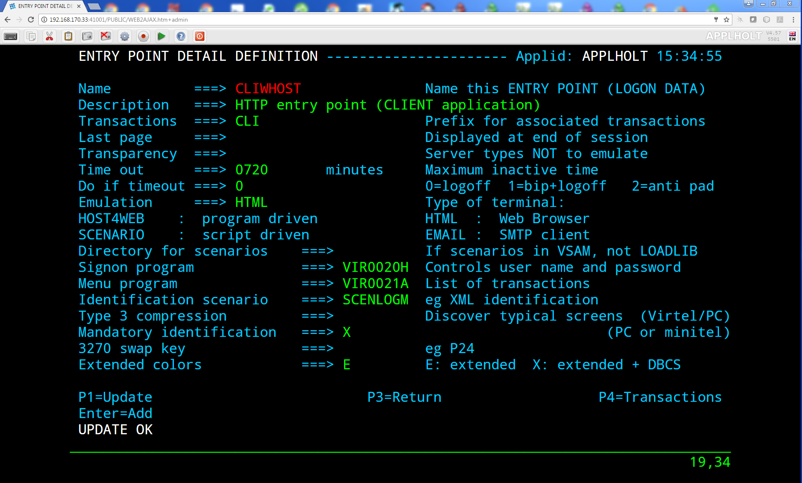
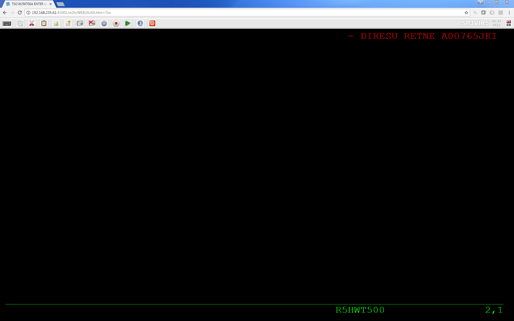

.. _tn201903:

Maintaining centralized macros with batch
=========================================

The following newsletter documents how to maintain centralized macros using a batch process. The process uses the "CURL" program, a browser client, to interface with Virtel and to upload the macros from a PC. The benefits of using a batch process is macros can be managed on a PC and uploaded to the relevant Virtel directories as a batch process rather than the default "Drag and Drop".

The following steps are implemented to support this process. A CURL request is made to Virtel to obtain they key for either the GROUP id, USER id or the GLOBAL DDI directory. The key is then in a subsequent HTTP POST to upload a macros.json file to that directory. This is effectively what occurs when you perform the same process using the standard Drag and Drop technique.

The process is driven through batch scripts which are generated and downloaded from the mainframe following a extract from the RACF database. The extract provides the GROUP and USERID relationship required by the upload process. 

Pre-requisites
--------------

Virtel Setup
~~~~~~~~~~~~

You must be a Virtel administration to perform this procedure and you must have configured Virtel to use centralized DDI. For example, on the default client line, 41002, the macro list icon should be a "Blue" triangle. If it is "Green", then your DDI setup is not correctly configured. See the 'Virtel Users Guide' for further details on setting up the "centralized" macro environment. Alternatively, information can be found in technical newsletter TN201704.  

There should also be a local macro facility available so as to be able to modify existing macros or generate new ones. It is suggested that the Admin. Portal, port 41001 by default, be used for this purpose. 

Macro Sub-Directory Organization
~~~~~~~~~~~~~~~~~~~~~~~~~~~~~~~~

You should also have the relevant macros.json file for each of the group/user related directories that you wish to build. The GROUP and USERID names must be valid RACF constructs. The 'ddiMacro.bat' script will upload a macros.json file from the associated PC directories as identified in the output from the LISTUSRS JCL. See "Running LISTUSRS for further details. The associated directories can be any arbitrary name but must exist within the c:\\virtel\\macros\\ddiBatch directory as sub-directories and each sub-directory must contain a relevant macros.json file.

Either organize sub-directories by user or type. For example, a type structure would look something like this:-

::

    ./global
        macros.json
    ./adminGroup
        macros.json
    ./adminUser
        macros.json
    ./userGroup1
        macros.json
    ./userGroup2
        macros.json
    ./users1
        macros.json
    ./users2
        macros.json

The advantage of a "type" structure is that multiple users can upload common files. A user sub-directory structure would look like :-

::

    ./global
        macros.json
    ./RACFGRP
        macros.json
    ./ADM0010
        macros.json
    ./ADM0020
        macros.json
    ./SYSPGRP
        macros.json
    ./SPTHOLT
        macros.json
    ./SPTBOWL
        macros.json
    ./USRGRP
        macros.json
    ./USRPETE
        macros.json
    ./USRMARY
        macros.json        

In this structure type, each user has there own "user" macro.json.

Macro.json files
~~~~~~~~~~~~~~~~

A macro.json file is a JSON object that represents the macros available to a user, group or global macro entity within Virtel. Here is an example:-

::

    {"macros":[{"name":"SDSF","rev":2,"def":["move(435)","ENTER",{"txt":"=M"},"ErEof","ENTER",{"txt":"5"},"ENTER"]}],"desc":"global macros","fmt":1}           

Creating these macros is best done through Virtel. Use a local macro environment to create your macros. For example, from within a TSO or a CICS application within the Administration portal. After creating the macros, export them to a file as a JSON structure. Copy the file to the relevant batch sub-directory. In all cases the file must be called macros.json. Alternatively, get you users to create the own "macros.json", and ship them to you.  

.. note:: You cannot export macros from a centralized DDI macro environment.  

Installation
------------
All the modules and scripts to implement this package are available as a zip file on the Syspertec FTP web server.

Unzip package
~~~~~~~~~~~~~

Download the zip package "ddimacros.zip" from the Virtel ftp website and unzip into a directory on your PC. In the following examples the zip file has been unzip into a directory called 'c:\\virtel\\macros'. After unzipping the file you should find a batch sub-directory which will have the the following directory structure and files.

::

    \global
        macros.json
    \sysgroup
        macros.json
    \sysprog
        macros.json
    \user
        macros.json
    \usergroup
        macros.json
    curl.exe 
    ddiMacro.bat
    listuser.rexx 
    listusr1.jcl

Upload files
~~~~~~~~~~~~

Upload files LISTUSER.rexx and LISTUSRS.jcl to your VIRTnnn.CNTL as members LISTUSER and LISTUSRS.

Running LISTUSRS  
~~~~~~~~~~~~~~~~

Modify the LISTUSRS member to your site standards and run this JCL to list RACF groups and associated users. See the comments in the JCL for information on how to set the correct arguments. Running with 'Y' as option 2 will create a 'bat' file in the dataset pointed to by SYSUT1. In the sample LISTUSRS JCL this dataset is called userid.temp. In the JCL example, options are set to create a "bat" job that will upload "macros.json" files for the users of the RACF GROUP SPGPTEH. The supporting PC directories will be "sysgroup" and "sysprog". These directories will have to be created as sub directories in the C:\\virtel\\macros\\ddiBatch directory. Each directory must contain a relevant macros.json file.

::

    //STEP0    EXEC PGM=IEFBR14                                              
    //DDA      DD DSN=SPTHOLT.TEMP,DISP=(MOD,DELETE),UNIT=SYSDA,             
    //         SPACE=(TRK,0)                                                 
    //STEP1    EXEC PGM=IKJEFT1A,DYNAMNBR=20                                 
    //SYSEXEC  DD  DSN=SPTHOLT.RACF.REXX,DISP=SHR         
    //SYSTSPRT DD  SYSOUT=*                                                  
    //SYSUT1   DD  DSN=SPTHOLT.TEMP,DISP=(,CATLG),UNIT=SYSDA,SPACE=(TRK,5),
    // DCB=(RECFM=VB,LRECL=255,BLKSIZE=10000)        
    //SYSTSIN  DD  *                                                         
    %LISTUSER SPGPTECH Y 192.168.170.48 sysgroup sysprog  

Download the temp file that is created by the LISTUSRS job to the c:\\vitel\\macros\\ddiBatch directory. Call it UPLOAD.BAT. When executed, this file will call the "ddiMacro.bat" file installed from the package. The ddiMacro script will invoke the CURL program, also included with the packaged, to upload a macros.json file to the associated RACF GROUP and USER directory structure within the Virtel DDI centralized TRSF file. This is normally the HTMLTRSF VSAM file. 

The UPLOAD.BAT file created by the REXX script will look something like this:-

::

    @echo off
    rem Upload DDI macros to Virtel via CURL
    rem GROUP=%1 USERID=%2 Global=%3 ip address=%4
    rem Group Directory=%5 User Directory=%6
    set /p u=Enter your userid :
    set /p p=Enter your password :
    set flag=0    
    call ddiMacro.bat SPGPTECH CAULIER N 192.168.170.48 sysgroup sysprog %u% %p% %flag%
    call ddiMacro.bat SPGPTECH CICDUSER N 192.168.170.48 sysgroup sysprog %u% %p% %flag%
    .
    .
    .

The arguments passed to the "ddiMacro" script are :-

    #. RACF GROUP
    #. RACF USERID
    #. Global Option
    #. URL address of Virtel
    #. Local PC sub-directory for group containing macros.json file.
    #. Local PC sub-directory for user containing macros.json file.    

By default, the upload.bat job does not upload a macros.json file from the global sub-directory. To alter this behavior modify the first "call" statement and change option '3' to "Y". This will force and upload to the Virtel globals macro directory from the local global sub-directory.

::

    @echo off
    rem Upload DDI macros to Virtel via CURL
    rem GROUP=%1 USERID=%2 Global=%3 ip address=%4
    rem Group Directory=%5 User Directory=%6
    set /p u=Enter your userid :
    set /p p=Enter your password :
    set flag=0
    call ddiMacro.bat SPGPTECH CAULIER Y 192.168.170.48 sysgroup sysprog %u% %p% %flag%
    call ddiMacro.bat SPGPTECH CICDUSER N 192.168.170.48 sysgroup sysprog %u% %p% %flag%
    .
    .
    .

Uploading the macros
~~~~~~~~~~~~~~~~~~~~

Start virtel. Your Virtel should be running with DDi customized to support centralized macros, i.e. macros maintained on the mainframe and synchronized with users local storage environments as and when they connect to the Vitel server. See technical letter TN201704 for further information on Virtel Macros and DDI or the section "Macros in Virtel Storage in the chapter on "Macros" in the Virtel Users Guide.

Before running the "created" upload.bat job make sure that the macro directory structures are correctly defined and that each directory contains a supporting "macros.json" file. 

Run the upload.bat job. This will upload the macros.json files to the customized DDI macro structure supported by Virtel. You will be prompted for your userid and password. If you need to cancel the "upload.bat" script press CTRL-C. After the job has completed check the the Virtel DDI entries have been correctly populated. 

The upload job writes the CURL output to output.txt. This can be used for diagnostics if uploads are failing.

Writing Macros
~~~~~~~~~~~~~~

Unless you have knowledge of JSON constructs and can understand the internal macro.json structure it is not advisable to attempt ot create your own macros. The recommended procedure is to let Virtel create the macros through a local Macros setup - "Green" macro list ICON in the Virtel tool bar. Within this framework you can import and export macros and make any modifications to the macros using the "edit" facility. See technical newsletter TN201704 for more information on writtle Virtel Macros. 

.. raw:: latex

    \newpage 

Appendix A
----------

**REXX Procedure LISTUSER**

::

    /* REXX */
    parse arg opt1 opt2 url ugdir udir .
    global_opt = 'N'
    if (opt1 == '') then
    opt1 = 'ALL'
    if (opt2 == '') then
    opt2 = 'N'
    if (url  == '') then
    url  = '192.168.0.1'
    if (ugdir  == '') then
    ugdir = 'usergroup'
    if (udir  == '') then
    udir = 'user'
    x = OUTTRAP('users.')
    address tso 'sr class(USER)'
    x = OUTTRAP('OFF')
    groups.0 = 0
    say users.0 'users are present on the system'
    call build_bat
    do i=1 to users.0
    call get_infos users.i
    end
    do i=1 to groups.0
    name = groups.i

    if (opt1 <> 'ALL') then do
        if (opt1 == name) then do
            Say "Group = " groups.i
            z = groups.name.0
            do x = 1 to groups.z.0
            if (opt2 == 'Y') then do
            queue "call ddiMacro.bat "groups.i" "groups.z.x" "global_opt" "url,
            ugdir udir" %u% %p% %flag%"
            end
            else
            say groups.z.x
            end
        end
    end

    else do
        Say "Group = " groups.i
        z = groups.name.0
        do x = 1 to groups.z.0
            if (opt2 == 'Y') then do
            queue "call ddiMacro.bat "groups.i" "groups.z.x" "global_opt" "url,
            ugdir udir" %u% %p% %flag%"
            end
            else
            say groups.z.x
        end
    end

    end
    if (opt2 == 'Y') then do
    queue "cls"
    queue "echo Upload Ended."
    queue 'set /p str="Do you wish to delete the CURL output. y|n?"'
    queue 'if /I "%str%" EQU "y" del output.txt'
    queue "color"
    queue "pause"
    'EXECIO' queued() 'DISKW SYSUT1'
    end
    exit

    get_infos: procedure expose groups. userid.
    USER  = arg(1)
    y = OUTTRAP('group.')
    address tso 'lu ('USER')'
    y = OUTTRAP('OFF')
    parse var group.1 'USER='userid . 'OWNER='group .
    if group <> '' then do
        if (groups.group <> group) then do
            groups.group = group
            n = groups.0
            n = n + 1
            groups.0 = n
            groups.n = group
            groups.n.0 =0
            groups.group.0 = n
        end
        x = groups.group.0
        n = groups.x.0
        n = n + 1
        groups.x.0 = n
        groups.x.n = userid
    end
    return

    build_bat: procedure
    queue "@echo off"
    queue "rem Upload DDI macros to Virtel via CURL"
    queue "rem GROUP=%1 USERID=%2 Global=%3 ip address=%4"
    queue "rem Group Directory=%5 User Directory=%6"
    queue "title Virtel Macro Upload V1.0"
    queue "if exist 'output.txt' del output.txt"
    queue "curl -V"
    queue "echo This program will invoke CURL. See https://curl.haxx.se/"
    queue "pause"
    queue "cls"
    queue "color 4"
    queue "set /p u=Enter your userid :"
    queue "set /p p=Enter your password :"
    queue "set flag=0"
    queue "cls"
    return

Appendix B
----------

**JCL to run REXX Procedure LISTUSRS**

::

    //yourhlqB JOB CLASS=A,MSGCLASS=X,NOTIFY=&SYSUID
    //*---------------------------------------------------------*
    //*  RACF : List Groups and users                           *
    //*---------------------------------------------------------*
    //*- Change all occurences of yourhlq to your HLQ.         -*
    //*- Change all occurences nnn to your Virtel release      -*
    //*---------------------------------------------------------*
    //*---------------------------------------------------------*
    //*- List all groups and users                             -*
    //*---------------------------------------------------------*
    //*-                                                       -*
    //*  %LISTUSER                                              *
    //*-                                                       -*
    //*---------------------------------------------------------*
    //*- List a group and its users                            -*
    //*---------------------------------------------------------*
    //*-                                                       -*
    //*  %LISTUSER CTKGROUP                                     *
    //*-                                                       -*
    //*---------------------------------------------------------*
    //*- Create ddiMacro bat file. Write to SYSUT1. Use        -*
    //*- defaults for url, group directory and user directory  -*
    //*---------------------------------------------------------*
    //*-                                                       -*
    //*  %LISTUSER CTKGROUP Y                                   *
    //*-                                                       -*
    //*---------------------------------------------------------*
    //*- Create ddiMacro bat file. Write to SYSUT1. Use defined *
    //*- url, group directory and user directory.              -*
    //*---------------------------------------------------------*
    //*-                                                       -*
    //*  %LISTUSER SPGPTECH Y 192.168.170.48 sysgroup sysprog   *
    //*-                                                       -*
    //*---------------------------------------------------------*
    //STEP0    EXEC PGM=IEFBR14
    //DDA      DD DSN=yourhlq.TEMP,DISP=(MOD,DELETE),UNIT=SYSDA,
    //         SPACE=(TRK,0)
    //STEP1    EXEC PGM=IKJEFT1A,DYNAMNBR=20
    //SYSEXEC  DD  DSN=yourhlq.VIRTnnn.CNTL,DISP=SHR <=== CHANGE
    //SYSTSPRT DD  SYSOUT=*
    //SYSUT1   DD  DSN=yourhlq.TEMP,DISP=(,CATLG),UNIT=SYSDA,SPACE=(TRK,5),
    // DCB=(RECFM=VB,LRECL=255,BLKSIZE=10000)
    //EXAMPLES DD  *
    %LISTUSER
    %LISTUSER CTKGROUP
    %LISTUSER CTKGROUP Y
    %LISTUSER CTKGROUP Y 192.168.170.48 usergroup user
    //SYSTSIN  DD  *
    %LISTUSER SPGPTECH Y 192.168.170.48 sysgroup sysprog

    
Appendix C
----------

**ddiMacros.bat script**

::

    @echo off
    color F
    rem echo Group=%1 User=%2 Global=%3 URL=%4 AssociateGroup=%5 AssociateUser=%6 Admin=%7 PW=%8
    set group=%1
    set user=%2
    set ag=%5
    set au=%6
    set userid=%7
    set password=%8  
    set url_getGroup="http://"%4":41001/SECURE/capabilityCode.json+USRCAP?GROUP="
    set url_getUser="http://"%4":41001/SECURE/capabilityCode.json+USRCAP?USER="
    set url_glb="http://"%4":41001/SECURE/upload.txt+uplglb" 
    set url_grp="http://"%4":41001/SECURE/upload.txt+uplgrp+x-Virtel-group-Directory:"
    set url_usr="http://"%4":41001/SECURE/upload.txt+uplusr+x-Virtel-user-Directory:"
    set _global=%3
    set flag=%9

    if  [%_global%] == [Y]  ( 
        curl -v -F "file=@global/macros.json;type=application/json" -u %userid%:%password% %url_glb%1 >> output.txt 2>&1    
    )
    curl -v -u %userid%:%password%  %url_getGroup%%1 > curl.txt 2>&1
    for /f "delims==" %%a in (curl.txt) do set var=%%a&call :getGroup
    curl -v -u %userid%:%password%  %url_getUser%%2 > curl.txt 2>&1
    for /f "delims==" %%a in (curl.txt) do set var=%%a&call :getUser
    color 4
    exit /b

    :getGroup
    if not "x%var:x-Virtel-group-Directory:=%" == "x%var%" (       
        call :uploadGroup "x%var%"            
        )
    goto :eof

    :uploadGroup
    if %flag%==0 (
    echo Uploading 'macros.json' for group %group% from directory %ag%. 
    for /F "tokens=1-2 delims=:," %%i in ("%~1") do ( 
        curl -v -F "file=@"%ag%"/macros.json;type=application/json" -u %userid%:%password% %url_grp%%%j1 >> output.txt 2>&1    
    )
    set flag=1   
    )      
    exit /b

    :getUser 
    if not "x%var:x-Virtel-user-Directory:=%" == "x%var%" call :uploadUser "x%var%"  
    goto :eof

    :uploadUser
    echo Uploading 'macros.json' for user %user% from directory %au%. 
    for /F "tokens=1-2 delims=:," %%i in ("%~1") do (     
        curl -v -F "file=@"%au%"/macros.json;type=application/json" -u %userid%:%password% %url_usr%%%j1 >> output.txt 2>&1   
    )
    exit /b

.. |image0| image:: images/media/image1.png
   :width: 3.52851in
   :height: 5.30278in

 