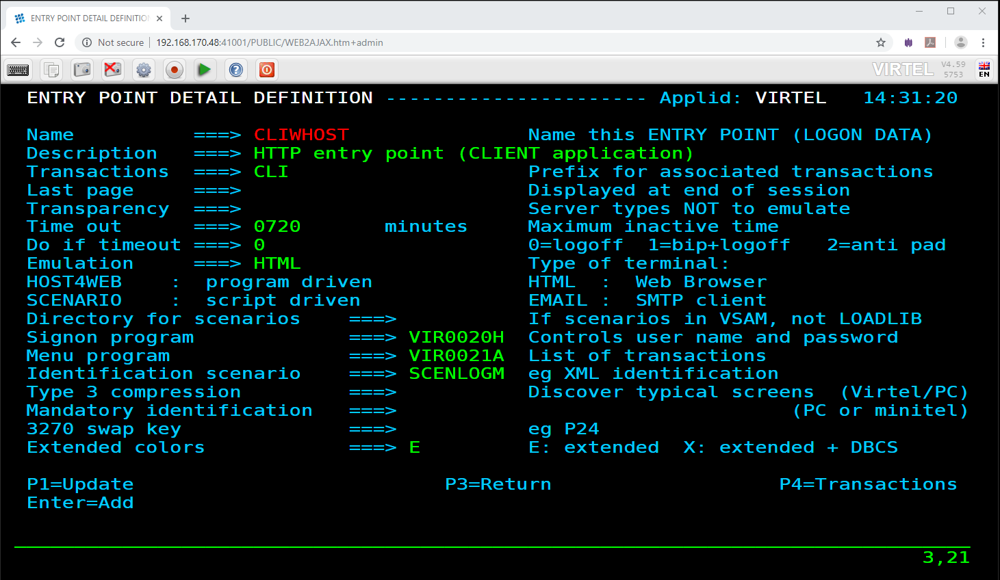
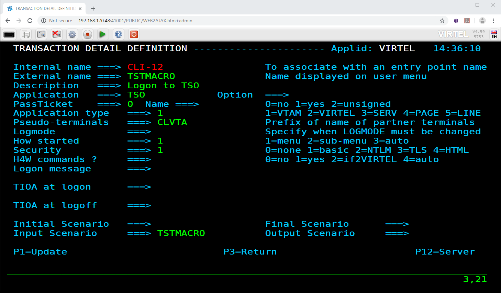

.. _tn201904:

Using VBA Macros with Virtel
============================

Introduction
------------

The following newsletter documents how we can use a VBA macro, driven by MicroSoft Excel, to populate a spreadsheet. From the spreadsheet we drive a Virtel Scenario to obtain a member list of a TSO ISPF Dataset and then populate the spreadsheet with the results. See the Installation section to install the necessary components.

Installation
------------

1. Download the zip package from the Virtel FTP website - vbaexample.zip
2. Expand into a directory on your PC - C:\MACRO     (This name is coded in the VBA macro)
3. Open the macro VBAExample.xlsm with Excel. Note: Enable Macros option when requested.
4. Upload the scenario source file VBAExample.vsc to HLQ.VIRTEL.CNTL as member TSTMACRO
5. Check the following MACLIB members in HLQ.VIRTEL.SCRNAPI.MACLIB
 
      OPTION$, FOREACH$, COPY$, CASE$, ENDFOR$

      Search for any X'44'(è) characters and replace them with X'7C' (UK/US @). If you do not do this, you will get assembly errors when complying the scenario.

6. Upload and assemble the TSTMACRO scenario with the ASMSCEN member of the Virtel CNTL library and link the scenario to your HLQ.VIRTEL.LOADLIB.
7. Start Virtel
8. Check that your CLI 41002 line Entry Point loads scenarios from LOADLIB and not the SCE-DIR.

      Go to the Admin Portal and display the CLIHOST Entry Point. Make sure the Directory for scenarios is blank. This will ensure that Virtel loads scenarios from the loadlib.   

|image4|
*Setting the scenario LOAD option in the Entry point*      

9. Add the transaction CLI-12 to the CLIWHOST Entry point. Transaction CLI-12 is a 3270 based transaction directed towards a TSO session. It uses basic authentication (Security=1) and has an Input Scenario of TSTMACRO.

|image5|

10. Stop and restart Virtel.

Operation
---------

1. Open the the EXCEL macro VBAExample.xlsm. The following form is presented: -

|image1|
*Excel Form*

2. The form presents us with several controls that can be used to drive the HTTP requests between the VBA macro and Virtel.

::

      USER:/PASS:		      The userid and password.
      Show full URL:		Revals the URL that is passed to Virtel
      Virtel Host / Port:	The target Virtel Host and Port 
      DS Name:		      The Mainframe Dataset name
      Additional URL Parms.	Keyword:Value combinations that can be passed in the URL.
      Request HTTP:	      Button to initiate the request
      Clear Results:	      Clear the template result area

3. Fill in the required details:-

::

      USER:             Your userid
      PASS:             Your password
      Virtel Host:      IP address of Virtel
      Virtel Port:      41002
      DS Name:          Name of PDS to list

From these details, the VBA macro will generate a URL that will be used to initiate the TSTMACRO transaction. The generated URL looks like.

|image2|

*URL genereted from the EXCEL macro*

4. Press the HTTP request button to initiate the transaction. After the transaction has completed the form will be populated with a member list. The final results look like: -

|image3|

Appendix A
----------

VBA Example Scenario
^^^^^^^^^^^^^^^^^^^^

::

      TSTMACRO SCREENS APPL=TSTMACRO
      *######################################################################
      *##                         INPUT SCENARIO                           ##
      *######################################################################
      *
         SCENARIO INPUT
         DEBUG$ TRACE,SCENARIO
      *
         COPY$ INPUT-TO-VARIABLE,FIELD='userName',VAR='userName'
         IF$   NOT-FOUND,THEN=PARAM_ERR_USER
         COPY$ INPUT-TO-VARIABLE,FIELD='password',VAR='password'
         IF$   NOT-FOUND,THEN=PARAM_ERR_PWD
         COPY$ INPUT-TO-VARIABLE,FIELD='dsname',VAR='dsname'
         IF$   NOT-FOUND,THEN=PARAM_ERR_DSNAME,ELSE=LOGON
      *
      PARAM_ERR_USER EQU *
         COPY$ VALUE-TO-VARIABLE,VAR=ErrorMsg,TYPE=REPLACE,            *
               VALUE='Missing required parameter (userName)'

         GOTO$ ERRORMSG
      *
      PARAM_ERR_PWD EQU   *
         COPY$ VALUE-TO-VARIABLE,VAR=ErrorMsg,TYPE=REPLACE,            *
               VALUE='Missing required parameter (password)'
         GOTO$ ERRORMSG
      *
      PARAM_ERR_DSNAME EQU   *
         COPY$ VALUE-TO-VARIABLE,VAR=ErrorMsg,TYPE=REPLACE,            *
               VALUE='Missing required parameter (dsname)'
         GOTO$ ERRORMSG
      *
      LOGON    EQU   *
         ERROR$ 0,'--- LOGON '
      *
         CASE$ (01,12,12),                                             *
               (EQ,'ENTER USERID',DOUSN)
      *
         COPY$ VALUE-TO-VARIABLE,VALUE='Not (UserID Logon) Screen',    *
               VAR=ErrorMsg,TYPE=REPLACE
         GOTO$ ERRORMSG_WITH_SCREEN
      *
      DOUSN    EQU   *
         ERROR$ 0,'--- DOUSN'
      *
         ERROR$ 0,'userName=','*userName'
         COPY$ VARIABLE-TO-SCREEN,VAR='userName',                      *
               SCREEN=(2,1,7),TYPE=ERASE-FIELD
         ACTION$  TO-APPLICATION,KEY=7D,                               *
               AND=(PROCESS-RESPONSE)
      *
         IF$ (01,34,11),                                               *
               EQ='TSO/E LOGON',                                       *
               THEN=DOPASS
      *
         COPY$ VALUE-TO-VARIABLE,VALUE='Not (TSO Logon) Screen',       *
               VAR=ErrorMsg,TYPE=REPLACE
         GOTO$ ERRORMSG_WITH_SCREEN
      *
      DOPASS   EQU   *
         ERROR$ 0,'--- DOPASS'
      *
         ERROR$ 0,'password=','*password'
         COPY$ VARIABLE-TO-SCREEN,VAR='password',                      *
               SCREEN=(8,20,8),TYPE=ERASE-FIELD
      DOISPF   LABEL$
         ACTION$  TO-APPLICATION,KEY=7D,                               *
               AND=(WAIT,'ispf'),                                      *
               MAXTIME=500
      *
         ERROR$ 0,'Look for ISPF in line 10'
         IF$ (10,2,4),                                                 *
               EQ='ispf',                                              *
               THEN=PASSDONE
         ERROR$ 0,'Look for ISPF in line 11'
         IF$ (11,2,4),                                                 *
               EQ='ispf',                                              *
               THEN=PASSDONE
         ERROR$ 0,'Look for ISPF in line 12'
         IF$ (12,2,4),                                                 *
               EQ='ispf',                                              *
               THEN=PASSDONE
         ERROR$ 0,'Look for ISPF in line 13'
         IF$ (13,2,4),                                                 *
               EQ='ispf',                                              *
               THEN=PASSDONE
      *
      * Check for common login errors
      *
         IF$ (2,12,17),                                                *
               EQ='PASSWORD NOT AUTH',                                 *
               THEN=LOGON_BADPASS
         IF$ (2,12,6),                                                 *
               EQ='Userid',                                            *
               THEN=LOGON_BADUSER_MAYBE
      *
      * Generic login error message
      *
      LOGON_GENERIC EQU *
         COPY$ VALUE-TO-VARIABLE,VAR='ErrorMsg',TYPE=REPLACE,          *
               VALUE='ISPF screen not found (Is the user logged in?)'
         GOTO$ ERRORMSG_WITH_SCREEN
      *
      LOGON_BADUSER_MAYBE EQU *
         IF$ (2,27,8),                                                 *
               EQ='not auth',                                          *
               THEN=LOGON_BADUSER,                                     *
               ELSE=LOGON_GENERIC
      *
      * Invalid User
      *
      LOGON_BADUSER EQU *
         COPY$ VALUE-TO-VARIABLE,VAR='ErrorMsg',TYPE=REPLACE,          *
               VALUE='Login failed (Invalid User)'
         GOTO$ ERRORMSG_WITH_SCREEN
      *
      * Invalid Password
      *
      LOGON_BADPASS EQU *
         COPY$ VALUE-TO-VARIABLE,VAR='ErrorMsg',TYPE=REPLACE,          *
               VALUE='Login failed (Invalid Password)'
         GOTO$ ERRORMSG_WITH_SCREEN
      *
      PASSDONE EQU   *
         ERROR$ 0,'--- PASSDONE'
      *
         ACTION$  TO-APPLICATION,KEY=7D,                               *
               AND=(PROCESS-RESPONSE)
         IF$ (3,29,12),                                                *
               EQ='ISPF Primary',                                      *
               THEN=DOOPTION
      *
         COPY$ VALUE-TO-VARIABLE,VALUE='Not (Primary Menu) screen',    *
               VAR=ErrorMsg,TYPE=REPLACE
         GOTO$ ERRORMSG_WITH_SCREEN
      *
      DOOPTION EQU *
      *
         ERROR$ 0,'--- DOOPTION'
      *
         ERROR$ 0,'Sending (=3.4)'
         COPY$ VALUE-TO-VARIABLE,VALUE='=3.4',                         *
               VAR='input',TYPE=REPLACE
         COPY$ VARIABLE-TO-SCREEN,VAR='input',                         *
               SCREEN=(4,40,4),TYPE=ERASE-FIELD
         ACTION$ TO-APPLICATION,KEY=7D,                                *
               AND=(PROCESS-RESPONSE)
         IF$ (3,30,13),                                                *
               EQ='Data Set List',                                     *
               THEN=DODATASET
      *
         COPY$ VALUE-TO-VARIABLE,VALUE='Not (DataSet Menu) screen',    *
               VAR=ErrorMsg,TYPE=REPLACE
         GOTO$ ERRORMSG_WITH_SCREEN
      *
      DODATASET EQU *
      *
         ERROR$ 0,'--- DODATASET'
      *
         ERROR$ 0,'Sending Dsname (','*dsname',')'
         COPY$ VARIABLE-TO-SCREEN,VAR='dsname',                        *
               SCREEN=(10,24,46),TYPE=ERASE-FIELD
         ACTION$ TO-APPLICATION,KEY=7D,                                *
               AND=(PROCESS-RESPONSE)
         IF$ (3,16,13),                                                *
               EQ='Sets Matching',                                     *
               THEN=DOCONTENT
      *
         COPY$ VALUE-TO-VARIABLE,VALUE='Not (DataSet Match) screen',   *
               VAR=ErrorMsg,TYPE=REPLACE
         GOTO$ ERRORMSG_WITH_SCREEN
      *
      DOCONTENT EQU *
      *
         ERROR$ 0,'--- DOCONTENT'
      *
         ERROR$ 0,'Sending (E)'
         COPY$ VALUE-TO-VARIABLE,VALUE='e',VAR='input',TYPE=REPLACE

         COPY$ VARIABLE-TO-SCREEN,VAR='input',                         *
               SCREEN=(8,28,1),TYPE=ERASE-FIELD
         ACTION$ TO-APPLICATION,KEY=7D,                                *
               AND=(PROCESS-RESPONSE)
      *
         COPY$ SCREEN-TO-VARIABLE,SCREEN=(06,12,69,17),VAR='lines',    X
               TYPE=REPLACE
         ERROR$ 0,'Setting lines ','*lines'

         COPY$ VALUE-TO-VARIABLE,VAR='response',VALUE='OK:',           X
               TYPE=REPLACE
         GOTO$ APPEND_SCREEN
      *
      LOGOFF   EQU   *
         ERROR$ 0,'--- DOLOGOFF'
      *
         CASE$ (04,02,07),(EQ,'Command',DOLOGOFF)
         ERROR$ 0,'Not logged - Skipping logoff'
         GOTO$ RETURN_RESPONSE
      *
      DOLOGOFF LABEL$
         ERROR$ 0,'Sending (=X)'
         PERFORM$ TRACE
         COPY$ VALUE-TO-VARIABLE,VALUE='=X',                           *
               VAR='clear',TYPE=REPLACE
         COPY$ VARIABLE-TO-SCREEN,VAR='clear',                         *
               SCREEN=(4,40,2),TYPE=ERASE-FIELD
         ACTION$  TO-APPLICATION,KEY=7D,                               *
               AND=(WAIT,'READY'),                                     *
               MAXTIME=500
      *
         ERROR$ 0,'Sending (LOGOFF)'
         PERFORM$ TRACE
         COPY$ VALUE-TO-VARIABLE,VALUE='LOGOFF',                       *
               VAR='logoff',TYPE=REPLACE
         COPY$ VARIABLE-TO-SCREEN,VAR='logoff',                        *
               SCREEN=(2,2,6),TYPE=ERASE-FIELD
         ACTION$  TO-APPLICATION,KEY=7D,                               *
               AND=(WAIT,'LOGGED OFF'),                                *
               MAXTIME=5000
         PERFORM$ TRACE
      *
         ERROR$ 0,'User Logged Off'
         GOTO$ RETURN_RESPONSE
      *
      *
      *
      *######################################################################
      *##                          H E L P E R S                           ##
      *######################################################################
      *
      ERRORMSG EQU   *
         ERROR$ 0,'*ErrorMsg'
         COPY$ LIST-TO-VARIABLE,VAR='response',TYPE=REPLACE,           *
               LIST=('KO:','*ErrorMsg')
         GOTO$ RETURN_RESPONSE
      *
      ERRORMSG_WITH_SCREEN EQU *
         ERROR$ 0,'*ErrorMsg'
         COPY$ LIST-TO-VARIABLE,VAR='response',TYPE=REPLACE,           *
               LIST=('KO:','*ErrorMsg')
         COPY$ VALUE-TO-VARIABLE,VAR='response',VALUE='(*SCREEN*)'
      *
      APPEND_SCREEN  EQU *
      *
      **Only 17 lines were read
      *
         ERROR$ 0,'Setting screen to response'
         COPY$ LIST-TO-VARIABLE,VAR='response',LIST=('01:','*lines')
         POP$ FIRST-VALUE-OF,VAR='lines'
         COPY$ LIST-TO-VARIABLE,VAR='response',LIST=('02:','*lines')
         POP$ FIRST-VALUE-OF,VAR='lines'
         COPY$ LIST-TO-VARIABLE,VAR='response',LIST=('03:','*lines')
         POP$ FIRST-VALUE-OF,VAR='lines'
         COPY$ LIST-TO-VARIABLE,VAR='response',LIST=('04:','*lines')
         POP$ FIRST-VALUE-OF,VAR='lines'
         COPY$ LIST-TO-VARIABLE,VAR='response',LIST=('05:','*lines')
         POP$ FIRST-VALUE-OF,VAR='lines'
         COPY$ LIST-TO-VARIABLE,VAR='response',LIST=('06:','*lines')
         POP$ FIRST-VALUE-OF,VAR='lines'
         COPY$ LIST-TO-VARIABLE,VAR='response',LIST=('07:','*lines')
         POP$ FIRST-VALUE-OF,VAR='lines'
         COPY$ LIST-TO-VARIABLE,VAR='response',LIST=('08:','*lines')
         POP$ FIRST-VALUE-OF,VAR='lines'
         COPY$ LIST-TO-VARIABLE,VAR='response',LIST=('09:','*lines')
         POP$ FIRST-VALUE-OF,VAR='lines'
         COPY$ LIST-TO-VARIABLE,VAR='response',LIST=('10:','*lines')
         POP$ FIRST-VALUE-OF,VAR='lines'
         COPY$ LIST-TO-VARIABLE,VAR='response',LIST=('11:','*lines')
         POP$ FIRST-VALUE-OF,VAR='lines'
         COPY$ LIST-TO-VARIABLE,VAR='response',LIST=('12:','*lines')
         POP$ FIRST-VALUE-OF,VAR='lines'
         COPY$ LIST-TO-VARIABLE,VAR='response',LIST=('13:','*lines')
         POP$ FIRST-VALUE-OF,VAR='lines'
         COPY$ LIST-TO-VARIABLE,VAR='response',LIST=('14:','*lines')
         POP$ FIRST-VALUE-OF,VAR='lines'
         COPY$ LIST-TO-VARIABLE,VAR='response',LIST=('15:','*lines')
         POP$ FIRST-VALUE-OF,VAR='lines'
         COPY$ LIST-TO-VARIABLE,VAR='response',LIST=('16:','*lines')
         POP$ FIRST-VALUE-OF,VAR='lines'
         COPY$ LIST-TO-VARIABLE,VAR='response',LIST=('17:','*lines')
         POP$ FIRST-VALUE-OF,VAR='lines'
      *
      LOOP1    FOREACH$ VALUE-IN-VARIABLE,VAR='response'
         COPY$ VARIABLE-TO-VARIABLE,VAR=('response','VAR2'),           X
               FOREACH=LOOP1,TYPE=REPLACE
               ENDFOR$ LOOP1

         GOTO$ LOGOFF
      *
      RETURN_RESPONSE EQU *
         ERROR$ 0,'Returning response'
         CONVERT$ EBCDIC-TO-ASCII,VAR='response',TABLE='IBM1147'
         SEND$ AS-ANSWER,VAR='response',TYPE='text/plain',             *
               EXPIRES=IMMEDIATELY
         DEBUG$ NOTRACE,SCENARIO
      *
         SCENARIO END
      *
      *######################################################################
      *##                        OUTPUT SCENARIO                           ##
      *######################################################################
      *
         SCENARIO OUTPUT
         SCENARIO END
      *
      *****************
      ***   TRACE   ***
      *****************
      *
      TRACE    SCENARIO SUBROUTINE
      *
         COPY$ VALUE-TO-VARIABLE,VAR='ruler1',                         X
               VALUE='---  0---|--- 10---|--- 20---|--- 30---|--- 40---X
               |--- 50---|--- 60---|--- 70---|--- 80---|',             X
               TYPE=REPLACE
         COPY$ VALUE-TO-VARIABLE,VAR='ruler2',                         X
               VALUE='123456789|123456789|123456789|123456789|123456789X
               |123456789|123456789|123456789|123456789|',             X
               TYPE=REPLACE
         ERROR$ 0,'          ','*ruler1'
         ERROR$ 0,'          ','*ruler2'

      LOOP1    FOREACH$ VALUE-IN-SCREEN,SCREEN=(1,1,80,24)
         COPY$ SCREEN-TO-VARIABLE,SCREEN=(=,01,80),VAR='screenL',      X
               TYPE=REPLACE
         COPY$ SYSTEM-TO-VARIABLE,VAR='L1',LENGTH=2,                   *
               FIELD=(VALUE-OF,CURRENT-LINE),TYPE=REPLACE
         ERROR$ 0,'line ','*L1','== ','*screenL'
         ENDFOR$ LOOP1
      *
      ENDTRACE LABEL$
         POP$ VAR='screenL'
         SCENARIO END
         SCRNEND
      *
         END 

Appendix B
----------

VBA Macro
^^^^^^^^^

::

      '==========================================================================
      '==========================================================================
      '
      '   Top-level MACROS for Excel
      '
      '==========================================================================
      '==========================================================================

      ' - MACRO -
      ' > Performs a POST HTTP request on the generated URL,
      ' > Extracts data from the received content (if successful),
      ' > Injects the extracted data into the sheet 'output' cells
      '
      Sub ProcessHTTP()    
            Dim baseURL As String
            Dim prms As String
            Dim body As String
            Dim url As String
            Dim content As String
            Dim usrName As String
            Dim usrPass As String

            Call ResetResults
            Call ClearScreen

            ' Gather miscellaneous pieces of information from the active sheet
            usrName = ActiveSheet.Range(g_userNameRange).Value
            usrPass = ActiveSheet.Range(g_userPassRange).Value
            baseURL = buildBaseUrl(g_baseUrl)
            prms = buildUrlParams(g_urlParamsRange)
            url = buildURL(baseURL, prms)
            body = ""

            ' Send the HTTP request, and get back the received content
            content = sendHttpRequest(url, , body, usrName, usrPass)

            ' Handle the HTTP response if no error occured
            If (content <> "") Then
                  handleHttpResponse (content)
            End If
      End Sub

      ' - MACRO -
      ' Clear the result cells
      '
      Sub ResetResults()
            Call clearCells(g_responseRange, g_responseCols)
      End Sub

      ' - MACRO - [DEBUG] -
      ' Displays the generated URL
      '
      Sub ShowURL()

            Dim url As String
            Dim res As String

            url = buildURL(buildBaseUrl(g_baseUrl), buildUrlParams(g_urlParamsRange))
            res = "The generated URL is :" & vbCrLf & vbCrLf & "[" & url & "]"    
            MsgBox res
      End Sub

      '=============================================================================
      '=============================================================================
      '
      '   Functions and subs
      '
      '=============================================================================
      '=============================================================================

      ' Extract the meaningful data lines from the received body, and store them into
      ' the output lines array. This array size is dynamically adjusted to hold any amount of entries.
      ' The last entry in this array is always followed by an empty marker entry.
      '
      Function extractDataFromResponse(ByVal content As String, ByRef lines() As String) As Long
            
            ReDim lines(17)
            Dim nbLines As Long
            Dim startIdx As Long
            Dim nextIdx As Long
            Dim stopIdx As Long
            Dim line As String
    
            startIdx = 4
            nbLines = 0

            Do
                  line = Trim(Mid(content, startIdx, startIdx + 69))
                  lines(nbLines) = line
                  nbLines = nbLines + 1
                  startIdx = startIdx + 69 + 3
            Loop While (nbLines < 17)

            extractDataFromResponse = nbLines
      End Function

      ' Perform a synchronous HTTP request on the specified URL (using the specified body)
      ' If an error occurs, this function returns an empty string.
      ' Otherwise, it returns the body as recieved from the host.
      '
      Function sendHttpRequest(ByVal url As String, _
            Optional ByVal mode As String = "POST", _
            Optional ByVal body As String = "", _
            Optional ByVal userName As String = "", _
            Optional ByVal password As String = "") As String

            If (g_DEBUG_IN) Then
                  Call MsgBox(url & vbCrLf & vbCrLf & body, vbOKOnly, "HTTP Request")
            End If

            Dim http As Object
            Set http = CreateObject("MSXML2.XMLHTTP")

            http.Open mode, url, False, userName, password
            http.setRequestHeader "User-Agent", "Mozilla/4.0 (compatible; MSIE 6.0; Windows NT 5.0)"
            '   http.setRequestHeader "Content-type", "application/x-www-form-urlencoded"
            http.setRequestHeader "Content-type", "text/plain"
            http.Send (body)

            sendHttpRequest = validateHttpResponse(http)

            If (g_DEBUG_OUT And (sendHttpRequest <> "")) Then
                  Dim size As Long
                  size = Len(sendHttpRequest)
                  Call MsgBox(sendHttpRequest, , "SUCCESS - Received " & size & " bytes")
            End If
      End Function

      ' Returns eihter an empty string if the HTTP response status is not 200 (and display the error message),
      ' or the received content otherwise.
      '
      Function validateHttpResponse(http As Object) As String

            Dim text As String
            Dim resText As String

            Call saveText(g_TRACE_FILE, http.responseText)

            resText = saveScreenAndExtractText(g_SCREEN_FILE, http.responseText)

            text = getHttpErrorText(http)
            If (text <> "") Then
                  text = text & vbCrLf & "_____________________________________" & vbCrLf & http.responseText
                  MsgBox text, , "HTTP Request FAILED"
                  validateHttpResponse = ""
                  Exit Function
            End If

            text = resText
            If (Left(text, 3) = "OK:") Then
                  text = Mid(text, 4)
                  validateHttpResponse = text
                  Exit Function
            End If

            If (Left(text, 3) = "KO:") Then
                  text = "Applicative Error :" & vbCrLf & vbCrLf & Mid(text, 4)
            Else
                  text = text & vbCrLf & "_____________________________________" & vbCrLf & resText
            End If

            MsgBox text, , "Request Failure"
            validateHttpResponse = ""
      End Function

      ' Perform a synchronous HTTP request on the specified URL (using the specified body)
      ' If an error occurs, this function returns an empty string.
      ' Otherwise, it returns the body as recieved from the host.
      '
      Function handleHttpResponse(ByVal content As String) As Boolean

            Dim lines() As String
            '    Dim line As String
            Dim cell As Range
            Dim idx As Long
            Dim nbLines As Long

            nbLines = extractDataFromResponse(content, lines)

            For Each cell In ActiveSheet.Range(g_responseRange).cells
            '     line = lines(idx)
                  If (idx = nbLines) Then Exit For
                  Call injectResponseLine(cell, lines(idx))
            '     cell.Value = line
                  idx = idx + 1
            Next
            handleHttpResponse = True   ' successful
      End Function

      Sub injectResponseLine(ByVal cell As Range, line As String)
            Dim col As Long
            Dim row As Long
            row = cell.row
            col = cell.Column

            ActiveSheet.cells(row, col + 0).Value = RTrim(Mid(line, 1, 8))               ' Name
            ActiveSheet.cells(row, col + 2).Value = LTrim(Mid(line, 20, 8))              ' Size
            ActiveSheet.cells(row, col + 3).Value = RTrim(Mid(line, 30, 11))             ' Created
            ActiveSheet.cells(row, col + 4).Value = RTrim(Mid(line, 44, 18))             ' Changed
            ActiveSheet.cells(row, col + 5).Value = RTrim(Mid(line, 63, 7))              ' ID
      End Sub

      ' Extract the error text from an HTTP object.
      '     

      Function getHttpErrorText(http As Object) As String
            If (http.Status = 200) Then ' Request successful
                  getHttpErrorText = ""
                  Exit Function
            End If
            getHttpErrorText = "Status code : " & http.Status & vbCrLf _
                     & "Status text : " & http.statusText
      End Function

      ' Append the User/Pass/DSName params to the provided base URL
      '
      ' TODO : Add some HTML-escaping on the extracted value
      '

      Function buildBaseUrl(baseURL As String) As String
            Dim url As String
            Dim host As String
            Dim port As String

            host = LTrim(RTrim(ActiveSheet.Range(g_virtelHostRange).Value))
            port = LTrim(RTrim(ActiveSheet.Range(g_virtelPortRange).Value))
    
            url = "http://" & host & ":" & port & baseURL

            If (InStr(1, baseURL, "?") < 1) Then
                  url = url & "?"
            Else
                  url = url & "&"
            End If

            url = url & "userName=" & LTrim(RTrim(ActiveSheet.Range(g_userNameRange).Value))
            url = url & "&password=" & LTrim(RTrim(ActiveSheet.Range(g_userPassRange).Value))
            url = url & "&dsname=" & LTrim(RTrim(ActiveSheet.Range(g_DSNameRange).Value))
            buildBaseUrl = url
      End Function

      ' Extract the 'URL params' from the active sheet, in the specified cells range,
      ' and return them as an URL parameters string.
      ' The parameters extraction stops when the first empty name's cell is encountered.
      '
      ' TODO : Add some HTML-escaping on the extracted value
      '
      Function buildUrlParams(paramsRange As String) As String
            Dim cells As Variant
            Dim res As String, prmName As String
            Dim idx As Long
            Dim sep As String

            cells = ActiveSheet.Range(paramsRange).Value

            For idx = LBound(cells, 1) To UBound(cells, 1)
                  prmName = cells(idx, 1)
                  If (prmName = "") Then Exit For
                  res = res & sep & prmName & "=" & cells(idx, 2)
                  sep = "&"
            Next
            buildUrlParams = res
      End Function

      ' Merges a base URL and an (optionnal) parameters into a full URL address.
      '
      Function buildURL(ByVal baseURL As String, Optional ByVal params As String = "") As String              

            Dim separator As String
            If (params <> "") Then
                  separator = "?"
            ' Do not use '?' if it is already found in the base URL (in such a case, use '&' instead)
            If (InStr(baseURL, "?") > 0) Then separator = "&"
                  buildURL = baseURL & separator & params
            Else
                  buildURL = baseURL
            End If
      End Function

      ' Save some text into the specified file.
      '
      Private Sub saveTextOld(ByVal path As String, ByVal content As String)
            On Error GoTo saveTextError    
            Dim fso As Object
            Dim file As Object    
            Set fso = CreateObject("Scripting.FileSystemObject")
            Set file = fso.opentextfile(path, 2, True)
            file.Write content
            file.Close
            Exit Sub

      saveTextError:
            On Error GoTo 0
            MsgBox Err.Number & vbLf & Err.Description, "Trace file saving error"
      End Sub

      Private Sub saveText(ByVal path As String, ByVal content As String)
            On Error GoTo saveTextError
            Dim strFile_Path As String
            strFile_Path = path
            Open strFile_Path For Append As #1
            Write #1, Now() & " : " & content
            Close #1  
      Exit Sub

      saveTextError:
            On Error GoTo 0
            MsgBox Err.Number & vbLf & Err.Description, "Trace file saving error"
      End Sub

      Private Function saveScreenAndExtractText(ByVal path As String, ByVal content As String) As String
            Dim idx As Long    
            idx = InStr(1, content, g_ScreenTag)
            If (idx < 1) Then
            ' The response does not contain any screen dump
                  saveScreenAndExtractText = content
                  Exit Function
            End If

            saveScreenAndExtractText = Left(content, idx - 1)

            If (Left(content, 3) = "KO:") Then
                  Sheets(2).Range(g_ScreenMsgRange).Interior.Color = RGB(255, 255, 64)
                  Sheets(2).Range(g_ScreenMsgRange).Value = "  " & Mid(saveScreenAndExtractText, 4)
            End If

            Dim scrData As String
            Dim i As Long
            Dim line As String

            ' Expected format is:
            ' (*SCREEN*)#01:<80 bytes>#02:<80 bytes>...#24:<80 bytes>

            idx = idx + Len(g_ScreenTag) + 4

            For i = 0 To 23
                  line = Mid(content, idx + (i * 84), 80)
                  Sheets(2).cells(i + g_ScreenRow, g_ScreenColumn).Value = line
                  scrData = scrData & line & vbCrLf
            Next

            Sheets(2).Select
            Sheets(2).Range(g_ScreenMsgRange).Select

            ' Save the screen content into the specified trace file
            Call saveText(path, scrData)
      End Function

      Private Sub ClearScreen()
            Dim i As Integer
            For i = 0 To 23
                  Sheets(2).cells(i + g_ScreenRow, g_ScreenColumn).ClearContents
            Next
            Sheets(2).Range(g_ScreenMsgRange).ClearContents
            Sheets(2).Range(g_ScreenMsgRange).Interior.Color = RGB(255, 255, 255)    
      End Sub

      ' Clear the specified range of cells
      '
      Sub clearCells(ByVal targetRange As String, Optional ByVal cols As Long = 1)
            Dim cell As Range
            For Each cell In ActiveSheet.Range(targetRange).cells
                  cell.ClearContents
                  If (cols > 1) Then
                        Dim c As Long
                        For c = 2 To cols
                              cells(cell.row, cell.Column + c - 1).ClearContents
                        Next
                  End If
            Next    
      End Sub

.. |image1| image:: images/media/image1.png      
.. |image2| image:: images/media/image2.png
.. |image3| image:: images/media/image3.png

