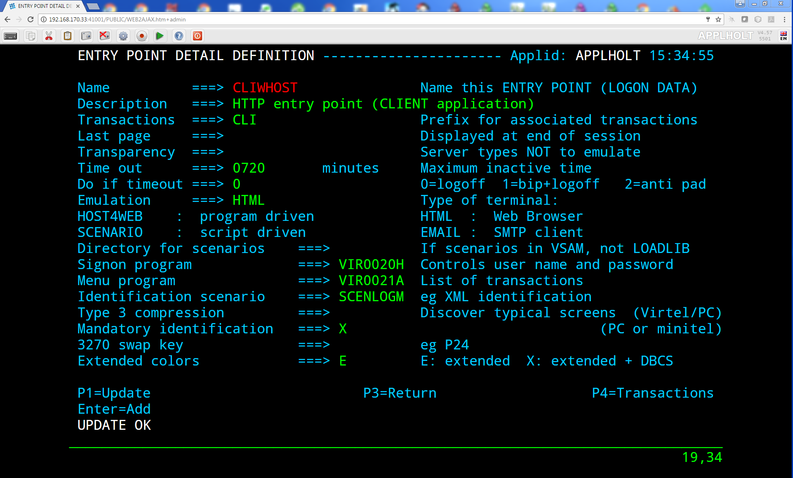

.. _tn202003:

What’s new in Virtel 4.60 GA Release
=====================================================

The following newsletter summaries the new features and maintenance updates that can be found in Virtel Release 4.60. 

Installation changes
--------------------

**5825 VSE tape - add missing SCRNAPI macros to sublib**

- Updated VSE installation tape with missing SCRNAPI macros

**5832 V4.60 Installation updates**

- Updated MVS and VSE installation tapes with new JCL for v4.60

**5865/5884 complete VSE and FSE installations**

- Corrected some installation jobs for z/VSE and Free Starter Edition

**5885 sources.zip**

- Updated sources.zip file included with product

Migration considerations
------------------------

V4.60 
^^^^^

**End of support for COMPATIBILITY mode**

The "COMPATIBILITY" mode for w2hparm, that was introduced in version 4.54 to provide seamless migration of 4.53 w2hparm to 4.54 w2hparm is no longer supported in v4.60. It is recommended to switch to "Option" mode before migrating to 4.60.

**ARBO changes**

There have been no changes to the ARBO which would require migration from V4.59 or V4.58. Customers who are migrating from older releases should review the 
“What’s new in Virtel V4.XX” newsletters to determine applicable migration actions for new distributed features. 
Depending on requirements not all actions may be applicable. These newsletters are available online at https://virtel.readthedocs.io/en/latest/ 

Fixes, changes and new features
-------------------------------

Presentation
^^^^^^^^^^^^

**5782 w2h page capture improved**

- Improved capture feature to support older IE browsers and multiple captures on one page

**5799 FTP and Macro Interface enhancements**

- Improved FTP interface, corrected macro panel for Edge browsers

**5800 Macro and Capture Enhancements.**

- Improved layout for macros and screen capture

**5803 FTP V1.1**

- Enhanced version of Virtel FTP feature

**5801 Insert Key support as a Joker Key**

- Allows to redefine a key as the Insert key for keyboards that do not have an Insert key
 
  - First set a Joker Key in w2hparm.js, for instance::

         w2hparm.jokerkey = 192;  // leftmost key on second row of US keyboard     

  - Then use user settings to change one of 'joker' or 'shiftjoker' or 'altjoker' to 'Ins'

  - The administrator can preset these values in w2hparm with, for instance::

         w2hparm.joker = "Ins"

    or::

         w2hparm.shiftjoker = "Ins"

.. note ::
  To determine the scancode of a key, one can use the scancode tester in the w2h directory, for instance: http://192.168.170.50:41001/w2h/scancode.htm         

**5806 Correct error with data.js to avoid old D&D template**

- Removed references to old drag and drop admin interface

**5808 Update Macro Sources, languages and fix for V4.58**

- Harmonized code for AS/400 version of Virtel (TBT Web Access)

**5820 CTRL left SHIFT as ENTER**

- Added support for SHIFT + left CTRL 

  - If CTRL has been assigned to ENTER, pressing SHIFT + left CTRL will be processed as an ENTER key.

  - You must press first SHIFT then CTRL for this to work consistently.

  - Ctrl + shift is by default the 'change keyboard layout' hotkey for Windows. So you possibly would have to unset this in the Windows Settings.

**5822 backspace and keypad +-**

- backspace may now be set to: 		["no", "Backtab", "Newline", "Ins"]
- shift+backspace may now be set to:	["no", "Backtab", "CLEAR", "Ins"]}

**5823 SMARTWEB2VIRT parameters - keypad display - click position**

- Corrected version of the SMARTWEB2VIRT template for tablets and smartphones

**5826 backspace and keypad +- - correction**

- Corrects an error in update 5822

**5827 Misc. updates to VSR**

- New "Wizard" mode for Virtel Screen Redesigner

**5829 incorrect display of a large template when using Virtel cache**

- Corrects Virtel caching of large page templates

**5830 Update to Virtel Online Doc. and Capture fix.**

- Updated online help documentation for cut & paste and capture

**5835 Screen Presentation and Language Support Changes**

- Corrected screen sizing in NOSTRETCH mode, to avoid vertical slider from appearing

**5840 incorrect graphic characters**

- Corrects an issue where vertical lines where displayed as superscript character

**5841 VWA Macros fix. IE11**

- Correct corruption of macro list in IE11

**5843 Misc. VWA fixes.**

- Corrected processing of data pasted into Virtel from external spreadsheet

**5844 Introduce new settings color palette and other VWA updates**

- Introduction of new color palette "Classic 3270" to differentiate between "base color" and "default color" modes

**5848 Toolbar and settings correction**

- Correction of an issue where some user settings were not correctly saved when set before sign-on

**5855 ADM VWM updates**

- Support for additional BMS fields

**5861 add FTPPARM scenario to LOADLIB**

- FTPPARM scenario was only present in SCE-DIR, not LOADLIB

**5866 replace X'0C' by a blank**

- Display fixed for pages containing x'0C' characters

**5867 hideinfo + VWA-captures parm badly reported**

- Fixed code that hides icons in the Virtel toolbar.

**5870 Adding keys PF22 PF23 for pgup/pgdn, obsolete links removed**

- Added support to map PF22 and PF23 keys to PgUp/PgDown

**5874 Safari CmdCV, PF22/23, Autoprint, Deferred Authentification and autocapture, w2hparm considerations, MAXIMUM-PASSWORD-LENGTH, fold/unfo**

- Fixed code for printing and screen-capture
- Added support for Cmd+C and Cmd+V in Safari

**5882 Vtam app print no longer works**

- Corrected 3270 printing feature for IE11

.. raw:: latex

    \newpage 

Base Components
^^^^^^^^^^^^^^^

**5776 Add symbolics to VIR0021W**

- Add @@@@DATE, @@@@TIME and @@PRT variables in USSTAB support

**5778 Return US Date format if COUNTRY=US in TCT**

- @@@@DATE is returned as MM\DD\YY string if COUNTRY=US is specified in TCT

**5780 Possible abend trying to restore a session**

- Corrects s0C4 abend that occurs when Virtel tries to restore a NCAccess session 

**5781 z 0 error**

- Corrects Virtel behaviour when a key is pressed during a temporary TCPIP disconnection, to avoid Z 0 errors.

**5783/5797/5810/5814/5836/5849/5850/5853 IPV6 support**

- Add IPv6 support to Virtel. See *Appendix B* for more details.

**5786 Service transaction terminals not reused**

- Corrects error in 5463 that prevented service transaction terminals from being reused

**5787 TPX error LOGONID TOO LONG**

- Corrects bind to TPX to avoid too many characters from being read for LOGONID

**5788 TPX: unsolicited BIND may arrive before TSO BIND**

- Corrects situation with TPX where user has to press Enter twice to access an application

**5789 Correct S0C4 in VIR0021W**

- Prevent erroneous TSO logons via USSTAB from corrupting VIR0021W storage areas

**5790 VIRPLEX Writer updates not propagated**

- Fixes broadcast problems from Writer to Reader instances of Virtel in Virplex

**5792 Hang in APPLIST following UPDT5771**

- Corrected applist application for Security type 4 to prevent hangs for unavailable transactions

**5802 Possible abend in BATCH mode**

- Fixes ASRA abend in program VIR0015 when running Virtel in batch mode, for batch upload of JS updates.

**5804 Correct memory corruption caused by VIR0021W**

- Fixes memory corruption when date retrieved by USSTAB routine

**5807 X-SYSTEM lock although LONGPOLL**

- Fixes Virtel behaviour when Longpoll session is resent by a proxy server.

**5809 VIRPLEX PARMS no longer updated on a READONLY Virtel**

- Fixes situation where in a Virplex some userparms are lost when updated via a READONLY Virtel. 

**5811 Cannot enter one specific chinese character 'Air Condition'**

- Fixes Virtel processing of DBCS characters containing x'0E'

**5813 Possible screen freeze after LongPoll failure**

- Fixes Longpoll errors 

**5815 Possible s0c6 after VSAM error**

- Fixes error in FREEMAIN logic

**5816 abend after late APPSTAT return**

- Avoid abend when VTAM is slow in processing APPSTAT command

**5817 Abend trying to process a HOST: header RULE when there is no HOST: header**

- Avoid ASRA abend when RULE definition is incomplete

**5837 VIRCONF corrections**

- Corrected errors in VIRCONF header

**5846 although no USERPARM transaction, a USER-PARMS-DIRECTORY is generated**

- Fix for configurations mixing centralized and non-centralized USERPARMS

**5847 possible s0C1 on late BIND**

- Fixes s0C1 abend for application BINDs that reach Virtel after timeout

**5851 Correct settings and reconnection issues**

- Fixes loss of toolbar settings after reconnection to Virtel

**5852 XWTO TRIM=Y parameter**

- Suppress excessive blanks in WTO messages

**5856 possible s0c4 processing a RULE prefix**

- Fixes possible s0C4 abend when processing an IPv6 prefix in a Virtel rule

**5860 possible s0C4 for a looping page.**

- Fixes s0C4 abend for large "MANY-TO-ONE" screens in Virtel Web Modernization

**5863 possible loop processing one specific HTTP input**

- Avoid possible loop when processing unexpected ASCII control characters in incoming HTTP message

**5864 prefix RULE always succeeds**

- Fixed IPv6 Prefix RULE processing

**5871 Correct VIR0070 STATS output**

- Virtel STATS updated for IPv6

**5872 Update VIR0021W for IPV6 address**

- Virtel USSPARM feature updated to be able to include IPv6 addresses

**5876 Don't open DD VIRSTAT if STATS=SMF**

- Fixed VIRSTAT processing for STATS=SMF

**5877 Change MSG T61I to T64I in VIRHTTP**

- Corrected invalid message VIRT61I

**5879 VIRSECU wrong display in F VIRTEL,TCT command**

- Corrected wrong display of VIRTCT VIRSECU parameter in F VIRTEL,TCT command

**5883 Add DSASIZE to VIRTERM macro**

- Increased default for DSASIZE in VIRTERM

**5886 possible 0P77I INVALID STORAGE ADDRESS**

- Fixed possible ASRA abend in Virtel for z/VSE

.. raw:: latex

    \newpage 

Virtel Administration
^^^^^^^^^^^^^^^^^^^^^

**5805 Calling DTE RULE fails if asked for '1=IS' address**

- Fixes RULE workflow for cases that worked with 1=STARTS-WITH but not 1=IS

**5821 Support password and passphrase in Virtel Admin Application**

- Add Passphrase support for Virtel 3270 admin interface

**5831 Allow DNS name in LINE definition**

- Introduce DNS name support for LINE definitions and parameters in Virtel startup JCL (See also *Appendix B*)

**5834 IPV6 rules and maps**

- Update Virtel administration panels and rulesets for IPv6 syntax

**5839 Dynamically allocate SYSPUNCH DD card for VIRCONF**

- SYSPUNCH will be dynamically allocated if not present when doing a F VIRTEL,UNLOAD command.
- Additional keyword added to command - DSN=unload_dataset. This will be the target dataset for the UNLOAD command. By default UNLOAD writes the ARBO statements to SYSOUT=B
- Note: unload_dataset must be preallocated with DCB parameters (LRECL=80,BLKSIZE=3120,RECFM=FB)

**5842 VIRCONF - Fix DESC if > 48 chars.**

- Fixes situation where VIRCONF produced invalid control cards on UNLOAD if DESC is greater than 48 chars for TERMINAL statements.

**5854 VIRCONF rejects square brackets**

- VIRCONF has been corrected to support square brackets \[ and \] for IPv6 addresses

**5878 VIRTCT compile date in VIR0096I**

- Added message in Virtel log with compile date for VIRTCT module

**5881 Add Sample Jobs to print SMF records**

- Added sample jobs to activate SMF stats printing

.. raw:: latex

    \newpage 

Scenario Language
^^^^^^^^^^^^^^^^^

**5777 possible abend in vir0s12 if scenario repetedly executes the same MAP$ instructions**

- Corrects a situation where, when a MAP$ sequence was executed several times, Virtel sometimes failed to match a MAP$ END to the appropriate MAP$ BEGIN

**5779 MAP$ descriptions lost after ACTION$ TO-APPLICATION**

- Fixes processing of MAP$ descriptions that precede an ACTION$ TO-APPLICATION statement

**5793 WHEN-NON-BLANK may skip not to be skipped statements**

- Fixes a situation where with an END-WHEN-NOT-BLANK statement, the END statement was not found and following statements were ignored as if they had been part of the WHEN-NOT-BLANK block.

**5819 TOVAR$ in a SCENARIO SUBROUTINE**

- Corrects TOVAR$ processing so that this instruction can be used in a subroutine

**5824 COPY$ LIST-TO-VARIABLE with ADD-PREFIX12 error**

- Fixes processing of COPY$ LIST-TO-VARIABLE with ADD-PREFIX12 parameter

**5833 SCRNAPI updates containing @ sign are badly converted to EBCDIC**

- Corrects an issue with characters in SCRNAPI macros that were not being interpreted correctly on sites with Codepage 037

**5838 CASE$ does not correctly handle multiple ATTRIBUTE fields**

- Fixes a situation where CASE$ instruction does not correctly handle a sequence of multiple 3270 ATTRIBUTE fields.

**5873 IPV6 VALUE-OF USER-IP-ADDRESS**

- Added new option VALUE-OF USER-IP-ADDRESS that can be included in Virtel pages

.. raw:: latex

    \newpage 

Other Enhancements
^^^^^^^^^^^^^^^^^^

**5784 Support for dynamic message suppression**

- The SILENCE command has been enhanced to support the following options::

    F VIRTEL,SILENCE=messageid     Add message to Message Table 
    F VIRTEL,SILENCE=messageid,D   Delete message from Message Table
    F VIRTEL,SILENCE=RESET         Reset Message Table and remove all entries
    F VIRTEL,SILENCE=LIST          List Message Table

Updates and maintenance
-----------------------

A full list of maintenance updates can be found in Appendix A.

Appendix A
----------

**Maintenance list**

- 5776 Add symbolics to VIR00021W
- 5777 possible abend in vir0s12 if scenario repetedly executes the same MAP$ instructions
- 5778 Return US Date format if COUNTRY=US in TCT
- 5779 MAP$ descriptions lost after ACTION$ TO-APPLICATION
- 5780 Possible abend trying to restore a session
- 5781 z 0 error
- 5782 w2h page capture improved
- 5783 IPV6 beginnings
- 5784 Support for dynamic message suppression
- 5786 Service transaction terminals not reused
- 5787 TPX error LOGONID TOO LONG
- 5788 TPX: unsolicited BIND may arrive before TSO BIND
- 5789 Correct S0C4 in VIR0021W
- 5790 VIRPLEX Writer updates not propagated
- 5792 Hang in APPLIST following UPDT5771
- 5793 WHEN-NON-BLANK may skip not to be skipped statements
- 5797 IPV6 continuation of 5783
- 5799 FTP and Macro Interface enhancements
- 5800 Macro and Capture Enhancements.
- 5801 Insert Key support as a Joker Key
- 5802 Possible abend in BATCH mode
- 5803 FTP V1.1
- 5804 Correct memory corruption caused by VIR0021W
- 5805 Calling DTE RULE fails if asked for '1=IS' address
- 5806 Correct error with data.js to avoid old D&D template  
- 5807 X-SYSTEM lock although LONGPOLL
- 5808 Update Macro Sources, languages and fix for V4.58
- 5809 VIRPLEX PARMS no longer updated on a READONLY Virtel
- 5810 IPV6
- 5811 Cannot enter one specific chinese character 'Air Condition'
- 5813 Possible screen freeze after LongPoll failure
- 5814 IPV6 update VIRLOG
- 5815 Possible s0c6 after VSAM error
- 5816 abend after late APPSTAT return
- 5817 Abend trying to process a HOST: header RULE when there is no HOST: header
- 5819 TOVAR$ in a SCENARIO SUBROUTINE
- 5820 CTRL left SHIFT as ENTER
- 5821 Support password and passphrase in Virtel Admin Application
- 5822 backspace and keypad +-
- 5823 SMARTWEB2VIRT parameters - keypad display - click position
- 5824 COPY$ LIST-TO-VARIABLE with ADD-PREFIX12 error
- 5825 VSE tape - add missing SCRNAPI macros to sublib
- 5826 backspace and keypad +- - correction
- 5827 Misc. updates 
- 5829 incorrect display of a large template when using Virtel cache
- 5830 Update to Virtel Online Doc. and Capture fix.
- 5831 Allow DNS name in LINE definition
- 5832 V4.60 Installation updates
- 5833 SCRNAPI updates containing @ sign are badly converted to EBCDIC
- 5834 IPV6 rules and maps
- 5835 Screen Presentation and Language Support Changes
- 5836 Update STATS to support IP Source Address
- 5837 VIRCONF corrections
- 5838 CASE$ does not correctly handle multiple ATTRIBUTE fields
- 5839 Dynamically allocate SYSPUNCH DD card for VIRCONF
- 5840 incorrect graphic characters
- 5841 VWA Macros fix. IE11
- 5842 VIRCONF - Fix DESC if > 48 chars.
- 5843 Misc. VWA fixes.
- 5844 Introduce new setttings color palette and other VWA updates
- 5846 although no USERPARM transaction, a USER-PARMS-DIRECTORY is generated
- 5847 possible s0C1 on late BIND
- 5848 Toolbar and settings correction
- 5849 IPV6 stats - first part
- 5850 VIRPASS was no longer starting due to IPV6 updates
- 5851 Correct settings and reconnection issues
- 5852 XWTO TRIM=Y parameter
- 5853 IPV6 stats - second part
- 5854 VIRCONF rejects square brackets
- 5855 ADM VWM updates
- 5856 possible s0c4 processing a RULE prefix
- 5860 possible s0C4 for a looping page.
- 5861 add FTPPARM scenario to LOADLIB
- 5862 TURQUOISE instead of BLUE in 3270-CLASSIC
- 5863 possible loop processing one specific HTTP input
- 5864 prefix RULE always succeeds
- 5865 complete VSE and FSE installations
- 5866 replace X'0C' by a blank
- 5867 hideinfo + VWA-captures parm badly reported 
- 5868 VirtelFtp Add 2 Transactions in ARBOLOAD
- 5869 complement changement numero de version
- 5870 Adding keys PF22 PF23 for pgup/pgdn, obsolete links removed
- 5871 Correct VIR0070 STATS output
- 5872 Update VIR0021W for IPV6 address
- 5873 IPV6 VALUE-OF USER-IP-ADDRESS
- 5874 Safari CmdCV, PF22/23, Autoprint, Deferred Authentification and autocapture, w2hparm considerations, MAXIMUM-PASSWORD-LENGTH, fold/unfo
- 5875 Add virtelFTP zip file 
- 5876 Don't open DD VIRSTAT if STATS=SMF
- 5877 Change MSG T61I to T64I in VIRHTTP
- 5878 VIRTCT compile date in VIR0096I
- 5879 VIRSECU wrong display in F VIRTEL,TCT command
- 5880 Remove [] from IPV6 Address in Stats Record 
- 5881 Add Sample Jobs to print SMF records
- 5882 Vtam app print no longer works
- 5883 Add DSASIZE to VIRTERM macro
- 5884 Vse assemblies
- 5885 sources.zip
- 5886 possible 0P77I INVALID STORAGE ADDRESS

Appendix B
----------

**IPv6 implementation guidelines**

Virtel 4.60 introduces support of IPv6. 

A Virtel line can now be defined to listen on a port associated with one of the following:

- The default IP address\* of the Virtel instance: ``:41002``
- An explicit IPv4 address: ``192.168.170.80:41002``
- An explicit IPv6 address: ``[fd10:15c1:1921:1000::129]:41002``
- A DNS name: ``myvirtel.syspertec.com:41002``

\* *The default IP address is specified via the IP= parameter of the Virtel startup JCL. This can be an IPv4 or IPv6 address, or a DNS name.*

.. note ::
    **Characters [ and ] may be incorrectly displayed on the MVS console with VWA 4.60**

    The character set used natively by the MVS console is CP1047. For this reason, VIRTEL uses this codepage to write its messages to the console.
    
    So, to be able to view them from VWA, the codepage used must also be IBM1047. If this is not the default Virtel codepage (as specified in the TCT), it can be forced directly in the calling URL: http://n.n.n.n:41001/w2h/WEB2AJAX.htm+Tso?codepage=IBM1047

    The entry point must refer to a scenario allowing to process the contents of the URL variable CODEPAGE.

    By default the SCENLOGM scenario can be used.

    If another identification scenario is implemented, it must contain the following lines::

         COPY$ INPUT-TO-VARIABLE,FIELD='CODEPAGE',             * 
               VAR='CODEPAGE'                                    
         IF$ NOT-FOUND,THEN=NOCODEPG                             
         SET$  ENCODING,UTF-8,'*CODEPAGE'                       

One Virtel line can only listen on one IP address. Therefore if you want to be able to access one instance of Virtel in both IPv4 and IPv6, you will need to define separate lines for each IP address.

Here is an example of an ARBO definition that can be used to create a copy of the C-HTTP line, in IPv6 mode::

      LINE     ID=C-HTTP6,                                             -
               NAME=HTTP-CL6,                                          -
               LOCADDR=virtel_v6.syspertec.com:41002,                  -
               DESC='CLIWHOST via IPv6 address',                       -
               TERMINAL=C6,                                            -
               ENTRY=CLIWHOST,                                         -
               TYPE=TCP1,                                              -
               INOUT=1,                                                -
               PROTOCOL=VIRHTTP,                                       -
               TIMEOUT=0000,                                           -
               ACTION=0,                                               -
               WINSZ=0000,                                             -
               PKTSZ=0000,                                             -
               RETRY=0010,                                             -
               RULESET=C-HTTP                                           
      TERMINAL ID=C6LOC000,                                            -
               DESC='HTTP Terminals ipv6 - no relay',                  -
               TYPE=3,                                                 -
               COMPRESS=2,                                             -
               INOUT=3,                                                -
               STATS=12,                                               -
               REPEAT=0010                                              
      TERMINAL ID=C6VTA000,                                            -
               RELAY=*W2HPOOL,                                         -
               DESC='HTTP Terminals ipv6 - with relay',                -
               TYPE=3,                                                 -
               COMPRESS=2,                                             -
               INOUT=3,                                                -
               STATS=12,                                               -
               REPEAT=0016                                              
      
.. note ::
    It is no longer necessary to left-pad the digits of IPv4 addresses with zeroes. Thus 192.168.092.080 can now be coded as 192.168.92.80.

    
.. |image0| image:: images/media/image1.png
   :width: 3.52851in
   :height: 5.30278in

.. |image3| image:: images/media/image3.png 