.. _tn202304:

Customizable Application Menu - cAppMenu
========================================

Introduction
------------

Virtel’s default Application Menu can now be customized using the NEW Customizable Application Menu (cAppMenu) feature. This provides a collapsible menu which can be customized to users’ requirements. This new feature can emulate any 3270 Session Manager setup, making Virtel a viable replacement for any Session Manager product.

Today, the default Virtel Application Menu looks like : -

|image0|
*Fig 1: Example of Current Virtel Application Menu* 

With the new cAppMenu a Tier Menu Style can be displayed. The application user list displayed after logon is dynamically linked to their security profile i.e. RACF, ACF2, or TSS authorizations. Virtel administrators can organize the application list into collapsible (>) and expandable (+) sections. All levels are displayed in expanded form, at first logon. Users can collapse levels containing less used applications, therefore highlighting focus on frequently used applications. 

|image1|

*Fig 2: Example of the cAppMenu Application Tier Menu*

Building a cAppMenu
-------------------

The Virtel Administration can build a cAppMenu using the following files. The files will be uploaded to the supporting user Virtel Sub-Directory using the Virtel Administration upload tool.
For the purpose of this document the value [key-name] should be replaced with a user value, such as a company name. For example the file appmenu.[key-name].js could be called : -

::
    
    appmenu.syspertec.js.  

File requirements
^^^^^^^^^^^^^^^^^

The following customization files are required to support the cAppMenu : -

::

    appmenu.[key-name].js	    

Defines the custom values of the parameters used on the cAppMenu.htm page. See the guide “appmenu.xxx.js” in the DOC-DIR Virtel Directory for full details on the cAppMenuOptions

::

    custCSS.[key-name].css	    

Cascading style sheet for graphical customization (e.g. for company logo) and also as (You might change more: the colors for example) 

::

    option.[key-name].js
    
Master Customization file for a VIRTEL transaction defined with the option [key-name] used to direct to the customization logic files custCSS.[key-name].css & appmenu.[key-name].js

::

    companyLogo.png
    
Company logo file e.g., syspertec.png
 
|image2|

*Fig 3: Example of the cAppMenu Files* 

cAppMenu utilizes an option file and related option directory to point to relevant directories using the “pathTo” directives. This file is uploaded to the Users Sub Directory. Modify the following file, change [key-name] to your user value. This value [key-name] will be used in step “Update the Required Virtel Transactions”.

::

    var oCustom={
        "pathToJsCustom":"../../option/appmenu.[key-name].js",
        "pathToCssCustom" : "../option/custCSS.[key-name].css"
        }
  
The cAppMenu uses a user or company logo. This should be downloaded and sized correctly. The image should be saved and will be used within the cAppMenu customization and will be displayed within the Application Menu. The file should be saved as a png file.

|image3|

*Fig 4: Example of a Company Logo* 

Defining the Transactions for cAppMenu
--------------------------------------

cAppMenu Transaction 
^^^^^^^^^^^^^^^^^^^^

Here is an example transaction, CLI-90, used to support the cAppMenu feature. The Option field should have your user value – [key-name]. 

|image4|
*Fig 5: cAppMenu transaction*

Entry point transaction
^^^^^^^^^^^^^^^^^^^^^^^

The Entry Point transaction should point to the cappmenu.htm file and pass in the applist transaction parameter. The TIOA must be set to the following value: -

::

    /w2h/cappmenu.htm+applist

|image5|
*Fig 6: Entry Point Transaction*

Upload the cAppMenu files
^^^^^^^^^^^^^^^^^^^^^^^^^

Us the Virtel Drag & Drop to upload the cAppMenu files to the user directory, by default the user directory is CLI-DIR.

|image6|

*Fig 6 Files to be uploaded to the user directory* 

.. note::
    - Refresh the browser after uploading the files – CTRL-R     

|image7|
*Fig 7 File upload using Virtel Drag and Drop*

Customization of cAppMenu
-------------------------

Adding the logo
^^^^^^^^^^^^^^^

A core piece of the customization is the CSS file. Append to you existing Cascading Style sheet the following code in for Toolbar logo, the file will be either a .jpeg or .png file containing the user logo. Use the Chrome debugger tool to help determine the proper logo size.  

Update the custCSS.[key-name].css file with the user logo file.

|image8|

*Fig 8 cAppMenu customized CSS file*

VWA Customized file options
^^^^^^^^^^^^^^^^^^^^^^^^^^^

There are two ways of implementing VWA customization, either globally or transaction specific: - 

|image9|

*Fig 9 Virtel VWA Customization*

1. Modify the following files, change [key-name] to your user value or company name e.g. “Syspertec”
2. See Cascading Style Sheet custCSS.[key-name].css
3. Add the following statements to “w2hparm.js”:

::

    w2hparm["global-settings"]={};
    w2hparm["global-settings"]["pathToCssCustom"]="../option/custCSS.[key-name].css"

4. Create an VWA option.[key-name].js JavaScript file. Enter following statements as the content:

::

    var oCustom={
    "pathToJsCustom":"../../option/appmenu.[key-name].js",
    "pathToCssCustom" : "../option/custCSS.[key-name].css"
    }

From the Administration Panel Select the VWA customized files according to the implementation way you have decided and Drop & Drag the files into the user directory, for example CLI-DIR. 

.. note::
    -Refresh your browser cache and Reconnect to the Application Menu to see the results.

Adding PFK key support
----------------------

In Virtel V4.61 PFK key support was added to the cAppMenu feature. This means a transaction in the cAppMenu list can know be associated with a PFK key. The feature is implemented with the coding of a new JS array, called “pf2tran” within the cAppMenuOptions object file. Details of the cAppMenuOptions file and its customizable values are presented in the Virtel DOC-DIR subdirectory.

The following is an example of a cAppMenuOptions file with the additional pf2tran array. The cAppMenuOptions array is maintained in the appmenu.[key-name].js file : -

|image10|

*Fig 10 - pf2tran JS example in cAppMenuOptions*

After updating the cAppMenuOptions array upload the appmenu.[key-name].js file to the user directory and refresh the browser – CTRL-R.

|image11|

*Fig 11 - Example of cAppMenu with PFK Actions*

Updating cAppMenuOptions
------------------------

Updates to the pf2tran array can be made through the following JS statements : -

::

    cAppMenuOptions.pf2tran.push({ "pf"  : "xxx" , "tran" : "yyy" })
    where : - 

    xxx = pf key| p|pf|P|PF + an integer 1-24. For example “PF 10”  
    yyy = transaction external name. 

See Appendix B for a full example. See the guide “appmenu.xxx.js” in the DOC-DIR Virtel Directory for full details on the cAppMenuOptions array.

Using HTML Security Type 5
--------------------------

HTML Security Type 5 provides an authentication feature where the password is only validated once. This potentially avoids multiple calls to the security subsystem during Virtel session setup. To use this feature with cAppMenu you must specify the following in the cAppMenuOptions

::

    “passOnIdentification”: true    

Example of cAppMenuOptions object in appmenu.[key-name].js

::

    // my context information…
    // The application menu contains 4 columns of data :
    // 1 - key="status"
    // 2 - key="tran"
    // 3 - key="application"
    // 4 - key="description"
    // Each key can be taken as a criteria for a level selection

    var cAppMenuOptions = {
        "passOnIdentification": true,
        "close_VWA_when_disconnects": true
    }

    // Titles
    cAppMenuOptions["texts"]= {
        "main-title":"Virtel Sample Application Tier Menu",
        "sub-title": "Syspertec Virtel V4.61 Application Menu",
    };

Implementing cAppMenu as part of the Virtel Installation.
---------------------------------------------------------

The ARBOLOAD installation job has an option CAPP=NO.

::

    // SET CAPP=NO

If this is changed to CAPP=YES then additional Virtel VIRCONF statements will be generated and added to the Virtel ARBO as part of the Virtel installation process.

The addition statements will : -

1. Add CAP-DIR as a User Sub directory.
2. Add LINE definition.
3. Add Local terminals and supporting pools.
4. Add the Entry point CAPHOST.
5. Add supporting transactions.

To complete the cAppMenu installation, download the zip file CAPPMENU.ZIP from the W2H directory. Enter the following URL to download the file : - 

::

    10.20.170.71:41001/w2h/cappmen.zip 

This will trigger a download option to download the zip file. Unzip the file to a local directory. Inside you will find the following files: -

|image12|

*Fig 12 - Contents of cappmenu.zip*

The following should be uploaded to the CAP-DIR : -

::

    appmenu.sample.js       appMenu Customization file
    custCSS.sample.css      appMenu CSS file
    option.sample.js        option file
    sample.png              logo file
    w2hparm.js              customization file

Refresh the browser after the upload.

Goto Virtel URL using port 51000. For example, http://10.20.170:51000. This should open a cAppMenu sample.

Appendix A
----------

Sample appmenu.[key-name].js
^^^^^^^^^^^^^^^^^^^^^^^^^^^^

::

    // my context information…
    // The application menu contains 4 columns of data :
    // 1 - key="status"
    // 2 - key="tran"
    // 3 - key="application"
    // 4 - key="description"                    
    // Each key can be taken as a criteria for a level selection

    var cAppMenuOptions = {}
    cAppMenuOptions["texts"] =  {
            "main-title": "Virtel Demo Application Tier Menu Session Manager",
            "sub-title": "SYSPERTEC Virtel V4.60 Application Menu",
        };

    cAppMenuOptions["levels"] = []

    // Level 1 - CICS Production - criteria : the VIRTEL transaction name starts with "CICSP"
    cAppMenuOptions["levels"][0] =  {
            "title":"CICS Production Regions",
            "criteria" : "tran",
            "regexp" : /cicsp/i
            };

    // Level 2 - CICS development  - criteria : the VIRTEL transaction name starts with "CICSD"
    cAppMenuOptions["levels"][1] =  {
            "title":"CICS Development Regions",
            "criteria" : "tran",
            "regexp" : /cicsd/i
            };
    // Level 3 - CICS test  - criteria : the VIRTEL transaction name starts with "CICSD"
    cAppMenuOptions["levels"][2] =  {
            "title":"CICS Test Regions",
            "criteria" : "tran",
            "regexp" : /cicst/i
            };   
    // Level 4 - TSO Production - criteria : the VIRTEL transaction name starts with "TSOP"
    cAppMenuOptions["levels"][3] =  {
            "title":"TSO Production Systems",
            "criteria" : "tran",
            "regexp" : /tsop/i 
            };
    // Level 5 - TSO development  - criteria : the VIRTEL transaction name starts with "TSOD"
    cAppMenuOptions["levels"][4] =  {
            "title":"TSO Development Systems",
        "criteria" : "tran",
            "regexp" : /tsod/i
            };
    // Level 6  - USSTAB  Sessions  - criteria : the VIRTEL transaction name starts with "VTAM"
    cAppMenuOptions["levels"][5] =  {
            "title":"VTAM USSTAB Sessions",
            "criteria" : "tran",
            "regexp" : /vtam/i
            };
    // Level 7 Other Applications  - criteria : the VIRTEL transaction name not in previous levels"
    cAppMenuOptions["levels"][6] =  {
            "title":"Other Sessions" 	    
            };
 
 
Appendix B
----------

Sample appmenu.[key-name].js with PF keys
"""""""""""""""""""""""""""""""""""""""""

::
    
    // my context information…
    // The application menu contains 4 columns of data :
    // 1 - key="status"
    // 2 - key="tran"
    // 3 - key="application"
    // 4 - key="description"
    // Each key can be taken as a criteria for a level selection

    var cAppMenuOptions = {
    "passOnIdentification": true,
    "close_VWA_when_disconnects": true
    }

    // Titles
    cAppMenuOptions["texts"]= {
        "main-title":"Virtel Sample Application Tier Menu",
        "sub-title": "Syspertec Virtel V4.61 Application Menu",
    };

    cAppMenuOptions.pf2tran = [];
    cAppMenuOptions.pf2tran.push ({ "pf"  : "PF 2"     ,  "tran" : "CICSP1"         });
    cAppMenuOptions.pf2tran.push ({ "pf"  : "PF 9"     ,  "tran" : "TSOT1"          });

    cAppMenuOptions["levels"] = []

    // Level 1 - CICS Production - criteria : the VIRTEL transaction name starts with "CICSP"
    cAppMenuOptions["levels"][0] =  {
    "title":"CICS Production Regions",
        "criteria" : "tran",
        "regexp" : /cicsp/i
    };

    // Level 2 - CICS development  - criteria : the VIRTEL transaction name starts with "CICSD"
    cAppMenuOptions["levels"][1] =  {
    "title":"CICS Development Regions",
        "criteria" : "tran",
        "regexp" : /cicsd/i
    };
    // Level 3 - CICS test  - criteria : the VIRTEL transaction name starts with "CICST"
    cAppMenuOptions["levels"][2] =  {
    "title":"CICS Test Regions",
        "criteria" : "tran",
        "regexp" : /cicst/i
    };
    // Level 4 - TSO Production - criteria : the VIRTEL transaction name starts with "TSOP"
    cAppMenuOptions["levels"][3] =  {
    "title":"TSO Production Systems",
        "criteria" : "tran",
        "regexp" : /tsop/i
    };
    // Level 5 - TSO test  - criteria : the VIRTEL transaction name starts with "TSOT"
    cAppMenuOptions["levels"][4] =  {
    "title":"TSO Test Systems",
                "criteria":"tran",
                "regexp": /tsot/i
    };
    // Level 6 - USSTAB  Sessions  - criteria : the VIRTEL transaction name starts with "VTAM"
    cAppMenuOptions["levels"][5] =  {
    "title":"VTAM USSTAB Sessions",
    "criteria" : "tran",
    "regexp" : /vtam/i
    };
    // Level 7 - Other Applications  - criteria : the VIRTEL transaction name not in previous levels"
    cAppMenuOptions["levels"][6] =  {
    "title":"Other Sessions"
    };

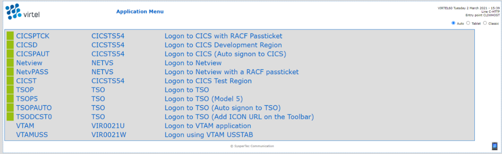
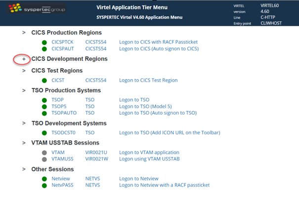
.. |image2| image:: images/media/image2.png

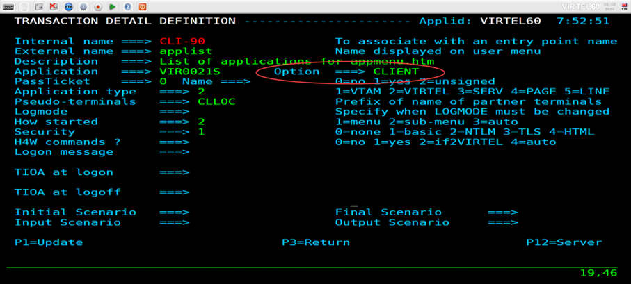
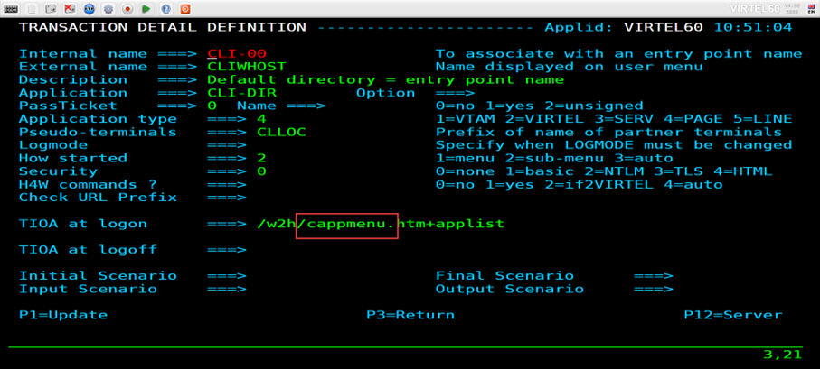
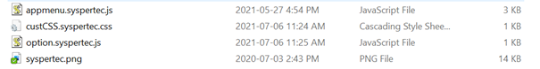
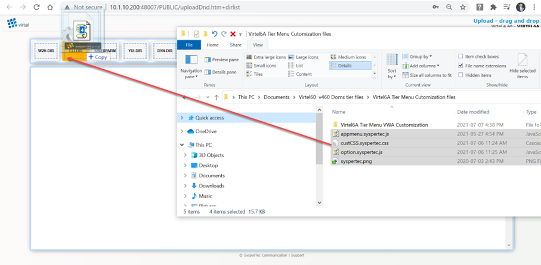
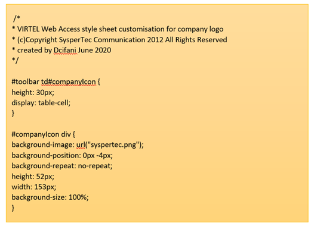
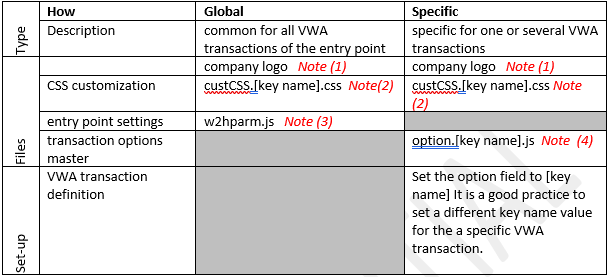
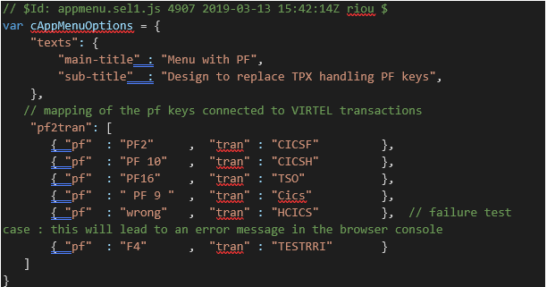
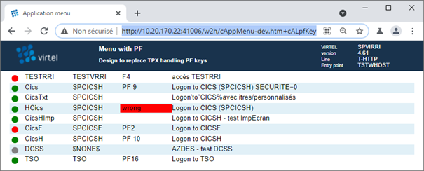
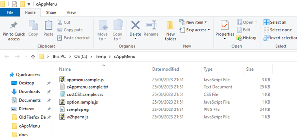