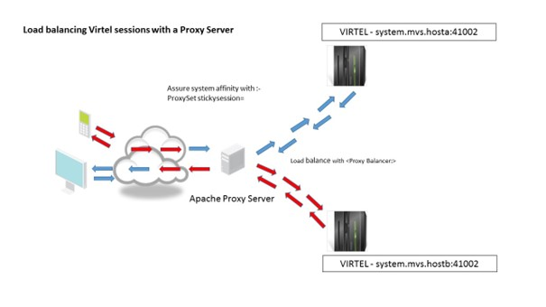

.. _tn202305:

Running multiple instances of Virtel
====================================

Introduction
------------

The ability to run multiple instances of Virtel across a mainframe platform provides the reliability, availability and serviceability (RAS) components that today’s software demands. Virtel exploits the IBM z/OS platform to achieve High Availability and Load Balancing across the Virtel instances that are running in a client environment. Virtel can be installed in multiple instances and provide a single access point. This can be as several instances running on one LPAR, known as a Multiplex installation, or across several LPARS, known as a Virplex. Also, Virtel can be front ended by an external reverse proxy server. This server will deal with load balancing across the Virtel instances and maintaining a single point of entry. This newsletter discusses the issues raised when implementing these multi-instance scenarios. the different setups required and how Virtel exploits the IBM technologies to achieve the desired results. 

In the following example we look at three Virtel scenarios: -

1. XVTAM	Using VTAM Generic Resources to access 3270 applications		
2. MultiSys Running multiple Virtel instances on one LPAR using QLNK definitions.
3. Virplex	Running multiple Virtel instances using IBM’s Sysplex Distributor. 
4. XServer	Using an external reverse proxy server to access multiply instances.	

In each case, the user access is through a single point of entry using one port. ARBO and TRSF files can be shared across the Virtel instances if required. A separate Administration Virtel is normally used to maintain the Virtel environment. 

XVTAM Example 
-------------

|image0|

*Fig 1 - Using VTAM Generic Resources* 

Virtel is using several Sysplex technologies to achieve this configuration. For example, Virtel is using VTAM Generic Resources to facilitate access to the Virtel Administration functions from either instance of Virtel. VTAM generic resources can be used to distribute workloads across applications that perform the same task or function. Administration of the ARBO file is through the Virtel Administrator who can logon on to Virtel using the generic Virtel ACB name VIRTPLEX. This generic ACB enables management of the ARBO file through either VIRTEL1A or VIRTEL2A. This can be useful, for example, If SYSA was down for maintenance. VIRTEL administration could still conducted via VIRTEL2A access. No change would be necessary to any session management tools.

Here are the relevant definitions required to support the VTAM generic resource within Virtel.

VIRTEL TCT
^^^^^^^^^^

::

	GRNAME=VIRTPLEX,        VTAM GENERIC RESOURCE NAME 

SYSPLEX definitions
^^^^^^^^^^^^^^^^^^^

The ISTGENERIC structure will have to be allocated before you can use VTAM generic resources. See the IBM Network Implementation Guide for further information on configuring the CFRM. Use the following command to display coupling allocation details for ISTGENERIC.

::

    D XCF,STR,STRNM=ISTGENERIC

VTAM display of the generic resource
The results from the D NET,ID=VTAMPLEX,E identifies the two Virtel instances which are grouped into the generic resource name VIRTPLEX. The example below shows VIRTEL1A and VIRTEL2A as participating in the VIRTRPLEX resource name group.

::

    D NET,ID=VIRTPLEX,E                                            
    IST097I DISPLAY ACCEPTED                                       
    IST075I NAME = VIRTPLEX, TYPE = GENERIC RESOURCE 917           
    IST1359I MEMBER NAME        OWNING CP   SELECTABLE  APPC       
    IST1360I SPNET.VIRTEL1A     ZAM1SSCP       YES       NO        
    IST1360I SPNET.VIRTEL2A     ZAM2SSCP       YES       NO        
    IST2210I GR PREFERENCE TABLE ENTRY = **DEFAULT**               
    IST2202I GREXIT   = NO       WLM      = YES      LOCLU    = YES
    IST2204I LOCAPPL  = YES      PASSOLU  = NO                     
    IST314I END                                                      

When the VIRTEL*A application is display in VTAM the following messages are written to the console log:-

::

    D NET,ID=VIRTEL1A,E                                                
    IST097I DISPLAY ACCEPTED                                           
    IST075I NAME = SPNET.VIRTEL1A, TYPE = APPL 925                     
    IST486I STATUS= ACT/S, DESIRED STATE= ACTIV                        
    IST1447I REGISTRATION TYPE = CDSERVR                               
    IST1363I GENERIC RESOURCE NAME VIRTPLEX REPRESENTS SPNET.VIRTEL1A  
    IST977I MDLTAB=***NA*** ASLTAB=***NA***                            
    IST861I MODETAB=***NA*** USSTAB=***NA*** LOGTAB=***NA***           
    IST934I DLOGMOD=***NA*** USS LANGTAB=***NA***                      
    IST1632I VPACING =  7                                              
    IST1938I APPC = NO                                                 
    IST597I CAPABILITY-PLU ENABLED  ,SLU ENABLED  ,SESSION LIMIT NONE  
    IST231I APPL MAJOR NODE = APPLVIPX                                 
    IST654I I/O TRACE = OFF, BUFFER TRACE = OFF                        
    IST1500I STATE TRACE = OFF                                         
    IST271I JOBNAME = SPVIR1A, STEPNAME = SPVIR1A, DSPNAME = ISTEBBDB  
    IST228I ENCRYPTION = OPTIONAL , TYPE = DES                         
    IST1563I CKEYNAME = VIRTEL1A CKEY = PRIMARY CERTIFY = NO           
    IST1552I MAC = NONE MACTYPE = NONE                                 
    IST1050I MAXIMUM COMPRESSION LEVEL - INPUT = 0, OUTPUT = 0         
    IST1633I ASRCVLM = 1000000                                         
    IST1634I DATA SPACE USAGE: CURRENT = 0 MAXIMUM = 1280              
    IST171I ACTIVE SESSIONS = 0000000001, SESSION REQUESTS = 0000000000
    IST206I SESSIONS:                                                  
    IST634I NAME     STATUS         SID          SEND RECV VR TP NETID 
    IST635I SC0TCP13 ACTIV-S    CA7B8B52D125F31F 0003 0001       SPNET 
    IST314I END                                                         
	
Message IST1363I confirms that VIRTEL operating under the ACB of VIRTEL1A is associated with the VTAM resource name VIRTPLEX. Using Virtel and VTAM Generic Resource Names to balance workload in a SYSPLEX environment. In the following configuration we can see how the VTAM generic resource facility can also be used to distribute workloads across applications. In this example there are several CICS TOR regions within CICSA, CICSB and CICSC that are accessed through a VTAM generic resource name or CICSPLEX group name. VIRTEL uses this name to access the CICS application. The WLM and/or VTAM will distribute sessions across the members of the CICS generic resource name.	

|image1|

*Fig 2 - Using VTAM Generic resources to balance workload*   

From a High Availability aspect both CICSA and CICSB could both be down and service would still be provided by CICSC either through VIRTEL1A or VIRTEL2A. In this configuration VIRTEL exploits SYSPLEX technologies to provide a HA solution. The only VIRTEL requirement is to define a VIRTEL transaction which targets CICSZ as the VTAM application, i.e. the VTAM Generic Resource or CICSPLEX group name.

 
MultiSys Example using QLNK
---------------------------

In this scenario we run three instances of Virtel on the same LPAR to front end 3270 applications like TSO and CICS. The IBM TCPIP SHARED PORT feature is utilized to provide a single access point to all three Virtel instances. In this case PORT 31020. An Administration of Virtel is run as an administration instance. The administration instance has read write access to the shared files.  

|image2|

*Fig 3 – MultiSys Example using 1 LPAR*

The Virtel instances communicate through internal QLNK paths. This internal communication provides session affinity across the Virtel instances. The shared IBM TCPIP PORT provides a single point of entry and load balancing, either RoundRobin or WLM, across the Virtel User instances. The shared port is configured within TCPIP using an obey file. An example is provide below : -

::

    ;VARY TCPIP,,O,SPTHOLT.VIRMULTI.CNTL(OBPROF00)              
    DELETE PORT 31020 TCP SPVIREH0                             
    DELETE PORT 31020 TCP SPVIREH1                             
    DELETE PORT 31020 TCP SPVIREH2                             
                                                                
    PORT                                                        
    ; VIRPLEX  Range                                            
    31020 TCP SPVIREH0 SHAREPORT    ; Virtel Portshare        
    31020 TCP SPVIREH1              ; Virtel Portshare        
    31020 TCP SPVIREH2              ; Virtel Portshare        

Sharing the ARBO and other VSAM files
^^^^^^^^^^^^^^^^^^^^^^^^^^^^^^^^^^^^^

When running multiple versions of Virtel, a Multisys or Virplex for example, there is the ability to share the Virtel VSAM files, like the TRSF and ARBO file.  Shared VSAM files must be accessed only in READ mode only by user instances. An administrator instance of Virtel can access the files in READWRITE mode. To support the access modes the following TCT parameter should be coded:-

::

    VSAMTYP=READONLY | WRITER

The following VSAM files may be shared by User Virtel instances in a READONLY mode: -

::

    VIRARBO 
    ****TRSF
    VIRHTML

The following files are unique to Virtel and each instance must have their own set: -

::

    VIRSWAP
    VIRSTAT 	(Unless Logger is being used) 

In the TCT, for both READONLY and WRITER, the UFILEn statements should have the options 0,10 and 05 and MACRF statements should be defined as MACRF=(SEQ,DIR): -

::

                UFILE1=(SAMPTRSF,ACBH1,0,10,05),                      
                UFILE2=(HTMLTRSF,ACBH2,0,10,05),                      
                UFILE3=(VIRHTML,ACBH3,0,10,05),                       
                GATE=GENERAL,                                         
                NBCVC=32,                                             
                SILENCE=NO,                                           
                COMPANY='SYSPERTEC COMMUNICATION',                    
                …….                                      
                TITRE1='S Y S P E R T E C  C O M M U N I C A T I O N',
                TITRE2='V I R T E L 0 0'                              
    ACBH1    ACB   AM=VSAM,DDNAME=SAMPTRSF,MACRF=(SEQ,DIR),              
                STRNO=3                                               
    ACBH2    ACB   AM=VSAM,DDNAME=HTMLTRSF,MACRF=(SEQ,DIR),              
                STRNO=3                                               
    ACBH3    ACB   AM=VSAM,DDNAME=VIRHTML,MACRF=(SEQ,DIR),               
                STRNO=3                                                
    When Virtel is started the message VIR0024I will be issued for each VSAM file and will indicate the access mode: -
    
    VIR0024I OPENING FILE VIRARBO                                   
    VIR0024I READ ONLY                                              
    VIR0024I OPENING FILE VIRSWAP                                   
    VIR0024I OPENING FILE VIRHTML                                   
    VIR0024I READ ONLY                                              
    VIR0024I OPENING FILE SAMPTRSF                                  
    VIR0024I READ ONLY                                              
    VIR0024I OPENING FILE HTMLTRSF                                  
    VIR0024I READ ONLY                                              
    VIR0024I ATTACHING SUBTASKS                                     

Note:- The VSAM Share Options should be SHR(2,3). Do not set the SHROPTIONS to (4,3) as this will have undesirable results!

Example of 4 Virtel instances on the same LPAR. One is a writer (SPVIREH99), the others are READONLY User instances.

|image3|

*Fig 4 – MultiSys Instances on one LPAR*

Displaying the Lines command for any one of the three User Instances will provide the IP configuration for the environment: -

|image4|

*Fig 5 – Line display for a MultiSys environment*

The common port is port 31020 and this is supported by the V-HTTP line. The URL to access the User Applist will be: - 

::

    http://10.20.170.71:31020

As each request comes in the port sharing feature of TCPIP will round robin the requests across the VIRTEL instances – SPVIREH0, SPVIREH1 and SPVIREH2.  

Virtel naming conventions with multiple tasks on the same LPAR
^^^^^^^^^^^^^^^^^^^^^^^^^^^^^^^^^^^^^^^^^^^^^^^^^^^^^^^^^^^^^^

The Administration instance, SPVIREH9, can be used to examine the line and terminal definitions that support this scenario. The display the terminals for V-HTTP looks like: -

|image5|

Fig 6 – MultiSys Terminal display 

A Virtel pool is defined as *VPXPOOL supporting 10 internal relays beginning VPVTA000. The terminals that associated with this pool are defined using the sysclone plus(+) character as the second  and third digit and any alphanumeric character as the last three digits. Logging on to TSO a session is generated with the following terminal assignments: -

|image6|

*Fig 7 – MultiSys terminal allocation*

VTAM terminal RT1VTAAA and VTAM printer RT1IMAAA are used from the Virtel pool in setting up the session. 

In the Virtel log for SPVIREH2, the allocated instance to support this session, we see the following session setup messages from Virtel SPVIREH2: -

::

    18.57.43 JOB04765  VIRT906I HTTP-VPX SOCKET 00030000 CALL FROM 10.20.92.20:63394 
    18.57.43 JOB04765  VIRHT51I HTTP-VPX CONNECTING VPLOC079 TO 10.20.92.20:63394    
    18.57.43 JOB04765  VIRC121E PAGE NOT FOUND FOR VPLOC079 CALLER 10.20.92.20  427  
    427              ENTRY POINT 'VPXWHOST' DIRECTORY 'VPXWHOST'(VPX-DIR  VPX-KEY ) 
    427                    PAGE : 'FAVICON.ICO' URL : '/favicon.ico'                
    18.57.43 JOB04765  VIR0052I VPLOC079 DISCONNECTED AFTER   0 MINUTES                
    18.57.52 JOB04765  VIRHT51I HTTP-VPX CONNECTING VPLOC079 TO 10.20.92.20:63394    
    18.57.52 JOB04765  VIR0052I VPLOC079 DISCONNECTED AFTER   0 MINUTES                
    18.57.54 JOB04765  VIRHT51I HTTP-VPX CONNECTING VPVTA009 TO 10.20.92.20:63394    
    18.57.54 JOB04765  VIR0919I VPVTA009 RELAY RT1VTAAA(VPXTP000) ACTIVATED            
    18.57.54 JOB04765  VIR0919I VPVTA009 RELAY RT1IMAAA(VPXIM000) ACTIVATED            
    18.57.54 JOB04765  VIRHT51I HTTP-VPX CONNECTING VPVTA008 TO 10.20.92.20:63394     

T1 is the sysclone value substituted into the terminal name and AAA is the suffix derived from the <<< string. The sysclone value is taken from the system &SYSCLONE definitions. 

::

    NC0000000 SPT1     23182 19:01:29.76 SPTHOLT  00000290  D SYMBOLS                               
    MR0000000 SPT1     23182 19:01:29.79 SPTHOLT  00000090  IEA007I STATIC SYSTEM SYMBOL VALUES 468 
    DR                                        468 00000090   &SYSALVL.          = "2"               
    DR                                        468 00000090   &SYSCLONE.         = "T1"              
    DR                                        468 00000090   &SYSNAME.          = "SPT1"               

Using the plus(+) feature of Virtel enables the porting of “common” definitions to different LPARS whereby the sysclone would make the definitions unique to that LPAR. This avoids VTAM conflicts when assigning sessions. The VTAM definitions for this scenario look like: -

::

    * ------------------------------------------------------------------ *  
    * VIRPLEX     : VIRTELnn ACB Definitions. Match to LINE Names        *  
    * ------------------------------------------------------------------ *  
    VIRTEL?? APPL  EAS=160,AUTH=(ACQ,BLOCK,PASS,SPO)                        
    R&SYSCLONE.VT??? APPL  AUTH=(ACQ,PASS),MODETAB=ISTINCLM,               X
                DLOGMOD=SNX32702,EAS=1                                   
    R&SYSCLONE.IM??? APPL  AUTH=(ACQ,PASS),MODETAB=ISTINCLM,DLOGMOD=SCS,   X
                EAS=1                                                    

To use the sysplus(+) coding with the Virtel definitions the TCT must be defined with : -

::

    SYSPLUS=YES,            SYSPLEX SUPPORTED

 
VirPlex Example using Sysplex Distributor
-----------------------------------------

Using a Dynamic VIPA with IBM’s SYSPLEX Distributor (SD) you can balance Virtel session workload across more than one LPAR. In this scenario we run Virtel instances on separate LPARS and use SD to balance the incoming workload.

|image7|

*Fig 8 – Virplex using Sysplex distributor* 

 The distributing TCPIP stack will balance workload across the participating target TCPIP stacks. Allocation of new sessions on the IP side will depend on the selected SD algorithm. For example, this can be a Round Robin policy or WLM policy workload algorithm. Central point of access is through using distributed VIPA address which is defined in a TCPIP profile. In the configuration above it is defined as 10.20.190.15. The relevant PROFILE definitions for TCPIP would look like: -

::

    VIPADYNAMIC                                                                  
        VIPARANGE DEFINE MOVEABLE NONDISRUPTIVE 255.255.255.0 10.20.170.20     
        VIPADEFINE MOVE IMMED 255.255.255.0 10.20.170.15                       
        VIPADISTRIBUTE DEFINE TIMEDAFF 300 DISTMETHOD ROUNDROBIN 10.20.170.15  
        DESTIP ALL                                                               
    ENDVIPADYNAMIC                                                               

It is essential to include the TIMEDAFF parameter in the VIPA definition as this maintains session affinity. The TIMEDAFF facility ensures that a user will always connect to the same VIRTEL while a session is open. Also, it is recommended that the Virtel line W-HTTP (port 41001) is used for Virtel Administration and a shared port is used to access to applications. 

Line W-HTTP should be defined using the base address of the LPAR (i.e. the home address of the default interface) by specifying only the port number. For example:

::
 
    Local address ==> :41001

Line V-HTTP, the common access point, should be defined in the ARNBO using the distributed VIPA address with port number:

::

    Local address ==> 10.20.170.15:31020

The Virtel Line display command displays this configuration:

::

    F SPVIREH0,LINES                                                  
    VIR0200I LINES                                                    
    VIR0201I VIRTEL 4.62 APPLID=VIRTEL00 LINES                        
    VIR0202I ALLOCATED IP ADDRESS = 10.20.170.83    < Local IP address                      
    VIR0202I INT.NAME EXT.NAME TYPE  ACB OR IP                        
    VIR0202I -------- -------- ----- ---------                        
    VIR0202I W-HTTP           *GATE                              
    VIR0202I C-HTTP           *GATE                             
    VIR0202I D-HTTP   HTTP-CLI TCP1  :41003                           
    VIR0202I E-HTTP   HTTP-CLI TCP1  :41123                           
    VIR0202I L-HTTP   HTTP-CLI TCP1  ÝFD10:15C1:1921:1000::129¨:41005 
    VIR0202I S-PLEX   PLEX-SYS*XRC   *NONE*                           
    VIR0202I V-HTTP   HTTP-VPX TCP1  10.20.190.15:31020  < Dynamic VIPA             
    VIR0202I X-HTTP   HTTP-ESH TCP1  ÝFD10:15C1:1921:1000::129¨:41003 
    VIR0202I ---END OF LIST---                                        

 
Virtel naming conventions with multiple tasks on different LPARS
----------------------------------------------------------------

When running more than one VIRTEL STC care must be taken when defining the VTAM relay names that each VIRTEL task will use. In some cases, terminals have to be grouped in order to provide the necessary installation standards to to meet a particular naming convention. When running Virtel instances on different LPARS, for the high availability (HA) reasons, and probably on a different physical machine, the VTAM names employed must be unique. With Virtel you can define a single configuration within the ARBO and TCT which contains a unique pool of Virtel relays for each Virtel instance. Here are two possible ways to define the relay pools for multiple Virtel instances:

The first way is to include the SYSCLONE value as part of the LU name. The relay definitions utilize the system symbolic SYSCLONE value in the IEASYMxx member of PARMLIB. The clone value is taken from the system symbolic &SYSCLONE and is identified in the VIRTEL definitions through the + (plus) character:

::

    LIST of TERMINALS ---------------------------------- Applid: VIRTEL1A 15:11:01
                                                                                
    Terminal  Repeated Relay     Entry        Type   I/O  Pool     2nd Relay      
                                                                                
    CLLOC000  0050                            3      3                            
    CLVTA000  0080     *W2HPOOL               3      3                            
    DELOC000  0010                            3      3                            
    DEVTA000  0016     *W2HPOOL               3      3                            
    W2HIM000  0080     R+IM000                1      1                            
    W2HTP000  0080     R+VT000                3      3    *W2HPOOL R+IM000        

TCT definition
^^^^^^^^^^^^^^

In the configuration above there are two Virtel STCs running on different LPARS whose &SYSCLONE values are 1A and 2A. With the same TCT being used for both VIRTEL1A and VIRTEL2A the following is specified in the common TCT:-

:: 

            APPLID=VIRTEL+,
            SYSPLUS=YES,

This will means that the two Virtels STCs will have a VTAM APPLID of VIRTEL1A and VIRTEL2A.  The Virtel relay LU names are R1AVT000-079 for LPAR 1A, and R2AVT000-079 for LPAR 2A. 

Note: It is recommended that only the ARBO file can be shared in this configuration. 

The VTAM definition to support this configuration would like:-

::

    APPLVIPX VBUILD TYPE=APPL                                               
    * ------------------------------------------------------------------ *  
    * Product     :  VIRTEL                                              *  
    * Description :  APPL for VIRTEL SYSPLEX (SPVIR1A and SPVIR2A)       *  
    * ------------------------------------------------------------------ *  
    VIRTEL&SYSCLONE APPL EAS=160,AUTH=(ACQ,BLOCK,PASS,SPO),                *
                ACBNAME=VIRTEL&SYSCLONE                                  
    * ------------------------------------------------------------------ *  
    * R&SYSCLONEVTxxx : VTAM application relays for VIRTEL Web Access    *  
    * ------------------------------------------------------------------ *  
    R&SYSCLONE.VT??? APPL AUTH=(ACQ,PASS),MODETAB=ISTINCLM,                *
                DLOGMOD=SNX32702,EAS=1                                   
    * ------------------------------------------------------------------ *  
    * R&SYSCLONEIMxxx : Printer relays for VIRTEL Web Access terminals   *  
    * ------------------------------------------------------------------ *  
    R&SYSCLONE.IM??? APPL AUTH=(ACQ,PASS),MODETAB=ISTINCLM,                *
                DLOGMOD=SCS,EAS=1                                        
    R&SYSCLONE.IP??? APPL AUTH=(ACQ,PASS),MODETAB=ISTINCLM,                *
                DLOGMOD=DSILGMOD,EAS=1                                    

Because this naming convention could be constraining if you want to use 4-character LU names, there is a second method which allows you to freely choose the LU names without the need to include the SYSCLONE characters as part of the LU name. In the next example two pools are defined. Pool *W1APOOL has relay names J000-J999, K000-K999, L000-L999 for LPAR 1 (with printer names Pnnn,Qnnn,Rnnn), and pool *W2APOOL has relay names M000-M999, N000-N999, O000-O999 (with printer names Snnn,Tnnn,Unnn) for LPAR 2:

::

    Terminal  Repeated Relay     Entry        Type   I/O  Pool     2nd Relay      
                                                                                
    CLLOC000  0500                            3      3
    CLVTA000  1000     *W+POOL                3      3
    CLVTB000  1000     *W+POOL                3      3
    CLVTC000  1000     *W+POOL                3      3
    DELOC000  0010                            3      3
    DEVTA000  0016     *W+POOL                3      3
    W2HIP000  1000     P000                   1      1
    W2HIQ000  1000     Q000                   1      1
    W2HIR000  1000     R000                   1      1
    W2HIS000  1000     S000                   1      1
    W2HIT000  1000     T000                   1      1
    W2HIU000  1000     U000                   1      1
    W2HTJ000  1000     J000                   3      3    *W1APOOL P000
    W2HTK000  1000     K000                   3      3    *W1APOOL Q000
    W2HTL000  1000     L000                   3      3    *W1APOOL R000
    W2HTM000  1000     M000                   3      3    *W2APOOL S000
    W2HTN000  1000     N000                   3      3    *W2APOOL T000
    W2HTO000  1000     O000                   3      3    *W2APOOL U000

 
The VTAM definitions would be similar to those from the previous example except the &SYSCLONE would be replaced by the relay characters.

::

    APVIRT&SYSCLONE. VBUILD TYPE=APPL                                       
    * ------------------------------------------------------------------ *   
    * Product     :  VIRTEL                                              *   
    * Description :  Main ACB for VIRTEL application                     *   
    * ------------------------------------------------------------------ *   
    VIRTEL&SYSCLONE APPL AUTH=(ACQ,BLOCK,PASS,SPO),EAS=160,                + 
                ACBNAME=VIRTEL&SYSCLONE                                   
    * ------------------------------------------------------------------ *   
    * Jxxx,Kxxx   : VTAM application relays for VIRTEL Web Access        *   
    * Lxxx,Mxxx   : VTAM application relays for VIRTEL Web Access        *
    * Nxxx,Oxxx   : VTAM application relays for VIRTEL Web Access        *      
    * ------------------------------------------------------------------ *   
    J??? APPL  AUTH=(ACQ,PASS),MODETAB=ISTINCLM,DLOGMOD=SNX32702,EAS=1       
    K??? APPL  AUTH=(ACQ,PASS),MODETAB=ISTINCLM,DLOGMOD=SNX32702,EAS=1       
    L??? APPL  AUTH=(ACQ,PASS),MODETAB=ISTINCLM,DLOGMOD=SNX32702,EAS=1       
    M??? APPL  AUTH=(ACQ,PASS),MODETAB=ISTINCLM,DLOGMOD=SNX32702,EAS=1       
    N??? APPL  AUTH=(ACQ,PASS),MODETAB=ISTINCLM,DLOGMOD=SNX32702,EAS=1       
    O??? APPL  AUTH=(ACQ,PASS),MODETAB=ISTINCLM,DLOGMOD=SNX32702,EAS=1       
    * ------------------------------------------------------------------ *   
    * Pxxx,Qxxx   : Printer relays for VIRTEL Web Access terminals       *   
    * Rxxx,Sxxx   : Printer relays for VIRTEL Web Access terminals       *   
    * Txxx,Uxxx   : Printer relays for VIRTEL Web Access terminals       *   
    * ------------------------------------------------------------------ *
    P??? APPL AUTH=NVPACE,EAS=1,PARSESS=NO,MODETAB=ISTINCLM,SESSLIM=YES     
    Q??? APPL AUTH=NVPACE,EAS=1,PARSESS=NO,MODETAB=ISTINCLM,SESSLIM=YES     
    R??? APPL AUTH=NVPACE,EAS=1,PARSESS=NO,MODETAB=ISTINCLM,SESSLIM=YES     
    S??? APPL AUTH=NVPACE,EAS=1,PARSESS=NO,MODETAB=ISTINCLM,SESSLIM=YES        
    T??? APPL AUTH=NVPACE,EAS=1,PARSESS=NO,MODETAB=ISTINCLM,SESSLIM=YES     
    U??? APPL AUTH=NVPACE,EAS=1,PARSESS=NO,MODETAB=ISTINCLM,SESSLIM=YES    

Repeating terminal names with hexadecimal names.
""""""""""""""""""""""""""""""""""""""""""""""""

Terminal definition records in the VIRARBO file whose repeat count is greater than 1 may now contain special pattern characters in the "terminal name", "relay", and "2nd relay" fields. Multiple instances of the terminal will be generated at Virtel startup by incrementing the pattern characters according to the rules shown below. If a name contains no pattern characters then Virtel will increment the rightmost numeric portion of the name, as before.

Pattern characters:

>  Alphabetic A-Z
?  Alphanumeric A-Z, 0-9, $, #, @
%  Hexadecimal digits 0-9, A-F
<  Decimal digits 0-9

Notes:
•	Different combinations of pattern characters may be specified within a single field, for example RH>VT?%%
•	The terminal name and relay names do not have to follow the same pattern (see example below)
•	The '?' character cannot be used in the first character position of the terminal name field because this indicates a physical pool

::
 
    Example:
    Terminal name W2HVT000
    Relay name    RHTERM%%
    Relay2 name RH>X<Z00
    Repeat count  256

Would generate terminals W2HVT000-W2HVT255 with relay names RHTERM00-RHTERMFF and relay2 names RHAX0Z00-RHIX5Z00

 
XSERVER Using Virtel with Apache Proxy as a load balancing mechanism.
---------------------------------------------------------------------

Another way of balancing workloads across multiple Virtel instances is through an Apache Reverse Proxy Server. In this setup the proxy server load balances IP sessions across the known TCPIP stacks, very much like IBM’s Sysplex Distributor.

|image8|

*Fig 9 – Using an Apache Proxy Server*

Again, to maintain session affinity the correct load balancing parameters must be used.  An example from the http.conf looks like this: -

::

    #
    # Virtel
    # 

    ProxyPass / balancer://hostcluster/
    ProxyPassReverse / balancer://hostcluster/

    <Proxy balancer://hostcluster>
    BalancerMember http://syt00101.gzaop.local:41002 retry=5 
    BalancerMember http://syt00101.gzaop.local:51002 retry=5 
    ProxySet lbmethod=byrequests
    </Proxy>

For more information on setting up an Apache Proxy Server visit http://httpd.apache.org/docs/2.2/mod/mod_proxy_balancer.html
 
To use Apache as a Proxy Server it is essential that the correct configuration modules are loaded at startup:-

::

    # LoadModule foo_module modules/mod_foo.so
    LoadModule authz_host_module modules/mod_authz_host.so
    LoadModule auth_basic_module modules/mod_auth_basic.so
    LoadModule authn_file_module modules/mod_authn_file.so
    LoadModule authz_user_module modules/mod_authz_user.so
    #LoadModule authz_groupfile_module modules/mod_authz_groupfile.so
    LoadModule include_module modules/mod_include.so
    LoadModule log_config_module modules/mod_log_config.so
    LoadModule env_module modules/mod_env.so
    #LoadModule mime_magic_module modules/mod_mime_magic.so
    #LoadModule expires_module modules/mod_expires.so
    LoadModule headers_module modules/mod_headers.so
    LoadModule unique_id_module modules/mod_unique_id.so
    LoadModule setenvif_module modules/mod_setenvif.so
    LoadModule proxy_module modules/mod_proxy.so
    LoadModule proxy_connect_module modules/mod_proxy_connect.so
    #LoadModule proxy_ftp_module modules/mod_proxy_ftp.so
    LoadModule proxy_http_module modules/mod_proxy_http.so
    LoadModule mime_module modules/mod_mime.so
    #LoadModule dav_module modules/mod_dav.so
    #LoadModule dav_fs_module modules/mod_dav_fs.so
    LoadModule autoindex_module modules/mod_autoindex.so
    #LoadModule asis_module modules/mod_asis.so
    #LoadModule info_module modules/mod_info.so
    LoadModule cgi_module modules/mod_cgi.so
    LoadModule dir_module modules/mod_dir.so
    LoadModule actions_module modules/mod_actions.so
    #LoadModule speling_module modules/mod_speling.so
    #LoadModule userdir_module modules/mod_userdir.so
    LoadModule alias_module modules/mod_alias.so
    #LoadModule rewrite_module modules/mod_rewrite.so
    #LoadModule deflate_module modules/mod_deflate.so
    LoadModule proxy_balancer_module modules/mod_proxy_balancer.so  

Some other recommendations are:

::

    * Timeouts
    SSLDisable 
    SSLV3Timeout 18010 

    * Format log with router information
    LogFormat "%h %l %u %t \"%r\" %>s %b \"%{Referer}i\" \"%{User-Agent}i\" \"%{BALANCER_WORKER_ROUTE}e\"" combined 

    * set Max-Age to 12h (doesn't work with IE) 
    or 
    * enable mod_expires and set: (this should be checked) 
    ExpiresActive On 
    ExpiresDefault "access plus 16 h" 

See https://httpd.apache.org/docs/2.2/mod/mod_expires.html for more information.

 
Appendix A – Sample Definitions
-------------------------------

Sample TCPIP Parms for Sysplex Distributor
^^^^^^^^^^^^^^^^^^^^^^^^^^^^^^^^^^^^^^^^^^

::

    ZAMVS1
    ; 10.20.170.15 VIPA for SPVIR1A and SPVIR2A distribution tests           
                                                                            
    VIPADYNAMIC                                                                
        VIPARANGE DEFINE MOVEABLE NONDISRUPTIVE 255.255.255.0 10.20.170.20   
        VIPADEFINE MOVE IMMED 255.255.255.0 10.20.170.15                     
        VIPADISTRIBUTE DEFINE TIMEDAFF 300 DISTMETHOD ROUNDROBIN 10.20.170.15
        DESTIP ALL                                                             
    ENDVIPADYNAMIC                                                             

    ZAMVS2
    VIPADYNAMIC                                                            
        VIPARANGE DEFINE MOVEABLE NONDISRUPT 255.255.255.0 10.20.170.20  
        VIPABACKUP 100 10.20.170.15                                      
    ENDVIPADYNAMIC  

    Portshare Obey File   (VirPlex or MultiSys Scenario)

    ;VARY TCPIP,,O,SPTHOLT.VIRPLEX.CNTL(OBPROF00)        
    DELETE PORT 31020 TCP SPVIREH0                      
    DELETE PORT 31020 TCP SPVIREH1                      
    DELETE PORT 31020 TCP SPVIREH2                      
                                                        
    PORT                                                 
    ; VIRPLEX  Range                                     
    31020 TCP SPVIREH0 SHAREPORT    ; Virtel Portshare 
    31020 TCP SPVIREH1              ; Virtel Portshare 
    31020 TCP SPVIREH2              ; Virtel Portshare

Virtel Started task
^^^^^^^^^^^^^^^^^^^

::

    //**********************************************************************
    //* Maintained in SPTHOLT.VIRPLEX.CNTL                                                                 *
    //**********************************************************************
    //VIRTPLEX PROC QUAL=&HLQ,                                              
    //         QUALD=&HLQ..V&REL,           < TEST LIBRARY                  
    //         TCT=00,                             READ ONLY TCT (99 = R/W)        
    //         PROG=VIR0000,                PROGRAM TO CALL                 
    //         IP=10.20.170.30                  NOT USED BY READER              
    //VIRTPLEX EXEC PGM=&PROG,                                              
    //             TIME=1440,REGION=0M,                                     
    //             PARM='&TCT,&APPLID,,&IP'                                 
    //STEPLIB  DD  DSN=&QUALD..LOADLIB,DISP=SHR                             
    //DFHRPL   DD  DSN=&QUALD..LOADLIB,DISP=SHR                             
    //SERVLIB  DD  DSN=&QUALD..SERVLIB,DISP=SHR                             
    //* VSAM FILES SHARED                                                   
    //VIRARBO  DD  DSN=&QUAL..VIRPLEX.ARBO,DISP=SHR                         
    //USERTRSF DD  DSN=&QUAL..VIRPLEX.USER.TRSF,DISP=SHR                    
    //SAMPTRSF DD  DSN=&QUAL..VIRPLEX.SAMP.TRSF,DISP=SHR                    
    //HTMLTRSF DD  DSN=&QUAL..VIRPLEX.HTML.TRSF,DISP=SHR                    
    //VIRHTML  DD  DSN=&QUAL..VIRPLEX.HTML,DISP=SHR                         
    //* VSAM FILES UNIQUE                                                   
    //VIRSWAP  DD  DSN=&QUAL.&SYSCLONE..SWAP,DISP=SHR                       
    //* NVSAM                                                               
    //SYSOUT   DD  SYSOUT=*                                                 
    //VIRLOG   DD  SYSOUT=*                                                 
    //VIRTRACE DD  SYSOUT=*                                                 
    //SYSPRINT DD  SYSOUT=*                                                 
    //SYSUDUMP DD  SYSOUT=*                                                 

JCL to initiate USER instance of Virtel

::

    //PROCLIB JCLLIB ORDER=SPTHOLT.VIRPLEX.CNTL                
    //VIRTPLEX EXEC VIRTELD,TCT=00,HLQ=SPTHOLT.VIRTEL,REL=462, 
    // IP=10.20.170.83,APPLID=VIRTEL00                         

JCL to initiate Administration Instance of Virtel

::

    // SET SYSCLONE=99                                           
    //*                                                          
    //PROCLIB JCLLIB ORDER=SPTHOLT.VIRPLEX.CNTL                  
    //S01 EXEC VIRTELD,TCT=99,HLQ=SPTHOLT.VIRTEL,REL=462,        
    // IP=10.20.170.71,APPLID=VIRTEL99                           

TCT definitions
^^^^^^^^^^^^^^^

VIRTCT00   USER Instance
""""""""""""""""""""""""

::

            TITLE 'VIRTEL TCT USER'                          
            PRINT NOGEN                                                 
            VIRTERM TYPE=INITIAL,APPLID=VIRTEL+,                        
                SYSPLUS=YES,            SYSPLEX SUPPORTED             
                GRNAME=VIRTPLEX,        VTAM GENERIC RESOURCE         
                LANG='E',               LANGUAGE FOR USER MESSAGES    
                COUNTRY=US,             EBCDIC-ASCII TRANSLATION      
                DEFUTF8=IBM1140,        DEFAULT OUTPUT ENCODING UTF-8 
                CHARSET=,                                             
                GMT=SYSTZ,                                            
                TCP1=(TCPIP,,,12500),             <------             
                TRACTIM=LOCAL,                                        
                VIRSV1=(VIRSV),                                       
                HTVSAM=VIRHTML,                   <------             
                HTMINI=(1,1),                                         
                BUFSIZE=32000,                                        
                BFVSAM=32768,          --> FROM V453                  
                VSAMTYP=READONLY,      --> VIRPLEX READONLY           
                UPARMS=(USERPARM),     --> USER PARM ON               
                IGNLU=(W-HTTP,C-HTTP), --> DISABLE ADMIN AND CLI      
                ACCUEIL=YES,                                          
                DEFENTR=(PC,MINITEL),                                 
                CORRECT=00,                                           
                LOG=CONSOLE,                                          
                STATS=NO,             OR (MULTI,CONTINUE/TERMINATE)   
                APPSTAT=YES,                                          
                DONTSWA=YES,                                          
                NBDYNAM=250,                                          
                MEMORY=ABOVE,                                         
                MULTI=YES,RESO=NO,ARBO=YES,MINITEL=YES,               
                VIRSECU=NO,SECUR=(RACROUTE,RACF),                     
                RAPPL=FACILITY,RNODE=FACILITY,PRFSECU=SPVIREH,        
                UFILE1=(SAMPTRSF,ACBH1,0,10,05),                      
                UFILE2=(HTMLTRSF,ACBH2,0,10,05),                      
                UFILE3=(VIRHTML,ACBH3,0,10,05),                       
                UFILE4=(USERTRSF,ACBH4,0,10,05),                      
                GATE=GENERAL,                                         
                NBCVC=32,                                             
                SILENCE=NO,                                           
                ……    
                            
    ACBH1    ACB   AM=VSAM,DDNAME=SAMPTRSF,MACRF=(SEQ,DIR),              
                STRNO=3                                               
    ACBH2    ACB   AM=VSAM,DDNAME=HTMLTRSF,MACRF=(SEQ,DIR),                *
                STRNO=3                                                  
    ACBH3    ACB   AM=VSAM,DDNAME=VIRHTML,MACRF=(SEQ,DIR),                 *
                STRNO=3                                                  
    ACBH4    ACB   AM=VSAM,DDNAME=USERTRSF,MACRF=(SEQ,DIR),                *
                STRNO=3                                                  
            END 

VIRTCT99   Admin Instance
"""""""""""""""""""""""""

::

            TITLE 'VIRTEL TCT FOR ADMIN'                             
            PRINT NOGEN                                                    
            VIRTERM TYPE=INITIAL,APPLID=VIRTEL+,                          *
                SYSPLUS=YES,                                            *
                GRNAME=VIRTPLEX,                                        *
                LANG='E',               LANGUAGE FOR USER MESSAGES      *
                COUNTRY=US,             EBCDIC-ASCII TRANSLATION        *
                DEFUTF8=IBM1140,        DEFAULT OUTPUT ENCODING UTF-8   *
                CHARSET=,                                               *
                GMT=SYSTZ,                                              *
                TCP1=(TCPIP,,,240),     TCPIPNAME,,,MAXSOCKETS          *
                TRACTIM=LOCAL,                                          *
                VIRSV1=(VIRSV),                                         *
                HTVSAM=VIRHTML,                                         *
                HTMINI=(1,1),                                           *
                BFVSAM=32768,                                           *
                BUFSIZE=32000,                                          *
                VSAMTYP=WRITER,        ==> VIRPLEX WRITER INSTANCE      *
                IGNLU=(C-HTTP,V-HTTP), ==> DISABLE ANY USER LINES       *
                ACCUEIL=YES,                                            *
                DEFENTR=(PC,MINITEL),                                   *
                CORRECT=00,                                             *
                STATS=NO,                                               *
                LOG=CONSOLE,                                            *
                APPSTAT=YES,                                            *
                DONTSWA=YES,                                            *
                NBDYNAM=250,                                            *
                MEMORY=ABOVE,                                           *
                MULTI=YES,RESO=NO,ARBO=YES,MINITEL=YES,                 *
                VIRSECU=YES,SECUR=(RACROUTE,RACF),                      *
                RAPPL=FACILITY,RNODE=FACILITY,PRFSECU=SPVIREH,          *
                UFILE1=(SAMPTRSF,ACBH1,0,10,05),                        *
                UFILE2=(HTMLTRSF,ACBH2,0,10,05),                        *
                UFILE3=(VIRHTML,ACBH3,0,10,05),                         *
                UFILE4=(USERTRSF,ACBH4,0,10,05),                        *
                GATE=GENERAL,                                           *
                NBCVC=32,                                               *
                SILENCE=NO,                                             *
                …
    ACBH1    ACB   AM=VSAM,DDNAME=SAMPTRSF,MACRF=(SEQ,DIR),                *
                STRNO=3                                                  
    ACBH2    ACB   AM=VSAM,DDNAME=HTMLTRSF,MACRF=(SEQ,DIR),                *
                STRNO=3                                                  
    ACBH3    ACB   AM=VSAM,DDNAME=VIRHTML,MACRF=(SEQ,DIR),                 *
                STRNO=3                                                  
    ACBH4    ACB   AM=VSAM,DDNAME=USERTRSF,MACRF=(SEQ,DIR),                *
                STRNO=3                                                  
            END                                                            
                                                           
 
ARBO definitions
^^^^^^^^^^^^^^^^

Line using VIPA IP address

::
        
    *                                                                       
    (EN)* Line C-HTTP => entry point CLIWHOST => directory CLI-DIR          
    *                                                                       
        LINE     ID=C-HTTP,                                               
                NAME=HTTP-CLI,                                           
                LOCADDR=10.20.170.15:41002,                            
            (EN) DESC='HTTP line (entry point CLIWHOST)',                 
                TERMINAL=CL,                                             
                ENTRY=CLIWHOST,                                          
                TYPE=TCP1,                                               
                INOUT=1,                                                 
                PROTOCOL=VIRHTTP,                                        
                TIMEOUT=0000,                                            
                ACTION=0,                                                
                WINSZ=0000,                                              
                PKTSZ=0000,                                              
                RETRY=0010                                               

Pools
^^^^^

::

    (EN)* Relay pool for VIRTEL Web Access HTTP lines. Note use of + which becomes &SYSCLONE     
    *                                                                     
        TERMINAL ID=W2HTP000,                                           
                RELAY=R+VT000,                                	< VTAM LU NAME to use   
                POOL=*W2HPOOL,              				< Define Pool Name                           
            (EN) DESC='Relay pool for HTTP',                            
            (FR) DESC='Pool de relais HTTP',                            
                RELAY2=R+IM000,					< Identify secondary LU                                       
                TYPE=3,                                                
                COMPRESS=2,                                            
                INOUT=3,                                               
                STATS=26,                                              
                REPEAT=0080                                            
        TERMINAL ID=W2HIM000,                                           
                RELAY=R+IM000,                                        
            (EN) DESC='SCS printers (LUTYPE1) for HTTP',                
            (FR) DESC='Imprimantes SCS (LUTYPE1) pour HTTP',            
                TYPE=S,                                                
                COMPRESS=2,                                            
                INOUT=1,                                               
                STATS=26,                                              
                REPEAT=0080                                            
        TERMINAL ID=W2HIP000,                                           
                RELAY=R+IP000,                                        
            (EN) DESC='3270 printers (LUTYPE3) for HTTP',               
            (FR) DESC='Imprimantes 3270 (LUTYPE3) pour HTTP',           
                TYPE=P,                                                
                COMPRESS=2,                                            
                INOUT=1,                                               
                STATS=26,                                              
                REPEAT=0080                                            
        
 
Terminals
^^^^^^^^^

::

        TERMINAL ID=CLLOC000,                                    
            (EN) DESC='HTTP terminals (no relay)',               
            (FR) DESC='Terminaux HTTP sans relais',              
                TYPE=3,                                         
                COMPRESS=2,                                     
                INOUT=3,                                        
                STATS=26,                                       
                REPEAT=0050                                     
        TERMINAL ID=CLVTA000,   					<Terminal Prefix                                 
                RELAY=*W2HPOOL,                               <Identify Pool  
            (EN) DESC='HTTP terminals (with relay)',             
            (FR) DESC='Terminaux HTTP avec relais',              
                TYPE=3,                                         
                COMPRESS=2,                                     
                INOUT=3,                                        
                STATS=26,                                       
                REPEAT=0080                                     

Entry Point and Transactions
^^^^^^^^^^^^^^^^^^^^^^^^^^^^

::

    ENTRY    ID=CLIWHOST,                                            
        (EN) DESC='HTTP entry point (CLIENT application)',           
            TRANSACT=CLI,     					< Transaction Prefix                                      
            TIMEOUT=0720,                                           
            ACTION=0,                                               
            EMUL=HTML,                                              
            SIGNON=VIR0020H,                                        
            MENU=VIR0021A,                                          
            IDENT=SCENLOGM,                                         
            EXTCOLOR=E                                              
    TRANSACT ID=CLI-00,          					< Use CLI as prefix                                    
            NAME=CLIWHOST,                                          
        (EN) DESC="Default directory = entry point name",            
            APPL=CLI-DIR,                                           
            TYPE=4,                                                 
            TERMINAL=CLLOC,                                         
            STARTUP=2,                                              
            SECURITY=0,                                             
            TIOASTA='/w2h/appmenu.htm+applist'                       

    . . .

    TRANSACT ID=CLI-10,				<Start with CLI. Associate with Entry Point                           
            NAME='Cics',                         
        (EN) DESC='Logon to CICS',                
            APPL=DBDCCICS,                       
            TYPE=1,                              
            TERMINAL=CLVTA,			<Identify Terminal Prefix			                      
            STARTUP=1,                           
            SECURITY=1                           
    TRANSACT ID=CLI-14,                           
            NAME='IMS',                          
        (EN) DESC='Logon to IMS',                 
            APPL=IMS3270,                        
            TYPE=1,                              
            TERMINAL=CLVTA,                      
            STARTUP=1,                           
            SECURITY=1                           

VTAM Definitions
^^^^^^^^^^^^^^^^

::

    APPLVIPX VBUILD TYPE=APPL                                                
    * ------------------------------------------------------------------ *   
    * Product     :  VIRTEL                                              *   
    * Description :  APPL for VIRTEL SYSPLEX (SPVIR1A and SPVIR2A)       *   
    * ------------------------------------------------------------------ *   
    VIRTEL&SYSCLONE APPL EAS=160,AUTH=(ACQ,BLOCK,PASS,SPO),                * 
                ACBNAME=VIRTEL&SYSCLONE                                   
    * ------------------------------------------------------------------ *   
    * R&SYSCLONEVTxxx : VTAM application relays for VIRTEL Web Access    *   
    * ------------------------------------------------------------------ *   
    R&SYSCLONE.VT??? APPL AUTH=(ACQ,PASS),MODETAB=ISTINCLM,                * 
                DLOGMOD=SNX32702,EAS=1                                    
    * ------------------------------------------------------------------ *   
    * R&SYSCLONEIMxxx : Printer relays for VIRTEL Web Access terminals   *   
    * ------------------------------------------------------------------ *   
    R&SYSCLONE.IM??? APPL AUTH=(ACQ,PASS),MODETAB=ISTINCLM,                * 
                DLOGMOD=SCS,EAS=1                                         
    R&SYSCLONE.IP??? APPL AUTH=(ACQ,PASS),MODETAB=ISTINCLM,                * 
                DLOGMOD=DSILGMOD,EAS=1                                    

Screen shot of terminal definitions

|image9|

*Fig 10 - Terminal definitions*

Startup SYSLOG
^^^^^^^^^^^^^^

::

    S SPVIR2A                                                           
    $HASP100 SPVIR2A  ON STCINRDR                                       
    IEF695I START SPVIR2A  WITH JOBNAME SPVIR2A  IS ASSIGNED TO USER    
    SPVIRSTC, GROUP SPGPTECH                                            
    $HASP373 SPVIR2A  STARTED                                           
    IEF403I SPVIR2A - STARTED - TIME=09.17.10                           
    VIR6004I ATTACH VIRSV SUCCESSFUL TCB=008F8368 PROG=VSVTINIT         
    VSV0207I VIRSV V3R3 STARTED                                         
    VIR6006I INITIALIZE VIRSV SUCCESSFUL                                
    VIR6012I ATTACH VIRTEL SUCCESSFUL TCB=008CF610 PROG=VIR6001         
    VIR0096I VIRTEL IS USING VIRTCT 'VIRTCT2A'                          
    VIR0000I STARTING LICENCE P500 - PERMANENT (2999 - 12 - 31)         
    VIR0018I VIRTEL 4.57 HAS THE FOLLOWING PTF(S) APPLIED               
    VIR0018I 5530,5540,5549,5557,5559,5559A,5567,5598                   
    VIR0018I 5598A,5598B,5602,5602A,5609,5609A,5613,5637                
    VIR0089I VIRTEL RUNNING FROM AN AUTHORIZED LIBRARY                  
    VIR0860I VIRTEL IS USING RACROUTE SECURITY                          
    VIR0861I MIXED-CASE PASSWORD SUPPORT IS ACTIVE                      
    VIR0093I VTAM GENERIC RESOURCE NAME IS VIRTPLEX           			< VTAM Generic          
    VIR0024I OPENING FILE VIRARBO                                       
    VIR0024I READ ONLY                                                  
    VIR0024I OPENING FILE VIRSWAP                                       
    VIR0024I OPENING FILE VIRHTML                                       
    VIR0024I READ ONLY                                                  
    VIR0024I OPENING FILE SAMPTRSF                                      
    VIR0024I READ ONLY                                                  
    VIR0024I OPENING FILE HTMLTRSF                                      
    VIR0024I READ ONLY                                                  
    VIR0024I ATTACHING SUBTASKS                                         
    VIR0235I VIRTEL LOG ROUTINE VIR0002A LOADED                         
    VIR0024I READING VIRARBO                                            
    VIR0000I THIS COPY OF VIRTEL IS FOR THE EXCLUSIVE USE OF:           
    VIR0000I SYSPERTEC COMMUNICATION                                    
    VIR0000I 196 BUREAUX DE LA COLLINE                                  
    VIR0000I 92213 SAINT CLOUD CEDEX                                    
    VIR0000I HTTP Date: Wed, 13 Mar 2019 08:17:14 GMT                   
    VIR0000I SMTP Date: Wed, 13 Mar 2019 09:17:14 +0100                 
    VIR0099I VIRTEL2A STARTED AT 13/03/19  9:17:14 , VERSION 4.57   		< VTAM    
    VIR0900I LICENCE P500 - PERMANENT (2999 - 12 - 31)                  
    VIRHT01I HTTP INITIALISATION FOR HTTP-CLI (A-HTTP  ), VERSION 4.57  
    VIRHT01I HTTP INITIALISATION FOR HTTP-CLI (B-HTTP  ), VERSION 4.57  
    VIRHT01I HTTP INITIALISATION FOR HTTP-CLI (C-HTTP  ), VERSION 4.57  
    VIRHT01I HTTP INITIALISATION FOR PCL2PDF  (P-PCLPDF), VERSION 4.57  
    VIRHT01I HTTP INITIALISATION FOR HTTP-W2H (W-HTTP  ), VERSION 4.57  
    VIR0505I LINKING TERMINAL ALLOC000 TO A-HTTP                        
    VIR0505I LINKING TERMINAL ALLOC001 TO A-HTTP                        
    VIR0505I LINKING TERMINAL ALLOC002 TO A-HTTP                        
 
VTAM Displays
^^^^^^^^^^^^^

::

    D NET,ID=VIRTEL2A,E                                                 
    IST097I DISPLAY ACCEPTED                                            
    IST075I NAME = SPNET.VIRTEL2A, TYPE = APPL 755                      
    IST486I STATUS= ACTIV, DESIRED STATE= ACTIV                         
    IST1447I REGISTRATION TYPE = CDSERVR                                
    IST1363I GENERIC RESOURCE NAME VIRTPLEX REPRESENTS SPNET.VIRTEL2A   
    IST977I MDLTAB=***NA*** ASLTAB=***NA***                             
    IST861I MODETAB=***NA*** USSTAB=***NA*** LOGTAB=***NA***            
    IST934I DLOGMOD=***NA*** USS LANGTAB=***NA***                       
    IST1632I VPACING =  7                                               
    IST1938I APPC = NO                                                  
    IST597I CAPABILITY-PLU ENABLED  ,SLU ENABLED  ,SESSION LIMIT NONE   
    IST231I APPL MAJOR NODE = APPLVIPX                                  
    IST654I I/O TRACE = OFF, BUFFER TRACE = OFF                         
    IST1500I STATE TRACE = OFF                                          
    IST271I JOBNAME = SPVIR2A, STEPNAME = SPVIR2A, DSPNAME = ISTD6217   
    IST228I ENCRYPTION = OPTIONAL , TYPE = DES                          
    IST1563I CKEYNAME = VIRTEL2A CKEY = PRIMARY CERTIFY = NO            
    IST1552I MAC = NONE MACTYPE = NONE                                  
    IST1050I MAXIMUM COMPRESSION LEVEL - INPUT = 0, OUTPUT = 0          
    IST1633I ASRCVLM = 1000000                                          
    IST1634I DATA SPACE USAGE: CURRENT = 0 MAXIMUM = 0                  
    IST171I ACTIVE SESSIONS = 0000000000, SESSION REQUESTS = 0000000000 
    IST172I NO SESSIONS EXIST                                           
    IST314I END                                                         

VTAM Generic Resource  - VIRTPLEX
^^^^^^^^^^^^^^^^^^^^^^^^^^^^^^^^^

Logon to VIRTPLEX (Administration Interface). From any 3270 session – “L VIRTPLEX” brings up Virtel Interface. Here we logon to VIRTPLEX through a Virtel session:-

1.	Virtel

|image10|

2. Logon onto VIRTPLEX

|image11|

.. |image1| image:: images/media/image1.png
.. |image2| image:: images/media/image2.png
.. |image3| image:: images/media/image3.png
.. |image4| image:: images/media/image4.png
.. |image5| image:: images/media/image5.png
.. |image6| image:: images/media/image6.png
.. |image7| image:: images/media/image7.png

.. |image9| image:: images/media/image9.png

