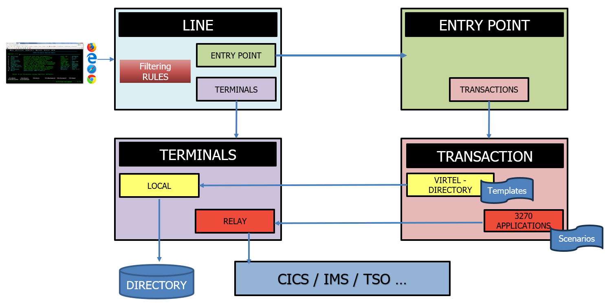
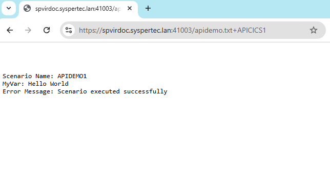
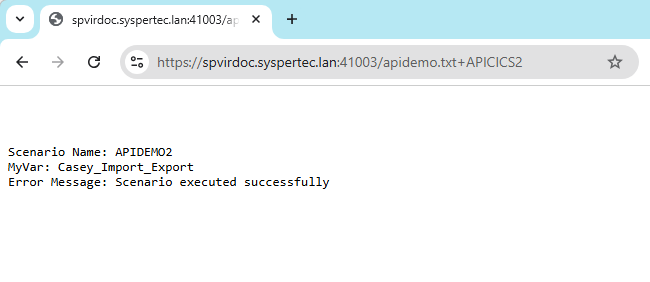
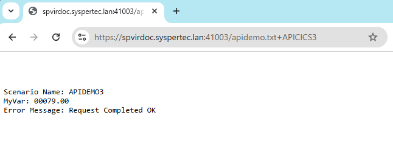
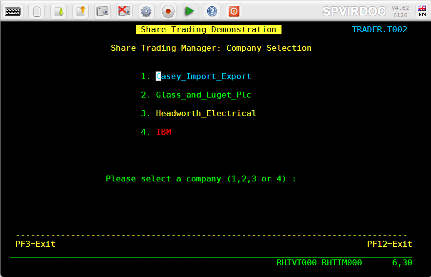
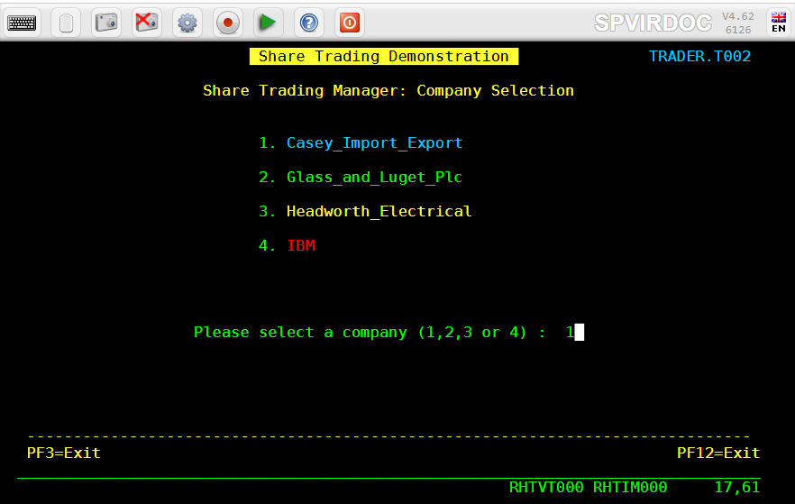
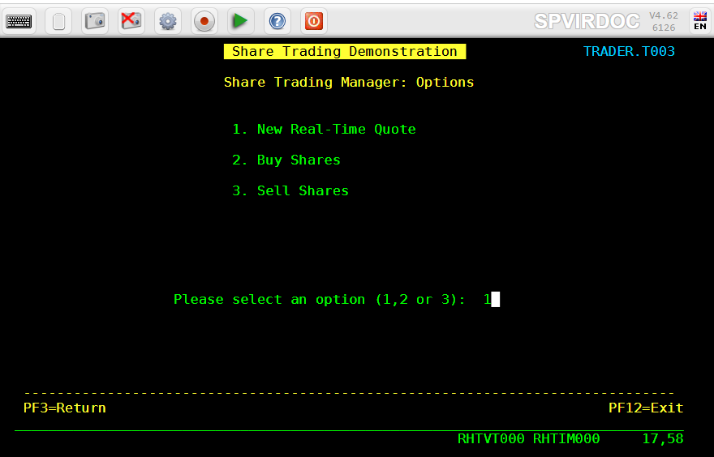
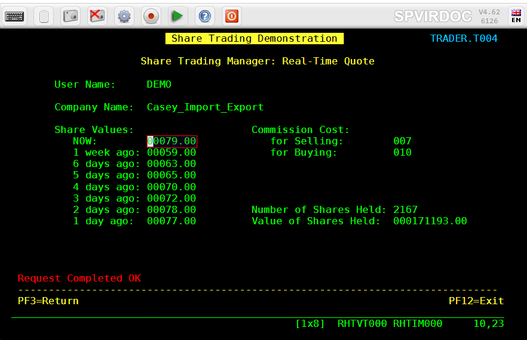
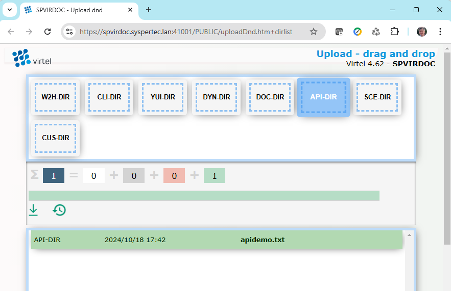
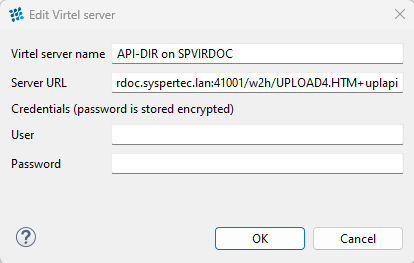

.. _tn202410:

Getting started with Virtel Web Integration (VWI)
=================================================

The following newsletter provides an introduction to using Virtel to expose elements from a 3270 application to an external webserver. These features are known as *Virtel Web Integration* or *VWI*. 

Basic concepts
--------------

VWI Architecture
^^^^^^^^^^^^^^^^

The objective of VIRTEL Web Integration is to allow a host application to take maximum control of its web interface, for example through web services.

To control its web interface, an application has at its disposal primarily the 3270 screen, the VIRTEL scenario scripting language, the page template (that can be HTML, XML, JSON, TXT...) , and optionally a set of VIRTEL commands contained in structured fields. 

VWI can be configured to support a wide range of interfaces, protocols and APIs which can :

* Expose mainframe applications and data as web services to web clients
* Invoke web services for the count of mainframe applications
* Support interactive exchange procedures between mainframe and web applications for cooperative work
* Function as a SOAP, MQ, PHP… server
* Transfer data blocks larger than 32KB, or blocks of data with variable format
* Convert data from DBCS (Double Byte Character Set) used by Japanese, Chinese, Russian… workstations or applications to EBCDIC, and vice/versa
* Serve 3270 data as international icons to eliminate natural languages from user interfaces
* Replace web connectors developed by IBM (CWS, CTG, HOD, IMS Connect, etc) and ISVs, or home-grown (CICS socket programming)

**Incoming calls**

* To expose host applications to web clients though web services, Virtel can be configured to:
* Receive and parse incoming web service calls
* Execute the appropriate transactions
* Receive data returned by the transactions in the form of screens, structured fields, COMMAREA, or database segments
* Reformat and wrap that data with XML, JSON, HTML, SOAP, CSV, PDF, Word, JSON, etc.
* Serve it back to the web callers

**Outgoing calls**

* In the outgoing direction (host-initiated web services) the mechanism is the same, just reverse.

Virtel URL Formats
^^^^^^^^^^^^^^^^^^

It is important to understand the format of Virtel URLs to work with VWI. The general form of the URL for a VIRTEL Web Access, VIRTEL Web Integration, or VIRTEL Web Modernisation transaction is:

::

    https://ipaddr:port/pathname/pagename+tranname?param1=value&param2=value

ipaddr:port
    Is the address of the HTTP line. Corresponds to the “Local ident” field of an HTTP line defined to
    VIRTEL. The rules of the line are used to select the entry point.
    This entry point, which must specify emulation type HTML, contains
    the list of transactions which the user is authorized to invoke.

pathname
    Represents a VIRTEL directory. This field is optional.

pagename
    Is the name of a Virtel template file (HTML, XML, JSON, TXT, ...) 
    from the specified directory,
    into which VIRTEL inserts dynamic data from the 3270 screen.

tranname
    Is the external name of a transaction defined under the entry point.
    The application program (which may be a CICS transaction or other
    VTAM application, a VIRTEL sub-application, or an external server)
    invoked by this transaction provides the dynamic data which VIRTEL
    inserts into the template page.

param1, param2, ...
    These are the names of the parameters which the scenario can pick up using
    the COPY$ INPUT-TO-VARIABLE or COPY$ INPUT-TO-SCREEN instructions
    The cumulative length of the URL parameters is
    limited by the BUFSIZE parameter of the VIRTCT. If blanks or other
    special characters are required in the parameter value, then the
    special characters must be coded in the standard URL escape format
    %xx where xx is the hexadecimal value of the character in ASCII. For
    example, a blank is represented as %20.

Lines, Entry points, Transactions...
^^^^^^^^^^^^^^^^^^^^^^^^^^^^^^^^^^^^

The following diagram illustrates how all the elements of Virtel work together:

|terminology|

Virtel templates
^^^^^^^^^^^^^^^^

Virtel templates are text files (usually HTML, XML, JSON format, but any text file will work), that contain *Virtel Tags* that Virtel recognizes at runtime and will act upon accordingly.

Virtel tags begin with {{{ and end with }}}

Some examples of Virtel tags:

{{{SET-OUTPUT-ENCODING-UTF-8 ""}}}
    Sets encoding of file to UTF-8

{{{CURRENT-VALUE-OF "variable"}}}
    Returns the value of a variable set by a Virtel Scenario

A file containing Virtel tags must begin with the following statement:

::

    <!--VIRTEL start="{{{" end="}}}" -->

Example 1: Simple "Hello World" application
-------------------------------------------

The following example will call Virtel and display "Hello World" in a simple TXT format template, using this url:

::

    https://spvirdoc.syspertec.lan:41003/apidemo.txt+APICICS1

41003
    Is the port number associated with a Virtel line. This line points to a default entry point named **APIWHOST**

apidemo.txt
    Is the name of a simple Virtel template file, in TXT format, containing some Virtel tags that will be populated by a Virtel scenario:

::

    <!--VIRTEL start="{{{" end="}}}" -->
    {{{SET-OUTPUT-ENCODING-UTF-8 ""}}}
    {{{SET-CONTENT-TYPE "text/plain"}}}
    
    Scenario Name: {{{TRIMMED-VALUE-OF "SCENNAME"}}}
    MyVar:         {{{TRIMMED-VALUE-OF "MYVAR"}}}
    Error Message: {{{TRIMMED-VALUE-OF "ERRMSG"}}}

APICICS1
    Is the name of a Virtel transaction that calls CICS (Applid SPCICSH), automatically signs the user on and calls a CICS transaction named TRAD (IBM CICS Trader demo). An OUTPUT SCENARIO named **APIDEMO1** is then called to process the variables in the template. Here is the VIRCONF definition of this transaction::

        TRANSACT ID=API-51,                                          -
             NAME=APICICS1,                                          -
             DESC='DEMO of Virtel APIs - Example 1',                 -
             APPL=SPCICSH,                                           -
             TYPE=1,                                                 -
             TERMINAL=APVTA,                                         -
             STARTUP=1,                                              -
             SECURITY=1,                                             -
             TIOASTA="Signon&/W&*7D4EC9&'114BE9'&U&'114CF9'&P&/ATRAD&-
             /A",                                                    -
             EXITMSGO=APIDEMO1                                        

Below is the source of the APIDEMO1 scenario. Note that it doesn't actually make any use of the CICS TRAD screen, it just gives values to the 3 variables that are in the apidemo.txt template file. The instruction **COPY$ VALUE-TO-VARIABLE** is used to assign values to the variables that are referenced in the **{{{TRIMMED-VALUE-OF "xxxxxxxx"}}}** statements of the apidemo.txt file::

    APIDEMO1 SCREENS APPL=APIDEMO1,EXEC=NO
         
         SCENARIO OUTPUT
         SET$  ENCODING,UTF-8

    * Set value of variable "SCENNAME"     
         COPY$ VALUE-TO-VARIABLE,VAR=SCENNAME,TYPE=REPLACE,            X
               VALUE='APIDEMO1'
         
    * Set value of variable "MYVAR"     
         COPY$ VALUE-TO-VARIABLE,VAR=MYVAR,TYPE=REPLACE,               X
               VALUE='Hello World'

    * Set value of variable "ERRMSG"
         COPY$ VALUE-TO-VARIABLE,VAR=ERRMSG,TYPE=REPLACE,              X
               VALUE='Scenario executed successfully'
                                    
         SCENARIO END
         
         SCRNEND
         END                  

Calling this URL from a web browser produces the following result:

|APIDEMO1-result|

Example 2: Retrieve a value from a 3270 screen
----------------------------------------------

The following example will call a CICS transaction via Virtel, retrieve a value from the CICS screen, and return it in a text file:

::

    https://spvirdoc.syspertec.lan:41003/apidemo.txt+APICICS2

41003
    Is the port number associated with a Virtel line. This line points to a default entry point named **APIWHOST**

apidemo.txt
    Is the name of a simple Virtel template file, in TXT format, containing some Virtel tags that will be populated by a Virtel scenario. This is the same file as in Example 1:

::

    <!--VIRTEL start="{{{" end="}}}" -->
    {{{SET-OUTPUT-ENCODING-UTF-8 ""}}}
    {{{SET-CONTENT-TYPE "text/plain"}}}
    
    Scenario Name: {{{TRIMMED-VALUE-OF "SCENNAME"}}}
    MyVar:         {{{TRIMMED-VALUE-OF "MYVAR"}}}
    Error Message: {{{TRIMMED-VALUE-OF "ERRMSG"}}}

APICICS2
    Is the name of a Virtel transaction that calls CICS, automatically signs the user on and calls a CICS transaction named TRAD (IBM CICS Trader demo). An OUTPUT SCENARIO named **APIDEMO2** is then called to process the variables in the template. Here is the VIRCONF definition of this transaction::

        TRANSACT ID=API-52,                                          -
             NAME=APICICS2,                                          -
             DESC='DEMO of Virtel APIs - Example 2',                 -
             APPL=SPCICSH,                                           -
             RACFNAME=SPCICSH,                                       -
             TYPE=1,                                                 -
             TERMINAL=APVTA,                                         -
             STARTUP=1,                                              -
             SECURITY=1,                                             -
             TIOASTA="Signon&/W&*7D4EC9&'114BE9'&U&'114CF9'&P&/ATRAD&-
             /A",                                                    -
             EXITMSGO=APIDEMO2                                        

Below is the source of the APIDEMO2 scenario. Note the new instruction **COPY$ SCREEN-TO-VARIABLE** that is used to retrieve data from the CICS screen::

    APIDEMO2 SCREENS APPL=APIDEMO2,EXEC=NO
         
         SCENARIO OUTPUT
         SET$  ENCODING,UTF-8

    * Set value of variable "SCENNAME"    
         COPY$ VALUE-TO-VARIABLE,VAR=SCENNAME,TYPE=REPLACE,            X
               VALUE='APIDEMO2'
         
    * Set value of variable "MYVAR" from data on the screen at L6, C30
         COPY$ SCREEN-TO-VARIABLE,SCREEN=(6,30,20),                    X
               VAR=MYVAR,TYPE=REPLACE 
         
    * Set value of variable "ERRMSG"
         COPY$ VALUE-TO-VARIABLE,VAR=ERRMSG,TYPE=REPLACE,              X
               VALUE='Scenario executed successfully'
                                    
         SCENARIO END
         
         SCRNEND
         END                  

The CICS screen that is called looks like this:

|APIDEMO2-CICS-screen|

Calling this URL from a web browser produces the following result:

|APIDEMO2-result|

Example 3: Navigate through 2 screens, then retrieve a value from the final 3270 screen
---------------------------------------------------------------------------------------

The following example will call a CICS transaction via Virtel, navigate through 2 menu screens, retrieve a value from the final CICS screen, and return it in a text file:

::

    https://spvirdoc.syspertec.lan:41003/apidemo.txt+APICICS3

41003
    Is the port number associated with a Virtel line. This line points to a default entry point named **APIWHOST**

apidemo.txt
    Is the name of a simple Virtel template file, in TXT format, containing some Virtel tags that will be populated by a Virtel scenario. This is the same file as in Examples 1 and 2:

::

    <!--VIRTEL start="{{{" end="}}}" -->
    {{{SET-OUTPUT-ENCODING-UTF-8 ""}}}
    {{{SET-CONTENT-TYPE "text/plain"}}}
    
    Scenario Name: {{{TRIMMED-VALUE-OF "SCENNAME"}}}
    MyVar:         {{{TRIMMED-VALUE-OF "MYVAR"}}}
    Error Message: {{{TRIMMED-VALUE-OF "ERRMSG"}}}

APICICS3
    Is the name of a Virtel transaction that calls CICS, automatically signs the user on and calls a CICS transaction named TRAD (IBM CICS Trader demo). An OUTPUT SCENARIO named **APIDEMO3** is then called to process the variables in the template. Here is the VIRCONF definition of this transaction::

        TRANSACT ID=API-53,                                          -
             NAME=APICICS3,                                          -
             DESC='DEMO of Virtel APIs - Example 3',                 -
             APPL=SPCICSH,                                           -
             RACFNAME=SPCICSH,                                       -
             TYPE=1,                                                 -
             TERMINAL=APVTA,                                         -
             STARTUP=1,                                              -
             SECURITY=1,                                             -
             TIOASTA="Signon&/W&*7D4EC9&'114BE9'&U&'114CF9'&P&/ATRAD&-
             /A",                                                    -
             EXITMSGO=APIDEMO3                                        

Below is the source of the APIDEMO3 scenario. Note the new instructions **COPY$ VALUE-TO-SCREEN** and **ACTION$ TO-APPLICATION** that are used to send data to the 3270 application::

    APIDEMO3 SCREENS APPL=APIDEMO3,EXEC=NO
         
         SCENARIO OUTPUT
         SET$  ENCODING,UTF-8

    * Set value of variable "SCENNAME"     
         COPY$ VALUE-TO-VARIABLE,VAR=SCENNAME,TYPE=REPLACE,            X
               VALUE='APIDEMO3'

    * Enter "1" at L17, C60 and press ENTER     
         COPY$ VALUE-TO-SCREEN,VALUE='1',SCREEN=(17,60,1)
         ACTION$ TO-APPLICATION,KEY=ENTER,AND=(PROCESS-RESPONSE)

    * Enter "1" at L17, C57 and press ENTER     
         COPY$ VALUE-TO-SCREEN,VALUE='1',SCREEN=(17,57,1)
         ACTION$ TO-APPLICATION,KEY=ENTER,AND=(PROCESS-RESPONSE)

    * Set value of variable "MYVAR" from data on screen at L10, C23     
         COPY$ SCREEN-TO-VARIABLE,SCREEN=(10,23,8),                    X
               VAR=MYVAR,TYPE=REPLACE 

    * Retrieve information/error message from the screen
         COPY$ SCREEN-TO-VARIABLE,SCREEN=(22,2,79),                    X
               VAR=ERRMSG,TYPE=REPLACE
                                    
         SCENARIO END
         
         SCRNEND
         END                  

The navigation through the CICS screens functions as follows:

1. Choose option 1 on the main menu:

|APIDEMO3-CICS-screen1|

2. Choose option 1 on the secondary menu:

|APIDEMO3-CICS-screen2|

3. Retrieve the 8 character value at line 10, column 23 and the information message at line 22, column 2:

|APIDEMO3-CICS-screen3|

Calling this URL from a web browser produces the following result:

|APIDEMO3-result|

How to implement this demo
--------------------------

Step 1 : set up Virtel ARBO for VWI
^^^^^^^^^^^^^^^^^^^^^^^^^^^^^^^^^^^

Below is the configuration that was used for this demo. Adapt the parameters to your local settings::

    * Terminal definitions for API Entry Point
          TERMINAL ID=APLOC000,                                            -
                   DESC='Pseudo Terminals (API)',                          -
                   TYPE=3,                                                 -
                   COMPRESS=2,                                             -
                   INOUT=3,                                                -
                   REPEAT=0016
          TERMINAL ID=APVTA000,                                            -
                   RELAY=*W2HPOOL,                                         -
                   DESC='HTTP terminals (with relay) API',                 -
                   TYPE=3,                                                 -
                   COMPRESS=2,                                             -
                   INOUT=3,                                                -
                   STATS=26,                                               -
                   REPEAT=0016
    * Directory for API scenarios and templates
          SUBDIR   ID=API-DIR,                                             -
                   DESC='Directory API demo',                              -
                   DDNAME=HTMLTRSF,                                        -
                   KEY=API-KEY,                                            -
                   NAMELEN=0064,                                           -
                   AUTHUP=X,                                               -
                   AUTHDOWN=X,                                             -
                   AUTHDEL=X
    * Entry point definition for API demo
          ENTRY    ID=APIWHOST,                                            -
                   DESC='HTTP entry point (API demo)',                     -
                   TRANSACT=API,                                           -
                   TIMEOUT=0720,                                           -
                   LOCK=0,                                                 -
                   EMUL=HTML,                                              -
                   SIGNON=VIR0020H,                                        -
                   MENU=VIR0021A,                                          -
                   EXTCOLOR=E,                                             -
                   SCENDIR=API-DIR
    * Transaction definitions for API demo
          TRANSACT ID=API-00,                                              -
                   NAME=APIWHOST,                                          -
                   DESC='Specific Directory for API demo',                 -
                   APPL=API-DIR,                                           -
                   PASSTCKT=0,                                             -
                   TYPE=4,                                                 -
                   TERMINAL=APLOC,                                         -
                   STARTUP=2,                                              -
                   SECURITY=0,                                             -
                   TIOASTA='/w2h/appmenu.htm+applist'
          TRANSACT ID=API-03O,                                             -
                   NAME='option',                                          -
                   DESC='Path for VWA options',                            -
                   APPL=W2H-DIR,                                           -
                   PASSTCKT=0,                                             -
                   TYPE=4,                                                 -
                   TERMINAL=COLOC,                                         -
                   STARTUP=2,                                              -
                   SECURITY=0
          TRANSACT ID=API-03W,                                             -
                   NAME='w2h',                                             -
                   DESC='Standard directory for VWA',                      -
                   APPL=W2H-DIR,                                           -
                   PASSTCKT=0,                                             -
                   TYPE=4,                                                 -
                   TERMINAL=APLOC,                                         -
                   STARTUP=2,                                              -
                   SECURITY=0
          TRANSACT ID=API-42,                                              -
                   NAME=APICICS,                                           -
                   DESC='DEMO of Virtel APIs - TRAD 3270 display',         -
                   APPL=SPCICSH,                                           -
                   PASSTCKT=0,                                             -
                   TYPE=1,                                                 -
                   TERMINAL=APVTA,                                         -
                   STARTUP=1,                                              -
                   SECURITY=1,                                             -
                   TIOASTA="Signon&/W&*7D4EC9&'114BE9'&U&'114CF9'&P&/ATRAD&-
                   /A"
          TRANSACT ID=API-51,                                              -
                   NAME=APICICS1,                                          -
                   DESC='DEMO of Virtel APIs - Hello World',               -
                   APPL=SPCICSH,                                           -
                   PASSTCKT=0,                                             -
                   TYPE=1,                                                 -
                   TERMINAL=APVTA,                                         -
                   STARTUP=1,                                              -
                   SECURITY=1,                                             -
                   TIOASTA="Signon&/W&*7D4EC9&'114BE9'&U&'114CF9'&P&/ATRAD&-
                   /A",                                                    -
                   EXITMSGO=APIDEMO1
          TRANSACT ID=API-52,                                              -
                   NAME=APICICS2,                                          -
                   DESC='DEMO of Virtel APIs - Retrieve data from screen', -
                   APPL=SPCICSH,                                           -
                   PASSTCKT=0,                                             -
                   TYPE=1,                                                 -
                   TERMINAL=APVTA,                                         -
                   STARTUP=1,                                              -
                   SECURITY=1,                                             -
                   TIOASTA="Signon&/W&*7D4EC9&'114BE9'&U&'114CF9'&P&/ATRAD&-
                   /A",                                                    -
                   EXITMSGO=APIDEMO2
          TRANSACT ID=API-53,                                              -
                   NAME=APICICS3,                                          -
                   DESC='DEMO of Virtel APIs - Navigate and retrieve data',-
                   APPL=SPCICSH,                                           -
                   PASSTCKT=0,                                             -
                   TYPE=1,                                                 -
                   TERMINAL=APVTA,                                         -
                   STARTUP=1,                                              -
                   SECURITY=1,                                             -
                   TIOASTA="Signon&/W&*7D4EC9&'114BE9'&U&'114CF9'&P&/ATRAD&-
                   /A",                                                    -
                   EXITMSGO=APIDEMO3
          TRANSACT ID=API-90,                                              -
                   NAME=APPLIST,                                           -
                   DESC='List of applications for appmenu.htm',            -
                   APPL=VIR0021S,                                          -
                   PASSTCKT=0,                                             -
                   TYPE=2,                                                 -
                   TERMINAL=APLOC,                                         -
                   STARTUP=2,                                              -
                   SECURITY=1,                                             -
                   TIOASTA='/w2h/appmenu.htm+applist'
    * Transaction definition for upload to API-DIR
          TRANSACT ID=W2H-79A,                                             -
                   NAME=UPLAPI,                                            -
                   DESC='Upload for scenario .390 (Directory API-DIR)',    -
                   APPL=VIR0041C,                                          -
                   PASSTCKT=0,                                             -
                   TYPE=2,                                                 -
                   TERMINAL=DELOC,                                         -
                   STARTUP=2,                                              -
                   SECURITY=1,                                             -
                   LOGMSG=API-DIR                                                          
    * Line definition for API demo
          LINE     ID=A-HTTP,                                              -
                   NAME=HTTP-API,                                          -
                   LOCADDR=SPVIRDOC.SYSPERTEC.LAN:41003,                   -
                   DESC='HTTP line (entry point APIWHOST)',                -
                   TERMINAL=AP,                                            -
                   ENTRY=APIWHOST,                                         -
                   TYPE=TCP1,                                              -
                   INOUT=1,                                                -
                   PROTOCOL=VIRHTTP,                                       -
                   TIMEOUT=0000,                                           -
                   ACTION=0,                                               -
                   WINSZ=0000,                                             -
                   PKTSZ=0000,                                             -
                   RETRY=0010,                                             -
                   RULESET=A-HTTP

Step 2 : Upload the apidemo.txt template to the API-DIR directory
^^^^^^^^^^^^^^^^^^^^^^^^^^^^^^^^^^^^^^^^^^^^^^^^^^^^^^^^^^^^^^^^^

Using the Virtel drag and drop interface, upload the apidemo.txt file to the API-DIR directory::

    <!--VIRTEL start="{{{" end="}}}" -->
    {{{SET-OUTPUT-ENCODING-UTF-8 ""}}}
    {{{SET-CONTENT-TYPE "text/plain"}}}
    
    Scenario Name: {{{TRIMMED-VALUE-OF "SCENNAME"}}}
    MyVar:         {{{TRIMMED-VALUE-OF "MYVAR"}}}
    Error Message: {{{TRIMMED-VALUE-OF "ERRMSG"}}}

|uplapi|

Step 3 : Use Virtel Studio to compile and upload the scenarios to Virtel
^^^^^^^^^^^^^^^^^^^^^^^^^^^^^^^^^^^^^^^^^^^^^^^^^^^^^^^^^^^^^^^^^^^^^^^^

Follow the instructions in the Virtel Studio user guide to:

* Set up a configuration to upload compiled scenarios to the API-DIR directory, as shown in the screenshot below:

|studio-conf|

* Create a new Virtel project, and add the 3 scenarios to the project. These may need to be adapted to your own CICS transactions if you do are not able to work with the IBM TRADER application.

APIDEMO1.vsc::

    APIDEMO1 SCREENS APPL=APIDEMO1,EXEC=NO
         
         SCENARIO OUTPUT
         SET$  ENCODING,UTF-8

    * Set value of variable "SCENNAME"     
         COPY$ VALUE-TO-VARIABLE,VAR=SCENNAME,TYPE=REPLACE,            X
               VALUE='APIDEMO1'
         
    * Set value of variable "MYVAR"     
         COPY$ VALUE-TO-VARIABLE,VAR=MYVAR,TYPE=REPLACE,               X
               VALUE='Hello World'

    * Set value of variable "ERRMSG"
         COPY$ VALUE-TO-VARIABLE,VAR=ERRMSG,TYPE=REPLACE,              X
               VALUE='Scenario executed successfully'
                                    
         SCENARIO END
         
         SCRNEND
         END                  

APIDEMO2.vsc::

    APIDEMO2 SCREENS APPL=APIDEMO2,EXEC=NO
         
         SCENARIO OUTPUT
         SET$  ENCODING,UTF-8

    * Set value of variable "SCENNAME"    
         COPY$ VALUE-TO-VARIABLE,VAR=SCENNAME,TYPE=REPLACE,            X
               VALUE='APIDEMO2'
         
    * Set value of variable "MYVAR" from data on the screen at L6, C30
         COPY$ SCREEN-TO-VARIABLE,SCREEN=(6,30,20),                    X
               VAR=MYVAR,TYPE=REPLACE 
         
    * Set value of variable "ERRMSG"
         COPY$ VALUE-TO-VARIABLE,VAR=ERRMSG,TYPE=REPLACE,              X
               VALUE='Scenario executed successfully'
                                    
         SCENARIO END
         
         SCRNEND
         END                  

APIDEMO3.vsc::

    APIDEMO3 SCREENS APPL=APIDEMO3,EXEC=NO
         
         SCENARIO OUTPUT
         SET$  ENCODING,UTF-8

    * Set value of variable "SCENNAME"     
         COPY$ VALUE-TO-VARIABLE,VAR=SCENNAME,TYPE=REPLACE,            X
               VALUE='APIDEMO3'

    * Enter "1" at L17, C60 and press ENTER     
         COPY$ VALUE-TO-SCREEN,VALUE='1',SCREEN=(17,60,1)
         ACTION$ TO-APPLICATION,KEY=ENTER,AND=(PROCESS-RESPONSE)

    * Enter "1" at L17, C57 and press ENTER     
         COPY$ VALUE-TO-SCREEN,VALUE='1',SCREEN=(17,57,1)
         ACTION$ TO-APPLICATION,KEY=ENTER,AND=(PROCESS-RESPONSE)

    * Set value of variable "MYVAR" from data on screen at L10, C23     
         COPY$ SCREEN-TO-VARIABLE,SCREEN=(10,23,8),                    X
               VAR=MYVAR,TYPE=REPLACE 

    * Retrieve information/error message from the screen
         COPY$ SCREEN-TO-VARIABLE,SCREEN=(22,2,79),                    X
               VAR=ERRMSG,TYPE=REPLACE
                                    
         SCENARIO END
         
         SCRNEND
         END                  

* Compile the three scenarios and upload them to the API-DIR directory

    (Using the **Compile** and **Upload** options of the Virtel menu.)
 
* Call the urls from a web browser:

    https://yourvirtel.url:41003/apidemo.txt+APICICS1

    https://yourvirtel.url:41003/apidemo.txt+APICICS2

    https://yourvirtel.url:41003/apidemo.txt+APICICS3

