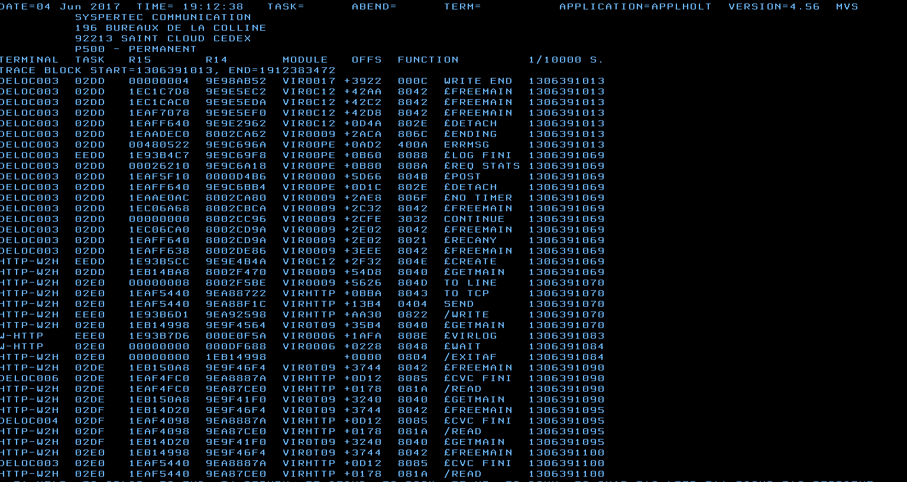

.. _Virtel456AP:

=======================================
Audit, Operations and Performance V4.56
=======================================

|image_logo|

**VIRTEL Audit, Operations and Performance**

Version : 4.56

Release Date : 01 Sep 2016 Publication Date : 22/09/2016

Syspertec Communication

196, Bureaux de la Colline 92213 Saint-Cloud Cedex Tél. : +33 (0) 1 46 02 60 42

`www.syspertec.com <http://www.syspertec.com/>`__

.. note::

    Reproduction, transfer, distribution, or storage, in any form, of all or any part of 
    the contents of this document, except by prior authorization of SysperTec 
    Communication, is prohibited.

    Every possible effort has been made by SysperTec Communication to ensure that this document 
    is complete and relevant. In no case can SysperTec Communication be held responsible for 
    any damages, direct or indirect, caused by errors or omissions in this document.

    As SysperTec Communication uses a continuous development methodology; the information 
    contained in this document may be subject to change without notice. Nothing in this 
    document should be construed in any manner as conferring a right to use, in whole or in 
    part, the products or trademarks quoted herein.

    "SysperTec Communication" and "VIRTEL" are registered trademarks. Names of other products 
    and companies mentioned in this document may be trademarks or registered trademarks of 
    their respective owners.  

.. _V456AP_Introduction:

1. Monitoring
=============

1.1 Monitoring lines and terminals
==================================

The Line Status sub-application allows the administrator to display the current status of lines and terminals or irtual circuits (CVC) managed by VIRTEL control, and optionally to modify the status of lines.

Displaying line status
----------------------

The Line Status sub-application is invoked by pressing [PF9] in the Configuration Menu, by pressing [PF10] in the Sub- Application Menu, or via the Multi-Session Menu using a transaction which calls module VIR0027.

When the security subsystem is active, access to Line Status sub-application from the Configuration Menu or the Sub- Application Menu is controlled by the resource $$UTIL$$.
When accessed by a transaction, normal transaction security rules will apply. Security management is described in chapter 4 of the VIRTEL Technical Documentation.

The sub-application begins by displaying the Line Status Display screen. Started lines are displayed in high-intensity or white text, stopped lines are displayed in low intensity or blue text.

|image_01|

*Fig.1 - Line Status Display screen*

STATUS OF-LINES
    Allows the administrator to display a subset of lines, by typing the
    first character of the name of each desired line into this field and
    pressing [Enter]. If the field is blank, all lines are displayed.

C
    Command input field.
Name
    The internal name of the line.
In
    The number of virtual circuits currently in use by incoming calls.
Out
    The number of virtual circuits currently in use by outgoing calls.
Links
    The number of terminals linked to the line.
Description
    Comments.
Seen
    User name.

Positioning the list
--------------------
If the line status display occupies more than one screen, you can scroll through the list of lines by using [PF5], [PF7] and [PF8].

[PF5]
    return to the first page of the list.

[PF7]
    scroll back to previous page.

[PF8]
    scroll forward to next page.

Sending a command
-----------------
To send a command to a line, place the cursor in the “C” field in front of the line name, type the command, then press [Enter]. The  commands available are:

S
    Starts a line.
        If the line is already started, VIRTEL attempts to start or restart any terminals associated with the line but not currently linked. This allows VIRTEL to recover LU’s which have been     deactivated and reactivated by VTAM, without stopping the line.

p
    Stops a line.
        The LINE START and STOP commands can also be issued from the z/OS or VSE console. See “Starting and stopping a line"

To return to the configuration menu, press [PF3] or [Clear].

1.2 Displaying Line Usage
=========================

    To display the status and line usage place the cursor on the desired line in the Line Status
    Display screen and press [PF12].

    Security rules are the same as those which apply to the previous screen.

    This sub-application begins by displaying the terminal usage for the selected line, as shown in the example below:

|image_02|

*Fig.2 - Line Usage Detail Display screen*

ACTIVE TERMINALS for LINE
    Indicates the internal name of the line whose virtual circuits are being displayed.
Prefix
    The terminal name prefix associated with this line.
Type
    The line type, as defined in the line definition.
Defined
    The number of terminals defined for this line.
Linked
    The number of terminals currently linked to this line.
Number of occupied circuits
    The number of terminals or virtual circuits currently in use.
Number of connections
    The total number of calls received.
Maximum simultaneously used
    The maximum number of terminals or virtual circuits in use at any one time.
Total time connected
    The total connection time.
Terminal
    The terminal name (name of the virtual circuit).
User
    User name if signed on to VIRTEL.
Sends
    The number of messages sent to the terminal.
Time
    The connection time in minutes.
Node (for Minitel)
    The name of the node to which the terminal is currently connected.
Node (for HTTP lines)
    The relay name (3270 LU name) used to connect to the host application.
Remote number (for X25 lines)
    The X25 called number for an outgoing call, or the X25 calling number for an incoming call.
Remote number (for HTTP lines)
    The IP address of the client.
Call Data (for X25 lines)
    The call user data field of the call packet (for both incoming and outgoing calls).
Call Data (for HTTP lines)
    The external name of the transaction which represents the directory (pathname) in the URL.

    If the Virtual Circuit Status Display occupies more than one screen, you can scroll through the list of terminals by using [PF7] and [PF8].

[PF7]
    scroll back to previous page.

[PF8]
    scroll forward to next page.

    You can use the [PF4] and [PF5] keys to display information about the other lines under VIRTEL control. To view the terminal or Virtual Circuit Status Display screen for the following line, press [PF4]. To return to the Detail Usage Status Display screen for the first line defined in VIRTEL, press [PF5].

    To return to the Lines Status Display, press [PF3]. To return to the Configuration Menu, press [Clear].

2. Operations
=============

    VIRTEL allows certain functions to be controlled dynamically by
    console commands.

    Use one of the following methods to send a command to VIRTEL, according to the operating system:

2.0.1 z/OS Environment
----------------------
The following modify command may be issued at the z/OS operator console, or from an SDSF session under TSO, in which case the command must be prefixed by the character “/”:

::

    F stcvirte,virtel-command    

stcvirte
    the name of the VIRTEL started task STC

virtel-cmd
    a VIRTEL command, as described in the following section.

2.0.2 z/VSE Environment
----------------------- 
To send a command to VIRTEL, issue the following command at the VSE operator console:

::

    MSG virtel,DATA=cirtel-command    

virtel
    The VIRTEL jobname (usually VIRTEL), or the partition in which VIRTEL is executing (for example, F4)

virtel-cmd
    A VIRTEL command, as described in the following section. Alternatively, issue the following command at the VSE operator console:

::

    MSG Fx    

Fx
    Partition in which VIRTEL is executing

    The system responds with: 

::

    AR 0015 1I40I READY
    Fx-nnnnAR 0015     

.. note::
    
    Note the reply number (nnnn) and issue the following command:

::

    nnnn virtel-cmd    

nnnn
    reply number

virtel-cmd
    A VIRTEL command, as described in the following section

2.1 Displaying VIRTEL Lines And Terminals
=========================================

2.1.2   Display lines
---------------------
::
    
    LINES | LINES,ACT | LINES,INACT    

    The LINES command displays the VIRTEL ACB name and a list of the lines defined in the VIRTEL configuration file. The optional keywords ACT or INACT may be used to restrict the display to lines in “started” or “stopped” state respectively.

2.1.2   Display line detail
---------------------------

::

    LINE=linename,DISPLAY (or L=linename,D)

linename
    Internal or external name of the line

    The LINE DISPLAY command displays the status of a line and its
    associated terminals.

2.1.3 List of Virtel LU relays

::
    
    RELAYS    

    The RELAYS command displays the VIRTEL ACB name and a list of the relay LUs opened by VIRTEL.

2.2 Starting and Stopping A Line
================================

::

    LINE=linename,START | STOP
    L=linename,P | S  

linename
    Internal or external name of the line

    The LINE START and LINE STOP commands perform the same function as the `“S” and “P” commands <#_bookmark12>`__ on the “Status of
    lines”. These commands may only be issued for line types AntiGATE, AntiPCNE, AntiFASTC, and TCP/IP.

2.3 Display Internal Memory Usage
=================================

::

    MEMDISPLAY

With the memory diagnostic tool active the MEMDISPLAY command summarize the VIRTEL subpool active allocated memory.

::

    VIR0200I MEMDISPLAY
    VIR0271I DISPLAY 978
    SP1=00024478 SP2=00001044 SP3=0008E35F SP4=00002F61
        00910091 00040009 02380294 000B0011
    SP5=000317DC SP6=0004DF73 SP7=00000000 SP8=00000220
        00C504C7 01370137 00000000 00000002
    POOL CONTROL BLOCK. SUBPOOL=1
    PAG=00109000 NFQ=00109008 #FQ=00000001 FRE=0000B2A0
    PAG=000F9000 NFQ=000F9008 #FQ=00000001 FRE=00000080
    PAG=000E9000 NFQ=000E9008 #FQ=00000001 FRE=00000078
    POOL CONTROL BLOCK. SUBPOOL=2
    PAG=1EC14000 NFQ=1EC14008 #FQ=00000005 FRE=0000EF68
    POOL CONTROL BLOCK. SUBPOOL=3
    PAG=1ECD4000 NFQ=1ECD4008 #FQ=00000002 FRE=00009DF8
    PAG=1ED54000 NFQ=1ED54008 #FQ=00000002 FRE=00001750
    PAG=1EC84000 NFQ=1EC84008 #FQ=00000001 FRE=00000878
    PAG=1ED04000 NFQ=1ED04008 #FQ=00000001 FRE=00000878
    PAG=1ED94000 NFQ=1ED94008 #FQ=00000002 FRE=00002768
    PAG=1ECF4000 NFQ=1ECF4008 #FQ=00000001 FRE=00000878
    PAG=1EE04000 NFQ=1EE04008 #FQ=00000001 FRE=00000878
    PAG=1ED74000 NFQ=1ED74008 #FQ=00000001 FRE=00000878
    PAG=1ECE4000 NFQ=1ECE4008 #FQ=00000001 FRE=00000878
    PAG=1EC64000 NFQ=1EC64008 #FQ=00000001 FRE=00000878
    POOL CONTROL BLOCK. SUBPOOL=4
    PAG=1EC04000 NFQ=1EC04008 #FQ=00000004 FRE=0000CFA0
    POOL CONTROL BLOCK. SUBPOOL=5
    PAG=1ECA4000 NFQ=1ECA4008 #FQ=00000002 FRE=0000D870
    PAG=1ED14000 NFQ=1ED14008 #FQ=00000001 FRE=000043B8
    PAG=1ED24000 NFQ=1ED24008 #FQ=00000001 FRE=000043B8
    PAG=1EC74000 NFQ=1EC74008 #FQ=00000001 FRE=0000A1D8
    PAG=1EC54000 NFQ=1EC54008 #FQ=00000001 FRE=0000A1D8
    PAG=1EBB4000 NFQ=1EBB4008 #FQ=00000001 FRE=000043B8
    POOL CONTROL BLOCK. SUBPOOL=6
    PAG=1EBF4000 NFQ=1EBF4008 #FQ=00000002 FRE=00000A50
    PAG=1EBE4000 NFQ=1EBE4008 #FQ=00000001 FRE=00000088
    PAG=1EBD4000 NFQ=1EBD4008 #FQ=00000001 FRE=000000B8
    PAG=1EBC4000 NFQ=1EBC4008 #FQ=00000001 FRE=000000D0
    PAG=1EBA4000 NFQ=1EBA4008 #FQ=00000001 FRE=00000108
    POOL CONTROL BLOCK. SUBPOOL=7
    PAG=00000000 NFQ=00000000 #FQ=00000000 FRE=00000000
    POOL CONTROL BLOCK. SUBPOOL=8

The display response is split into a summary section for each subpool and a detailed allocated page block and free queue element display for each subpool.

In the summary display, each subpool has two displayed values. The top value is the amount of storage currently allocated and the value below represents the current allocation in 1K chunks and a peak allocation in 1K chunks.

For example in the above display in SP5 we can see that there is an allocated value of 317DC bytes, represented by 00C5 in 1K chunks, and a peak value of 04C7 in 1K chunks.

At the bottom of the display is a line which provide allocated, free and total values.

2.3.1 Memory Management Commands 
--------------------------------

Memory Display feature is activated by using the MEMHST subparameter in the MEMORY parameter present in the VIRTCT.(see the VIRTCT subparameter MEMHST in “VIRTEL456 Installation User Guide”).

It can be deactivated by using the command:

::

    F VIRTEL,MEMDISPLAY,DISABLE

.. note::

        This command should only be implemented when advised to do so by Technical Support. Performance degradation might occur due to the additional monitoring services. This will depend on VIRTEL demand.

2.4 Stopping Virtel
===================

::

    STOP        

The STOP command allows to STOP the VIRTEL task. This command is  intended to be mainly used in VSE environment even if it is also available in z/OS environmment. On z/OS environment you can also use the following command :

::

    P stcvirte

stcvirte
    The name of the VIRTEL started task STC

2.5 Stopping a scenario
=======================
::

    KILL,T=termid

termid
    terminal name

    The KILL command requests VIRTEL to abnormally terminate the scenario currently active on the specified terminal.

2.6 Virtel Trace Commands
=========================

    A trace can be activated on the device or on his relay.

::
    
    TERM=termid,TRACE (or T=termid,T)
    TERM=termid,NOTRACE (or T=termid,N)
    RELAY=relayname,TRACE (or R=relayname,T)
    RELAY=relayname,NOTRACE (or R=relayname,N)

termid
    terminal name

relayname
    relay associated to the terminal

It is often easier to identify the relay used whose name appears at the bottom of the 3270 session screen as shown below.

|image_03|
*Fig.3 - Associated relay names*

linename
    Internal or external name of the line

The following alternate forms of the TRACE/NOTRACE commands are also  valid

::

    TRACE,T=termid
    TRACE,L=linename
    TRACE,R=relayname
    NOTRACE,T=termid
    NOTRACE,L=linename
    NOTRACE,R=relayname

termid
    terminal name

linename
    Internal or external name of the line

relayname
    Name of VTAM relay LU currently associated with the terminal

2.6.1 Display a list of active traces
-------------------------------------

::

    TRACE,DISPLAY | D

2.6.2 Deactivate all traces        
---------------------------

::

    NOTRACE,ALL

This command does not affect any memory trace. To stop a memory trace, refer to “Memory trace management”

2.7 SNAP Command
================

2.7.1 SNAP internal trace table
-------------------------------

::

    SNAP
 
The SNAP command prints the contents of the VIRTEL internal trace table. See “VIRTEL SNAP”.

2.7.2 Terminal or Relay SNAP
----------------------------

::

    SNAP,T=termid | R=relayname

termid
    terminal name

relayname
    name of VTAM relay LU currently associated with the terminal

2.7.2 Message trigger SNAP

::

    SNAPMSG,ALL    

The SNAPMSG command requests VIRTEL to generate an automatic SNAP after certain messages (VIRI902W VIR0026W VIR0052I VIR1552I VIR0526W VIR1952I).

::

    SNAPMSG=message,search,action

The SNAPMSG parameter allows a SNAP or DUMP to be taken whenever a particular message number is issued by VIRTEL. The command has an additional search field which can be used to identify a message with a paticular character string, for example a specific return code. This feature is also avalable by using the SNAPMSG command from the console. See “SNAPMSG command”.

message
    Any message that can be issued by Virtel.

search
    Any seache criteria issued within the message. The search file is restricted to a maximu of 10 characters. Anything beyond will be ignored. Default search is none.

action
    Possible values are S for SNAP or A for ABEND. Virtel will abend with a U0999 abend code, reason code 15 if the ABEND action is used.
    
Default action is SNAP.

Example:
::
 
	F VIRTEL,SNAPMSG=VIRHT51I,CALL,S

2.7.3 80-column SNAP
--------------------

::

    SNAP80 

The SNAP80 command prints the contents of the VIRTEL internal trace table in 80 column format, whatever the current value of the SNAPW parameter.

2.7.4 Adjustng the SNAP format
------------------------------

::

    SNAPW=80 | 132

The SNAPW command sets the width for future SNAP commands (80 or 132 columns). The SNAPW parameter in the VIRTCT determines the default width at VIRTEL startup. Refer to the section “Parameters of the     VIRTCT” in the VIRTEL Installation Guide for details of the SNAPW parameter.

2.8 Refreshing a VIRTEL program
===============================

::

    NEW=progname

progname
    program name

The NEW command requests VIRTEL to load a fresh copy of a program  (presentation module, exit, etc) into the VIRTEL address space. This is required after an update has been made to a program. The message     VIR0060W PROGRAM progname IS A NEW COPY indicates a successful reload. The message VIR0061W PROGRAM progname NOT IN MEMORY indicates that the program has not yet been loaded into the VIRTEL address space. In this case, VIRTEL will load the program automatically when it is next needed.

2.9 Refreshing a VIRSV Service program

::

    VIRSV,NEW=servname    

servname
    service name

The VIRSV,NEW command requests VIRTEL to stop the requested VIRSV service. This has the effect of loading a fresh copy of the associated service program the next time the service is invoked by a scenario. The message VIR0260W SERVICE servname IS A NEW COPY indicates that the service was stopped successfully. The message VIR0261W

SERVICE servname NOT IN MEMORY indicates that the service is not yet started. In this case, VIRTEL will start the service and load the  program automatically when it is next needed.

2.9 Sending a mesage to VIRTEL Multi-Session users
==================================================

::

    MSG=message text

The specified message will be displayed on the VIRTEL multi-session screen.

2.10 Supressing messages
========================

::

    SILENCE

The SILENCE command reverses the state of the SILENCE parameter in the VIRTCT. Its purpose is to activate or deactivate the suppression of terminal connection and disconnection messages written to the     operator console.

.. note::

    Refer to the section SILENCE parameter in the "Parameters of the VIRTCT" in the VIRTEL Installation Guide for a list messages affected by this command.)

2.11 - Patching a Virtel Program
================================

::

    ZAP=progname+offset,verify,replace

progname
    program name

offset
    offset into program

verify
    verify value (2 to 8 hexadecimal digits)

replace
    replacement value (2 to 8 hexadecimal digits)

The ZAP command allows the dynamic application of a corrective patch to a program while VIRTEL is running. This command is intended to be used only under the advice of Syspertec technical support personnel.

3. Performance
==============

The VIRTEL started task offers the administrator 5 sources of information to verify the correct functioning and performance of VIRTEL, to monitor its activity, or to diagnose possible problems:

-  the CONSOLE file

-  the VIRLOG file

-  the VIRTEL Logger

-  the TRACE in the VIRTRACE file

-  the SNAP in the SYSPRINT file

3.1 The console file

In **z/OS environment**, the CONSOLE file is written to the VIRTEL started task’s JESMSGLG file.

In **VSE environment**, the CONSOLE file is written to the VIRTEL partition’s POWER LST file (LISTLOG)

The CONSOLE file allows the administrator to monitor the startup and subsequent activity of VIRTEL. Using the console file, the administrator can check that the VSAM files are correctly opened, verify that the customer key has been correctly recognized, check the initialization of the TCP/IP sockets interface using the correct IP address and port, and monitor connections and disconnections of terminals and applications.

.. note::
    
    The SILENCE=YES parameter in the VIRTCT allows the suppression of certain console messages relating to the connection and disconnection of terminals.

|image_04|
*Fig. 4 Example of CONSOLE file*

3.1 The VIRLOG file
===================

This is a printable file with record length 131 and record format FA which provides a record of IP connections to VIRTEL. The figure below shows an example of VIRLOG entries for incoming
HTTP calls:

::

    £Software: VIRTEL 4.32
    £Date: 02/01/06
    £Line Local Pseudo Started Ended Price Received Sent Remote Address User
    W-HTTP WHT00200 DELOC003 I 15.34.53 15.34.53 00000007 00000381 00023135 192.168.000.043 200 PUBLIC DATA.JS W2H-DIR
    W-HTTP WHT00200 DELOC002 I 15.34.53 15.34.53 00000004 00000381 00010833 192.168.000.043 200 PUBLIC JS01.JS W2H-DIR
    W-HTTP WHT00200 DELOC003 I 15.34.53 15.34.53 00000007 00000386 00006976 192.168.000.043 200 PUBLIC VIRTBLUE W2H-DIR
    W-HTTP WHT00200 DEVTA003 I 15.34.53 15.34.59 00000649 00001169 00010397 192.168.000.043 PUBLIC WEB2VIRT W2H-10
    W-HTTP WHT00200 DELOC002 I 15.35.02 15.35.02 00000005 00000402 00000049 192.168.000.043 304 WEB2HOSTXHTML.JP W2H-DIR
    
    *Fig. 5 Example of VIRLOG file (HTTP)*

The LINE column shows the internal name of the HTTP line.
The LOCAL column shows the name of the rule selected for each call.
The PSEUDO column shows the VIRTEL terminal name used.

The next column contains “I” to indicate this is an incoming call.

The STARTED and ENDED columns show the start and end time of each IP session.

The PRICE column represents the duration of the transaction in hundredths of a second This value may be modified by exit 7.

The RECEIVED and SENT columns contain the number of bytes received from and sent to the browser. The REMOTE ADDRESS column contains the IP address of the browser.

The USER column contains the userid if the transaction is secured.
The next column contains the HTTP status code (for static pages) The last three 8-byte columns represent:

    -  The external name of the VIRTEL transaction which represents the HTTP path name.
    -  The name of the HTML page.
    -  For static pages: The name of the VIRTEL directory containing the HTML page.
    -  For dynamic pages: The internal name of the HTTP transaction which was used to populate the page.

The figure below shows an example of VIRLOG entries for X25 calls:

::

    £Software: VIRTEL 4.32
    £Date: 11/21/07
    £Line Local Pseudo Started Ended Price Received Sent Remote Address User
    X001LINE 001880 X001T007 I 13.47.37 13.48.00 00002288 00000392 00000119 191334833 MINITEL
    X001LINE G001T004 X001T000 O 13.48.30 13.48.50 00001966 00000001 00000001 191334833001870
    X001LINE P001O001 X001T001 O 13.48.49 13.49.20 00003069 00000001 00000001 001870 PCNE1
    X001LINE G001T003 X001T002 O 13.49.01 13.49.22 00002147 00000001 00000001 001870

    *Fig. 6 Example of VIRLOG file (X25)*

The LINE column shows the internal name of the X25 line.

The LOCAL column shows the called subaddress for incoming calls, or the name of the associated AntiGATE or AntiPCNE terminal for outgoing calls.

The PSEUDO column shows the VIRTEL terminal name used.

In the next column “I” indicates an incoming call, “O” indicates an outgoing call. The STARTED and ENDED columns show the start and end time of each call.

The PRICE column represents the duration of the transaction in hundredths of a second, except for calls on Fast Connect lines, where the PRICE column contains the “X25 units sent” value supplied by NPSI. This value may also be modified by exit 7.

The RECEIVED and SENT columns contain the number of bytes received from and sent to the X25 line.

The REMOTE ADDRESS column contains the caller X25 number for incoming calls, or the called X25 number for outgoing calls.

The last column contains the PCNE call user data (if present), otherwise it contains the default entry point name for X25 calls specified by the DEFENTR parameter in the VIRTCT. For GATE calls this column is blank.

3.1.2 The VIRTEL logger
-----------------------

The VIRTEL log can also be written to the system logger when LOG=LOGGER is specified in the TCT. VIR0002B is a batch program that can be run to extract the VIRTEL records from the System Logger.

The figure below shows an example of JCL to extract and format the VIRTEL LOG entries recorded in the System Logger:

::

    //LOGGER PROC P=
    //S01 EXEC PGM=VIR0002B,PARM='&P'
    //STEPLIB DD DSN=VIRTEL.LOADLIB,DISP=SHR
    //VIRLOG DD SYSOUT=*,DCB=BLKSIZE=25500
    // PEND
    //S01 EXEC LOGGER,P='DELETE(>2)'
    VIRLOG DCB LRECL=255,BLKSIZE=25500,RECFM=VB

    *Fig. 7 Example of JCL to extract the VIRTEL LOG from the System Logger*

The available JCL parameters are:

::

                (>nnn)
    COPY [----------------------]
            (fromdate[,todate])
                (>nnn)
    DELETE [--------------------]
                (date)

The date format is yyyyddd.

3.1.2.1 Examples
^^^^^^^^^^^^^^^^

::

    COPY Copy all records
    COPY(>2) Copy records older than 2 days
    COPY(>0) Copy up to yesterday
    DELETE(>2) Delete records older than 2 days
    COPY(2015047) Copy records from 2015.047
    COPY(2015047,2015048) Copy records from 2015.047 thru to 2015.048 DELETE(2015047) Delete records prior to 2015.047
    COPY(>0),DELETE(>1) Will copy records from the previous and earlier,
    and will then delete from 2 days ago leaving about 24 hours of data in the log stream.

*Fig. 8  Example of VIRTEL LOGGER extraction parameter*

3.2 Virtel trace
================

All messages which pass between a terminal and a host application, or all messages received and sent on a line, can be traced to a print file.

Activation and deactivation of a trace on a terminal or a line is performed by means of the TRACE and NOTRACE commands (see “VIRTEL commands” and “Activating and deactivating a terminal or line trace”).

.. note::

    A terminal or line trace remains active until a corresponding NOTRACE command is issued or until the VIRTEL started task terminates.

It is also possible to trace specific incoming calls (“tracing by rule”). In this case, activation of the trace is specified in the definition of the rule which VIRTEL uses to route the incoming call. For example, a rule can be created to activate the trace for calls which originate from a specific terminal address (X25 or IP). The trace can be activated for commands and/or data packets.

Activation or deactivation of a “trace by rule” is performed via the VIRTEL on-line configuration menus, and consists of updating the “Trace” field in the rule definition, followed by pressing the F1 key. See “Rules” in the VIRTEL Connectivity Reference manual for more details.

.. note::

    A “trace by rule” remains active as long as the “Trace” field in the rule definition is not empty. Message VIR0036W confirms the activation of the trace.

In **z/OS environment**, the trace data is written to the VIRTRACE file in the VIRTEL started task. 
In **VSE environment**, the trace data is written to the POWER LST file of the VIRTEL partition.

Activation and deactivation of a memory trace is performed by means of the MEMTRACE and NOMEMTRACE commands (see “Memory Trace Management”). The allocation memory is written in the SNAP file when a SNAP command is issued.

3.2.1 Contents of the trace
---------------------------

    +-----------+------------------------------------------+-----------------------------------------------+
    + Line type + Contents of line trace                   + Contents of terminal trace or trace by rule   +
    +===========+==========================================+===============================================+
    + HTTP      + All messages flowing  between the VIRTEL + Terminal without relay: None                  +
    +           + HTTP server and client browsers          + Terminal with relay: Contents of the 3270     + 
    +           +                                          + datastream between VIRTEL and the host        +  
    +           +                                          + application                                   +
    +-----------+------------------------------------------+-----------------------------------------------+
    + SMTP      + All messages flowing to and from the     + None                                          +
    +           +  VIRTEL SMTP server                      +                                               +    
    +-----------+------------------------------------------+-----------------------------------------------+
    + XOT       + All messages flowing between VIRTEL and  + All X25 messages (excluding the XOT header)   + 
    +           + the router, including the XOT headers    + belonging to the specified virtual circuit.   +
    +-----------+------------------------------------------+-----------------------------------------------+     
    + /GATE     + Messages on the control session between  + Messages on the data session between the CVC  + 
    +           + the MCH LU and the CTCP                  + LU and the CTCP (data packets, X25 RESET and  + 
    +           + (call packet and call acknowledgement)   + CLEAR commands)                               +
    + /FASTC    +                                          +                                               +
    +-----------+------------------------------------------+-----------------------------------------------+
    + /PCNE     + None                                     + Data flowing between the terminal LU and the  +
    +           +                                          + application.                                  + 
    +-----------+------------------------------------------+-----------------------------------------------+ 
    + APPC      + N/A                                      + Messages on the LU6.2 session                 +
    +-----------+------------------------------------------+-----------------------------------------------+
    + GATE      + N/A                                      + Messages on the data session between the NCP  + 
    + FASTC     +                                          + and VIRTEL.                                   +
    +-----------+------------------------------------------+-----------------------------------------------+                                 
    + 3270      + N/A                                      + The 3270 datastream between the terminal and  +  
    +           +                                          + VIRTEL, and the 3270 datastream between VIRTEL+
    +           +                                          + and the host application.                     + 
    +-----------+------------------------------------------+-----------------------------------------------+
    + PCNE      + N/A                                      + The Vidéotex datastream between the terminal  + 
    + (Minitel) +                                          + and VIRTEL, and the 3270 datastream between   + 
    +           +                                          + VIRTEL and the host application.              + 
    +-----------+------------------------------------------+-----------------------------------------------+ 

3.2.1.2 Examples of traces
^^^^^^^^^^^^^^^^^^^^^^^^^^

::

    LCL712 11A: from application SPCICST 13:05:47.48
    00000 F1C2 *1B * 099A95B4
    LCL712 11A: from application SPCICST 13:05:47.49
    00000 F5C2114B E9131140 5B290242 F1C0F8E2 89879596 9540A396 40C3C9C3 E24011C1 *5B..Z.. $...1é8Signon to CICS .A* 099A95B4
    00020 40290242 F4C0F0C1 D7D7D3C9 C4290242 F5C0F0E2 D7C3C9C3 E2E34011 C8F02902 * ...4é0APPLID...5é0SPCICST .H0..* 099A95D4
    00040 42F4C0F0 E3A89785 40A896A4 9940A4A2 85998984 40819584 409781A2 A2A69699 *.4é0Type your userid and passwor* 099A95F4
    00060 846B40A3 88859540 979985A2 A240C5D5 E3C5D97A 114BD929 0242F4C0 F0E4A285 *d, then press ENTER:..R...4é0Use* 099A9614
    00080 99898440 4B404B40 4B404B29 0241F442 F5114BF1 1DF0114B F4290242 F4C0F0C7 *rid . . . ....4.5..1.0..4...4é0G* 099A9634
    000A0 9996A497 8984404B 404B404B 290241F4 42F5114C 4B1DF011 4CE92902 42F4C0F0 *roupid . . ....4.5.<..0.<Z...4é0* 099A9654
    000C0 D781A2A2 A6969984 404B404B 404B2903 41F442F5 C04C114D C11DF011 4DF92902 *Password . . ....4.5é<.(A.0.(9..* 099A9674
    000E0 42F4C0F0 D3819587 A4818785 404B404B 404B2902 41F442F5 114E4C1D F01150D5 *.4é0Language . . ....4.5.+<.0.&N* 099A9694
    00100 290242F4 C0F0D585 A640D781 A2A2A696 9984404B 404B404B 290341F4 42F5C04C *...4é0New Password . . ....4.5é<* 099A96B4
    00120 1150F11D F0115A50 1D7C115B 5B1DF011 5B602902 42F2C0F8 C4C6C8C3 C5F3F5F2 *.&1.0.&.to.$$.0.$-...2é8DFHCE352* 099A96D4

*Fig. 9 Example of terminal trace (inbound 3270 terminal)*

::
    
    X001T007 XOT: RECEIVED FROM ROUTER                          13:48:15.26
    00000 00000019 10010B96 00188019 13348330 0A420707 43030302 CC0300C4 80       * ....o .....c........... D.     * 0989117C
    X001T007 XOT: SENT TO ROUTER                                13:48:15.37
    00000 00000003 10010F                                                         * ....                           * 09896178
    X001T007 XOT: RECEIVED FROM ROUTER                          13:48:15.53
    00000 0000001B 100100D7 C5E2C9E3 404040E2 E8E2E7C3 C6E3C1E2 E8E2D7C1 E24040   * ... PESIT SYSXCFTASYSPAS       * 0989117C
    X001T007 XOT: SENT TO ROUTER                                13:48:15.54
    00000 00000003 100121                                                         * ....                           * 0989117C
    X001T007 XOT: SENT TO ROUTER                                13:48:15.55
    00000 00000007 100120C1 C3D2F0                                                * ....ACK0                       * 098A4176
    X001T007 XOT: RECEIVED FROM ROUTER                          13:48:15.57
    00000 00000003 100121                                                         * ....                           * 0989117C
    X001T007 XOT: RECEIVED FROM ROUTER                          13:48:15.72
    00000 00000083 10013200 A0402000 D9030853 59535843 46544104 08535953 58434654 *........to ....SYSXCFTA..SYSXCFT* 0989117C
    00020 42050653 59535041 53060102 07030024 02160102 17010163 6E434654 20593D4D *B..SYSPAS......$.......cnCFT Y=M* 0989119C
    00040 2C443D32 30303530 31303531 33343831 3536302C 563D3233 302C5A3D 702D312D *,D=2005010513481560,V=230,Z=p-1-* 098911BC
    00060 31352D2D 4D565332 3230432D 41323330 3033352D 32303031 2F31302F 32322C4B *15--MVS220C-A230035-2001/10/22,K* 098911DC
    00080 3D514334 443248                                                         *=QC4D2H                         * 098911FC
    X001T007 XOT: SENT TO ROUTER                                13:48:15.72
    00000 00000003 100141                                                         * ....                           * 0989117C
    X001T007 XOT: RECEIVED FROM ROUTER 13:48:15.72
    00000 00000023 1001245A 56444850 37444C4E 39374A49 36513153 49594C2C 433D3830 *...£..$ZVDHP7DLN97JI6Q1SIYL,C=80* 0989117C
    00020 33333430 333832                                                         *3340382                         * 0989119C
    X001T007 XOT: SENT TO ROUTER                                13:48:15.73
    00000 00000003 100161

*Fig. 10 Example of line trace (XOT line)*    

::

    X001T007 005: INBOUND CALL PACKET                           15:10:11.97
    00000 0BF00806 0018800A 42070743 030302CC 0300C018 80105043 4E4531                  *........B..C..........PCNE1     * 09896176
    X001T007 XOT: OUTBOUND X25 COMMAND                          15:10:11.99
    00000 0F                                                                            *.                               * 0989617E
    X001T007 XOT: INBOUND DATA                                  15:10:12.08
    00000 00C3C6E3 D7E2C9E3 E7C3D7C1 E7F14040 40D7D8D9 E2404040 400D25                  * CFTPSITXCPAX1 PQRS ..          * 09891182
    P001I001 AP80LU51 I09: DATA TO CFTBACB1                     15:10:12.21 
    00000 C3C6E3D7 E2C9E3E7 C3D7C1E7 F1404040 D7D8D9E2 40404040 0D25                    *CFTPSITXCPAX1 PQRS ..           * 0989617D
    P001I001 AP80LU51 I09: DATA FROM CFTBACB1                   15:10:12.23
    00000 C1C3D2F0 0D25                                                                 *ACK0..                          * 0989617C
    X001T007 XOT: OUTBOUND DATA                                 15:10:12.23
    00000 00C1C3D2 F00D25                                                               * ACK0..                         * 098A417C
    X001T007 XOT: INBOUND DATA                                  15:10:12.46
    00000 22003240 2000D903 0D4F5020 20202020 20435041 5831040D 4F502020 20202020       *".to ....OP CPAX1..OP           * 09891182
    00020 43504258 31060101 07030024 02160100 170101                                    *CPBX1......$.......             * 098911A2
    P001I001 AP80LU51 I09: DATA TO CFTBACB1                     15:10:12.47
    00000 00324020 00D9030D 4F502020 20202020 43504158 31040D4F 50202020 20202043       *.to ....OP CPAX1..OP C          * 098A417D
    00020 50425831 06010107 03002402 16010017 0101                                      *PBX1......$.......              * 098A419D
    P001I001 AP80LU51 I09: DATA FROM CFTBACB1                   15:10:12.55
    00000 00114021 D9E20601 01070300 24021701 01                                        * . .RS..... .....               * 0989617C
    X001T007 XOT: OUTBOUND DATA                                 15:10:12.55
    00000 00001140 21D9E206 01010703 00240217 0101                                      * . .RS..... .....               * 098A417C
    X001T007 XOT: INBOUND DATA                                  15:10:12.89
    00000 440028C0 1FE20009 0C0B02FF FF0C0650 434E4531 410D0307 DC1D5C0D 414E5449       *D.(............PCNE1A.....ç.ANTI* 09891182
    00020 50434E45 20544553 54                                                          *PCNE TEST * 098911A2
    P001I001 AP80LU51 I09: DATA TO CFTBACB1                     15:10:12.90
    00000 0028C01F E200090C 0B02FFFF 0C065043 4E453141 0D0307DC 1D5C0D41 4E544950       *.(............PCNE1A.....ç.ANTIP* 098A417D
    00020 434E4520 54455354                                                             *CNE TEST                        * 098A419D
    P001I001 AP80LU51 I09: DATA FROM CFTBACB1                   15:10:12.97
    00000 000BC03F D9000203 000000                                                      * .é.R ..                        * 0989617C
    X001T007 XOT: OUTBOUND DATA                                 15:10:12.97
    00000 00000BC0 3FD90002 03000000                                                    * .é.R ..                        * 098A417C
    X001T007 XOT: INBOUND DATA                                  15:10:33.11
    00000 66000B40 23E2D902 03000000                                                    *. . .SR..                       * 09891182
    P001I001 AP80LU51 I09: DATA TO CFTBACB1                     15:10:33.12
    00000 000B4023 E2D90203 000000                                                      * . .SR..                        * 098A417D
    P001I001 AP80LU51 I09: DATA FROM CFTBACB1                   15:10:33.14
    00000 00064024 D9E2                                                                 * . .RS                          * 0989617C
    X001T007 XOT: OUTBOUND DATA                                 15:10:33.14
    00000 00000640 24D9E2                                                               * . .RS                          * 098A417C
    X001T007 XOT: INBOUND X25 COMMAND                           15:10:33.27
    00000 130000                                                                        *.                               * 09891182
    X001T007 XOT: OUTBOUND X25 COMMAND                          15:10:33.27
    00000 17                                                                            *.                               * 09891182

*Fig. 11 Example of "trace by rule" (XOT terminal to application on /PCNE line)*

3.3 VIRTEL SNAP
===============

VIRTEL maintains an internal trace table in which it records  significant events which occur during VIRTEL processing. The SNAP command allows the administrator to obtain a snapshot listing of the contents of the trace table at a given point in time.

The SNAP listing is primarily intended for use by VIRTEL development personnel and will normally need to be forwarded to Syspertec for analysis. For customer diagnostics, the TRACE command (described     above) may often be more useful.

.. note::

    The format, the contents, and the size of the SNAP depend on the SNAPW, TRACBIG, TRACEB, TRACEON parameters in the VIRTCT.

The internal trace table is recorded in a circular fashion, so that each new event added to the table overlays and replaces the oldest event in the table. The table contains a fixed number of event slots (determined by the TRACBIG parameter in the VIRTCT), and additionally certain events may have a variable amount (up to 256 bytes) of data recorded. The variable data is stored in a separate area whose size is determined by the TRACEB parameter in the VIRTCT, and this area is also filled in a circular manner, with the oldest information being dropped from the table when new information is added. Thus, depending on the values of the TRACBIG and TRACB parameters, older entries in the trace table may no longer have data associated with them.

Clearly, the greater the level of activity in the VIRTEL system, the quicker the trace table will wrap and information will be pushed out to make way for new entries. Thus, in order for the SNAP listing to     provide useful information, the size of the trace table and its associated buffer area must be adequate for the level of system activity, and the SNAP command must be issued as quickly as possible after the event under investigation occurs. In some cases it may be necessary to use an automation tool to issue the SNAP command immediately following the appearance of a certain console message.

As well as dumping the contents of the internal trace table, the SNAP command also dumps certain VIRTEL internal control blocks. A dump of the control blocks associated with a particular terminal may    optionally be requested.

The SNAP command is described under the heading “VIRTEL commands”. VIRTEL may also produce a SNAP listing automatically if a program check or other abend occurs during VIRTEL processing.

In **z/OS environment**, the SNAP output is written to the SYSPRINT file in the VIRTEL started task. 
In **z/VSE environment**, the SNAP output is written to the POWER LST file of the VIRTEL partition.

.. note::
    
    Several SNAP commands may be issued during a single run of VIRTEL. The output file may thus contain successive SNAP listings concatenated one after the other.

|image_05|

*Fig. 12 Example of SNAP listing*

3.3.1 Message-triggered SNAPMSG

The SNAPMSG command requests VIRTEL to generate an automatic SNAP after certain messages (VIRI902W, VIR0026W, VIR0052I, VIR1552I, VIR0526W or VIR1952I).

Only one SNAP can also be obtained with user specific code provided by SYSPERTEC for messages VIRHT31E and VIRHT63E. See “VIRTEL commands”.

4. Audit and Statistics
=======================

4.1 The VIRSTAT file
====================

The VIRSTAT file is a sequential file into which VIRTEL writes connection statistics.

.. note::

    When the STATS=YES parameter is coded in the VIRTCT, the VIRSTAT file is reinitialised at each VIRTEL startup. With STATS=YES, VIRTEL must be stopped periodically in order to avoid filling the VIRSTAT
    file, and the file should be defined as a GDG in order not to lose the information from a previous run. The STATS=MULTI parameter may be coded in the z/OS environment to permit continuous operation.

    Trying to browse the contents of the file from ISPF while it is in use by VIRTEL, can result to the obtain a system message indicating that the file is empty. In reality this is not true, because in fact
    the records are buffered in memory before being written in block.

The format of the statistics records depends on the value specified in the “Write Stats to” field of the VIRTEL terminal definition (refer to the VIRTEL Connectivity Reference manual for details of terminal definitions). Each terminal may request statistics in one or more of the possible formats:

Classic
    VIRSTAT classic format recording is intended for use with Minitel calls on terminals associated with NPSI lines (Gate or Fast Connect).

Alternate X25
    VIRSTAT alternate format recording may be requested for terminals associated with any X25 line (GATE, FASTC, XOT).

Web
    VIRSTAT format suitable for terminals associated with an HTTP line.

For terminals associated with all other line types (including /GATE, /PCNE, and /FASTC) the statistics record may not contain meaningful information and the statistics field in the terminal definition     should be left blank.

The statistics file may contain a mixture of classic, alternate X25, and web format records. The record type indicator at position 61 of each record identifies the format of the particular record.

4.1.1 VIRSTAT classsic format 
-----------------------------
For terminals which specify classic format recording (STATS=1), the  VIRSTAT record format is shown in the following table:

::

    **Position    Format          Type of information**
    -----------------------------------------------
    1 to 8      Alphanumeric    Terminal name
    9 to 12     Packed Decimal  Date (CCYYDDDF)
    13 to 16    Packed Decimal  Time (HHMMSSTF)
    17 to 28    Alphanumeric    User id
    29 to 36    Alphanumeric    Originating terminal name (outbound calls)
    37 to 40    Hexadecimal     No of bytes inbound (uncompressed)
    41 to 44    Hexadecimal     No of bytes inbound (compressed)
    45 to 48    Hexadecimal     No of bytes outbound (uncompressed)
    49 to 52    Hexadecimal     No of bytes outbound (compressed)
    53 to 56    Hexadecimal     No of sends
    57 to 60    Hexadecimal     No of receives
    61 to 61    Alphanumeric    Record type (C=cumulative,P=partial,E=end) [1]
    62 to 62    Alphanumeric    Compression level (0,1,2)
    63 to 70    Alphanumeric    Minitel: Server access node
    71 to 74    Alphanumeric    Minitel: Call duration in minutes (ZZZ9)
    75 to 82    Alphanumeric    Session start date (MM/DD/YY)
    83 to 86    Alphanumeric    Session start date (.DDD)
    87 to 94    Alphanumeric    Session start time (HH.MM.SS)
    95 to 102   Alphanumeric    Session end date (MM/DD/YY)
    103 to 106  Alphanumeric    Session end date (.DDD)
    107 to 114  Alphanumeric    Session end time (HH.MM.SS)
    115 to 115  Alphanumeric    Tarification level (External Servers)
    116 to 116  Alphanumeric    Disconnection Type (T=by TIME-OUT)
    117 to 120  Hexadecimal     X25 units received (Fast-Connect)
    121 to 124  Hexadecimal     X25 units sent (Fast-Connect)

*Fig. 13 Format of VIRSTAT record (classic format)*

For NPSI Fast Connect lines, the X25 accounting statistics are recorded in billing units provided by NPSI at virtual circuit disconnection time. Their interpretation depends on the TAXUNIT parameter in the NPSI X25.MCH macro. Similarly, the session start and end times (Fast Connect only) are provided by NPSI and depend on the clock settings in the NCP. For other types of lines, accounting statistics and times are generated by VIRTEL.

Type C (cumulative) 
    Records are implemented at terminal disconnection. 
Type P (partial) 
    Records are implemented at regular intervals.
Type E (end of job) 
    Records are implemented at VIRTEL shutdown.

4.1.2 VIRSTAT alternative X25 format
------------------------------------
For terminals which specify alternate X25 format recording (STATS=4), the VIRSTAT record format is shown in the following  table:

::

    Position        Format          Type of information
    1 to 8          Alphanumeric    Terminal name
    9 to 12         Packed Decimal  Date (CCYYDDDF)
    13 to 16        Packed Decimal  Time (HHMMSSTF)
    17 to 36        Alphanumeric    Remote X25 number
    37 to 40        Hexadecimal     Unused
    41 to 44        Hexadecimal     Unused
    45 to 48        Hexadecimal     Unused
    49 to 52        Hexadecimal     Unused
    53 to 56        Hexadecimal     Unused
    57 to 60        Hexadecimal     Unused
    61 to 61        Alphanumeric    Record type (I=inbound,O=outbound) [1]
    62 to 62        Alphanumeric    Unused
    63 to 70        Alphanumeric    Originating GATE/PCNE terminal name (outbound)
                                    Entry point name (inbound)
    71 to 74        Alphanumeric    Unused
    75 to 82        Alphanumeric    Session start date (MM/DD/YY)
    83 to 86        Alphanumeric    Session start date (.DDD)
    87 to 94        Alphanumeric    Session start time (HH.MM.SS)
    95 to 102       Alphanumeric    Session end date (MM/DD/YY)
    103 to 106      Alphanumeric    Session end date (.DDD)
    107 to 114      Alphanumeric    Session end time (HH.MM.SS)
    115 to 115      Alphanumeric    Unused
    116 to 116      Alphanumeric    Disconnection Type (T=by TIME-OUT)
    117 to 120      Hexadecimal     Unused
    121 to 124      Hexadecimal     Call duration in 1/100 second

*Fig. 14 Format of VIRSTAT record (alternate X25 format)*

For NPSI Fast Connect lines, the X25 session start and end times are provided by NPSI at virtual circuit disconnection time and depend on the clock settings in the NCP. For other types of lines, times are     generated by VIRTEL.

Type I (inbound)
    Records relate to X25 incoming calls.
Type O (outbound) 
    Records relate to X25 outgoing calls.

For terminals which specify web format recording (STATS=5 or STATS=6), the VIRSTAT record format is shown in the following  tables:

::
    
    Position        Format          Type of information
    1 to 8          Alphanumeric    Terminal name
    9 to 12         Packed Decimal  Date (CCYYDDDF)
    13 to 16        Packed Decimal  Time (HHMMSSTF)
    17 to 31        Alphanumeric    Caller’s IP address
    32 to 36        Alphanumeric    Alphanumeric
    37 to 44        Alphanumeric    Entry point name
    45 to 52        Alphanumeric    Transaction external name
    53 to 60        Alphanumeric    Rule name
    61 to 61        Alphanumeric    Record type (H=HTTP inbound)
    62 to 64        Alphanumeric    Unused
    65 to 68        Alphanumeric    Error code
    69 to 76        Alphanumeric    Relay LU name
    77 to 84        Alphanumeric    Call duration in 1/100 second
    85 to 92        Alphanumeric    No of bytes received
    93 to 100       Alphanumeric    No of bytes sent
    101 to 108      Alphanumeric    Session start date (MM/DD/YY)
    109 to 116      Alphanumeric    Session start time (HH.MM.SS)
    117 to 124      Alphanumeric    Session end time (HH.MM.SS)

*Fig. 15 Format of VIRSTAT record (type 5 for Web Access)*

This record type is written when 5 is specified in the STATS field of the terminal definition used for the HTTP line. If the terminal is disconnected by TIMEOUT, the “Error Code” field contains the word     “TIME”.

::

    Position        Format          Type of information
    1 to 8          Alphanumeric    Terminal name
    9 to 12         Packed Decimal  Date (CCYYDDDF)
    13 to 16        Packed Decimal  Time (HHMMSSTF)
    17 to 31        Alphanumeric    Caller’s IP address
    32 to 36        Alphanumeric    Caller’s port number
    37 to 44        Alphanumeric    Entry point name
    45 to 52        Alphanumeric    Transaction external name
    53 to 60        Alphanumeric    Rule name
    61 to 61        Alphanumeric    Record type (B=binary HTTP inbound)
    62 to 64        Alphanumeric    Unused
    65 to 68        Alphanumeric    Error code
    69 to 76        Alphanumeric    Relay LU name
    77 to 80        Hexadecimal     Call duration in 1/100 second
    81 to 84        Hexadecimal     No of bytes received
    85 to 88        Hexadecimal     No of bytes sent
    89 to 108       Alphanumeric    User name
    109 to 124      Alphanumeric    URL parameter

*Fig. 16 Format of VIRSTAT record (type 6 for Web Access)*

For this record type, the counters are in binary, and the Session Date and Time fields are replaced by User name (20 bytes) and URL parameter (first 16 bytes).

This record type is written when 6 is specified in the STATS field of the terminal definition used for the HTTP line.

4.2 Statistics file management
==============================

The STAT command is used to manage the VIRTEL statistics recording files (VIRSTATx). This command can be used only if STATS=MULTI is specified in the VIRTCT.

4.2.1 Display VIRSTAT
---------------------

::
    
    STAT,D

This command displays the status of the VIRSTATx files (message VIR0601I).

4.2.2 Switch VIRSTAT
--------------------
::
    
    STAT,I    

This command forces VIRTEL to free the current VIRSTATx file and to start recording onto the next file.

4.2.3 Printing the contents of the VIRSTAT file (X25)
-----------------------------------------------------

The VIR0070 program allows the contents of the VIRSTAT file to be printed. The source for this program is supplied in the SSL (VSE) or in the SAMPLIB (z/OS) and you can use this as the basis of a     user-written program to print statistics. 

Examples of the JCL required to execute this program are shown below:

::

    * $$ JOB JNM=VIRSTAT,CLASS=0,DISP=D
    * $$ LST DISP=D,CLASS=V,DEST=(,SPTUSER)
    // JOB VIRPRNT
    // LIBDEF *,SEARCH=VIRT442.SUBLIB
    // DLBL STAT,'VIRTEL.VIRSTAT.ESDS',,VSAM,CAT=VSESPUC
    // EXEC VIR0070,SIZE=AUTO
    /*
    /&
    * $$ EOJ

*Fig. 17 VIR0070 JCL to print VIRSTAT file (VSE)*

::
    
    //VIRSTAT JOB 1,USER,CLASS=A,MSGCLASS=X,NOTIFY=&SYSUID
    //TRI EXEC PGM=SORT
    //SYSPRINT DD SYSOUT=*
    //SYSOUT DD SYSOUT=*
    //SORTWK01 DD UNIT=3380,SPACE=(TRK,(100,20),RLSE)
    //SORTWK02 DD UNIT=3380,SPACE=(TRK,(100,20),RLSE)
    //SORTIN DD DISP=SHR,DSN=VIRTEL.STAT
    //SORTOUT DD DSN=&&STAT,UNIT=SYSDA,DISP=(,PASS),
    // DCB=(LRECL=124,BLKSIZE=620,RECFM=FB),
    // SPACE=(TRK,(100,20),RLSE)
    //SYSIN DD *
    SORT FIELDS=(1,16,A),FORMAT=CH
    END
    //STAT EXEC PGM=VIR0070
    //STEPLIB DD DISP=SHR,DSN=VIRT442.LOADLIB
    //SYSUDUMP DD SYSOUT=*
    //SYSPRINT DD SYSOUT=*
    //VIRSTAT DD DISP=(OLD,DELETE),DSN=&&STAT
    //

*Fig. 18 VIR0070 JCL to print VIRSTAT file (z/OS)*

4.2.4 Printing the contents of the VIRSTAT file (HTTP)
------------------------------------------------------
The PRTSTATW program supplied with the system allows printing of type 6 records from the VIRSTAT file. This program is delivered as a load module in the VIRTEL LOADLIB (from version 4.45 onwards) and     the execution JCL is provided as member JCLPRTST in the VIRTEL SAMPLIB. 

Examples of the execution JCL for this program are shown below.

4.2.4.1 z/VSE
^^^^^^^^^^^^^

In the VSE environment the VIRPRTST job, loaded into the POWER reader queue during VIRTEL installation, contains an example of JCL for printing the VIRSTAT file. This job is an example only and must be modified before execution:

::
    
    * $$ JOB JNM=VIRPRTST,CLASS=0,DISP=D
    * $$ LST DA
    // JOB VIRPRTST
    * *****************************************************************
    * * VIRTEL: EXAMPLE JCL TO EXECUTE STAT VIRTEL PRINT *
    * *****************************************************************
    // LIBDEF *,SEARCH=(VIRT452.SUBLIB,PRD2.CONFIG,PRD1.BASE)
    // DLBL SORTIN1,'VIRTEL.STAT',,VSAM,CAT=VSESPUC
    // DLBL SORTOUT,'%VIRTEL.SORTFILE',0,VSAM,CAT=VSESPUC,DISP=(NEW,KEEP), C
    RECORDS=(10,100),RECSIZE=124
    * // DLBL SORTOUT,'VIRTEL.SORTFILE',0,SD
    * // EXTENT SYS001,SYSWK2,1,0,NNNN,15
    * // ASSGN SYS001,DISK,VOL=SYSWK2,SHR
    // EXEC SORT,SIZE=100K
    SORT FIELDS=(01,08,A),FORMAT=CH
    RECORD TYPE=F,LENGTH=124
    END
    /*
    * OPTIONS FOR PRINT OR COUNT
    * // DLBL SYSPRINT DD SYSOUT=*
    * // DLBL SYSABEND DD SYSOUT=*
    * // DLBL IJSYSLS DD SYSOUT=*
    *
    // DLBL VIRSTAT,'%VIRTEL.SORTFILE',0,VSAM,CAT=VSESPUC,DISP=(,DELETE)
    // ASSGN SYS007,SYSLST
    // ASSGN SYS006,SYSRDR
    // EXEC PGM=PRTSTATW,SIZE=AUTO
    PRTSTATW PRINT NNN 0250
    SELDATE 01012011 31122012
    SELTERM DEVTA* CLVTA*
    /*
    * * MAIN CARD (REQUIRED)
    * * ---------
    * * 1 2 3 4 5 6
    * *1...!....0....!....0....!....0....!....0....!....0....!....0...
    * *PRTSTATW PRINT BREAK USER NNN PPPP
    * * SPECIFIC REQUEST TO PRINT THE STATISTICS
    * *PRTSTATW COUNT $ALL$ NNN PPPP
    * * SPECIFIC REQUEST TO COUNT THE NUMBERS OF DIFFERENT
    * * USERS
    * *SELECT CARD (OPTIONAL)
    * * -----------
    * * 1 2 3 4 5 6
    * *1...5....0....5....0....5....0....5....0....5....0....5....0
    * *SELDATE DDMMYYYY DDMMYYYY
    * * DATE SELECTION BEGIN,
    * * END DATE
    * *SELTERM TTTTTTTT XXXXXXXX YYYYYYYY ZZZZZZZZ (UP TO 8 BYTES)
    * *SELUSER USER4561890123456789 (UP TO 20 BYTES)
    * *SELPARM PARM456189012345 (UP TO 16 BYTES)
    * *1...!....0....!....0....!....0....!....0....!....0....!....0...
    * * THE '*' CHARACTER ALLOWS A GENERIC EVALUATION.
    /&
    * $$ EOJ

*Fig. 19 PRTSTATW JCL to print VIRSTAT file in VSE (type=6)*

4.2.4.2 z/OS
^^^^^^^^^^^^

In the z/OS environment the JCL for executing the PRTSTATW program is supplied as member JCLPRTST in the VIRTEL SAMPLIB:

::

    //VIRPRTST JOB 1,USER,CLASS=A,MSGCLASS=X,NOTIFY=&SYSUID
    /*JOBPARM LINES=9999
    //*------------------------------------------------------------*
    //* VIRSTAT FILE PRINTING JOB *
    //* VIRSTAT RECORD TYPE 6 (VSTA-RECORD-TYPE='B') *
    //*------------------------------------------------------------*
    // SET LOAD=yourqual.VIRTnnn.LOADLIB
    // SET STAT=yourqual.VIRTnnn.STAT
    //*------------------------------------------------------------*
    //JOBLIB DD DISP=SHR,DSN=&LOAD
    //*------------------------------------------------------------*
    //*
    //STEP0 EXEC PGM=SORT
    //SYSOUT DD SYSOUT=*
    //SORTIN DD DISP=SHR,DSN=&STAT
    //SORTOUT DD DSN=&&SORTSTAT,DISP=(NEW,PASS),UNIT=SYSDA,
    // DCB=(BLKSIZE=1240,LRECL=124,RECFM=FB),
    // SPACE=(TRK,(1,1))
    //SYSIN DD *
    SORT FIELDS=(1,8,A),FORMAT=CH
    //*
    //STEP1 EXEC PGM=PRTSTATW
    //SYSPRINT DD SYSOUT=*
    //SYSABEND DD SYSOUT=*
    //IJSYSLS DD SYSOUT=*
    //*
    //VIRSTAT DD DSN=&&SORTSTAT,DISP=OLD
    //SYSIN DD *
    PRTSTATW PRINT NNN 0250
    SELDATE 01012011 31122012
    SELTERM DEVTA* CLVTA*
    * ..!....0....!....0....!....0....!....0....!....0....!....0...
    //* MAIN CARD (required)
    //* ---------
    //* 1 2 3 4 5 6
    //* 1...!....0....!....0....!....0....!....0....!....0....!....0...
    //* PRTSTATW PRINT BREAK USER NNN PPPP
    //* specific request to print the statistics
    //* PRTSTATW COUNT $ALL$ NNN PPPP
    //* specific request to count the numbers of different
    //* users
    //* SELECT CARD (optional)
    //* -----------
    //* 1 2 3 4 5 6
    //* 1...5....0....5....0....5....0....5....0....5....0....5....0
    //* SELDATE DDMMYYYY DDMMYYYY
    //* DATE selection begin,
    //* end date
    //* SELTERM TTTTTTTT XXXXXXXX YYYYYYYY ZZZZZZZZ (up to 8 bytes)
    //* SELUSER USER4561890123456789 (up to 20 bytes)
    //* SELPARM PARM456189012345 (up to 16 bytes)
    //* 1...!....0....!....0....!....0....!....0....!....0....!....0...
    //* The '*' character allows a generic evaluation.
    // 

*Fig. 20 PRTSTATW JCL to print VIRSTAT file in z/OS (type=6)*

This JCL consists of two main steps:
    -  a first step to sort the file
    -  a second step to PRINT or COUNT the records

4.2.4.3 Sorting the File 
^^^^^^^^^^^^^^^^^^^^^^^^

The sort requirements are determined by the type of report desired. Since the PRTSTATW program offers the option of selecting records and also offers up to two levels of report break to allow printing of subtotals, it is important to specify the appropriate sort criteria to obtain the correct result.

The sort operates on one or more criteria, in ascending (A) or descending (D) mode. You should adapt the SORT SYSIN according to the syntax of the specific SORT program being used.

Several examples of sort criteria are shown below for various fields: terminal (TERM), date (DATE), user name (USER), URL parameter (PARM)

::

    SORT FIELDS=(1,8,A) --> TERM A: ascending D: descending
    SORT FIELDS=(9,4,A) --> DATE
    SORT FIELDS=(89,20,A) --> USER
    SORT FIELDS=(109,16,A) --> PARM
    SORT FIELDS=(1,8,A,),FORMAT=CH sort by TERM
    SORT FIELDS=(1,8,A,89,20,A),FORMAT=CH sort by TERM first then USER
    SORT FIELDS=(17,15,A) --> IP Adress (for $ALL$ request)
    SORT FIELDS=(89,20,A,17,15,A),FORMAT=CH sort for $ALL$ request

*Fig. 21 PRTSTATW JCL sort criteria*

For example, to obtain a report in ascending order of session start date, specify the following statements in the SORT SYSIN:

::
    
    //SYSIN DD *
    SORT FIELDS=(9,4,A),FORMAT=CH
    //*

4.2.4.4 The PRTSTATW program
^^^^^^^^^^^^^^^^^^^^^^^^^^^^
The PRTSTATW program executed in the second step reads the sorted output file from the first step. It contains required and optional SYSIN cards.

::

    First card (Required)
             1         2         3         4         5         6
    1...!....0....!....0....!....0....!....0....!....0....!....0...
    PRTSTATW PRINT                BREAK USER          NNN  PPPP

*Fig.22 PRTSTATW first SYSIN card*

Columns 1 to 8
    Program name: must be PRTSTATW

Columns 11 to 16
    Report type: specify PRINT (print report) or COUNT (calculate number of distinct users)

Columns 31 to 35
    Optionally specify BREAK if report break is desired (up to 2 levels) for printing (PRINT) or $ALL$ if counting (COUNT)

Columns 37 to 40
    Optionally indicates the type of report break: TERM (break on change of terminal name), USER (break on change of user name), DATE (break on change of date) or PARM (break on change of URL parameter)

Columns 43 to 46
    Optionally indicates the second level report break (TERM, USER, DATE, or PARM)

Columns 51 to 53
    Optionally specify N (no) or O (yes) to print additional trace information (program trace, input/output trace, and miscellaneous trace respectively). The default is N for each trace.

Columns 56 to 59
    Maximum number of pages to be printed (default 50 pages)

::
    
    Second card (Optional)    
             1         2         3         4         5         6
    1...5....0....5....0....5....0....5....0....5....0....5....0
    SELDATE   DDMMYYYY  DDMMYYYY
              DATE selection begin,
                        end date
    SELTERM   TTTTTTTT  XXXXXXXX  YYYYYYYY  ZZZZZZZZ (up to 8 bytes)
    SELUSER   USER4561890123456789     (up to 20 bytes)
    SELPARM   PARM456189012345         (up to 16 bytes)

*Fig.23 PRTSTATW second SYSIN card*

This card allows records to be selected according to 4 fields: DATE (selection by date range), TERM (selection of up to 4 different terminal names, otherwise 4 different HTTP lines), USER (selection by user name), PARM (selection by URL parameter).

It is possible to make a **generic** selection by coding a ‘\*’ character at the end of a field. For example, specifying a terminal selection value of DEVT\* allows the program to select all records whose terminal name begins with DEVT.

Columns 1 to 7
    Optional, indicates the selection type: SELDATE (for DATE), SELTERM (for terminal), SELUSER (for user), or SELPARM (for URL parameter).

Columns 11 to 19
    Indicates up to 8 characters for the chosen value (SELDATE and SELTERM). The value may end in ‘\*’ for a generic search.

Columns 21 to 29
    For SELDATE: second date in the range, for SELTERM: second terminal name (optional)

Columns 31 to 39
    For SELTERM: third terminal name (optional)

Columns 41 to 49
    For SELTERM: fourth terminal name (optional)

Columns 21 to 40
    For SELUSER:up to 20 characters for the user name. The value may end in ‘\*’ for a generic search.

Columns 21 to 36
    For SELPARM: up to 16 characters for the URL parameter. The value  may end in ‘\*’ for a generic search.

4.2.4.5 Counter Report
^^^^^^^^^^^^^^^^^^^^^^
Clients who wish to obtain the total number of unique users can execute the PRTSTATW program with the SYSIN shown below.

For the SORT: the first sort field is the user name, and the second sort field is the IP address:

::
    
    //SYSIN DD *
    SORT FIELDS=(89,20,A,17,15,A),FORMAT=CH
    //

For the PRTSTATW program:

::
    
    //SYSIN DD *
    PRTSTATW COUNT $ALL$ NNN 0465
    SELDATE 01012011 30122011
    SELTERM DEVTA* CLVTA*

COUNT and $ALL$ are required. The selection cards are optional. They allow for example to report for a given period the number of different users connected to the system in HTTP mode and/or to filter on an HTTP line defined with transaction security active, which requires the user to sign on.

For z/OS, sample JCL for the user counter report is supplied in the JCLCOUST member of the VIRTEL SAMPLIB. For VSE, a sample job named VIRCOUST is loaded into the POWER Reader Queue at installation time.

::
    
    1== VIRTEL == Statistics file COUNT job ==
    Submit on: 18-01-2011 at: 14:23:12              PAGE : 000
    Parameters CARDS list read by PRTSTATW

    PRTSTATW COUNT                  $ALL$   PARM        NNN 0469
    SELDATE 01012010 30122011
    * ..!....0....!....0....!....0....!....0....!....0....!....0...

    18-01-2011      14:23:12                * S U M M A R Y *
    18-01-2011      14:23:12                With criterias put for selection at top of listing:
    18-01-2011      14:23:12                Total Records read              : 00207
    18-01-2011      14:23:12                Total Calls selected            : 00017
    18-01-2011      14:23:12                Total Calls duration            : 001hr04mn35s
    18-01-2011      14:23:12                Total Calls ended by "Timeout"  : 00007
    18-01-2011      14:23:12                Total Defined different Users   : 00004
    18-01-2011      14:23:12                Total Calls without signature   : 00001
    18-01-2011      14:23:12                End of execution  

*Fig 24. PRTSTATW user counter report*

4.3 SMF Support
===============

Using VIRTEL 4.53+ and onwards allows VIRTEL SMF support writing VIRSTATS records into SMF. The VIRTCT must be reassembled and link-edited with a new value SMF or (SMF,nnn) for the STATS parameter to have this feature active. The SMF record format is the same as the current STATS record but prefixed by the standard SMF header. The default SMF record number is 223, but it can be modified using the (SMF,nnn) syntax.

4.3.1 Printing the VIRSTAT SMF record

The SMFPRINT job in VIRTEL.SAMPLIB can be used to print the SMF records from the SYS1.MANx dataset using SMFREXXP REXX procedure.

Messages "VIR0612E VIRSTAT SMFWTM FAILED. RC=rc" and "VIR0611I VIRSTAT NOW RECORDING TO SMF" are in relation with SMF support. See "Virtel Messages and Operations" manual for more details.

4.4 Memory management
=====================

4.4.1 Memory display Sub-Application
------------------------------------

The VIRTEL memory management sub-application allows the system  administrator to display VIRTEL memory utilisation in real time. The memory management sub-application is a pseudo-graphical display
which shows the allocation of VIRTEL memory by function. VIRTEL manages its own memory, in order to avoid memory shortages as a result of fragmentation. The memory management display can be used
by the administrator to help understand VIRTEL’s memory requirements during normal operation.

To invoke the memory management sub-application, press [PA2] in the Configuration Menu to display the Sub- Application Menu, then press [PF4] in the Sub-Application Menu. The sub-application displays a
screen similar to the example shown below. This screen represents the contents of the VIRTEL address space after deducting the space  occupied by the VIRTEL kernel modules.

|image_06|

*Fig 25. Memory display of VIRTEL address space*

Each screen position represents a 2K memory block (if MEMORY=BELOW is specified in the VIRTCT), or a 64K memory block (if MEMORY=ABOVE). The address displayed at the start of each line is the virtual address represented by the first position in the line. Each free memory block is represented by a dot. Lines which consist entirely of dots are not displayed.

Permanently allocated memory blocks are represented by the following character types: 
 
    1. To avoid memory shortages as a result of fragmentation, these blocks are always allocated at the end of the VIRTEL address space. 
    2. Temporarily allocated memory blocks. Blocks of this type are allocated and freed by VIRTEL as required.  
    3. Memory blocks used by the VIRTEL Multi-Session feature to save screen images. Blocks of this type are allocated and freed by VIRTEL as required.
    4. Memory blocks used for saving EIB and other session-related information. Blocks of this type are allocated and freed by VIRTEL as required.
    5. Communication areas by VIRTEL sub-applications. Blocks of this type are allocated and freed by VIRTEL as required.
    6. Sub-application modules loaded in the z/VSE SUBPOOL. Blocks of this type are allocated and freed by VIRTELas required.

4.4.2 Memory display in Memory=Test mode.
-----------------------------------------

If MEMORY=TEST is specified in the VIRTCT, the memory management sub-application displays its results in a different format. MEMORY=TEST mode allows support technicians to analyse memory occupation by module, as a debugging aid for possible memory shortage problems.

|image_08|

*Fig. 26 - Memory display in MEMORY=TEST mode*

Each line of the screen represents one VIRTEL module which has obtained one or more memory blocks. The first column represents the number of bytes of memory (en hexadecimal) currently allocated by the module. The first 16 modules are displayed, in descending order of memory utilisation.

Where the memory display occupies more than one screen, you can press [PF8] to view the following page, [PF7] to view the previous page, and [PF6] to go back to the first page.

To refresh the display with up-to-date information, press [Enter].

To return to the sub-application menu, press [PF3] or [Clear]

5.2 Virtual Memory Display

The Memory display feature is a memory diagnostic tool created to trap possible invalid Virtel memory free requests. Such request can lead to ABEND0C4s and other unwanted behaviour. Virtel memory requests (PRENDRE and RENDRE) are tracked in a diagnostic storage area located above the bar. The area is 1MB in size and can contain 65536 active storage requests. An active storage request is a storage area that has been gotten (PRENDRE) and is pending a Virtel storage release (RENDRE).

.. note::
    
    This diagnostic tool should only be used when recommended by Technical Support.

4.5 Memory trace management
===========================

4.5.1 Activating the memory trace
---------------------------------
A memory trace can be activated using a command or from the VIRTCT. In both case, VIRTEL records an history of memory allocations that appears in a SNAP listing. A memory trace can be activated by using the following command

::
    
    MEMTRACE

The will produce the following response:

::

    VIR0200I MEMTRACE
    VIR0214I MEMORY TRACE STARTED
    VIR0218I MEMORY TRACE FOUND 00000000 BLOCKS USING 0000000000000000 BYTES (00000000 MEGS)

4.5.2 Resetting the memory trace
--------------------------------
A memory trace can be reseted by using the following command:-

::

    MEMTRACE,Clear     

The trace is stopped, memory blocks used by the memory trace are released, the trace is restarted.

::

    VIR0200I MEMTRACE,CLEAR
    VIR0218I MEMORY TRACE FOUND 00000011 BLOCKS USING 0000000000053344 BYTES (00000000 MEGS)
    VIR0216I CLEARING MEMORY TRACE
    VIR0217I MEMORY TRACE CLEARED
    VIR0214I MEMORY TRACE STARTED
    VIR0218I MEMORY TRACE FOUND 00000000 BLOCKS USING 0000000000000000 BYTES (00000000 MEGS)

4.5.3 Stopping the memory trace
-------------------------------
A memory trace can be stopped by using the following command:-

::

    NOMEMTRACE

The trace is stopped, memory blocks used by the memory trace are released.

4.6 Setting Memory Trace in the VIRTCT 
======================================
A memory trace can be activated from the VIRTCT by using MEMORY=TEST or MEMORY=(ABOVE,TRACE) parameter. In such case, the is no message VIR0218I display in the log, but only the benefit of recording the history of memory allocations is kept in the SNAP.

Since it is not possible to stop a trace initialized in this way, it is best to only use this method to perform an analysis of the memory allocation during the startup phase.
Once a memory trace activated, issuing a SNAP command produce a report of the memory allocations history in the SNAP listing.

|image_07|

*Fig. 27 Example of a memory allocataion history*

Column Explanations
    1. Line or terminal name for which memory allocation is performed. This information is omitted when the allocation relates VIRTEL itself.
    2. Task number behind the allocation request.
    3. Register 14 value.
    4. Register 15 value.
    5. Program name + offset of the origin request.
    6. Memory allocation type. (8040 = GETMAIN).
    7. Memory block state.
    8.  Time of the allocation.
    9.  Type and size of the allocation. The two first bytes represents the type of memory allocated (See “Memory display of VIRTEL address space” for a complete description of the memory block type.). The six last bytes represents the size of the memory block allocated.
    10. Reserved for internal use.

Tracing memory activity can produce an important overhead estimated to 20-30% of the activity. When using MEMTRACE command, the memory previously allocated to records history is released.

A. Appendix
===========

A.1 Trademarks
--------------

SysperTec, the SysperTec logo, syspertec.com and VIRTEL are trademarks or registered trademarks of SysperTec Communication Group, registered in France and other countries.

IBM, VTAM, CICS, IMS, RACF, DB2, MVS, WebSphere, MQSeries, System z are trademarks or registered trademarks of International Business Machines Corp., registered in United States and other countries.

Adobe, Acrobat, PostScript and all Adobe-based trademarks are either registered trademarks or trademarks of Adobe Systems Incorporated in the United States and other countries.

Microsoft, Windows, Windows NT, and the Windows logo are trademarks of Microsoft Corporation in the United States and other countries.

UNIX is a registered trademark of The Open Group in the United States and other countries. Java and all Java-based trademarks and logos are trademarks or registered trademarks of Oracle and/or its affiliates.

Linux is a trademark of Linus Torvalds in the United States, other countries, or both. 

Other company, product, or service names may be trademarks or service names of others.

A.2. Open Source Software
-------------------------

The current VIRTEL Web Access product uses the following open source software:

- jQuery 
    Under MIT license - https://jquery.org/license/
- StoreJson
    Under MIT license - https://github.com/marcuswestin/store.js/commit/baf3d41b7092f0bacd441b768a77650199c25fa7
- jQuery_UI
    Under MIT license - http://en.wikipedia.org/wiki/JQuery_UI

.. |image_logo| image:: images/media/logo_virtel_web.png
            :scale: 50 % 
.. |image_01| image:: images/media/image01.png
.. |image_02| image:: images/media/image02.png
.. |image_03| image:: images/media/image03.png
.. |image_04| image:: images/media/image04.png

.. |image_06| image:: images/media/image06.png
.. |image_07| image:: images/media/image07.png
.. |image_08| image:: images/media/image08.png