.. _Virtel456UG:

=====================
Web Access User Guide
=====================

|image1|

**VIRTEL Web Access User Guide**

.. danger:: This book is currently under construction. Do not use!

Version : 4.56

Release Date : 01 Sep 2016 Publication Date : 22/09/2016

Syspertec Communication

196, Bureaux de la Colline 92213 Saint-Cloud Cedex Tél. : +33 (0) 1 46 02 60 42

`www.syspertec.com <http://www.syspertec.com/>`__

.. note::

    Reproduction, transfer, distribution, or storage, in any form, of all or any part of 
    the contents of this document, except by prior authorization of SysperTec 
    Communication, is prohibited.

    Every possible effort has been made by SysperTec Communication to ensure that this document 
    is complete and relevant. In no case can SysperTec Communication be held responsible for 
    any damages, direct or indirect, caused by errors or omissions in this document.

    As SysperTec Communication uses a continuous development methodology; the information 
    contained in this document may be subject to change without notice. Nothing in this 
    document should be construed in any manner as conferring a right to use, in whole or in 
    part, the products or trademarks quoted herein.

    "SysperTec Communication" and "VIRTEL" are registered trademarks. Names of other products 
    and companies mentioned in this document may be trademarks or registered trademarks of 
    their respective owners.  

.. _V456UG_Introduction:

1. Incoming calls
=================

1.1 Introduction
----------------

1.1.1. VIRTEL Web Access (VWA)
^^^^^^^^^^^^^^^^^^^^^^^^^^^^^^

    VIRTEL Web Access, formerly known as “Web-to-Host” (W2H), is a set
    of functions which enable information produced by host applications
    to be presented in an Internet browser.

    The principle of operation of this program relies on the production
    of HTML pages stored in a directory at the host site containing
    standard tags and also tags specific to VIRTEL. Invoked by a browser
    or a program, these pages form the basis of translation “on the fly”
    of the specific tags, thus enabling the dynamic generation of pages
    sent to the browser. The VWA model also includes functions which
    allow dynamic modification of the presentation of the 3270 screens
    in an HTML page, with the aim of making the interface as “clickable”
    as possible. This chapter describes the set of functions required to
    support this function and presupposes a certain knowledge of the
    development of HTML pages.

    Some fundamental principles must be taken into consideration:

1. Sessions between a browser and an HTTP server are in disconnected
   mode, while they are in connected mode between VIRTEL and the host
   application.

2. The flow of information between an HTTP server and a client’s browser
   always occurs on the initiative of the client.

3. A single request from the browser will only invoke a single response
   from the HTTP server, while the transmission of a message to an
   application on the host may generate several response messages at
   once (for example, a message to clear the screen followed by a new
   screen image).

    These differences give rise to a need to ensure maintenance of
    session context between a client and a host application. This is
    done by the SESSION-CODE tag embedded in each template page.

    Although the HTML pages used to display 3270 data contain specific
    VIRTEL tags, these pages can be developed using standard web
    development tools. The pages containing VIRTEL specific tags are
    stored in a VIRTEL directory along with any images and other
    elements required.

1.1.2. VIRTEL Web Modernisation (VWM)
^^^^^^^^^^^^^^^^^^^^^^^^^^^^^^^^^^^^^

    VIRTEL Web Modernisation, formerly known as “Host-Web-Services”
    (HWS), allows the presentation of host applications to be modified,
    without modifying the application itself. The presentation can be
    adapted to a format (HTML, XML, Excel, etc) suited to the requester,
    while hiding the details of navigation within the 3270 transactions.

    This function is implemented through a combination of the VIRTEL Web Access functions described in `“Creating HTML <#_bookmark25>`__ `and XML templates”, page 25 <#_bookmark25>`__ and the “scenario
    language” described in `“Web Modernisation VIRTEL Scenarios”, <#_bookmark165>`_ .

    `page 147 <#_bookmark165>`__.

    VIRTEL Web Modernisation allows “frozen” or “untouchable” 3270
    transactions to be accessed by intermediate servers (n-tier
    architecture) or from a browser, while hiding the details of
    navigation within the transactions. Variable input data for the
    transaction can either be included in the URL (GET method), or sent
    as data with the HTTP request (POST method).

1.1.3. VIRTEL Web Integration (VWI)
^^^^^^^^^^^^^^^^^^^^^^^^^^^^^^^^^^^

    The objective of VIRTEL Web Integration, formerly known as
    “Host-for-Web” (H4W), is to allow a host application to take maximum
    control of its web interface. This is in complete contrast to
    VWA/VWM, whose objective is to avoid modification of host
    applications.

    To control its web interface, an application has at its disposal
    primarily the 3270 screen, the VIRTEL table variable facility, the
    HTML page template, and a set of VIRTEL commands contained in
    structured fields. Additionally, for browser requests which enter
    VIRTEL using an entry point which specifies emulation type
    “HOST4WEB”, the application can also use a set of VIRTEL control
    commands which can be embedded in the 3270 screen via a BMS map,
    ISPF panel, or 3270 datastream. These HOST4WEB commands, available
    from VIRTEL version 4.28 onwards, provide the same general functions
    as the structured field commands in earlier versions.

    Table variables, structured field commands, and HOST4WEB commands,
    are sent by the application to the 3270 session using standard
    methods (EXEC CICS SEND, ISPEXEC DISPLAY PANEL, TSO TPUT, etc).
    VIRTEL intercepts and acts upon these commands, for example by
    selecting the page template or loading data which can be referenced
    by VIRTEL orders embedded in the page templates and used to build
    lists of values or data tables.

    For more information, refer to the chapter `“Programming Interfaces”, page 240 <#_bookmark284>`__.

1.1.4. Service Transactions
^^^^^^^^^^^^^^^^^^^^^^^^^^^

    A Service Transaction is a long-running VIRTEL transaction which
    maintains a session with a host application and uses this session to
    serve a series of HTTP request / responses. Unlike a regular HTTP
    transaction, which serves requests only from its originating user,
    identified by a specific VIRTEL SESSION-CODE, a service transaction
    can serve a different user each time it processes an HTTP request.
    Service transactions are typically used to provide fast access to
    public information such as the lists of field values displayed by
    the “VIRTEL Suggest” feature.

    A service transaction is started by an HTTP URL in exactly the same
    way as a regular transaction, but when it has finished processing
    its first HTTP request, it indicates its readiness to serve another
    user, either by means of the script command &) described under the
    heading “Transactions — Connection / Disconnection Scripts” in the
    VIRTEL Connectivity Reference documentation, or by means of the
    `“ACTION$ SERVE-ANOTHER-USER”, page 152 <#_bookmark177>`__ command
    in a scenario.

    A service transaction remains connected to the host application
    between input messages. It is then eligible to process any HTTP
    request which specifies the same entry point and transaction name.
    Since service transactions can potentially be used by many different
    users, a typical service transaction will provide information which
    is not sensitive to being signed-on as a particular user.

1.2. VIRTEL URL Formats
-----------------------

1.2.1. Static pages
^^^^^^^^^^^^^^^^^^^

The general form of the URL for an HTML page stored in a VIRTEL directory is:

::

    http://ipaddr:port/pathname/pagename

ipaddr:port
    Corresponds to the “Local ident” field of an HTTP line defined to
    VIRTEL. The rules of the line are used to select the entry point.
    This entry point, which must specify emulation type HTML, contains
    the list of transactions which the user is authorized to invoke.

pathname
    Represents a VIRTEL directory containing HTML pages or other elements. Refer to the section `“How the path name <#_bookmark9>`__ `corresponds to a VIRTEL directory”, page 12 <#_bookmark9>`__ below
    for details of how the pathname is used to select the VIRTEL directory.

pagename
    Is the name of an element (HTML page, etc.) in the specified
    directory. VIRTEL converts the element name to upper case (unless
    “case sensitive” is specified in the directory definition), and
    truncates the name if necessary to the maximum length specified in
    the directory definition (se`e “Directory Management”, page 21 <#_bookmark16>`__).

VIRTEL also accepts certain abbreviated forms of the URL:

::

    http://ipaddr:port/pathname

ipaddr:port
    Is the address of the HTTP line, as before.

pathname
    Represents a VIRTEL directory, as described above. In this case, VIRTEL loads a default page from this directory. The default page name is the same as the entry point name. Note: the trailing slash is compulsory.

::

    http://ipaddr:port/pagename

ipaddr:port
    Is the address of the HTTP line, as before.

pagename
    Is the name of a page to be loaded from the default directory. The
    default directory corresponds to a default pathname equal to the
    entry point name.

::

    http://ipaddr:port

ipaddr:port
    Is the address of the HTTP line, as before.

In this case, VIRTEL loads the default URL. VIRTEL obtains the default URL from the “TIOA at logon” field of the default transaction. The default transaction is a type 4 transaction which has the same name as the entry point. See example 7 below for an example of a default URL. If the “TIOA at logon” field of the default transaction is blank, then VIRTEL loads the default page from the default directory. The default page has the same name as the entry point, and the default directory corresponds to a default pathname equal to the entry point name.

1.2.2. How the path name corresponds to a VIRTEL directory
^^^^^^^^^^^^^^^^^^^^^^^^^^^^^^^^^^^^^^^^^^^^^^^^^^^^^^^^^^

    The pathname specified in a VIRTEL URL is used to select a VIRTEL
    directory which contains HTML page templates and other elements such
    as CSS stylesheets, JavaScript procedures, and GIF or JPEG images.
    VIRTEL directories have a simple 8-character case-insensitive name,
    whereas the pathname is expressed in Unix-style syntax (one or more
    case-

    sensitive components separated by slashes), as is conventional for
    web applications. VIRTEL must therefore translate the Unix-style
    pathname into a VIRTEL directory name.

    The process of mapping a pathname to a VIRTEL directory name is
    carried out by means of VIRTEL transactions which are defined under
    the entry point selected for each request by the rules of the HTTP
    line. The entry point contains both processing transactions
    (application types 1, 2, and 3) and directory transactions
    (application type 4).

    To find the directory which corresponds to the pathname, VIRTEL
    looks for a type 4 transaction whose external name matches the first
    component of the pathname, and whose “Check URL prefix” field is
    either blank or matches the start of the pathname. The name of the
    VIRTEL directory is contained in the “Application name” field of the
    first such matching transaction found under the entry point.

    .. note::
       -  The comparison of the first component of the pathname with the transaction external name is case insensitive, and if the first component of the pathname is longer than 8 characters, only the first 8 characters are compared.
       -  The comparison of the beginning of the pathname against the transaction’s “Check URL prefix” field is case sensitive.
       -  The “Check URL prefix” field may contain “%20” to represent a blank and “?” to ignore a character position.
       -  If the “Check URL prefix” field is completely blank it is considered to match any pathname whose first component matches the transaction external name.

1.2.2.1 Examples   

Assume that entry point WEB2HOST contains the following transactions:

|image67|
*Figure 1.1 - Transactions under entry point WEB2HOST*

In this example, transactions W2H-00, W2H-03*, W2H-05* are  “application type 4” (directory transactions). Other transactions, such as “application type 1” (processing transactions i.e. TSO, CICS, etc.) play no part in the directory selection process. 

The figure below shows an example of the detail of a directory transaction:-

|image68|
*Figure 1.2 Example of a directory transaction*

1.2.2.2. Example 1: Neither pathname nor pagename specified

::

    http://ipaddr:port

The pathname defaults to the entry point name, WEB2HOST, which  matches transaction W2H-00. The pagename also defaults to WEB2HOST.  VIRTEL therefore fetches page WEB2HOST from the directory W2H-DIR.

1.2.2.3. Example 2: Pagename specified

::

    http://ipaddr:port/menu.htm

The pathname defaults to the entry point name, WEB2HOST, which matches transaction W2H-00. VIRTEL therefore fetches page menu.htm from the directory W2H-DIR.

1.2.2.4. Example 3: Pathname specified

::

    http://ipaddr:port/w2h/user/

The pathname /w2h/user matches transaction W2H-04. The pagename defaults to the entry point name, WEB2HOST. VIRTEL therefore fetches page WEB2HOST from the directory USR-DIR.

1.2.2.5. Example 4: Pathname and pagename specified

::

    http://ipaddr:port/w2h/user/index.html

The pathname /w2h/user matches transaction W2H-03U. VIRTEL therefore fetches page index.html from the directory USR-DIR.

::

   http://ipaddr:port/home/user3/index.html

1.2.2.6. Example 5: Undefined pathname specified

::

    http://ipaddr:port/w2h/badpath/index.html

In this case the pathname /w2h/badpath does not match any transaction. VIRTEL therefore rejects the request.

1.2.2.7. Example 6: Partly-defined pathname specified

::

    http://ipaddr:port/SECURE/misc/myPage.html

The pathname /SECURE/misc is not specifically defined to VIRTEL. However there is a transaction W2H-02 whose external name is SECURE and whose “Check URL prefix” field is blank, which matches all     pathnames whose first component is /SECURE. VIRTEL therefore fetches the any /SECURE/misc/myPage.html from the designated directory W2H-DIR.

1.2.2.8. Example 7: Entry point with default URL

When a user connects to a VIRTEL line without specifying either pathname or pagename, as in the example below, the entry point may be configured to redirect the request to a default URL:-

::

    http://ipaddr:port

A default URL may be specified in the transaction whose external name is the same as the entry point name. In the example type 4 transaction CLI-00 shown below, the default URL for the entry point CLIHOST is //w2h/appmenu.htm+applist and thus the URL 

::

    http://ipaddr:port

is processed by VIRTEL as if

:: 

    http://ipaddr:port//w2h/appmenu.htm+applist

had been specified. 

|image69| *Figure 1.3 Example of a default transaction with default URL*

The entry point CLIHOST can access the w2h directory through a directory definition specifing the external directory path as an external name in the transaction. Here the transaction needs access to web elements located in the W2h-DIR. The /w2h/ pathname in w2h/appmenu.htm matches the external name of the diectory transaction CLI-03W. This match defines a path to the W2H-DIR:-

|image70| *Figure 1.4 Providing access to a directory through a transactions external name*  

1.2.3. Dynamic pages
^^^^^^^^^^^^^^^^^^^^

The general form of the URL for a VIRTEL Web Access, VIRTEL Web Integration, or VIRTEL Web Modernisation transaction is:

::

    http://ipaddr:port/pathname/pagename+tranname

ipaddr:port
    Is the address of the HTTP line, as before.

pathname
    Represents a VIRTEL directory, as described earlier.

pagename
    Is the name of an element (HTML or XML) in the specified directory.
    This name may be converted to upper case and truncated to the
    maximum length defined in the directory definition, as previously
    described. This element is used as the “template page” into which
    VIRTEL inserts dynamic data.

tranname
    Is the external name of a transaction defined under the entry point.
    The application program (which may be a CICS transaction or other
    VTAM application, a VIRTEL sub-application, or an external server)
    invoked by this transaction provides the dynamic data which VIRTEL
    inserts into the template page.

1.2.3.1. Dynamic URL with userdata

A second form of URL allows user data to be passed to VIRTEL:-

::

    http://ipaddr:port/pathname/pagename+tranname+userdata

ipaddr:port
    Is the address of the HTTP line, as before.

pathname
    Represents a VIRTEL directory, as described earlier.

pagename
    Is the name of a template page, as before.

tranname
    Is the name of the transaction which provides the dynamic data for
    the template page.

userdata
    Is a character string which can be tested by the “User Data” field in the rules of the HTTP line (see “Rules” in the VIRTEL Connectivity Reference documentation). This allows the administrator to assign an entry point to the request based upon the contents of the userdata in the URL. The userdata also becomes the value of the “routing parameter” associated with the tranname transaction. The routing parameter can be referenced by the variable &1 in the “TIOA at logon” field of the tranname transaction (see “Defining transaction parameters” in the VIRTEL Connectivity Reference documentation). Additionally, if the rule which is selected specifies “$URL$” in its “Parameter” field, **and only if** the HTTP terminal relays are defined in a logical pool (see “HTTP Terminals” under the heading “Definition of an HTTP line” in the VIRTEL Connectivity Reference documentation), then the routing parameter is used by VIRTEL to select a relay LU for the tranname transaction.

1.2.3.2. Dynamic URL with parameters

A third form of URL allows one or more parameters to be passed to a transaction by means of an “Input Scenario” or by a “Connection / Disconnection Script”:

::

    http://ipaddr:port/pathname/pagename+tranname?param1=value&param2=value

ipaddr:port
    Is the address of the HTTP line, as before.

pathname
    Represents a VIRTEL directory, as described earlier.

pagename
    Is the name of a template page, as before.

tranname
    Is the name of the transaction which provides the dynamic data for
    the template page. This transaction must be defined with the name of
    a presentation module in its “Output Scenario” field.

param1, param2, ...
    These are the names of the parameters which the scenario can pick up using
    the COPY$ INPUT-TO-VARIABLE or COPY$ INPUT-TO-SCREEN instructions
    (described 153) or which can be substituted in a script by means of
    the &=paramn= system variable (see “Transactions – Connection /
    Disconnection Scripts” in the VIRTEL Connectivity Reference
    documentation. The cumulative length of the URL parameters is
    limited by the BUFSIZE parameter of the VIRTCT. If blanks or other
    special characters are required in the parameter value, then the
    special characters must be coded in the standard URL escape format
    %xx where xx is the hexadecimal value of the character in ASCII. For
    example, a blank is represented as %20.

1.2.3.3. Dynamic URL with userdata and parameter    

    A URL may contain both userdata and query parameters, as shown in
    the following example. The various components of the URL have the
    same meaning as described in the preceding two sections.

::

    http://ipaddr:port/pathname/pagename+tranname+userdata?param1=value&param2=value

1.2.4. 3270 session management
^^^^^^^^^^^^^^^^^^^^^^^^^^^^^^

1.2.4.1. VirtelSession parameter

Once a session has been established with the host 3270 application, the template page allows the user to link to the next screen in the 3270 application dialog by means of a URL in the following format:

::

    http://ipaddr:port/pathname/pagename++VirtelSession=sessionid

ipaddr:port
    Is the address of the HTTP line, as before.

pathname
    Represents a VIRTEL directory, as described earlier.

pagename
    Is the name of the template page to be used for displaying the next
    3270 screen (usually the same as the current template page).

sessionid
    Is a VIRTEL-generated code which allows VIRTEL to identify the user as being already connected to an existing host session. The parameter VirtelSession=sessionid is inserted by the
    *{{{SESSION-CODE}}}* tag embedded in the template page (se`e “Session And Context Management”, page 26 <#_bookmark28>`__).

1.2.4.2. PrintVirtelSession parameter    

    A second form of the URL with SESSION-CODE allows display of print data sent by the application to the virtual printer associated with the specified session. Normally this URL will be embedded in a
    template page and will be triggered by the *{{{IF-PRINT-IS-READY}}}* tag.

::

    http://ipaddr:port/pathname/pagename++PrintVirtelSession=sessionid

ipaddr:port
    Is the address of the HTTP line, as before.

pathname
    Represents a VIRTEL directory, as described earlier.

pagename
    Is the name of the template page to be used for displaying the print data. This page must contain the special *{{{PRINT}}}* tag (see “3287 Printing”, page 61 <#_bookmark64>`__) at the point at which the print data are to be inserted in the page.

sessionid
    Is a code which allows VIRTEL to identify the printer associated with the user’s 3270 session. The parameter PrintVirtelSession=sessionid (where sessionid is the associated 3270 session identifier), is generated by the *{{{SESSION-CODE}}}* tag as in the following example:-

::

    imprim.htm++Print{{{SESSION-CODE}}}

1.2.4.3. ValidateVirtelSession parameter

A third form of URL with *{{{SESSION-CODE}}}* allows a JavaScript procedure embedded in a template page to determine whether there are pending updates to the 3270 screen image. For this type of URL, VIRTEL returns no data, only an HTTP response code. The possible response codes are:

- 205 (Reset Content) The host application has updated the 3270 screen image since the last time it was sent to the user.

- 304 (Not Modified) The host application has not updated the 3270 screen image

- 404 (Not Found) The sessionid code does not represent a valid host session.

.. note::

    When response code 205 is indicated, the JavaScript procedure sends a further request to VIRTEL to retrieve the updated 3270 screen image. This technique can be useful in handling host applications
    which use multiple 3270 write commands to paint a single 3270 screen, where the user might otherwise be presented with a partially updated screen. An example of this technique is contained in the
    WEB2VIRT.htm page delivered in the VIRTEL sample directory W2H-DIR.

::

    http://ipaddr:port/pathname/pagename++ValidateVirtelSession=sessionid

ipaddr:port
   Is the address of the HTTP line, as before.

pathname
    Represents a VIRTEL directory, as described earlier.

pagename
    May be specified but is not used.

sessionid
    Is a code which allows VIRTEL to identify the 3270 session whose
    status is being queried. The parameter ValidateVirtelSession=sessionid, where sessionid is the associated 3270 session identifier, is generated by the *{{{SESSION-CODE}}}* tag as in the following example:-

::

    check.htm++Validate{{{SESSION-CODE}}}

.. note:: 

    For compatability with previous versions, the keyword VerifyVirtelSession is also accepted. VerifyVirtelSession is similar to ValidateVirtelSession except that it produces only two possible return codes: 

        - 205 (screen updated)
        - 304 (screen not updated or session invalid)

1.2.4.4. $UseCookieSession$ parameter.

As an alternative to specifying the VirtelSession parameter in the URL, the SESSION-CODE may be sent to VIRTEL in a cookie. An example URL is shown below:

::

    http://ipaddr:port/pathname/pagename++$UseCookieSession$    

ipaddr:port
    Is the address of the HTTP line, as before.

pathname
    Represents a VIRTEL directory, as described earlier.

pagename
    Is the name of the template page to be used for displaying the next
    3270 screen (usually the same as the current template page).

$UseCookieSession$
    Indicates that the SESSION-CODE is contained in the VirtelSession cookie.

The VirtelSession cookie should be generated by Javascript as shown in the example below. This function may be added to the custom.js script (see `“Site customization of Javascript functions”, page 124 <#_bookmark129>`__):

::

    /* Save VirtelSession cookie after each subpage is loaded */
    function after_responseHandle(o, url, xtim) {
    var node = document.getElementById("sesscode");
    if (node) {
        var text = node.textContent || node.innerText;
        var sess = text.replace(/^VirtelSession=/i,"");
        createCookie("VirtelSession", sess, 1);
        }
    }

*Figure 1.5 Custom Javascript function to generate a VirtelSession cookie*

    A URL may contain a “capability token” generated by another terminal. In this case the URL inherits certain rights or capabilities conferred by the other terminal. The capabilities inherited depend on the parameters specified in the SET-HEADER tag which generated the capability token. For further details, see `“Capability Tokens”, page 59 <#_bookmark60>`__.

::

    http://ipaddr:port/pathname/pagename+tranname+capabilitytoken    

ipaddr:port
    Is the address of the HTTP line, as before.

pathname
    Represents a VIRTEL directory, as described earlier.

pagename
    Is the name of a template page, as before.

tranname
    (optional) Is the name of the transaction which supplies the dynamic data for the page. If the transaction name is omitted then two “+” signs must separate the pagename from the capabilitytoken.

capability

    token is a token which grants rights to another terminal’s
    resources. This code, whose format is x-Virtel-name:token, is
    generated by the `“{{{SET-HEADER}}}”, page 60 <#_bookmark61>`__ tag.
    The code is case-sensitive and so the capitalization must be exactly
    the same as the generated token.

1.2.6. Transmission of upload cookie by URL
^^^^^^^^^^^^^^^^^^^^^^^^^^^^^^^^^^^^^^^^^^^

The security code, which identifies a user during page upload by HTTP, is normally transmitted between the browser and VIRTEL as a cookie (see `“Uploading HTML Pages”, page 68 <#_bookmark77>`__). If, for security or other reasons, your browser does not allow the use of cookies, then the security code can, as an alternative, be embedded in a URL of the form shown below:-

::

    http://ipaddr:port/pathname/pagename+tranname+securitycode

ipaddr:port
    Is the address of the HTTP line, as before.

pathname
    Represents a VIRTEL directory, as described earlier.

pagename
    Is the name of a template page, as before.

tranname
    Is the name of the transaction which supplies the dynamic data for the page.

securitycode
    Is the code which allows VIRTEL to identify the user. This code, whose format is VirtelCookie=xxxxxxxxxxxxxxxx, is generated by the *{{{SECURITY-TOKEN}}}* tag, as shown in the example below:-

::

    upload2.htm+upload+VirtelCookie={{{SECURITY-TOKEN}}}

The following format allows a static page to be displayed:

::

    http://ipaddr:port/pathname/pagename++securitycode

ipaddr:port
    Is the address of the HTTP line, as before.

pathname
    Represents a VIRTEL directory, as described earlier.

pagename
    Is the name of the page.

securitycode
    Is a code of format VirtelCookie=xxxxxxxxxxxxxxxx which allows VIRTEL to identify the user, as before.

    On receipt of this URL, VIRTEL treats the VirtelCookie= parameter as if it were a cookie transmitted by the browser.

1.2.7. Propagation of signon by URL
^^^^^^^^^^^^^^^^^^^^^^^^^^^^^^^^^^^

A URL embedded in a page sent by VIRTEL may contain a VirtelUserSignon parameter in order to propagate the user’s signon credentials to another page. The value of the parameter is generated by the *({{{USER-SIGNON-CODE}}}* tag, as described in `page 63 <#_bookmark77>`__. This can be useful in cases where the browser does not propagate the user name and password from one page to another, for example when using VIRTEL transaction security type 4. The format of a URL containing a signon code is shown below:-

::

    http://ipaddr:port/pathname/pagename+tranname+VirtelUserSignon=signoncode

ipaddr:port
    Is the address of the HTTP line, as before.

pathname
    Represents a VIRTEL directory, as described earlier.

pagename
    Is the name of a template page, as before.

tranname
    Is the name of the transaction which supplies the dynamic data for the page.

signoncode
    Is a code which allows VIRTEL to identify the signed-on user. This code is generated by the *{{{USER-SIGNON-CODE}}}* tag, as shown in the example below:-

::
    
    http://web2virt.htm+cics+VirtelUserSignon={{{USER-SIGNON-CODE}}}

1.2.8. The Universal Transaction
^^^^^^^^^^^^^^^^^^^^^^^^^^^^^^^^

A transaction may be defined with an external name consisting of an asterisk, and this is considered to be a “universal” transaction. A universal transaction matches any URL not already matched by a     preceding transaction in the entry point. This allows VIRTEL to process URLs whose format does not conform to the classic VIRTEL formats previously described.

1.3. Directory Management
-------------------------

HTML and XML template pages and other entities such as CSS stylesheets, JavaScript procedures, and GIF or JPEG images used by VIRTEL Web Access are stored in directories within a VSAM KSDS managed by VIRTEL. Each KSDS defined to VIRTEL can contain one or more directories. The system administrator can upload pages and other elements into a VIRTEL directory by using a web browser or by e-mail, as described in detail in the section `“Uploading HTML <#_bookmark77>`__ `Pages”, page 68 <#_bookmark77>`__.

1.3.1. Accessing the application
^^^^^^^^^^^^^^^^^^^^^^^^^^^^^^^^

The directory management sub-application allows the administrator to define directories. The sub-application is accessible by [PF6] from the configuration menu, or by [PF12] from the system services menu
followed by option 3, or from the VIRTEL Multi-Session menu via a transaction which invokes VIRTEL module VIR0042.

1.3.2. Security
^^^^^^^^^^^^^^^

If security is active, access to the directory management sub-application from the configuration menu or the system services menu is controlled by resource $$PCPC$$.

When invoked via a transaction, normal transaction security rules apply.

In addition, each directory is protected by a resource whose name is the same as the directory name. The administrator must have access to this resource in order to view or manage the contents of the    directory, or to upload pages to the directory. When an external security product is used, the resource is defined in the class named by the RNODE parameter in the VIRTCT (see “Parameters of the VIRTCT” in the VIRTEL Installation Guide).

Security management is described in the Virtel Security documentation.

1.3.3. Creating, modifying, and deleting directories
----------------------------------------------------

When the directory management sub-application is invoked, it displays a list of the directories already defined in the system:-

|image71| *Figure 1.6 Directory management summary screen*

1.3.4. Using the associated Admin(3270) functions
^^^^^^^^^^^^^^^^^^^^^^^^^^^^^^^^^^^^^^^^^^^^^^^^^

These funcations are accessed from either the browsers Administration portal or by logging on to Virtel using it's VTAM interface.

1.3.4.1. Deleting a directory definition

To delete a directory definition, place the cursor on the name of the directory to be deleted and press [PF2]. The message CONFIRM DELETE appears at the bottom of the screen. Press [PF2] again. The message DELETE OK indicates that the deletion of the directory definition was successful. While the message CONFIRM DELETE is displayed, you can press any function key other than [PF2] to cancel the operation.

1.3.4.2. Displaying directory contents

To display the contents of a directory, place the cursor on the directory name and press [PF4]. VIRTEL displays the directory contents management screen described below.

1.3.4.3. Adding a directory definition

To create a new directory definition, place the cursor on the blank line after the last directory, and press [PF12] to display an empty directory detail screen. Fill in all of the fields and press [ENTER]. The message CREATION OK indicates that the directory definition was successfully created.

1.3.4.4. Scrolling the list of directories

To scroll to the top of the list, press [PF6]. To scroll up or down the list, press [PF7] or [PF8].

1.3.4.5. Exiting from directory management

To return to the configuration menu, press [PF3].

1.3.5. Defining directory parameters
^^^^^^^^^^^^^^^^^^^^^^^^^^^^^^^^^^^^

To access the detail screen for any directory, place the cursor on the directory name and press [PF12]:

|image72| *Figure 1.7 Directory management detail screen*

Name
    The name of the directory as known by VIRTEL. If security is active,
    this name must also be defined as a resource to which the user must
    be authorized.

Description
    Comment associated with the directory.

Type
    **V** (or blank) indicates that the directory is held in a VSAM
    KSDS.

DD name
    The file name of the VSAM KSDS which contains the directory. This name must be defined in one of the UFILEn parameters in the VIRTCT, and a DD statement with the same name must appear in the VIRTEL
    started task JCL.

Keyword
    This is an 8-byte key which allows multiple directories to be stored within a single VSAM KSDS. Each directory in a KSDS must have a unique key.

Size of names
    The maximum length of the names of HTML pages and other elements stored in this directory. The minimum (and default) value is 8. The maximum value is 64.

Case
    Any non-blank character in this field indicates that the element names stored in this directory are case sensitive. Blank indicates that the names are not case sensitive.

Copy up
    This field is used by VIRTEL/PC. For VIRTEL Web Access directories, the value **X** must be coded.

Copy down
    This field is used by VIRTEL/PC. For VIRTEL Web Access directories, the value **X** must be coded.

Delete
    This field is used by VIRTEL/PC. For VIRTEL Web Access directories, the value **X** must be coded.

    After pressing [PF4] at the directory management summary screen or detail screen, VIRTEL displays a list of the files in the directory:

|image73| *Figure 1.8 Directory contents management screen*

1.3.7. Associated functions
^^^^^^^^^^^^^^^^^^^^^^^^^^^

1.3.7.1. Deleting an element

To delete an element from a directory, place the cursor on the name of the element to be deleted and press [PF2]. The message CONFIRM DELETE appears at the bottom of the screen. Press [PF2] again. The message DELETE OK indicates that the deletion of the element was successful. While the message CONFIRM DELETE is displayed, you can press any function key other than [PF2] to cancel the operation.

1.3.7.2. Copying an element to another directory

To copy an element from directory A to directory B, first display the contents of directory A. In field [7] type the name of the target directory B, then press [ENTER]. Next, place the cursor on the name of the element to be copied, then press [PF6]. The message COPY COMPLETED indicates that the operation was successful. If the element exists in the target directory, the copy fails and the message THIS FILE IS ALREADY IN THE TARGET DIRECTORY is displayed at the bottom of the screen.

1.3.7.3. Scrolling the list

The list of elements can be scrolled up and down using [PF7] and [PF8].

1.3.7.4. Exiting from directory contents management

To return to the list of directories, press [PF3].

1.4. Creating HTML And XML Template Pages
-----------------------------------------

1.4.1 Introduction
^^^^^^^^^^^^^^^^^^

Template pages are the means by which VIRTEL presents host application data to the user via a web browser. In addition to standard HTML or XML tags, template pages contain VIRTEL-specific tags enabling integration of information delivered by the mainframe application programs. HTML template pages may contain GIF or JPEG images, sounds, scripts such as JavaScript or any other function or program elements that are compatible with the browser. Template pages may be produced either by hand or by using standard HTML or XML design tools available on the market.

1.4.2. Defining the tag delimiters
^^^^^^^^^^^^^^^^^^^^^^^^^^^^^^^^^^

VIRTEL-specific tags are used to insert data originating at the host into an HTML or XML page, and to manage colours and function keys in an HTML page. VIRTEL-specific tags are identified by special begin and end delimiters. The delimiters themselves are defined by means of a comment placed between the tags <HEAD> and </HEAD> of the HTML page. The actual delimiters may vary from one page to another.

::

    <!--VIRTEL start="{{{" end="}}}" -->

In this example, VIRTEL-specific tags are defined as being represented by a succession of 3 opening braces and terminated by a succession of 3 closing braces. This convention is maintained throughout the remainder of this chapter.

1.4.3. Session and context management

VIRTEL uses the concept of a sessioncode to maintain the context between a client using a browser and the host application to which the client is connected. This code allows VIRTEL to identify the client and to associate the client with a session already established with a host application.

1.4.3.2. SESSION-CODE tag

The SESSION-CODE tag is used to create the URL associated with form submission.

::

    {{{ SESSION-CODE }}}

The SESSION-CODE tag allows a sessioncode to be inserted in the template page in the format VirtelSession=xxxxxxxxxxxxxxxx. The value of the sessioncode changes after each message. For examples of its use, see `“Transmitting Data To The Host”, page 27 <#_bookmark29>`__, and `“3287 Printing”, page 61 <#_bookmark64>`__.

1.4.3.3. AJAX-SESSION-CODE tag

The AJAX-SESSION-CODE tag is similar to the SESSION-CODE tag, but it generates the code in a different format which does not change with each request. This is useful when implementing an AJAX dialog between the application and the browser. For this type of application, it is not always possible to transmit the VIRTEL session code to the browser, especially if a Javascript library is used.

::

    {{{ AJAX-SESSION-CODE }}}

The AJAX-SESSION-CODE tag allows a sessioncode to be inserted in the template page in the format AjaxSession=xxxxxxxxxxxxxxxx. For example:-

::

    result.txt+cics+{{{ AJAX-SESSION-CODE }}}

1.4.3.4. ACTION$ REFRESH-TERMINAL    

This instruction allows a scenario to trigger a 205 response to the Long Poll session. 

This 205 response will then tell the JavaScript to refresh the terminal 3270 emulation screen, so that the user can see whatever was changed by the scenario.

::

    ACTION$ REFRESH-TERMINAL

1.4.3.5. SET-INITIAL-TIMEOUT tag

The SET-INITIAL-TIMEOUT tag allows a timeout to be started when VIRTEL builds the page.

::

    {{{ SET-INITIAL-TIMEOUT "n" }}}

For example, if the instruction

::

{{{ SET-INITIAL-TIMEOUT "10" }}}

is coded in a page or a sub-page, then VIRTEL will cancel the session if the workstation has not sent another request after 10 seconds.

1.4.4. Transmitting data to the host
^^^^^^^^^^^^^^^^^^^^^^^^^^^^^^^^^^^^

Transmission of data to the host uses the principle of sending an HTML form. In conjunction with the SESSION-CODE tag, the form allows the transmission of input fields to the host application, and the     display of the subsequent application screen.

The form is defined as follows:

::

    <form name="FormName" action="VirtelURL" method="get">
        Data which will be transmitted to the HTTP server 
    </form>

name
    Form name. The name of the form is used in JavaScript procedures to refer to various elements of the form. For an example, see the section `“Cursor management”, page 38 <#_bookmark38>`__.

action
    URL transmitted to the server, in the following format:

:: 

        action="pagename++{{{SESSION-CODE}}}"

pagename
    Is the name of the template page to be used to display the subsequent screen sent by the host application (usually the same as the current template page)

SESSION-CODE
    Identifies the session established with the host application 

method
    Transmission mode. Always POST.

Example :

::

    <form name="Virtel" action="WEB2VIRT.htm++{{{SESSION-CODE}}}" method="post">

1.4.5. Where to position the elements of an HTML page
^^^^^^^^^^^^^^^^^^^^^^^^^^^^^^^^^^^^^^^^^^^^^^^^^^^^^

By design, an HTML page starts with the <HTML> tag and is terminated by the </HTML> tag. In order to be able to be correctly interpreted by the browser, other tags are necessary, for example <HEAD> and </HEAD> as well as <BODY> and </BODY>. All other tags are optional.

As shown previously, data transmitted to the HTTP server by the client is itself placed in between the tag fields <FORM> and </FORM>. In order to minimise traffic, it is also advisable to place only useful data in the tag fields for example, generated fields or copies resulting from GENERATE-HTML and COPY-FROM tags, as well as indispensable fields such as focusField and pfkField. Other data may be placed anywhere in the area of the HTML page, provided that their position conforms to the standards. The following presents an example of the possible structure.

::

    <HTML>
    <HEAD><!------------------ start of HTML page header    -------------------->
    
    <!--VIRTEL start="{{{" end="}}}" -->
    {{{ON-ATTRIBUTE (PROTECTED,WHITE)}}}
    {{{ON-END-OF-ATTRIBUTE (PROTECTED,WHITE)}}}
    {{{ADD-TO-FIELDS (NORMAL,NOCOLOR) class="GREEN" }}}
    {{{DEFINE-HTML-PFKEY "PFKFIELD"}}}
    {{{DEFINE-HTML-FOCUS-FIELD "FOCUSFIELD"}}}
    <title>Sample HTML page</title>
    </HEAD><!------------------ end of HTML page header    -------------------->

    

    <!---------------------- start of HTML page body    -------------------->
    <BODY onLoad="SetFocus()">
    <!------------------------- start of HTML form    ----------------------->
    <FORM name="virtelForm" action="example.html++{{{SESSION-CODE}}}"
        method=="POST">

    {{{ GENERATE-HTML (1,1,1920) }}}

    <input name="PFKFIELD" type="HIDDEN" value="">
    <input name="FOCUSFIELD" type="HIDDEN" value="{{{FIELD-WITH-CURSOR}}}">
    </FORM>
    <!--------------------- end of HTML form    ---------------------->
    
    <!—-Place submit buttons and hypertext links here. For example:-->
    <a href="javascript:submitform('PF1')" >soumettre avec PF01</a>
    <INPUT TYPE="BUTTON" size="5" onclick="SubmitForm(this.value)"    value="PF01">
    
    </BODY><!------------------ end of HTML page body    -------------------->
    </HTML>

For a full example, see the WEB2VIRT.htm page delivered with VIRTEL.

1.4.6. Inserting host application data in a page
------------------------------------------------

1.4.6.1. Introduction

Insertion of host application data in an HTML or XML page is achieved with the GENERATE-HTML and COPY-FROM tags.

1.4.6.2. GENERATE-HTML tag

The GENERATE-HTML tag instructs VIRTEL to convert all or part of the 3270 screen into HTML form data. Output fields are converted into text, while input fields are converted into HTML input statements.     The generated text and input fields are aligned so as to correspond as far as possible with the layout of the original 3270 screen. The resulting generation takes account of the nature of the data as well     as the information specified in the ON-ATTRIBUTE, ON-END-OF-ATTRIBUTE and ADD-TO-FIELDS tags.

::

 {{{ GENERATE-HTML (row, col, len) }}}

row,col
    Starting position (row and column number on the 3270 screen) of the
    data to be copied. This starting position will usually contain a
    3270 attribute character.

len
    Length of the data to be copied (including attribute characters).

For example, the command *{{{ GENERATE-HTML (01,01,1920) }}}* will  generate the total contents of the 3270 screen.

An alternative form of the GENERATE-HTML tag allows the position and length to be specified by means of a symbolic name defined in a previous DEFINE-DFHMDF-NAME or DEFINE-DFHMDF-COLUMN tag (see `   “{{{DEFINE-DFHMDF- <#_bookmark35>`__ `COLUMN}}}”, page 32 <#_bookmark35>`__).

::

    {{{ GENERATE-HTML "name" }}}

name
    symbolic name defined in a previous DEFINE-DFHMDF-NAME or
    DEFINE-DFHMDF-COLUMN tag.

1.4.6.3. COPY-FROM tag

    The COPY-FROM tag copies data into the HTML page from a specific
    location on the 3270 screen. Unlike the GENERATE-HTML tag, the
    COPY-FROM tag copies only the data and does not process any
    associated 3270 field attributes.

::
 
 {{{ COPY-FROM (row, col, len) }}}   

row,col
    Starting position (row and column number on the 3270 screen) of the
    data to be copied. This will typically be the first character after
    the attribute character which defines the start of the field.

len
    Length of the data to be copied.

An alternative form of the COPY-FROM tag allows the position and length to be specified by means of a symbolic name defined in a previous DEFINE-DFHMDF-NAME or DEFINE-DFHMDF-COLUMN tag (described 37).

::

    {{{ COPY-FROM "name" }}}

name
    symbolic name defined in a previous DEFINE-DFHMDF-NAME or DEFINE-DFHMDF-COLUMN tag.

    Normally, any binary zeroes in the copied data will be removed. However, if the BLANK-BINARY-ZEROES option is set (see “Setting and unsetting local options”, page 42 <#_bookmark42>`__) then binary
    zeroes will be converted to blanks.

1.4.6.4. CREATE-VARIABLE-FROM tag

The CREATE-VARIABLE-FROM tag copies data from the 3270 screen into a VIRTEL variable. There are several formats of the COPY-VARIABLE-FROM tag, as described below.

In the first form of CREATE-VARIABLE-FROM, the name of a variable is specified within the tag. Data is extracted from the indicated location on the screen, continuing until an attribute character is found or until the specified length is reached. Any non-alphanumeric characters are removed, all alphabetic characters are converted to upper case, and the resulting data is copied into the variable. If the variable does not exist, it will be created. If the variable already exists, the new value will be appended to any existing values.

::

    {{{ CREATE-VARIABLE-FROM (row, col, len) "varname" }}}

row,col
    Starting position (row and column number on the 3270 screen) of the
    data to be copied. This will typically be the first character after
    an attribute character which defines the start of a field.

len
    Length of the data to be copied.

varname
    The name of the variable to be created

 The second form of CREATE-VARIABLE-FROM is distinguished by the absence of a variable name within the tag. In this case, the variable name is obtained from the 3270 screen. Data is extracted from the indicated location on the screen, continuing until an attribute character is found or until the specified length is reached. Any non-alphanumeric characters are removed, all alphabetic characters are converted to upper case, and the resulting string is used as a variable name. If the variable does not exist, it will be created. If the variable already exists, a new value will be appended to any existing values. If the variable name was terminated by an attribute character, then the data in the following field is used as the value of the variable. Otherwise the string “EMPTY” will 
 be used as the value of the variable.

::

    {{{ CREATE-VARIABLE-FROM (row, col, len) }}}    

row,col
    Line and column number on the 3270 screen containing the variable name.

len
    Total length of the variable name and value to be copied.

The third form of CREATE-VARIABLE-FROM allows a rectangle to be copied from the screen. With a fourth sub- parameter specified, the instruction will not stop collecting data after encountering an     attribute, but will continue adding values to the variable for the specified height on the screen. Any attributes found in the rectangle will be copied as blanks. If the variable does not exist, it will be
created. If the variable already exists, the new values will be appended to any existing values.

::

    {{{ CREATE-VARIABLE-FROM (row, col, width, height) "varname" }}}

row,col
    Starting position (row and column number on the 3270 screen) of the
    data to be copied.

width,height
    Size (in columns and rows) of the rectangle to be copied.

varname
    The name of the variable to be created

1.4.6.5. DEFINE-HTML-FIELD-NAME tag

The DEFINE-HTML-FIELD-NAME tag requests that VIRTEL should use a specific HTML input field name for the specified
3270 field, instead of an automatically generated name. The DEFINE-HTML-FIELD-NAME tag may be followed by a
GENERATE-HTML tag, in which case VIRTEL will generate an HTML input field with the specified name, or the input
field may be explicitly coded in the page template, in which case VIRTEL will use the name to associate the HTML input
field with the 3270 field at the specified position. Normally this tag is not needed because the automatically generated
field names are adequate for all except certain specialised applications.

::

    {{{ DEFINE-HTML-FIELD-NAME (row, col, len) "name"}}}

row,col
    Line and column number of the start of the field on the 3270 screen. This must be the first character after the attribute character.

len
    Length of the input field (excluding attribute character).

name
    Name to be associated with the HTML input field.

1.4.6.6. DEFINE-HTML-FIELD tag    

The DEFINE-HTML-FIELD tag is equivalent to a DEFINE-HTML-FIELD-NAME tag followed by a GENERATE-HTML tag.

::

    {{{ DEFINE-HTML-FIELD (row, col, len) "name"}}}

row,col
    Line and column number of the start of the field on the 3270 screen.
    This must be the first character after the attribute character.

len
    Length of the input field (excluding attribute character).

name
    Name to be associated with the HTML input field.

1.4.6.7. DEFINE-DFHMDF-NAME tag

The DEFINE-DFHMDF-NAME tag allows a field on the 3270 screen to be given a symbolic name which can be used in a
subsequent GENERATE-HTML tag or COPY-FROM tag.

::

    {{{ DEFINE-DFHMDF-NAME (row, col, len) "name"}}}

row,col
    Position (row and column number on the 3270 screen) of the attribute character which precedes the field on the 3270 screen.
len
    Length of the 3270 field (excluding attribute character).
name
    Name to be associated with the field.

The name specified by the DEFINE-DFHMDF-NAME tag can then be used in subsequent GENERATE-HTML tags or COPYFROM tags, instead of specifying an explicit row, column, and length. In addition, the DEFINE-DFHMDF-NAME tag generates an implicit DEFINE-HTML-FIELD-NAME tag.

For example, the following tag defines a 10-character input field having attribute byte at row 1 column 59. The field  itself occupies row 1 columns 60 to 69:

::

    {{{ DEFINE-DFHMDF-NAME (1,59,10) "XDAT10" }}}

Subsequently:

::

    {{{ GENERATE-HTML "XDAT10" }}}

is interpreted as:

::

    {{{ GENERATE-HTML (1,59,11) }}}

and

::

    {{{ COPY-FROM "XDAT10" }}}

is interpreted as:

::

    {{{ COPY-FROM (1,60,10) }}}

and the following tag will be automatically generated:

::

    {{{ DEFINE-HTML-FIELD-NAME (1,60,10) "XDAT10" }}}

Notice that VIRTEL automatically adjusts the starting position and length as necessary to account for the attribute byte.

1.4.6.8. DEFINE-DFHMDF-COLUMN tag

The DEFINE-DFHMDF-COLUMN tag is similar to the DEFINE-DFHMDF-NAME tag except that it allows the definition of a field which is repeated in the same column position on several consecutive lines of the screen.

::

    {{{ DEFINE-DFHMDF-COLUMN (row, col, len, ht) "name"}}}

row,col
    Position (row and column number on the 3270 screen) of the attribute character which precedes the first occurrence of the field on the 3270 screen.
len
    Length of each 3270 field (excluding attribute character).
ht
    Height of column (number of lines).
name
    Name to be associated with the field.

The name specified by the DEFINE-DFHMDF-COLUMN tag can be used in subsequent GENERATE-HTML tags or COPYFROM
tags instead of specifying an explicit row, column, and length. The first time the field name is referenced in a
GENERATE-HTML or COPY-FROM tag, the first occurrence of the field will be used. Each time the field name is
referenced subsequently, the row number is incremented automatically. After the end of the series is reached, any
subsequent reference wraps back to the first row number. In addition, the DEFINE-DFHMDF-COLUMN tag implicitly
generates a series of DEFINE-HTML-FIELD-NAME tags, each of which contains the field name suffixed by _1, _2, etc.
For example, the following tag defines a column of 5-character input fields having attribute bytes in column 1. The
fields themselves occupy columns 2 to 6. The first field is in row 9 and there are 12 occurrences:

::

    {{{DEFINE-DFHMDF-COLUMN (9,1,5,12) "NBLIGN" }}}

Subsequently:

::

    {{{ GENERATE-HTML "NBLIGN" }}}

is interpreted as:

::

    {{{ GENERATE-HTML (n,1,6) }}}

and

::

    {{{ COPY-FROM "NBLIGN" }}}

is interpreted as:

::

    {{{ COPY-FROM (n,2,5) }}}

where n takes the next value in the range 9 to 20 The following tags will be automatically generated:

::

    {{{DEFINE-HTML-FIELD-NAME (9,2,5) "NBLIGN_1" }}}
    {{{DEFINE-HTML-FIELD-NAME (10,2,5) "NBLIGN_2" }}}

and so on until:

::

    {{{DEFINE-HTML-FIELD-NAME (20,2,5) "NBLIGN_12" }}}

Notice that VIRTEL automatically adjusts the starting positions and lengths as necessary to account for the attribute byte.

1.4.6.9. GENERATE-VARIABLES tag

The GENERATE-VARIABLES tag functions like GENERATE-HTML except that, instead of generating HTML, it generates a set of table variables for each attribute found in the designated portion of the screen.

::

    {{{ GENERATE-VARIABLES (row, col, len) "prefix" }}}

row,col
    Starting position (row and column number on the 3270 screen) of the data to be copied. This starting position will usually contain a 3270 attribute character.
len
    Length of the data to be copied (including attribute characters).
prefix
    The prefix of the generated variable names.
    
    A set of these variables is generated for each field found on the screen:

prefixNAME
    Field name
    Example : V00002E9 for an input field, blank for an output field

prefixLINE
    Line position of the field attribute (first line = 1)
prefixCOLUMN
    Column position of the field attribute (first column = 1)
prefixLENGTH
    Field length (excluding attribute)

prefixATTRB
    Attribute: ASKIP, PROT, UNPROT, NUM, BRT, NORM, DET, MDT
prefixCOLOR
    Color: NEUTRAL, BLUE, RED, PINK, GREEN, TURQUOISE, YELLOW, WHITE
prefixHILIGHT
    Highlight: BLINK, REVERSE, UNDERLINE, OFF
prefixVALUE
    The text contained in the field (excluding attribute)

For example, the tag {{{ GENERATE-VARIABLES (01,01,1920) "MYPREFIX" }}} generates a set of table variables describing the entire contents of the 3270 screen. Normally, any binary zeroes in the field will be removed from the VALUE. However, if the BLANK-BINARY-ZEROES option is set (see `“Setting and unsetting local options”, page xx <#_bookmark35>`)__ then binary zeroes will be converted to blanks.

1.4.6.10. GENERATE-VIR3270 tag

GENERATE-VIR3270, in conjunction with supporting JavaScript functions, is used by VIRTEL Web Access to generate an HTML page which reproduces as closely as possible the look and feel of a classic 3270 screen.
The GENERATE-VIR3270 tag functions like GENERATE-HTML except that, instead of generating HTML form fields corresponding to 3270 input fields, it generates all 3270 fields as HTML spans. Special attribute keywords are added to each span to indicate the type of field, the screen position, and the 3270 field attributes. A subspan is generated for characters whose character attributes differ from the field attributes. In addition, GENERATE-VIR3270 generates a hidden HTML form field for each 3270 input field, and these fields are written as HTML fragments into a VIRTEL table variable so that they can be inserted later in the page.

::

    {{{ GENERATE-VIR3270 (row, col, len) "fragvar" }}}

row,col
    Starting position (row and column number on the 3270 screen) of the data to be copied.
len
    Length of the data to be copied.
fragvar
    The name of the table variable for the hidden HTML form fields.

The table below shows the HTML attributes generated for each field and 3270 attribute position on the screen:-

+-------------------+-------------------+------------------------------------------------------------------+
| Attribute  Name   | Meaning           | Values                                                           |   
+===================+===================+==================================================================+
| vt=               | Field type        | O = Output, I = Input, A = 3270 attribute, C = Character subspan |
+-------------------+-------------------+------------------------------------------------------------------+
| vr=               | Row               | Row number (first row = 1)                                       |
+-------------------+-------------------+------------------------------------------------------------------+
| vc=               | Column            | Column number (first column = 1)                                 |
+-------------------+-------------------+------------------------------------------------------------------+
| vp=               | Position          | Offset from start of screen (R1C1 = 0)                           |
+-------------------+-------------------+------------------------------------------------------------------+
| vl=               | Length            | Length of span or subspan                                        |
+-------------------+-------------------+------------------------------------------------------------------+

An example of the GENERATE-VIR3270 tag is shown below:-

:: 

    <pre>
{{{GENERATE-VIR3270 (1,1,1920) "INFIELDS"}}}
    
</pre>
    {{{DEFINE-HTML-PFKEY "pf"}}}<input name="pf" type="HIDDEN">
    

        {{{FOR-EACH-VALUE-IN "INFIELDS"}}}{{{CURRENT-VALUE-OF "INFIELDS"}}}
        {{{END-FOR "INFIELDS"}}}
    

1.4.7. Colour and font management
^^^^^^^^^^^^^^^^^^^^^^^^^^^^^^^^^

1.4.7.1. Introduction

The management of the size and the colours of the text is effected for all fields by means of the ON-ATTRIBUTE and
ON-END-OF-ATTRIBUTE tags. For applications which use 3270 character attributes (order code x’28’), the colour and
highlighting of individual characters within a field can be managed by means of the ON-CHARACTER-ATTRIBUTE and
ON-END-OF-CHARACTER-ATTRIBUTE tags. Input fields may be supplied with additional information by way of the ADDTO-
FIELDS tag.

1.4.7.2. ON-ATTRIBUTE tag

The ON-ATTRIBUTE and ON-END-OF-ATTRIBUTE tags allow HTML tags to be inserted before and after each field
depending on the 3270 attributes specified by the host application.

::

    {{{ ON-ATTRIBUTE (p1,p2,..,pn) <standard HTML tag> }}}

Inserts the value specified by “standard html tag” before the field when the conditions p1 to pn are fulfilled. The
parameters p1 to pn may appear in any order, each parameter representing one of the following values:

p1
    Type of field: PROTECTED, UNPROTECTED, NON-DISPLAY, NUMERIC, MDTON, DETECTABLE. ALPHANUMERIC, INTENSIFIED, BRIGHT, NORMAL
p2
    Highlighting: NOHILIGHT, BLINK, REVERSE, UNDERSCORE
p3
    Colour: NOCOLOR, BLUE, RED, PINK, GREEN, YELLOW, TURQUOISE, WHITE

When more than one ON-ATTRIBUTE tag matches the same field, the tags are processed in reverse order and the
generated HTML is accumulated from each matching ON-ATTRIBUTE tag. The WITH-NO-MATCH-BELOW keyword
allows an ON-ATTRIBUTE tag to match the field only if no match has been found with the ON-ATTRIBUTE tags already
processed.

1.4.7.3. ON-END-OF-ATTRIBUTE tag

The presence of the ON-ATTRIBUTE tag requires the presence of an ON-END-OF-ATTRIBUTE tag having the same values
for the p1 to pn parameters.

::

    {{{ ON-END-OF-ATTRIBUTE (p1,p2,..,pn) <standard HTML tag>}}}

Inserts the value specified by “standard html tag” after the field when the conditions p1 to pn are fulfilled.
As previously described for the ON-ATTRIBUTE tag, multiple matching ON-END-OF-ATTRIBUTE tags are processed in
reverse order, and the optional WITH-NO-MATCH-BELOW keyword causes the ON-END-OF-ATTRIBUTE tag to match
only if no match has been found with the ON-END-OF-ATTRIBUTE tags already processed.
Example:

::

    {{{ ON-ATTRIBUTE (PROTECTED,WITH-NO-MATCH-BELOW)}}}
    {{{ ON-END-OF-ATTRIBUTE (PROTECTED, WITH-NO-MATCH-BELOW)}}}
    {{{ ON-ATTRIBUTE (PROTECTED,NORMAL,NOCOLOR)}}}
    {{{ ON-END-OF-ATTRIBUTE (PROTECTED,NORMAL,NOCOLOR)}}}
    {{{ ON-ATTRIBUTE (PROTECTED,INTENSIFIED,NOCOLOR)}}}
    {{{ ON-END-OF-ATTRIBUTE (PROTECTED,INTENSIFIED,NOCOLOR)}}}
    {{{ ON-ATTRIBUTE (PROTECTED,BLUE)}}}
    {{{ ON-END-OF-ATTRIBUTE (PROTECTED,BLUE)}}}
    {{{ ON-ATTRIBUTE (PROTECTED,RED)}}}
    {{{ ON-END-OF-ATTRIBUTE (PROTECTED,RED)}}}
    {{{ ON-ATTRIBUTE (PROTECTED,PINK)}}}
    {{{ ON-END-OF-ATTRIBUTE (PROTECTED,PINK)}}}
    {{{ ON-ATTRIBUTE (PROTECTED,GREEN)}}}
    {{{ ON-END-OF-ATTRIBUTE (PROTECTED,GREEN)}}}
    {{{ ON-ATTRIBUTE (PROTECTED,TURQUOISE)}}}
    {{{ ON-END-OF-ATTRIBUTE (PROTECTED,TURQUOISE)}}}
    {{{ ON-ATTRIBUTE (PROTECTED,YELLOW)}}}
    {{{ ON-END-OF-ATTRIBUTE (PROTECTED,YELLOW)}}}
    {{{ ON-ATTRIBUTE (PROTECTED,WHITE)}}}
    {{{ ON-END-OF-ATTRIBUTE (PROTECTED,WHITE)}}}

*Example set of ON-ATTRIBUTE and ON-END-OF-ATTRIBUTE tags*

1.4.7.4. ON-CHARACTER-ATTRIBUTE tag

If the page template contains ON-CHARACTER-ATTRIBUTE and ON-END-OF-CHARACTER-ATTRIBUTE tags, changes in
colour or highlighting of individual characters within a field are surrounded by the specified HTML code during
processing by GENERATE-HTML. Since HTML code cannot be included in the “value” clause of an input field,
GENERATE-HTML does not generate HTML code for character attributes within input fields.

::

    {{{ ON-CHARACTER-ATTRIBUTE (p1,p2) <standard HTML tag> }}}

p1,p2
    Highlighting and colour parameters as specified for the ON-ATTRIBUTE tag.

1.4.7.5. ON-END-OF-CHARACTER-ATTRIBUTE tag

The ON-END-OF-CHARACTER-ATTRIBUTE tag specifies the HTML code to be inserted at the termination of a character
string opened by an ON-CHARACTER-ATTRIBUTE tag.

::

    {{{ ON-END-OF-CHARACTER-ATTRIBUTE (p1,p2) <standard HTML tag>}}}

1.4.7.6. ADD-TO-FIELDS tag

The presence of an ADD-TO-FIELDS tag allows the definition of each HTML input field to be modified according to the 3270 attributes specified by the host application.

::

    {{{ ADD-TO-FIELDS (p1,p2,..,pn) part of standard HTML tag }}}

Inserts the value specified by “part of standard html tag” into the HTML <INPUT> tag when the conditions p1 to pn
(described in the previous paragraph) are fulfilled.

When more than one ADD-TO-FIELDS tag matches the same field, the tags are processed in order of appearance and
the generated HTML is accumulated from each matching ADD-TO-FIELDS tag. The WITH-NO-MATCH-ABOVE keyword
allows an ADD-TO-FIELDS tag to match the field only if no match has been found with the ADD-TO-FIELDS tags already
processed.

Example:

::

    {{{ ADD-TO-FIELDS (NORMAL,NOCOLOR) class="GREEN" }}}
    {{{ ADD-TO-FIELDS (INTENSIFIED,NOCOLOR) class="RED" }}}
    {{{ ADD-TO-FIELDS (BLUE) class="BLUE" }}}
    {{{ ADD-TO-FIELDS (RED) class="RED" }}}
    {{{ ADD-TO-FIELDS (PINK) class="PINK" }}}
    {{{ ADD-TO-FIELDS (GREEN) class="GREEN" }}}
    {{{ ADD-TO-FIELDS (TURQUOISE) class="TURQUOISE" }}}
    {{{ ADD-TO-FIELDS (YELLOW) class="YELLOW" }}}
    {{{ ADD-TO-FIELDS (WHITE) class="WHITE" }}}
    {{{ ADD-TO-FIELDS (DISPLAY,WITH-NO-MATCH-ABOVE) class="GREEN" }}}

*Example set of ADD-TO-FIELDS tags*

In the above example, the parameter class makes reference to a style class defined in the HTML page header:-

:: 

    <head>
    <meta http-equiv="Content-Type" content="text/html; charset=iso-8859-1">
    
    <!--VIRTEL start="{{{" end="}}}" -->
    <title>Syspertec - example of generation of HTML pages}}} </title>
    </head>

*Example styles for ADD-TO-FIELDS tags*

For certain fields, the action of the ADD-TO-FIELDS tag may be nullified by the NO-ADD-TO-CHECKBOX and NO-ADDTO-LISTBOX local options (see `“Setting and unsetting local options”, page 42 <#_bookmark35>`)__.

.. note:: The ADD-TO-FIELDS tag affects input fields only   

1.4.8. Cursor management
^^^^^^^^^^^^^^^^^^^^^^^^
1.4.8.1. Introduction

In each message sent from the host application to the browser, VIRTEL automatically manages the positioning of the
cursor insofar as is possible. Conversely, when a message is sent to VIRTEL from the browser, it is necessary to know
the position of the cursor in order to inform the application on the host side. The cursor position cannot be handled
relatively therefore, the cursor’s exact position is communicated via a hidden field specifying the name of the field
having the focus at the time of transmission.
Cursor management is determined by the tags DEFINE-HTML-FOCUS-FIELD, FIELD-WITH-CURSOR, DEFAULT-FIELDWITH-
CURSOR and by two JavaScript procedures. More precise positioning of the cursor can be controlled by the
optional tags DEFINE-CURSOR-POSITION-FIELD and POSITION-OF-THE-CURSOR.

1.4.8.2. DEFINE-HTML-FOCUS-FIELD tag

The DEFINE-HTML-FOCUS-FIELD tag informs VIRTEL of the existence of the focusField.

::

    {{{ DEFINE-HTML-FOCUS-FIELD "focusField" }}}

The focusField is a hidden field which will receive the name of the field having the focus, that is to say the input field
on which the cursor is positioned, at the moment of transmission of a message from the browser to VIRTEL.

This field must be defined in the following way:-

::

    <INPUT NAME="focusField" TYPE="HIDDEN" VALUE="{{{FIELD-WITH-CURSOR}}}">

1.4.8.3. DEFINE-CURSOR-POSITION-FIELD tag

The DEFINE-CURSOR-POSITION-FIELD tag informs VIRTEL of the existence of the cursorField.

::

    {{{ DEFINE-CURSOR-POSITION-FIELD "cursorField" }}}

The cursorField is an optional hidden field in which the JavaScript routines may place the exact position of the cursor
when a message is transmitted from the browser to VIRTEL. The cursor position is indicated by a string of the format
Vnnnnnnn or Pnnnnnnn, where V indicates that the cursor is in a non-protected (input) field, P indicates a protected
(output) field, and nnnnnnn is the hexadecimal offset of the cursor from the start of the screen (where 0000000
represents row 1 column 1).

The cursorField must be defined in the following way:

::

    <INPUT NAME="cursorField" TYPE="HIDDEN" VALUE="">

If both focusField and cursorField are sent to VIRTEL, then VIRTEL will use cursorField to determine the position of the cursor.

1.4.8.4. FIELD-WITH-CURSOR tag

The FIELD-WITH-CURSOR tag enables VIRTEL to insert the name of the field having the focus at the time of transmission of the message to the browser.

::

    {{{ FIELD-WITH-CURSOR }}}

1.4.8.5. DEFAULT-FIELD-WITH-CURSOR tag

The DEFAULT-FIELD-WITH-CURSOR tag specifies the name generated by the FIELD-WITH-CURSOR tag when the 3270 screen contains no input fields.

::

    {{{ DEFAULT-FIELD-WITH-CURSOR "fieldname" }}}

In the DEFAULT-FIELD-WITH-CURSOR tag, fieldname must be the name of an HTML input field defined in the template
page. If no DEFAULT-FIELD-WITH-CURSOR tag is present, and the screen contains no input fields, VIRTEL will convert
the first field on the screen into an input field, so that the FIELD-WITH-CURSOR tag can generate the name of a valid
input field.

1.4.8.5.1. Positioning the focus when a message is sent to the browser

The positioning of the focus is done with the help of a JavaScript procedure referenced by the <BODY> tag of the HTML page:

::

    Script for focus position management
    

Cursor position initialisation
    <body onload="setfocus()">

1.4.8.5.2. Positioning the focus in the browser

Once present in the client's browser, the user may need to move the focus to a different field, either by using the TAB key on the keyboard or by using the mouse. The focusField field is automatically updated if the ADD-TO-FIELDS tag calls a script which updates the focus field. Script for saving the name of the field having the focus:-

::

    

*Automatic call of the update script*

::

    {{{ ADD-TO-FIELDS onfocus = "savefocus(this.name)" }}}

1.4.8.6. POSITION-OF-THE-CURSOR tag

The POSITION-OF-THE-CURSOR tag allows VIRTEL to send the exact position of the cursor to the browser by including a
string of the format Vnnnnnnn or Pnnnnnnn in the HTML page. Vnnnnnnn means that the cursor is in a non-protected
(input) field. Pnnnnnnn means that the cursor is in a protected (output) field. In both cases, nnnnnnn is the
hexadecimal offset of the cursor from the start of the screen (where 0000000 represents row 1 column 1).

::

    {{{ POSITION-OF-THE-CURSOR }}}

1.4.9. Function key management
^^^^^^^^^^^^^^^^^^^^^^^^^^^^^^

1.4.9.1. Introduction

By design, the transmission of information delivered by a 3270 application is effected by using only the function keys,
usually the PF and PA keys. Also by design, the navigation from an HTML page is radically different, generally using the
mouse to submit requests to the HTTP server. This difference in philosophy makes it difficult, even impossible in
certain instances, to detect the use of a function key via the browser. Conserving the ergonomic aspects of the web in
an application that allows full use of the function keys is naturally not an easy thing to do, it is, however, made possible
by the following functions.

1.4.9.2. Definition of the pfkField field

As with the management of the cursor, the pfkField is a hidden field designed to accept the name of the function key
that VIRTEL must use to transmit data to the application on the host.

::

    <INPUT NAME="pfkField" TYPE="HIDDEN" VALUE="ENTER">

VIRTEL is notified of the existence of the field by the following tag:

::

    {{{ DEFINE-HTML-PFKEY = "pfkField" }}}

1.4.9.3. Updating the pfkField

The field pfkField is updated by using a JavaScript procedure called at the time of the submission of the request. The
script used is referenced in the BUTTON field definition or in the HTML link used for the submission.

Save the name of the field having the focus

::

    

Automatic call of the update script from a field of type BUTTON

::

    <INPUT TYPE="BUTTON" size="5" VALUE="PF01"
        onclick="submitform(this.value)">

Automatic call of the SCRIPT from a hypertext link

::

    <a href="javascript:submitform('PF1')" >submit with PF01</a>

The function keys may be defined in the following manner in the “value” keyword of the INPUT TYPE=BUTTON field.

+--------------------+-------------------------------------------------------------------+
| 3270 function key  | PfkField value                                                    |
+====================+===================================================================+
| ENTER              | ENTER                                                             |
+--------------------+-------------------------------------------------------------------+ 
| CLEAR SCREEN       | CLEAR                                                             |
+--------------------+-------------------------------------------------------------------+
| PA1, PA2, PA3      | PA1, PA2, PA3                                                     |
+--------------------+-------------------------------------------------------------------+
| PF1 to PF24        | PF01 to PF24 (variations PF1, F1, F01, P1, P01 are also accepted) |
+--------------------+-------------------------------------------------------------------+
| Attention          | ATTN                                                              |
+--------------------+-------------------------------------------------------------------+

*Function key values for pfkField*

1.4.9.4. Disallowed function keys

Certain function keys may be explicitly restricted by means of the INVALID-PFKEYS tag containing the list of prohibited PF keys.

::

    {{{ INVALID-PFKEYS (pfk1, pfk2, .. , pfkn) }}}

On the other hand, an exhaustive list of authorised function keys may be specified with the VALID-PFKEYS tag.

::

    {{{ VALID-PFKEYS (pfk1, pfk2, .. , pfkn) }}}

For example, Disallow ATTN, PF08 and PF24

::

    {{{ INVALID-PFKEYS (ATTN,PF08,PF24) }}}

Disallow all function keys except ENTER and PF03

::

    {{{ VALID-PFKEYS (ENTER,PF03) }}}

1.4.9.5. PF key processing by scenario

A page template can generate a “pseudo-PFkey” intended to be interpreted by an INPUT scenario. This is done by
setting the pfkField to a value beginning with SCENARIO. The pseudo-PFKey will be accepted by VIRTEL and treated as
ENTER, but it will not be transmitted to the application. The scenario can retrieve the value of the pfkField by means of
the COPY$ INPUT-TO-VARIABLE instruction.

For example:

Definition of the BUTTON field in the page template:

::

    {{{ DEFINE-HTML-PFKEY "pf" }}}
    <INPUT TYPE="BUTTON" size="5" VALUE="SCENARIO-DFHMDF"
            onclick="submitform(this.value)">

Retrieving and testing the PF key value in the INPUT scenario:

::

        COPY$ INPUT-TO-VARIABLE,FIELD='pf',VAR='PF'
        IF$ NOT-FOUND,THEN=NOPARAMS
        CASE$ 'PF',(NE,'SCENARIO-DFHMDF',NOPARAMS)
    * generate the screen capture:
        COPY$ OUTPUT-FILE-TO-VARIABLE, *
            FILE='DFHMDF.TXT',VAR='CAPTURE'
    * send result to browser
        SEND$ AS-FILE,VAR='CAPTURE', *
            TYPE='text/plain',NAME='dfhmdf.asm'
    NOPARAMS EQU *

1.4.9.6. The Null PF key

A page template or JavaScript program can request VIRTEL to resend the contents of the current 3270 screen, without
sending any input to the host application, by setting the pfkField to the value NULL-PF

1.4.10. Setting and unsetting local options
^^^^^^^^^^^^^^^^^^^^^^^^^^^^^^^^^^^^^^^^^^^^

1.4.10.1. Introduction

The SET-LOCAL-OPTIONS and UNSET-LOCAL-OPTIONS tags allow the activation or deactivation of miscellaneous
processing options associated with HTML generation. These options are normally deactivated, but any or all of them
can be activated by default using the HTSETn parameters in the VIRTCT. Refer to the VIRTEL Installation Guide for
details of the HTSETn parameters. The SET-LOCAL-OPTIONS and UNSET-LOCAL-OPTIONS tags apply only to the current
page, and take effect from the point in the page at which they appear.

The options which can be specified are:

AUTO-INCREMENT-VARIABLES
    When this option is activated, table variables referenced outside a FOR-EACH-VALUE-IN loop will be automatically advanced to their next value each time they are reused. If this option is not active, the CURRENT-VALUE-OF tag always produces the first value of a table variable when it is referenced outside a loop.

BLANK-BINARY-ZEROES
    Affects the processing of the COPY-FROM and GENERATE-VARIABLES tags (see “Inserting host application data in a page”, page 29).

DO-NOT-IGNORE-BINARY-ZEROES
    When this option is activated, then all 3270 NUL characters in input fields generated by VIRTEL will be sent to the browser as SUB characters (x'1A'). When this option is not activated, then VIRTEL will remove 3270 NUL characters from input fields.

HTML-ESCAPES, JAVASCRIPT-ESCAPES, JSON-ESCAPES, NO-ESCAPES, XML-ESCAPES
    Affects the processing of the CURRENT-VALUE-OF, TRIMMED-VALUE-OF and NO-BLANKS-VALUE-OF tags (see “Handling table variables”, page 44). Similarly affects the processing of the values generated by GENERATEVARIABLES.
ID
    Indicates that VIRTEL will generate HTML input fields with the parameter “id” in addition to the “name” parameter. The “id” has the same value as the “name”. This is intended for use with JavaScript code which refers to VIRTELgenerated fields using the getElementById method.

MAXLENGTH
    Indicates that VIRTEL will generate HTML input fields with the parameter “maxlength” in addition to “size”. The “maxlength” parameter ensures that the number of characters that can be entered into an HTML field does not exceed the 3270 field length. By default, VIRTEL does not generate “maxlength”, which allows an unlimited number of characters to be entered in each HTML field, and VIRTEL truncates the value as necessary before sending the data to the host application.

MDT-IF-RECEIVED
    When this option is activated, VIRTEL will consider all input fields received from the browser to be “modified” fields to be sent to the host application. Fields in the page not received from the browser are considered to be unmodified and are not sent to the host application. When this option is not activated, VIRTEL inspects the contents of all fields received from the browser to determine whether the field has been modified. VIRTEL sends modified fields to the host application, and any fields not received from the browser are sent as empty fields. Notes: (1) This option must be coded in the page template before the fields to which it applies. (2) This option cannot be specified in the VIRTCT.

NO-ADD-TO-CHECKBOX
    When this option is activated, HTML attributes defined within an ADD-TO-FIELDS tag are not added to <input type=checkbox> clauses generated by the GENERATE-HTML tag in conjunction with the FIELD$ IS-BINARY-CHOICE instruction.

NO-ADD-TO-LISTBOX
    When this option is activated, HTML attributes defined within an ADD-TO-FIELDS tag are not added to <select> clauses generated by the GENERATE-HTML tag in conjunction with the FIELD$ DEFINE-CHOICE or FIELD$ DEFINEVARIABLE-CHOICE instructions.

OPTION-DEFAULT-COMPATIBILITY
    Prior to the version 4.56 the default parameters for the site or the user specific default setting were taken from the values present in a “w2hparm.js” file. The version 4.56 introduces a new way of proceeding to specify these parameters either at the point of entry level but at each transaction level by using the new “option” field in the transaction definition. Using the PTION-DEFAULT-COMPATIBILITY option will maintain compatibility with the previous mode. This option can be made overall when specified in one of the HTRESn parameter of the VIRTCT.

TRACE-LINE
    Setting this option within a page starts a VIRTEL line trace on the HTTP line. Unsetting this option stops the line trace. Refer to the VIRTEL Messages and Operations Guide for more information about line traces.

TRACE-RELAY
    Setting this option within a page starts a VIRTEL terminal trace on the VTAM session. Unsetting this option stops the terminal trace. Refer to the VIRTEL Messages and Operations Guide for more information about terminal traces.

1.4.10.2. SET-LOCAL-OPTIONS tag

The SET-LOCAL-OPTIONS tag activates one or more HTML processing options for the remainder of the current page, or until deactivated by UNSET-LOCAL-OPTIONS:

::

    {{{ SET-LOCAL-OPTIONS (option, option, ...) }}}

option
    one or more HTML processing options as described above

1.4.10.3. UNSET-LOCAL-OPTIONS tag

The UNSET-LOCAL-OPTIONS tag deactivates one or more HTML processing options previously activated by SET-LOCALOPTIONS or by HTSETn. The specified options are deactivated for the remainder of the current page, or until reactivated by SET-LOCAL-OPTIONS:

::

    {{{ UNSET-LOCAL-OPTIONS (option, option, ...) }}}

option
    one or more HTML processing options as described above.

1.4.11. Handling table variables
^^^^^^^^^^^^^^^^^^^^^^^^^^^^^^^^

1.4.11.1. Introduction

A table variable is a list of values sent to VIRTEL by a host application in a structured field of type “FAE5 or FAE6”,^page 247. Table variables may also be created by means of a VIRTEL tag embedded in the page template (see “CREATEVARIABLE-FROM”, page 30), via a scenario (see “COPY$ instructions”, page 156), or by means of a S VARIABLE command contained in the host 3270 datastream (see “HOST4WEB commands”, page 255).

1.4.11.2. FOR-EACH-VALUE-IN tag

::

    {{{FOR-EACH-VALUE-IN "varname"}}}

The FOR-EACH-VALUE-IN tag marks the start of a loop. varname is the name of a table variable. VIRTEL generates everything between the FOR-EACH-VALUE-IN tag and the END-FOR tag once for each value in varname. If varname has no values then nothing is generated. The current value of varname, and of any other table variables referenced in the loop, changes when the END-FOR tag is encountered.

1.4.11.3. CURRENT-VALUE-OF tag

::

    {{{CURRENT-VALUE-OF "varname"}}}

The CURRENT-VALUE-OF tag is used in a loop bracketed by the FOR-EACH-VALUE-IN and END-FOR tags. varname is the name of a table variable. If it is the variable named in the FOR-EACH-VALUE-IN tag, it determines the number of iterations of the loops. Otherwise, its value is simply changed when the END-FOR tag is encountered.

The CURRENT-VALUE-OF tag also allows variables to be inserted in a template page outside of a FOR-EACH-VALUE-IN loop. In this case, the variable varname must have been created from the HTTP request by an INPUT scenario by means of the COPY$ INPUT-TO-VARIABLE instruction.

The local options HTML-ESCAPES, JAVASCRIPT-ESCAPES, JSON-ESCAPES, NO-ESCAPES, and XML-ESCAPES (see “Setting and unsetting local options”, page 42) may affect the processing of this tag.

If the HTML-ESCAPES local option is set, special characters in the value of the variable will be replaced by the corresponding HTML escape sequence as shown in the table below:-

+--------------+------------------------+
| Character    | HTML escape sequence   |
+==============+========================+
| <            | &lt;                   |
+--------------+------------------------+
| >            | &gt;                   |
+--------------+------------------------+
| "            | &quote;                |
+--------------+------------------------+
| &            | &amp;                  |
+--------------+------------------------+

If the JAVASCRIPT-ESCAPES local option is set, special characters in the value of the variable will be replaced by the corresponding JavaScript escape sequence as shown in the table below:-

+--------------+----------------------------+
|Character     | JavaScript escape sequence |
+==============+============================+
| "            | \"                         |
+--------------+----------------------------+
| '            | \'                         |
+--------------+----------------------------+
| \            | \\                         |
+--------------+----------------------------+

If the JSON-ESCAPES local option is set, special characters in the value of the variable will be replaced by the corresponding JSON escape sequence as shown in the table below:-

+--------------+----------------------------+
| Character    | JSON escape sequence       |
+==============+============================+
| "            | \"                         |
+--------------+----------------------------+
| \            | \\                         |
+--------------+----------------------------+
| Hex 00 to 1f | \uxxxx                     |
+--------------+----------------------------+

If the XML-ESCAPES local option is set, special characters in the value of the variable will be replaced by the corresponding XML escape sequence as shown in the table below:-

+--------------+----------------------------+
| Character    | HTML escape sequence       |
+--------------+----------------------------+
| <            | &#60;                      |
+--------------+----------------------------+
| >            | &#62;                      |
+--------------+----------------------------+
| "            | &#34;                      |
+--------------+----------------------------+
| &            | &#38;                      |
+--------------+----------------------------+
| '            | &#39;                      |
+--------------+----------------------------+

Setting any of the HTML-ESCAPES, JAVASCRIPT-ESCAPES, JSON-ESCAPES, or XML-ESCAPES local options causes the other options to be automatically unset.

Setting the NO-ESCAPES local option disables all escape processing.

1.4.11.4. NO-BLANKS-VALUE-OF tag

::

    {{{NO-BLANKS-VALUE-OF "varname"}}}

The NO-BLANKS-VALUE-OF tag is similar to the CURRENT-VALUE-OF tag, but the value is truncated at the first blank.

1.4.11.5. TRIMMED-VALUE-OF tag

::

    {{{TRIMMED-VALUE-OF "varname"}}}

The TRIMMED-VALUE-OF tag is similar to the CURRENT-VALUE-OF tag, except that leading and trailing blanks (if any) are removed from the value before it is substituted in the page.

1.4.11.6. END-FOR tag

::

    {{{END-FOR "varname"}}}

The END-FOR tag marks the end of a loop started by the FOR-EACH-VALUE-IN tag.

1.4.11.7. ADVANCE-TO-NEXT-VALUE-OF tag

::

    {{{ADVANCE-TO-NEXT-VALUE-OF "varname"}}}

The ADVANCE-TO-NEXT-VALUE-OF tag causes subsequent references to the table variable varname (via the CURRENTVALUE-OF tag, the TRIMMED-VALUE-OF tag, or the NO-BLANKS-VALUE-OF tag) to refer to the next value in the table. 

1.4.11.8. DO-COUNT-UP-WITH tag

::

    {{{DO-COUNT-UP-WITH "varname"}}}

The DO-COUNT-UP-WITH tag marks the start of a loop. varname is the name of a variable. VIRTEL generates everything between the DO-COUNT-UP-WITH tag and the END-DO-COUNT tag n times, where n is the current value of varname. During the execution of the loop, the value of varname varies from 1 to n, and other table variables referenced in the loop change when the END-DO-COUNT tag is encountered.

1.4.11.9. END-DO-COUNT tag

::

    {{{END-DO-COUNT "varname"}}}

The END-DO-COUNT tag marks the end of a loop started by the DO-COUNT-UP-WITH tag.

1.4.11.10. DEFINE-AUTOMATIC-COUNTER tag

::

    {{{DEFINE-AUTOMATIC-COUNTER (init, incr, max) "varname"}}}

The DEFINE-AUTOMATIC-COUNTER tag allows automatic generation of a counter variable in a loop started by the FOREACH-VALUE-IN tag. The parameters are:

init
    the initial value of the counter variable

incr
    the increment added at each END-FOR
max
    the maximum value of the counter variable
varname
    the name of the counter variable

The variable generated can be the loop master variable (the variable named in the FOR-EACH-VALUE-IN) or a slave variable. When the counter reaches its maximum value, the loop terminates if it is the master, or continues if it is the slave. In the latter case the counter variable starts again from its initial value.

1.4.11.11. DEFINE-SUB-VARIABLE tag

::

    {{{DEFINE-SUB-VARIABLE (offset, length, count) "subname"}}}

The DEFINE-SUB-VARIABLE tag allows a sub-variable to be defined. A sub-variable remaps part of the current value of the loop master variable in a FOR-EACH-VALUE-IN loop. The parameters are:

offset
    the offset of the sub-variable in the loop master variable
length
    the length (in characters) of the sub-variable
count
    the number of occurrences of the sub-variable
subname
    the name of the sub-variable

A sub-variable consists of count values, each of length bytes, starting at offset in the loop master variable. The first
byte of the loop master variable is considered to be offset 0. Sub-variables are defined outside but referenced within a
FOR-EACH-VALUE-IN loop. A sub-variable can be referenced wherever a normal table variable would be valid, including
the loop master variable of an inner FOR-EACH-VALUE-IN loop, which could in itself be redefined by other subvariables.
When the sub-variable is referenced, it acts as an implicit redefinition of the current value of the master
variable of the innermost FOR-EACH-VALUE-IN loop in which the reference appears. Thus, the same sub-variable could
possibly redefine different loop master variables if it is referenced in more than one place.

1.4.11.11.0.1. Examples

A host application uses an FAE5 structured field to create a table variable called HOSTDATA. The HOSTDATA variable
consists of an array of 20-byte records. Each record consists of an 8-byte key, followed by six 2-byte codes. The
following code generates an HTML table from this data. Each row of the table contains the row number, the key, and
the codes. A hyperlink is generated for each code, by removing any trailing blanks from the code and appending
“.html”:-

::

    {{{DEFINE-AUTOMATIC-COUNTER (1,1,9999) "ROWNUM" }}}
    {{{DEFINE-SUB-VARIABLE (0, 8, 1) "KEY"}}}
    {{{DEFINE-SUB-VARIABLE (8, 2, 6) "CODES"}}}
    <table><tr><td>Row</td><td>Key</td><td colspan=6>Codes</td></tr>
    {{{FOR-EACH-VALUE-IN "HOSTDATA"}}}
        <tr>
        <td>{{{CURRENT-VALUE-OF "ROWNUM"}}}</td>
        <td>{{{CURRENT-VALUE-OF "KEY"}}}</td>
    {{{FOR-EACH-VALUE-IN "CODES"}}}
        <td><a href='{{{NO-BLANKS-VALUE-OF "CODES"}}}.html'>
            {{{CURRENT-VALUE-OF "CODES"}}}</a>
        </td>
    {{{END-FOR "CODES"}}}
    </tr>
    {{{END-FOR "HOSTDATA"}}}
    </table>

1.4.11.12. DELETE-ALL-VARIABLES tag

::
    {{{DELETE-ALL-VARIABLES}}}
    {{{DELETE-ALL-VARIABLES "prefix"}}}

The DELETE-ALL-VARIABLES tag deletes all variables in the VIRTEL variable pool. An optional prefix parameter allows deletion of only those variables whose names begin with the specified prefix.

1.4.12. Inserting VIRTEL configuration values in a page

1.4.12.1. IP-ADDRESS-OF-LINE tag

::

    {{{IP-ADDRESS-OF-LINE "n-xxxxxx"}}}
The IP-ADDRESS-OF-LINE tag will be replaced by the IP address of the specified VIRTEL line. For example, {{{IPADDRESS-
OF-LINE "H-HTTP"}}} might generate 192.168.229.147

1.4.12.2. IP-PORT-OF-LINE tag
{{{IP-PORT-OF-LINE "n-xxxxxx"}}}
The IP-PORT-OF-LINE tag will be replaced by the port number of the specified VIRTEL line. For example, {{{IP-PORT-OFLINE
"H-HTTP"}}} might generate 41000

1.4.12.3. NAME-OF tag
{{{NAME-OF (xxxxxx)}}}
{{{NAME-OF (xxxxxx, len)}}}
The NAME-OF tag allows the insertion in a page of various data items related to the VIRTEL transaction in progress.
xxxxxx
the name of the data item to be inserted. Valid values are:
VIRTEL
The VIRTEL APPLID specified in the VIRTCT
RELAY
The relay LU name used to connect to the host application
1. Incoming calls
48
PRINT-RELAY
The relay LU name of the associated printer
PSEUDO-TERMINAL
The VIRTEL terminal name
ENTRY-POINT
The VIRTEL entry point name
LINE-INTERNAL
The internal name of the VIRTEL line
LINE-EXTERNAL
The external name of the VIRTEL line
USER
The user name, if signon has occurred
PASSWORD
The user’s password, if signon has occurred
USER-IP-ADDRESS
The IP address of the client terminal
SNA-STATUS
The status of the host LU2 session:
• X: input is inhibited
• blank: input is allowed
TRANSACTION-INTERNAL
The internal name of the VIRTEL transaction
TRANSACTION-EXTERNAL
The external name of the VIRTEL transaction
URL
The URL excluding the query string
QUERY
The query string from the URL
PAGE
The name of the current HTML page template
PAGE-INTERNAL
The name of the original HTML page template specified in the URL
DIRECTORY
The current VIRTEL directory name
CHARACTER-SET
The name of the current UTF-8 character set, or the country code if the page is not in UTF-8 mode (see “EBCDIC
translation management”, page 56)
DATE-TIME
The current date and time (14 characters in the format YYYYMMDDHHMMSS)
VIRTEL-VERSION
The VIRTEL version number
1. Incoming calls
49
xxx-SYMBOL
The value of the system symbol xxx (only if SYSPLUS=YES is specified in the VIRTCT). Example: SYSNAME-SYMBOL
len
an optional length. If specified, the value of the data item will be padded with blanks or truncated on the right to the
specified length.

1.4.12.4. NUMBER-OF tag

{{{NUMBER-OF (xxxxxx)}}}
The NUMBER-OF tag allows the insertion in a page of various data items related to the VIRTEL transaction in progress.
xxxxxx
the name of the data item to be inserted. Valid values are:
SCREEN-COLUMNS
The width of the current host 3270 screen
SCREEN-LINES
The depth of the current host 3270 screen

1.4.13. Conditional generation
1.4.13.1. AFTER-NOT-LAST-VALUE-OF tag
{{{AFTER-NOT-LAST-VALUE-OF "varname" ...}}}
The AFTER-NOT-LAST-VALUE-OF tag brackets a section of the page which is to be generated for all except the last
iteration of a FOR-EACH-VALUE-IN loop. The HTML content represented by “...” is generated unless the current value of
the variable varname is the last in the table.
The AFTER-NOT-LAST-VALUE-OF tag is useful, for example, when generating a comma-separated list of values, as
shown in the example below:
[ {{{FOR-EACH-VALUE-IN "MYVAR"}}} "{{{CURRENT-VALUE-OF "MYVAR"}}} "
{{{AFTER-NOT-LAST-VALUE-OF "MYVAR" ,}}}{{{END-FOR "MYVAR"}}} ]
If the variable myvar contains the values 1, 2, and 3, then this example would generate [ "1", "2", "3" ]
1.4.13.2. IF-USER-IS-ALLOWED-TO tag
{{{IF-USER-IS-ALLOWED-TO "resourcename" ...}}}
The IF-USER-IS-ALLOWED-TO tag brackets a section of the page whose appearance is conditional on the user’s
authorization to access the resource resourcename. The HTML content represented by “...” is generated only if the
signed-on user is authorized to access the specified resource.
1. Incoming calls
50
1.4.13.3. WHEN-EXISTS and END-WHEN-EXISTS tags
{{{WHEN-EXISTS "varname"}}}
...
{{{END-WHEN-EXISTS "varname"}}}
The WHEN-EXISTS and END-WHEN-EXISTS tags bracket a section of the page whose appearance is conditional on the
existence of a named table variable. The variable can be created by a VIRTEL Web Integration application using the
FAE5 or FAE6 structured fields, or it can be created by a scenario. The HTML content represented by “...” is generated
only if the named variable exists in the context of the current page and has at least one value.
1.4.13.4. WHEN-NOT-EXISTS and END-WHEN-NOT-EXISTS tags
{{{WHEN-NOT-EXISTS "varname"}}}
...
{{{END-WHEN-NOT-EXISTS "varname"}}}
The WHEN-NOT-EXISTS and END-WHEN-NOT-EXISTS tags are similar to the WHEN-EXISTS and END-WHEN-EXISTS tags,
except that the section of the page enclosed by the tags is generated only if the named table variable does not exist.
1.4.13.5. WHEN-NOT-BLANK and END-WHEN-NOT-BLANK tags
{{{WHEN-NOT-BLANK "varname"}}}
...
{{{END-WHEN-NOT-BLANK "varname"}}}
The WHEN-NOT-BLANK and END-WHEN-NOT-BLANK tags bracket a section of the page which is generated only if the
current value of a named table variable is non-blank. The HTML content represented by “...” is omitted if the named
variable does not exist, or if its current value is null or all blanks.
1.4.13.6. WHEN-NEXT-EVENT and END-WHEN-NEXT-EVENT tags
{{{WHEN-NEXT-EVENT "eventname"}}}
...
{{{END-WHEN-NEXT-EVENT "eventname"}}}
The WHEN-NEXT-EVENT and END-WHEN-NEXT-EVENT tags allow an XML template to be written which uses variables
generated by a commarea-to-output conversion scenario. These tags work in conjunction with the $EVENT$ variable
generated by the “MAP$ EVENTUAL-AREA and MAP$ ELSE-THEN-AREA”, page 185. The section of the page enclosed by
the WHEN-NEXT-EVENT and END-WHEN-NEXT-EVENT tags is generated only if the current value of the $EVENT$
variable matches the specified eventname.
1.4.13.7. WHILE-EVENT and END-WHILE-EVENT tags
{{{WHILE-EVENT "eventname"}}}
...
{{{END-WHILE-EVENT "eventname"}}}
The WHILE-EVENT and END-WHILE-EVENT tags work in conjunction with the $EVENT$ variable generated by the
“MAP$ EVENTUAL-AREA and MAP$ ELSE-THEN-AREA”, page 185. The WHILE-EVENT tag marks the start of a loop.
1. Incoming calls
51
Everything between the WHILE-EVENT and END-WHILE-EVENT tags is generated once for each value of the $EVENT$
variable, as long as the current value of the $EVENT$ variable matches the specified eventname.

1.4.14. Debugging facilities
^^^^^^^^^^^^^^^^^^^^^^^^^^^^

1.4.14.1. CREATE-VARIABLE-IF tag

The CREATE-VARIABLE-IF tag allows the conditional creation of a
    VIRTEL variable. If the specified condition is true, the variable
    varname will be created and initialized with a value as shown in the
    list of condition names below. This variable can be used
    subsequently to conditionally generate a section of the page
    bracketed by WHEN-EXISTS and END-WHEN-EXISTS tags.

    The possible values of the condition parameter for the
    CREATE-VARIABLE-IF tag are listed below:

SIGNON-IS-NEEDED
~~~~~~~~~~~~~~~~

    The variable varname is created if a signon is needed, i.e. if the
    transaction security type is non-zero and the user has not yet
    successfully signed on at the terminal.

SIGNON-IS-OK
~~~~~~~~~~~~

    The variable varname is created if the user has successfully signed
    on at the terminal. The initial value of the variable is the user
    name.

APPLICATION-IS-CONNECTED
~~~~~~~~~~~~~~~~~~~~~~~~

    The variable varname is created if the terminal is connected to a
    host application. The initial value of the variable is either the
    VTAM application name, or the external name of the VIRTEL
    transaction, depending on the value of the AIC parameter in the
    VIRTCT (see “Parameters of the VIRTCT” in the VIRTEL Installation
    Guide).

    For more informations, se\ `e “CREATE-VARIABLE-IF”, page
    52 <#_bookmark48>`__, in the “Debugging facilities” section.

    When used in conjunction with a security type 4 transaction, the
    DECLARE-FIELD-AS tag allows VIRTEL to obtain the userid and password
    from fields embedded in the HTML page. For an example, se\ `e
    “Signon using HTML fields”, <#_bookmark312>`__ `page
    266 <#_bookmark312>`__.

    The DECLARE-FIELD-AS tag indicates to VIRTEL that the HTML field
    whose name is fieldname is to be treated as a userid or password
    field when used with a transaction defined as having security type
    4. One of more attribute values must be specified. The possible
    attributes are listed below:

USERNAME
~~~~~~~~

    indicates that the field contains the name of the user (userid) to
    be signed on.

PASSWORD
~~~~~~~~

    indicates that the field contains the user’s password.

NEW-PASSWORD
~~~~~~~~~~~~

    indicates that the field contains a new password. VIRTEL will
    request the security product to change the user’s current password
    to the new value if the signon is successful.

HEX
~~~

    indicates that VIRTEL expects the browser to encode the field in
    hexadecimal.

BASE64
~~~~~~

    indicates that VIRTEL expects the browser to encode the field in
    base64 format.

ENCRYPTED
~~~~~~~~~

    indicates that VIRTEL expects the browser to encrypt the field using
    the session key specified elsewhere in the page (se`e
    “DECLARE-FIELD-AS CRYPTO-SESSION-KEY”, page 55 <#_bookmark52>`__)

    Examples:

    The same field can be both declared and defined:

    The above example indicates that the field NOM is transmitted to
    VIRTEL in base64 format. In this case, the DEFINE must precede the
    DECLARE.

    The USER-SIGNON-CODE tag generates a unique value called a
    signoncode which may be used with the VirtelUserSignon parameter of
    the URL to propagate the signed-on user’s credentials to another
    page (see `“Propagation of signon by URL”, page
    21 <#_bookmark14>`__).

    The presence of certain tags in a page template causes VIRTEL to
    generate encryption keys and to encrypt and decrypt selected data in
    the page. The use of these tags is dependent upon the specification
    of a CRYPTn parameter in the VIRTCT (see “Parameters of the VIRTCT”)
    in the VIRTEL Installation Guide manual.

    The ENCRYPTION-PARAMETERS tag inserts into the page the contents of
    one or all fields of the CRYPTn parameter whose name field is
    cryptname. If the VIRTCT does not contain a CRYPTn parameter with
    name cryptname then the ENCRYPTION-PARAMETERS tag returns a null
    value.

    If the optional field parameter is specified, the
    ENCRYPTION-PARAMETERS tag returns the specified or defaulted value
    of one field of the CRYPTn parameter, without quotes. The names of
    the fields are:

NAME
~~~~

    The name of this set of encryption parameters.

ALGORITHM
~~~~~~~~~

    The symmetric encryption algorithm.

INITIAL-ALGORITHM
~~~~~~~~~~~~~~~~~

    The asymmetric encryption algorithm.

DRIVER
~~~~~~

    The name of the encryption engine.

FORMAT
~~~~~~

    The encoding used for encrypted text.

CHAINING
~~~~~~~~

    The chaining method for symmetric encryption.

PADDING
~~~~~~~

    The padding method for symmetric encryption.

    If the field parameter is not specified, then the
    ENCRYPTION-PARAMETERS tag returns the specified or defaulted values
    of all fields of the CRYPTn parameter. Each value is surrounded by
    single quotes and the values are separated by commas.

    Example: If the VIRTCT contains the following parameters:

    then the tag {{{ENCRYPTION-PARAMETERS (ALGORITHM) "CRYPT3270"}}}

    returns the value 3TDEA,

    and the tag {{{ENCRYPTION-PARAMETERS "CRYPT3270"}}}

    returns the value
    'CRYPT3270','3TDEA','RSA-1024','ICSF','HEX','CBC','PKCS7'

    The presence of one or more PUBLIC-KEY tags in a page template
    causes VIRTEL to generate a public/private key pair for the session,
    and to insert the value of the specified component of the public key
    into the page. The public/private key pair is generated according to
    the INITIAL-ALGORITHM specified in the CRYPTn parameter whose name
    field is cryptname. If the VIRTCT does not contain a CRYPTn
    parameter with name cryptname then no key is generated and the
    PUBLIC-KEY tag returns a null value.

component
~~~~~~~~~

    is the name of the public key component to be inserted into the
    page. Possible values are:

EXPONENT
~~~~~~~~

    The hexadecimal value of the public exponent.

MODULUS
~~~~~~~

    The hexadecimal value of the modulus.

    When used in conjunction with the PUBLIC-KEY tag, the
    DECLARE-FIELD-AS tag indicates to VIRTEL that the HTML field whose
    name is fieldname is to be treated as an encrypted session key.
    VIRTEL decrypts the contents of the field using the corresponding
    private key (which is known only to VIRTEL) and uses it as the
    session key when symmetric encryption is requested by the
    SET-LOCAL-OPTIONS (ENCRYPT-PASSWORD-FIELDS) tag. The possible
    attributes are listed below:

CRYPTO-SESSION-KEY
~~~~~~~~~~~~~~~~~~

    indicates that the field contains the session key encrypted under
    the public key specified by the PUBLIC-KEY tag.

    When used in conjunction with the PUBLIC-KEY and DECLARE-FIELD-AS
    (CRYPTO-SESSION-KEY) tags, the SET-LOCAL- OPTIONS tag activates
    encryption for selected fields that are sent and received in HTML
    pages.

option
~~~~~~

    the following values indicate the use of encryption :

ENCRYPT-PASSWORD-FIELDS
~~~~~~~~~~~~~~~~~~~~~~~

    indicates that 3270 non-display unprotected (data entry) fields are
    encrypted in both inbound and outbound messages, and that 3270
    non-display protected (output only) fields are replaced by blanks in
    outbound messages.

    Encryption is performed according to the symmetric encryption method
    indicated by the CRYPTn parameter specified by the PUBLIC-KEY tag,
    using the session key specified by the DECLARE-FIELD-AS
    (CRYPTO-SESSION-KEY) tag. The GENERATE-HTML tag automatically adds
    an additional VCRYPT attribute to each encrypted field.

    By default, VIRTEL translates host application EBCDIC data into
    ISO-8859-1 before sending it to the browser. This default behaviour
    is suitable for Western European and English speaking countries. The
    COUNTRY parameter in the VIRTCT indicates which EBCDIC country
    codepage is used by host applications, and serves to select the
    appropriate default EBCDIC-to-ISO-8859-1 translation table within
    VIRTEL. Translation tables other than the default may be selected by
    means of the SET-COUNTRY-CODE tag.

    The SET-COUNTRY-CODE tag allows the 3270 host application data to be
    translated to ISO-8859-1 according to an EBCDIC codepage other than
    the default codepage implied by the COUNTRY parameter in the VIRTCT.
    It may also be used to translate from the French EBCDIC codepage to
    ASCII Western European codepage 850, or to translate from Latin-2
    EBCDIC Multilingual (CP870) to either ISO-8859-2 Latin-2 (CP912) or
    PC Latin-2 (CP852).

    This tag takes effect starting from the point where it appears in
    the template page, and it may appear multiple times in a single
    page. The possible values for the countryname parameter are shown in
    the table below:

+----+----+----+
+----+----+----+
+----+----+----+
+----+----+----+
+----+----+----+
+----+----+----+
+----+----+----+
+----+----+----+
+----+----+----+
+----+----+----+
+----+----+----+
+----+----+----+
+----+----+----+
+----+----+----+

    *Country Codes for EBCDIC to ASCII translation*

    Note: Values in parentheses are accepted for compatibility with
    previous versions of VIRTEL

    The COUNTRY-CODE tag inserts the country code into the page, where
    it can be tested by JavaScript.

    For countries which use a non-Western European language, VIRTEL can
    generate data in UTF-8 encoding instead of ISO-8859-1. This is done
    by embedding the SET-OUTPUT-ENCODING-UTF-8 tag in the page template:

    The SET-OUTPUT-ENCODING-UTF-8 tag indicates that host data inserted
    in the template page by VIRTEL is to be in UTF-8 format, translated
    according to the EBCDIC country codepage whose name is specified
    within quotes. The

    possible values for charset are given under the description of the
    DEFUTF8 parameter of the VIRTCT. If no charset value is specified,
    as for example {{{SET-OUTPUT-ENCODING-UTF-8 ""}}}, then the default
    value of charset is the codepage specified by the DEFUTF8 parameter
    of the VIRTCT described in the VIRTEL Installation Guide.

    When SET-OUTPUT-ENCODING-UTF-8 is specified, the rest of the
    template page must also be coded in UTF-8, and, in the case of an
    HTML page, must contain the HTML tag:

    In the case of an XML page, no such instruction is needed because
    XML is considered to be encoded in UTF8 by default.

    A 3270 application generates US EBCDIC (CECP 037). The following
    statements, coded between the <HEAD> and

    </HEAD> tags in the template page, ensure the correct translation of
    this application’s data:

    Another 3270 application generates output using the Chinese
    Simplified EBCDIC character set (IBM1388). The output is to be
    translated to UTF-8 and inserted into a template page which must
    also be encoded in UTF-8:

    A third 3270 application generates output using the Spanish EBCDIC
    character set, which is to be translated to UTF-8 and inserted into
    the template page. In this example, we assume that the parameter
    DEFUTF8=IBM1145 has been specified in the VIRTCT, so we can use this
    as the default value for the SET-OUTPUT-ENCODING-UTF-8 tag:

    In each case, the {{{SET}}} statement tells VIRTEL what character
    set to generate, while the <META> statement tells the browser what
    character set to expect.

    If you specify neither SET-OUTPUT-ENCODING-UTF-8 nor
    SET-COUNTRY-CODE, then VIRTEL will generate ISO-8859-1 according to
    the default COUNTRY parameter specified in the VIRTCT.

    Normally when VIRTEL delivers a page via HTTP it includes an HTTP
    response status code of “200 OK”. The SET-HTTP- RETURN-CODE allows
    the page to specify an alternative HTTP response status code. This
    may be useful, for example, in a page which contains an error
    message from an application.

    The SET-HTTP-RETURN-CODE tag indicates to VIRTEL the HTTP status
    code and supplementary text which will be sent in the HTTP response
    message when this page is delivered. rc is a 3-digit numeric status
    code, as defined by RFC 2616, and text is the text which accompanies
    the numeric code.

    Example :

    When delivering static elements such as menu pages, images, and
    JavaScript programs, VIRTEL indicates to the browser that the
    element is eligible to be stored in the browser’s cache. This
    improves performance because the browser does not have to request
    the element from VIRTEL each time it is required. By contrast,
    dynamic elements (i.e. elements which contain VIRTEL tags) are
    generally marked as non-cacheable because their content is likely to
    change each time the page is requested.

    The VIRTEL tags described in this section are used to override the
    default cacheable/non-cacheable behavior.

    When an element contains a SET-PAGE-CACHEABLE tag, VIRTEL will
    generate two HTTP headers: an Expires: header which indicates that
    the browser may cache the element until midnight, and a
    Last-Modified:.header which contains the date that the element was
    uploaded to VIRTEL. This is the default for static elements.

    When an element contains a SET-PAGE-NOT-CACHEABLE tag, VIRTEL will
    generate an Expires: 0 HTTP header indicating that the browser
    should not store the element in its cache. This is the default for
    dynamic elements.

    When an element contains a SET-MAX-AGE tag, VIRTEL will not generate
    the normal Expires: and Last-Modified:.HTTP headers, but instead it
    will generate a Cache-Control: max-age=secs header, where secs
    represents the validity time (in seconds) during which the browser
    may keep the element in its cache.

    VIRTEL associates a MIME-type with each page template or other
    element stored in a directory. VIRTEL always sends the MIME-type to
    the browser when the browser requests any element. Some browsers use
    the MIME-type to determine how to display the element. For example,
    HTML pages must have MIME-type “text/html”, XML pages must have
    MIME-type “text/xml”, JPG files must have MIME-type “image/jpeg”,
    etc.

    VIRTEL normally sets the MIME-type to the value indicated by the
    browser or mailer at the time the page is uploaded. However, in
    certain cases VIRTEL may force the MIME-type to a different value:

-  If the filename extension is .HTM or .HTML, or is absent, VIRTEL will
   force the MIME-type to be “text/html”. This is because some versions
   of Internet Explorer upload HTML files using MIME-type “text/plain”

-  If the file contains a SET-CONTENT-TYPE tag, then VIRTEL will force
   the MIME-type to the value specified in the tag

    The SET-CONTENT-TYPE tag allows the administrator to override the
    MIME-type supplied by the browser or mailer when the element is
    uploaded. VIRTEL stores the value of the parameter mimetype in the
    directory with the element.

    In the following example, the page template is to be stored with a
    MIME-type which will cause the browser to process it as speadsheet
    data:

    VIRTEL capability tokens permit an HTTP transaction to access data
    associated with an transaction running on another terminal. The
    token is delivered by VIRTEL by means of an x-Virtel HTTP response
    header from the terminal which owns the capability, and the same
    token is returned to VIRTEL in a subsequent URL sent by the terminal
    which wishes to use the capability (se`e “Capability URLs”, page
    19 <#_bookmark12>`__). The x-Virtel HTTP header is generated by a
    SET-HEADER tag embedded in a page template sent by the terminal
    which owns the capablity.

    When the SET-HEADER tag is present in a page template, VIRTEL
    generates an HTTP response header.

    When type is one of the VIRTEL capability types listed below, the
    quoted string header-string is the name of the header; this name
    should start with x-Virtel- should end with a colon (:) and should
    not contain blanks. The capability value is an opaque string added
    by VIRTEL.

    When type is AS-IS the quoted string header-string is a complete
    header (including value) to be added as-is. No capability processing
    is performed in this case.

    The VIRTEL capability types are:

TO-ALLOW-READ-OF-SCENARIO-TRACE
~~~~~~~~~~~~~~~~~~~~~~~~~~~~~~~

    Generates a capability token which permits a subsequent requester to
    obtain this terminal’s trace data by means of the CREATE-VARIABLE-IF
    TRACING-SCENARIO tag described on page 61.

GIVING-ACCESS-TO-%USER%-DIRECTORY-WITH-MY-USERID
~~~~~~~~~~~~~~~~~~~~~~~~~~~~~~~~~~~~~~~~~~~~~~~~

    The capability token generated by this tag may be used by a
    subsequent request to access a directory which has

    %USER% in the keyword field of its definition. The userid of the
    capability owning transaction will be used as the directory key when
    the directory is accessed.

GIVING-ACCESS-TO-%GROUP%-DIRECTORY-WITH-MY-USERID
~~~~~~~~~~~~~~~~~~~~~~~~~~~~~~~~~~~~~~~~~~~~~~~~~

    The capability token generated by this tag may be used by a
    subsequent request to access a directory which has

    %GROUP% in the keyword field of its definition. The RACF group name
    of the capability owning transaction will be used as the directory
    key when the directory is accessed.

GIVING-ACCESS-TO-%USER%-DIRECTORY-IN-VARIABLE-%USER%
~~~~~~~~~~~~~~~~~~~~~~~~~~~~~~~~~~~~~~~~~~~~~~~~~~~~

    The capability token generated by this tag may be used by a
    subsequent request to access a directory which has

    %USER% in the keyword field of its definition. The value of the
    %USER% variable of the capability owning transaction will be used as
    the directory key when the directory is accessed.

GIVING-ACCESS-TO-%GROUP%-DIRECTORY-IN-VARIABLE-%GROUP%
~~~~~~~~~~~~~~~~~~~~~~~~~~~~~~~~~~~~~~~~~~~~~~~~~~~~~~

    The capability token generated by this tag may be used by a
    subsequent request to access a directory which has

    %GROUP% in the keyword field of its definition. The value of the
    %GROUP% variable of the capability owning transaction will be used
    as the directory key when the directory is accessed.

    The SECURITY-TOKEN and IF-SECURITY-TOKEN-IS-READY tags are used
    during uploading of HTML pages from a browser (se`e “Uploading pages
    by HTTP (secured by cookie)”, page 69 <#_bookmark79>`__).

    If the SECURITY-TOKEN tag is present in a template page, VIRTEL
    substitutes a newly generated user security code to be used for the
    next transfer. For example,

    If a security code exists, the above code might generate:

    var VirtelRef =
    "20040427130843.07F5D1DC.56A85680Bgpamk4WZRKKBiZWjS4OTlqSES4OWlA==";

    otherwise it will generate:

    var VirtelRef = "";

    Two examples of the use of the SECURITY-TOKEN tag are supplied in
    the HTMLBAS directory used by VIRTEL entry point DEMOHTTP. The
    upload.htm page stores and retransmits the user security code in the
    form of a cookie (VirtelRef=xxxxxxxxxxxxxxxx). The upload2.htm page
    retransmits the user security code using the VirtelCookie= parameter
    of the URL (see `“Transmission of upload cookie by URL”, page
    20 <#_bookmark13>`__), but it does not store the code.

    The IF-SECURITY-TOKEN-IS-READY tag encloses HTML or JavaScript code
    to be generated only if a non-empty SECURITY-TOKEN is present.

    Note that the total size of this tag, including the enclosed code,
    must not exceed the size of an inter-block buffer (120 characters)
    otherwise it will not be correctly processed if it spans blocks.

    Each relay LU, through which a user connects to a host application,
    can be associated with a second LU which represents a virtual
    printer (see the description of HTTP terminals in the VIRTEL
    Connectivity Reference

    documentation). Data sent to this virtual printer by a host
    application (such as CICS) are stored by VIRTEL and can be retrieved
    by means of the tags IF-PRINT-IS-READY, SESSION-CODE, and PRINT
    embedded in a template page.

    The IF-PRINT-IS-READY tag encloses a section of the page which is
    generated only if print data exists on the virtual printer
    associated with the user’s session. The HTML content represented by
    “...” is generated only if VIRTEL has data ready to be printed.

    The SESSION-CODE tag, prefixed by the word “Print”, generates a
    sessioncode which allows a subsidiary window to be opened for the
    print data associated with the specified session. The template page
    displayed in this window can retrieve the stored print data by means
    of the PRINT tag. The user can then view the print data, and can, if
    desired, send the data to a physical workstation printer using the
    normal procedure for printing from a browser.

    For example:

    The PRINT tag allows a template page, such as the imprim.htm page
    supplied with VIRTEL, to retrieve 3287 print data. The structured
    field FAD3 also allows print data to be fed to VIRTEL for retrieval
    with the PRINT tag.

    When a page template is processed in a scenario by a COPY$
    OUTPUT-FILE-TO-VARIABLE instruction with the TYPE=LINEBUFFER
    parameter, the page template may contain additional tags. These tags
    are used to assist in the construction of INPUT, DOCOPT, and LAYOUT
    files in the “LINEBUF” format required by the MakePDF program
    product.

    These files may then be passed to the VIRSVPDF service program which
    invokes MakePDF to generate output files in PDF format. Refer t\ `o
    “PDF output generation”, page 213 <#_bookmark263>`__ for an example
    scenario.

    The PDF-LINES-PER-PAGE tag inserts “1” in the ASA carriage control
    character position after every nn lines.

    The PDF-NEW-DOCOPT tag is used only in a MakePDF DOCOPT file. It
    identifies the DOCOPT file by the character “n”. This allows the
    DOCOPT file to be referenced by the PDF-USE-DOCOPT tag in the
    corresponding INPUT file.

    The PDF-NEW-INPUT tag is used only in a MakePDF INPUT file. It
    identifies the start of a new segment in the INPUT file.

    The PDF-NEW-LAYOUT tag is used only in a MakePDF LAYOUT file. It
    identifies the LAYOUT file by the character “n”. This allows the
    LAYOUT file to be referenced by the PDF-USE-LAYOUT tag in the
    corresponding INPUT file.

    The PDF-OUTLINE tag inserts “@” in the ASA carriage control
    character position.

    The PDF-PAGE-BREAK tag inserts “1” in the ASA carriage control
    character position.

    The PDF-USE-DOCOPT tag is used only in a MakePDF INPUT file. It
    specifies that the INPUT file is associated with the DOCOPT file
    identified by the character “n”

    The PDF-USE-LAYOUT tag is used only in a MakePDF INPUT file. It
    specifies that the INPUT file is associated with the LAYOUT file
    identified by the character “n”

    The PDF-VARIABLE tag inserts “=” in the ASA carriage control
    character position.

    One of the methods which VIRTEL may use to identify users is by
    means of a security code which the user presents to VIRTEL, either
    in an incoming e-mail, or by means of a “cookie” included in an HTTP
    request by the browser. A user which VIRTEL recognizes in this way
    is known as a “Correspondent”. VIRTEL stores the list of
    correspondents in a VSAM file known as the “Correspondent file”,
    also known as the “VIRHTML” file.

    VIRTEL uses the correspondent file for the following purposes:

-  the rules of an HTTP line permit VIRTEL to distinguish between
   correspondents and non-correspondents when processing incoming HTTP
   requests. When the requesting user is identified as a correspondent,
   a special entry point may be assigned, or a set of rules specific to
   the user may be executed. Refer to “Rules” in the VIRTEL Connectivity
   Reference manual for further details.

-  the rules of an HTTP line may assign a specific LU name to a
   correspondent connecting to a host application via web access. This
   is known as “LU nailing” and is described in more detail in the
   VIRTEL LU Nailing HOWTO manual.

-  a correspondent may be authorized to upload HTML pages and other
   elements into an HTMLTRSF file. For further details, refer t\ `o
   “Uploading pages by SMTP”, page 68 <#_bookmark78>`__ and `“Uploading
   pages by HTTP (secured by cookie)”, page 69 <#_bookmark79>`__.

    There are two types of correspondent: an e-mail correspondent and a
    local correspondent:

-  An **e-mail correspondent** is always defined by the VIRTEL
   administrator. When the administrator activates an e- mail
   correspondent, VIRTEL sends an e-mail message to the correspondent
   containing the security code. The correspondent then either replies
   to the e-mail message or clicks on a link in the message to connect
   to VIRTEL.

-  A **local correspondent** is activated by the correspondent using a
   procedure known as “self-registration”. The self- registration
   procedure creates a clickable link which delivers the security code
   to the correspondent’s browser via a cookie. The VIRTEL administrator
   may optionally pre-define or change the characteristics of a
   correspondent by using the correspondent management sub-application.
   Self-registration is described in the VIRTEL LU Nailing HOWTO manual.

    The correspondent management sub-application, which allows the
    VIRTEL administrator to define the parameters associated with a
    correspondent, is accessible by pressing [PF5] in the VIRTEL
    configuration menu, or [PF12] in the system services sub-application
    menu, or from the VIRTEL Multi-Session screen via an application
    referencing the module VIR0041A.

    When security is active, access to the correspondent management
    sub-application from the configuration menu or from the system
    services sub-application menu is controlled by the resource
    $$PCPC$$.

    When it is accessed by a transaction, the rules of security
    management of transactions will apply. Security management is
    described under the heading “Security” 282.

    This sub-application initially displays a summary screen of existing
    definitions presented in alphanumeric order. Access to the detail of
    a correspondent is achieved by positioning the cursor and pressing
    [PF12].

+---------------+-----------------+-----------------+----------------+
| P1=Update     |     P2=Delete   |     P3=Return   |     P6=Rules   |
+===============+=================+=================+================+
| P7=Previous   |     P8=Next     |     P12=Edit    |                |
+---------------+-----------------+-----------------+----------------+

    *Summary of correspondents*

+---------------+------------------+-------------+
| P1=Update     |     P3=Return    | Enter=Add   |
+===============+==================+=============+
| P4=Activate   |     P5=Disable   | P6=Rules    |
+---------------+------------------+-------------+

    *Correspondent detail screen (e-mail correspondent)*

+---------------+----+------------------+-------------+
| P1=Update     |    |     P3=Return    | Enter=Add   |
+===============+====+==================+=============+
| P4=Activate   |    |     P5=Disable   | P6=Rules    |
+---------------+----+------------------+-------------+

    *Correspondent detail screen (local correspondent)*

Id
~~

    For an e-mail correspondent: the e-mail address of the correspondent

    For a local correspondent: a unique identifier generated by the
    self-registration procedure, or assigned by the VIRTEL administrator

Type of Id
~~~~~~~~~~

    **1**

    this is an e-mail correspondent

2
~

    this is a local correspondent whose security code is generated at
    activation time and subsequently remains constant

3
~

    this is a local correspondent whose security code changes each time
    it is accessed

Activation message
~~~~~~~~~~~~~~~~~~

    Message received by the user at time of activation of his account.
    This message can contain a link allowing the user to connect to a
    host application or to open the upload.htm page with automatic
    installation of an authorization cookie. The activation message may
    include the following variables:

&R
~~

    meaning “insert a blank line”

&C
~~

    meaning “insert security code”. The activation security code is
    inserted into the message in the form VirtelCookie=xxx

Rule Set
~~~~~~~~

    (optional) The name of the rule set associated with this user.

Directory
~~~~~~~~~

    (optional) Name of the directory into which this correspondent may
    upload files.

Last contact
~~~~~~~~~~~~

    Date and time of the last transfer, and the IP address of the
    correspondent.

Contacts
~~~~~~~~

    The number of contacts since the last activation.

    In order to be operational, a correspondent account must be
    activated. This is achieved by pressing [PF4] at the CORRESPONDENT
    DETAIL DEFINITION screen. In the case of an e-mail correspondent,
    VIRTEL will transmit an initial e- mail to the correspondent
    containing the security code to be used for the transfers. The
    message ACTIVATION WAS REQUESTED indicates that the correspondent’s
    security code has been activated, and, in the case of an e-mail
    correspondent, that the e-mail was sent successfully. The number of
    contacts is reset to zero.

    To activate an e-mail correspondent, the administrator must be
    logged on to VIRTEL via an entry point containing a transaction with
    external name $MAIL$ (application type=3) which contains, in the
    application field, the name of the SMTP line used by VIRTEL. The
    message YOU ARE NOT AUTHORISED TO USE THIS APPLICATION indicates
    that the

    $MAIL$ transaction is not defined.

    A correspondent’s security code may be cancelled by deactivating
    with the [PF5] key. The message DISABLE WAS DONE indicates that the
    deactivation was successful.

    To display the list of rules associated with this correspondent,
    press the [PF6] key.

    HTML pages and other elements such as graphics can be uploaded to
    VIRTEL by any of the following methods:

1. by e-mail (SMTP)

2. by web browser (HTTP), with cookie security

3. by web browser (HTTP), with signon security

    Upload by SMTP allows the administrator to load HTML pages into
    VIRTEL by e-mail. VIRTEL sends the administrator an e-mail, and the
    administrator replies to this e-mail with the pages to be uploaded
    included as attachments. VIRTEL sends another e-mail to inform the
    administrator that the upload was successful. The administrator
    saves this e-mail and replies to it the next time he has a set of
    pages to upload.

-  Check the definition of your SMTP line (F1 then F12 from the
   Configuration Menu, see the VIRTEL Connectivity Reference
   documentation).

-  Press F5 from the Configuration Menu and define an e-mail
   correspondent specifying W2H-DIR as the directory name:

+----------------------------+------------------+-------------+
| P1=Update                  |     P3=Return    | Enter=Add   |
+============================+==================+=============+
| P4=Activate                |     P5=Disable   | P6=Rules    |
+----------------------------+------------------+-------------+
| ACTIVATION WAS REQUESTED   |                  |             |
+----------------------------+------------------+-------------+

    *Page upload by SMTP: Creating an e-mail correspondent*

1. Activate the e-mail correspondent: see “Account activation” under the
   heading `“Correspondent Management”, <#_bookmark67>`__ `page
   64 <#_bookmark67>`__. This triggers the sending of an e-mail
   containing the security code, as in the following example:

    *Page upload by SMTP : activation e-mail*

1. Reply to this e-mail, with the files to be uploaded (HTML pages,
   graphics, etc) included as attachments. VIRTEL recognizes the
   security code returned automatically by the e-mail client in the
   “Message-id” field, and loads the attached files into the directory
   defined in the definition of the correspondent.

2. VIRTEL replies by sending an e-mail containing the result of the
   upload. The following example shows the reply sent by VIRTEL to a
   request to upload two files: LOGOVERT.GIF and WEB2VIRT.HTM. The
   “Message-id” field in this e-mail contains the new security code. You
   can reply to this e-mail the next time you have files to upload.

    *Page upload by SMTP : upload response e-mail*

    Depending on the values specified in the directory definition,
    VIRTEL may convert the filename to upper case, and truncate the
    filename to a maximum length, before storing it in the directory.
    The filename after conversion and truncation must not duplicate any
    other filename in the directory. For example, when uploading to a
    directory defined using the default parameters (not case sensitive,
    with maximum filename length 8), the file links.gif would be stored
    under the name LINKS.GI

    The upload.htm page allows HTML pages or graphics to be uploaded to
    VIRTEL. The user’s identity is guaranteed by a cookie named
    VirtelRef= whose value changes after each upload. The value of the
    cookie is the same as the security code used for uploading by SMTP.

    To upload a page, a user must:

-  have a valid cookie (obtained by activation of the VIRTEL e-mail
   correspondent)

-  click on the link contained in the e-mail, which displays the
   upload.htm page and loads the cookie into the browser (first time
   only)

-  click the “Browse” button and select a file

-  click the “Send” button

    The VIRTEL response is displayed in the page and is similar to the
    response received by e-mail when uploading via SMTP.

    All the elements needed for page upload by HTTP secured by cookie
    are contained in the base configuration delivered with VIRTEL 4.27.
    Users who upgrade to VIRTEL 4.27 while keeping their existing
    configuration need to add certain elements to their existing
    configuration to benefit from the new “page upload secured by
    cookie” function.

    The following steps show how to upgrade your configuration based on
    entry point WEB2HOST. You can also carry out these steps in batch by
    running the DEFUPLOD job in the SAMPLIB delivered with VIRTEL
    version 4.27. Having updated the configuration, you then need to
    upload three new elements (upload.htm, default.js, and logo\_3.gif)
    to the W2H- DIR directory using the existing SMTP upload method.

1. In entry point WEB2HOST, define a new transaction W2H–70, with
   external name upload. This transaction specifies VIR0041C as the
   application name and application type 2. The “Logon message” field is
   blank to indicate to VIRTEL that the name of the target directory is
   to be found in the definition of the e-mail correspondent:

    *Page upload by HTTP with cookie : Creating the ‘upload’
    transaction*

1. Check the definition of your SMTP line (F1 then F12 from the
   Configuration Menu, see the VIRTEL Connectivity Reference
   documentation).

2. Press F5 from the Configuration Menu and define an e-mail
   correspondent specifying directory name W2H-DIR and ruleset name
   ADMRSET1 :

+----------------------------+------------------+-------------+
| P1=Update                  |     P3=Return    | Enter=Add   |
+============================+==================+=============+
| P4=Activate                |     P5=Disable   | P6=Rules    |
+----------------------------+------------------+-------------+
| ACTIVATION WAS REQUESTED   |                  |             |
+----------------------------+------------------+-------------+

    *Page upload by HTTP with cookie : Creating the e-mail
    correspondent*

1. Press F6 then F12 to create rule UPLOAD1B in ruleset ADMRSET1 :

+---------------+---------------------+--------------------+----------+------+------------------------+----------+----------+----------+----------+
| 0             |     Days            |     ===> M:        |     T:   | W:   |     T: F:              |     S:   |          |     S:   |          |
+===============+=====================+====================+==========+======+========================+==========+==========+==========+==========+
| 0             |     Start time      |     ===> H:        |     M:   | S:   |     End time ===> H:   |          |     M:   |          |     S:   |
+---------------+---------------------+--------------------+----------+------+------------------------+----------+----------+----------+----------+
| P1=Update     |     P3=Return       |     Enter=Add      |          |      |                        |          |          |          |          |
+---------------+---------------------+--------------------+----------+------+------------------------+----------+----------+----------+----------+
| P4=Activate   |     P5=Inactivate   |     P12=Entry P.   |          |      |                        |          |          |          |          |
+---------------+---------------------+--------------------+----------+------+------------------------+----------+----------+----------+----------+

    *Page upload by HTTP with cookie : Creating rule UPLOAD1B*

1. Define two new rules attached to the HTTP line. The first rule, which
   specifies $COOKIE$ as the entry point name, will be used for
   administrators; the second rule, which specifies entry point
   WEB2HOST, is for all other users:

+-------------------+------------------------------------------------+----------------+
| Name Status       |     Description                                |     Entry      |
+===================+================================================+================+
|                   |                                                |     Point      |
+-------------------+------------------------------------------------+----------------+
| WHT00100 ACTIVE   |     HTTP access (users authorised by cookie)   |     $COOKIE$   |
+-------------------+------------------------------------------------+----------------+
| WHT00200 ACTIVE   |     HTTP access (other users)                  |     WEB2HOST   |
+-------------------+------------------------------------------------+----------------+

+---------------+-------------------+-----------------+----------------+
| P1=Update     |     P2=Suppress   |     P3=Return   |                |
+===============+===================+=================+================+
| P6=1st page   |     P7=Page-1     |     P8=Page+1   |     P12=Edit   |
+---------------+-------------------+-----------------+----------------+

    DETAIL of RULE from RULE SET: W-HTTP ------------- Applid: SPVIRE2
    14:45:34

    Name ===> WHT00100 Rule priority is per name

    Status ===> ACTIVE Mon, 24 Sep 2001 14:19:14

    Description ===> HTTP access (users authorised by cookie) Entry
    point ===> $COOKIE$ Target Entry Point

    Parameter ===> optional &1 value

    Trace ===> 1=commands 2=data 3=partner

    C : 0=IGNORE 1=IS 2=IS NOT 3=STARTS WITH 4=DOES NOT 5=ENDS WITH
    6=DOES NOT

    0 IP Subnet ===> Mask ===>

    0 HTTP Host ===>

    0 eMail ===>

    0 Calling DTE ===> Calling DTE address

    0 Called ===> Called DTE address

    0 CUD0 (Hex) ===> First 4 bytes of CUD (X25 protocol)

    0 User Data ===>

+---------------+---------------------+--------------------+----------+------+------------------------+----------+----------+----------+----------+
| 0             |     Days            |     ===> M:        |     T:   | W:   |     T: F:              |     S:   |          |     S:   |          |
+===============+=====================+====================+==========+======+========================+==========+==========+==========+==========+
| 0             |     Start time      |     ===> H:        |     M:   | S:   |     End time ===> H:   |          |     M:   |          |     S:   |
+---------------+---------------------+--------------------+----------+------+------------------------+----------+----------+----------+----------+
| P1=Update     |     P3=Return       |     Enter=Add      |          |      |                        |          |          |          |          |
+---------------+---------------------+--------------------+----------+------+------------------------+----------+----------+----------+----------+
| P4=Activate   |     P5=Inactivate   |     P12=Entry P.   |          |      |                        |          |          |          |          |
+---------------+---------------------+--------------------+----------+------+------------------------+----------+----------+----------+----------+

    DETAIL of RULE from RULE SET: W-HTTP ------------- Applid: SPVIRE2
    14:45:56

    Name ===> WHT00200 Rule priority is per name

    Status ===> ACTIVE Mon, 24 Sep 2001 14:19:14

    Description ===> HTTP access (other users)

    Entry point ===> WEB2HOST Target Entry Point

    Parameter ===> optional &1 value

    Trace ===> 1=commands 2=data 3=partner

    C : 0=IGNORE 1=IS 2=IS NOT 3=STARTS WITH 4=DOES NOT 5=ENDS WITH
    6=DOES NOT

    0 IP Subnet ===> Mask ===>

    0 HTTP Host ===>

    0 eMail ===>

    0 Calling DTE ===> Calling DTE address

    0 Called ===> Called DTE address

    0 CUD0 (Hex) ===> First 4 bytes of CUD (X25 protocol)

    0 User Data ===>

+---------------+---------------------+--------------------+----------+------+------------------------+----------+----------+----------+----------+
| 0             |     Days            |     ===> M:        |     T:   | W:   |     T: F:              |     S:   |          |     S:   |          |
+===============+=====================+====================+==========+======+========================+==========+==========+==========+==========+
| 0             |     Start time      |     ===> H:        |     M:   | S:   |     End time ===> H:   |          |     M:   |          |     S:   |
+---------------+---------------------+--------------------+----------+------+------------------------+----------+----------+----------+----------+
| P1=Update     |     P3=Return       |     Enter=Add      |          |      |                        |          |          |          |          |
+---------------+---------------------+--------------------+----------+------+------------------------+----------+----------+----------+----------+
| P4=Activate   |     P5=Inactivate   |     P12=Entry P.   |          |      |                        |          |          |          |          |
+---------------+---------------------+--------------------+----------+------+------------------------+----------+----------+----------+----------+

    *Page upload by HTTP with cookie : Rules of the HTTP line*

1. (First time only) Activate the e-mail correspondent: see “Account
   activation” under the heading `“Correspondent <#_bookmark67>`__
   `Management”, page 64 <#_bookmark67>`__. This triggers the sending of
   an e-mail containing the security code, as in the following example:

    *Page upload by HTTP with cookie : activation e-mail*

1. |image2|\ Click the link in the e-mail to open the upload.htm page:

    *Page upload by HTTP with cookie : Displaying the upload.htm page*

1. Click the “Browse” button and the file selection dialog will be
   displayed:

    |image3|

    *Page upload by HTTP with cookie : File selection dialog*

1. |image4|\ Select the file you want to upload, then press the “Open”
   button. The name of the selected file will be displayed in the input
   field:

    *Page upload by HTTP with cookie : Sending the file*

1. Press the “Send File” button to upload the file to VIRTEL. VIRTEL
   stores the file in the directory (W2H-DIR in this example) specified
   in the definition of the correspondent associated with the cookie.
   VIRTEL then displays the result of the upload:

    |image5|

    *Page upload by HTTP with cookie : Confirmation of file uploadr*

    From now on, the cookies are managed automatically. After each
    upload, VIRTEL sends a new cookie to the browser, as indicated by
    the message “Upload code was set by the remote host”.

    Depending on the values specified in the directory definition,
    VIRTEL may convert the file name to upper case, and truncate the
    filename to a maximum length, before storing it in the directory.
    The filename after conversion and truncation must not duplicate any
    other filename in the directory. For example, when uploading to a
    directory defined using the default parameters (not case sensitive,
    with maximum filename length 8), the file links.gif would be stored
    under the name LINKS.GI

    The upload4.htm page allows the administrator to upload HTML pages
    and graphics to VIRTEL. When this page is first loaded, the web
    browser displays a signon dialog box requesting a userid and
    password. The userid allows the security product (RACF, ACF2, TSS,
    or VIRTEL) to determine which, if any, of the page upload
    transactions the user is authorized to use. Each VIRTEL directory
    has its own upload transaction, so that upload security can be
    applied individually to each directory, by authorizing users to the
    corresponding directory’s upload transaction.

    All the elements needed for page upload by HTTP secured by signon
    are contained in the base configuration delivered with VIRTEL. Users
    who upgrade from a version prior to VIRTEL 4.27 while keeping their
    existing configuration need to add certain elements to their
    existing configuration to benefit from the new “page upload secured
    by signon” function.

    The following steps show how to upgrade your configuration based on
    entry point WEB2HOST. You can also carry out these steps in batch by
    running the DEFUPLOD job in the SAMPLIB delivered with VIRTEL.
    Having updated the configuration, you then need to upload one new
    page (upload4.htm) to the W2H-DIR directory using the existing SMTP
    upload method.

1. In entry point WEB2HOST, define a new transaction W2H-68 with
   external name dirlist, application name VIR0041S and application type
   2:

    *Page upload by HTTP with signon : Transaction ‘dirlist’*

1. Still in entry point WEB2HOST, define three new transactions W2H–71,
   W2H-72, W2H-73 with external names uplbas, uplw2h, and uplcli. Each
   of these transactions specifies VIR0041C as the application name and
   application type 2. The “Logon message” field contains the name of
   the target directory: HTMLBAS for transaction uplbas, W2H- DIR for
   transaction uplw2h, and CLI-DIR for uplcli :

    TRANSACTION DETAIL DEFINITION ---------------------- Applid: SPVIRE2
    15:03:01

    Internal name ===> W2H-72 To associate with an entry point name

    External name ===> uplw2h Name displayed on user menu Description
    ===> Chargement des pages HTML (répertoire W2H-DIR) Application ===>
    VIR0041C Application to be called PassTicket ===> 0 Name ===> 0=no
    1=yes 2=unsigned

    Application type ===> 2 1=VTAM 2=VIRTEL 3=SERV 4=PAGE 5=LINE

    Pseudo-terminals ===> DELOC Prefix of name of partner terminals
    Logmode ===> Specify when LOGMODE must be changed

    How started ===> 2 1=menu 2=sub-menu 3=auto

    Security ===> 1 0=none 1=basic 2=NTLM 3=TLS 4=HTML

    H4W commands ? ===> 0=no 1=yes 2=if2VIRTEL 4=auto Logon message ===>
    W2H-DIR

    TIOA at logon ===>

    TIOA at logoff ===>

    Initial Scenario ===> Final Scenario ===>

    Input Scenario ===> Output Scenario ===>

    P1=Update P3=Return P12=Server

    TRANSACTION DETAIL DEFINITION ---------------------- Applid: SPVIRE2
    15:03:21

    Internal name ===> W2H-73 To associate with an entry point name

    External name ===> uplcli Name displayed on user menu Description
    ===> Chargement des pages HTML (répertoire CLI-DIR) Application ===>
    VIR0041C Application to be called PassTicket ===> 0 Name ===> 0=no
    1=yes 2=unsigned

    Application type ===> 2 1=VTAM 2=VIRTEL 3=SERV 4=PAGE 5=LINE

    Pseudo-terminals ===> DELOC Prefix of name of partner terminals
    Logmode ===> Specify when LOGMODE must be changed

    How started ===> 2 1=menu 2=sub-menu 3=auto

    Security ===> 1 0=none 1=basic 2=NTLM 3=TLS 4=HTML

    H4W commands ? ===> 0=no 1=yes 2=if2VIRTEL 4=auto Logon message ===>
    CLI-DIR

    TIOA at logon ===>

    TIOA at logoff ===>

    Initial Scenario ===> Final Scenario ===>

    Input Scenario ===> Output Scenario ===>

    P1=Update P3=Return P12=Server

    *Page upload by HTTP with signon : Transactions ‘uplxxx’*

1. Use your security package (VIRTEL/SECURITE, RACF, TOP SECRET, ACF2)
   to grant access to resources W2H-71 and HTMLBAS (for users authorized
   to upload pages to the HTMLBAS directory) and/or to resources W2H-72
   and W2H- DIR (for users authorized to upload pages to the W2H-DIR
   directory) and/or to resources W2H-73 and CLI-DIR (for users
   authorized to upload pages to the CLI-DIR directory). For more
   details, refer to the “Virtel Security Guide” manual.

1. Display the upload4.htm page by entering the URL
   http://ipaddr:port/SECURE/upload4.htm+dirlist in your browser, or by
   clicking the “Upload” link on the VIRTEL Web2Host welcome page.
   Because the directory named SECURE is defined as a secure
   transaction, VIRTEL first requests the browser to display the
   password dialog box shown below:

    |image6|

    *Page upload by HTTP with signon : Entering the userid and password*

    The user must have authority to access the resource represented by
    the internal name of the page upload transaction for the desired
    directory.

1. |image7|\ After entering the user name and password, the upload4.htm
   page will be displayed:

    *Page upload by HTTP with signon : Displaying the upload4.htm page*

1. Press the “Browse” button to display the file selection dialog:

    |image8|

    *Page upload by HTTP with signon : File selection dialog*

1. |image9|\ Select the file you want to upload, then press the “Open”
   button. The name of the selected file will be displayed in the input
   field:

    *Page upload by HTTP with signon : Sending the file*

1. Press the button corresponding to the target directory (W2H-DIR in
   this example) to upload the file to VIRTEL. VIRTEL stores the file in
   the chosen directory, and displays the result:

    |image10|

    *Page upload by HTTP with signon : Confirmation of file upload*

    Depending on the values specified in the directory definition,
    VIRTEL may convert the filename to upper case, and truncate the
    filename to a maximum length, before storing it in the directory.
    The filename after conversion and truncation must not duplicate any
    other filename in the directory. For example, when uploading to a
    directory defined using the default parameters (not case sensitive,
    with maximum filename length 8), the file links.gif would be stored
    under the name LINKS.GI

    The VIRTEL administrator can upload pages to a VIRTEL directory
    using the drag and drop upload interface with the Firefox or Chrome
    browser. This method has the advantage that multiple pages can be
    uploaded to a VIRTEL directory (for example, W2H-DIR) in a single
    operation.

    After clicking on the Drag & Drop Upload link on the VIRTEL Web
    Access menu (URL http://n.n.n.n:41001), the VIRTEL administrator
    will be presented with a signon screen, followed by the drag and
    drop upload interface screen shown below:

    |image11|

    *Drag and drop upload interface*

    The administrator can then select one or more files using the
    workstation graphical user interface, drag them to the upload
    interface screen, and drop them on the button representing the
    VIRTEL directory (for example, CLI-DIR). Files in zipped archive may
    need to be extracted to a temporary directory first.

|image12|

    *Displaying upload results*

    The results of the upload are displayed on the screen with a return
    code for each file uploaded. Each file should produce the message
    RETURN CODE IS: 00 In addition, by clicking on + or -, the
    administrator can open and close the detail display for each file
    uploaded.

    After multiple files have been uploaded, the drag and drop upload
    interface will display a summary showing the number of files
    processed with return code 00, and, in case of error, the number of
    files which failed to upload non- zero return codes.

    The summary is not displayed when files are dragged and dropped one
    at a time.

    In this example, one file has failed to upload because of an invalid
    VIRTEL tag, and the user has clicked on the + sign to the left of
    the file to expand the error messages:

|image13|

    *Upload summary report*

|image14|

    The Excel button allows the administrator to export the results log
    as a .SLK file which can be opened as an Excel spreadsheet.

+----+----+----+----+
+----+----+----+----+
+----+----+----+----+

|image15|

    The Delete button allows the administrator to clear the results log.

    You can upload multiple pages (or other elements) at a time from a
    Windows workstation by using a command-line HTTP-client program,
    such as cURL from
    `w <#_bookmark0>`__\ `ww.haxx.se. <http://www.haxx.se/>`__

    The following example shows a Windows command to upload all files of
    type .htm from the current directory to VIRTEL:

    In this example:

\*.htm
~~~~~~

    the files to be uploaded

virdba:virdbapw
~~~~~~~~~~~~~~~

    userid and password for VIRTEL

192.168.235.30:41001
~~~~~~~~~~~~~~~~~~~~

    identifies the VIRTEL HTTP line

virmsg.txt
~~~~~~~~~~

    page template for displaying upload result messages

uplbas
~~~~~~

    external name of the upload transaction in VIRTEL which specifies
    the target directory (HTMLBAS). See `“Uploading <#_bookmark80>`__
    `pages by HTTP (secured by signon)”, page 75 <#_bookmark80>`__ for a
    list of upload transactions.

    Note: %F appears twice in the command shown above. In conformance
    with the syntax requirements of the Windows command interpreter, you
    must use %F if you execute the command from the command prompt, but
    %%F if you execute the command from within a command (.cmd) file.

    For users of Windows XP and above, the command procedure
    upl2virt.cmd may be used to upload elements to VIRTEL from the
    Windows command prompt, or from Windows Explorer. upl2virt
    automatically generates the required cURL commands as described in
    the previous section.

    upl2virt requires as a pre-requisite the cURL package described in
    the previous section.

    Optionally, Bill Stewart’s editvar freeware package from
    `w <#_bookmark0>`__\ `ww.westmesatech.com <http://www.westmesatech.com/>`__
    may also be installed. This package allows upl2virt to securely
    prompt the administrator for a password. If the editvar package is
    not installed, then upl2virt can still prompt for a password but it
    will be unable to mask the password as the administrator types it
    into the command window.

    upl2virt may be downloaded from VIRTEL to the workstation by
    entering the following URL in your browser:
    http://n.n.n.n:41001/upl2virt.cmd (where n.n.n.n is the IP address
    of VIRTEL). When prompted, save the upl2virt.cmd file in a directory
    in your path (for example, C:\\WINDOWS).

    To execute upl2virt as a command, open a Windows command prompt,
    navigate to the directory which contains the file(s) to be uploaded,
    and execute the command:

    In the above command:

userid:password
~~~~~~~~~~~~~~~

    is your VIRTEL userid and password. If not specified, upl2virt will
    prompt for userid and password. If userid is specified without the
    password, then upl2virt will prompt for password.

directory
~~~~~~~~~

    is the name of the target VIRTEL directory (for example, CLI-DIR)

n.n.n.n
~~~~~~~

    is the IP address of VIRTEL

port
~~~~

    is the VIRTEL administration port number (default 41001).

    Note: this is the port number for the WEB2HOST entry point, not the
    port number associated with the directory you are uploading to.

ctlfile
~~~~~~~

    specifies the name of a control file containing a list of file names
    to be uploaded

file1 file2 ...
~~~~~~~~~~~~~~~

    are the names of files to be uploaded

-r
~~

    specifies recursion into subdirectories

-k
~~

    keeps the command window open after the last upload

    If no file names are specified, and no control file is specified,
    the default is to upload all web elements from the current directory
    (and also from all subdirectories if the –r option is specified).

    The upl2virt command may also be used to upload elements to VIRTEL
    from the Windows Explorer interface. Having selected one or more
    files in Windows Explorer, the administrator right-clicks on the
    selected files and chooses the “Send To” option, then chooses
    “Upload to VIRTEL” from the “Send To” menu.

    To activate the “Upload to VIRTEL” option in the “Send To” menu, use
    Windows Explorer to navigate to the “c:\\Documents and
    Settings\\username\\SendTo” folder, where username is your Windows
    username. If you cannot see the SendTo folder, then click on “Tools”
    – “Folder options” – “View”, tick the option “Display hidden files
    and folders”, and click “OK”.

    In the “SendTo” folder, right click and select “New” – “Shortcut”.
    Then click “Browse”, navigate to the place where you stored the
    upl2virt.cmd file, and click on it. Click “Next” and enter a
    descriptive title for the menu item, such as “Upload to VIRTEL”.
    Then click “Finish”.

    You now have an item in the “SendTo” folder named “Upload to
    VIRTEL”. Right-click on this item and choose “Properties”. In the
    “Target” field you will see the path to the upl2virt.cmd file which
    you specified. Update this field with parameters as shown in the
    example below:

    where:

MYUSERID
~~~~~~~~

    is your VIRTEL userid

CLI-DIR
~~~~~~~

    is the name of the VIRTEL directory that this shortcut will upload
    to

10.1.12.101
~~~~~~~~~~~

    is the IP address of VIRTEL.

    You may omit the –u MYUSERID parameter and upl2virt will prompt you
    for your userid.

    The VIRTEL Web Access user can use the Settings menu to modify
    certain options such as font size, 3270 key mappings, and color
    schemes. The user’s settings are stored in a browser local storage
    which remains valid so long as cookies are not deleted from the
    workstation. The settings stored in the user’s local storage
    override the default settings for VIRTEL Web Access which are stored
    in the w2hparm.js file. See `“Global modification of Web Access
    settings”, page 99 <#_bookmark89>`__.

|image16|

    When the user clicks this button on the VIRTEL Web Access toolbar,
    the window shown below opens:

    |image17|

    *VIRTEL Web Access Settings menu (part 1 of 3)*

    |image18|

    *VIRTEL Web Access Settings menu (part 2 of 3)*

    |image19|

    *VIRTEL Web Access Settings menu (part 3 of 3)*

Font Size
~~~~~~~~~

    Size of font. Possible values are:

Window
~~~~~~

    VIRTEL calculates the font size to fit the browser’s window size.

Screen
~~~~~~

    VIRTEL calculates the font size to fit the display screen size.

nn
~~

    VIRTEL uses a fixed font size. nn is the size in “points”: 8pt,
    10pt, 12pt, 14pt, or 16pt.

Font family
~~~~~~~~~~~

    Name of font. The panel displays a list of fonts known to VIRTEL and
    installed on the workstation, in addition to the fonts supplied by
    VIRTEL. If the required font is not in the list, click the ellipsis
    to the right of the selection box and type the name of the font in
    the box. Any fixed-width font installed on the workstation may be
    specified.

Auto-capture
~~~~~~~~~~~~

    When activated, causes a snapshot of each screen displayed by the
    host application to be automatically appended to the screen capture
    window.

Auto-print
~~~~~~~~~~

    When activated, causes the Windows print function to be launched
    automatically in the print window as a result of a screen snapshot
    or print request.

Cursor
~~~~~~

    The shape of the 3270 cursor. The possible settings are:

Smart
~~~~~

    The character at the cursor position is underlined and his position
    and color changes to always remain visible for any character
    (depending on the selected character's style : bgnd color, reverse,
    underlined).

Block
~~~~~

    The character at the cursor position is in reverse video

Blink
~~~~~

    The character at the cursor position is in blinking reverse video
    Note: For Internet Explorer versions 6 and 7, Blink is the same as
    Block

Vertical line, Horiz line
~~~~~~~~~~~~~~~~~~~~~~~~~

    When activated, causes the position of the cursor to be marked with
    a vertical line and/or a horizontal line extending to the edges of
    the 3270 window (also known as a “crosshair cursor”).

Esc key to Alt+F3
~~~~~~~~~~~~~~~~~

    Defines the mapping of workstation keyboard to 3270 keys. The value
    “no” indicates that the keystroke is ignored.

    For example the 3270 PA1 key may be assigned to the PageUp key, to
    the Alt+PageUp key, and/or to the Alt+F1 key on the user’s keyboard.

    Note: For Internet Explorer, the “Ctrl key” setting refers to the
    right Ctrl key. For Firefox, Chrome, and Safari the “Ctrl key”
    setting applies to both the left and right Ctrl keys identically.
    For Firefox, the “Keypad Enter” setting is ignored. For Internet
    Explorer versions 6, 7, and 8, a browser helper object (virtkey.dll)
    must be installed to allow recognition of the keypad Enter key. This
    BHO is not needed for Internet Explorer 9.

    The ChgCur setting allows the user to toggle the cursor between the
    “bar”, “block”, “bar+crosshairs”, and “block+crosshairs” style.

Keypad /\*-+.
~~~~~~~~~~~~~

    Allows keys on the numeric keypad to be assigned to certain 3270
    functions including PA1, PA2, Tab, Backtab, and Newline. Also allows
    the decimal point on the numeric keypad to be remapped to comma for
    European countries.

    Note: Remapping of the numeric keypad is only supported for Internet
    Explorer, Chrome, and Safari. Keypad settings are ignored for
    Firefox and Opera.

Double click
~~~~~~~~~~~~

    Specifies the action taken for a mouse double-click. Possible
    settings are:

Word
~~~~

    draws a box around the word that the mouse is pointing in
    preparation for a copy or cut operation.

ENTER
~~~~~

    Activates the “point-and-shoot” function. When set to ENTER, double
    clicking the mouse moves the cursor to the mouse position and sends
    a 3270 ENTER to the host application.

no
~~

    indicates that the double-click function is deactivated.

URL hotspots
~~~~~~~~~~~~

    When activated, any text starting with http://, https://, mailto://,
    file://, news:// or ftp:// (except in 3270 input fields) is
    transformed into a hyperlink.

PF key hotspots
~~~~~~~~~~~~~~~

    When activated, any text starting with Fnn= or PFnn= (except in 3270
    input fields) is transformed into a clickable area. Clicking on the
    area is equivalent to pressing PF nn.

Paste erase EOF
~~~~~~~~~~~~~~~

    When activated, a paste operation will erase the rest of an input
    field to the right of the pasted text

Move cursor on activate
~~~~~~~~~~~~~~~~~~~~~~~

    This setting takes effect only when the user clicks on a background
    3270 window in order to bring the window to the foreground. When the
    option is activated, the window is brought to the foreground and the
    3270 cursor moves to the location in the window where the user
    clicked; the copy/paste box and context menu are removed if present.
    When the option is not activated, the window is brought to the
    foreground and the cursor remains in its previous position; the
    copy/paste box and context menu remain displayed if present.

Style
~~~~~

    Allows a choice of color schemes by selection of CSS style sheet. By
    default, possible values are:

3270
~~~~

    extended colors on black background

Gray
~~~~

    extended colors on gray background

White
~~~~~

    gray characters on white background

Print style
~~~~~~~~~~~

    Allows a choice of color schemes for the screen capture window. By
    default, possible values are:

3270
~~~~

    extended colors on black background

Color
~~~~~

    extended colors on white background

White
~~~~~

    black characters on white background

Response time monitor
~~~~~~~~~~~~~~~~~~~~~

    When activated, two counters are displayed on the status line below
    the 3270 screen, for example: H:110ms J:31ms. The first number
    (H=Host) represents the response time of the VIRTEL server, from the
    last Enter or PF key until the receipt of the most recent message
    from the server. The second number (J=JavaScript) is the time taken
    by the browser scripts to prepare the screen for display. The sum of
    the two numbers is the response time perceived by the user.

    Note: The response time monitor is active in Ajax mode only

Omit nulls from input
~~~~~~~~~~~~~~~~~~~~~

    When activated, VIRTEL Web Access will remove all nulls from
    modified input fields before sending to the server, in strict
    conformance with 3270 protocol. When not activated, leading and
    embedded nulls are converted to blanks, and only trailing nulls are
    suppressed, which many users find more convenient.

Keep macro pad open
~~~~~~~~~~~~~~~~~~~

    If checked, the macro window remains open all the time. If not, it
    disappears as soon as you have clicked a macro.

Keep keypad open
~~~~~~~~~~~~~~~~

    If checked, the keypad window remains open all the time. If not, it
    disappears as soon as you have clicked a function key in it.

Highlight input fields
~~~~~~~~~~~~~~~~~~~~~~

    Permits the user to display a different background color for 3270
    input fields. When this option is selected, all input fields will
    have a class designator HIGHLIGHTED\_INPUTFIELD in addition to their
    regular class. The style definition may be overridden by the
    administrator in the custom.css file.

Remap caret to logical not
~~~~~~~~~~~~~~~~~~~~~~~~~~

    If checked, translates the “caret” sign (Shift+6 on a US keyboard)
    to EBCDIC X'5F', which is the “logical not” sign (¬) in codepage
    037/1140.

Adapt font size ratio
~~~~~~~~~~~~~~~~~~~~~

    If checked, characters will be stretched to fill the window. This
    option functions in Internet Explorer versions 9 and later, in
    Firefox, and Chrome. For Internet Explorer versions 6, 7, and 8 this
    option has no effect.

Character spacing
~~~~~~~~~~~~~~~~~

    If checked, blank space will be added between characters if
    necessary to make the 3270 screen fill the browser window
    horizontally.

Line spacing
~~~~~~~~~~~~

    If checked, blank space will be added between lines if necessary to
    make the 3270 screen fill the browser window vertically. This option
    is incompatible with IE6 and will be ignored if used with IE6.
    Additionally, if “Adapt font size ratio” is specified and the
    browser supports it, then the “Line spacing” option is ignored.

    After modifying the Settings menu, the user presses one of the
    buttons:

Save
~~~~

    save the options in browser local storage.

Cancel
~~~~~~

    exit without saving the modifications made to this menu.

Defaults
~~~~~~~~

    returns all of the settings to their default values. The default
    values are specified by the installation in w2hparm.js.

    Deletion of browser cookies may delete the values saved in local
    storage. For Internet Explorer, ensure that the option “Delete
    browsing history on exit” in Tools – Internet Options” is not
    checked.

|image20|

    When the user clicks this button on the VIRTEL Web Access toolbar
    the window shown below opens.

    |image21|

    VIRTEL Web Access Settings menu (Display tab)

    |image22|

    VIRTEL Web Access Settings menu (Miscellaneous tab)

    |image23|

    VIRTEL Web Access Settings menu (Key Mappings tab)

    |image24|

    VIRTEL Web Access Settings menu (Import tab)

Font Size
~~~~~~~~~

    Size of font. Possible values are :

Window
~~~~~~

    VIRTEL calculates the font size to fit the browser’s window size.

Screen
~~~~~~

    VIRTEL calculates the font size to fit the display screen size.

nn
~~

    VIRTEL uses a fixed font size. nn is the size in “points”: 8pt,
    10pt, 12pt, 14pt, or 16pt.

Font family
~~~~~~~~~~~

    Name of font. The panel displays a list of fonts known to VIRTEL and
    installed on the workstation, in addition to the fonts supplied by
    VIRTEL. If the required font is not in the list, click the ellipsis
    to the right of the selection box and type the name of the font in
    the box. Any fixed-width font installed on the workstation may be
    specified.

Cursor
~~~~~~

    The shape of the 3270 cursor. The possible settings are:

Smart
~~~~~

    The character at the cursor position is underlined and his position
    and color changes to always remain visible for any character
    (depending on the selected character's style : bgnd color, reverse,
    underlined).

Bar
~~~

    The character at the cursor position is underlined

Block
~~~~~

    The character at the cursor position is in reverse video

Blink
~~~~~

    The character at the cursor position is in blinking reverse video
    Note: For Internet Explorer versions 6 and 7, Blink is the same as
    Block

Vertical line, Horiz line
~~~~~~~~~~~~~~~~~~~~~~~~~

    When activated, causes the position of the cursor to be marked with
    a vertical line and/or a horizontal line extending to the edges of
    the 3270 window (also known as a “crosshair cursor”).

    To add or remove a style, se\ `e “Customize display style”, page
    280 <#_bookmark336>`__)

    Administrators can add some new customs style as describe in the
    section `“How to customize display style”, page
    280 <#_bookmark336>`__

Display Style
~~~~~~~~~~~~~

    Allows a choice of color schemes by selection of CSS style sheet.
    Possible values are :

3270
~~~~

    extended colors on black background

Gray
~~~~

    extended colors on gray background

White
~~~~~

    gray characters on white background

    Administrators can add some new customs print style as describe in
    the section `“How to customize print style”, <#_bookmark339>`__
    `page 281 <#_bookmark339>`__

Print style
~~~~~~~~~~~

    Allows a choice of color schemes for the screen capture window.
    Possible values are :

3270
~~~~

    extended colors on black background

Color
~~~~~

    extended colors on white background

White
~~~~~

    black characters on white background

Miscellaneous
~~~~~~~~~~~~~

    **Highlight input fields**

    Permits the user to display a different background color for 3270
    input fields. When this option is selected, all input fields will
    have a class designator HIGHLIGHTED\_INPUTFIELD in addition to their
    regular class. The style definition may be overridden by the
    administrator in the custom.css file.

Adapt font size ratio
~~~~~~~~~~~~~~~~~~~~~

    If checked, characters will be stretched to fill the window. This
    option functions in Internet Explorer versions 9 and later, in
    Firefox, and Chrome. For Internet Explorer versions 6, 7, and 8 this
    option has no effect.

Character spacing
~~~~~~~~~~~~~~~~~

    If checked, blank space will be added between characters if
    necessary to make the 3270 screen fill the browser window
    horizontally.

Line spacing
~~~~~~~~~~~~

    If checked, blank space will be added between lines if necessary to
    make the 3270 screen fill the browser window vertically. This option
    is incompatible with IE6 and will be ignored if used with IE6.
    Additionally, if “Adapt font size ratio” is specified and the
    browser supports it, then the “Line spacing” option is ignored.

Double click
~~~~~~~~~~~~

    Specifies the action taken for a mouse double-click. Possible
    settings are :

off
~~~

    Indicates that the double-click function is deactivated.

Word Selection
~~~~~~~~~~~~~~

    Draws a box around the word that the mouse is pointing in
    preparation for a copy or cut operation.

ENTER
~~~~~

    Activates the “point-and-shoot” function. When set to ENTER, double
    clicking the mouse moves the cursor to the mouse position and sends
    a 3270 ENTER to the host application.

Edition
~~~~~~~

    **Paste erase EOF**

    When activated, a paste operation will erase the rest of an input
    field to the right of the pasted text

Map Ctrl+V to Paste by Typing
~~~~~~~~~~~~~~~~~~~~~~~~~~~~~

    Indicates that Ctrl+V will act “paste by typing”, i.e cursor will be
    positionned at the end of the pasted text instead of remaining at
    the position it was before using Ctrl+V.

Move cursor on activate
~~~~~~~~~~~~~~~~~~~~~~~

    This setting takes effect only when the user clicks on a background
    3270 window in order to bring the window to the foreground. When the
    option is activated, the window is brought to the foreground and the
    3270 cursor moves to the location in the window where the user
    clicked; the copy/paste box and context menu are removed if present.
    When the option is not activated, the window is brought to the
    foreground and the cursor remains in its previous position; the
    copy/paste box and context menu remain displayed if present.

Preserve insertion mode
~~~~~~~~~~~~~~~~~~~~~~~

    This setting takes effect only when the keyboard is in insertion
    mode. When the option is activated, the cursor will remain in insert
    mode until the user returns to normal entry mode by using the
    “insert” key again, otherwise the cursor returns to normal whenever
    a transmission key is used.

Pads
~~~~

    **Keep macro pad open**

    If checked, the macro window remains open all the time. If not, it
    disappears as soon as you have clicked a macro.

Keep keypad open
~~~~~~~~~~~~~~~~

    If checked, the keypad window remains open all the time. If not, it
    disappears as soon as you have clicked a function key in it.

Hotspots
~~~~~~~~

    **Display URL hotspots**

    When activated, any text starting with http, https, mailto, file, or
    ftp (except in 3270 input fields) is transformed into a hyperlink.

Display PF key hotspots
~~~~~~~~~~~~~~~~~~~~~~~

    When activated, any text starting with Fnn= or PFnn= (except in 3270
    input fields) is transformed into a clickable area. Clicking on the
    area is equivalent to pressing PF nn.

Capture
~~~~~~~

    **Auto-capture**

    When activated, causes a snapshot of each screen displayed by the
    host application to be automatically appended to the screen capture
    window.

Bring capture to the foreground
~~~~~~~~~~~~~~~~~~~~~~~~~~~~~~~

    When activated, causes the capture windows to come in the foreground
    whenever the cature icon is used.

Miscellaneous Auto-print
~~~~~~~~~~~~~~~~~~~~~~~~

    When activated, causes the Windows print function to be launched
    automatically in the print window as a result of a screen snapshot
    or print request.

Response time monitor
~~~~~~~~~~~~~~~~~~~~~

    When activated, two counters are displayed on the status line below
    the 3270 screen, for example: H:110ms J:31ms. The first number
    (H=Host) represents the response time of the VIRTEL server, from the
    last Enter or PF key until the receipt of the most recent message
    from the server. The second number (J=JavaScript) is the time taken
    by the browser scripts to prepare the screen for display. The sum of
    the two numbers is the response time perceived by the user.

    Note: The response time monitor is active in Ajax mode only.

Omit nulls from input
~~~~~~~~~~~~~~~~~~~~~

    When activated, VIRTEL Web Access will remove all nulls from
    modified input fields before sending to the server, in strict
    conformance with 3270 protocol. When not activated, leading and
    embedded nulls are converted to blanks, and only trailing nulls are
    suppressed, which many users find more convenient.

Remap caret to logical not
~~~~~~~~~~~~~~~~~~~~~~~~~~

    If checked, translates the “caret” sign (Shift+6 on a US keyboard)
    to EBCDIC X'5F', which is the “logical not” sign (¬) in codepage
    037/1140.

    This tab is used to map specific functions to certain keyboard keys.
    The tab contains five sub categories whose names are explicit enough
    to not require more precision.

    This tab lets the user to save and restore his settings into (or
    from) a local file. This backup method is different and independent
    of the method used when the "save" button is pressed. (See below).

    When the user press the "save" button, his Web Access settings and
    macros are stored in browser local storage. For Internet Explorer 6,
    local storage is stored in the folder :

    %userprofile%/UserData

    For Internet Explorer 8 and 9, local storage is stored in the folder
    :

    %userprofile%/Local Settings/Application Data/Microsoft/Internet
    Explorer/DOMStore

    Note: to see DOMStore you must untick “hide protected operating
    system files” in Windows folder options.

    For other browsers, see

    http://www.sitepoint.com/building-web-pages-with-local-storage/

    Those installations who wish to modify the default Web Access
    settings for all users can do so by uploading the w2hparm.js file.
    This file is included in the sources.zip file which can be obtained
    from the VIRTEL Web Access menu accessible by URL
    http://n.n.n.n:41001

    The w2hparm.js file as delivered contains the following source code:

    *w2hparm.js: Default settings for VIRTEL Web Access*

    Default values may be changed or added.

    For example, installations who wish to map the 3270 ATTN key to the
    Esc (Escape) key for use with Multisession applications such as NVAS
    (IBM® NetView™ Access Services) can add the following instruction to
    the w2hparm.js file:

    Modifications to the global settings are only effective after the
    expiry of the w2hparm.js file in the browser’s cache which occurs at
    midnight each day. A user can force the use of the updated global
    settings file by clearing the browser cache, deleting any cookies
    associated with the VIRTEL server, and refreshing the 3270 page
    using the Ctrl-R key.

    After modifying the w2hparm.js file, it must be uploaded to VIRTEL’s
    CLI-DIR directory by means of the “Upload” link on the VIRTEL Web
    Access menu (URL http://n.n.n.n:41001). Then you must check the
    Entry Point (usually CLIWHOST)

    and check that the transaction whose “External name” is w2h and
    whose “Check URL Prefix” field is set to /w2h/ w2hparm-js specifies
    CLI-DIR in the “Application” field. For the CLIWHOST entry point
    this is transaction CLI-03P.

    The list of keywords and possible values which can be coded in the
    w2hparm.js file is shown below:

+----+----+----+
+----+----+----+
+----+----+----+
+----+----+----+
+----+----+----+
+----+----+----+
+----+----+----+
+----+----+----+
+----+----+----+
+----+----+----+
+----+----+----+
+----+----+----+
+----+----+----+
+----+----+----+
+----+----+----+
+----+----+----+
+----+----+----+
+----+----+----+
+----+----+----+
+----+----+----+
+----+----+----+
+----+----+----+
+----+----+----+
+----+----+----+
+----+----+----+
+----+----+----+
+----+----+----+
+----+----+----+
+----+----+----+
+----+----+----+
+----+----+----+
+----+----+----+
+----+----+----+
+----+----+----+
+----+----+----+
+----+----+----+
+----+----+----+
+----+----+----+

+----+----+----+
+----+----+----+
+----+----+----+
+----+----+----+
+----+----+----+
+----+----+----+
+----+----+----+
+----+----+----+
+----+----+----+
+----+----+----+
+----+----+----+
+----+----+----+
+----+----+----+
+----+----+----+
+----+----+----+
+----+----+----+
+----+----+----+
+----+----+----+
+----+----+----+
+----+----+----+
+----+----+----+
+----+----+----+
+----+----+----+
+----+----+----+
+----+----+----+

    *w2hparm.js: List of keywords and possible values*

    User interface settings may be presented under two different forms
    which are shown at the beginning of this section. The desired form
    may be defined using the variable "settingsGUI" present in the
    w2hparms.js file. The possible values for this parameter are :

version
~~~~~~~

    Allows a choice beetwen older and or newest form. Possible values
    are:

v2
~~

    When activated, only the newest user setting interface is available
    in the toolbar. The settings icone will remain the same as actually.

no value
~~~~~~~~

    When none of the previous values are activated, only the older user
    setting interface is available in the toolbar.

width
~~~~~

    Allows to change the width of the setting form.

height
~~~~~~

    Allows to change the heigth of the setting form.

    Note: Version 2 is more powerful and offers more setting
    possibilities of the keyboard than version 1 . Version 1 will be
    dropped in the next release of VIRTEL.

    The example below shows how to override the default settingsGUI
    parameter using a custom.js file :

    /\*

    \* Configuration of the settings dialog GUI.

    \*/ w2hparm.settingsGUI =

    {

    /\*

-  Select which settings dialog version(s) will be accessible in the VWA
   toolbar.

-  Possible values are :

-  - "v1+v2" ...... Allow both settings dialogs (OLD and NEW)

-  - "v2" ......... Allow NEW settings dialog only

-  - otherwise ... Allow OLD settings dialog only

    \*/

    version : "v2",

    /\* Width of the settings dialog \*/ width : 540,

    /\* Height of the settings dialog \*/ height : 730

    };

    *custom.js: Choosing the Web Access settings interface form*

    To prevent the user from overriding the site defaults, the
    administrator can remove individual settings from the user’s Web
    Access Settings menu. The names of settings to be hidden are
    specified in the w2hparmHide variable in the w2hparm.js file.

    The example below shows how to hide the default font, font size, and
    style settings from the menu:

    *w2hparm.js: Hiding VIRTEL Web Access settings*

    The VIRTEL application selection menu is dynamically generated by
    the appmenu.htm page in conjunction with the applist transaction.
    For example, the following URL displays the application selection
    menu for the CLIWHOST entry point (line C-HTTP port 41002):

    http://n.n.n.n:41002/w2h/appmenu.htm+applist

    The application selection menu for the WEB2HOST entry point (line
    W-HTTP port 41001) is accessible from the “Other applications” link
    on the VIRTEL Web Access main menu.

    An example of the application selection menu is shown in the figure
    below:

    |image25|

    *Application selection menu*

    The application selection menu contains clickable links to the
    transactions defined under the entry point. A transaction will
    appear in the menu if all of the following conditions are met:

-  The “Application type” is 1 (VTAM) or 2 (VIRTEL)

-  The “How started” field is 1 (menu)

-  The user is logged on and authorized via the security subsystem to
   the security resource whose name is the internal name of the
   transaction (except when the transaction “Security” field is 0)

    If the user is not logged on, then only public transactions
    (security type 0) are displayed.

    If the APPSTAT=YES parameter is specified in the VIRTCT (see
    “Parameters of the VIRTCT” in the VIRTEL Installation Guide) then
    the status of VTAM applications is indicated by a green bar for
    active applications, and by a red bar for inactive applications.

    To add an application to the menu, use the VIRTEL administration
    panels to define a transaction under the entry point, press F1 to
    update the entry point, then refresh the appmenu.htm page in the
    browser.

    The application selection menu offers a choice of several different
    presentation modes, selectable by clicking one of the buttons at the
    top right of the screen. The selected presentation mode determines
    which page template will be used to access the selected host
    applications.

3270 presentation
~~~~~~~~~~~~~~~~~

    This presentation mode, which uses the WEB3270.htm page template, is
    designed for experienced 3270 users who do not require the
    presentation enhancements offered by VIRTEL Web Modernisation. It
    offers a user interface which matches as closely as possible that of
    a real 3270 screen.

Ajax 3270
~~~~~~~~~

    This presentation mode is similar to the 3270 presentation mode, but
    it uses a static main page (WEB2AJAX.htm) together with an
    Ajax-loaded sub-page (WEB2SUB.html). This can reduce network load
    and provide faster response time with a better 3270 user experience.
    Ajax mode also offers password encryption as an option (see
    `“Password <#_bookmark311>`__ `encryption”, page
    266 <#_bookmark311>`__).

HTML presentation
~~~~~~~~~~~~~~~~~

    This presentation mode, which uses the WEB2VIRT.htm page template,
    is intended as a first step towards VIRTEL Web Modernisation. In
    this mode the 3270 screen image is displayed as an HTML form, to
    which presentation enhancements such as drop-down lists, checkboxes,
    and calendars can be added by means of VIRTEL Web Modernisation
    scenarios (see `“Web Modernisation VIRTEL Scenarios”, page
    147 <#_bookmark165>`__).

Ajax HTML
~~~~~~~~~

    This presentation mode is similar to the HTML presentation mode, but
    it uses a static main page (WEB2VIRTAJAX.htm) together with an
    Ajax-loaded sub-page (WEB2VIRTSUB.html).

Tablet
~~~~~~

    This presentation mode it uses the SMARTWEB2VIRT.htm page template
    for an HTML presentation adapted for tablets and smartphones.

    The appmenu.htm page for the VIRTEL application selection menu is
    delivered in the W2H-DIR directory. The page may be customized if
    required to meet installation standards. The appmenutable and
    appmenuitem styles in the STYLBLUE.css stylesheet allow the
    appearance of the menu to be customized. The source code for the
    page and the stylesheet may be obtained from the sources.zip file
    accessible from the VIRTEL Web Access menu. After modifying the page
    or the stylesheet, follow the “Upload” link on the VIRTEL Web Access
    menu to upload the updated files to the W2H-DIR directory.

    A transaction with external name applist must be present in the list
    of transactions at the entry point associated with the line. VIRTEL
    supplies as standard transactions W2H-90 (for entry point WEB2HOST,
    line W-HTTP port 41001) and CLI-90 (for entry point CLIWHOST, line
    C-HTTP port 41002). The applist transaction must specify application
    name VIR0021S and application type 2. Security type 1 requires the
    user to sign on so that the transaction can determine which
    applications the user is authorized to. The user must also be
    authorized to the applist transaction itself by its internal name
    (W2H-90 or CLI-90).

    The figure below shows the definition of the applist transaction
    CLI-90:

    *Definition of applist transaction*

    When the appmenu.htm+applist URL is coded in the “TIOA at logon”
    field of the default transaction for the entry point, the
    application selection menu will be displayed whenever the user
    accesses the HTTP line using its root URL (for example,
    http://n.n.n.n:41002 for line C-HTTP).

    The default transaction is the transaction whose external name is
    the same as the entry point name, and the example below shows the
    default transaction for the CLIWHOST entry point:

    *Specifying the application selection menu in the default
    transaction*

    VIRTEL provides printing support by means of virtual 3287 type
    printers. Each user connected to VIRTEL Web Access has a virtual
    3287 printer associated with the user’s 3270 display terminal. The
    name of the virtual printer is displayed in the status bar at the
    bottom of the Web Access window. Data sent to the virtual printer
    from a host application (for example, CICS, QMF, or VPS) is captured
    by VIRTEL and is saved in virtual storage.

    |image26|\ A printer icon appears in the Web Access toolbar to
    notify the user that print data is available.

    When the user clicks on this icon, VIRTEL sends the print data to
    the user’s browser, either as an attached file or in a pop-up
    window.

    Two types of virtual printer are supported:

-  LUTYPE1 (SCS): VIRTEL sends the print data to the browser as an
   attached file.

-  LUTYPE3 (3270 data stream): VIRTEL converts the print data to HTML
   and the browser displays it in a pop-up window.

    In the VIRTEL configuration file, LUTYPE1 virtual printers are
    defined with the “Terminal type” field set to 1 or S. The “Relay”
    field contains the VTAM LU name known to the host application. The
    figure below shows an example definition of 80 LUTYPE1 virtual
    printers with LU names RHTIM000 to RHTIM079:

+----------------------------------------------------+------------+----------------+-------------------------------------------------------------------------+
| Terminal                                           | ===>       |     W2HIM000   |     ?wxyZZZZ for dynamic allocation                                     |
|                                                    |            |                |                                                                         |
|                                                    |            |                |     w : Sna or Non-sna or \* (category)                                 |
+====================================================+============+================+=========================================================================+
| Relay                                              |     ===>   |     RHTIM000   |     x : 1, 2, 3, 4, 5 or \* (model) y : Colour, Monochrome or \*        |
|                                                    |            |                |                                                                         |
| \*Pool name                                        |     ===>   |                |     Z : any characters                                                  |
|                                                    |            |                |                                                                         |
|                                                    |            |                |     Name seen by VTAM applications                                      |
|                                                    |            |                |                                                                         |
|                                                    |            |                |     = : copied from the terminal name Pool where to put this terminal   |
+----------------------------------------------------+------------+----------------+-------------------------------------------------------------------------+
| Description ===> SCS printers (LUTYPE1) for HTTP   |            |                |                                                                         |
+----------------------------------------------------+------------+----------------+-------------------------------------------------------------------------+
| Entry Point 2nd relay Terminal type                |     ===>   |     S          |     Enforced Entry Point Possible 2nd relay (Printer)                   |
|                                                    |            |                |                                                                         |
|                                                    |     ===>   |                |     1=LU1 2=3270 3=FC P=Printer S=Scs                                   |
|                                                    |            |                |                                                                         |
|                                                    |     ===>   |                |                                                                         |
+----------------------------------------------------+------------+----------------+-------------------------------------------------------------------------+
| Compression                                        | ===>       |     2          |     0, 1, 2 or 3 : compression type                                     |
+----------------------------------------------------+------------+----------------+-------------------------------------------------------------------------+
| Possible Calls                                     | ===>       |     1          |     0=None 1=Inbound 2=Outbound 3=Both                                  |
+----------------------------------------------------+------------+----------------+-------------------------------------------------------------------------+
| Write Stats to                                     | ===>       |     12         |     1,4=VIRSTAT 2=VIRLOG                                                |
+----------------------------------------------------+------------+----------------+-------------------------------------------------------------------------+
| Repeat                                             | ===>       |     0080       |     Number of generated terminals                                       |
+----------------------------------------------------+------------+----------------+-------------------------------------------------------------------------+
| P1=Update                                          |            |                | P3=Return Enter=Add                                                     |
|                                                    |            |                |                                                                         |
|                                                    |            |                | P12=Server                                                              |
+----------------------------------------------------+------------+----------------+-------------------------------------------------------------------------+

    *VIRTEL definition of LUTYPE1 virtual printers*

    Similarly, LUTYPE3 virtual printers are defined with the “Terminal
    type” field set to 2 or P. The figure below shows an example
    definition of 80 LUTYPE3 virtual printers with LU names RHTIP000 to
    RHTIP079:

    *VIRTEL definition of LUTYPE1 virtual printers*

    To associate virtual printers with the corresponding terminal LU
    names, define the printer LU name in the “2nd relay” field of the
    terminal pool definition. In the example below, Web Access terminals
    with LU names RHTVT000-079 are associated with virtual printer LU
    names RHTIP000-079 (LUTYPE3). Similarly, terminal LU names
    RHTVT100-179 are associated with virtual printer LU names
    RHTIM000-079 (LUTYPE1). There is a one-for-one correspondence
    between the display terminal’s LU name and the printer LU name.

+----------------+------------+-----------------+-----+-----+----------------------+
|     CLLOC000   |     0050   |                 | 3   | 3   |                      |
+================+============+=================+=====+=====+======================+
|     CLVTA000   |     0080   |     \*W2HPOOL   | 3   | 3   |                      |
+----------------+------------+-----------------+-----+-----+----------------------+
|     DELOC000   |     0010   |                 | 3   | 3   |                      |
+----------------+------------+-----------------+-----+-----+----------------------+
|     DEVTA000   |     0016   |     \*W2HPOOL   | 3   | 3   |                      |
+----------------+------------+-----------------+-----+-----+----------------------+
|     W2HIM000   |     0080   |     RHTIM000    | S   | 1   |                      |
+----------------+------------+-----------------+-----+-----+----------------------+
|     W2HIP000   |     0080   |     RHTIP000    | P   | 1   |                      |
+----------------+------------+-----------------+-----+-----+----------------------+
|     W2HTP000   |     0080   |     RHTVT000    | 3   | 3   | \*W2HPOOL RHTIP000   |
+----------------+------------+-----------------+-----+-----+----------------------+
|     W2HTP100   |     0080   |     RHTVT100    | 3   | 3   | \*W2HPOOL RHTIM000   |
+----------------+------------+-----------------+-----+-----+----------------------+

+-------------+-----------------+-------------------+-------------------+
| P1=Update   |     P2=Delete   |     P3=Return     |     P6=1st Page   |
+=============+=================+===================+===================+
| P7=Page-1   |     P8=Page+1   |     P12=Details   |                   |
+-------------+-----------------+-------------------+-------------------+

    *VIRTEL terminal definitions for virtual printers*

    Virtual printer LUs are activated by VIRTEL at startup time, and
    will remain in ACTIV state until they are acquired by the
    application. For virtual printers defined with terminal type 1 or 2,
    the application must initiate the acquire (for example, by CEMT SET
    TERM(xxxx) ACQ in CICS).

    Virtual printers defined with terminal type P or S may be
    automatically connected to a controlling host application when a
    user starts a Web Access session using the associated terminal LU.
    The “Entry Point” field of the virtual printer definition should
    contain the name of an entry point which specifies VIR0021B as its
    menu program. The entry point must have one transaction whose
    “Application” field contains the name of the host application to
    which the printer is to be connected.

    The example below shows an entry point definition for connecting
    printers to CICS:

+----------------------------+---------------------+--------------------------------------------+
| Menu program               |     ===> VIR0021B   |     List of transactions                   |
+============================+=====================+============================================+
| Identification scenario    |     ===>            |     eg XML identification                  |
+----------------------------+---------------------+--------------------------------------------+
| Type 3 compression         |     ===>            |     Discover typical screens (Virtel/PC)   |
+----------------------------+---------------------+--------------------------------------------+
| Mandatory identification   |     ===>            |     (PC or minitel)                        |
+----------------------------+---------------------+--------------------------------------------+
| 3270 swap key              |     ===>            |     eg P24                                 |
+----------------------------+---------------------+--------------------------------------------+
| Extended colors            |     ===>            |     E: extended X: extended + DBCS         |
+----------------------------+---------------------+--------------------------------------------+

    *Entry point definition for virtual printer autoconnect*

+---------------------------------------------+------------+---------+---------------------------------------------------------------------------------------------------------+
| Application type Pseudo-terminals Logmode   |     ===>   |     1   |     1=VTAM 2=VIRTEL 3=SERV 4=PAGE 5=LINE                                                                |
|                                             |            |         |                                                                                                         |
| How started                                 |     ===>   |     1   |     Prefix of name of partner terminals Specify when LOGMODE must be changed 1=menu 2=sub-menu 3=auto   |
|                                             |            |         |                                                                                                         |
|                                             |     ===>   |         |                                                                                                         |
|                                             |            |         |                                                                                                         |
|                                             |     ===>   |         |                                                                                                         |
+=============================================+============+=========+=========================================================================================================+
| Security                                    |     ===>   |     0   |     0=none 1=basic 2=NTLM 3=TLS 4=HTML 0=no 1=yes 2=if2VIRTEL 4=auto                                    |
|                                             |            |         |                                                                                                         |
| H4W commands ? Logon message                |     ===>   |         |                                                                                                         |
|                                             |            |         |                                                                                                         |
|                                             |     ===>   |         |                                                                                                         |
+---------------------------------------------+------------+---------+---------------------------------------------------------------------------------------------------------+
| TIOA at logon                               | ===>       |         |                                                                                                         |
+---------------------------------------------+------------+---------+---------------------------------------------------------------------------------------------------------+
| TIOA at logoff                              | ===>       |         |                                                                                                         |
+---------------------------------------------+------------+---------+---------------------------------------------------------------------------------------------------------+
| Initial Scenario Input Scenario             |     ===>   |         |     Final Scenario ===>                                                                                 |
|                                             |            |         |                                                                                                         |
|                                             |     ===>   |         |     Output Scenario ===>                                                                                |
+---------------------------------------------+------------+---------+---------------------------------------------------------------------------------------------------------+
| P1=Update                                   |            |         |     P3=Return P12=Server                                                                                |
+---------------------------------------------+------------+---------+---------------------------------------------------------------------------------------------------------+

    *Transaction definition for virtual printer autoconnect*

    Virtual printer LUs must be defined to VTAM with an appropriate
    LOGMODE (normally SCS for LUTYPE1, or DSILGMOD for LUTYPE3). The
    necessary APPL statements may be coded in the VIRTAPPL member of the
    VTAMLST library, as shown in the example below:

    *VTAM definitions for virtual printers*

    If the virtual printer is defined to CICS via RDO, use an
    appropriate TYPETERM as shown in the table below:

+----+----+----+
+----+----+----+
+----+----+----+

    *CICS TYPETERM definitions for virtual printers*

    Note: from version 4.50 onwards, VIRTEL supports the QUERY parameter
    for SCS printers as well as for LUTYPE3 printers.

    When virtual printers are defined with terminal type 1 or S, all
    VIRTEL transactions defined under an entry point which offers
    printing must indicate the name of an “Input Scenario”. The scenario
    processes the HTTP request containing a PF=SCENARIO-PRINT parameter
    which is issued when the user presses the “Get print data” icon
    (below) on the VIRTEL Web Access toolbar.

|image27|

    The scenario accesses the SCS print data which is accumulated in a
    VIRTEL variable called $PRINT$, and instructs VIRTEL to send the
    print data to the browser as an attached file.

    Several suitable scenarios are delivered as standard in the VIRTEL
    SAMPLIB and LOADLIB:

SCENFPDF
~~~~~~~~

    converts an SCS datastream into a PDF document

SCENFPCL
~~~~~~~~

    downloads PCL data into a raw printer file

SCENPPDF
~~~~~~~~

    converts PCL data into a PDF document (requires additional VIRTEL
    PCL2PDF feature running on a Windows server)

    When the SCENFPDF input scenario is specified in the VIRTEL
    transaction definition, the SCS data produced by the application is
    passed to VIRTEL’s MAKEPDF component, and the resulting PDF file is
    sent to the browser. The browser normally displays a dialog giving
    the user the choice of opening or saving the PDF file.

    Certain applications such as VPS are capable of sending print data
    in PCL (HP Printer Command Language) format to SNA printers. The PCL
    commands and data are sent as SCS transparent data on sessions with
    LUTYPE1 logical units.

    The transparent data (contained in blocks of up to 253 ASCII
    characters preceded by a X’35’ SCS command) is extracted from the
    SCS datastream and is copied into the VIRTEL variable $PRINT$.

    PCL data may also be delivered in EBCDIC as part of the normal SCS
    datastream, and this data will be converted to ASCII using the
    codepage defined by the COUNTRY parameter in the VIRTCT (see
    “Parameters of the VIRTCT” in the VIRTEL Installation Guide).

    The SCENFPCL scenario delivered as standard in the VIRTEL SAMPLIB
    and LOADLIB allows PCL data to be downloaded to the user’s
    workstation as an attached file. The user may either save the file,
    or open it using an appropriate program (such as PCL Reader from
    Page Technology Marketing, Inc.) to display and optionally print the
    PCL data.

    For customers who have licensed the optional PCL2PDF feature of
    VIRTEL, PCL output from host applications can be delivered to the
    workstation as PDF documents.

    The SCENPPDF scenario captures PCL data and sends it to an external
    server for conversion. The external server is a Windows Server
    2008R2 platform running the Syspertec PCL2PDF application. The
    VIRTEL configuration must include a line with external name PCL2PDF
    which defines the IP address of the Windows server, as shown in the
    example below:

+-----------------------------------------+--------------------+-----------------------------+-----------------+---------------------------------------------+
| Startup prerequisite Protocol program   |     ===>           |     Dialog manager          |                 |                                             |
|                                         |                    |                             |                 |                                             | 
|                                         |     ===> VIRHTTP   |                             |                 |                                             |
+=========================================+====================+=============================+=================+=============================================+
| Security program                        |     ===>           |     Non standard security   |                 |                                             | 
+-----------------------------------------+--------------------+-----------------------------+-----------------+---------------------------------------------+
| Time out                                |     ===> 0000      |     Action                  |     ===> 0      |     Action if t/o: 0=none 1=keepalive       |
+-----------------------------------------+--------------------+-----------------------------+-----------------+---------------------------------------------+
| Window                                  |     ===> 0000      |     Packet                  |     ===> 0000   |     eventual protocol parameters            |
+-----------------------------------------+--------------------+-----------------------------+-----------------+---------------------------------------------+
| Pad                                     |     ===>           |     Tran                    |     ===>        |     PAD=INTEG/TRANSP/NO, TRAN=EVEN/ODD/NO   |
+-----------------------------------------+--------------------+-----------------------------+-----------------+---------------------------------------------+
| Retries                                 |     ===> 0010      |     Delay                   |     ===>        |     Retries for linked to terminals         |
+-----------------------------------------+--------------------+-----------------------------+-----------------+---------------------------------------------+
| P1=Update Enter=Add                     |     P3=Return      |     P4=Terminals P5=Rules   |                 |                                             |
+-----------------------------------------+--------------------+-----------------------------+-----------------+---------------------------------------------+

    *VIRTEL line definition for PCL2PDF server*

    A batch job, supplied as member PCL2PDF of the VIRTEL SAMPLIB,
    allows the definition of the PCL2PDF line to be added to the VIRTEL
    configuration.

    VIRTEL Web Access supports transfer of files between the browser and
    a TSO session using the IND$FILE protocol.

    To activate the file transfer function you must access TSO via a
    VIRTEL transaction which specifies SCENINDT in both the “Input
    scenario” and the “Output scenario” fields of the transaction
    definition. The figure below shows the sample TSO transaction W2H-13
    supplied with VIRTEL:

+--------------------+---------------------+-------------------+---------------------+
| TIOA at logoff     |     ===>            | Final Scenario    |     ===>            |
|                    |                     |                   |                     |
| Initial Scenario   |     ===>            |                   |                     |
+====================+=====================+===================+=====================+
| Input Scenario     |     ===> SCENINDT   | Output Scenario   |     ===> SCENINDT   |
+--------------------+---------------------+-------------------+---------------------+
| P1=Update          |                     |     P3=Return     |     P12=Server      |
+--------------------+---------------------+-------------------+---------------------+

    *TSO transaction definition for file transfer*

    The source code of the SCENINDT scenario is supplied in the VIRTEL
    SAMPLIB.

    To activate the file transfer function when a user-written scenario
    is specified in the transaction definition, the INDSCEN$ macro
    instruction must be added to both the input and output sections of
    the scenario.

    When file transfer is activated, two new icons (receive file) and
    (send file) appear on the VIRTEL Web Access toolbar:

    |image28|

    *VIRTEL Web Access toolbar for TSO file transfer*

    To transfer a file from TSO to your workstation, go to ISPF option 6
    (or TSO READY) and click the “Receive” icon on the toolbar. The
    “Receive File” dialog will open:

    |image29|

    *VIRTEL IND$FILE receive dialog (part 1)*

    Specify the TSO dataset name, surrounded by quotes if necessary.
    Dataset names without quotes will be prefixed by your TSO prefix
    (usually your userid). Click either “Text” or “Binary”. “Text”
    translates the file from EBCDIC to ASCII and inserts carriage return
    line feed sequences (x’0D0A’) at the end of each record. “Binary”
    performs no translation.

    Finally click “Receive” to start the transfer.

    |image30|\ When the file transfer is complete, the browser’s
    “Download” dialog appears:

    *VIRTEL IND$FILE receive dialog (part 2)*

    Click “Save”. The “Save As” dialog will open to allow you to specify
    the name and location of the destination file on your workstation:

    |image31|

    *VIRTEL IND$FILE receive dialog (part 3)*

    Now select the destination file and click “Save”. If the file
    already exists you will be prompted for permission to overwrite it.
    The “Download Complete” dialog appears when the file has been saved:

|image32|

    *VIRTEL IND$FILE receive dialog (part 4)*

    To transfer a file from your workstation to TSO, go to ISPF option 6
    (or TSO READY) and click the “Send” icon on the toolbar. The “Send
    File” dialog will open:

    |image33|

    *VIRTEL IND$FILE send dialog (part 1)*

    |image34|\ Click the “Browse...” button and the “Choose File to
    Upload” dialog will appear:

    *VIRTEL IND$FILE send dialog (part 2)*

    Choose the file you want to upload, and click “Open” to return to
    the “Send File” dialog:

    |image35|

    *VIRTEL IND$FILE send dialog (part 3)*

    Specify the TSO dataset name, surrounded by quotes if necessary.
    Dataset names without quotes will be prefixed by your TSO prefix
    (usually your userid).

    If the TSO dataset does not yet exist, you may optionally specify
    space (units, primary quantity, and secondary quantity), and DCB
    attributes (record format, logical record length, and block size).
    If you do not specify these attributes, the TSO IND$FILE will use
    its default values.

    Check the “Append” checkbox to append the file to the end of an
    existing TSO file. The “New” checkbox indicates that the TSO file
    must not already exist.

    Click either “Text” or “Binary”. “Text” translates the file from
    ASCII to EBCDIC and treats carriage return line feed sequences
    (x’0D0A’) as end of each record markers. “Binary” performs no
    translation. Finally click “Send” to start the transfer.

    |image36|

    *VIRTEL IND$FILE send dialog (part 4)*

    The message “File transfer complete” is displayed upon successful
    completion of the upload.

    Users can select a PC Codepage for file transfer. Possible values
    are :

Windows (CP-1252)
~~~~~~~~~~~~~~~~~

    When selected, causes the file being translated by VIRTEL according
    to the CP-1252 ASCII-EBCDIC translation table.

MS-DOS (CP-850)
~~~~~~~~~~~~~~~

    When selected, causes the file being translated by VIRTEL according
    to the CP-850 ASCII-EBCDIC translation table. The selected CP-850
    table depends on the value of the COUNTRY parameter specified in the
    VIRTCT. If this value is "FR", "DE" or "BE", system will use
    corresponding table FR-850, DE-850 or BE-850. If the specified
    country value is different, by default the BE-850 table will be used
    to support CECP 500 international EBCDIC.

    Users who frequently carry out the same or similar file transfers
    can save the file transfer parameters for later reuse. To save a
    file transfer, enter the dataset name and the type of transfer, then
    click the “Save” button:

    |image37|

    *VIRTEL IND$FILE receive dialog (saved transfers)*

    The user can then choose a name for the saved transfer, and click
    “OK” to save the parameters. At the next transfer, the user clicks
    the name of the saved transfer to retrieve the parameters, then
    clicks “Receive” to start the transfer.

|image38|

    *Saving the file transfer parameters*

    Users can save transfer parameters for both “Send” and “Receive”.
    The paramters are saved in browser local storage. The number of sets
    of parameters which can be saved is limited only by the amount of
    local storage available.

    Normally the VIRTEL administrator provides access to VTAM
    applications by configuring a specific VIRTEL transaction for each
    application. However some users require the ability to access any
    VTAM application, including those not configured by the
    administrator, similar to the function provided by VTAM’s USSTAB
    USS10 screen. For these users, VIRTEL provides transactions named
    W2H-16 and CLI-16 whose external name is VTAM.

    This transaction displays a screen on which the user can enter the
    ACBNAME of the VTAM application, together with optional LOGON DATA
    and LOGMODE.

    To access VIRTEL’s VTAM logon screen, click on “Other applications”
    on the VIRTEL Web Access menu (port 41001) or enter its URL
    directly:

    http://n.n.n.n:41001/w2h/WEB2AJAX.htm+VTAM

|image39|

    *VTAM logon screen in VIRTEL Web Access mode*

    To access, for example, TSO with logmode SNX32705, type TSO in the
    “LOGON APPLID” field and SNX32705 in the “LOGMODE” field, then press
    enter.

    You can exit this screen by pressing F3.

    Lines 3 and 4 of the screen indicate the name of your installation
    and are taken from the TITRE1 and TITRE2 parameters of the VIRTCT
    (see VIRTEL Installation Guide).

    The layout of the VTAM logon screen can be customized by assembling
    the map in member EIRM00U in the VIRTEL SAMPLIB.

    To permit access to the VTAM logon screen, the administrator defines
    a VIRTEL transaction which calls VIRTEL program VIR0021U, as shown
    in the example below. The transaction should have “Security” set to
    1 to force the user to sign on before the screen is displayed.

    The VTAM logon screen is protected by a security resource named
    prefix.W2H-16 or prefix.CLI-16 (where prefix is the value of the
    PRFSECU parameter in the VIRTCT) in the RACF FACILITY class.
    Provided the “Security” field is set to 1, and security is activated
    in the VIRTCT, only those users having READ access to the resource
    can obtain the VTAM logon screen.

    |image40|

    *Example VIRTEL transaction for VTAM logon via Web Access*

    The VIRTEL administrator can customize the color settings for all
    applications or for specific applications. The custom settings are
    defined in a style sheet called custom.css which the administrator
    uploads to a VIRTEL directory designated for storage of customer
    files (usually CLI-DIR).

    The custom.css file is loaded from the directory designated by the
    transaction W2H-03CC (for entry point WEB2HOST on port 41001) or
    CLI-03CC (for entry point CLIWHOST on port 41002). These
    transactions have external name w2h and specify the path name
    /w2h/custom-css in the URL Prefix field. When VIRTEL is first
    installed, these transactions point to directory W2H-DIR for
    W2H-03CC and to directory CLI-DIR for CLI-03CC which contains a
    dummy version of the file custom.css.

    The procedure for activating customized settings is:

1.  Download the dummy custom.css from W2H-DIR by opening this URL in
    your browser: http://n.n.n.n:41001/w2h/ custom.css (where n.n.n.n is
    the IP address of your VIRTEL)

2.  Save the custom.css file in a directory on your workstation.

3.  Open the custom.css file using a text editor such as notepad.

4.  Edit the custom.css file with the color and/or logo settings you
    require (see examples below), then save the updated file.

5.  Open the VIRTEL Web Access menu (URL http://n.n.n.n:41001) and click
    the “Upload” link

6.  Click “Browse” and navigate to the directory where you saved the
    updated custom.css. Click on the custom.css file, then click the
    “CLI-DIR” button to upload the file to VIRTEL.

7.  From the VIRTEL Web Access menu (URL http://n.n.n.n:41001) click the
    “Admin” link.

8.  Press “F3 - Entry Points” then click “CLIWHOST”

9.  Press “F4 - Transactions” then click “CLI-03CC”

10. Press “F12 - View/Add” and type CLI-DIR in the “Application” field,
    overwriting the original value W2H-DIR

11. Press “F1 - Update” at the Transaction Detail Definition screen,
    then “F3 – Return” twice to return to the List of Entry Points
    screen, then “F1 – Update” again to update the entry point.

    It is sometimes useful for the user to have a clear visual
    indication of which system he or she is logged on to. This example
    shows how to set the color of the toolbar to yellow for SPCICSP and
    pink for SPCICSQ.

    |image41|\ *Example custom.css for coloring the toolbar according to
    CICS region*

    *Web Access screen with yellow toolbar for SPCICSP*

    |image42|

    *Web Access screen with pink toolbar for SPCICSQ*

    Another way of providing a clear visual indication of which
    application the user is logged on to is to add a text label to the
    toolbar. In this example the text “MVS1” is displayed when logged on
    to application TSO1A, and “MVS2” is displayed for application TSO2A.

    |image43|\ *Example custom.css for adding custom text to the
    toolbar*

    *Web Access screen with custom text in the toolbar*

    It is sometimes useful to have a clear visual indication of which
    server a user is logged on to, its version and the maintenace level
    applied on the system. By default, the value specified into the
    APPLID parameter of the VIRTCT is displayed at the top-right of the
    toolbar as shown below. This information is followed by the running
    version number and the Virtel Web access level of maintenance used.
    This last information is enclosed in parentheses.

|image44|

    The running version and the level of maintenance cannot be hidden,
    only the server name can be permanently removed by modifying the
    w2hparm.hideinfo attribut present in the customized w2hparms.js
    file:

    *Example w2hparm.js for hiding the mainframe application name on
    which a user is connected to.*

    If the default value is preserved, the user can hide this
    information for his own usage by checking "Hide Virtel information
    in toolbar" in the Display tab of the settings panel.

    The administrator may wish to prevent users from accessing features
    like copy/paste, print, and settings. This example shows how to hide
    the toolbar using a custom.css file:

    *Example custom.css for hiding the toolbar*

    You can also use custom.js to remove icons individually from the
    toolbar, se\ `e “Removing unwanted toolbar
    icons”, <#_bookmark132>`__ `page 126 <#_bookmark132>`__.

    Some installations prefer to modify the colors displayed on the 3270
    screen to make the characters more readable. This example shows how
    to modify the colors used by VIRTEL Web Access:

    *Example custom.css for modifying the 3270 colors*

    In this stylesheet, BLUE, RED, PINK, GREEN, TURQUOISE, YELLOW, and
    WHITE represent the 7 colors of the 3270 pallette, with a prefix
    indicating the highlighting mode: N=normal, U=underscore, B=blink,
    R=reverse video.

    The color values (for example, #7890F0) are expressed in hexadecimal
    RGB encoding or as color names. For more explanation, see :

-  http://en.wikipedia.org/wiki/Web_colors or

-  http://www.w3schools.com/html/html_colornames.asp

    This example shows how to display an icon (for example, a company
    logo) at the left of the toolbar:

    *Example custom.css for displaying company logo in the toolbar*

    This example shows how to replace the Virtel logo in the VIRTEL Web
    Access menu and the Application menu by your company logo:

    *Example custom.css for replacing the Virtel logo by a company logo*

    Note: If no explicit path is given, the company logo will be loaded
    from the same directory as the custom.css file.

    This example shows how to remove the 3D/hover effects on toolbar
    buttons by adding orders in the custom.css file:

    /\*

-  VIRTEL Web Access style sheet customisation for removing 3D/hover
   effects

-  (c)Copyright SysperTec Communication 2014 All Rights Reserved

    \*/

    #toolbar td .tbButton, #toolbar td .tbButton:hover, #toolbar td
    .tbButton:active { background-color: inherit;

    border: inherit;

    box-shadow: inherit;

    }

    *Example custom.css for removing 3D/hover effects on buttons*

    This example shows how to change the backgroung color of the toolbar
    buttons by adding orders in the custom.css file:

    /\*

-  VIRTEL Web Access style sheet customisation the background of the
   toolbar buttons

-  (c)Copyright SysperTec Communication 2014 All Rights Reserved

    \*/

    \|- transparent "at rest"

    *Example custom.css managin the background color of the toolbar
    buttons*

    If some icons on the toolbar are displayed with some parasites on
    the border, please check that the browser is not in a zoom mode
    greater than 100%.

    To take into account site-specific Javascript extensions for Web
    Access, the WEB2AJAX.htm page template loads the

    /w2h/custom-js/custom.js file when a session is started. An empty
    custom.js file is delivered as standard in the W2H- DIR directory.
    The CLI-03CJ (/w2h/custom-js) transaction delivered as standard
    under the CLIWHOST entry point references the W2H-DIR directory, but
    the administrator can modify this transaction to reference a
    different directory containing a site-specific version of custom.js.
    The CLI-DIR directory, which is intended for client-specific files,
    may be used for this purpose.

    To facilitate site-specific modifications to custom.js, VIRTEL Web
    Access calls various custom exits at strategic points in its
    processing. These exits are optional Javascript functions which can
    be codes custom.js if required. The exits are described below.

    This function is called after the session with the host application
    has started.

    This function is called before submitting a request to the VIRTEL
    server. The arguments passed to before\_submitForm are:

pfKey
~~~~~

    the name of the key pressed: "ENTER", "PF1", etc.

oForm
~~~~~

    a DOM object representing the form to be submitted (usually
    document.virtelForm)

    This function is called after receiving a response from the VIRTEL
    server. The arguments passed to after\_responseHandle are:

o
~

    the XMLHttpRequest object (contains the status and responseText)

url
~~~

    the URL which was used in the request

xtim
~~~~

    a Javascript Date object representing the time the request was sent
    to the server

    This function is called before the list of possible values for a
    parameter is displayed in the VIRTEL Web Access Settings menu. It
    allows the list of values to be modified.

    The arguments passed to modify\_settingsValues are:

name
~~~~

    the parameter name

values
~~~~~~

    the list of possible values

    The return value is treated as the new list of possible values. If
    the function returns null or undefined, the list remains unchanged.

    This function is called for each subpage after vir3270
    initialisation.

    This function is called whenever the 3270 window gains the focus.

    This function is called whenever the 3270 window loses the focus.

    This example uses the after\_standardInit function to insert
    additional icons into the toolbar when the session is started. Icons
    may subsequently be added or removed from the toolbar after each
    screen by means of the after\_responseHandle function.

    *Example custom.js to customize the toolbar icons*

    The best size for an icon is 32x32 pixels. For bigger or smaller
    icons, it possible to offer better center rendering in modifying the
    content of the class attribut passed within the "addtoolbarbutton"
    function in conjunction of using a specific css attribut.

    /\*

-  (c)Copyright SysperTec Communication 2014 All Rights Reserved

-  VIRTEL Web Access customer-specific javascript functions

-  Resizing a too small or too big toolbar icon.

-  For example toosmall\_pic.png=22x22 and toobig\_pic.jpg=145x30

    \*/

    addtoolbarbutton(999, "/w2h/toosmall\_pic.png", "Custom button #1
    tooltip", do\_search, "tbButton size22x22"); addtoolbarbutton(999,
    "/w2h/toobig\_pic.jpg", "Custom button #2 tooltip", do\_search,
    "tbButton size145x30");

    *Example custom.js to specify the toolbar icon size*

    /\*

    #toolbar td img.tbButton.size22x22 { width: 22px;

    height: 22px;

    padding: 5px; /\* padding is calculated to center the picture
    horizontaly and verticaly in the 32x32 allocated

    }

    #toolbar td img.tbButton.size145x30 { width: 145px;

    height: 30px;

    padding: 1px 0; /\* padding is calculated to center the picture
    verticaly in the 32x32 allocated area (1+30+1

    }

    *Example custom.css to manage a toolbar icon with a non standard
    size*

    This example uses the after\_standardInit function to disable macro
    functions by removing the corresponding icons from the toolbar.

    *Example custom.js to remove selected toolbar icons*

    The names of the other toolbar icons which can be removed in this
    way are:

-  capture,

-  disconnect,

-  document-print-preview,

-  edit-copy,

-  edit-cut,

-  edit-paste,

-  emptybuf,

-  file-rcv,

-  file-send,

-  help,

-  keypad,

-  playback,

-  printer,

-  settings,

-  settingsV2,

-  startrecording, playback, printer.

    (settingsV2 is présent only if w2hparms.js contains
    "settingsGUI":{"version":"V2"}, or
    "settingsGUI":{"version":"V1+V2"},)

    To hide the toolbar completely, se\ `e “Hiding the toolbar”, page
    121 <#_bookmark123>`__.

    To hide only the Virtel Application name, se\ `e “Showing / Hiding
    server informations”, page 121 <#_bookmark122>`__.

    In certain circumstances, the default position of an icon may not be
    at the user's convenence. Is possible to change an icon's position
    based on the position of another icon.

    *Example custom.js to select a position for printer icon*

    This example uses the after\_responseHandle function to modify the
    text in the status bar at the bottom of the Web Access screen. This
    example displays the text “Your printer name is xxxx” in the status
    bar.

    The status bar text is an object which can therefore be modified
    using an API.

    /\*

-  (c)Copyright SysperTec Communication 2012 All Rights Reserved

-  VIRTEL Web Access customer-specific javascript functions

    \*/

    function after\_responseHandle(httpXmlObj, url, xmitTimestamp) {
    vwaStatusBar.setRelay(); // clears relay field

    vwaStatusBar.setPrintRelay("Your printer name is: " +
    vwaStatusBar.getPrintRelay());

}

    *Example custom.js to modify the text of the status bar*

    With this method, an API is provided which allows code in custom.js
    to change some fields in the status bar without having to manipulate
    the DOM of the page. The “vwaStatusBar” object can be used to do
    this.

    The editing functions are:

+----+----+
+----+----+
+----+----+
+----+----+
+----+----+

    If the parameter is empty or undefined, the corresponding field is
    not displayed. If the content is too long, it is truncated to the
    right.

    The query functions are:

+----+----+
+----+----+
+----+----+
+----+----+
+----+----+
+----+----+

    Notes:

-  For the “getRelay()” and “getPrinterRelay()” functions, an optional
   parameter may be specified.

-  When specified, valid values are “true” or “false” (without the
   quotes). When the parameter is ommited, or is not a valid value, the
   default “false” will be used.

-  When “setRelay(txt)” or “setPrinterRelay(txt)” is used the “txt”
   value overprints the field at the browser level before displaying to
   the end user. Behind this “overprinted value”, an initial value
   exists that has been placed by Virtel mainframe side before sending
   message to the browser. When using the “getRelay()” or
   “getPrinterRelay()”

    functions, you may want to retrieive the inital or overprinted
    value. When in “false” mode the function returns the initial value.
    When in “true” mode the function retruns the overprinted value.

    This example uses the after\_responseHandle function to modify the
    regular expression which is used to identify PF key hotspots.

    *Example custom.js to modify PF key hotspot recognition*

    This example uses the after\_standardInit function in conjunction
    with a custom stylesheet to add a watermark to the Web Access
    screen. The watermark displays the application name in light text
    behind the 3270 screen content. The application name is obtained
    from the class attribute of the body tag.

    *Example custom.js to add a watermark to the Web Access 3270 screen*

    /\*

-  (c)Copyright SysperTec Communication 2012 All Rights Reserved

-  VIRTEL Web Access style sheet for site customisation

    \*/

    .watermark {

    position: absolute; pointer-events: none; left: 150px;

    top: 100px; color: gray; opacity: 0.25; font-size: 10em; width: 60%;

    text-align: center; z-index: 1000;

    -webkit-text-stroke: 1px #FFF;

    -webkit-text-fill-color: transparent;

    -webkit-transform: rotate(-40deg);

    -moz-transform: rotate(-40deg);

    filter: alpha(opacity=25)
    progid:DXImageTransform.Microsoft.Matrix(M11=0.819, M12=0.574,
    M21=-0.574, M22=0.8

    }

    |image45|\ *Example custom.css to define the style of the watermark*

    *Web Access screen with application name as watermark*

    The callback function modify\_settingsValues allows the
    administrator to modify or replace the list of values allowed for
    specific parameters in the VIRTEL Web Access Settings menu.

    The example shown below replaces the list of fonts, and adds two
    extra values "20" and "24" to the list of fontsizes:

    *Example custom.js to modify Settings values*

    Users can obtain help on VIRTEL Web Access functions by clicking the
    help icon in the Web Access toolbar:

    |image46|

    which causes the browser to display the page
    /w2h/custom-help/help.html delivered as standard with VIRTEL Web
    Access.

    The administrator can create a custom version of the help.html page
    and upload it to a VIRTEL directory destined for site-specific
    pages, such as CLI-DIR.

    The standard help.html page is shown below:

    |image47|

    *Standard help page for Web Access*

    To install a customized help.html page, the administrator must
    perform the following operations:

-  Upload the customized help.html file into a VIRTEL directory such as
   CLI-DIR

-  Modify the VIRTEL transactions CLI-03CH so that it points to the
   CLI-DIR directory (instead of W2H-DIR as initially installed), then
   press F1-F3-F3-F1 to update the transaction and the CLIWHOST entry
   point. Perform the same operation on transaction W2H-03CH and entry
   point WEB2HOST.

    Copy, cut or paste operation are done using standard function key
    combinations CTRL + C, CTRL + X or CTRL + V or using a pop-up menu
    when using the right mouse button. These operations often require
    access to the clipboard, which, depending on the browser used, may
    require the installation of an additional module..

    For Internet Explorer, the usage of the clipboard is systematic for
    copy / cut / paste operation and does not require any additional
    module.

    From IE9 and above, depending on the value of “Tools \| Internet
    options \| Security tab \| Custom level \| Scroll to, Drag and drop
    or cut and paste files” you will be authorized - or not - to access
    the clipboard. If prompted, during the first attempt to use copy /
    cut / paste function the browser will display a window requesting
    confirmation to access the clipboard. Once the decision is
    communicated, it remains valid until closing the window with the
    domain.

    An ADDON is required to perform any copy / cut / paste operation
    with another application or with another internet domain. The ADDON
    is available for download at the following address:
    `https://addons.mozilla.org/fr/firefox/addon/ <#_bookmark0>`__
    `virtel-webaccess-add-on/ <#_bookmark0>`__

    If the browser version is compatible with the latest version of
    ADDON published click the “+ Add to Firefox” icon. Any additional
    window will open to confirm the installation.

|image48|

    If the browser version is too old to be supported by the latest
    version of ADDON published, the link “+ Add to Firefox” will not be
    available. Click on the link “View full history version”at the
    bottom of the page as shown below.

|image49|

    On the next page, select the ADDON version of the most compatible
    version available for the browser in use. Click “+ Add to Firefox”.
    Several versions of the ADDON can be installed in parallel, however,
    only one must be active at any given time.

    An extension is required for any copy / cut / paste operation with
    another application or with another internet domain. The extension
    can be obtained on the Chrome WebStore at the following address:

    `https://chrome.google.com/webstore/category/apps?hl=en-GB <#_bookmark0>`__.

    Enter “Virtel Extender WebAccess” in the search field and launch the
    search. The extension appears in the “Extensions” list.

|image50|

    Click on the extension item and then, on the next page, click “Add
    to Chrome”.

    Once the additional module has been installed, it will be necessary
    to specify the permissions.

    On the toolbar, click on the “Menu” in the upper right (1) icon,
    then click on “Modules” (2). If this section does not appear
    directly in the tool window, click on “Customise” (3) tool to add
    “Modules” in the menu. It is also possible to directly access the
    extension manager by typing “about: addons” in the URL bar of the
    browser.

    |image51|

    On the ADDONS page, select “Extension” to display the VIRTEL
    extension. Click on the “Options” button to display a setup screen
    similar to the one shown below.

|image52|

    |image53|

    The following options should be set:

Automatic update
~~~~~~~~~~~~~~~~

-  by default

-  enabled

-  off

Authorized domains:
~~~~~~~~~~~~~~~~~~~

    Contains a list of domains for which permission to access the
    clipboard is granted. Each domain is separated from the next with a
    comma. The \* indicates that all values are valid for the
    corresponding criteria. All definitions should end with an asterisk
    character, for example,
    `“http://w <http://www.mydomain.com/>`__\ w\ `w.mydomain.com/” <http://www.mydomain.com/>`__
    is not a valid definition because it does not end with \*.

    Example of definitions:

-  `http://www.mydomain.com/\* <http://www.mydomain.com/>`__ allow
   access to the clipboard for the domain. Typing
   http://www.mydomain.com:8080/ will be denied access, the presence of
   a port number in the URL does not match the rule.

-  http://192.168.92.161:41001/\* allows URLs communicating on the 41001
   port access to the clipboard for specified IP address. URLs using
   another port will be denied access.

-  `http://192.168.92.161:\* <http://192.168.92.161/>`__ allows URL
   communicating on any port to access the clipboard for specified IP
   address. All entries must ends with a wildchar (\*) character. Only
   one wildchar character is allowed for each entry.

Show notifications:
~~~~~~~~~~~~~~~~~~~

    Display a POP\_UP window in the bottom right of the screen
    summarizing the result of last copy / paste operation.

Refresh preferences:
~~~~~~~~~~~~~~~~~~~~

    Saves the last configuration changes.

    On the toolbar, click on the “Customize and control Google Chrome”
    icon in the upper right (1), then click on the “Settings” (2), then
    the extensions section. It is also possible to directly access the
    extension manager by typing “chrome://extensions” in the URL bar of
    the browser. From the extensions page, select “Extension” to display
    the VIRTEL extension.

    |image54|

    |image55|\ Verify that the extension is activated and click on the
    “Options” link.

    The following options should be set:

    |image56|

    |image57|

Allow copy / paste operation:
~~~~~~~~~~~~~~~~~~~~~~~~~~~~~

    Allows operations copy / cut / paste on the domains specified in the
    definitions parameter.

For all domains:
~~~~~~~~~~~~~~~~

    All domains are open for any copy / cut / paste operations.

For these domains only:
~~~~~~~~~~~~~~~~~~~~~~~

    Only the domains defined in a list are allowed. When multiple
    domains are required, the list must be defined with one line per
    domain reference.

    Example of definitions:

-  `http://www.mydomain.com/\* <http://www.mydomain.com/>`__ allow
   access to the clipboard for the domain. Typing
   http://www.mydomain.com:8080/ will be denied access, the presence of
   a port number in the URL does not match the rule.

-  http://192.168.92.161:41001/\* allows URLs communicating on the 41001
   port access to the clipboard for specified IP address. URLs using
   another port will be denied access.

-  `http://192.168.92.161:\*/\* <http://192.168.92.161/>`__ allows URL
   communicating on any port to access the clipboard for specified IP
   address.

IFrame support:
~~~~~~~~~~~~~~~

    Allows operation of copy / cut / paste operation when Virtel Web
    Access window is encapsulated in an IFrame.This information is
    supplemented by a list of areas on which these operations are
    allowed. This list may be identical to that defined in the previous
    section and, if required, may contain additional restrictions
    through a restrictive list. When a restrictive list is specified,
    the relevant fields should appear in the previous list.

Logging:
~~~~~~~~

    Whenever a copy / cut / paste operation is attempted the domain
    involved can be saved to a list. This list is presented in the
    following form:

    By default the system registers a historical log all operations. It
    is possible to restrict registration to only rejected requests by
    checking the “Record only the gold failes Rejected requests” box.
    Managing the number of log entries and setting a retention time is
    configurable via “Maximum entries in history” and “Delete history
    entries after” settings.

    Firefox and Chrome. Use the right mouse button to open a selection
    menu for copy / cut / paste operations. The operational status of
    this feature is displayed in an ICON in top right.

|image58|

    *Green: Indicates that the module is properly installed and that the
    field is allowed.*

    |image59|

    *Orange: Indicates that the module is installed correctly but the
    field is not defined as an authorized domain. (Available only for
    Chrome).*

    |image60|

    *Red: The expansion module is not installed. For Firefox, it may
    also indicate that the field is not allowed, or that the navigation
    is done in private mode. If running in private mode, the fonction is
    supported from version 0.6.33.1 and above.*

    Often, in the world of the 3270 emulation, the term of “Macro”
    brings together two separate concepts. The first one designates the
    recording of a sequence of repetitive actions that the user wishes
    to automate such as for example a signon process, the second
    designates a complex dialogue between the terminal and an
    application running on the mainframe side. This second category
    often requires the usage of a programming language to develop an
    executable module that operates from the workstation in partnership
    with the 3270 emulator.

    The current chapter is the answer to the first concept, the second
    one being developed in chapter\ `s “Web <#_bookmark165>`__
    `Modernisation VIRTEL Scenarios”, page 147 <#_bookmark165>`__.

    By pressing the REC button on the VIRTEL Web Access toolbar, the
    user can start recording a sequence of keystrokes. A second click on
    the REC button terminates the recording and allows the user to
    assign a name to the macro which has been recorded.

    The PLAY button on the toolbar allows the user to display a list of
    macros already recorded, and to replay or delete a macro.

|image61|

    REC button

|image62|

    PLAY button

    Depending on the version of VIRTEL, the macros can be saved in:

-  the Browser Local Storage (V453 and later),

-  on the workstation or network hard disk in a .json file,(V453 and
   later)

-  into a VSAM file on the host site (Virtel Storage) (V454 and later)

    By default macros created by the user are saved on the workstation
    in “Browser Local Storage”.

    Faced with the fragility of Local Storage usage that can be
    destroyed by action at the browser level, it is possible to export
    the data of the user macros to a file saved on a hard drive.
    Conversely, the saved macros can be imported to be reinjected into
    the Local Storage if it has been cleaned. Import and Export feature
    are available in the pop-up windows opened using the PLAY button on
    the toolbar.

    The “VirtelMacros” function allows global, group, and user macros to
    be stored under the name “macro.json” in a VSAM file on the VIRTEL
    host system.

    The SET VMACROS=YES parameter in the ARBOLOAD job allows the
    definitions needed for the VirtelMacros function to be loaded during
    VIRTEL installation.

    A user can access to macros strored in:

-  a dedicated directory labeled with his userid,

-  a group directory labeled with his groupid,

-  a global directory which can be accessed by all users.

    A user can only manage the macros stored in his dedicated directory.
    The “Dynamic Directory Interface” is avalaible to the administrators
    to manage macros strored int he the group and global directories.

    Multiple macros.json files can be defined: a global file containing
    shared macros for all users, and group and user files where macros
    specific to a group or to a user are stored.

    User macros created by each user are stored in macros.json files
    loaded into the USR-DIR directory with keyword

    %USER%. When the macros are loaded into or read from this directory,
    VIRTEL substitutes the keyword %USER% by the userid.

    Group macros are defined for a specific group name recognized by the
    security subsystem (RACF, TOPS, ACF2). They are stored in a
    macros.json file loaded into the GRP-DIR directory with keyword
    %GROUP%. At execution time, VIRTEL substitutes the keyword %GROUP%
    by the name of the group supplied by the security subsystem.

    Global macros accessible to all users are stored in the macros.json
    file loaded into the GLB-DIR directory.

    A prerequisite for using group and user macros is that the user must
    sign on to VIRTEL with a userid and password, either by accessing
    VIRTEL via a secure transaction (one whose “Security” field is
    non-zero), or by executing a SET$ SIGNON instruction contained in a
    scenario.

    If used in a Sysplex distributed environment, the VSAM file that
    contains the macros cannot be shared between two VIRTEL STC (i.e.
    each VIRTEL must have its own VSAM macro file).

    When VIRTEL is first installed, no macros.json files exist.

    To allow macros to be stored and loaded from the host site, the
    administrator activates the VirtelMacros function by adding the code
    shown below to the custom.js file loaded into the CLI-DIR directory
    (or another site-defined directory):

    *custom.js to activate the VirtelMacros function*

    The custom.js file must be activated as described in `“Site
    customization of Javascript functions”, page 124 <#_bookmark129>`__.
    Once this has been done, each VIRTEL Web Access user has access to
    one or more macros.json files stored in:

-  a dedicated directory labeled with his userid,

-  a group directory labeled with his groupid,

-  a global directory which can be accessed by all users.

    A user can only manage the macros stored in his own directory. To be
    able to manage macros stored in Group or Gloabl directories requires
    that specific authorizations are defined into the security tool.

    If no file exists, a 404 error is produced, and no macros are listed
    in the macro window.

    When the VirtelMacros function is implemented on two differents
    VIRTEL, it is possible to synchronize automatically the Macros
    between them.

    To allow this, the administrator activates the VirtelMacros
    synchronization function by adding the code shown below to the
    custom.js file loaded into the CLI-DIR directory (or another
    site-defined directory):

    *custom.js to activate the VirtelMacros synchronization function*

    The custom.js file must be activated as described in `“Site
    customization of Javascript functions”, page 124 <#_bookmark129>`__.

    Once this has been done, each VIRTEL Web Access user macros are
    automaticaly synchonized beetween the two VIRTEL.

    Each user can create his or her own macros.json file once the user
    has signed on to VIRTEL.

    To create the file, the user only has to sign on to VIRTEL Web
    Access and record a new macro. When the macro is saved with a
    user-specified name, the macros.json file is automatically uploaded
    into VIRTEL’s USR-DIR directory.

    For subsequent Web Access sessions, the macros.json file is
    automatically loaded and the user’s macros are displayed in the
    macro window

    |image63|

    *Display macros for VirtelMacros function*

    *To execute a macro, just double-click on it. To delete a macro,
    click on the red icon and confirm deletion. To delete, edit or copy
    a macro, just right-click on the macro and choose the desired
    function. For macro edition, se\ `e “Available
    Macro <#_bookmark148>`__ `Commands”, page 145 <#_bookmark148>`__
    below.*

    Only the administrator can upload macros.json files into the global
    (GLB-DIR) and group (GRP-DIR) directories.

    To define a new global or group macros.json file, the administrator
    must use the “Dynamic Directory Interface” wich is available in the
    “Macros and add-ons" area of the default page displayed when
    connecting to the W-HTTP line. To be authorized to access the DDI,
    the user must be granted to access the VIRTEL transaction defined
    under WEB2HOST entry point with external name “usrcap".

    Each macros.json file contains a set of macros as shown in the
    example below:

    *Example of a macros.json file*

    An empty file (containing no macros) contains only:

    *Example of an empty macros.json file*

    The following commands can be used in a macro file :

    Each user has access to three kinds of dynamic Virtel directories :
    GLOBAL, GROUP, USER.

    This interface is intended for the administator, to enable him/her
    to deal with dynamic directories including those dedicated to
    various users and groups.

    In the list, he/she can sort the list, drag a file and drop it to
    the desktop, delete, copy a file.

    After clicking a line he/she can delete, copy or download the
    related file.

    To upload file(s) onto the current target VIRTEL dynamic directory,
    drag it/them from your desktop and drop it/them to the list panel.

    Please be careful: if the file is a VIRTEL template (i.e. it
    contains VIRTEL tags), it must not be downloaded, because you can
    not get the original source with the VIRTEL tags which will have
    been interpreted. You must save thoroughly the original template in
    a dedicated repository.

    User files are specific to an individual user. There is one set of
    user files per user.

    The user has read/write access to his or her own files.

    The Virtel administrator has read/write access to each user’s files.
    Except for the Virtel administrator, nobody can see another user’s
    files.

    To upload file(s) onto the current target VIRTEL user directory,
    drag it/them from your desktop and drop it/them to the list panel.

    To download a file, select it on the list, and cick the download
    button.

    If the VIRTEL is configured for the use of macros to be stored in
    the dynamic VIRTEL directories, the macros of a user will be saved
    as the "macros.json" in its user VIRTEL directory. By clicking the
    row of this file in the list, the administrator will be able to
    click the edit button and access the macro interface to manage these
    macros.

    Group files are common to users in a specific group. There is one
    set of group files per group.

    Everybody in the group has read access to their own group’s files.

    Only the Virtel administrator can update the group files (there are
    no group administrators).

    To upload file(s) onto the current target VIRTEL dynamic directory,
    drag it/them from your desktop and drop it/them to the list panel.

    To download a file, select it on the list, and cick the download
    button.

    If the VIRTEL is configured for the use of macros to be stored in
    the dynamic VIRTEL directories, the macros of a group will be saved
    as the "macros.json" in its group VIRTEL directory. By clicking the
    row of this file in the list, the administrator will be able to
    click the edit button and access the macro interface to manage these
    macros.

    Global files are common to everybody. There is only one set of
    global files.

    Everybody has read access to the global files.

    Only the Virtel administrator can update the global files.

Upload
~~~~~~

    To upload file(s) onto the current target VIRTEL dynamic directory,
    drag it/them from your desktop and drop it/them to the list panel.

Download
~~~~~~~~

    To download a file, select it on the list, and cick the download
    button.

    If the VIRTEL is configured for the use of macros to be stored in
    the dynamic VIRTEL directories, the global macros will be saved as
    the "macros.json" in the global VIRTEL directory. By clicking the
    row of this file in the list, the administrator will be able to
    click the edit button and access the macro interface to manage these
    macros.

    Without modifying existing applications, VIRTEL offers several
    possibilities for dynamic modification of 3270 data extracted by the
    {{{GENERATE-HTML}}} tag before it is presented in an HTML page. For
    instance, it is possible to define, for each field selected, a list
    of permitted values, or to generate a URL as a function of the value
    of a fixed field.

    As opposed to the specific tags presented in the previous
    paragraphs, this set of presentation rules is not defined in an HTML
    page, but in a program assembled and link edited in the VIRTEL
    LOADLIB.

    An **HTML presentation module** is made up of several scenarios
    composed of the following instructions: SCREENS, SCRNEND, SCENARIO,
    ACTION$, CONVERT$, COPY$, DECLARE$, ERROR$, FIELD$, GOTO$, IF$,
    MAP$, SET$, TOVAR$,

    VIRSV$ and END. These instructions are assembler macros contained in
    the VIRT456.SCRNAPI.MACLIB library (for MVS) or the VIRT456.VIRSAPI
    sublibrary (for VSE). The other instructions included in this
    library are for internal use and must

    not be used directly. Each module begins with a SCREENS instruction,
    is terminated by a SCRNEND instruction, and must contain at least
    one SCENARIO.

    VIRTEL scenarios were originally assembled and link-edited into a
    load library concatenated to the DFHRPL DD statement in the VIRTEL
    started task. From VIRTEL version 4.48 onwards, there is also the
    possibility of generating, syntax checking, and compiling scenarios
    using Virtel Studio on an Eclipse platform, and uploading the
    resulting executable code into a VIRTEL directory stored in a VSAM
    file.

    After compilation, the resulting module must be placed in one of the
    libraries defined in the DFHRPL concatenation in the VIRTEL started
    task (for MVS), or in one of the libraries in the LIBDEF SEARCH
    statement (for VSE). Refer to member ASMSCEN in the VIRTEL SAMPLIB
    for an example job to assemble and link a presentation module in
    z/OS.

    The F VIRTEL,NEW=scenario-name command (see VIRTEL Messages and
    Operations Guide) allows VIRTEL to take into account the new version
    of a scenario assembled and link-edited into a load library.

    If the “Directory for scenarios” field in the Entry Point is
    non-blank, VIRTEL will load scenarios from the specified directory
    instead of from the DFHRPL load library.

    Scenarios in VSAM are ordinary VIRTEL files and their extension must
    be .390; they are normally assembled on a workstation and uploaded
    to the “Directory for scenarios” by means of Virtel Studio.

    If a new version of a scenario is uploaded in a VSAM directory, the
    new version will be used immediately whenever a new connection needs
    it; no VIRTEL command is necessary. If a terminal is already
    executing the old version of the scenario, it is not affected, and
    continues with a copy of the old version. If another scenario with
    the same name exists in another directory, it is not modified by the
    upload.

    In order to be used, the name of the HTML presentation module must
    be specified in the “Initial Scenario”, “Final Scenario”, “Input
    Scenario” or “Output Scenario” field of the transaction supporting
    access to the application (see “Parameters of the transaction” in
    the VIRTEL Connectivity Reference manual), or in the “Identification
    scenario” field of the entry point (see “Parameters of the entry
    point” in the VIRTEL Connectivity Reference manual).

    A presentation module can contain one of each of the following types
    of scenario:

    An identification scenario is invoked when an inbound call is
    assigned to an entry point. Because an identification scenario is
    executed before a transaction is selected and before connecting to a
    host application, the scenario may use the SET$ TRANSACTION
    instruction to select the transaction which specifies the host
    application (if any) to be used.

    The identification scenario is required when the entry point
    specifies the name of this presentation module in its
    “Identification scenario” field.

    An initial scenario is invoked when an &/S order is processed in a
    connection script (see “Connection / Disconnection Scripts” in the
    VIRTEL Connectivity Reference manual). The initial scenario is
    required when the “TIOA at logon” field of the transaction contains
    &/S and the name of the presentation module is coded in the “Initial
    Scenario” field of the transaction.

    A final scenario is invoked when an &/S order is processed in a
    disconnection script (see “Connection / Disconnection Scripts” in
    the VIRTEL Connectivity Reference manual). The final scenario is
    required when the “TIOA at logoff” field of the transaction contains
    &/S and the name of the presentation module is coded in the “Final
    Scenario” field of the transaction.

    An input scenario is invoked once at the start of the session (on
    receipt of the first message from the application to the terminal
    after the connection has been established with the host
    application), and again on receipt of each inbound message (from the
    terminal to the application). The input scenario is required when
    the name of the presentation module is coded in the “Input Scenario”
    field of the transaction.

    When the input scenario is invoked on receipt of the first outbound
    message (from the application to the terminal), the scenario may
    terminate with a CASE$ FAIL or an IF$ FAIL instruction. In this
    case, the outbound message is discarded and the input scenario is
    invoked again on receipt on the next outbound message from the
    application. This process continues until the input scenario
    terminates with a CASE$ SUCCESS or IF$ SUCCESS instruction, or
    reaches SCENARIO END, after which the input scenario stops
    processing outbound messages and is subsequently invoked for each
    inbound message.

    An output scenario is invoked on receipt of each outbound message
    (sent from the application to the terminal). The output scenario is
    required when the name of the presentation module is coded in the
    “Output Scenario” field of the transaction.

    Subroutine scenario represent a certain part of code that can be
    invoked from within a scenario.

    Subroutine scenario starts with a SCENARIO SUBROUTINE intruction and
    ends with a SCENARIO END instruction.

    The following restrictions apply to a SCENARIO SUBROUTINE :

-  It must not contain any other scenario.

-  It must not be included in a scenario.

-  All its labels must use the LABEL$ instruction

-  It must end with a SCENARIO END instruction which acts as a RETURN$
   instruction.

-  It must not try to branch outside of its limits.

    The subroutine scenario can be invoked from a main scenario using :

This will call the subroutine and the calling scenario will continue in sequence when the subroutine SCENARIO END instruction will be reached.
~~~~~~~~~~~~~~~~~~~~~~~~~~~~~~~~~~~~~~~~~~~~~~~~~~~~~~~~~~~~~~~~~~~~~~~~~~~~~~~~~~~~~~~~~~~~~~~~~~~~~~~~~~~~~~~~~~~~~~~~~~~~~~~~~~~~~~~~~~~~~~

    **A subroutine may contains a PERFORM$ instruction to call another
    subroutine up to 3 levels. For example, main scenario may call
    level\_1 subroutine scenario, which may call level\_2 subroutine
    scenario, which may call level\_3 subroutine scenario, but level\_3
    connot call level\_4 subroutine scenario.**

    A scenario may also be specified in the “Output Scenario” field of a
    transaction invoked by VIRTEL Multi-Session. By executing an OUTPUT
    scenario on a 3270 terminal, VIRTEL allows automated 3270 navigation
    (for example, logon to VTAM application) from the Multi-Session
    screen.

    When the same VTAM application is re-invoked from a VIRTEL
    Multi-Session screen using a different transaction from the one
    which was previously active, VIRTEL will call the OUTPUT scenario of
    the new transaction so that the scenario can terminate the previous
    transaction and start the new one. In this case the IF$
    SESSION-SWITCH instruction is useful (refer t\ `o “IF$
    instructions”, page 177 <#_bookmark215>`__ for further details).

    This instruction specifies the name of the presentation module and
    its execution mode. Each SCREENS instructions is terminated by a
    SCRNEND instruction and may contain only SCENARIO or ERROR$
    instructions.

modname
~~~~~~~

    Name of the presentation module (8 characters maximum). Under
    certain conditions, this value will allow calls to a script from a
    subsystem by way of a CALL command.

APPL
~~~~

    Specifies the name of the target transaction when the presentation
    module is called by a program.

EXEC
~~~~

    Determines the mode in which the script is used.NO is the only
    allowed value.

    This instruction marks the end of a presentation module.

    This instruction encloses ACTION$, CONVERT$, COPY$, DECLARE$,
    ERROR$, FIELD$, GOTO$, IF$, MAP$, SET$, TOVAR$, and VIRSV$
    instructions.

value
~~~~~

    Determines the type of processing. The permitted values are:

DISCARD
~~~~~~~

    Marks the end of a scenario. In the case of an input or output
    scenario, the scenario stops, and does not resume for the remainder
    of the life of the VIRTEL transaction.

END
~~~

    Marks the end of a scenario. In the case of an input or output
    scenario, the scenario is stopped, but will resume on receipt of the
    next input or output message.

FAIL
~~~~

    Stops processing. The scenario will be restarted (at the same entry
    point that it just was entered with) at the next message arrival.

FINAL
~~~~~

    Marks the start of the final scenario.

IDENTIFICATION
~~~~~~~~~~~~~~

    Marks the start of the identification scenario.

INITIAL
~~~~~~~

    Marks the start of the initial scenario.

INPUT
~~~~~

    Marks the start of the input scenario.

OUTPUT
~~~~~~

    Marks the start of the output scenario.

SUBROUTINE
~~~~~~~~~~

    Marks the start of a subroutine scenario which must ends with a
    SCENARIO END instruction. A subroutine scenario is invoked using
    PERFORM$ instruction. A subroutine scenario can invoke another
    subroutine scenario, and so on up to 3 levels. A sample of such type
    of scenario is available in the PREFORM$ insctruction description.

SUCCESS
~~~~~~~

    Stops scenario processing but continue normal Virtel processing of
    the current message.

    This instruction specifies actions to be taken.

    Terminate the application.

    This instruction allows a scenario to trigger a 205 response to the
    Long Poll session.

    This 205 response will then tell the JavaScript to refresh the
    terminal 3270 emulation screen, so that the user can see whatever
    was changed by the scenario.

    Indicates that the transaction is now a service transaction (se`e
    “Service Transactions”, page 11 <#_bookmark6>`__).

    Requests disconnection from the host application after the next
    message has been sent to the client’s browser.

    Send a message to the application, consisting of the input fields in
    the screen image buffer and the function key specified by pfkey.

pfkey
~~~~~

    a 3270 AID key. The allowable values are:

F1-F9
~~~~~

    PF1 to PF9

7A-7C
~~~~~

    PF10 to PF12

C1-C9
~~~~~

    PF13 to PF21

4A-4C
~~~~~

    PF22 to PF24

6C
~~

    PA1

6E
~~

    PA2

6B
~~

    PA3

6D
~~

    Clear

7D
~~

    Enter

FD
~~

    Attn

AND=(WAIT,'string')
~~~~~~~~~~~~~~~~~~~

    (optional) after sending the message to the application, the
    scenario waits until the application sends a message containing the
    specified character string. Intervening messages are processed by
    VIRTEL but are not passed to the scenario or sent to the terminal.

AND=(SCRIPT,'string')
~~~~~~~~~~~~~~~~~~~~~

    (optional) after sending the message to the application, VIRTEL
    executes the string as a Connection/Disconnection script (see
    “Connection/Disconnection Scripts” in the VIRTEL Connectivity
    Reference manual).

AND=(PROCESS-RESPONSE,'string')
~~~~~~~~~~~~~~~~~~~~~~~~~~~~~~~

    (optional) allows an input scenario to explicitly request that
    control is to be returned when the next message is received from the
    application. The string is optional. If specified, after sending the
    message to the application, VIRTEL executes the string as a
    Connection/Disconnection script (see “Connection/Disconnection
    Scripts” in the VIRTEL Connectivity Reference manual).

    For an input scenario, AND=(PROCESS-RESPONSE) is the default value
    immediately after the connection.

AND=(DO-NOT-PROCESS-RESPONSE)
~~~~~~~~~~~~~~~~~~~~~~~~~~~~~

    (optional) allows an input scenario to explicitly state that is does
    not want to process the response from the application. After this
    instruction, the input scenario will not see any messages from the
    application, only input messages from the terminal.

    For an input scenario, AND=(DO-NOT-PROCESS-RESPONSE) is the default
    value once the connection stage is passed.

MAXTIME=nnn
~~~~~~~~~~~

    (optional) specifies the maximum time, in hundredths of a second,
    that the scenario will wait for a message from the application. When
    this time expires, the APPLICATION-TIMEOUT flag will be set (see
    `“IF$”, page 177 <#_bookmark215>`__ instruction) and the scenario
    will resume execution. If the MAXTIME parameter is not specified,
    then the scenario will wait indefinitely, or until VIRTEL
    disconnects the session when the timeout value of the entry point is
    exceeded.

LASTMSG=YES
~~~~~~~~~~~

    (optional) requests disconnection after the application responds to
    the pfkey sent.

ASYNCH=YES
~~~~~~~~~~

    (optional) indicate that the sending of the message to the
    application is not to prevent the normal screen display.

    When the ACTION$ TO-APPLICATION instruction is executed in an output
    scenario, or in an input scenario before the first message has been
    delivered to the terminal, the specified function key is sent to the
    application and the scenario is suspended awaiting the next outbound
    message from the host application. When the next outbound message
    arrives, the scenario is resumed starting with the next instruction
    after the ACTION$ TO-APPLICATION instruction.

    Subsequent outbound messages will cause the scenario to resume
    execution again at the instruction after the latest ACTION$
    TO-APPLICATION instruction until a SCENARIO END instruction is
    executed. After a SCENARIO END instruction is executed, subsequent
    outbound messages will once again cause the output scenario to
    resume at the beginning.

    When the ACTION$ TO-APPLICATION instruction is executed in an input
    scenario driven by an inbound message, the data in the inbound
    message is sent to the application together with the 3270 AID key
    specified in the KEY parameter. Subsequent inbound messages will
    cause the input scenario to resume execution again at the
    instruction after the ACTION$ TO-APPLICATION instruction until a
    SCENARIO END instruction is executed. After a SCENARIO END
    instruction is executed, subsequent inbound messages will once again
    cause the input scenario to resume at the beginning.

    To allow an input scenario to see the responses from the host
    application in addition to the input messages from the terminal, the
    ACTION$ TO-APPLICATION instruction contains an AND= parameter which
    allows the scenario to explicitly request whether or not it expects
    to process the application response message following the ACTION$
    instruction.

    Send F3 (PF3) to the application and wait for the next outbound
    message. When the application responds, continue with the next
    instruction in the scenario.

    Send ENTER to the application and wait for the application to send a
    message containing the string “Password ===>”. If the requested
    message does not arrive within 1 second, then set the
    APPLICATION-TIMEOUT flags and continue the scenario.

    Send ENTER to the application before sending two tab key followed by
    a message containing the string “Test".

    Send ENTER to the application, wait for the application to send a
    message containing the string “Signon to CICS”, then send F3 to the
    application, and send the screen image to the terminal. Note: the
    ampersands are doubled to conform with assembler syntax
    requirements.

    Exit from the scenario (equivalent to IF$ ... SUCCESS), display the
    screen as normal, send 6D (CLEAR) to the application, and when the
    application responds, disconnect.

    The input scenario will resume at the next instruction when the next
    message is received from the host application.

    The input scenario will not be called again for messages received
    from the host application. It will only be called for input
    messages.

    This is the same as for PROCESS-RESPONSE but with execution of a
    script in addition. Note: the ampersands are doubled to conform
    withinh assembler syntax requirements.

    Send the current contents of the screen image buffer to the
    terminal.

    When the ACTION$ TO-TERMINAL instruction is executed in an input
    scenario, the contents of the screen image buffer are sent to the
    terminal. The scenario may use instructions such as COPY$
    VARIABLE-TO-SCREEN to place data in the screen image buffer before
    issuing the ACTION$ TO-TERMINAL instruction.

    This instruction tests a value in a 3270 screen position, or a value
    in a VIRTEL variable, and directs the subsequent processing flow
    according to the value.

(row,col,len)
~~~~~~~~~~~~~

    Specifies the row, column, and length of the 3270 screen data (see
    Note 1).

varname
~~~~~~~

    Specifies the name of a VIRTEL variable (must be placed in quotes)

CURRENT-SCREEN-POSITION
~~~~~~~~~~~~~~~~~~~~~~~

    The tested variable is located at the current screen position as set
    or incremented by `“SET$ SCREEN-POSITION”, <#_bookmark252>`__ `page
    201 <#_bookmark252>`__.

LTRIM
~~~~~

    (optional) Removes a set of characters from the start ot the tested
    data before testing it.

'string1' [,'string2', …]
~~~~~~~~~~~~~~~~~~~~~~~~~

    one or more strings of text to be removed from the start of the
    tested data.

RTRIM
~~~~~

    (optional) Removes a set of characters from the end of the tested
    data before testing it.

'string1' [,'string2', …]
~~~~~~~~~~~~~~~~~~~~~~~~~

one or more strings of text to be removed from the end of the tested
data.

EMPTY
~~~~~

    Specifies whether the tested is empty (see Note 2).

condition
~~~~~~~~~

    Specifies whether the data tested must be equal (EQ), not equal
    (NE), prefixed by (BEGIN), less than (LT), less than or equal (LE),
    greater than (GT), greater than or equal (GE), or must contain
    (CONTAINS) the specified value.

    Note : Any number of (condition,'value',process) parameters may be
    specified, within the limits set by the assembler. Use assembler
    conventions (non-blank in column 72 and continuation starting in
    column 16) to continue the statement over more than one line.

value
~~~~~

    Specifies the value against which the data is tested (must be placed
    in quotes)

process1,2,...
~~~~~~~~~~~~~~

    Specifies the address of the branch exit of the script if the
    condition is satisfied. Permitted values are:

label
~~~~~

    instruction label at which execution of the scenario is to continue.

FAIL
~~~~

    reserved word indicating that the scenario is to be terminated and
    the current message is to be discarded. The scenario will be called
    again on receipt of the next outbound message from the application.

SUCCESS
~~~~~~~

    reserved word indicating that the scenario is to be terminated and
    the current message is to be presented to the user. This is
    equivalent to branching to a SCENARIO END instruction.

processx
~~~~~~~~

    Specifies the address of the branch exit of the script if none of
    the conditions is satisfied. Permitted values are identical to
    process1.

    Note 1: for row, col and len, a value of '=' means the value of the
    current rown col or len as set by `“SET$ SCREEN- <#_bookmark252>`__
    `POSITION”, page 201 <#_bookmark252>`__

    Note 2: if the variable being tested does not exist, it is not
    considered empty and the CASE$ branches at the ELSE= label.

    This instruction allows a scenario to translate a VIRTEL variable to
    or from EBCDIC, or to convert a variable to upper or lower case.

direction
~~~~~~~~~

    specifies the translation requested. Possible values are:

-  ASCII-TO-EBCDIC

-  EBCDIC-TO-ASCII

-  UTF8-TO-EBCDIC

-  EBCDIC-TO-UTF8

-  EBCDIC-TO-UPPERCASE

-  EBCDIC-TO-LOWERCASE

varname
~~~~~~~

    is the name of a VIRTEL variable. The variable name must be placed
    in quotes.

tabname
~~~~~~~

    is the name of the translate table to be used for UTF-8 conversion.
    The possible values are given under the description of the DEFUTF8
    parameter of the VIRTCT. The table name must be placed in quotes. If
    the TABLE parameter is not specified, then the table specified by
    the DEFUTF8 parameter is used as a default. VIRTCT parameters are
    described in the VIRTEL Installation Guide.

    This instruction allows various copy operations within the context
    of a scenario.

    Copies the name of an HTTP input field into a VIRTEL variable.

row,col
~~~~~~~

    starting row and column of the field on the screen.

name2
~~~~~

    the name of a VIRTEL table variable. If the variable does not exist,
    it will be created.

type
~~~~

    (optional) may indicate one of the following values:

TYPE=REPLACE
~~~~~~~~~~~~

    indicates that the new value will replace the existing value of the
    variable. If TYPE=REPLACE is not specified, and the variable already
    exists, the new value will be appended to any existing values.

    Copies the contents of a file into a VIRTEL variable. This
    instruction can be used in an input scenario which processes an HTTP
    request or SMTP input message having one or more attached files.

varname
~~~~~~~

    the name of a VIRTEL table variable. If the variable does not exist,
    it will be created. If the variable already exists, the new value
    will be appended to any existing values. If this parameter is
    omitted, the variable name $INFILE$ is used.

filename
~~~~~~~~

    the name of a file attached to the HTTP request or SMTP message. If
    this parameter is omitted, the first attached file will be read.

    If the input request does not contain the requested file, the
    NOT-FOUND condition will be raised. This condition can be tested by
    means of the `“IF$ instruction”, page 177 <#_bookmark215>`__.

    Copies the value of an HTTP query parameter to a given position on
    the 3270 screen.

name1
~~~~~

    the name of an HTTP query parameter (se`e “VIRTEL URL formats”, page
    11 <#_bookmark8>`__)

row,col,len
~~~~~~~~~~~

    row, column, and length of the destination field on the screen.

type
~~~~

    (optional) may indicate one of the following values:

TYPE=ERASE-FIELD
~~~~~~~~~~~~~~~~

    indicates that the destination field is cleared to nulls before
    copying the data.

    If the parameter name1 is not present in the input request, the
    NOT-FOUND condition will be raised. This condition can be tested by
    means of the `“IF$”, page 177 <#_bookmark215>`__ instruction.

    If the destination row and column specify a protected field of the
    3270 screen, the scenario terminates abnormally and message VIRS129E
    is issued to the system console. If the destination field is
    unprotected but the input value is too long for the field, the data
    will be silently truncated.

    Copies the value of an HTTP query parameter into a VIRTEL variable.

name1
~~~~~

    the name of an HTTP query parameter (se`e “VIRTEL URL formats”, page
    11 <#_bookmark8>`__)

name2
~~~~~

    the name of a VIRTEL table variable. If the variable does not exist,
    it will be created.

type
~~~~

    (optional) may indicate one of the following values:

TYPE-OFFSET-LENGTH
~~~~~~~~~~~~~~~~~~

    indicates that the input parameter consists of two numeric values
    separated by a comma. The first numeric value is converted to binary
    and stored in the first 8 bytes of the result variable, and the
    second numeric value is converted to binary and stored in the next 4
    bytes of the result variable. The 12-byte value thus produced is in
    the format required by the OFFAREA parameter for the read-partial
    and write-append functions of the VIRSVFIO service program.

TYPE=REPLACE
~~~~~~~~~~~~

    indicates that the new value will replace the existing value of the
    variable. If TYPE=REPLACE is not specified, and the variable already
    exists, the new value will be appended to any existing values.

    If the parameter name1 is not present in the input request, the
    NOT-FOUND condition will be raised. This condition can be tested by
    means of the `“IF$”, page 177 <#_bookmark215>`__ instruction.

    Copies a a list of values (either constants or variables) to a
    variable.

varname
~~~~~~~

    the name of a VIRTEL table variable. If the variable does not exist,
    it will be created.

string
~~~~~~

    characters to be copied into the variable varname.

fromvar
~~~~~~~

    the name of a variable whose value is to be copied into the variable
    varname.

LTRIM
~~~~~

    (optional) Removes a set of characters from the start of a list
    variable (see Note) before copying it).

'string1' [,'string2', …]
~~~~~~~~~~~~~~~~~~~~~~~~~

    one or more strings of text to be removed from the start of the
    variable.

RTRIM
~~~~~

    (optional) Removes a set of characters from the end of a list
    variable (see Note) before copying it.

'string1' [,'string2', …]
~~~~~~~~~~~~~~~~~~~~~~~~~

    one or more strings of text to be removed from the endof the
    variable.

type
~~~~

    (optional) may indicate one of the following values:

TYPE=REPLACE
~~~~~~~~~~~~

    indicates that the new value will replace the existing value of the
    variable. If TYPE=REPLACE is not specified, and the variable already
    exists, the new value will be appended to any existing values.

    Note: LIM and RTRIM only apply to **variables**. In the following
    example

    the variable VAR1 is created/modified, with 'string1' copied as is,
    var1 and var2 left and right trimmed.

    Generates an output page from a page template, and copies the result
    into a VIRTEL variable. Any VIRTEL tags within the page template are
    processed as if the page were being generated as the response to an
    HTTP request, but the generated page is placed in a variable instead
    of being sent to the terminal.

filename
~~~~~~~~

    the name of the page template.

\*filenameVar
~~~~~~~~~~~~~

    the name of a VIRTEL variable holding the name of the page template.

varname
~~~~~~~

    the name of a VIRTEL table variable which will receive the contents
    of the generated output page. If the variable does not exist, it
    will be created. If the variable already exists, the new value will
    be appended to any existing values.

type
~~~~

    (optional) indicates that the result variable has a special format.
    The following values are possible:

TYPE=ASCII
~~~~~~~~~~

    indicates that the result should be converted to ASCII (or UTF-8 if
    the SET-OUTPUT-ENCODING-UTF-8 tag is present in the page template).
    This is the default value if the HTTP request is in ASCII.

TYPE=EBCDIC
~~~~~~~~~~~

    indicates that the result should be converted to EBCDIC. This is the
    default value if the HTTP request is in EBCDIC.

TYPE=LINEBUFFER
~~~~~~~~~~~~~~~

    indicates that the result should be converted to MakePDF “LINEBUF”
    format for input to the VIRSVPDF service program. The page template
    contains special tags (see `“Generating PDF output”, page
    62 <#_bookmark66>`__) which are converted to the format required by
    MakePDF.

    If the specified file does not exist in the current VIRTEL
    directory, the NOT-FOUND condition will be raised. This condition
    can be tested by means of the `“IF$”, page 177 <#_bookmark215>`__
    instruction.

    Copies a portion of the screen into a table variable.

row
~~~

    starting row of the portion of the screen to copy (see Note 1).

col
~~~

    starting column of the portion of the screen to copy (see Note 1).

len
~~~

    width (in columns) of the portion of the screen to copy (see Note
    1).

ht
~~

    height (in rows) of the portion of the screen to copy (see Note 2).

name2
~~~~~

    the name of a VIRTEL table variable containing ht values, each of
    length len. If the variable does not exist, it will be created.

type
~~~~

    (optional) may indicate one of the following values:

TYPE=REPLACE
~~~~~~~~~~~~

    indicates that the new value will replace the existing value of the
    variable. If TYPE=REPLACE is not specified, and the variable already
    exists, the new value will be appended to any existing values.

    Note 1: for row, col and len, a value of '=' means the value of the
    current row, col or len as set by `“SET$ SCREEN- <#_bookmark252>`__
    `POSITION”, page 201 <#_bookmark252>`__

    Note 2: the fourth sub-parameter (ht) of the SCREEN parameter is
    optional. If the fourth sub-parameter is specified, then attributes
    and binary zeroes will be replaced by blanks. To keep compatibility
    with existing scenarios, the instruction will ignore attributes and
    binary zeroes if the fourth SCREEN sub-parameter is NOT specified.

    Copies a system information field into a table variable.

varname
~~~~~~~

    the name of a VIRTEL table variable into which the system
    information will be copied.

class
~~~~~

    the type of system information to be copied. The following values
    may be specified for class:

HTTP-HEADER
~~~~~~~~~~~

    Information extracted from an HTTP header in the incoming HTTP
    request is copied into the specified variable. When HTTP-HEADER is
    specified, item represents one of the HTTP headers listed below.

TCT-HTTP-HEADER
~~~~~~~~~~~~~~~

    Information extracted from an HTTP header in the incoming HTTP
    request is copied into the specified variable. When TCT-HTTP-HEADER
    is specified, item represents one of the HTTP headers specified in
    the HTHEADR parameter in the VIRTCT (refer to “Parameters of the
    VIRTCT” in the VIRTEL Installation Guide for more information).

NAME-OF
~~~~~~~

    Information about the VIRTEL environment is copied to the table
    variable. When NAME-OF is specified, item represents the name of a
    VIRTEL data item.

NUMBER-OF
~~~~~~~~~

    A numeric value is copied to the table variable. When NUMBER-OF is
    specified, item represents the name of a VIRTEL numeric data item.

VALUE-OF
~~~~~~~~

    Information about the VIRTEL environment is copied to the table
    variable. When VALUE-OF is specified, item represents the name of a
    VIRTEL data item. VALUE-OF is synonymous with NAME-OF.

USER-SECURITY-PROFILE
~~~~~~~~~~~~~~~~~~~~~

    Information from the user’s RACF profile is copied to the table
    variable. When USER-SECURITY-PROFILE is specified, item represents
    the name of a field in the RACF user profile. The supported fields
    are listed below.

NEW-PASSTICKET-FOR-TRANSACTION
~~~~~~~~~~~~~~~~~~~~~~~~~~~~~~

    Generate a PassTicket allowing the current USERID.

    If the generation fails, the NOT-FOUND condition will be raised.
    This condition can be tested by means of the
    `“IF$”, <#_bookmark215>`__ `page 177 <#_bookmark215>`__ instruction.

item
~~~~

    When class is HTTP-HEADER, the following standard HTTP headers,
    described in RFC2616, may be specified:

-  ACCEPT

-  ACCEPT-LANGUAGE

-  CONNECTION

-  CONTENT-TYPE

-  IF-MODIFIED-SINCE

-  HOST

-  USER-AGENT

    In addition, the following non-standard HTTP headers, described in
    the IBM Tivoli Access Manager WebSEAL Administration Guide manual,
    may be specified:

-  IV-USER

-  IV-USERL

-  IV-GROUPS

-  IV-CREDS

    Note that IV headers provide reliable user identification only when
    the request comes from a trusted proxy. The proxy IP address can be
    specified in the “Calling DTE” field of a rule attached to the HTTP
    line. See the “Rules” chapter of the VIRTEL Configuration Reference
    manual for further information.

item
~~~~

    When class is NAME-OF or VALUE-OF, the following VIRTEL data items
    may be specified:

CHARACTER-SET
~~~~~~~~~~~~~

    The name of the current UTF-8 character set, or the country code if
    the page is not in UTF-8 mode (see `“EBCDIC <#_bookmark54>`__
    `translation management”, page 56 <#_bookmark54>`__)

CURRENT-FOREACH-INDEX
~~~~~~~~~~~~~~~~~~~~~

    Value of the current index in a FOREACH loop.

CURRENT-FOREACH-VARIABLE
~~~~~~~~~~~~~~~~~~~~~~~~

    Value of the variable at current index in a FOREACH loop (se`e
    “FOREACH$ VALUE-IN-VARIABLE”, page 176 <#_bookmark210>`__).

CURRENT-LINE CURRENT-COLUMN CURRENT-LENGTH CURRENT-HEIGHT
~~~~~~~~~~~~~~~~~~~~~~~~~~~~~~~~~~~~~~~~~~~~~~~~~~~~~~~~~

    The current values of the named field in the `“SET$
    SCREEN-POSITION”, page 201 <#_bookmark252>`__.

DATE-TIME
~~~~~~~~~

    The current date and time (14 characters in the format
    YYYYMMDDHHMMSS)

DIRECTORY
~~~~~~~~~

    The current VIRTEL directory name

ENTRY-POINT
~~~~~~~~~~~

    The VIRTEL entry point name

LINE-INTERNAL
~~~~~~~~~~~~~

    The internal name of the VIRTEL line

LINE-EXTERNAL
~~~~~~~~~~~~~

    The external name of the VIRTEL line

PAGE
~~~~

    The name of the original HTML page template specified in the URL

PASSWORD
~~~~~~~~

    The password entered during signon

PRINT-RELAY
~~~~~~~~~~~

    The relay LU name of the associated printer

PSEUDO-TERMINAL
~~~~~~~~~~~~~~~

    The VIRTEL terminal name

QUERY
~~~~~

    The query string from the URL

RELAY
~~~~~

    The relay LU name used to connect to the host application

ROUTING-PARAMETER
~~~~~~~~~~~~~~~~~

    The value specified in the userdata field of the URL or call packet

SNA-STATUS
~~~~~~~~~~

    The status of the host LU2 session:

X
~

    input is inhibited

blank
~~~~~

input is allowed

TRANSACTION-INTERNAL
~~~~~~~~~~~~~~~~~~~~

    The internal name of the VIRTEL transaction

TRANSACTION-EXTERNAL
~~~~~~~~~~~~~~~~~~~~

    The external name of the VIRTEL transaction

URL
~~~

    The URL excluding the query string

USER
~~~~

    The user name, if signon has occurred

USER-IP-ADDRESS
~~~~~~~~~~~~~~~

    The IP address of the client terminal

VIRTEL
~~~~~~

    The VIRTEL APPLID specified in the VIRTCT

VIRTEL-VERSION
~~~~~~~~~~~~~~

    The VIRTEL version number

xxx-SYMBOL
~~~~~~~~~~

    The value of the system symbol xxx (only if SYSPLUS=YES is specified
    in the VIRTCT). Example: SYSNAME-SYMBOL

item
~~~~

    When class is NUMBER-OF, the following VIRTEL numeric data items may
    be specified:

SCREEN-COLUMNS
~~~~~~~~~~~~~~

    The width of the current host 3270 screen

SCREEN-LINES
~~~~~~~~~~~~

    The depth of the current host 3270 screen

item
~~~~

    When class is USER-SECURITY-PROFILE, the following RACF field names
    may be specified:

USERID
~~~~~~

    The signed-on user id

GROUP
~~~~~

    The group to which the user belongs

WANAME
~~~~~~

    User name for SYSOUT

WABLDG
~~~~~~

    Building name for delivery

WADEPT
~~~~~~

    Department name for delivery

WAROOM
~~~~~~

    Room for delivery

WAADDR1
~~~~~~~

    Address line 1

WAADDR2
~~~~~~~

    Address line 2

WAADDR3
~~~~~~~

    Address line 3

WAADDR4
~~~~~~~

    Address line 4

WAACCNT
~~~~~~~

    Account number

    Note: USER-SECURITY-PROFILE information is available only if the
    user has signed on and SECUR=(RACROUTE,RACF) has been specified in
    the VIRTCT. Otherwise null values are returned for all fields.

len
~~~

    (optional) the variable will be padded or truncated to the specified
    length. Alphanumeric data items are right-padded with blanks or
    truncated on the right. Numeric items are left-padded with zeroes on
    the left. The maximum length for a numeric item is 8. If the LENGTH
    parameter is omitted, the length of the variable will be equal to
    the length of the requested value.

item
~~~~

    (optional) the variable will be padded or truncated to the specified
    length. Alphanumeric data items are right-padded with blanks or
    truncated on the right. Numeric items are left-padded with zeroes on
    the left. The maximum length for a numeric item is 8. If the LENGTH
    parameter is omitted, the length of the variable will be equal to
    the length of the requested value.

offset
~~~~~~

    (optional) the starting offset within the data item from which to
    extract the information to be placed in the variable. If omitted,
    extraction starts from offset 0. This parameter is valid only when
    class is USER-SECURITY-PROFILE.

type
~~~~

    (optional) may indicate one of the following values:

TYPE=REPLACE
~~~~~~~~~~~~

    indicates that the new value will replace the existing value of the
    variable. If TYPE=REPLACE is not specified, and the variable already
    exists, the new value will be appended to any existing values.

    Example of COPY$ SYSTEM-TO-VARIABLE:

    COPY$ SYSTEM-TO-VARIABLE,FIELD=(HTTP-HEADER,HOST), X VAR='HOST'

    COPY$ SYSTEM-TO-VARIABLE,FIELD=(HTTP-HEADER,USER-AGENT), X
    VAR='BROWSER'

    COPY$ SYSTEM-TO-VARIABLE,FIELD=(NAME-OF,VIRTEL), X VAR='APPLID'

    COPY$ SYSTEM-TO-VARIABLE,FIELD=(NAME-OF,LINE-INTERNAL), X
    VAR='LINEINT'

    COPY$ SYSTEM-TO-VARIABLE,FIELD=(NAME-OF,PSEUDO-TERMINAL), X
    VAR='TERMID'

    COPY$ SYSTEM-TO-VARIABLE,FIELD=(NAME-OF,RELAY), X VAR='LUNAME'

    COPY$ SYSTEM-TO-VARIABLE,FIELD=(NAME-OF,ENTRY-POINT), X VAR='EPNAME'

    COPY$ SYSTEM-TO-VARIABLE,FIELD=(NAME-OF,TRANSACTION-INTERNAL),X
    VAR='TRANINT'

    COPY$ SYSTEM-TO-VARIABLE,FIELD=(NAME-OF,TRANSACTION-EXTERNAL),X
    VAR='TRANEXT'

    COPY$ SYSTEM-TO-VARIABLE,FIELD=(NAME-OF,ROUTING-PARAMETER), X
    VAR='ROUTPARM'

    COPY$ SYSTEM-TO-VARIABLE,FIELD=(NAME-OF,URL), X VAR='URL'

    COPY$ SYSTEM-TO-VARIABLE,FIELD=(NAME-OF,QUERY), X VAR='QSTRING'

    COPY$ SYSTEM-TO-VARIABLE,FIELD=(NAME-OF,PAGE), X VAR='PAGENAME'

    COPY$ SYSTEM-TO-VARIABLE,FIELD=(NAME-OF,DIRECTORY), X VAR='DIRNAME'

    COPY$ SYSTEM-TO-VARIABLE,FIELD=(NAME-OF,SNA-STATUS), X VAR='SNASTAT'

    COPY$ SYSTEM-TO-VARIABLE,FIELD=(NAME-OF,USER-IP-ADDRESS), X
    VAR='CLIENT'

    COPY$ SYSTEM-TO-VARIABLE,FIELD=(NAME-OF,CHARACTER-SET), X
    VAR='CHARSET'

    COPY$ SYSTEM-TO-VARIABLE,FIELD=(VALUE-OF,DATE-TIME), X
    VAR='DATETIME'

    COPY$ SYSTEM-TO-VARIABLE,FIELD=(VALUE-OF,VIRTEL-VERSION), X
    VAR='VERSION'

    COPY$ SYSTEM-TO-VARIABLE,FIELD=(VALUE-OF,SYSNAME-SYMBOL), X
    VAR='SYSNAME'

    COPY$ SYSTEM-TO-VARIABLE,FIELD=(VALUE-OF,SYSPLEX-SYMBOL), X
    VAR='SYSPLEX'

    COPY$ SYSTEM-TO-VARIABLE,FIELD=(NUMBER-OF,SCREEN-COLUMNS), X
    VAR='COLS'

    COPY$ SYSTEM-TO-VARIABLE,FIELD=(NUMBER-OF,SCREEN-LINES), X
    VAR='ROWS'

    COPY$ SYSTEM-TO-VARIABLE, X

    FIELD=(USER-SECURITY-PROFILE,WADEPT), X VAR='DEPT’

    The following table shows a possible result of this example scenario
    when used in conjunction with the URL

    http://192.168.235.30:41001/w2h/WEB2AJAX.htm+Tso+model2?u=rxb&g=sys1

+----+----+
+----+----+
+----+----+

+----+----+
+----+----+
+----+----+
+----+----+
+----+----+
+----+----+
+----+----+
+----+----+
+----+----+
+----+----+
+----+----+
+----+----+
+----+----+
+----+----+
+----+----+
+----+----+
+----+----+
+----+----+
+----+----+
+----+----+
+----+----+
+----+----+
+----+----+

    Copies a constant value to a given position on the 3270 screen.

string
~~~~~~

    characters to be copied to the screen.

row,col,len
~~~~~~~~~~~

    row, column, and length of the destination field on the screen.

type
~~~~

    (optional) may indicate one of the following values:

TYPE=ERASE-FIELD
~~~~~~~~~~~~~~~~

    indicates that the destination field is cleared to nulls before
    copying the data.

    If the destination row and column specify a protected field of the
    3270 screen, the scenario terminates abnormally and message VIRS129E
    is issued to the system console. If the destination field is
    unprotected but the string is too long for the field, the string
    will be silently truncated.

    Copies a constant value to a variable.

string
~~~~~~

    characters to be copied into the variable name2.

name2
~~~~~

    the name of a VIRTEL table variable. If the variable does not exist,
    it will be created.

type
~~~~

    (optional) may indicate one of the following values:

TYPE=REPLACE
~~~~~~~~~~~~

    indicates that the new value will replace the existing value of the
    variable. If TYPE=REPLACE is not specified, and the variable already
    exists, the new value will be appended to any existing values.

    The COPY$ VALUE-TO-VARIABLE instruction allows the DUP (X'1C') and
    FM (X'1E') characters to be included in the value of a variable
    which can subsequently be referenced by the COPY$ VARIABLE-TO-SCREEN
    instruction.

    The following example shows the instructions required to place FIELD
    MARK (X'1E') followed by W (X'E6') at the cursor position and press
    ENTER:

    Copies the value of a variable to a given position on the 3270
    screen. In the case of a table variable, only the first value is
    copied.

name2
~~~~~

    the name of a VIRTEL variable.

row,col,len
~~~~~~~~~~~

    row, column, and length of the destination field on the screen. If
    the SCREEN parameter is not specified, the variable will be copied
    to the current cursor position.

    for row, col and len, a value of '=' means the value of the current
    row, col or len as set by `“SET$
    SCREEN-POSITION”, <#_bookmark252>`__ `page 201 <#_bookmark252>`__.

type
~~~~

    (optional) may indicate one of the following values:

TYPE=ERASE-FIELD
~~~~~~~~~~~~~~~~

    indicates that the destination field is cleared to nulls before
    copying the data.

    If the variable name2 does not exist, the NOT-FOUND condition will
    be raised. This condition can be tested by means of th\ `e “IF$”,
    page 177 <#_bookmark215>`__ instruction.

    If the destination row and column specify a protected field of the
    3270 screen, the scenario terminates abnormally and message VIRS129E
    is issued to the system console. If the destination field is
    unprotected but the variable value is too long for the field, the
    data will be silently truncated.

    Copies the value of a variable to a VIRTEL system field. In the case
    of a table variable, only the first value is copied.

varname
~~~~~~~

    the name of a VIRTEL variable.

class
~~~~~

    identifies the type of VIRTEL system field to be updated. The
    following values may be specified:

NAME-OF
~~~~~~~

    A VIRTEL data item is to be updated. When NAME-OF is specified, item
    represents the name of a VIRTEL data item.

NUMBER-OF
~~~~~~~~~

    A VIRTEL data item is to be updated. When NUMBER-OF is specified,
    item represents the name of a VIRTEL numeric data item.

VALUE-OF
~~~~~~~~

    A VIRTEL data item is to be updated. When VALUE-OF is specified,
    item represents the name of a VIRTEL data item. VALUE-OF is
    synonymous with NAME-OF.

OLD-PASSTICKET-FOR-TRANSACTION
~~~~~~~~~~~~~~~~~~~~~~~~~~~~~~

    Evaluates the Passticket currently in 'varname' for the transaction
    'item'.

    If the evaluation fails, the NOT-FOUND condition will be raised.
    This condition can be tested by means of the
    `“IF$”, <#_bookmark215>`__ `page 177 <#_bookmark215>`__ instruction.

item
~~~~

    When class is NAME-OF or VALUE-OF, the following VIRTEL data items
    may be specified:

DIRECTORY
~~~~~~~~~

    Allows a scenario to specify the name of the VIRTEL directory The
    user name which will appear in the VIRLOG entry for this
    transaction.

USER
~~~~

    Allows a scenario to specify the user name which will appear in the
    VIRLOG entry for this transaction and which will become the value of
    the system variable &U (see “Connection/disconnection scripts” in
    the VIRTEL Connectivity Guide).

PASSWORD
~~~~~~~~

    Allows a scenario to specify the password which will become the
    value of the system variable &P (see “Connection/disconnection
    scripts” in the VIRTEL Connectivity Guide).

LOGMODE
~~~~~~~

    The name of the logmode to be used for the VTAM session with the
    host application. The logmode can be set in an Identification
    Scenario. It overrides the logmode specified in the transaction or
    terminal definition.

ROUTING-PARAMETER
~~~~~~~~~~~~~~~~~

    Allows an Identification Scenario to override the value of the
    routing parameter specified in the userdata field of the URL (se`e
    “Virtel URL formats”, page 11 <#_bookmark8>`__).

    When class is NUMBER-OF, the following VIRTEL data items may be
    specified:

SCREEN-COLUMNS
~~~~~~~~~~~~~~

    The alternate width (number of columns) of the 3270 screen

SCREEN-LINES
~~~~~~~~~~~~

    The alternate depth (number of rows) of the 3270 screen

    SCREEN-COLUMNS and SCREEN-LINES can be set in an Identification
    Scenario. These parameters allow the scenario to specify the desired
    screen size when a dynamic logmode such as D4A32XX3 is used and the
    host application places the 3270 session in alternate mode using the
    Erase Write Alternate command. This command has no effect on the
    primary screen size which is always 24 rows by 80 columns.

item
~~~~

    When class is OLD-PASSTICKET-FOR-TRANSACTION, the following VIRTEL
    data item must be specified:

TSO
~~~

    To validate the PassTicket for TSO

    Copies a source variable to a target variable.

source
~~~~~~

    characters to be copied into the target variable.

target
~~~~~~

    the name of a VIRTEL table variable. If the variable does not exist,
    it will be created.

offset
~~~~~~

    (optional) the beginning index (defaulting to 0), inclusive, of the
    text to copy in source.

len
~~~

    (optional) the number of characters to copy.

padChar
~~~~~~~

    (optional) the character (defaulting to space) to pad target var, if
    length is longer than the source..

type
~~~~

    (optional) indicates that the new value will replace the existing
    value of the variable. If TYPE=REPLACE is not specified, and the
    variable already exists, the new value will be appended to any
    existing values.

    The following example will display 'Target value is : Doe '

    This instruction allows a scenario to activate various debugging
    functions.

TRACE,LINE or NOTRACE,LINE
~~~~~~~~~~~~~~~~~~~~~~~~~~

    Starts or stops a trace on the current line. The trace is written to
    the VIRTRACE file.

TRACE,TERMINAL or NOTRACE,TERMINAL
~~~~~~~~~~~~~~~~~~~~~~~~~~~~~~~~~~

    Starts or stops a trace on the current terminal. The trace is
    written to the VIRTRACE file.

TRACE,SCENARIO or NOTRACE,SCENARIO
~~~~~~~~~~~~~~~~~~~~~~~~~~~~~~~~~~

    Starts or stops a trace on the scenario. The trace is downloadable
    by means of the `“CREATE-VARIABLE-IF”, page 52 <#_bookmark48>`__ tag
    intended for use by Virtel Studio.

SNAP
~~~~

    Generates a snapshot of the VIRTEL internal trace table in the
    SYSPRINT file (same as the command F VIRTEL,SNAP). SNAP is described
    in the “Audit and Performance” chapter of the VIRTEL Messages and
    Operations Guide.

SNAP,TERMINAL
~~~~~~~~~~~~~

    Generates a snapshot including terminal information (same as the
    command F VIRTEL,SNAP,T=termid where termid is the current terminal
    name).

WHEN=ALWAYS
~~~~~~~~~~~

    The DEBUG$ instruction is executed unconditionally. This is the
    default.

WHEN=(TRANSACTION-NAME-STARTS-WITH,'prefix')
~~~~~~~~~~~~~~~~~~~~~~~~~~~~~~~~~~~~~~~~~~~~

    The DEBUG$ instruction is executed only if the external name of the
    transaction being used begins with the characters specified by the
    string prefix.

    This instruction defines a portion of the screen as a clickable
    hyperlink. The hyperlink can invoke either a 3270 key (ENTER or
    PFnn), a JavaScript procedure, or an external URL. The generation of
    the hyperlink can optionally be conditional on the presence or
    absence of a particular value at the 3270 screen position. In any
    case, the hyperlink is generated only if the specified screen
    position is non-blank.

row
~~~

    Specifies the row position of the hyperlink

col
~~~

    Specifies the column position of the hyperlink

len
~~~

    Specifies the length of the hyperlink

value
~~~~~

    Optional, this parameter specifies the value of the data tested at
    the specified screen position. Must be put in quotes

Condition
~~~~~~~~~

    Optional, this parameter determines the type of condition applicable
    to value

EQ
~~

    Equality (value by default).

NE
~~

    Inequality.

P1
~~

    Specifies the type of processing applicable. The permissible values
    are:

AS-PFKEY
~~~~~~~~

    Indicates that the indicated portion of the screen is to be
    interpreted as a function key hyperlink. The value of the function
    key (ENTER, PF1, etc) can be specified by parameter P2. If P2 is not
    specified, then the data at the indicated screen position is
    interpreted as the name of the function key. The values allowable as
    function key names are the same as those fo\ `r “PfkField”, page
    41 <#_bookmark40>`__)

AS-PARAMETER
~~~~~~~~~~~~

    Indicates that the indicated portion of the screen is to be treated
    as a hyperlink which calls a JavaScript function. The data at the
    indicated screen position is passed as a parameter to the JavaScript
    function. The name of the JavaScript function is specified in the TO
    parameter of the $DECLARE instruction. See `“JavaScript
    functions”, <#_bookmark199>`__ `page 171 <#_bookmark199>`__ for
    further details.

AS-HREF
~~~~~~~

    Indicates that the indicated portion of the screen is to be treated
    as a hyperlink which invokes the URL specified in the TO parameter
    of the $DECLARE instruction. The data at the indicated screen
    position is appended to the URL, followed by the contents of the P2
    parameter of the $DECLARE instruction, if specified.

P2
~~

    (optional) Function parameter referenced by P1.

P3
~~

    (optional) Text to be displayed in the status bar of the browser
    when the mouse pointer is over the indicated screen position.

P4
~~

    Name of JavaScript function (for AS-PARAMETER) or URL (for AS-HREF).

    Note that, in conformance with assembler syntax, quotes and
    ampersands in the URL must be specified as double quotes and double
    ampersands.

    For the AS-PARAMETER form of the $DECLARE instruction, the TO
    parameter specifies the name of a JavaScript function which will be
    called when the user clicks on the field. The function name is
    case-sensitive. The following parameters are passed to the
    JavaScript function:

Parameter 1
~~~~~~~~~~~

    an internally generated field name

Parameter 2
~~~~~~~~~~~

    the data at the indicated screen position

Parameter 3
~~~~~~~~~~~

    the contents of the P2 parameter of the $DECLARE instruction

    The JavaScript function itself must be defined in the HTML template
    page, or in an included page. The following standard functions are
    provided in the page js01.js delivered with VIRTEL in the W2H-DIR
    directory:

VClick
~~~~~~

    Moves the cursor to the start of the clickable area and sends the
    indicated function key (P2 parameter) to the host application

VClick2
~~~~~~~

    Copies the contents of the clickable area to the field containing
    the cursor and sends the indicated function key (P2 parameter) to
    the host application

VClick3
~~~~~~~

    Copies the contents of the clickable area to the following input
    field and sends the indicated function key (P2 parameter) to the
    host application

    Row 23 column 19 length 4 becomes a clickable field. The contents of
    the field are treated as the name of a PF key. For example, if the
    field contains “PF12” then clicking on this field is equivalent to
    pressing the 3270 key PF12.

    Row 14 column 17 length 3 becomes a clickable field. When clicked it
    is the equivalent of pressing the 3270 key PA2.

    Row 24 column 2 length 4 becomes a clickable field, unless it
    contains asterisks. The contents of the field are treated as the
    name of a PF key.

    Row 20 column 2 length 6 becomes a clickable field. It calls the
    JavaScript function VClick('Vxxxxxxx','cccccc','PF12') where
    Vxxxxxxx is an internally generated field name, cccccc is the
    contents of the field, and PF12 is a constant specified in the
    DECLARE$ instruction.

    Row 4 column 9 length 17 becomes a clickable field, hyperlinked to
    the URL:
    h\ `ttp//w <http://www.google.com/>`__\ ww.g\ `oogle.com/ <http://www.google.com/>`__
    search?=ccc...ccc&hl=fr

    (where ccc...ccc is replaced by the contents of the clickable field)

    This instruction marks the end of a FOREACH loop.

groupname
~~~~~~~~~

    The label is required. It must match the label on the corresponding
    FOREACH$ VALUE-IN-SCREEN or FOREACH$ VALUE-IN-VARIABLE instruction.

    This instruction returns an error code to the calling program. When
    this instruction is used, the return code in the HTTP response will
    be "400 Bad Request" instead of "200 Ok".

value
~~~~~

    Specifies the error code (decimal 0 to 255). If the error code is
    non-zero, a message is issued to the console and the scenario
    returns the error code to the calling program. If the error code is
    zero, a message is issued to the console and the scenario continues.

'string1' [,'string2', …]
~~~~~~~~~~~~~~~~~~~~~~~~~

    (optional) one or more strings of text to be concatenated together
    and displayed as a message on the console. If a string begins with
    an asterisk it represents the name of a VIRTEL variable whose
    contents is to be included in the message. The number of quoted
    strings is not limited, but the message itself cannot be larger than
    252 characters.

    This instruction defines the position and the length of the 3270
    selection involved, as well as the set of presentation rules.

row
~~~

    Specifies the row position of the field

col
~~~

    Specifies the column position of the field

len
~~~

    Specifies the length of the field

operation
~~~~~~~~~

    Defines the presentation rule. The permissible values are:

DEFINE-CHOICE
~~~~~~~~~~~~~

    Adds a value of type SELECT

DEFINE-VARIABLE-CHOICE
~~~~~~~~~~~~~~~~~~~~~~

    Adds multiple values of type SELECT

IS-BINARY-CHOICE
~~~~~~~~~~~~~~~~

    Defines a field as a checkbox

HIDE
~~~~

    Defines a field as non-display

param-N
~~~~~~~

    Depends on the contents of the operation.

    The FIELD$ instruction only operates on input fields

    Generates a SELECT type entry field for the 3270 field concerned.
    This instruction requires a VAL parameter and optionally a SHOW
    parameter.

    The VAL parameter generates an OPTION value for the SELECT field.

    The optional SHOW parameter allows the specification of the text
    displayed in the SELECT field for the given value. If the SHOW
    parameter is omitted, the text displayed is identical to the value.

    Generates a list of SELECT entries for the 3270 field concerned.
    This instruction requires a VAL parameter.

    The VAL parameter of a DEFINE-VARIABLE-CHOICE operation specifies
    the name of a table variable which contains the OPTION values for
    the SELECT statement generated for the 3270 field concerned. These
    values must be supplied by the 3270 application by means of a
    structured field type FAE5 or FAE6, or by means of the HOST4WEB
    command S VARIABLE. Structured fields are described in the VIRTEL
    Programming Interface documentation 263 HOST4WEB commands are
    described in the VIRTEL Programming Interface documentation 274

    Generates an INPUT TYPE=CHECKBOX field for the 3270 field concerned.
    This is useful for 3270 fields which can take two values: one value
    representing a “checked” box and the other value representing an
    “unchecked” box. This instruction requires a VAL parameter and
    optionally a NOTVAL parameter.

    For output messages, the box will be displayed as checked if the
    value of the 3270 field matches the VAL parameter, otherwise it will
    be displayed as unchecked. For input messages, the VAL parameter
    specifies the value which will be transmitted to the application in
    the 3270 field when the box is checked, and the NOTVAL parameter
    specifies the value to be transmitted to the application if the box
    is unchecked. If the NOTVAL parameter is omitted then an empty field
    will be transmitted to the application if the box is unchecked.

    Generates an INPUT TYPE=HIDDEN field for the 3270 field concerned.
    This instruction takes no additional parameters.

    The FILTER$ VARIABLE-TO-VARIABLE instruction creates or adds values
    to a variable from another variable according to a list of
    conditions, similar to the conditions in a CASE$ instruction.

FROM,TO
~~~~~~~

    varname1 is the name of the VIRTEL variable whose values are to be
    inspected, and varname2 is the name of the VIRTEL variable to which
    values are to be added. The variable varname2 will be created if it
    does not exist.

WHEN,THEN
~~~~~~~~~

    when a value ‘YYYY’ is found in variable varname1, then the value
    ‘aaa’ will be added to varname2.

BEGIN,THEN
~~~~~~~~~~

    when a value beginning with ‘XXXX’ is found in varname1, then the
    value ‘bbb’ will be added to varname2.

CONTAINS,THEN,IGNORE
~~~~~~~~~~~~~~~~~~~~

    when a value containing ‘ZZZZ’ is found in varname1, then no value
    will be added to varname2.

OTHERWISE,KEEP
~~~~~~~~~~~~~~

    the default action, if none of the preceding conditions is met, is
    to copy the value from varname1 to a new value in varname2.

    The FOREACH$ VALUE-IN-SCREEN instruction marks the start of a loop
    on a screen. Nested pairs of FOREACH$ and ENDFOR$ instructions are
    permitted.

groupname
~~~~~~~~~

    The label is required. The FOREACH$ VALUE-IN-SCREEN instruction must
    be matched by a subsequent ENDFOR$ targeting the same label.

row
~~~

    starting row of the portion of the screen to copy (see Note 1).

col
~~~

    starting column of the portion of the screen to copy (see Note 1).

len
~~~

    width (in columns) of the portion of the screen to copy (see Note
    1).

ht
~~

    height (in rows) of the portion of the screen to copy (see Note 1).

    Note 1: for row, col,len and ht, a value of '=' means the value of
    the current row, col, len or height

    The FOREACH$ VALUE-IN-VARIABLE instruction marks the start of a loop
    on a table variable. Nested pairs of FOREACH$ VALUE-IN-VARIABLE and
    ENDFOR$ instructions are permitted.

groupname
~~~~~~~~~

    The label is required. The FOREACH$ VALUE-IN-VARIABLE instruction
    must be matched by a subsequent ENDFOR$ targeting the same label.

varname
~~~~~~~

    The name of the table variable beeing looped on.

    This instruction directs the subsequent processing flow to a
    specified label.

label
~~~~~

    Specifies the instruction label at which execution of the scenario
    is to continue.

    This instruction allows to manage various handle operations within
    the context of a scenario.

    This instruction allows a scenario to continue after an ABEND, due
    for instance to trying to write on the screen at a protected
    position, and directs the subsequent processing flow to a specified
    label.

label
~~~~~

    Specifies the instruction label at which execution of the scenario
    is to continue.

    This instruction allows to detect loops in a scenario. When the
    limit is reached, VIRTEL abends the scenario, and a message VIRS12IE
    terminal LOOP WAS DETECTED IN SCENARIO scenname

label
~~~~~

    Specifies the instruction label at which execution of the scenario
    is to continue if the counter limit is reached.

Counter
~~~~~~~

    Specifies the number of instructions executed beyond which the
    program will be switched to the label previously specified.

    This instruction can also be used with one of the following
    syntaxes.

    If no instruction counter is specified, Virtel will take 32 times
    the number of instructions in the scenario as a default counter.

    Both handle conditions may be spécified simultaneously.

    The previous syntax wich is also valid is generated internaly by the
    HANDLE$ instruction.

    After the loop is detected, and the specified handling routine is
    called, a new HANDLE$ LOOP= instruction may be issued and processing
    may continue.

    If no HANDLE$ is specified, Virtel will still set an instruction
    limit, equal to 32 times the number of instructions in the scenario.

    This instruction enables the testing of the presence of a value in a
    3270 screen, or a value in a VIRTEL variable, or a condition set by
    a previous instruction, and directs the subsequent processing flow.

row,col,len
~~~~~~~~~~~

    Specifies the position (row, column) and length of the data tested.

value
~~~~~

    Specifies the value of the data tested (must be placed in quotes).
    If the value to be tested is in hexadecimal format, use EQ=X’CXNN…’
    syntax.

VARIABLE
~~~~~~~~

    Specifies that the value of a VIRTEL variable is to be tested.

EXISTS-VARIABLE
~~~~~~~~~~~~~~~

    Tests if the specified variable exists.

NOT-EXISTS-VARIABLE
~~~~~~~~~~~~~~~~~~~

    Tests if the specified variable does not exist.

varname
~~~~~~~

    Specifies the name of the VIRTEL variable to be tested (must be
    placed in quotes)

EQ
~~

    Tests if the specified variable is equal to the value to test

APPLICATION-TIMEOUT
~~~~~~~~~~~~~~~~~~~

    Tests whether a previous ACTION$ TO-APPLICATION instruction with a
    MAXTIME parameter ended in timeout.

CURSOR
~~~~~~

    Tests whether the application has turned on the cursor. This option
    is valid for both 3270 applications and videotex servers.

FIRST-PASS
~~~~~~~~~~

    Tests whether the scenario is entered for the first time after
    connecting to the VTAM application. This condition is no longer true
    after the scenario has exited for the first time, for example when
    waiting for the next message. If both an INPUT and an OUTPUT
    scenario are present, the FIRST-PASS condition is true the first
    time the INPUT scenario is run, and the first time the OUTPUT
    scenario is run as well. This condition is always true for other
    types of scenario.

IND$FILE-TIMEOUT
~~~~~~~~~~~~~~~~

    Tests whether, having received the 3270 messages which precede an
    IND$FILE transfer, the transfer itself has still not started after a
    delay of one second. This condition indicates an IND$FILE error and
    is usually accompanied by an error message on the TSO screen.

NOT-FOUND
~~~~~~~~~

    Tests the condition code set by the previous COPY$ instruction.

SCREEN-IS-BLANK
~~~~~~~~~~~~~~~

    Tests whether the 3270 screen is completely blank. This condition is
    true if the screen contains only blanks, nulls, and attribute
    characters.

SCREEN-IS-UNFORMATTED
~~~~~~~~~~~~~~~~~~~~~

    Tests whether the 3270 screen is unformatted. This condition is true
    if the screen contains no attribute characters.

SESSION-SWITCH
~~~~~~~~~~~~~~

    Tests whether the scenario is entered for a VTAM application which
    was already connected to this terminal. This condition is useful in
    VIRTEL multisession scenarios which must reestablish the environment
    before starting the transaction requested by the user. This
    condition remains true until the end of this activation of the
    scenario (for example until the scenario is reused for another
    session).

process1
~~~~~~~~

    Specifies the address of the branch exit of the script if the
    condition is satisfied. Permitted values are:

label
~~~~~

    instruction label at which execution of the scenario is to continue.

FAIL
~~~~

    reserved word indicating that the scenario is to be terminated and
    the current message is to be discarded. The scenario will be called
    again on receipt of the next outbound message from the application.

SUCCESS
~~~~~~~

    reserved word indicating that the scenario is to be terminated and
    the current message is to be presented to the user. This is
    equivalent to branching to a SCENARIO END instruction.

process2
~~~~~~~~

    Specifies the address of the branch exit of the script if the
    condition is not satisfied. Permitted values are identical to
    process1.

    This instruction allows a scenario to enable the IND$FILE file
    transfer function. The INDSCEN$ macro instruction must be included
    in both the input scenario and the output scenario.

type
~~~~

    Specifies the type of host system running the IND$FILE program. TSO
    is the only allowed value. The default is TSO.

    This instruction allows to define a label in a scenario.

    It is alike assembler classic ones :

    It may be used in any scenario. If the scenario is not a subroutine,
    you can also simply generates :

    If the scenario is a subroutine, you must use LABEL$ instruction to
    define each labels inside the subroutine. Each label is suffixed
    with the name of the subroutine, in order to give some protection
    from conflicting labels and from branching over the limits of
    subroutines

mylabel
~~~~~~~

    Specifies the instruction label at which execution of a scenario is
    to continue.

    A sample of the usage of LABEL$ instruction is available in the
    PERFORM$ insctruction description.

    The MAP$ instruction defines the format of a flat-format data area
    known as a “commarea”, and describes how VIRTEL converts XML or
    Query input data to commarea format. The MAP$ instruction may also
    be used in conjunction with the TOVAR$ instruction to convert an
    output commarea to VIRTEL variables, which can be used with an
    appropriate template to generate XML or other formats.

    When the MAP$ instruction is used to convert input data to commarea
    format, the input data may be supplied either as XML, or as named
    parameters in a format known as “Query” data. In both cases, the
    input data may be attached to an inbound HTTP request (GET or POST
    request), or it may be supplied in a VIRTEL variable. The result of
    the parsing process is a commarea which is suitable for processing
    by an application program (typically a COBOL program running under
    CICS). The commarea is written into a VIRTEL variable so that it can
    be passed to the application program by means of the VIRTEL
    transaction script language.

    Conversion of input data to commarea format (“input-to-commarea”
    conversion) is performed by means of an INITIAL scenario. The
    scenario begins with a group of MAP$ instructions (MAP$ BEGIN, MAP$
    END, MAP$ AREA, and MAP$ AREA-ATTRIBUTE) which define the format of
    the commarea and its relationship to the XML tags or the Query
    parameters. The scenario continues with a MAP$ FROM-FIELD, MAP$
    FROM-INPUT, MAP$ FROM-VARIABLE instruction

    which defines the source of the XML or Query data. Finally, the
    scenario ends with a MAP$ TO-VARIABLE instruction which names the
    VIRTEL variable into which the commarea is to be stored.

    Conversion from commarea format to VIRTEL variables
    (“commarea-to-output” conversion) may be performed by means of an
    INITIAL scenario or an OUTPUT scenario. The scenario begins with a
    description of the commarea format (MAP$ BEGIN, MAP$ END, MAP$ AREA,
    and MAP$ AREA-ATTRIBUTE), and continues with a TOVAR$ instruction
    which defines the source of the commarea. See the description of
    th\ `e “TOVAR$ instruction”, page 203 <#_bookmark257>`__ for further
    details of commarea-to-output conversion.

    The MAP$ ABEND instruction is intended for diagnostic purposes only.
    When VIRTEL encounters a MAP$ ABEND instruction while processing a
    commarea with the MAP$ TO-VARIABLE or TOVAR$ instructions, the
    scenario ends and a SNAP dump is produced. The VIRTEL SNAP is
    described in the “Audit and Performance” chapter of the VIRTEL
    Messages and Operations Guide.

text
~~~~

    A free-format description which will be printed in the SNAP at the
    time of the abend.

    The MAP$ ABEND-AT instruction is similar to MAP$ ABEND except that
    it produces a SNAP only after it has been executed the number of
    times indicated by the OCCURS parameter.

text
~~~~

    A free-format description which will be printed in the SNAP at the
    time of the abend.

n
~

    The SNAP will be produced after the MAP$ ABEND-AT instruction has
    been executed n times.

    The MAP$ AREA instruction defines a field within a commarea. The
    MAP$ AREA instruction must be enclosed by a pair of MAP$ BEGIN and
    MAP$ END instructions which define the start and end of the
    commarea.

name
~~~~

    For input-to-commarea conversion, this is the name of the XML tag or
    Query parameter which identifies the input data item. For XML input,
    the WITH parameter may be omitted, and the tag at the current
    location in the input data is used.

    For commarea-to-output conversion, this is the name of the VIRTEL
    variable which will be generated.

nnn
~~~

    Specifies the fixed length of the field in the commarea.

type
~~~~

    **X**

    indicates an alphanumeric field

9
~

    indicates a numeric field

S9
~~

    indicates a numeric field with sign overpunch

ONLY9
~~~~~

    indicates a numeric field; any non-numeric characters in the input
    data item are ignored when copied to the commarea

(ONLY9,LEFT-ALIGNED)
~~~~~~~~~~~~~~~~~~~~

    indicates that the numeric value is to be left-aligned in the field
    in the commarea

BASE64
~~~~~~

    indicates that the data is encoded in Base64 format in the XML
    datastream

OFFSET-LENGTH OFFSET-LENGTH-TEXT
~~~~~~~~~~~~~~~~~~~~~~~~~~~~~~~~

    **OFFSET-LENGTH-BINARY**

    for input-to-commarea conversion, calculates the offset and length
    of the XML data element identified by the WITH parameter. The offset
    is calculated relative to the start of the XML datastream.

    For OFFSET-LENGTH-TEXT the offset and length values are stored in
    the result commarea as two decimal numbers separated by a comma.
    OFFSET-LENGTH is a synonym for OFFSET-LENGTH-TEXT.

    For OFFSET-LENGTH-BINARY the offset and length are stored as binary
    values (8 bytes and 4 bytes respectively) in the result commarea.
    When used in conjunction with the TO-VARIABLE or TO-VARIABLE-ONLY
    parameters described below, the 12-byte value thus produced can
    subsequently be passed to the VIRSVFIO service program as the
    OFFAREA parameter for the read-partial and write-append functions.

pattern,char
~~~~~~~~~~~~

    Specifies an editing pattern to be applied when the field is
    processed during commarea-to-output conversion. Character positions
    in pattern which contain char represent variable characters to be
    obtained from the field in the commarea, other characters in pattern
    represent constants. For example, if FORMAT=('9999-99-99',9) is
    specified and the commarea field contains 20060621 then a result
    value of 2006-06-21 will be generated.

    Note: XML tag names are case sensitive. WITH='Title' is not the same
    as WITH='TITLE'

    A variation of the MAP$ AREA instruction allows the value of the
    field to be copied into a VIRTEL variable, in addition to being
    placed in the commarea. The variable will be created, if necessary,
    and its value will be set when the commarea is created by a
    subsequent MAP$ FROM-FIELD, MAP$ FROM-INPUT, or MAP$ FROM-VARIABLE
    instruction. The value can then be tested by means of an IF$
    VARIABLE instruction (se`e “Examples of presentation
    scripts”, <#_bookmark266>`__

    `page 215 <#_bookmark266>`__):

varname
~~~~~~~

    The name of the VIRTEL variable to which the field value is to be
    copied. The variable name must be placed in quotes. If the variable
    already exists, then its current value will be replaced.

    The parameters WITH, LENGTH, and TYPE are as previously described.

    Another form of the MAP$ AREA instruction defines a field in the
    commarea and fills the field with either a constant value, or the
    value of a VIRTEL variable:

value
~~~~~

    The value to be copied to the field. The value must be placed in
    quotes.

varname
~~~~~~~

    The name of the VIRTEL variable from which the field value is to be
    copied. The variable name must be placed in quotes.

    The parameters LENGTH, TYPE, and FORMAT are as previously described.

    A further variation of the MAP$ AREA instruction places the value of
    a field into a VIRTEL variable, without copying it into the
    commarea. The variable will be created or replaced during the
    processing of a subsequent MAP$ FROM-FIELD, MAP$ FROM-INPUT, or MAP$
    FROM-VARIABLE instruction.

varname
~~~~~~~

    The name of the VIRTEL variable to which the field value is to be
    copied. The variable name must be placed in quotes. If the variable
    already exists, then its current value will be replaced.

    The WITH parameter specifies the name of the XML tag or Query
    parameter, as previously described. If the LENGTH and TYPE
    parameters are specified, then the value of the field is edited, as
    previously described, to conform to the length and type specified.
    If the LENGTH and TYPE parameters are omitted, then the length and
    value of the variable are copied exactly from the input data.

    Another variation of the MAP$ AREA instruction,
    TO-TABLE-VARIABLE-ONLY, is similar to TO-VARIABLE-ONLY except that
    if the variable already exists, the new value will be appended to
    any existing values instead of erasing the previous value.

varname
~~~~~~~

    The name of the VIRTEL variable to which the field value is to be
    copied. The variable name must be placed in quotes. If the variable
    already exists, the new value will be appended to any existing
    values.

    The WITH, LENGTH and TYPE parameters are as previously described.

    For convenience, if the variable name is the same as the value of
    the WITH parameter, the variable name may be specified as
    VAR='=WITH' or VAR==WITH.

    The FROM-LAST-ELEMENT-FOUND-NAME keyword of the MAP$ AREA
    instruction copies into the output commarea the name of the last XML
    element found in the input stream. This may be used in conjunction
    with the NEXT-ELEMENT keyword of the MAP$ BEGIN instruction.

nnn
~~~

    The length of the field in the output commarea where the name is to
    be placed.

    The MAP$ AREA-ATTRIBUTE instruction defines a field within a
    commarea. It is similar to MAP$ AREA except that the contents of the
    field are obtained from the value of an attribute parameter included
    within the specified XML start tag, instead of from the data
    enclosed by the XML start and end tags.

xmlname
~~~~~~~

    The name of the XML tag in the input data whose attribute is to be
    copied. If the WITH parameter is omitted, the tag at the current
    location in the input data is used.

attrname
~~~~~~~~

    The name of the XML attribute whose value is to be copied to the
    commarea.

nnn
~~~

    Specifies the fixed length of the field in the commarea.

type
~~~~

    Same as type parameter of the MAP$ AREA instruction.

    Note: XML tag and attribute names are case sensitive.

    A variation of the MAP$ AREA-ATTRIBUTE instruction allows the value
    of the attribute to be copied into a VIRTEL variable, in addition to
    being placed in the commarea:

varname
~~~~~~~

    The name of the VIRTEL variable to which the attribute value is to
    be copied. The variable name must be placed in quotes. If the
    variable already exists, then its current value will be replaced.

    The parameters WITH, VALUEOF, LENGTH, and TYPE are as previously
    described.

    Another variation of the MAP$ AREA-ATTRIBUTE instruction places the
    value of an attribute into a VIRTEL variable, without copying it
    into the commarea:

varname
~~~~~~~

    The name of the VIRTEL variable to which the attribute value is to
    be copied. The variable name must be placed in quotes. If the
    variable already exists, then its current value will be replaced.

    The parameters WITH and VALUEOF are as previously described. If the
    LENGTH and TYPE parameters are specified, then the attribute value
    is edited, as previously described, to conform to the length and
    type specified. If the LENGTH and TYPE parameters are omitted, then
    the length and value of the attribute are copied exactly.

    The MAP$ BEGIN instruction marks the start of a commarea, or the
    start of a group of fields within a commarea. The optional WITH
    parameter indicates a group of fields enclosed by a specific XML tag
    in the input data. The optional

    OCCURS parameter indicates a repeating group of fields. Nested pairs
    of MAP$ BEGIN and MAP$ END instructions are permitted.

groupname
~~~~~~~~~

    The label is required. It specifies the name of the commarea or
    field group. The MAP$ BEGIN instruction must be matched by a
    subsequent MAP$ END instruction having the same label.

xmlname
~~~~~~~

    The name of the XML tag which identifies the start of the group of
    fields in the input data. If the WITH parameter is omitted,
    processing for this group of fields starts at the current location
    in the input data. The special value NEXT- ELEMENT matches with the
    next XML tag in the input stream, regardless of its name.

nnn
~~~

    Specifies the number of occurrences for a repeating group of fields.
    If the OCCURS parameter is omitted, one occurrence will be
    generated. The special value OCCURS=UNLIMITED indicates that the
    field repeats indefinitely until the end of the input data is
    reached.

countvar
~~~~~~~~

    Specifies the name of a VIRTEL variable which will be created when
    the MAP$ is processed for commarea-to-output conversion for a
    repeating group of fields. The value of the variable is the number
    of occurrences actually processed (which may be less than the value
    of the OCCURS parameter if the length of the input commarea is
    insufficient to contain nnn occurrences of the field group). If the
    COUNT parameter is omitted, the groupname specified in the statement
    label is used as the variable name.

    A variation of the MAP$ BEGIN instruction can be used to force the
    scan of the XML input stream to be restarted:

    The TOP parameter specifies that the scan for the tag named xmlname
    starts from the beginning of the XML stream.

    Another variation of the MAP$ BEGIN instruction introduces a group
    of fields which are conditional on the current value of the $EVENT$
    variable:

    The group of fields enclosed by the MAP$ BEGIN and MAP$ END
    instructions are processed only if the “current event” set by a
    previous MAP$ EVENTUAL-AREA or MAP$ ELSETHEN-AREA instruction
    matches the eventname specified. For commarea-to-output conversion,
    the names of the variables generated for this group are prefixed by
    eventname/

    The MAP$ END instruction marks the end of a commarea or field group.

groupname
~~~~~~~~~

    The label is required. It must match the label on the corresponding
    MAP$ BEGIN instruction.

    The MAP$ EVENTUAL-AREA and MAP$ ELSETHEN-AREA instructions generate
    a field in a commarea whose value depends on the presence of a named
    tag in the XML stream, or whose value depends on the value of a
    specific XML tag.

    The first form of these instructions tests for the presence of one
    of a set of named tags, and generates a value which corresponds to
    the tag which was found:

    These instructions are coded as a group consisting of one MAP$
    EVENTUAL-AREA instruction followed by one or more MAP$ ELSETHEN-AREA
    instructions. A final MAP$ ELSETHEN-AREA instruction with no WHEN
    parameter provides a default value for the output field. The group
    is enclosed by a pair of MAP$ BEGIN and MAP$ END instructions which
    specify the name of the enclosing XML tag.

    The optional EVENT parameter specifies the name of the VIRTEL
    variable to be created when the MAP$ is processed for
    commarea-to-output conversion. If the EVENT parameter is omitted,
    then the variable has the same name as the XML tag xmlname. The
    value of the EVENT parameter is also added to the $EVENT$ variable,
    and becomes the “current event” for any subsequent MAP$ BEGIN,EVENT
    instructions.

    The following example illustrates the process. The XML stream in
    this example consists of an <identity> tag which may enclose one of
    three different tags <bic> <iban> or <rib>:

    The objective is to generate an output area which consists of a
    one-byte code (1=bic, 2=iban, 3=rib) followed by an

    8-byte area containing the value of the indicated tag. If none of
    the indicated tags is found, the code is generated with a space as
    the default value. This is achieved by means of the following
    instructions in the scenario:

    Note: XML tag names are case sensitive.

    The second form of the MAP$ EVENTUAL-AREA and MAP$ ELSETHEN-AREA
    instructions tests the data enclosed by a named tag in the XML
    stream, and generates an output field with a corresponding value:

    These instructions are coded as a group consisting of one MAP$
    EVENTUAL-AREA instruction followed by one or more MAP$ ELSETHEN-AREA
    instructions. A final MAP$ ELSETHEN-AREA instruction with no WHEN
    parameter provides a default value for the output field. The group
    is enclosed by a pair of MAP$ BEGIN and MAP$ END instructions which
    specify the name of the XML tag whose value is being tested

    The following example illustrates the process. The XML stream in
    this example consists of an <indicator> tag which can take the value
    “true” or “false”:

    The objective is to generate an output area which consists of a
    one-byte code (1=true, 0=false). A default value 0 is generated if
    the tag data has any other value. This is achieved by means of the
    following instructions in the scenario:

    Note: XML tag names are case sensitive.

    The MAP$ EXECUTE instruction allows a sequence of MAP$ instructions
    to be interrupted in order to enter data on the 3270 screen before
    continuing the analysis. The MAP$ EXECUTE instruction branches to a
    subroutine defined elsewhere in the scenario. The subroutine ends
    with a RETURN$ instruction.

mylabel
~~~~~~~

    The label is required. It specifies the name of the subroutine to be
    called. The label mylabel must be defined elsewhere in the scenario.

    In the following example the two MAP$ EVENT paragraphs each call a
    subroutine later in the scenario. After the subroutine executes a
    RETURN$ instruction, the analysis continues:

    The MAP$ FROM-FIELD instruction requests VIRTEL to generate a
    commarea from XML input data (“XML input-to- commarea” conversion).
    The XML input data is obtained from an HTML form field in the
    incoming HTTP request.

groupname
~~~~~~~~~

    The label is required. It specifies the name of the output area to
    be generated. It must match the label on a preceding MAP$ BEGIN
    instruction.

fieldname
~~~~~~~~~

    The name of the HTML form field which contains the XML input data.

    The MAP$ FROM-FIELD instruction expects XML input data to be
    presented as a character string fieldname=xmldata where xmldata is
    XML data in URL-encoded format. In URL-encoded format, a “+” sign
    represents a space, and “%xx” represents the hexadecimal encoding of
    an ASCII character. The string fieldname=xmldata may either be
    appended to the URL (HTTP “GET” method) or it may be contained in
    the body of the HTTP request (HTTP “POST” method). See `“Sending XML
    input as URL-encoded data”, page 218 <#_bookmark269>`__ for
    examples. To process requests containing XML data in plain
    (unencoded) format, use instead the `“MAP$ FROM-INPUT”, page
    187 <#_bookmark228>`__.

    The MAP$ FROM-INPUT instruction requests VIRTEL to generate a
    commarea from XML, JSON or Query format input data
    (“input-to-commarea” conversion). The input data is obtained from
    the incoming HTTP request.

groupname
~~~~~~~~~

    The label is required. It specifies the name of the output area to
    be generated. It must match the label on a preceding MAP$ BEGIN
    instruction.

format
~~~~~~

    XML: specifies that the input data is in XML format JSON: specifies
    that the input data is in JSON format QUERY: specifies that the
    input data is in Query format If no format is specified, the default
    is XML.

TO-VARIABLES
~~~~~~~~~~~~

    Convert XML or JSON input directly to variables, without
    intermediate usage of a commarea. It is equivalent to:

+-------------+---------------------------------------------+---------------------------------+
|     MYMAP   |     MAP$ FROM-INPUT,JSON                    |     generate commarea           |
+=============+=============================================+=================================+
|     MYMAP   |     MAP$ TO-VARIABLE,VAR='MYCOMMAREA'       |     copy commarea to variable   |
+-------------+---------------------------------------------+---------------------------------+
|     MYMAP   |     TOVAR$ FROM-VARIABLE,VAR='MYCOMMAREA'   |     generate variables          |
+-------------+---------------------------------------------+---------------------------------+

    Note: MAP$ FROM-INPUT with a FIELD parameter is accepted and treated
    as MAP$ FROM-FIELD

    The MAP$ FROM-INPUT instruction obtains its input data from an
    incoming HTTP request. The HTTP request may use either via the GET
    method (where the input data is appended to the URL) or the POST
    method (where the input data is contained in the request body).

    When the input format is XML, MAP$ FROM-INPUT treats the entire data
    area as XML data without any translation. Se\ `e “HTTP request with
    XML input data”, page 217 <#_bookmark268>`__ for an example. MAP$
    FROM-FIELD is preferred when using the GET method with XML input,
    because certain characters cannot be included in a URL without using
    URL-encoding.

    When the input format is QUERY, MAP$ FROM-INPUT expects the input
    data to contain one or more strings in the form fieldname=data. When
    the HTTP request uses the GET method, the strings are appended to
    the URL. The first string is preceded by a “?” character which
    separates it from the URL, and the remaining strings are separated
    by “&” characters. When the HTTP request uses the POST method, the
    strings are contained in the request body, either one per line, or
    separated by “&” characters if multiple strings are coded on the
    same line. For both the GET and POST methods, Query strings are
    expressed in URL-encoded format, where “+” sign represents a space,
    and “%xx” represents the hexadecimal encoding of an ASCII character.
    Se\ `e “Parsing Query Input”, page 215 <#_bookmark266>`__ for
    examples.

    The MAP$ FROM-VARIABLE instruction requests VIRTEL to generate a
    commarea from XML or Query format input data (“input-to-commarea”
    conversion). The input data is contained in a VIRTEL variable.

groupname
~~~~~~~~~

    The label is required. It specifies the name of the output area to
    be generated. It must match the label on a preceding MAP$ BEGIN
    instruction.

format
~~~~~~

    XML: specifies that the input data is in XML format JSON: specifies
    that the input data is in JSON format QUERY: specifies that the
    input data is in Query format If no format is specified, the default
    is XML.

varname
~~~~~~~

    The name of the VIRTEL variable which contains the input data.

    The MAP$ TO-VARIABLE instruction requests VIRTEL to copy a commarea
    into a VIRTEL variable. The commarea must have been already
    generated by a previous MAP$ FROM-FIELD, FROM-INPUT, or
    FROM-VARIABLE instruction.

groupname
~~~~~~~~~

    The label is required. It specifies the name of the output area to
    be copied. It must match the label on a preceding MAP$ BEGIN
    instruction.

varname
~~~~~~~

    The name of the VIRTEL variable into which the commarea is to be
    copied. MAP$ COPY,VAR='varname' is equivalent to MAP$
    TO-VARIABLE,VAR='varname'

    This instruction allows the scenario to set up parameters for a
    subsequent SEND$ TO-LINE instruction.

    The OPTION$ FOR-HTTP instruction, when used in conjunction with a
    SEND$ TO-LINE instruction referencing an outbound HTTP line, allows
    a scenario to make a request to an HTTP server and to receive the
    response. The OPTION$ FOR-HTTP instruction builds the parameter list
    for the subsequent SEND$ TO-LINE instruction.

method
~~~~~~

    (required) the HTTP method: GET or POST (see note below).

site
~~~~

    the site portion of the URL (see notes below).

topath
~~~~~~

    the path portion of the URL (see note below).

querytext
~~~~~~~~~

    optional text to be appended to the URL (see note below).

header
~~~~~~

    additional HTTP headers to be inserted in the message. Multiple
    headers may be inserted by specifying more than one HEADER
    parameter.

varnameo
~~~~~~~~

    the name of the VIRTEL variable which contains the HTTP POST data to
    be sent to the server. This parameter is required when the method is
    POST.

varnamei
~~~~~~~~

    (required) the name of the VIRTEL variable which will receive the
    HTTP response data returned by the server.

varnamer
~~~~~~~~

    the name of the VIRTEL variable which will receive the HTTP return
    code returned by the server.

varnamep
~~~~~~~~

    the name of the VIRTEL variable which will contain the parameter
    list.

    Note: If the field begins with “\*” then it is treated as the name
    of a variable.

    Note: You can use the SITE parameter to specify the name and port of
    the remote HTTP server, provided that the outbound HTTP line
    specified by the SEND$ TO-LINE instruction is defined with the
    special value $SITE$ in the “Remote Ident” field. The value of the
    SITE parameter is also used to build the Host: header of the
    outbound HTTP request.

    Examples:

    In this example, the VIRTEL variable SITENAME contains the value of
    the SITE parameter.

    The OPTION$ FOR-IND$FILE instruction prepares a TSO session for a
    file transfer operation using the IND$FILE protocol. This
    instruction does not itself perform a file transfer; instead it
    produces an IND$FILE command in a VIRTEL variable. The scenario must
    send the command to the TSO session to initiate the file transfer.

    The format of the OPTION$ FOR-IND$FILE command for a transfer from
    TSO to the workstation is shown below:

options
~~~~~~~

    optional parameters (for example, 'ASCII CRLF') to be appended to
    the IND$FILE command line (see note 1 below).

dsname
~~~~~~

    (required) the TSO dataset name to be downloaded (see notes 1 and 2
    below).

outvar
~~~~~~

    (required) the name of the VIRTEL variable which is to receive the
    contents of the downloaded file.

retvar
~~~~~~

    the name of the VIRTEL variable which will receive the completion
    message sent by IND$FILE at the end of the transfer.

cmdvar
~~~~~~

    (required) the name of the VIRTEL variable which will contain the
    generated IND$FILE command.

    The format of the OPTION$ FOR-IND$FILE command for a transfer from
    the workstation to TSO is shown below:

options
~~~~~~~

    optional parameters (for example, 'ASCII CRLF NEW') to be appended
    to the IND$FILE command line (see note 1 below).

dsname
~~~~~~

    (required) the destination TSO dataset name (see notes 1 and 2
    below).

invar
~~~~~

    (required) the name of the VIRTEL variable which contains the data
    to be uploaded.

retvar
~~~~~~

    the name of the VIRTEL variable which will receive the completion
    message sent by IND$FILE at the end of the transfer.

cmdvar
~~~~~~

    (required) the name of the VIRTEL variable which will contain the
    generated IND$FILE command.

    Note 1: If the field begins with “\*” then it is treated as the name
    of a variable.

    Note 2: TSO will prefix the dataset name by your prefix (usually
    your userid) unless the dataset name is enclosed in quotes. If you
    specify the dataset name as a literal in the instruction (as opposed
    to indirectly as the value of a variable) then triple quotes must be
    used, for example: (FROM,'''SYS1.PARMLIB(IEASYS00)''')

+--------------------------------------------------------+----------------------------+------+
|     OPTION$ FOR-IND$FILE-DOWNLOAD, (METHOD,'\*OPT'),   |     "ASCII CRLF" or null   | \*   |
|                                                        |                            |      |
|                                                        |                            | \*   |
+========================================================+============================+======+
|     (FROM,'\*DSN'),                                    |     TSO dataset name       | \*   |
+--------------------------------------------------------+----------------------------+------+
|     (FILE-OUT,'DOWNLOAD'),                             |                            | \*   |
+--------------------------------------------------------+----------------------------+------+
|     (RET-CODE,'RETURN-CODE'),                          |                            | \*   |
+--------------------------------------------------------+----------------------------+------+
|     TOVAR='FTCOMMAND'                                  |                            |      |
+--------------------------------------------------------+----------------------------+------+

    In this example, the VIRTEL variable OPT contains the IND$FILE
    optional parameters and DSN contains the dataset name. On completion
    of the instruction, FTCOMMAND contains the IND$FILE command to be
    sent to TSO. When the file transfer completes, the VIRTEL variable
    DOWNLOAD contains the contents of the downloaded file, and RETURN-
    CODE contains the IND$FILE completion message "TRANS03 File transfer
    complete" or an error message.

+------------------------------------------------------+----------------------------+------+
|     OPTION$ FOR-IND$FILE-UPLOAD, (METHOD,'\*OPT'),   |     "ASCII CRLF" or null   | \*   |
|                                                      |                            |      |
|                                                      |                            | \*   |
+======================================================+============================+======+
|     (TO,'\*DSN'),                                    |     TSO dataset name       | \*   |
+------------------------------------------------------+----------------------------+------+
|     (FILE-IN,'UPLOAD'),                              |                            | \*   |
+------------------------------------------------------+----------------------------+------+
|     (RET-CODE,'RETURN-CODE'),                        |                            | \*   |
+------------------------------------------------------+----------------------------+------+
|     TOVAR='FTCOMMAND'                                |                            |      |
+------------------------------------------------------+----------------------------+------+

    In this example, the VIRTEL variable OPT contains the IND$FILE
    optional parameters and DSN contains the dataset name. On completion
    of the instruction, FTCOMMAND contains the IND$FILE command to be
    sent to TSO. When the file transfer is initiated, VIRTEL sends the
    contents of the variable UPLOAD to IND$FILE. When the file transfer
    completes, RETURN-CODE contains the IND$FILE completion message
    "TRANS03 File transfer complete" or an error message.

    Builds a parameter list for a subsequent SEND$ TO-LINE instruction
    when the line type is MQ.

varname1
~~~~~~~~

    the name of the VIRTEL variable which contains data to be written to
    the MQ line.

varnamep
~~~~~~~~

    the name of the VIRTEL variable which will contain the parameter
    list.

    Builds a parameter list for a subsequent SEND$ TO-LINE instruction
    when the line type is QUICKLNK.

METHOD
~~~~~~

    (mandatory) the service method Valid values are:

CALL
~~~~

    Call with a COMMAREA

CALL-CONTAINER
~~~~~~~~~~~~~~

    Call with a container

CALL-CONTAINER-LIST
~~~~~~~~~~~~~~~~~~~

    Call with a list of containers

program
~~~~~~~

    (mandatory) the name of the CICS program to call (see Note).

terminal
~~~~~~~~

    (optional) the name of a CICS terminal.

channel
~~~~~~~

    name (1–16 characters) of the channel that owns the container (see
    Note). mandatory if METHOD is 'CALL-CONTAINER' or
    'CALL-CONTAINER-LIST'.

contIn
~~~~~~

    the name of the VIRTEL variable which contains the input data as a
    containers list (see Note). mandatory if METHOD is
    'CALL-CONTAINER-LIST', invalid otherwise.

contOut
~~~~~~~

    the name of the VIRTEL variable which will receive the output data
    as a containers list (see Note). mandatory if METHOD is
    'CALL-CONTAINER-LIST', invalid otherwise.

fileIn
~~~~~~

    the name of the VIRTEL variable which contains the input data
    (COMMAREA or container) (see Note). mandatory if METHOD is 'CALL' or
    'CALL-CONTAINER', invalid otherwise.

fileOut
~~~~~~~

    the name of the VIRTEL variable which will receive the output data
    (COMMAREA or container) (see Note). mandatory if METHOD is 'CALL' or
    'CALL-CONTAINER', invalid otherwise.

retCode
~~~~~~~

    (mandatory) the name of the VIRTEL variable which will receive the
    service return code.

retCics1
~~~~~~~~

    (mandatory) the name of the VIRTEL variable which will receive the
    CICS return code (EIBRESP).

retCics2
~~~~~~~~

    (mandatory) the name of the VIRTEL variable which will receive a
    complementary CICS return code (EIBRESP2).

params
~~~~~~

    (mandatory) the name of the VIRTEL variable which will contain the
    parameter list.

    Note: If the field begins with “\*” then it is treated as the name
    of a variable.

    Builds a parameter list for a subsequent SEND$ TO-LINE instruction
    when the line type is SMTP.

toaddr
~~~~~~

    the email address of the recipient (see note below).

fromaddr
~~~~~~~~

    the email address of the sender (see note below).

ccaddr
~~~~~~

    the email address(es) of the carbon-copy recipient(s) (see note
    below).

bccaddr
~~~~~~~

    the email address(es) of the blind carbon-copy recipient(s) (see
    note below).

bodytext
~~~~~~~~

    a character string to be placed in the message body (see note
    below).

subjtext
~~~~~~~~

    a character string to be placed in the message subject line (see
    note below).

charset
~~~~~~~

    the character set name to be included in the SMTP Content-type
    header (see note below). For example, ISO-8859-15

header
~~~~~~

    additional SMTP headers to be inserted in the message. Multiple
    headers may be inserted by specifying more than one HEADER
    parameter.

varname
~~~~~~~

    the name of the VIRTEL variable which contains data to be written as
    an attached file. Multiple files may be attached by specifying more
    than one FILE-OUT parameter.

filename
~~~~~~~~

    the name of the attached file.

filetype
~~~~~~~~

    the file type to be sent in the Content-type mime header of the
    attached file. For example text/plain, application/ x-tar, etc.

disp
~~~~

    the Content-Disposition of the attached file. Possible values are
    inline and attachment. This is an optional subparameter and its
    default value is attachment.

altvar
~~~~~~

    the name of the VIRTEL variable which contains data to be written as
    an alternate text file. When the ALTERNATE- TEXT parameter is
    specified, the generated email will be structured as a
    multipart/alternative message, and the bodytext specified in the
    TEXT parameter will become a file with content type text/plain

altfn
~~~~~

    the name of the alternate text file.

altft
~~~~~

    the file type of the alternate text file, usually text/html

altdp
~~~~~

    the Content-Disposition of the alternate text file, usually inline.

varnamep
~~~~~~~~

    the name of the VIRTEL variable which will contain the parameter
    list.

    Note: If the field begins with “\*” then it is treated as the name
    of a variable.

    In this example, the variable DESTADDR contains the value of the TO
    parameter.

    This instruction allows to execute a SUBROUTINE scenario before
    continuing in sequence.

    It may be used in any scenario. A subroutine may contains a PERFORM$
    instruction to call another subroutine up to 3 levels. For example,
    main scenario may call level\_1 subroutine scenario, which may call
    level\_2 subroutine scenario, which may call level\_3 subroutine
    scenario, but level\_3 connot call level\_4 subroutine scenario.

mylabel
~~~~~~~

    Specifies the subroutine scenario label to be performed.

    HEre is a sample of the usage of PERFORM$ and LABEL$ instructions.

    This instruction allows a scenario to delete values from VIRTEL
    table variables.

ALL-VALUES-OF
~~~~~~~~~~~~~

    indicates that all values of the table variable are to be deleted.

FIRST-VALUE-OF
~~~~~~~~~~~~~~

    indicates that the first value of a table variable is to be deleted.
    If the variable contains only one value, then the variable is
    deleted entirely.

varname
~~~~~~~

    the name of the VIRTEL variable.

    POP$ VAR='varname' is equivalent to POP$
    FIRST-VALUE-OF,VAR='varname'

    This instruction terminates a subroutine called by `a “MAP$
    EXECUTE”, page 186 <#_bookmark226>`__ instruction.

    This instruction allows a scenario to construct the response to an
    input request.

    Sends the contents of a VIRTEL variable as the response to an HTTP
    request.

varname
~~~~~~~

    the name of the VIRTEL variable which contains the response data.

filetype
~~~~~~~~

    the file type to be sent in the Content-Type HTTP header. Typical
    values are text/plain, text/html, and text/xml

exphdr
~~~~~~

    **EXPIRES=IMMEDIATELY**

    specifies that the response should not be kept in a cache (this is
    the default value)

EXPIRES=ENDOFDAY
~~~~~~~~~~~~~~~~

    specifies that the request result can be kept in cache until end of
    day

    The SEND$ AS-ANSWER instruction is intended for use with files which
    can be displayed directly by the browser (text, html, xml). For
    other types of file, which are intended to be saved on the user’s
    hard drive, use the SEND$ AS-FILE instruction instead.

    If the line type is not HTTP, the SEND$ AS-ANSWER and SEND$ AS-FILE
    instructions are processed as `“SEND$ VARIABLE- <#_bookmark246>`__
    `TO-LINE”, page 199 <#_bookmark246>`__ with the LINE parameter set
    to the line on which the scenario is running.

    Sends the contents of a VIRTEL variable as an attached file in
    response to an HTTP request. Unlike the SEND$ AS- ANSWER
    instruction, the response includes a Content-Disposition: Attachment
    header, which means that the browser displays a “Save As” dialog box
    instead of attempting to display the file in the browser window.

varname
~~~~~~~

    the name of the VIRTEL variable which contains the file.

filetype
~~~~~~~~

    the file type to be sent in the Content-Type HTTP header. This
    parameter may be specified as a literal, or as '\*varname' where
    varname is the name of a VIRTEL variable whose value is the
    filetype. Examples of typical file types are application/pdf,
    application/x-tar

filename
~~~~~~~~

    the file name to be included in the Content-Disposition HTTP header.
    This parameter may be specified as a literal, or as '\*varname'
    where varname is the name of a VIRTEL variable whose value is the
    filename.

    Sends an outbound message to a VIRTEL line. The name of the
    destination line is specified indirectly through a VIRTEL
    transaction. The SEND$ TO instruction must be preceded by `an
    “OPTION$”, page 189 <#_bookmark231>`__ instruction which sets up the
    parameters for the outbound message according to the line type.

tranname
~~~~~~~~

    the external name of a VIRTEL transaction defined under the entry
    point applicable to this scenario. In the transaction definition,
    the “Application type” field must be 5 and the “Application” field
    must be the internal or external name of a VIRTEL line.

varnamep
~~~~~~~~

    the name of the VIRTEL variable which contains the parameter list.
    This variable must have been created by a previous OPTION$
    instruction.

errlabel
~~~~~~~~

    A branch will be made to this label if the message cannot be sent to
    the requested line.

    Sends an outbound message on the specified line. SEND$ TO-LINE is
    identical to SEND$ TO except that the name of the line is specified
    directly in the scenario instead of via a transaction. The SEND$
    TO-LINE instruction must be preceded by `an “OPTION$”, page
    189 <#_bookmark231>`__ instruction which sets up the parameters for
    the outbound message according to the line type.

linename
~~~~~~~~

    the name of the VIRTEL line on which the message is to be sent. This
    may be the internal or external name of a line defined in the VIRTEL
    configuration.

varnamep
~~~~~~~~

    the name of the VIRTEL variable which contains the parameter list.
    This variable must have been created by a previous OPTION$
    instruction.

errlabel
~~~~~~~~

    A branch will be made to this label if the message cannot be sent to
    the requested line.

maxtime
~~~~~~~

    (optional) specifies the maximum time, in hundredths of a second,
    that the scenario will wait for an answer from the partner to which
    a request is sent. When this time expires, the scenario continues by
    going to the ERROR= lable. If the MAXTIME parameter is not
    specified, the scenario will wait indefinitely, or until VIRTEL
    disconnects the session when the timeout value of the entry point is
    exceeded.

    This only apply to SEND$ requests which imply a response, like
    sending a SOAP request to an HTTP server which would wait for a SOAP
    response.

    Sends the contents of the specified variable as an outbound message
    on a VIRTEL line. The name of the destination line is specified
    indirectly through a VIRTEL transaction. A SEND$ VARIABLE-TO
    instruction is equivalent to an `“OPTION$ instructions”, page
    189 <#_bookmark231>`__ instruction followed by a SEND$ TO
    instruction in the case where OPTION$ specifies only a variable
    name.

tranname
~~~~~~~~

    the external name of a VIRTEL transaction defined under the entry
    point applicable to this scenario. In the transaction definition,
    the “Application type” field must be 5 and the “Application” field
    must be the internal or external name of a VIRTEL line.

varname
~~~~~~~

    the name of the VIRTEL variable which contains data to be written to
    the line.

errlabel
~~~~~~~~

    A branch will be made to this label if the message cannot be sent to
    the requested line.

    Note: when an input scenario sends a variable to a VIRPASS line, the
    response from the VIRPASS line is passed to the output scenario in
    the $VIRPASS$ variable.

    Sends the contents of the specified variable as an outbound message
    on the specified VIRTEL line. SEND$ VARIABLE- TO-LINE is identical
    to SEND$ VARIABLE-TO except that the name of the line is specified
    directly in the scenario instead of via a transaction. A SEND$
    VARIABLE-TO-LINE instruction is equivalent to `an “OPTION$”, page
    189 <#_bookmark231>`__ instruction followed by a SEND$ TO-LINE
    instruction in the case where OPTION$ specifies only a variable
    name.

varname
~~~~~~~

    the name of the VIRTEL variable which contains data to be written to
    the line.

linename
~~~~~~~~

    the name of the VIRTEL line on which the message is to be sent. This
    may be the internal or external name of a line defined in the VIRTEL
    configuration.

errlabel
~~~~~~~~

    A branch will be made to this label if the message cannot be sent to
    the requested line.

    This instruction allows various parameters to be set.

    The SET$ ENCODING instruction allows a scenario specify the default
    encoding for subsequent pages sent to the terminal, and the encoding
    of subsequent URLs for this session.

UTF-8
~~~~~

    specifies that the terminal will be placed in UTF-8 mode.

charset
~~~~~~~

    specifies the name of the UTF-8 translation table to be used. Refer
    to the DEFUTF8 parameter in the section “Parameters of the VIRTCT”
    in the VIRTEL Installation Guide for a list of valid translation
    table names. If charset is not specified, the value of the DEFUTF8
    parameter in the VIRTCT is used.

ISO-FOR-COUNTRY
~~~~~~~~~~~~~~~

    specifies that the terminal will be placed in ISO mode.

country
~~~~~~~

    specifies the name of the ISO translation table to be used. Refer to
    the `“SET-COUNTRY-CODE”, page 56 <#_bookmark55>`__ for a list of
    valid country names. If country is not specified, the value of the
    COUNTRY parameter in the VIRTCT is used.

    By default, VIRTEL expects query parameters in the URL to be encoded
    in the same character set as the last page sent to the user. For the
    first URL of a session, where no page has yet been sent to the user,
    VIRTEL assumes the ISO encoding for the default country. The SET$
    ENCODING instruction allows a scenario to override this default.

    The following example shows part of an input scenario. The scenario
    allows the user to override the default input encoding for query
    parameters by specifying either IE=UTF-8 or IE=ISO as an additional
    parameter of the URL.

    See also th\ `e “SET$ URL-ENCODING”, page 202 <#_bookmark256>`__.

    Indicates the name of the page template to be used for the current
    3270 screen and all subsequent screens. This instruction has the
    same effect as the HOST4WEB command S GLOBAL PAGE.

    This instruction is similar to SET$ PAGE except that the name of the
    page template is contained in a VIRTEL variable.

varname
~~~~~~~

    the name of the VIRTEL variable which contains the page name.
    Trailing blanks are removed.

suffix
~~~~~~

    a character string to be appended to the page name.

    Example:

    In this example, if row 2 column 12 of the 3270 screen contains the
    characters “MAPъъ” (where ъ represents a blank) then the page name
    will be set to “MAP.html”

    Allows a running scenario to reduce its priority in order to limit
    its CPU consumption.

level
~~~~~

    specifies the priority to be assigned to the scenario. The following
    values may be specified:

LOW
~~~

    the scenario runs at low priority

MEDIUM
~~~~~~

    the scenario runs at medium priority

HIGH
~~~~

    the scenario runs at high priority. This is the default priority
    assigned to a scenario if no SET$ PRIORITY instruction is executed.

    The SET$ SCREEN-POSITION instruction allows a scenario to specify a
    rectangular screen area and loop on it letting VIRTEL handle the
    current line (column, length) value, referenced by the equal sign
    ('=').

row
~~~

    starting row of the portion of the screen to select

col
~~~

    starting column of the portion of the screen to select

len
~~~

    width (in columns) of the portion of the screen to select

ht
~~

    height (in rows) of the portion of the screen to select

TO-NEXT-LINE
~~~~~~~~~~~~

    sets the current position to the next line. If the next line is
    after the end of the current screen rectangle,the NOT- FOUND
    condition will be raised. This condition can be tested by means of
    the `“IF$”, page 177 <#_bookmark215>`__ instruction.

    Loop on the screen from line 11 to 20, looking for a given
    reference. When found, enter 'X' on colum 4 and key Enter

    Allows an IDENTIFICATION scenario to sign on to the security
    manager.

userid
~~~~~~

    The user name.

password
~~~~~~~~

    The user’s current password.

newpassword
~~~~~~~~~~~

    The new password, if the user’s current password is to be changed.

retvar
~~~~~~

    The name of a VIRTEL variable into which the security manager return
    code will be stored. The return code is stored as a decimal string
    (for example, '0').

    The user name and password fields may be specified as a string
    constant (not recommended), or as the name of a VIRTEL variable
    preceded by an asterisk. The retvar variable name is not preceded by
    an asterisk.

    Indicates the name of the page template to be used for the current
    3270 screen (but not for subsequent screens). This instruction has
    the same effect as the HOST4WEB command S PAGE.

    Allows an IDENTIFICATION scenario to select the transaction which
    will be executed.

tranname
~~~~~~~~

    The external name of the transaction to be executed.

    The SET$ URL-ENCODING instruction is similar to the SET$ ENCODING
    instruction, except that SET$ URL-ENCODING applies only to URLs
    received from the terminal, without affecting the default encoding
    for pages sent to the terminal.

    Refer t\ `o “SET$ ENCODING”, page 199 <#_bookmark248>`__ for a
    description of the parameters.

    The SET$ URL-ENCODING instruction can be used in an identification
    scenario to specify the encoding for the first URL of a session,
    where no page has yet been sent to the user. If the encoding is not
    set by a scenario, VIRTEL assumes that the first URL of a session is
    encoded using the ISO encoding for the default country.

    The TOVAR$ instruction assists in the generation of XML from a
    fixed-format data area known as a commarea. The TOVAR$ instruction
    works in conjunction with the MAP$ instruction, which describes the
    format of the commarea and its relation to the XML datastream.

    Whereas the MAP$ instruction allows the XML stream to be converted
    into commarea format, the TOVAR$ instruction uses the MAP$
    instructions to perform the reverse operation (“commarea-to-output”
    conversion). In other words, it takes a commarea as input and
    generates a series of VIRTEL variables, which, with the aid of a
    suitable page template, can be used to generate XML. Se\ `e “VIRTEL
    as an XML parser/generator”, page 223 <#_bookmark271>`__.

    The input commarea is specified according to one of the several
    formats of the TOVAR$ instruction, as shown in the following
    paragraphs.

    The TOVAR$ FROM-FIELD instruction requests VIRTEL to generate a set
    of VIRTEL variables from an input commarea. The input commarea is
    obtained from an HTML form field in the incoming HTTP request. The
    TOVAR$ FROM-FIELD instruction is normally contained in an INITIAL
    scenario.

groupname
~~~~~~~~~

    The label is required. It specifies the name of the input commarea.
    It must match the label on a preceding MAP$ BEGIN instruction.

fieldname
~~~~~~~~~

    The name of the HTML form field which contains the input commarea
    data.

    The TOVAR$ FROM-INPUT instruction requests VIRTEL to generate a set
    of VIRTEL variables from an input commarea. The input commarea is
    obtained from the data area of the incoming HTTP request. The TOVAR$
    FROM-INPUT instruction is normally contained in an INITIAL scenario.

groupname
~~~~~~~~~

    The label is required. It specifies the name of the input commarea.
    It must match the label on a preceding MAP$ BEGIN instruction.

    Note: TOVAR$ FROM-INPUT with a FIELD parameter is accepted and
    treated as TOVAR$ FROM-FIELD

    The TOVAR$ FROM-FIELD and TOVAR$ FROM-INPUT instructions both obtain
    their data from an incoming HTTP request. The HTTP request may use
    either via the GET method (where the input data is appended to the
    URL) or the POST method (where the input data is contained in the
    request body). The difference between the two instructions is that
    TOVAR$ FROM-INPUT treats the entire data area as commarea data
    without any translation, whereas TOVAR$ FROM-FIELD expects the data
    to be in the format fieldname=commareadata where commareadata is
    interpreted as URL-encoded data (a “+” sign represents a space, and
    “%xx” represents the hexadecimal encoding of an ASCII character).
    TOVAR$ FROM-FIELD is preferred when using the GET method, because
    certain characters cannot be included in a URL without using
    URL-encoding.

    The TOVAR$ FROM-VARIABLE instruction requests VIRTEL to generate a
    set of VIRTEL variables from an input commarea. The input commarea
    is contained in a VIRTEL variable. The TOVAR$ FROM-VARIABLE
    instruction is normally contained in an OUTPUT scenario.

groupname
~~~~~~~~~

    The label is required. It specifies the name of the input commarea.
    It must match the label on a preceding MAP$ BEGIN instruction.

varname
~~~~~~~

    The name of the VIRTEL variable which contains the input commarea
    data.

    The VIRSV$ instruction allows a service program to be called from a
    scenario. A service program is an external program which is not part
    of VIRTEL but which executes in the VIRTEL address space. The VIRSV
    service request manager dispatches work to service programs. Refer
    to the document Using VIRSV for details of writing service programs
    which execute under the control of VIRSV.

CALL
~~~~

    Indicates that a new instance of the service program will be created
    for each request.

CALL-REUSE
~~~~~~~~~~

    Indicates that the request will be routed to an existing instance of
    the service program, if one is available. Otherwise a new instance
    of the service program will be started to process this request,
    after which the service program will remain active and available to
    process further requests.

TRANSACTION
~~~~~~~~~~~

    Indicates a call to the service program which is part of a VIRSV
    transaction.

servname
~~~~~~~~

    The name assigned to this service. The VIRSV service request manager
    uses this name to identify the request queue which will process this
    service request. Choose a unique service name for each service
    program. If more than one

    scenario calls the same service program, the same service name can
    be used by each scenario, and in this case the scenarios will all
    share the same request queue. Alternatively, each scenario can
    specify a different service name, in which case there will be an
    independent request queue for each scenario. The service name must
    consist of at least 6 alphanumeric characters and must be in quotes.

progname
~~~~~~~~

    The name of the service program to be called. The program name must
    be in quotes.

option
~~~~~~

    One or more of the following options may be specified:

CLOSE
~~~~~

    for a transaction call, specifies that the transaction is to be
    closed after processing this VIRSV$ instruction.

traceopt
~~~~~~~~

    Specifies activation or deactivation of the VIRSV trace facility.
    One or more of the following options may be specified:

APPLICATION-TRACE or NO-APPLICATION-TRACE
~~~~~~~~~~~~~~~~~~~~~~~~~~~~~~~~~~~~~~~~~

    activates or deactivates tracing by the service program (if the
    service program supports this type of trace).

CALLS-TRACE or NO-CALLS-TRACE
~~~~~~~~~~~~~~~~~~~~~~~~~~~~~

    activates or deactivates tracing of the requests and responses
    passed between VIRTEL and VIRSV.

DISPATCH-TRACE or NO-DISPATCH-TRACE
~~~~~~~~~~~~~~~~~~~~~~~~~~~~~~~~~~~

    activates or deactivates tracing of the VIRSV request queue and task
    dispatcher.

MEMORY-TRACE or NO-MEMORY-TRACE
~~~~~~~~~~~~~~~~~~~~~~~~~~~~~~~

    activates or deactivates tracing of the memory blocks used by VIRSV
    and the service program.

    The default value of each trace option is determined by VIRSV. The
    trace is written to the VSVTRACE file of the VIRTEL started task.

errlabel
~~~~~~~~

    A branch will be made to this label if the service cannot be called,
    or if VIRSV or the service program returned a non- zero return code.

count
~~~~~

    The maximum number of concurrent instances of the service program
    which can be started for this service name. If there are already
    count instances of the requested service program active and in-use
    under this service name, the scenario will wait until an instance
    becomes available. The default value is 1. This parameter applies
    only if the call type is CALL-REUSE.

    The remaining fields indicate parameters passed to the service
    program. Any number of parameters may be specified in any order. For
    each parameter, VIRTEL places either one or two fullwords into the
    request input area. Depending on the parameter type, these fullwords
    may contain a binary value, an address, or a pair of addresses, as
    described below. The address of the request input area is passed to
    the service program in the LIST-ADR-REQU field of the LIST-POINTER
    structure built by the CALL VSVPSYNC routine.

(NUMBER,'n')
~~~~~~~~~~~~

    Indicates a parameter passed to the service program. n is a decimal
    number whose value is converted to a 32-bit binary integer and
    stored in the request input area. The number n must be placed in
    quotes.

(POINTER-TO-NUMBER,'n')
~~~~~~~~~~~~~~~~~~~~~~~

    Indicates a parameter passed to the service program. n is a decimal
    number whose value is converted to a 32-bit binary integer. A
    fullword containing the address of this 32-bit value is stored in
    the request input area. The number n must be placed in quotes.

(STRINGZ,'cc..cc')
~~~~~~~~~~~~~~~~~~

    Indicates a parameter passed to the service program. A terminating
    character (X'00') is appended to the character string cc..cc, and a
    fullword containing the address of the string is stored in the
    request input area. The string must be placed in quotes.

(STRINGZ-FROM-VARIABLE,'varname')
~~~~~~~~~~~~~~~~~~~~~~~~~~~~~~~~~

    Indicates a parameter passed to the service program. The value of
    the VIRTEL variable varname is copied to a character string and a
    terminating character (X'00') is appended. A fullword containing the
    address of this null- terminated string is stored in the request
    input area. The variable name must be placed in quotes.

(IN-VARIABLE,'varname',len)
~~~~~~~~~~~~~~~~~~~~~~~~~~~

    Indicates a parameter passed to the service program. Two fullwords
    are stored in the request input area: the first contains the address
    of the value of the VIRTEL variable varname and the second contains
    the address of a fullword containing the length of this value. The
    len parameter is ignored unless it contains the special value \*n
    (see below). The variable name must be placed in quotes.

    For a scenario which processes an inbound request on an MQ line, the
    special variable name '$INFILE$' denotes the contents of the input
    request.

(OUT-VARIABLE,'varname',len)
~~~~~~~~~~~~~~~~~~~~~~~~~~~~

    Indicates an output parameter returned by the service program.
    VIRTEL allocates a buffer of length len and stores two fullwords in
    the request input area: the first contains the address of the buffer
    and the second contains the address of a fullword which contains the
    buffer length. The service program places the output value in the
    buffer and updates the length fullword. VIRTEL copies the contents
    of the buffer into the VIRTEL variable varname after the service
    program returns. The len parameter contains the desired buffer
    length (nn, nnK, or nnM), or the special value

    \*n (see below). The variable name must be placed in quotes.

    A special form of the len parameter may be used to allocate output
    buffers whose length varies depending on the length of an input
    variable. This is done by specifying the len parameter in the form
    \*n where n is a decimal number. When the len parameter of an input
    variable is specified as \*n this means that the actual length of
    the variable is divided by n to obtain the unit of measurement.
    Subsequent output variables may then specify length \*m where m is a
    number. This means that the buffer length for that output variable
    will be m times the unit of measurement.

    For example:

    In this example, assume that the variable $INFILE$ has length 4500
    bytes. Because its len parameter is specified as \*3, VIRTEL
    calculates the unit of measurement as 1500. The output variable
    HEADER has len set to \*1 which means that the buffer length
    allocated is one unit, or 1500 bytes. The output variable BODY has
    len \*3 which means that its buffer length is 3 units, or 4500
    bytes. By contrast, the output variable SIGNATURE has a fixed buffer
    length of 4 bytes.

    If more than one input variable specifies a len parameter in the
    format \*n then the largest value is taken as the unit of
    measurement.

    Many 3270 applications consist of fields which can take only one of
    a restricted set of values. In this case, it is possible to offer
    the end user a list of allowable values by requesting VIRTEL to
    generate the field in the form of a SELECT rather than in the form
    of a normal field. This type of modification is performed by the
    FIELD$ instruction.

    *HTTP presentation module: List of values for input field*

    *HTTP presentation module: Clickable fields using DECLARE$*

    By using a combination of an output scenario and a JavaScript
    application, date fields on the 3270 screen can be transformed into
    HTML fields on which a small calendar window appears when the user
    clicks on the field. The user chooses the desired date from the
    calendar, and VIRTEL inserts the date in the correct format into the
    3270 input field.

    An example scenario for declaring date fields is shown below. As
    usual, the name of this scenario must be specified in the “Output
    Scenario” field of the VIRTEL transaction which calls the host
    application.

    In this example, the correct screen is first identified by using its
    screen identifier “DEM275” in row 1 column 2, then three calendar
    fields are declared at row 8 column 28, row 8 column 64, and row 9
    column 28. For the purposes of illustration, a different date format
    is declared for each field:

    *HTTP presentation module: Defining calendar fields*

    In the DATEFMT parameter:

%Y
~~

    represents the year (4 digits)

%y
~~

    represents the year (2 digits)

%d
~~

    represents the day of the month (01-31)

%e
~~

    represents the day of the month (1-31)

%m
~~

    represents the month (01-12)

%b
~~

    represents the abbreviated month name (Jan, Feb, etc)

    Refer to the Date.prototype.print function in the calendar.js file
    for details of all of the allowable date formats.

    The CALENDR$ macro generates two VIRTEL table variables: CALENDAR
    and DATEFMT. The CALENDAR variable contains the VIRTEL-generated
    names of the 3270 fields which are to be processed as calendar
    fields. The DATEFMT variable contains the corresponding date formats
    for each field.

    The page template must include logic to call the calendar
    application whenever the output screen has declared calendar fields.
    The extract below shows the necessary statements which are included
    in the VIRTEL sample page WEB2VIRT.htm:

    *HTML page template for calendar fields*

    VIRTEL Suggest is a facility which presents lists of suggested
    values for specific 3270 fields. The suggested values are presented
    in a drop-down list which appears automatically when the user starts
    typing into a field. The list modifies itself dynamically as the
    user types. At any time the user can select one of the suggested
    values by clicking or moving the cursor to the desired value.

    Fields eligible for processing by VIRTEL Suggest are identified by
    means of an output scenario containing SUGGEST$ macros. Each
    SUGGEST$ macro identifies a “suggest” field and indicates the data
    source for the list of suggested values. The data source may be a
    DB2 table, a FLECS application1, or a user-written CICS transaction.

    An example scenario for declaring a “suggest” field is shown below.
    As usual, the name of this scenario must be specified in the “Output
    Scenario” field of the VIRTEL transaction which calls the host
    application.

    In this example, the correct screen is first identified by using its
    screen identifier “VIR0091” in row 1 column 2, then a VIRTEL Suggest
    field is declared at row 8 column 21. The data source for this field
    is column “LASTNAME” in the DB2 table named “DSN8810.EMP”:

    *HTTP presentation module: Defining VIRTEL Suggest fields*

    The parameters of the SUGGEST$ macro instruction are as follows:

TRAN='name'
~~~~~~~~~~~

    the name of the VIRTEL transaction which provides the link to the
    data source for the field. The following transactions are supplied
    as standard in the VIRTEL entry point WEB2HOST:

suggestD
~~~~~~~~

    Data source is a column in a DB2 table

suggestF
~~~~~~~~

    Data source is a field in a FLECS application (via CICS)

suggestV
~~~~~~~~

    Data source is a field in a FLECS application (via VIRTEL)

TABLE='name'
~~~~~~~~~~~~

    the name of the DB2 table, or the name of the FLECS application

FIELD='name'
~~~~~~~~~~~~

    the name of the DB2 column, or the name of the FLECS field

SCREEN=(row,col)
~~~~~~~~~~~~~~~~

    the screen position (row, column) of the field on the 3270 screen

    A SUGGEST$ instruction containing only TRAN and/or TABLE parameters
    may be used to set the values for subsequent SUGGEST$ instructions.
    Each SUGGEST$ instruction which contains a SCREEN parameter and a
    FIELD parameter generates a VIRTEL Suggest field. If the TRAN and
    TABLE parameters are not specified then the values from the previous
    SUGGEST$ instruction are used.

    Before you can use the suggestD transaction, you must install the
    program VDBSUGST in your CICS system with transaction code VDBS. The
    JCL to compile, link, and bind this program is in member DB2COBC of
    VIRTEL.SAMPLIB. You must also update the definition of the suggestD
    transaction (W2H-53 in the WEB2HOST entry point) to specify the VTAM
    applid of the appropriate CICS region.

    The suggestF transaction requires the FLECS product to be installed
    in your CICS system. You must also update the definition of the
    suggestF transaction (W2H-51 in the WEB2HOST entry point) to specify
    the VTAM applid of the CICS region in which FLECS is installed.

    If you plan to use the suggestV transaction, you must add DD
    statements to the VIRTEL started task JCL specifying the FLECS
    catalog file (F20CAT) and the pointer files it references. You must
    also update the VIRTCT by adding UFILEn parameters for the FLECS
    catalog file and each pointer file, together with the corresponding
    ACB definitions.

    The page template must include logic to call the data source
    transaction whenever the output screen has declared VIRTEL Suggest
    fields. The extract below shows the necessary statements which are
    included in the VIRTEL sample page WEB2VIRT.htm:

    *HTML page template for VIRTEL Suggest fields*

    The SUGGEST$ macro instruction generates four VIRTEL table
    variables: SUGGEST-ELEMENT, SUGGEST-TRANSNAME, SUGGEST-TABLENAME,
    SUGGEST-FIELDNAME. The first entry in each table corresponds to the
    first VIRTEL Suggest field on the page, the second entry corresponds
    to the second VIRTEL Suggest field on the page, and so on.

    The majority of host applications use the 3270 protocol in a
    synchronous manner, meaning that each user input (ENTER or PF key)
    generates one response consisting of a 3270 screen built by a single
    VTAM message. Certain host applications, however, may build a 3270
    screen in two or more segments, by sending more than one VTAM
    message to the terminal. Other applications may send asynchronous
    updates to a 3270 screen which are not a direct result of user
    input. Such applications need special handling to ensure that VIRTEL
    can present the updated 3270 screen image to the user without
    requiring the user to press ENTER to refresh the screen. VIRTEL
    handles this situation by means of an AJAX request containing the
    VerifyVirtelSession keyword (se`e “3270 Session Management”, page
    17 <#_bookmark11>`__). By using an output scenario with a suitable
    page template, the HTML page can determine whether the 3270 screen
    image has been updated, and if so can dynamically refresh the data
    displayed in the browser.

    An example scenario is shown below. As usual, the name of this
    scenario must be specified in the “Output Scenario” field of the
    VIRTEL transaction which calls the host application. This scenario
    is supplied as member SCENREFR in the VIRTEL SAMPLIB:

    *HTTP presentation module: 3270 auto-refresh*

    This example activates auto-refresh for two specific application
    screens. The first screen, identified by the word “SNACONS” in row 1
    column 11, is built by the application in two parts. For this
    screen, the AUTOREFRESH variable is set to “ONCE” which causes the
    page template to return to VIRTEL one time only to request the
    second part of the screen. The second screen, identified by
    “IEE612I” in row 21 column 3, is updated continuously by the
    application. For this screen, the AUTOREFRESH variable is set to “2”
    which causes the browser to issue an AJAX request every two seconds
    to ask VIRTEL if the screen has been updated. A positive response
    from VIRTEL triggers a request to refresh the screen.

    The following table shows the permissible values for the AUTOREFRESH
    variable:

+----+----+
+----+----+
+----+----+
+----+----+
+----+----+

    *Settings for 3270 auto-refresh*

    The page template must include logic to process the AUTOREFRESH
    variable and issue the necessary AJAX functions. The extract below
    shows the necessary statements which are included in the VIRTEL
    sample page WEB2VIRT.htm:

    *HTML page template for 3270 auto-refresh*

    This page supplies a default value which takes effect if no
    AUTOREFRESH variable is specified by the scenario. The default value
    is set to '1.2,10' which means that a refresh will occur immediately
    after each screen is loaded, another refresh will occur 1.2 seconds
    later, then at intervals of 2.4 seconds, 4.8 seconds, and 9.6
    seconds, and finally a refresh will occur every 10 seconds
    thereafter.

    The autorefresh function may be disabled by specifying SCENAUTN in
    the “Output scenario” field of the VIRTEL transaction definition.
    The source code for the SCENAUTN scenario is supplied in the VIRTEL
    SAMPLIB.

    This example shows a scenario which generates a PDF output file
    using the MakePDF program product via the service program VIRSVPDF.

    *HTTP presentation module: PDF output generation*

    For the purpose of this scenario, INPUT.TXT, DOCOPT.TXT and
    LAYOUT.TXT are files created on a PC, then uploaded to VIRTEL as
    page templates (se`e “Uploading HTML Pages”, page
    68 <#_bookmark77>`__). The TYPE=LINEBUFFER parameters on the COPY$
    statements tell VIRTEL that these files should be converted to
    MakePDF “LINEBUF” format. The VIRSV$ statement calls an intermediary
    service program VIRSVPDF which sets up the commarea and calls
    MakePDF. Then the SEND$ statement sends back the result file to the
    browser, giving it the name my.pdf.

    The files INPUT.TXT, DOCOPT.TXT, and LAYOUT.TXT for this example are
    shown below:

    *MakePDF INPUT.TXT file for PDF generation*

    *MakePDF DOCOPT.TXT file for PDF generation*

    *MakePDF LAYOUT.TXT file for PDF generation*

    VIRTEL Web Integration allows XML or other web services requests to
    be interpreted and transformed into requests which can be processed
    by legacy applications such as CICS/COBOL, with the results being
    transformed back into XML format for transmission via HTTP or SMTP.

    By using the scenario language described in section `“Web
    Modernisation VIRTEL Scenarios”, page 147 <#_bookmark165>`__, legacy
    transactions can be converted into Web Services.

    By using a combination of an INITIAL scenario and a VIRTEL
    transaction script, VIRTEL can transform Query parameters in an HTTP
    request into a fixed-format data area for processing by a COBOL
    legacy application program.

    The HTML page shown below generates an HTTP request with Query
    parameters:

    *HTML form for generating Query input data (GET method)*

    If the user enters, for example, the values “1531499136”, “05”, and
    “07/01/15” in the three fields and presses the Submit button, an
    HTTP request is presented to VIRTEL in the format shown below:

    *Example HTTP request with Query data (GET method)*

    Note that the “/” characters in the user’s input have been encoded
    by the browser as “%2F” because Query parameters are always
    transmitted in URL-encoded format in the HTTP request.

    By changing the FORM METHOD to POST (instead of GET) in the HTML
    form, the HTTP request can be presented to VIRTEL in the alternative
    format shown below:

    *Example HTTP request with Query data (POST method)*

    VIRTEL considers this POST request to be identical to the GET
    request presented in the previous paragraph.

    An example INITIAL scenario for converting this Query data to
    commarea format is coded in the presentation module SCENQRYI shown
    below:

    *HTTP presentation module for Query input data*

    The same presentation module may be used to process both GET and
    POST requests.

    The figure below shows the 20-byte commarea generated in the VIRTEL
    variable MYAREA:

    *Commarea generated from Query data*

    The HTTP requests shown in the GET and POST examples above use the
    URL querydemo.htm+tranq to invoke the VIRTEL transaction shown below
    (tranq is the “external name” of the transaction). The “TIOA at
    logon” field contains a connection script. After signing on to CICS,
    the connection script uses the &/S order to process the INITIAL
    scenario in the presentation module SCENQRYI. This scenario converts
    the Query parameter input data into a VIRTEL variable named MYAREA.
    The script then invokes a CICS transaction VQRY, passing the
    contents of MYAREA as input data. The CICS transaction performs an
    EXEC CICS RECEIVE to obtain the input data.

+-----------------------------------------------------------------------------+---------------------+--------------------------------------------+------------------+
| Application type                                                            |     ===> 1          |     1=VTAM 2=VIRTEL 3=SERV 4=PAGE 5=LINE   |                  |
+=============================================================================+=====================+============================================+==================+
| Pseudo-terminals                                                            |     ===> CLVTA      |     Prefix of name of partner terminals    |                  |
+-----------------------------------------------------------------------------+---------------------+--------------------------------------------+------------------+
| Logmode                                                                     |     ===>            |     Specify when LOGMODE must be changed   |                  |
+-----------------------------------------------------------------------------+---------------------+--------------------------------------------+------------------+
| How started                                                                 |     ===> 1          |     1=menu 2=sub-menu 3=auto               |                  |
+-----------------------------------------------------------------------------+---------------------+--------------------------------------------+------------------+
| Security                                                                    |     ===> 0          |     0=none 1=basic 2=NTLM 3=TLS 4=HTML     |                  |
+-----------------------------------------------------------------------------+---------------------+--------------------------------------------+------------------+
| H4W commands ? Logon message                                                |     ===> 024        |     0=no 1=yes 2=if2VIRTEL 4=auto          |                  |
|                                                                             |                     |                                            |                  |
|                                                                             |     ===>            |                                            |                  |
+-----------------------------------------------------------------------------+---------------------+--------------------------------------------+------------------+
| TIOA at logon ===> Signon to CICS&/W&\*F34BE9&/A &(&/S VQRY&=MYAREA=&/A&)   |                     |                                            |                  |
+-----------------------------------------------------------------------------+---------------------+--------------------------------------------+------------------+
| TIOA at logoff                                                              |     ===>            |                                            |                  |
+-----------------------------------------------------------------------------+---------------------+--------------------------------------------+------------------+
| Initial Scenario                                                            |     ===> SCENQRYI   | Final Scenario                             |     ===>         |
+-----------------------------------------------------------------------------+---------------------+--------------------------------------------+------------------+
| Input Scenario                                                              |     ===>            | Output Scenario                            |     ===>         |
+-----------------------------------------------------------------------------+---------------------+--------------------------------------------+------------------+
| P1=Update                                                                   |                     |     P3=Return                              |     P12=Server   |
+-----------------------------------------------------------------------------+---------------------+--------------------------------------------+------------------+

    *VIRTEL transaction definition for Query input data*

    By using a combination of an INITIAL scenario and a VIRTEL
    transaction script, VIRTEL can transform XML input data in an HTTP
    request into a fixed-format data area for processing by a COBOL
    legacy application program.

    The simplest method of sending XML data to VIRTEL is to build an
    HTTP POST request containing the raw XML data in the request body.
    This is the format expected by the MAP$ FROM-INPUT instruction
    described 189. The figure below shows an example of an HTTP request
    containing XML input data:

    *Example HTTP request with XML input data*

    An example INITIAL scenario for processing this XML input data is
    coded in the presentation module SCENXMLI shown below:

+------------------+----------------------+-----------------------------------------------+
| PARAMS OUTAREA   |     MAP$ MAP$ MAP$   |     AREA,WITH='uinput',LENGTH=20,TYPE=X END   |
|                  |                      |                                               |
|                  |                      |     END                                       |
+==================+======================+===============================================+
|  *               |                      |                                               |
+------------------+----------------------+-----------------------------------------------+
| OUTAREA          |     MAP$             |     FROM-INPUT                                |
+------------------+----------------------+-----------------------------------------------+
| OUTAREA          |     MAP$             |     TO-VARIABLE,VAR='MYAREA'                  |
+------------------+----------------------+-----------------------------------------------+

    *HTTP presentation module for XML input data*

    The figure below shows the 36-byte commarea generated in the VIRTEL
    variable MYAREA:

    *Commarea generated from XML input data*

    For some applications it may be more convenient to send the XML data
    as part of the URL. To conform with URL syntax rules, the XML data
    is embedded in an HTML text field, and blanks and other special
    characters in the XML data are replaced by their corresponding
    URL-encoded values (“+” signs and “%xx” sequences). This format can
    be generated by means of an HTML form, as shown in the example
    below:

    *HTML form with XML input data embedded in a text field*

    The HTTP request generated by the above HTML form is presented to
    VIRTEL in the format shown below:

    *XML input data in URL-encoded format (HTTP GET method)*

    By changing the FORM METHOD to POST (instead of GET), the HTTP
    request can be presented to VIRTEL in the alternative format shown
    below:

    *XML input data in URL-encoded format (HTTP POST method)*

    Both of these request formats can be processed by a presentation
    module similar to the SCENXMLI module shown previously. The only
    change necessary to process URL-encoded data is that the statement
    OUTAREA MAP$ FROM- INPUT must be replaced by the statement OUTAREA
    MAP$ FROM-FIELD,FIELD='MYINPUT'

    The HTTP requests shown above use the URL
    /demohttp/xmldemo.xml+tran3 to invoke the VIRTEL transaction shown
    below (tran3 is the “external name” of the transaction). The “TIOA
    at logon” field contains a connection script. After signing on to
    CICS, the connection script uses the &/S order to process the
    INITIAL scenario in the presentation module SCENXMLI. This scenario
    converts the XML data into a VIRTEL variable named MYAREA. The
    script then invokes a CICS transaction VHLP, passing the contents of
    MYAREA as input data. The CICS transaction performs an EXEC CICS
    RECEIVE to obtain the input data.

+--------------------+---------------------+-------------------+---------------------+
| TIOA at logoff     |     ===>            |                   |                     |
+====================+=====================+===================+=====================+
| Initial Scenario   |     ===> SCENXMLI   | Final Scenario    |     ===>            |
+--------------------+---------------------+-------------------+---------------------+
| Input Scenario     |     ===>            | Output Scenario   |     ===> SCENXMLO   |
+--------------------+---------------------+-------------------+---------------------+
| P1=Update          |                     |     P3=Return     |     P12=Server      |
+--------------------+---------------------+-------------------+---------------------+

    *VIRTEL transaction definition for XML input data*

    The figure below shows an example of XML input data containing
    attributes and repeating groups of fields:

    *Example XML input data with attributes and repeating groups*

    An INITIAL scenario for processing this XML input data is coded in
    the presentation module SCENXMLA shown below:

    *Presentation module for XML input with attributes and repeating
    groups*

    The figure below shows the 77-byte commarea generated in the VIRTEL
    variable MYCOMMAREA:

    *Commarea generated from XML input with attributes and repeating
    groups*

    This example shows how the commarea can be redefined according to
    the value of a field in the XML input. In this example, the input
    can be in one of two formats, depending on the value of the field
    whose name is “reqtype”:

    *Example XML input data with redefinition of fields*

    An INITIAL scenario for processing this XML input data is coded in
    the presentation module SCENXMLR shown below:

    *Presentation module for XML input with redefinition of fields*

    This scenario generates two commareas, which are saved in VIRTEL
    variables MYHEAD and MYBODY, as shown below:

    *Commarea generated from XML input with redefinition of fields*

    By using an output scenario and a suitable page template, VIRTEL can
    transform application program output into XML when the result is
    sent back in the HTTP response.

    An output scenario is used to extract data from the output 3270 data
    stream of the transaction and place it into one or more table
    variables. The example presentation module SCENXMLO shown below
    contains an OUTPUT scenario which creates two variables, ACCTNUM and
    FULLNAME, from a table of values displayed on the 3270 screen:

    *HTTP presentation module for XML output*

    Note: It is also possible for the application program to create
    VIRTEL table variables directly, either by means of an `“FAE5”, page
    247 <#_bookmark296>`__ structured field, or via the HOST4WEB command
    “SET VARIABLE”, page 0. The FAE5 structured field allows the
    application to pass large amounts of raw data to VIRTEL without
    being constrained by the limitations of the 3270 screen geometry.
    For such “VIRTEL-aware” applications, an output scenario is not
    necessary.

    The URL in this example is /demohttp/xmldemo.xml+tran3 which
    requests VIRTEL to use the page template xmldemo.xml to process the
    output of the tran3 transaction. The purpose of the page template is
    to convert the transaction output into XML format.

    In the page template xmldemo.xml shown below, the output data is
    obtained from the VIRTEL table variables ACCTNUM and FULLNAME which
    were created either by the output scenario SCENXMLO, or directly by
    the application program:

    *Example page template for XML output data*

    An application can use the VIRTEL HTTP server as an XML
    parser/generator engine. A client program establishes a TCP/ IP
    session with the VIRTEL HTTP server, and sends XML or commarea data
    to VIRTEL in an HTTP request. VIRTEL performs conversion to or from
    XML, and returns the resulting commarea or XML data to the client
    program in the HTTP response.

    It is the INITIAL scenario associated with the VIRTEL transaction
    which determines whether the conversion is from XML to commarea
    format, or vice versa. Conversion from XML to commarea format is
    performed by a transaction whose INITIAL scenario contains a MAP$
    FROM-FIELD or MAP$ FROM-INPUT instruction. Conversion from commarea
    to XML format is performed by a transaction whose INITIAL scenario
    contains a TOVAR$ FROM-FIELD or TOVAR$ FROM-INPUT instruction. Both
    scenarios can reference a common set of MAP$ statements which
    describe the relationship between the XML stream and the commarea.
    In each case an appropriate page template must also be used, as
    shown in the detailed examples which follow.

    A client program running under CICS on MVS can use VIRKIX to
    establish the HTTP connection, send the request, and receive the
    response. The client program may send the request in either ASCII or
    EBCDIC; both formats are recognized and supported by VIRTEL. Notice
    the use of the special header GIVE-LENGTH-PREFIX which requests
    VIRTEL to add a

    4-byte length prefix to the HTTP response, to conform with the
    format expected by VIRKIX CALL type 'M'.

    The copy member SCONVMAP shown below contains the MAP$ statements
    common to both examples presented in this section. This member is
    copied into each of the scenarios SCONVXML and SCONVPLA by means of
    an assembler COPY statement.

+---------+-----------------+---------------------------------------------------------------+
| CAREA   |     MAP$ MAP$   |     BEGIN                                                     |
|         |                 |                                                               |
|         |                 |     AREA,WITH='date',LENGTH=8,TYPE=(ONLY9,LEFT-ALIGNED), \*   |
+=========+=================+===============================================================+
|         |                 |     FORMAT=('9999-99-99',9)                                   |
+---------+-----------------+---------------------------------------------------------------+
| IDENT   | MAP$            |     BEGIN,WITH='identity'                                     |
+---------+-----------------+---------------------------------------------------------------+
|         | MAP$            |     EVENTUAL-AREA,FROM-CONSTANT,'1',WHEN=(ELEMENT,'bic')      |
+---------+-----------------+---------------------------------------------------------------+
|         | MAP$            |     ELSETHEN-AREA,FROM-CONSTANT,'2',WHEN=(ELEMENT,'iban')     |
+---------+-----------------+---------------------------------------------------------------+
|         | MAP$            |     ELSETHEN-AREA,FROM-CONSTANT,'3',WHEN=(ELEMENT,'rib')      |
+---------+-----------------+---------------------------------------------------------------+
|         | MAP$            |     ELSETHEN-AREA,FROM-CONSTANT,' '                           |
+---------+-----------------+---------------------------------------------------------------+
|         | MAP$            |     AREA,LENGTH=8                                             |
+---------+-----------------+---------------------------------------------------------------+
| IDENT   | MAP$            |     END                                                       |
+---------+-----------------+---------------------------------------------------------------+

+---------+--------+----------------------------------------------------------+
| VERIF   | MAP$   |     BEGIN,WITH='verified'                                |
+=========+========+==========================================================+
|         | MAP$   |     EVENTUAL-AREA,FROM-CONSTANT,'1',WHEN=(VALUE,'yes')   |
+---------+--------+----------------------------------------------------------+
|         | MAP$   |     ELSETHEN-AREA,FROM-CONSTANT,'0',WHEN=(VALUE,'no')    |
+---------+--------+----------------------------------------------------------+
|         | MAP$   |     ELSETHEN-AREA,FROM-CONSTANT,'0'                      |
+---------+--------+----------------------------------------------------------+
| VERIF   | MAP$   |     END                                                  |
+---------+--------+----------------------------------------------------------+
|         | MAP$   |     AREA,WITH='amount',LENGTH=5,TYPE=ONLY9, \*           |
+---------+--------+----------------------------------------------------------+
|         |        |     FORMAT=('$999.99',9)                                 |
+---------+--------+----------------------------------------------------------+
| CAREA   | MAP$   |     END                                                  |
+---------+--------+----------------------------------------------------------+

    *MAP$ statements for VIRTEL XML parser/generator*

    The figure below shows an example transaction definition to be used
    for XML-to-commarea conversion using the VIRTEL XML parser. The
    external name “tranxml” is the name referenced in the URL of the
    HTTP request which calls the transaction. The special application
    name $NONE$ indicates that no host application is to be called. The
    /&S order specified in the “TIOA at Logon” field causes the INITIAL
    scenario “SCONVXML”, page 0 to be executed.

    *VIRTEL transaction definition for XML-to-commarea conversion*

    The initial scenario for XML-to-commarea conversion is shown below:

    *Initial scenario for XML-to-commarea conversion*

    An example request for XML-to-commarea conversion using the VIRTEL
    XML parser is shown in the figure below:

    *Input request for XML-to-commarea conversion*

    The HTTP request shown above specifies the use of a page template
    named myarea.txt which is stored in a VIRTEL directory and is shown
    in the figure below. By use of this page template, the commarea
    MYAREA created by the INITIAL scenario SCONVXML is inserted into the
    HTTP response data:

    *Page template for XML-to-commarea conversion*

    The figure below shows the HTTP response returned by VIRTEL. The
    body of the response contains the input data converted to commarea
    format:

    *Output response from XML-to-commarea conversion*

    The figure below shows an example transaction definition to be used
    for commarea-to-XML conversion using the VIRTEL XML generator. The
    external name “trancom” is the name referenced in the URL of the
    HTTP request which calls the transaction. The special application
    name $NONE$ indicates that no host application is to be called. The
    /&S order specified in the “TIOA at Logon” field causes the INITIAL
    scenario “SCONVPLA”, page 0 to be executed.

+--------------------+---------------------+-------------------+------------------+
| TIOA at logon      |     ===> &/S &/T    |                   |                  |
+====================+=====================+===================+==================+
| TIOA at logoff     |     ===>            |                   |                  |
+--------------------+---------------------+-------------------+------------------+
| Initial Scenario   |     ===> SCONVPLA   | Final Scenario    |     ===>         |
+--------------------+---------------------+-------------------+------------------+
| Input Scenario     |     ===>            | Output Scenario   |     ===>         |
+--------------------+---------------------+-------------------+------------------+
| P1=Update          |                     |     P3=Return     |     P12=Server   |
+--------------------+---------------------+-------------------+------------------+

    *VIRTEL transaction definition for commarea-to-XML conversion*

    The initial scenario for commarea-to-XML conversion is shown below:

    *Initial scenario for commarea-to-XML conversion*

    An example request for commarea-to-XML conversion using the VIRTEL
    XML parser is shown in the figure below:

    *Input request for commarea-to-XML conversion*

    The HTTP request shown above specifies the use of a page template
    named mydata.xml which is stored in a VIRTEL directory and is shown
    in the figure below. By use of this page template, the output
    variables created by the TOVAR$ instruction in the INITIAL scenario
    SCONVPLA are inserted into the HTTP response data:

    *Page template for commarea-to-XML conversion*

    The figure below shows the HTTP response returned by VIRTEL. The
    body of the response contains the input commarea data converted to
    XML format:

    *Output response from commarea-to-XML conversion*

    The MAPGEN program allows the automatic generation of scenarios from
    COBOL copybooks.

    The input to the MAPGEN program is a COBOL copybook containing data
    division definitions of a commarea. The output from the MAPGEN
    program may be:

-  a scenario for “input-to-commarea” conversion

-  a scenario for “commarea-to-output” conversion

-  an optional page template to convert the generated output variables
   into XML format

    The MAPGEN program (MAPGREX) and the JCL to execute it (MAPGJCL) are
    delivered as members of the VIRTEL SAMPLIB. The start of the MAPGJCL
    job is shown below:

    *Automatic scenario generation: MAPGJCL job*

    The parameters required to customize this job are coded as SET
    statements at the start of the job. The meaning of the parameters is
    as follows:

QUAL=yourqual.VIRTnnn
~~~~~~~~~~~~~~~~~~~~~

    Prefix of VIRTEL dataset names. This job requires access to the
    SAMPLIB, LOADLIB, and SCRNAPI.MACLIB datasets. The generated
    scenario is written as a load module in the LOADLIB dataset.

COPYLIB=your.cobol.srcelib
~~~~~~~~~~~~~~~~~~~~~~~~~~

    Name of library containing the input copybook

MEMBER=copybook
~~~~~~~~~~~~~~~

    Member name of the input copybook in the COPYLIB library

STYLE=APOST\|QUOTE
~~~~~~~~~~~~~~~~~~

    Specifies whether the copybook uses single or double quotation marks
    to delimit strings. APOST (single quotation marks) is the default

PREFIX='prefix'
~~~~~~~~~~~~~~~

    (optional) If specified, the prefix will be removed from the field
    names in the copybook

CASE=LOWER\|UPPER
~~~~~~~~~~~~~~~~~

    (optional) If specified, all field names in the copybook will be
    converted to LOWER or UPPER case. If not specified, the case will be
    preserved.

CODE=encoding
~~~~~~~~~~~~~

    (optional) Specifies the encoding of HTML form-field parameters in
    the input URL. The following encodings may be specified:

UTF-8
~~~~~

    Input form-fields are encoded in UTF-8 format

ISO
~~~

    Input form-fields are encoded in non-UTF-8 format

'ENC=fieldname'
~~~~~~~~~~~~~~~

    The contents of the URL form-field named fieldname are queried to
    obtain the encoding value (UTF-8 or ISO). This allows the client to
    dynamically specify the encoding method by means of a URL parameter.

    If CODE is not specified, or if CODE='ENC=fieldname' is specified
    and the URL does not contain the parameter fieldname=UTF-8 or
    fieldname=ISO, then the VIRTEL default encoding (ISO) is assumed.

FORMAT=format
~~~~~~~~~~~~~

    Specifies the type of scenario to be generated. The following
    formats may be specified:

QUERY
~~~~~

    Generates an INITIAL scenario which accepts input data encoded as
    HTML form-fields, and produces an output commarea. The generated
    scenario contains `a “MAP$ FROM-INPUT”, page 187 <#_bookmark228>`__,
    QUERY instruction.

XML
~~~

    Generates an INITIAL scenario which accepts XML input data in the
    body of an HTTP request, and produces an output commarea. The
    generated scenario contains `a “MAP$ FROM-INPUT”, page
    187 <#_bookmark228>`__, XML instruction.

'XML=fieldname'
~~~~~~~~~~~~~~~

    Generates an INITIAL scenario which accepts XML input encoded within
    an HTML form-field named fieldname, and produces an output commarea.
    The generated scenario contains a `“MAP$ FROM-FIELD”, page
    187 <#_bookmark227>`__ instruction with the parameter
    FIELD=fieldname.

COM
~~~

    When VAR is not specified: Generates an INITIAL scenario which
    accepts an input commarea in the body of an HTTP request, and
    produces a set of VIRTEL variables whose names correspond to the
    fields in the copybook. The generated scenario contains `a “TOVAR$
    FROM-INPUT”, page 203 <#_bookmark259>`__ instruction.

    When VAR is specified: Generates an OUTPUT scenario which accepts an
    input commarea contained in the VIRTEL variable named by the VAR
    parameter, and produces a set of VIRTEL variables whose names
    correspond to the fields in the copybook. The generated scenario
    contains `a “MAP$ FROM-VARIABLE”, page 188 <#_bookmark229>`__
    instruction.

'COM=fieldname'
~~~~~~~~~~~~~~~

    Generates an INITIAL scenario which accepts an input commarea
    encoded within an HTML form-field named fieldname, and produces a
    set of VIRTEL variables whose names correspond to the fields in the
    copybook. The generated scenario contains `a “MAP$ FROM-FIELD”, page
    187 <#_bookmark227>`__ instruction with the parameter
    FIELD=fieldname.

VAR=commareaname
~~~~~~~~~~~~~~~~

    **For FORMAT=QUERY, FORMAT=XML, FORMAT='XML=fieldname'**

    Specifies the name of the VIRTEL variable into which the output
    commarea is written. If not specified, the default is VAR=AREA

For FORMAT=COM
~~~~~~~~~~~~~~

    Optionally specifies the name of the VIRTEL variable which contains
    the input commarea

XMLGEN=YES\|NO
~~~~~~~~~~~~~~

    Specifies whether an additional XMLGEN step is to be run. This
    parameter is useful when FORMAT=COM or FORMAT='COM=fieldname' is
    specified. If XMLGEN=YES then the job also generates a VIRTEL page
    template suitable for converting the VIRTEL result variables into
    XML format. The generated page template is written to
    userid.XMLGEN.OUTPUT which must be preallocated as a sequential
    dataset. The contents of this dataset should then be transferred to
    your workstation where it can be uploaded into a VIRTEL directory
    (see `“Uploading pages by <#_bookmark77>`__ `HTTP”, page
    68 <#_bookmark77>`__).

    The arrival of an e-mail on an SMTP line can trigger one of two
    types of action in VIRTEL, depending on the entry point chosen by
    the rules of the SMTP line:

-  Transfer of attached files to a VIRTEL directory

-  Start a CICS transaction (or other VTAM application)

    When an e-mail arrives on an SMTP line, VIRTEL examines the rules of
    the line to determine which entry point will be used to process the
    incoming message. In the example below, the rule specifies that when
    the e-mail destination address is
    `cicsmail@sample.com, <mailto:cicsmail@sample.com>`__ and the sender
    address is `customer@client.com, <mailto:customer@client.com>`__
    then entry point SMTPCICS will be used:

+---------------+---------------------------------+-----------------------------------+
| Name          |     ===> SM200EML               |     Rule priority is per name     |
+===============+=================================+===================================+
| Status        |     ===> ACTIVE                 |     19 May 2004 15:46:00 VIRDBA   |
+---------------+---------------------------------+-----------------------------------+
| Description   |     ===> Appels entrants SMTP   |                                   |
+---------------+---------------------------------+-----------------------------------+
| Entry point   |     ===> SMTPCICS               |     Target Entry Point            |
+---------------+---------------------------------+-----------------------------------+
| Parameter     |     ===>                        |     optional &1 value             |
+---------------+---------------------------------+-----------------------------------+
| Trace         |     ===>                        |     1=commands 2=data 3=partner   |
+---------------+---------------------------------+-----------------------------------+

+-----+------------------+---------------+----------+------+------------------------+----------+----------+----------+
| 0   |     Days         |     ===> M:   |     T:   | W:   |     T: F:              |     S:   |     S:   |          |
+=====+==================+===============+==========+======+========================+==========+==========+==========+
| 0   |     Start time   |     ===> H:   |     M:   | S:   |     End time ===> H:   |          |     M:   |     S:   |
+-----+------------------+---------------+----------+------+------------------------+----------+----------+----------+

+---------------+---------------------+--------------------+
| P1=Update     |     P3=Return       |     Enter=Add      |
+===============+=====================+====================+
| P4=Activate   |     P5=Inactivate   |     P12=Entry P.   |
+---------------+---------------------+--------------------+
| CREATION OK   |                     |                    |
+---------------+---------------------+--------------------+

    *Rule for routing an incoming e-mail on an SMTP line*

    An entry point which is used for file file transfer (including the
    upload of HTML pages) has a single transaction which calls VIRTEL
    module VIR0041B. This transaction is defined with application type 2
    and startup mode 1. The menu program specified in the entry point
    must be VIR0021B.

    Only authorized users (see `“Correspondent Management”, page
    64 <#_bookmark67>`__) can perform transfers.

    *Entry point for file transfer by SMTP*

    *Transaction for file transfer by SMTP*

    When an entry point is used for starting an application by e-mail,
    the application must be associated with a relay (or pseudo-3270
    terminal) through which the application can retrieve the contents of
    the e-mail. It is therefore necessary to specify the name of a relay
    LU in the definition of the terminals attached to the SMTP line
    (refer to the VIRTEL Connectivity Reference documentation for
    details of defining an SMTP line).

    For this type of application, the entry point chosen by the rules of
    the SMTP line has a single VIRTEL transaction, defined with
    application type 1 and startup mode 1, which calls the target VTAM
    application (such as CICS). The name of the CICS transaction to be
    started can be specified in the “TIOA at logon” field of the VIRTEL
    transaction definition. The menu program specified in the entry
    point must be VIR0021B.

+-----------------------------------------------------------------------+------------+--------------------------------------------+
| Identification scenario Type 3 compression Mandatory identification   |     ===>   |     eg XML identification                  |
|                                                                       |            |                                            |
|                                                                       |     ===>   |     Discover typical screens (Virtel/PC)   |
|                                                                       |            |                                            |
|                                                                       |     ===>   |     (PC or minitel)                        |
+=======================================================================+============+============================================+
| 3270 swap key                                                         |     ===>   |     eg P24                                 |
+-----------------------------------------------------------------------+------------+--------------------------------------------+
| Extended colors                                                       |     ===>   |     E: extended X: extended + DBCS         |
+-----------------------------------------------------------------------+------------+--------------------------------------------+

    *Entry point for application started by SMTP*

    *Transaction for application started by SMTP*

    The corresponding CICS definition is shown in the example below:

    *CICS definitions for application started by e-mail*

    Note that the UCTRAN(NO) parameter must be specified both in the
    PROFILE and in the TYPETERM, and that the RECEIVESIZE specified in
    the TYPETERM must be sufficient to contain the e-mail response data
    structured field.

    One the application has been launched, it can retrieve data from the
    e-mail by sending an FAC8 code 12 structured field to VIRTEL via the
    relay LU and reading the response (se`e “Retrieve Data From An
    E-Mail”, page 258 <#_bookmark300>`__).

    The VIRTEL Batch facility allows you to run VIRTEL as a batch job to
    execute HTTP-like requests. VIRTEL reads HTTP-like requests from a
    SYSIN dataset, executes the desired transaction, and writes an
    HTTP-like response to a SYSOUT dataset. When all of the HTTP-like
    requests have been processed, VIRTEL terminates if requested.

    VIRTEL runs as a batch job when both of the following conditions are
    true:

1. The VIRTCT contains a BATCH1 parameter. For details, refer to
   “Parameters of the VIRTCT” in the VIRTEL Installation Guide manual.

2. A BATCH line is defined in the VIRTEL configuration in the VIRARBO
   file. For details, refer to “Definition of a BATCH line” in the
   VIRTEL Connectivity Reference manual.

    Before running a VIRTEL Batch job for the first time, several
    preparatory steps must be performed:

1. A VIRTCT for VIRTEL Batch must be assembled and link-edited into the
   VIRTEL load library

2. A configuration file (VIRARBO) for VIRTEL Batch must be built

3. A page template file (HTMLTRSF) for the VIRTEL Batch job must be
   allocated and loaded

4. Work files (VIRSWAP, VIRHTML) for the VIRTEL Batch job must be
   allocated and initialized

    These preparatory steps, which in general only need to be performed
    once, are described in the following sections.

    VIRTEL Batch requires a special VIRTCT which must be assembled and
    link-edited into the VIRTEL load library. The figure below shows
    SAMPLIB member VIRTCTBA, which is an example VIRTCT suitable for
    running VIRTEL Batch. The job ASMTCT in the VIRTEL SAMPLIB should be
    run once to assemble and link-edit this module as VIRTCTBA in the
    VIRTEL load library:

    *Example VIRTCT for VIRTEL Batch*

    VIRTEL Batch requires its own configuration file (VIRARBO) which
    defines a Batch Line, the page template dataset, a Batch Entry
    Point, and the Transactions which will be executed by the VIRTEL
    Batch job. The figure below shows

    SAMPLIB member VIRBATAR, which is an example of a job to create the
    VIRARBO file for use by VIRTEL Batch. This job should be run once
    before the first execution of a VIRTEL Batch job:

    //VIRBATAR JOB 1,VIRBATAR,CLASS=A,MSGCLASS=X,NOTIFY=&SYSUID

    // SET LOADLIB=yourqual.VIRTnnn.LOADLIB

    //DEFINE EXEC PGM=IDCAMS

    //SYSPRINT DD SYSOUT=\*

    DELETE (yourqual.VIRBATCH.ARBO) CLUSTER PURGE SET MAXCC = 0

    DEFINE CLUSTER(NAME(yourqual.VIRBATCH.ARBO) -

    KEYS(9 0) RECSZ(100 4089) FSPC(10 10) - VOL(XXXXXX) REC(250,50)
    SHR(4) SPEED) -

    DATA(NAME(yourqual.VIRBATCH.ARBO.DATA) CISZ(4096)) -
    INDEX(NAME(yourqual.VIRBATCH.ARBO.INDEX))

    //CONFIG EXEC PGM=VIRCONF,COND=(0,NE),PARM='LOAD,LANG=&LANG'

    //STEPLIB DD DSN=&LOADLIB,DISP=SHR

    //SYSPRINT DD SYSOUT=\*

    //VIRARBO DD DSN=yourqual.VIRBATCH.ARBO,DISP=SHR LINE
    ID=B-BT1,NAME=BATCH-L1,

    DESC='VIRTEL Batch line', TYPE=BATCH1,ENTRY=EPBATCH,TERMINAL=BT,
    INOUT=1,PROTOCOL=VIRHTTP,RULESET=B-BT1

    TERMINAL ID=BTLOC000,

    DESC='VIRTEL Batch terminals (no relay)',
    TYPE=3,COMPRESS=2,INOUT=3,STATS=12,REPEAT=4

    TERMINAL ID=BTVTA000,RELAY=\*HTTPOOL,

    DESC='VIRTEL Batch terminals (with relay)',
    TYPE=3,COMPRESS=2,INOUT=3,STATS=12,REPEAT=4

    TERMINAL ID=BTVTP000,RELAY=RVIRBT00,POOL=\*HTTPOOL,

    DESC='Relay pool for HTTP',
    TYPE=3,COMPRESS=2,INOUT=3,STATS=12,REPEAT=4

    SUBDIR ID=W2H-DIR,

    DESC='Pages for WEB2HOST', FSTYPE=V,DDNAME=HTMLTRSF,KEY=W2H-KEY,
    NAMELEN=64,AUTHUP=X,AUTHDOWN=X,AUTHDEL=X

    ENTRY ID=EPBATCH,

    DESC='VIRTEL Batch entry point',
    TRANSACT=BAT,TIMEOUT=1,ACTION=0,EXTCOLOR=X,
    EMUL=HTML,SIGNON=VIR0020H,MENU=VIR0021A

    TRANSACT ID=BAT-00,NAME=EPBATCH,

    DESC='Default directory = entry point name', APPL=W2H-DIR,TYPE=4,
    TERMINAL=BTLOC,STARTUP=2,SECURITY=0

    TRANSACT ID=BAT-14,NAME='Protide',

    DESC='XML conversion', APPL=$NONE$,TYPE=2,
    TERMINAL=BTLOC,STARTUP=1,SECURITY=0, TIOASTA='&/S OK &/T',
    EXITSTA=SCENSVIO

    \* END OF CONFIGURATION

    *Job to build configuration file for VIRTEL Batch*

    Each VIRTEL Batch job requires an HTMLTRSF file which contains the
    page templates used by the transactions which will be executed by
    the VIRTEL Batch job. The figure below shows SAMPLIB member
    VIRBATAT, which is an example job to allocate the HTMLTRSF file and
    to copy the page templates from the sample file (SAMPTRSF)
    distributed with VIRTEL. This job should be run once before the
    first execution of a VIRTEL Batch job:

    *Job to allocate page template file for VIRTEL Batch*

    Each VIRTEL Batch job requires its own VIRSWAP and VIRHTML files.
    The figure below shows SAMPLIB member VIRBATAW, which is an example
    job to allocate these files:

    *Job to allocate work files for VIRTEL Batch*

    The figure below shows SAMPLIB member VIRBATCH, which contains an
    example of a VIRTEL Batch job:

    *Example JCL for VIRTEL Batch*

    The SYSIN file contains commands and data statements. The following
    commands are valid in the SYSIN file:

.GET
~~~~

    indicates the start of an HTTP GET command

.POST
~~~~~

    indicates the start of an HTTP POST command

.RAW
~~~~

    indicates the start of a raw HTTP request command

.END
~~~~

    indicates the end of a GET, POST, or RAW command

.EOJ
~~~~

    causes VIRTEL to terminate

    These commands are described in the following sections.

    The following figure shows an example SYSIN file containing two GET
    commands:

    *Example VIRTEL Batch GET commands*

    Each .GET command is followed by one or more data statements.

    The first statement following the .GET command is the VIRTEL URL of
    the HTTP request (se`e “Virtel URL formats”, <#_bookmark8>`__ `page
    11 <#_bookmark8>`__). Only the pathname, pagename, and tranname
    parts of the URL are required. The http://ipaddr:port part of the
    URL must be omitted.

    All subsequent statements (if any) following the .GET command are
    appended to the URL as query parameters. To conform with standard
    HTTP query syntax, VIRTEL adds a “?” before the first parameter and
    a “&” before each subsequent parameter. Thus, in the above example,
    VIRTEL generates two HTTP requests:

    *Example VIRTEL Batch GET requests*

    The following figure shows an example SYSIN file containing a POST
    command followed by XML data:

    *Example VIRTEL Batch POST command*

    Each .POST command is followed by two or more data statements
    containing the URL and the request body.

    The first statement following the .POST command is the VIRTEL URL of
    the HTTP request (se`e “Virtel URL formats”, <#_bookmark8>`__ `page
    11 <#_bookmark8>`__). Only the pathname, pagename, and tranname
    parts of the URL are required. The http://ipaddr:port part of the
    URL must be omitted.

    All subsequent statements following the .POST command are considered
    to be the request body. VIRTEL automatically generates a
    Content-length: header corresponding to the size of the request
    body. VIRTEL also adds a Content-type: header if the content type is
    specified as an operand of the .POST command as shown in the
    example. Thus, in the above example, VIRTEL generates the following
    HTTP request:

    *Example VIRTEL Batch POST request*

    The following figure shows an example SYSIN file containing a RAW
    command followed by HTTP request data:

    *Example VIRTEL Batch RAW command*

    Each .RAW command is followed by one or more data statements
    containing the HTTP request line, the request headers, and the
    request body. A blank line separates the request headers from the
    request body. VIRTEL generates an HTTP request exactly as contained
    in the data statements.

    When a VIRTEL Batch job terminates, the condition code is set to the
    highest ERROR$ code set by the of the scenarios executed (value 0 to
    255).

    The condition code may also be set to 4 or 5 (unless a scenario has
    indicated a higher value) if a request executed by the batch job
    produced an HTTP response code in the range 4xx or 5xx.

    In the case of a scenario abend, the completion code contains the
    offset of the abend within the scenario.

    If the VIRTEL Batch job terminates because of an error condition
    (for example, an invalid batch command, missing DD statement, or
    insufficient memory) then the condition code is set to 16.

Outgoing Calls
==============

    The FAD4 structured field allows a host application to send an
    e-mail. This function is described in the VIRTEL Programming
    Interface documentation 280.

    The entry point used to invoke the host application must contain a
    type-3 transaction with external name $MAIL$. The “Application”
    field must contain the name of the SMTP line to be used for sending
    the outgoing e-mail.

    An example transaction is shown below:

    *Transaction definition for outgoing e-mails*

    Refer to the VIRTEL Connectivity Reference documentation for details
    of defining transactions, entry points, and SMTP lines.

Programming Interfaces
======================

    Certain VIRTEL functions can be driven by application programs.
    These functions are generally requested by sending specially
    formatted commands to VIRTEL on the same 3270 session through which
    the application communicates with the end user.

    An application can request VIRTEL functions in the following ways:

-  By sending a message containing structured fields recognized by
   VIRTEL

-  By embedding HOST4WEB commands in the 3270 screen (available from
   VIRTEL version 4.28 onwards)

    In addition to sending normal screen display data, a 3270
    application may also send data in specially formatted fields known
    as “structured fields”. Structured fields are sent using a special
    3270 command “Write Structured Field” (code X'F3'). Each structured
    field contains a 2-byte identification code. VIRTEL intercepts
    structured fields whose code begins with X'FA'. By sending
    structured fields to VIRTEL on the 3270 session, the VIRTEL Web
    Integration application can direct VIRTEL to perform certain
    functions.

    The operations available to VIRTEL Web Integration applications via
    structured fields are as follows:

-  Specify the HTML page template to be used to format 3270 screens for
   the browser

-  Specify the directory from which HTML page templates are to be
   retrieved

-  Send a list of values (a table variable) to an HTML page

-  Send an outgoing e-mail

-  Retrieve the contents of an incoming e-mail

    As a general rule, the format of a structured field is as shown
    below:

nnnn

    The length. The length includes the length of the nnnn and cccc
    fields, thus nnnn is always 4 more than the length of the data.

cccc

    the identification code

dd....dd

    the data.

    VIRTEL recognizes that a message contains structured fields whenever
    the application uses the 3270 command X'F3' (Write Structured Field)
    to send the message to the terminal.

    For CICS applications, the STRFIELD option of the EXEC CICS SEND
    command requests CICS to send the message using command code X'F3':

    For non-CICS applications, the appropriate method of generating a
    Write Structured Field command should be used. It is also possible
    to convert a normal message into a structured field message by means
    of VIRTEL exit 4 (outbound message exit).

    If the application monitor does not support the X'F3' (Write
    Structured Field) command for sending structured fields (for
    example, IMS), VIRTEL provides an alternative method for processing
    structured field data. If the 3270 message begins with the special
    header:

    then VIRTEL treats the remainder of the message as structured
    fields.

    The SRTVIRTEL header is built by the application, and the
    application monitor adds 3270 command byte X'F1' (Write), X'F5'
    (Erase/Write), or X'7E' (Erase/Write Alternate), followed by an
    appropriate WCC (Write Control Character).

    For example,

    F1 C3 1140401D40 C'SRTVIRTEL' 11404B 0016 FAE5 08 08
    E3D9F0F0F0F0F0F1 818683A796A34040

    is processed identically to:

    F3 0016 FAE5 08 08 E3D9F0F0F0F0F0F1 818683A796A34040

    Because the structured fields described in this chapter are
    understood only by VIRTEL and not by regular 3270 terminals, your
    application will need to determine whether it is communicating with
    a VIRTEL pseudo-terminal before writing a VIRTEL structured field.
    This section describes some techniques that your application can use
    to decide if it is communicating with VIRTEL pseudo-terminal or with
    a regular 3270 terminal.

    By defining two different transaction codes which invoke the same
    CICS application program (for example, DEMO for 3270, and VEMO for
    VIRTEL), the application can test the field EIBTRNID to determine if
    it is running under VIRTEL.

    The figure below shows sample DFHCSDUP statements to associate two
    transaction codes (DEMO and VEMO) with a single application program
    DEMOPROG:

    *Defining an alternate CICS transaction code for an application*

    The figure below shows sample VIRCONF statements to define a VIRTEL
    transaction which starts the application using the CICS transaction
    code VEMO:

    *Invoking the alternate transaction code from VIRTEL*

    The figure below shows sample COBOL statements which allow the
    DEMOPROG program to take different actions based upon the CICS
    transaction code:

    *Detecting VIRTEL by testing the transaction code*

    By adding additional data after the transaction code when the
    transaction is invoked by VIRTEL, the application can receive the
    parameter data to verify whether it is running under VIRTEL. In the
    following example we add a V after the transaction code when the
    application is called via VIRTEL.

    The figure below shows sample VIRCONF statements to define a VIRTEL
    transaction which starts the CICS transaction DEMO with an
    additional parameter (“V”):

    *Invoking a CICS transaction with additional parameters*

    The figure below shows sample COBOL statements which must be added
    to the DEMOPROG program to receive and test the parameter data. When
    the transaction is started by VIRTEL, the parameter field contains
    “V”. When the transaction is started from a terminal, using the
    transaction code DEMO with no additional parameters, the parameter
    field contains spaces:

    *Detecting VIRTEL by inspecting the contents of the TIOA*

    Since all VIRTEL requests are made from the VIRTEL terminal pool,
    the application program can test the CICS terminal id or the VTAM LU
    name to determine if it is running under VIRTEL, as shown in the
    following example:

    *Defining the VIRTEL terminal pool*

    *VTAM definition for the VIRTEL terminal pool*

    *Detecting VIRTEL by testing the CICS terminal id*

    *Detecting VIRTEL by testing the VTAM LU name*

    By using the FA88 structured field, an application can request data
    from an HTTP terminal without being limited to the size of a 3270
    screen.

    The application sends an FA88 structured field containing the name
    of a URL parameter to be retrieved. The “send message to terminal”
    flag causes VIRTEL to send an HTTP response to the terminal. When
    the terminal sends its next URL, VIRTEL sends to the application an
    FA88 structured field response containing the value of the URL
    parameter. The application may retrieve the value in multiple
    segments. If the value exceeds 32K in size then it must be retrieved
    in multiple segments. Once the first segment has been received, the
    application requests subsequent segments by sending another FA88
    structured field containing the “immediate answer” flag and the
    offset of the segment requested. VIRTEL responds with an FA88
    structured field response containing the segment requested. In each

    response VIRTEL sets the flag byte to indicate whether there is more
    data to be retrieved, and if so the number of bytes remaining. The
    application continues the procedure until there is no more data to
    be retrieved.

    The format of the FA88 structured field sent by the application is
    shown below:

    *Format of structured field FA88*

    The format of the FA88 structured field response returned by VIRTEL
    is shown below:

    *Format of structured field response FA88*

    VIRTEL recognizes the FAC8 structured field for the following
    operations:

-  Change of directory for HTML page templates

-  Change of HTML page template

    To perform more than one function at a time, multiple FAC8
    structured fields can be sent in the same message.

    Structured field FAC8 code 06 allows the application to specify the
    name of the VIRTEL directory to be used to retrieve the page
    template for the current 3270 screen and all subsequent screens.

    The format of a structured field FAC8 code 06 is:

    *Format of structured field FAC8 code 06*

    Structured field FAC8 code 07 allows the application to specify the
    name of the page template for the current 3270 screen and all
    subsequent screens.

    The format of a structured field FAC8 code 07 is:

    *Format of structured field FAC8 code 07*

    *in Working-Storage:*

    \*////////////////////////////////////////////////////////////////\*

    \*///\* - FAC8 request to VIRTEL (HTML page management) \*///\*

    \*///\* - send structured field: \*///\*

    \*///\* F3 LLLL FAC8 F PAGE or DIRECTORY \*///\*

    \*///\* LLLL: Length of structured field (2 BYTES) \*///\*

    \*///\* FAC8: Structured field id code (2 BYTES) \*///\*

    \*///\* F : Requested function (1 BYTE BINARY) \*///\*

    \*///\* 06: change VIRTEL directory \*///\*

    \*///\* 07: change HTML page template \*///\*

    \*///\* PAGE or DIRECTORY: name (8 bytes) \*///\*

    \*////////////////////////////////////////////////////////////////\*

    01 FAC8-DEM.

+--------------------------+---------------------+--------------------+----------------------+
| 05                       |     FAC8-LONG       | PIC S9(4)          |     COMP VALUE +5.   |
+==========================+=====================+====================+======================+
| 05                       |     FAC8-FILL1      | PIC X(02)          |     VALUE X'FAC8'.   |
+--------------------------+---------------------+--------------------+----------------------+
| 05                       |     FAC8-FONCTION   | PIC X(01)          |     VALUE ' '.       |
+--------------------------+---------------------+--------------------+----------------------+
| 05                       |     FAC8-ARGUMENT   | PIC X(08)          |     VALUE SPACES.    |
+--------------------------+---------------------+--------------------+----------------------+
| 01 FAC8-DEM-REPERTOIRE   | PIC X(01)           |     VALUE X'06'.   |                      |
+--------------------------+---------------------+--------------------+----------------------+
| 01 FAC8-DEM-PAGE-HTML    | PIC X(01)           |     VALUE X'07'.   |                      |
+--------------------------+---------------------+--------------------+----------------------+

    *in the Procedure Division:*

+---------------------------+------------+----------------------+
| MOVE LENGTH OF FAC8-DEM   |     TO     |     FAC8-LONG.       |
+===========================+============+======================+
| MOVE FAC8-DEM-PAGE-HTML   |     TO     |     FAC8-FONCTION.   |
+---------------------------+------------+----------------------+
| MOVE 'TOUTNOIR'           |     TO     |     FAC8-ARGUMENT.   |
+---------------------------+------------+----------------------+
| PERFORM 8150-ENVOI-FAC8   |     THRU   |     8150-FIN         |
+---------------------------+------------+----------------------+
| PERFORM 8830-ENVOI-MAP    |     THRU   |     8830-FIN.        |
+---------------------------+------------+----------------------+

    \*////////////////////// SEND STRUCTURED FIELD ///////////////////\*
    8150-ENVOI-FAC8.

    EXEC CICS SEND FROM (FAC8-DEM) FROMLENGTH (FAC8-LONG) STRFIELD

END-EXEC.

    8150-FIN.

    \*/////////////////////// SEND MESSAGE 3270
    ///////////////////////\* 8830-ENVOI-MAP.

    EXEC CICS SEND MAP ('NOMMAP2') MAPSET ('NONMAP2') ERASE

    CURSOR (CICS-TS-POS-CURS) END-EXEC.

    8830-FIN.

    *Example of sending structured field FAC8*

    An example of this function is supplied in member FAC8SAMP of the
    VIRTEL SAMPLIB.

    Structured field FAE5 allows the application to send a named data
    table (“table variable”) to VIRTEL. The data in the table variable
    is made available for insertion in the current HTML page by means of
    VIRTEL tags coded in the page template (se`e “Handling table
    variables”, page 44 <#_bookmark44>`__), or by means of a scenario
    instruction (see `“FIELD$ DEFINE-CHOICE”, <#_bookmark203>`__ `page
    174 <#_bookmark203>`__) which allows the application to supply lists
    of drop-down values for selection fields.

    The application can send one or more FAE5 structured fields. Each
    structured field contains the name of a variable followed by a table
    of values. The format of structured field FAE5 is shown below:

    *Format of structured field FAE5 – format 1*

    The above format limits the length of each value to a maximum of 255
    bytes. A second format of the FAE5 structured field allows the
    application to set a single value whose length is equal to the
    remainder of the structured field:

    *Format of structured field FAE5 – format 2*

    After the application has sent a message containing an FAE5
    structured field, VIRTEL considers the current screen complete and
    sends the response to the user.

    Structured field FAE6 is identical to FAE5, except that VIRTEL does
    not consider the current screen to be complete, and waits for a
    further output message from the application before sending the
    response to the user.

+----------+-------------------------+-----------------+-------------------------+
|     10   |     FAE5-SFLENGTH-2     |     PIC S9(4)   |     COMP VALUE +0.      |
+==========+=========================+=================+=========================+
|     10   |     FILLER              |     PIC X(2)    |     VALUE X'FAE5'.      |
+----------+-------------------------+-----------------+-------------------------+
|     10   |     FAE5-LONG-POSTE-2   |     PIC X       |     VALUE X'04'.        |
+----------+-------------------------+-----------------+-------------------------+
|     10   |     FAE5-LONG-NOM-2     |     PIC X       |     VALUE X'08'.        |
+----------+-------------------------+-----------------+-------------------------+
|     10   |     FAE5-NOM-2          |     PIC X(8)    |     VALUE 'VARNAME2'.   |
+----------+-------------------------+-----------------+-------------------------+
|     10   |     FAE5-POSTE-2-1      |     PIC 9(6)    |     VALUE 123.          |
+----------+-------------------------+-----------------+-------------------------+
|     10   |     FAE5-POSTE-2-2      |     PIC 9(6)    |     VALUE 234.          |
+----------+-------------------------+-----------------+-------------------------+
|     10   |     FAE5-POSTE-2-3      |     PIC 9(6)    |     VALUE 456.          |
+----------+-------------------------+-----------------+-------------------------+

    *Example of sending structured field FAE5*

    Application programs running in a CICS or IMS environment using
    Language Environment (LE) can request certain VIRTEL Web Integration
    functions by means of callable modules. These modules construct the
    necessary structured fields and send them to VIRTEL via CICS or IMS,
    thus simplifying the job of the application programmer. These
    modules are primarily designed to be called by CICS or IMS-COBOL
    programs, however they can also be used by application programs
    written in other languages. The modules, CALL VIRSETA, CALL VIRSETV
    (for CICS), CALL VIRSETAI, CALL VIRSETVI (for IMS) and CALL VIRTEL,
    are described in the following sections.

    This module allows a CICS application program to copy an array of
    values into a VIRTEL table variable. The calling program supplies
    the name of the variable and an array containing the values. The
    VIRSETA module builds one or more FAE6 structured fields containing
    the variable name and the values, and sends the structured field(s)
    to VIRTEL using the EXEC CICS SEND STRFIELD command.

    The total size of the structured fields sent by a single call to
    VIRSETA cannot exceed 32K, but additional data can be added to the
    VIRTEL table variable by calling VIRSETA again with the same
    variable name.

    When VIRSETA is used to copy values into a VIRTEL table variable,
    all of the values must have the same length. To create a VIRTEL
    table variable containing values of varying lengths, use CALL
    VIRSETV described in the next section.

    Parameters passed by calling program:

1. DFHEIBLK

2. DFHCOMMAREA

3. Variable name (variable length EBCDIC string of 1-255 characters
   terminated by blank or X'00')

4. An array of elements each containing one data item

5. Element size (signed halfword) contains the length of each element of
   the array

6. Count (signed halfword) contains the number of elements in the array

7. Data length (signed halfword) contains the length of the data item
   contained in each element of the array. This may be less than or
   equal to the element size.

+------+-----------------------+----------------------------+
|      |     10 FILLER         |     PIC X(20).             |
+======+=======================+============================+
| 77   |     WS-ELEMENT-SIZE   |     PIC S9(4) COMP SYNC.   |
+------+-----------------------+----------------------------+
| 77   |     WS-COUNT          |     PIC S9(4) COMP SYNC.   |
+------+-----------------------+----------------------------+
| 77   |     WS-DATA-LENGTH    |     PIC S9(4) COMP SYNC.   |
+------+-----------------------+----------------------------+

    *Example of VIRTEL Web Integration application using CALL VIRSETA*

    If the call was successful, VIRSETA returns to the calling program.
    Otherwise, VIRSETA terminates with an EXEC CICS ABEND.

    The following abend codes may be issued by VIRSETA:

VSA1

    Length of variable name is outside the range 1-255, or the required
    terminator (blank or X'00') is missing

VSA2

    Data length is less than 1, or exceeds the element length.

VSA3

    Count is less than 1.

VSA4

    Data exceeds the maximum allowed size. If the length of each data
    item is 255 or less, then the total size of the data (count x data
    length) must not exceed 32760 – N, where N is the number of
    characters in the variable name. If the length of each data item is
    256 or more, then count x (data length + 6 + N) must not exceed
    32767.

    Additionally CICS may issue an abend if the EXEC CICS SEND STRFIELD
    command is unsuccessful.

    This module allows a CICS application program to set the value of a
    VIRTEL variable. The calling program supplies the name of the
    variable and the value to be set. The VIRSETV module builds an FAE6
    structured field containing the variable name and value, and sends
    the structured field to VIRTEL using the EXEC CICS SEND STRFIELD
    command.

    VIRTEL variables containing more than one value are known as table
    variables. The application program can create a table variable by
    calling the VIRSETV module several times with the same variable
    name. The first call creates the variable and adds the first value
    to it. Subsequent calls add additional values to the table variable.

    Parameters passed by calling program:

1. DFHEIBLK

2. DFHCOMMAREA

3. Variable name (variable length EBCDIC string of 1-255 characters
   terminated by blank or X'00')

4. Value (variable length)

5. Length (signed halfword field containing length of value)

    *Example of VIRTEL Web Integration application using CALL VIRSETV*

    If the call was successful, VIRSETV returns to the calling program.
    Otherwise, VIRSETV terminates with an EXEC CICS ABEND.

    The following abend codes may be issued by VIRSETV:

VSV1

    Length of variable name is outside the range 1-255, or the required
    terminator (blank or X'00') is missing

VSV2

    Length of value is negative or exceeds the maximum allowed length
    (32760 minus the length of the variable name).

    Additionally CICS may issue an abend if the EXEC CICS SEND STRFIELD
    command is unsuccessful.

    This module allows an IMS application program to copy an array of
    values into a VIRTEL table variable. The calling program supplies
    the name of the variable and an array containing the values. The
    VIRSETAI module builds one or more FAE6 structured fields containing
    the variable name and the values, and sends the structured field(s)
    to VIRTEL using the CALL 'CBLTDLI' USING ISRT, LS-IOPCB,
    OUTPUT-MESSAGE, MFS command.

    The total size of the structured fields sent by a single call to
    VIRSETAI cannot exceed 32K, but additional data can be added to the
    VIRTEL table variable by calling VIRSETAI again with the same
    variable name.

    When VIRSETAI is used to copy values into a VIRTEL table variable,
    all of the values must have the same length. To create a VIRTEL
    table variable containing values of varying lengths, use CALL
    VIRSETVI described in the next section.

    Parameters passed by calling program:

1. Variable name (variable length EBCDIC string of 1-255 characters
   terminated by blank or X'00')

2. An array of elements each containing one data item

3. Element size (signed halfword) contains the length of each element of
   the array

4. Count (signed halfword) contains the number of elements in the array

5. Data length (signed halfword) contains the length of the data item
   contained in each element of the array. This may be less than or
   equal to the element size.

6. IMS I/O PCB

+------+---------------------+------------------------------------+
| 01   |     WS-TABLE.       |                                    |
+======+=====================+====================================+
|      |     05 WS-ELEMENT   |     PIC X(80) OCCURS 100 TIMES.    |
+------+---------------------+------------------------------------+
| 77   |     WS-TESTDATA     |     PIC X(10) VALUE 'TEST DATA'.   |
+------+---------------------+------------------------------------+
| 77   |     WS-ELEMSIZE     |     PIC S9(4) COMP SYNC.           |
+------+---------------------+------------------------------------+
| 77   |     WS-COUNT        |     PIC S9(4) COMP SYNC.           |
+------+---------------------+------------------------------------+
| 77   |     WS-DATALEN      |     PIC S9(4) COMP SYNC.           |
+------+---------------------+------------------------------------+
| 77   |     WS-RC1          |     PIC X.                         |
+------+---------------------+------------------------------------+

    *Example of VIRTEL Web Integration application using CALL VIRSETAI*

    This module allows an IMS application program to set the value of a
    VIRTEL variable. The calling program supplies the name of the
    variable and the value to be set. The VIRSETVI module builds an FAE6
    structured field containing the variable name and value, and sends
    the structured field to VIRTEL using the CALL 'CBLTDLI' USING ISRT,
    LS-IOPCB, OUTPUT-MESSAGE, MFS command.

    VIRTEL variables containing more than one value are known as table
    variables. The application program can create a table variable by
    calling the VIRSETVI module several times with the same variable
    name. The first call creates the variable and adds the first value
    to it. Subsequent calls add additional values to the table variable.

    Parameters passed by calling program:

1. Variable name (variable length EBCDIC string of 1-255 characters
   terminated by blank or X'00')

2. Value (variable length)

3. Length (signed halfword field containing length of value)

4. IMS I/O PCB

    *Example of VIRTEL Web Integration application using CALL VIRSETVI*

    Application programs running in a CICS environment with LE can also
    call a module named VIRTEL (see source delivered in the VIRTEL
    SAMPLIB library at installation time) which builds and sends the
    structured fields necessary to invoke the following functions:

-  specify page template and directory (structured field FAC8)

-  send data for table variables (structured field FAE6)

    The following COBOL example shows how to use CALL VIRTEL to send two
    table variables (CHP\_NUM1 and CPT\_NUM1) and to request the use of
    a specific page template (page WEB2VIRT in directory DEMO):

    *in Working-Storage:*

-  CALL 'VIRTEL' takes one parameter with maximum size 2048 bytes

    01 PARAMETRES-VIRTEL-FAC8.

    02 VIRTEL-FONCTION-FAC8 PIC X(10) VALUE 'SENDPAGW'.

    02 VIRTEL-CODE-RETOUR-FAC8 PIC 9(02) VALUE 0.

    02 VIRTEL-PAGE-HTML PIC X(10) VALUE 'WEB2VIRT'.

    02 VIRTEL-REPERTOIRE PIC X(10) VALUE 'DEMO '.

    02 VIRTEL-FILLER-FAC8 PIC X(2016).

    01 PARAMETRES-VIRTEL-FAE6.

    02 VIRTEL-FONCTION-FAE6 PIC X(10) VALUE 'SENDTABW'.

    02 VIRTEL-CODE-RETOUR-FAE6 PIC 9(02) VALUE 0.

    02 VIRTEL-LONG-NOM PIC 9(02).

    02 VIRTEL-LONG-POSTE PIC 9(02).

    02 VIRTEL-NBR-POSTE PIC 9(03).

    02 VIRTEL-FAE6-DATA.

    05 VIRTEL-NOM PIC X(08).

    05 VIRTEL-POSTE-01 PIC X(10).

    05 VIRTEL-POSTE-02 PIC X(10).

    05 VIRTEL-POSTE-03 PIC X(10).

    05 VIRTEL-POSTE-04 PIC X(10).

    05 VIRTEL-POSTE-05 PIC X(10).

    05 VIRTEL-POSTE-06 PIC X(10).

    05 VIRTEL-POSTE-07 PIC X(10).

    05 VIRTEL-POSTE-08 PIC X(10).

    05 VIRTEL-POSTE-09 PIC X(10).

    05 VIRTEL-FILLER-FAE6 PIC X(1937).

    02 VIRTEL-FAE6-DATA1 REDEFINES VIRTEL-FAE6-DATA.

+------+---------------------------+-------+---------------+
| 05   |     VIRTEL-NOM1           | PIC   |     X(08).    |
+======+===========================+=======+===============+
| 05   |     VIRTEL-POSTE1-01      | PIC   |     X(10).    |
+------+---------------------------+-------+---------------+
| 05   |     VIRTEL-POSTE1-02      | PIC   |     X(10).    |
+------+---------------------------+-------+---------------+
| 05   |     VIRTEL-POSTE1-03      | PIC   |     X(10).    |
+------+---------------------------+-------+---------------+
| 05   |     VIRTEL-POSTE1-04      | PIC   |     X(10).    |
+------+---------------------------+-------+---------------+
| 05   |     VIRTEL-POSTE1-05      | PIC   |     X(10).    |
+------+---------------------------+-------+---------------+
| 05   |     VIRTEL-POSTE1-06      | PIC   |     X(10).    |
+------+---------------------------+-------+---------------+
| 05   |     VIRTEL-POSTE1-07      | PIC   |     X(10).    |
+------+---------------------------+-------+---------------+
| 05   |     VIRTEL-POSTE1-08      | PIC   |     X(10).    |
+------+---------------------------+-------+---------------+
| 05   |     VIRTEL-POSTE1-09      | PIC   |     X(10).    |
+------+---------------------------+-------+---------------+
| 05   |     VIRTEL-FILLER1-FAE6   | PIC   |     X(913).   |
+------+---------------------------+-------+---------------+

    *in the Procedure Division:*

+------------+----------------------+----------------------------------+
|     MOVE   |     'SENDPAGW'       |     TO VIRTEL-FONCTION-FAC8      |
+============+======================+==================================+
|     MOVE   |     0                |     TO VIRTEL-CODE-RETOUR-FAC8   |
+------------+----------------------+----------------------------------+
|     MOVE   |     'WEB2VIRT'       |     TO VIRTEL-PAGE-HTML          |
+------------+----------------------+----------------------------------+
|     MOVE   |     'DEMO '          |     TO VIRTEL-REPERTOIRE         |
+------------+----------------------+----------------------------------+
|     MOVE   |     SPACES           |     TO VIRTEL-FILLER-FAC8        |
+------------+----------------------+----------------------------------+
|     CALL   |     'VIRTEL' USING   |     DFHEIBLK                     |
+------------+----------------------+----------------------------------+
|            |                      |     PARAMETRES-VIRTEL-FAC8       |
+------------+----------------------+----------------------------------+
|     MOVE   |     'SENDTABW'       |     TO VIRTEL-FONCTION-FAE6      |
+------------+----------------------+----------------------------------+
|     MOVE   |     0                |     TO VIRTEL-CODE-RETOUR-FAE6   |
+------------+----------------------+----------------------------------+
|     MOVE   |     08               |     TO VIRTEL-LONG-POSTE.        |
+------------+----------------------+----------------------------------+
|     MOVE   |     9                |     TO VIRTEL-NBR-POSTE.         |
+------------+----------------------+----------------------------------+
|     MOVE   |     08               |     TO VIRTEL-LONG-NOM.          |
+------------+----------------------+----------------------------------+
|     MOVE   |     'CHP\_NUM1'      |     TO VIRTEL-NOM.               |
+------------+----------------------+----------------------------------+
|     MOVE   |     'VAL-001'        |     TO VIRTEL-POSTE-01           |
+------------+----------------------+----------------------------------+
|     MOVE   |     'VAL-002'        |     TO VIRTEL-POSTE-02.          |
+------------+----------------------+----------------------------------+
|     MOVE   |     'VAL-003'        |     TO VIRTEL-POSTE-03.          |
+------------+----------------------+----------------------------------+
|     MOVE   |     'VAL-004'        |     TO VIRTEL-POSTE-04.          |
+------------+----------------------+----------------------------------+
|     MOVE   |     'VAL-005'        |     TO VIRTEL-POSTE-05.          |
+------------+----------------------+----------------------------------+
|     MOVE   |     'VAL-006'        |     TO VIRTEL-POSTE-06.          |
+------------+----------------------+----------------------------------+
|     MOVE   |     'VAL-007'        |     TO VIRTEL-POSTE-07.          |
+------------+----------------------+----------------------------------+
|     MOVE   |     'VAL-008'        |     TO VIRTEL-POSTE-08.          |
+------------+----------------------+----------------------------------+
|     MOVE   |     'VAL-009'        |     TO VIRTEL-POSTE-09.          |
+------------+----------------------+----------------------------------+
|     MOVE   |     SPACES           |     TO VIRTEL-FILLER-FAE6        |
+------------+----------------------+----------------------------------+
|     CALL   |     'VIRTEL' USING   |     DFHEIBLK                     |
+------------+----------------------+----------------------------------+
|            |                      |     PARAMETRES-VIRTEL-FAE6       |
+------------+----------------------+----------------------------------+

    MOVE VIRTEL-CODE-RETOUR-FAE6 TO TD-MSG-RETCODE

+--------+-------------------+------+-------------------------------+
| MOVE   |     'SENDTABW'    | TO   |     VIRTEL-FONCTION-FAE6      |
+========+===================+======+===============================+
| MOVE   |     0             | TO   |     VIRTEL-CODE-RETOUR-FAE6   |
+--------+-------------------+------+-------------------------------+
| MOVE   |     08            | TO   |     VIRTEL-LONG-POSTE.        |
+--------+-------------------+------+-------------------------------+
| MOVE   |     9             | TO   |     VIRTEL-NBR-POSTE.         |
+--------+-------------------+------+-------------------------------+
| MOVE   |     08            | TO   |     VIRTEL-LONG-NOM.          |
+--------+-------------------+------+-------------------------------+
| MOVE   |     'CPT\_NUM1'   | TO   |     VIRTEL-NOM1.              |
+--------+-------------------+------+-------------------------------+
| MOVE   |     'CPT-0001'    | TO   |     VIRTEL-POSTE1-01.         |
+--------+-------------------+------+-------------------------------+
| MOVE   |     'CPT-0002'    | TO   |     VIRTEL-POSTE1-02.         |
+--------+-------------------+------+-------------------------------+
| MOVE   |     'CPT-0003'    | TO   |     VIRTEL-POSTE1-03.         |
+--------+-------------------+------+-------------------------------+
| MOVE   |     'CPT-0004'    | TO   |     VIRTEL-POSTE1-04.         |
+--------+-------------------+------+-------------------------------+
| MOVE   |     'CPT-0005'    | TO   |     VIRTEL-POSTE1-05.         |
+--------+-------------------+------+-------------------------------+
| MOVE   |     'CPT-0006'    | TO   |     VIRTEL-POSTE1-06.         |
+--------+-------------------+------+-------------------------------+
| MOVE   |     'CPT-0007'    | TO   |     VIRTEL-POSTE1-07.         |
+--------+-------------------+------+-------------------------------+
| MOVE   |     'CPT-0008'    | TO   |     VIRTEL-POSTE1-08.         |
+--------+-------------------+------+-------------------------------+
| MOVE   |     'CPT-0009'    | TO   |     VIRTEL-POSTE1-09.         |
+--------+-------------------+------+-------------------------------+
| MOVE   |     SPACES        | TO   |     VIRTEL-FILLER1-FAE6       |
+--------+-------------------+------+-------------------------------+

    *Example of VIRTEL Web Integration application using CALL VIRTEL*

1. \ **Return codes for the SENDPAGW function**

    The VIRTEL-CODE-RETOUR field should be initialized to 0. The
    following values may be returned:

0
    OK, VIRTEL request accepted (does not guarantee that page has been
    displayed in browser)

1
    Invalid function

2
    HTML page name invalid (blank or low-value)

3
    Directory name invalid (blank or low-value)

**Return codes for the SENDTABW function**

    The VIRTEL-CODE-RETOUR field should be initialized to 0. The
    following values may be returned:

0
    OK, VIRTEL request accepted (does not guarantee that page has been
    displayed in browser)

1
    Invalid function

11
    Length of NAME non-numeric

12
    Length of VALUE non-numeric

13
    Number of values is non-numeric

    When an application is invoked from a browser via an entry point
    defined with emulation type HOST4WEB, the application can use a set
    of VIRTEL control commands known as “HOST4WEB” commands, which are
    coded in the 3270 screen.2

    HOST4WEB commands are recognized by VIRTEL when the entry point
    definition specifies emulation type HTML, HOST4WEB, or H4W, and any
    of the following conditions is true:

-  the VIRTEL transaction definition contains value 1 in the “H4W
   Commands” field

-  the VIRTEL transaction definition contains value 2 in the “H4W
   Commands” field and the message has a ‘2VIRTEL’ prefix (see below)

-  the VIRTEL transaction definition contains value 4 in the “H4W
   Commands” field and the entry point definition specifies emulation
   type HOST4WEB or H4W

-  the VIRTEL transaction definition contains value 4 in the “H4W
   Commands” field and the entry point definition specifies emulation
   type HTML and the message has a ‘2VIRTEL’ prefix (see below)

-  the previous screen contained the HOST4WEB command C SCAN NEXT SCREEN

-  the application previously sent an FAD5 code 01 structured field

    All HOST4WEB commands must begin immediately after a 3270 attrbute
    byte, in other words each command must appear at the start of a 3270
    field. The non-display attribute may be used, if desired, to prevent
    the command appearing on the screen. To define a non-display field
    in BMS, specify ATTRB=(ASKIP,DRK). To define a non-display field in
    ISPF, use an attribute character defined as INTENS(NON) in the )ATTR
    section of the panel.

    ISPF applications must use the ISPEXEC CONTROL DISPLAY REFRESH
    command before the ISPEXEC DISPLAY PANEL command to ensure that
    HOST4WEB commands are transmitted to VIRTEL in their entirety.

    An application can send a 3270 message with a special prefix to
    indicate to VIRTEL that the screen contains HOST4WEB commands.

    The prefix consists of a 3270 field starting with the characters
    ‘2VIRTEL’. This field must be the first field transmitted in the
    message.

    The field can be defined with the “non-display” attribute, if
    desired, to prevent the prefix appearing on the screen.

    Requests VIRTEL to automatically free all variables whenever a user
    response is sent to the application. This command cancels the effect
    of the KEEP VARIABLES command.

    NOTE: structured field FAD5 code 08 produces the same effect as this
    command.

    Requests VIRTEL to keep all variables created by the application.
    Normally VIRTEL will free all variables whenever a user response is
    sent to the application. This command allows the variables to be
    kept for use by a subsequent output screen. The variables may be
    freed by a subsequent KILL VARIABLES command, otherwise they will be
    automatically freed at the end of the transaction.

    NOTE: structured field FAD5 code 02 produces the same effect as this
    command.

    Requests VIRTEL to free all variables.

    NOTE: structured field FAD5 code 04 produces the same effect as this
    command.

    Requests VIRTEL to immediately return a response to the application
    with a simulated “Enter”. The screen containing this command is
    never displayed to the user.

    Indicates that the following screen will contain HOST4WEB commands,
    which will be processed by VIRTEL without the need for a ‘2VIRTEL’
    prefix.

    NOTE: structured field FAD5 code 01 produces the same effect as this
    command.

    Indicates that the current screen should not be sent to the user
    yet.

    Allows a service transaction to request termination of the host
    application session after the current message has been sent.

    When VIRTEL returns the next input to the application, the contents
    of this field are replaced by the emulation type defined in the
    entry point.

    When VIRTEL returns the next input to the application, the contents
    of this field are replaced by the name of the current page template.

    When VIRTEL returns the next input to the application, the contents
    of this field are replaced by the value of the parameter paramname
    in the URL.

    Indicates the name of the directory from which VIRTEL is to retrieve
    the page template for the current 3270 screen (but not for
    subsequent screens). dirname is the name of a VIRTEL directory
    defined in the Directory Management sub-application (as described
    23). This name must not contain any blanks.

    Indicates the name of the page template to be used for the current
    3270 screen and all subsequent screens. This name must not contain
    any blanks.

    Indicates the name of the page template to be used for the current
    3270 screen (but not for subsequent screens). This name must not
    contain any blanks.

    Adds a new value to a table variable named varname. The variable is
    automatically created if necessary. The value is contained in the
    3270 field immediately following the S VARIABLE varname command, and
    the value has the same

    length as the 3270 field which contains it. The “+” characters in
    the figure above represent the 3270 attribute bytes which act as
    field delimiters.

    An application started by an incoming e-mail (see `“Incomming
    e-mails”, page 229 <#_bookmark273>`__) can retrieve data from the
    content of the e-mail. To request VIRTEL to extract the data from
    the e-mail, the application sends a structured field FAC8 code 12 or
    13 to the associated relay (3270 pseudo-terminal). VIRTEL intercepts
    the structured field and sends a response to the application in the
    form of a QUERY REPLY (x‘88’) structured field.

    The format of a structured field FAC8 code 12 is:

    Note: MAIL FROM and RCPT TO are respectively the name of the sender
    and recipient as specified in the SMTP envelope.

    *Format of structured field FAC8 code 12*

    The response consists of one or more structured fields, prefixed by
    an AID byte x‘88’ (QUERY REPLY). The format of the query reply
    structured field is:

    *Format of the response to structured field FAC8 code 12*

    Notes:

-  Response types other than 0020 do not contain the number of lines or
   flags.

-  Response types are returned in the same order as specified in the
   request.

-  All of the response types requested are present, even if they are
   zero length.

-  Lines of message text are delimited by X'0D25' (EBCDIC
   carriage-return / line-feed).

    Structured field FAC8 code 13 searches the e-mail for a specific
    character string, then returns the string together with the
    remainder of the line.

    The format of a structured field FAC8 code 13 is:

    *Format of structured field FAC8 code 13*

    The response consists of one or more structured fields, prefixed by
    an AID byte x‘88’ (QUERY REPLY). The format of the query reply
    structured field is:

    *Format of the response to structured field FAC8 code 13*

    Notes:

-  The data returned includes the character string searched for, and all
   characters which follow, up to the end of the line. The characters
   X'0D25', indicating the end of line, are not included in the
   response.

-  Response types are returned in the same order as specified in the
   request.

-  All of the response types requested are present, even if they are
   zero length.

-  Structured fields FAC8 code 12 and code 13 can be combined in the
   same request / response.

    Example (in Cobol format) of receiving an e-mail:

    05 FAC812-REP-TEXT-LENG PIC S9(4) COMP.

    05 FAC812-REP-TEXT-CODE PIC X(2).

    05 FAC812-REP-TEXT-NLIG PIC S9(8) COMP.

    05 FAC812-REP-TEXT-FLAG PIC X(4).

    05 FAC812-REP-TEXT-DATA.

    10 FAC812-REP-TEXT-CHAR PIC X

    OCCURS 0 TO 1000 TIMES DEPENDING ON TEXT-LENG.

    05 FAC813-REP-OREF-LENG PIC S9(4) COMP.

    05 FAC813-REP-OREF-CODE PIC X(2).

    05 FAC813-REP-OREF-DATA.

    10 FAC813-REP-OREF-CHAR PIC X

    OCCURS 0 TO 256 TIMES DEPENDING ON OREF-LENG.

    01 SUBJ-LENG PIC S9(4) COMP VALUE +0.

    01 SUBJ-MESSAGE.

    05 FILLER PIC X(5) VALUE 'SUBJ:'.

    05 SUBJ-DATA PIC X(50).

    01 TEXT-LENG PIC S9(4) COMP VALUE +0.

    01 TEXT-MESSAGE.

    05 FILLER PIC X(5) VALUE 'TEXT:'.

    05 TEXT-DATA PIC X(80).

    01 OREF-LENG PIC S9(4) COMP VALUE +0.

    01 OREF-MESSAGE.

    05 FILLER PIC X(5) VALUE 'OREF:'.

    05 OREF-DATA PIC X(50).

    01 ERR-MESSAGE PIC X(40) VALUE 'RBC8 UNEXPECTED RESPONSE FROM
    VIRTEL'.

    *in the Procedure Division:*

    MOVE +256 TO SUBJ-LENG MOVE +1000 TO TEXT-LENG MOVE +256 TO
    OREF-LENG

    MOVE LENGTH OF FAC812-DEM-EMAIL TO FAC812-DEM-LENG MOVE LENGTH OF
    FAC812-REP-AREA TO FAC812-REP-LENG EXEC CICS CONVERSE
    FROM(FAC812-DEM-EMAIL)

    FROMLENGTH(FAC812-DEM-LENG) INTO(FAC812-REP-AREA)
    TOLENGTH(FAC812-REP-LENG) STRFIELD

    END-EXEC

    IF EIBAID EQUAL X'88'

    SUBTRACT 4 FROM FAC812-REP-SUBJ-LENG GIVING SUBJ-LENG MOVE
    FAC812-REP-SUBJ-DATA TO SUBJ-DATA

    EXEC CICS WRITEQ TD QUEUE('CSMT')

FROM(SUBJ-MESSAGE)

    END-EXEC

    SUBTRACT 12 FROM FAC812-REP-TEXT-LENG GIVING TEXT-LENG

    MOVE FAC812-REP-TEXT-DATA TO TEXT-DATA EXEC CICS WRITEQ TD
    QUEUE('CSMT')

FROM(TEXT-MESSAGE)

    END-EXEC

    SUBTRACT 4 FROM FAC813-REP-OREF-LENG GIVING OREF-LENG MOVE
    FAC813-REP-OREF-DATA TO OREF-DATA

    EXEC CICS WRITEQ TD QUEUE('CSMT')

FROM(OREF-MESSAGE)

ELSE

END-EXEC

EXEC CICS WRITEQ TD QUEUE('CSMT')

    FROM(ERR-MESSAGE)

    END-EXEC END-IF

    EXEC CICS ISSUE DISCONNECT END-EXEC.

    *Example of sending structured field FAC8 code 12 and 13*

    It is possible at any time to send an e-mail from a host application
    under VIRTEL control. This operation is performed by sending a WRITE
    STRUCTURED FIELD to the 3270 session which is intercepted by VIRTEL.
    The structured field data consists of a sequence of FAD4 structured
    fields as described below:

    *Format of structured field FAD4*

    The possible command codes are:

N
    (Name) e-mail address of recipient.

F
    (From) e-mail address of sender. If this code is not supplied, the
    default sender address specified on the SMTP line will be used.

X'CD'
    (Code) Message identification.

S
    (Subject) Message subject line.

T
    (Text) Message text. The sequence X'0D25' (EBCDIC carriage-return /
    line-feed) can be used to separate lines of text.

C
    (Charset) Add a message header indicating the character set used;
    ISO-8859-15 for European character set with Euro currency sign.

H
    (Header) Add one or more headers. The sequence X'0D25' (EBCDIC
    carriage-return / line-feed) indicates the end of each of the
    headers in this structured field.

    The entry point used to invoke the host application must contain a
    type-3 transaction whose external name is $MAIL$ and whose
    “Application” field contains the name of the SMTP line to be used
    for sending the outgoing e-mail.

    Example (in Cobol format) of sending an e-mail :

    10 FILLER PIC X VALUE 'F'.

    10 FAD4-SENDER PIC X(22) VALUE 'virtel@saint.cloud.com'.

    05 FAD4-COMMANDE-CD.

    10 FAD4-SFLENGTH-CD PIC S9(4) COMP VALUE +0.

    10 FILLER PIC X(2) VALUE X'FAD4'.

    10 FILLER PIC X VALUE X'CD'.

    10 FAD4-MESSAGE-ID PIC X(32)

    VALUE '20010321174652K07F44354K608EAF00'.

    05 FAD4-COMMANDE-S.

    10 FAD4-SFLENGTH-S PIC S9(4) COMP VALUE +0.

    10 FILLER PIC X(2) VALUE X'FAD4'.

    10 FILLER PIC X VALUE 'S'.

    10 FAD4-SUBJECT PIC X(17) VALUE 'email from virtel'.

    05 FAD4-COMMANDE-T.

    10 FAD4-SFLENGTH-T PIC S9(4) COMP VALUE +0.

    10 FILLER PIC X(2) VALUE X'FAD4'.

    10 FILLER PIC X VALUE 'T'.

    10 FAD4-TEXT-LINE-1 PIC X(14) VALUE 'Balance report'.

    10 FILLER PIC X(2) VALUE X'0D25'.

    10 FAD4-TEXT-LINE-2 PIC X(9) VALUE 'Total is '.

    10 FAD4-CURRENCY PIC X VALUE X'9F'.

    10 FAD4-AMOUNT PIC 9999 VALUE 2345.

    10 FILLER PIC X(2) VALUE X'0D25'.

    05 FAD4-COMMANDE-H.

    10 FAD4-SFLENGTH-H PIC S9(4) COMP VALUE +0.

    10 FILLER PIC X(2) VALUE X'FAD4'.

    10 FILLER PIC X VALUE 'H'.

    10 FAD4-HEADER-1 PIC X(33)

    VALUE 'X-Transaction-Server: CICS-TS 2.2'.

    10 FILLER PIC X(2) VALUE X'0D25'.

    10 FAD4-HEADER-2 PIC X(28)

    VALUE 'X-Operating-System: z/OS 1.4'.

    10 FILLER PIC X(2) VALUE X'0D25'.

    05 FAD4-COMMANDE-C.

+----------+-----------------------+-----------------+----------------------------+
|     10   |     FAD4-SFLENGTH-C   |     PIC S9(4)   |     COMP VALUE +0.         |
+==========+=======================+=================+============================+
|     10   |     FILLER            |     PIC X(2)    |     VALUE X'FAD4'.         |
+----------+-----------------------+-----------------+----------------------------+
|     10   |     FILLER            |     PIC X       |     VALUE 'C'.             |
+----------+-----------------------+-----------------+----------------------------+
|     10   |     FAD4-CHARSET      |     PIC X(33)   |     VALUE 'ISO-8859-15'.   |
+----------+-----------------------+-----------------+----------------------------+

    *in the Procedure Division:*

    MOVE LENGTH OF FAD4-COMMANDE-N TO FAD4-SFLENGTH-N MOVE LENGTH OF
    FAD4-COMMANDE-F TO FAD4-SFLENGTH-F MOVE LENGTH OF FAD4-COMMANDE-CD
    TO FAD4-SFLENGTH-CD MOVE LENGTH OF FAD4-COMMANDE-S TO
    FAD4-SFLENGTH-S MOVE LENGTH OF FAD4-COMMANDE-T TO FAD4-SFLENGTH-T
    MOVE LENGTH OF FAD4-COMMANDE-H TO FAD4-SFLENGTH-H MOVE LENGTH OF
    FAD4-COMMANDE-C TO FAD4-SFLENGTH-C MOVE LENGTH OF FAD4-AREA TO
    FAD4-LONG

    EXEC CICS SEND FROM(FAD4-AREA)

    LENGTH(FAD4-LONG) STRFIELD

END-EXEC.

    *Example of sending structured field FAD4*

    Example of the e-mail generated by the above program:

    *Example of e-mail generated by structured field FAD4*

Security
========

    VIRTEL examines the URL of every VIRTEL Web Access request which
    arrives from a browser. Since there is no permanent IP session
    between the browser and VIRTEL, there is less risk of a session
    being “hijacked”. In addition to standard network security features
    (firewall, network sign on, SSO, etc.), each URL sent to VIRTEL has
    a structure which allows VIRTEL to enforce authorization rules based
    on Entry Point, Rules, and Transactions, which are VIRTEL entities
    described in the “VIRTEL Connectivity Reference” manual.

    VIRTEL supplies a signon program for HTTP lines called VIR0020H
    (refer to the “VIRTEL Connectivity Reference” manual for more
    details about how to specify a signon program in an entry point).

    When the first call is made to a secure transaction under an entry
    point which specifies VIR0020H as its signon program, VIRTEL
    requests the browser (via a 401 response) to display a dialog box
    inviting the user to enter a userid and password. VIRTEL passes the
    userid and password to the security manager (RACF, etc.) for
    validation. VIRTEL can also propagate the userid and password to
    other applications (for example, CICS) by means of connection /
    disconnection scripts defined in the transaction (see the “VIRTEL
    Connectivity Reference” manual for details).

    Depending on the userid, the security manager may authorize or deny
    access to the requested transaction.

    |image64|

    *Example of signon dialog box displayed by browser*

    To display the signon dialog box shown above, the transaction under
    the entry point must specify SECURITY 1 (standard). Refer to the
    “Transactions” section of the “VIRTEL Connectivity Reference” manual
    for details of the security field in the VIRTEL transaction
    definition.

    Security can be specified either on the application transaction
    (transaction type 1, 2, 3), or on the directory transaction
    (transaction type 4). In the above example, “SECURE” is the
    directory transaction, and “Cics” is the application transaction.
    Specifying security at the directory level can be useful in that it
    forces the user to sign on even when displaying a static page which
    has no associated application transaction.

    If SECUR=RACROUTE or SECUR=(RACROUTE,RACF) is specified in the
    VIRTCT, and if the security manager reports that it supports
    lower-case characters in passwords, then VIRTEL will pass all
    passwords to the security manager in mixed case as entered by the
    user. Otherwise VIRTEL will translate all passwords to upper case
    before passing them to the security manager. Message VIR0861I at
    startup indicates that VIRTEL will use mixed-case passwords.

    NTLM security allows VIRTEL to retrieve the username under which the
    user has already signed on to Windows. This allows VIRTEL Web Access
    to sign on the user without requiring him or her to enter a username
    and password.

    When SECURITY 2 (NTLM) is specified in the VIRTEL transaction
    definition (either the application transaction or the directory
    transaction) VIRTEL requests the browser to supply the Windows
    username.

    Note: when the user is identified by NTLM, VIRTEL does not have
    access to the user’s password, and therefore VIRTEL cannot verify
    the validity of the username, and cannot propagate the signon to
    other applications such as CICS.

    Before NTML can be used with the Firefox browser, the server name
    must be configured into the browser. Type about:config in the
    address bar, and enter the VIRTEL Web Access server address (for
    example, 192.168.235.61:41000) as the value of the
    network.automatic-ntlm-auth.trusted-uris parameter.

    The AT-TLS feature (“Application Transparent Transport Layer
    Security”), available with z/OS Communication Server V1R7 and later
    releases, allows direct access to the VIRTEL Web Access server in
    SSL mode (HTTPS), without using an intermediate server. The SSLSETUP
    job in the VIRTEL SAMPLIB contains an example of the definitions
    required to place VIRTEL Web Access sessions under AT-TLS control.

    For VSE sites, or earlier versions of MVS where AT-TLS is not
    available, access to VIRTEL in HTTPS mode can be achieved by means
    of an intermediate server (such as Apache) operating in
    Reverse-Proxy mode. The function of the reverse proxy is to
    transform the dataflow into HTTP mode before sending it on to
    VIRTEL.

    The definition of a transaction with SECURITY 3 (TLS) allows VIRTEL
    to recognize a VIRTEL Web Access user by means of a digital
    certificate installed in the user’s web browser. VIRTEL will use the
    RACF userid associated with the certificate to determine the user's
    authority to execute the transaction.

    VIRTEL is able to obtain the client’s userid, without requiring the
    user to sign on, when all of the following conditions are true:

-  The user enters VIRTEL via a secure https session using the AT-TLS
   function of z/OS V1R7 or later

-  The TTLSConnectionAction or TTLSEnvironmentAction statement in the
   policy agent configuration file contains the parameter HandshakeRole
   ServerWithClientAuth

-  The client’s browser presents a valid certificate during SSL
   handshake

-  The z/OS Security Server (RACF) recognizes the certificate as
   belonging to the user (Refer to "Chapter 21 RACF and Digital
   Certificates" in "SA22-7683-05 z/OS Security Server RACF Security
   Administrator's Guide" for more information on associating user IDs
   with certificates)

    The sample job SSLUCERT in the VIRTEL SAMPLIB illustrates how to
    generate a user client certificate using RACF. The certificate is
    registered in the RACF database and is exported to a PKCS12 (.P12)
    file which contains both the user certificate and the user's private
    key encrypted under a passphrase. The .P12 file must be downloaded
    in binary to the user's workstation and installed in the user's
    browser.

    Note that when a user is identified by certificate, VIRTEL does not
    have access to the user’s password, and therefore cannot propagate
    the signon to other applications such as CICS.

    VIRTEL Web Access offers the possibility of encrypting passwords
    (3270 non-display fields) transmitted in HTML pages. VIRTEL uses the
    encryption facilities provided by the System z hardware through the
    z/OS Integrated Cryptographic Service Facility (ICSF). Password
    encryption is available only when using VIRTEL Web Access in Ajax
    mode using the WEB2AJAX.htm page template (se`e “Presentation
    modes”, page 103 <#_bookmark94>`__).

    To activate the password encryption option for WEB2AJAX.htm you must
    specify a CRYPTn parameter in the VIRTCT (see “Parameters of the
    VIRTCT” in the VIRTEL Installation Guide). The CRYPTn parameter must
    specify CRYPT3270 as the name and ICSF as the encryption engine, as
    in example shown below:

    *CRYPTn parameter for password encryption using WEB2AJAX.htm*

    The definition of a transaction with SECURITY 4 (HTML) allows VIRTEL
    to obtain the userid and password from fields embedded in the HTML
    page.

    When a security type 4 transaction is requested, and the user is not
    already signed on, VIRTEL will send the requested page to the
    browser without connecting to the application. The page template
    must use the CREATE-VARIABLE-IF tag (described 62) to determine
    whether signon is required, and the DECLARE-FIELD-AS tag (described
    62) to declare the username and password fields.

    Following an unsuccessful signon attempt, the special variable
    $ERRMSG$ contains one or more error messages which may be included
    in the page template.

    The figure below shows an example of a transaction with security
    type 4:

+-----------------------------------+------------+------------+--------------------------------------+------------------+
| TIOA at logoff                    |     ===>   |     &£6D   |                                      |                  |
+===================================+============+============+======================================+==================+
| Initial Scenario Input Scenario   |     ===>   |            |     Final Scenario Output Scenario   |     ===>         |
|                                   |            |            |                                      |                  |
|                                   |     ===>   |            |                                      |     ===>         |
+-----------------------------------+------------+------------+--------------------------------------+------------------+
| P1=Update                         |            |            |     P3=Return                        |     P12=Server   |
+-----------------------------------+------------+------------+--------------------------------------+------------------+

    *HTML security: Example transaction with security type 4*

    The figure below shows an example of a page template containing
    userid and password fields which can be used with the security type
    4 transaction shown Figure 4 -187:

    *HTML security: Example page template*

    The rules attached to an HTTP line allow security to be implemented
    at the entry point level. The following example shows a set of three
    rules which are used to filter incoming HTTP calls. The first rule,
    1HT00100, assigns an entry point specifically for users known to
    VIRTEL and identified by means of a “cookie” included in their HTTP
    request. In this case, the entry point will be chosen according to
    the set of rules associated with that particular user (see
    `“Correspondent Management”, page 64 <#_bookmark67>`__). The second
    rule, 1HT00200, assigns the entry point EPINTERN to clients whose IP
    address is 192.168.n.n, and only during the period Monday to Friday
    during the hours 08:30 to 17:30. The third rule, 1HT00900, assigns
    the entry point EPPUBLIC to all other requests (this entry point
    could, for example, display a page containing the message “Access
    not authorised”).

+-------------------+-----------------------------------------------------+----------------+
| Name Status       |     Description                                     |     Entry      |
+===================+=====================================================+================+
|                   |                                                     |     Point      |
+-------------------+-----------------------------------------------------+----------------+
| 1HT00100 ACTIVE   |     HTTP access (users authorised by cookie)        |     $COOKIE$   |
+-------------------+-----------------------------------------------------+----------------+
| 1HT00200 ACTIVE   |     HTTP access (internal network, working hours)   |     EPINTERN   |
+-------------------+-----------------------------------------------------+----------------+
| 1HT00900 ACTIVE   |     HTTP access (other users)                       |     EPPUBLIC   |
+-------------------+-----------------------------------------------------+----------------+

+---------------+-------------------+-----------------+----------------+
| P1=Update     |     P2=Suppress   |     P3=Return   |                |
+===============+===================+=================+================+
| P6=1st page   |     P7=Page-1     |     P8=Page+1   |     P12=Edit   |
+---------------+-------------------+-----------------+----------------+

    *HTTP security by rule: List of rules*

+---------------+---------------------+--------------------+----------+------+------------------------+----------+----------+----------+----------+
| 0             |     Days            |     ===> M:        |     T:   | W:   |     T: F:              |     S:   |          |     S:   |          |
+===============+=====================+====================+==========+======+========================+==========+==========+==========+==========+
| 0             |     Start time      |     ===> H:        |     M:   | S:   |     End time ===> H:   |          |     M:   |          |     S:   |
+---------------+---------------------+--------------------+----------+------+------------------------+----------+----------+----------+----------+
| P1=Update     |     P3=Return       |     Enter=Add      |          |      |                        |          |          |          |          |
+---------------+---------------------+--------------------+----------+------+------------------------+----------+----------+----------+----------+
| P4=Activate   |     P5=Inactivate   |     P12=Entry P.   |          |      |                        |          |          |          |          |
+---------------+---------------------+--------------------+----------+------+------------------------+----------+----------+----------+----------+

    *HTTP security by rule: Users authorized by cookie*

+---------------+---------------------+--------------------+-------------+-----------------------------+---------+-------------+
| 1             |     Days            |     ===> M: X      |     T: X    | W: X T: X F: X S:           | S:      |             |
+===============+=====================+====================+=============+=============================+=========+=============+
| 1             |     Start time      |     ===> H: 08     |     M: 30   | S: 00 End time ===> H: 17   | M: 30   |     S: 00   |
+---------------+---------------------+--------------------+-------------+-----------------------------+---------+-------------+
| P1=Update     |     P3=Return       |     Enter=Add      |             |                             |         |             |  
+---------------+---------------------+--------------------+-------------+-----------------------------+---------+-------------+
| P4=Activate   |     P5=Inactivate   |     P12=Entry P.   |             |                             |         |             | 
+---------------+---------------------+--------------------+-------------+-----------------------------+---------+-------------+

    *HTTP security by rule: Internal network, working hours*

+-----+------------------+---------------+----------+------+------------------------+----------+----------+----------+
| 0   |     Days         |     ===> M:   |     T:   | W:   |     T: F:              |     S:   |     S:   |          |
+=====+==================+===============+==========+======+========================+==========+==========+==========+
| 0   |     Start time   |     ===> H:   |     M:   | S:   |     End time ===> H:   |          |     M:   |     S:   |
+-----+------------------+---------------+----------+------+------------------------+----------+----------+----------+

+---------------+---------------------+--------------------+
| P1=Update     |     P3=Return       |     Enter=Add      |
+===============+=====================+====================+
| P4=Activate   |     P5=Inactivate   |     P12=Entry P.   |
+---------------+---------------------+--------------------+

    *HTTP security by rule: Other users*

HOWTOs
======

    Although the standard 3270 screen size is 24 rows by 80 columns,
    certain applications benefit from the use of terminals with larger
    screen sizes. The screen size is determined by the LOGMODE used for
    the session between VIRTEL and the host application. VTAM offers
    logmodes for the following standard screen sizes:

-  model 2 : 24x80 (logmode SNX32702)

-  model 3 : 32x80 (logmode SNX32703)

-  model 4 : 43x80 (logmode SNX32704)

-  model 5 : 27x132 (logmode SNX32705)

    There are two different ways that the VIRTEL administrator can set
    up the configuration to allow the VIRTEL Web Access user to select
    the desired logmode:

-  define a separate VIRTEL transaction for each screen size, and allow
   the user to select the appropriate transaction

-  group the VTAM relay LUs into pools, each pool having a different
   logmode, and allow the user to select the pool by coding an
   appropriate parameter on the URL

    With this method, the administrator defines multiple VIRTEL
    transactions for a single application, each transaction specifying a
    different logmode. For example, transactions Tso2 and Tso5 delivered
    in the sample configuration both define TSO as the target
    application, but specify different logmodes SNX32702 and SNX32705
    respectively. The user selects the desired transaction from the
    applist menu displayed by the “Other applications” link in the
    VIRTEL Web Access menu.

    The figure below shows the definition of the Tso5 transaction
    defined under the WEB2HOST entry point:

+--------------------+------------+-------------------+------------------+
| TIOA at logon      |     ===>   |                   |                  |
+====================+============+===================+==================+
| TIOA at logoff     |     ===>   |                   |                  |
+--------------------+------------+-------------------+------------------+
| Initial Scenario   |     ===>   | Final Scenario    |     ===>         |
+--------------------+------------+-------------------+------------------+
| Input Scenario     |     ===>   | Output Scenario   |     ===>         |
+--------------------+------------+-------------------+------------------+
| P1=Update          |            |     P3=Return     |     P12=Server   |
+--------------------+------------+-------------------+------------------+

    *Example of TSO transaction TSO specifying logmode SNX32705*

    The URL to access this transaction could be of the format:

    http://n.n.n.n:41001/w2h/WEB3270.htm+Tso5

    The URL which allows the browser to connect to a host application
    via VIRTEL may contain a parameter, such as “model5” as shown in
    this example:

    http://n.n.n.n:41001/w2h/WEB3270.htm+Tso+model5

    This form of a VIRTEL URL is described in the section “Dynamic URL
    with user data”, page 0.

    This form of URL is processed by VIRTEL with reference to the “rule
    set” associated with the HTTP line. VIRTEL looks for a rule whose
    “User Data” field matches the value of the parameter (model5). The
    “Parameter” field of the selected rule assigns a relay LU name from
    the pool defined with logmode SNX32705.

    The VTAM definition of the relay pool is shown in the example below.
    In this example, LU names in the range RHTVT5nn are defined to have
    the model5 logmode SNX32705:

    *VTAM definition of terminal groups*

    The screen below shows an example rule which assigns a relay LU from
    the range RHTVT5nn when the URL contains the parameter model5:

+-----------------+---------------------+-------------------------------------------+----------+------------------------+----------+----------+----------+----------+
| 0 Called        |     ===>            |     Called DTE address                    |          |                        |          |          |          |          |
+=================+=====================+===========================================+==========+========================+==========+==========+==========+==========+
| 0. CUD0 (Hex)   |     ===>            |     First 4 bytes of CUD (X25 protocol)   |          |                        |          |          |          |          |
|                 |                     |                                           |          |                        |          |          |          |          |
| 1. User Data    |     ===> model5     |                                           |          |                        |          |          |          |          |
+-----------------+---------------------+-------------------------------------------+----------+------------------------+----------+----------+----------+----------+
| 0 Days          |     ===> M:         |     T:                                    |     W:   |     T: F:              |     S:   |     M:   |     S:   |     S:   |
|                 |                     |                                           |          |                        |          |          |          |          |
| 0 Start time    |     ===> H:         |     M:                                    |     S:   |     End time ===> H:   |          |          |          |          |
+-----------------+---------------------+-------------------------------------------+----------+------------------------+----------+----------+----------+----------+
| P1=Update       |     P3=Return       |     Enter=Add                             |          |                        |          |          |          |          |                         
+-----------------+---------------------+-------------------------------------------+----------+------------------------+----------+----------+----------+----------+
| P4=Activate     |     P5=Inactivate   |     P12=Entry P.                          |          |                        |          |          |          |          | 
+-----------------+---------------------+-------------------------------------------+----------+------------------------+----------+----------+----------+----------+

    *Example rule for selection of logmode by URL*

    The LU name (RHTVT5nn) assigned by the rule must belong to the LU
    pool shared assigned to the HTTP line, as shown in the example
    below:

    *Definition of model 5 terminals in the W2HPOOL pool*

    When the entry point definition specifies SCENLOGM in the
    “Identification scenario” field, the user may override the default
    logmode by appending an additional parameter LOGMODE=modename to the
    URL, as shown in this example:

    http://n.n.n.n:41001/w2h/WEB3270.htm+Tso?logmode=SNX32705

    The source code for the SCENLOGM scenario is supplied in the VIRTEL
    SAMPLIB.

    Note: To activate this functionality, SCENLOGM must be specified in
    the “Identification scenario” field of the ENTRY POINT (not the
    transaction definition)

    VIRTEL Web Access also supports the use of “dynamic” logmodes, such
    as D4A32XX3, which allow the user to specify a non-standard
    alternate screen size. When the entry point definition specifies
    SCENLOGM in the “Identification scenario” field, the user may also
    append ROWS and COLS parameters to the URL, as shown in this
    example:

    http://n.n.n.n:41001/w2h/WEB3270.htm+Tso?logmode=D4A32XX3&rows=54&cols=132

    VIRTEL allows a maximum screen size of 62 rows by 160 columns. The
    host application must also support the use of non-standard screen
    sizes.

    Virtel can use two methods of EBCDIC translation and this is
    governed by the template or web page being displayed. If the page
    contains the embedded Virtel tag {{{SET-OUTPUT-ENCODING-UTF-8}}}
    than the TCT DEFUTF8 parameter is used. If the page doesn’t contain
    the tag then the code pages identified by the COUNTRY parameter are
    used. (See “COUNTRY” and “DEFUTF8” parameters in the VIRTEL
    Installation Guide for further details).

    Code Page Support can be provided at the following levels:

-  TCT Level - This would provide Code Page translation defaults for all
   lines and transaction. Effectively a Global option for an instance of
   Virtel.

-  URL Level – This overrides the TCT default.

-  Transaction level - Code pages can be determined through the Virtel
   Scenario language using the SET$ ENCODING and SET$ URL-ENCODING
   instructions.

    This is done by defining a default value for “COUNTRY” and “DEFUTF8”
    parameters in the VIRTEL TCT (see “Parameters of the VIRTCT” in the
    VIRTEL Installation Guide).

    Users who require a codepage different from the TCT definition can
    specify the code page as a parameter of the URL. For example:

    http://n.n.n.n:41001/w2h/WEB2AJAX.htm+Tso?codepage=IBM1047

    Note: To activate this functionality, SCENLOGM must be specified in
    the “Identification scenario” field of the ENTRY POINT (not the
    transaction definition).

    The value of the CODEPAGE parameter may be either:

-  one of the values listed for the DEFUTF8 parameter of the VIRTCT (see
   “Parameters of the VIRTCT” in the VIRTEL Installation Guide); or

-  one of the additional codepages you have specified in the CHARSET
   parameter in your VIRTCT at VIRTEL installation time

    At a transaction level code pages can be determined through the
    Virtel Scenario language using the SET$ ENCODING and SET$
    URL-ENCODING instructions. These are described in the VWA Users
    Guide.

    If we take the scenario that applications can be accessible world
    wide than Virtel can incorporate the country differences through one
    of the following methods. In most case the TCT or URL override will
    accommodate such a set up.

-  For each country supported, have a different instance of Virtel
   specifying the relevant country code pages at the TCT level.

-  For each country supported, have a separate line/port and use the URL
   overrides.

-  For each country supported, have a common line/port and use the URL
   overrides.

    When the user terminates the application session by pressing the
    “Disconnect” button in the browser, various options are available:

-  Return to the application selection menu

-  Display a specific HTML page

-  Close the browser window and return to the desktop

    Remember that it is always best to exit cleanly from the host
    application by pressing the “Disconnect” button, rather than closing
    the browser window. If the browser window is closed abruptly, the
    host session resources may not be freed until the expiry of the
    timeout period specified in the entry point definition.

    When a “Disconnect” request is received, VIRTEL returns to the root
    URL and displays the default page for the line, which will normally
    be an application selection menu. For detailed information, se\ `e
    “Virtel URL formats”, page 11 <#_bookmark8>`__.

    The user can then choose to connect to the same or a different
    application by clicking on the appropriate link in the application
    selection menu.

    Those sites wishing to display a specific page at the end of a
    session may use the “Last page” field in the definition of the entry
    point associated with the HTTP line or the entry point selected by
    the rules of the line. The “Last page” field indicates the name of
    the page to be displayed following disconnection from the host
    application. The indicated file must be uploaded to the same
    directory as specified in the URL for the host application (for
    example W2H-DIR if the URL specifies /w2h/WEB3270.htm).

    The “Last page” may contain instructions to the user and may include
    system information provided by VIRTEL (such as the application and
    terminal name, date and time, etc.)

    Sites who wish to close the browser window and return to the desktop
    when the user disconnects from the host application may specify
    close.htm in the “Last page” field of the entry point definition.
    This page contains JavaScript code which will attempt to close the
    current browser window. Depending on the browser version and
    security settings, the window may close, a prompt may be issued, or
    the window may remain open. The close.htm page is delivered as
    standard in the W2H-DIR directory but may be copied to another
    directory if required.

    The figure below shows an example of an entry point definition with
    close.htm specified as the “Last page”:

+-----------------------------------------------------------------------+--------------+--------------------------------------------+
| Identification scenario Type 3 compression Mandatory identification   |     ===>     |     eg XML identification                  |
|                                                                       |              |                                            |
|                                                                       |     ===>     |     Discover typical screens (Virtel/PC)   |
|                                                                       |              |                                            |
|                                                                       |     ===>     |     (PC or minitel)                        |
+=======================================================================+==============+============================================+
| 3270 swap key                                                         |     ===>     |     eg P24                                 |
+-----------------------------------------------------------------------+--------------+--------------------------------------------+
| Extended colors                                                       |     ===> X   |     E: extended X: extended + DBCS         |
+-----------------------------------------------------------------------+--------------+--------------------------------------------+

    *Example of entry point with last page*

    It is not always necessary to pass via an application selection menu
    to connect to a host application. A host application may be accessed
    directly by opening the URL containing the complete path to the
    application. This URL may result in the display of the host signon
    screen, the first application screen, or possibly (if a script or
    scenario is used), a subsequent screen sent by the application. For
    more information about how VIRTEL can be used to automate the
    process of connection to a host application, se\ `e “Virtel URL
    formats”, page 11 <#_bookmark8>`__ of this manual, and “Connection/
    Disconnection Scripts” in the VIRTEL Connectivity Reference manual.

    For example, you can access the VIRTEL transaction whose external
    name is “Cics” by pointing the browser at a URL of the following
    format:

    http://n.n.n.n:41001/w2h/WEB2AJAX.htm+Cics

    At the end of the session with the host application, VIRTEL examines
    the “Last page” field (see previous section) to decide whether to
    return to the desktop or to redisplay the application selection
    menu.

    An application URL may be coded in the “TIOA at logon” field of the
    default transaction for the entry point (the default transaction is
    the transaction whose external name is the same as the entry point
    name). This allows the user to go directly to the host application
    simply by entering a URL of the format:

    http://n.n.n.n:41001

    The example below shows the default transaction for the WEB2HOST
    entry point set up to go directly to the transaction whose external
    name is “Cics”:

    *Example of default URL*

    For more information se\ `e “Virtel URL formats”, page
    11 <#_bookmark8>`__.

    The “Web Access settings menu”, page 0 allows you to change the font
    family and font size. By default VIRTEL will calculate an
    appropriate font size to fit the browser window size, but you can
    choose a fixed font size if you prefer. VIRTEL Web Access uses a
    fixed-pitch font to display the 3270 screen. If you do not like the
    default font then you can choose any fixed-pitch font installed on
    the workstation. Typical fonts available on Windows workstations are
    Courier New, Fixedsys, Terminal, Consolas, and Lucida Console. You
    can use the Windows Control Panel – Fonts dialog to view the
    installed fonts.

    The “Web Access settings menu”, page 0 allows you to change the
    display style to suit your needs. By default VIRTEL provides 3
    defaults models named “3270”, “Gray” and “White”, If you need some
    more, you must request your Administrators.

|image65|

    *Selecting display pattern*

    The display model changes will take effect at the next connection to
    a 3270 application.

    Many 3270 users prefer to customize the keyboard mapping so that the
    “Enter” key on the main keyboard is handled as a 3270 newline, while
    the right “Ctrl” key and the “Enter” key on the numeric keypad are
    treated as 3270 Enter.

    The “Web Access settings menu”, page 0 allows you to specify this
    configuration using the following settings:

    Note however that versions 6, 7, and 8 of Internet Explorer do not
    distinguish between the Enter key on the main keyboard and the Enter
    key on the numeric keypad. For users who want the two “Enter” keys
    to be handled differently, Syspertec supplies an additional DLL to
    be installed in Internet Explorer as a “Browser Helper Object”. This
    DLL can be installed by clicking on the “Install VirtKey BHO” link
    on the VIRTEL Web Access menu. After installing the DLL, go to
    “Tools” – “Internet Options” – “Advanced” and check that the option
    “Enable third-party browser extensions” is ticked, then stop and
    restart Internet Explorer. Administrator privilege is needed to
    install the Browser Helper Object, but once installed the BHO can be
    used by users without administrator privileges.

    Although other browsers (including Internet Explorer 9) are capable
    of recognizing the keypad Enter key without the need for a BHO,
    older releases of Firefox, Chrome, and Safari do not distinguish
    between the left and right Ctrl keys. This means that when “ctrl” is
    set to “ENTER” then both Ctrl keys will be handled as 3270 Enter. In
    addition, the AltGr key will be treated as Ctrl under Firefox. The
    most recent versions of Firefox (from version 15 onwards for Windows
    7 and from version 17 onwards for Windows XP) and Chrome (from
    version 23 onwards) are capable of distinguishing between the left
    and right Ctrl keys like Internet Explorer.

    With some Windows Operating System, the CTRL keydown events may be
    lost half the time. In such case, you must turn on a special feature
    by introducing the following command into a "custom.js" file.

    Virtel users can customise the screen display to suit their needs.
    An exception to this is the model type which is an Administration
    function. Administrators will configure model types which can then
    be selected by a user.

    To add a new display style, you must :

-  Create a CSS file with a “.css” extension name,

-  Load this file in any directory of your choice except in W2H-DIR,

-  Make sure that this directory is referenced in the entry point by
   using a transaction that contains the string “/w2h/ custom-css”
   (without the quotes) in the “URL prefix” field.

-  Create (or modify) a custom.js file to reference the recently added
   CSS file (see below),

-  Load the custom.js file in any directory of your choice except in
   W2H-DIR,

-  Make sure that this directory is referenced in the entry point by
   using a transaction that contains the string “/w2h/ custom-js”
   (without the quotes) in the “URL prefix” field.

    /\*=====================================================================

    \*

-  CUSTOM CODE SAMPLE TO ADD A CUSTOM CSS FILE

-  OR TO REMOVE A DEFAULT CSS FILE

    \*

    \*====================================================================\*/

    /\*

-  This implementation adds 3 custom CSS to the settings "Display Style"
   list choice,

-  and removes the "white" default choice from this list.

    \*/

    function modify\_settingsValues(name, values) {

    // The target is the "style" list settings if (name == "style") {

    // Remove the "white" default entry from the list of choices
    values.splice( values.indexOf('white'), 1);

    // Append 3 custom styles to the list of choices return
    values.concat( "GREEN.CSS"

, "BLUE.CSS"

, "RED.CSS" );

    }

    }

    /\*

-  This block of code sets a specific label for each style added.

-  If this code is omitted, the raw value of the entries are displayed
   instead.

    \*/

    oVWAmsg.custom( { "style:GREEN.CSS" : "Custom" // Use this label
    instead of 'GREEN.CSS'

, "style:BLUE.CSS" : "Test" // Use this label instead of 'BLUE.CSS'

    , "style:RED.CSS" : "Red !" // Use this label instead of 'RED.CSS'

    });

    *Example of a custom.js file to add or remove a display style*

    To add a new print style, proceed as for a display style, but in the
    VWAmsg.custom order, replace the word “style” by “printstyle”.

choice,

    /\*

-  This block of code sets a specific label for each print style added.

-  If this code is omitted, the raw value of the entries are displayed
   instead.

    \*/

    oVWAmsg.custom( { "printstyle:GREEN.CSS" : "Custom" // Use this
    label instead of 'GREEN.CSS'

, "printstyle:BLUE.CSS" : "Test" // Use this label instead of 'BLUE.CSS'

    , "printstyle:RED.CSS" : "Red !" // Use this label instead of
    'RED.CSS'

    });

    *Example of a custom.js file to add or remove a print style*

    Becoming unpopular over time, and even stated as being the cause of
    adverse reactions in people with epilepsy, the “<blink>” tag was
    retired from the HTML API, although it still remains within the
    browsers code. The feature can be reactivated through the use of CSS
    code but by doing so Web Accessibility guidelines may be
    compromised. This may be a violation in certain jurisdictions,
    contravening laws and regulations with regard to web design and
    accessibility and what is permissible. It is up to each individual
    to determine the purpose and usefulness of reactivating this
    feature.

    To reactivate blinking support, you can include the following code
    in your custom.css file :

    /\* To support "BLINKING" in Virtel Web Access 3270 emulation, the
    following code has to be included into your

    .BBLUE, .BRED, .BPINK, .BGREEN, .BTURQUOISE, .BYELLOW, .BWHITE {

    -webkit-animation: blink 1s step-end infinite;

    -moz-animation: blink 1s step-end infinite;

    -o-animation: blink 1s step-end infinite; animation: blink 1s
    step-end infinite;

    }

    @-webkit-keyframes blink { 67% { opacity: 0 }

    }

    @-moz-keyframes blink { 67% { opacity: 0 }

    }

    @-o-keyframes blink { 67% { opacity: 0 }

    }

    @keyframes blink { 67% { opacity: 0 }

    }

    This code can also be found into the "custom-blink.css" source file
    store into the "tools" subdirectory of any update delivered from
    number #5310 and over.

    The site default settings for Web Access are stored in the file
    w2hparm.js (see `“Global modification of Web
    Access <#_bookmark89>`__ `settings”, page 99 <#_bookmark89>`__)

    The user settings interface can be changed using the settingsGUI
    parameter stored in file w2hparm.js (see `“Global <#_bookmark89>`__
    `modification of Web Access settings”, page 99 <#_bookmark89>`__)

    If your installation uses a reverse proxy (or bastion host) between
    the user’s browser and the VIRTEL Web Access server, then the VIRTEL
    log and statistics file will show the IP address of the proxy
    instead of the address of the end user. In order for VIRTEL to
    recognize and log the originating user’s IP address, you must
    declare the proxy in the HTFORWD parameter of the VIRTCT (see
    “Parameters of the VIRTCT” in the VIRTEL Installation Guide) or in a
    rule attached to the HTTP line (see “Rules” in the VIRTEL
    Connectivity Reference manual).

    Name-based virtual hosting is a method for supporting multiple sites
    (for example, site1.mycompany.com and site2.mycompany.com) using the
    same IP address and port number. By means of the “HTTP Host” field
    in the rules attached to the HTTP line, VIRTEL can recognize the
    site name and direct the request to a specific entry point. Refer to
    “Rules” in the VIRTEL Connectivity Reference manual for further
    details. You can install a set sample definitions for virtual
    hosting by running the ARBOLOAD job (delivered in the VIRTEL
    SAMPLIB) with the VHOST=YES parameter.

Trademarks
==========

    SysperTec, the SysperTec logo, syspertec.com and VIRTEL are
    trademarks or registered trademarks of SysperTec Communication
    Group, registered in France and other countries.

    IBM, VTAM, CICS, IMS, RACF, DB2, MVS, WebSphere, MQSeries, System z
    are trademarks or registered trademarks of International Business
    Machines Corp., registered in United States and other countries.

    Adobe, Acrobat, PostScript and all Adobe-based trademarks are either
    registered trademarks or trademarks of Adobe Systems Incorporated in
    the United States and other countries.

    Microsoft, Windows, Windows NT, and the Windows logo are trademarks
    of Microsoft Corporation in the United States and other countries.

    UNIX is a registered trademark of The Open Group in the United
    States and other countries.

    Java and all Java-based trademarks and logos are trademarks or
    registered trademarks of Oracle and/or its affiliates. Linux is a
    trademark of Linus Torvalds in the United States, other countries,
    or both.

    Other company, product, or service names may be trademarks or
    service names of others.

    The current VIRTEL Web Access product uses the following open source
    software: jQuery

    Under MIT license

    `https://jquery.org/license/ <#_bookmark0>`__.

    StoreJson

    Under MIT license
    `https://github.com/marcuswestin/store.js/commit/baf3d41b7092f0bacd441b768a77650199c25fa7 <#_bookmark0>`__.

    jQuery\_UI

    Under MIT license http://en.wikipedia.org/wiki/JQuery_UI.

Index
=====

    **3270**

    Customize display style `, 280 <#_bookmark337>`__ Support Blinking
    fields `, 282 <#_bookmark341>`__

    **Display style**

    Add or remove .css style `, 280 <#_bookmark337>`__ Support Blinking
    fields `, 282 <#_bookmark341>`__

    **Global**

    Dynamic directory `, 147 <#_bookmark162>`__

    **IndexNiveau1**

    IndexNiveau2 `, 29 <#_bookmark33>`__

.. |image1| image:: images/media/logo_virtel_web.png
            :scale: 50 % 

.. |image2| image:: images/media/image4.png
   :width: 5.13354in
   :height: 3.56187in
.. |image3| image:: images/media/image5.png
   :width: 5.10219in
   :height: 3.14469in
.. |image4| image:: images/media/image6.png
   :width: 5.13354in
   :height: 3.56187in

.. |image6| image:: images/media/image8.png
   :width: 5.10875in
   :height: 3.22792in
.. |image7| image:: images/media/image9.png
   :width: 5.11501in
   :height: 2.79583in
.. |image8| image:: images/media/image10.png
   :width: 5.10219in
   :height: 3.14469in
.. |image9| image:: images/media/image11.png
   :width: 5.11501in
   :height: 2.79583in
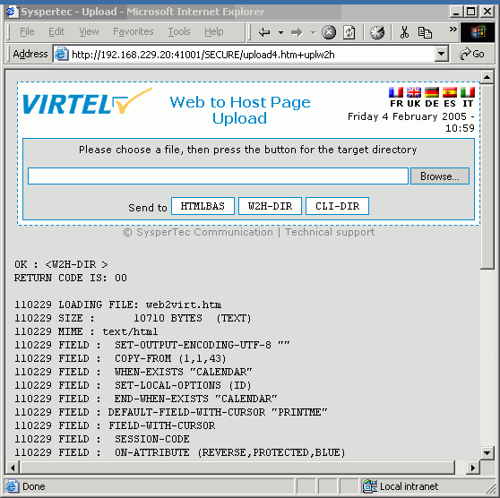
.. |image11| image:: images/media/image13.png
   :width: 5.13563in
   :height: 2.23875in

.. |image13| image:: images/media/image15.png
   :width: 5.09918in
   :height: 2.36833in
.. |image14| image:: images/media/image16.png
   :width: 0.22500in
   :height: 0.22500in
.. |image15| image:: images/media/image17.png
   :width: 0.22500in
   :height: 0.22500in
.. |image16| image:: images/media/image18.jpeg
   :width: 0.22917in
   :height: 0.22917in

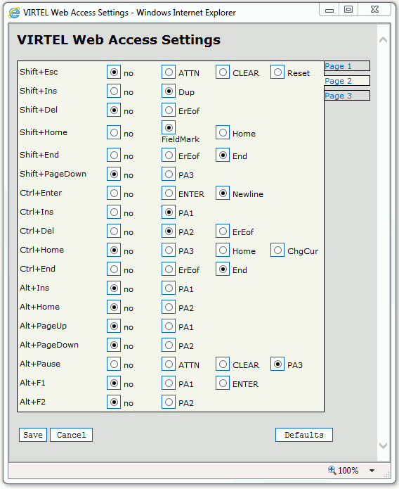

.. |image20| image:: images/media/image22.jpeg
   :width: 0.22917in
   :height: 0.22917in

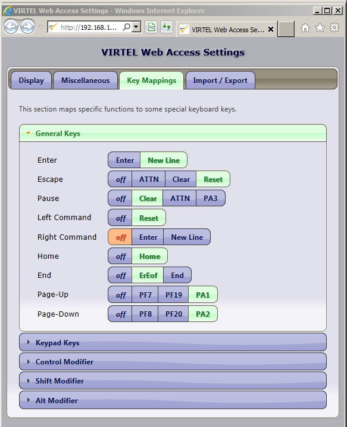

.. |image25| image:: images/media/image27.jpeg
   :width: 5.08938in
   :height: 2.28969in
.. |image26| image:: images/media/image28.png
   :width: 0.30937in
   :height: 0.30937in
.. |image27| image:: images/media/image28.png
   :width: 0.30937in
   :height: 0.30937in

.. |image29| image:: images/media/image30.jpeg
   :width: 5.12552in
   :height: 3.46667in
.. |image30| image:: images/media/image31.jpeg
   :width: 5.11416in
   :height: 3.90292in
.. |image31| image:: images/media/image32.jpeg
   :width: 5.07698in
   :height: 2.95469in
.. |image32| image:: images/media/image33.jpeg
   :width: 5.10239in
   :height: 3.58156in
.. |image33| image:: images/media/image34.jpeg
   :width: 5.10876in
   :height: 3.10573in

.. |image35| image:: images/media/image36.jpeg
   :width: 5.11032in
   :height: 3.77719in

.. |image37| image:: images/media/image38.png
   :width: 5.13562in
   :height: 4.16625in
.. |image38| image:: images/media/image39.png
   :width: 5.13560in
   :height: 1.45406in
.. |image39| image:: images/media/image40.png
   :width: 5.10176in
   :height: 3.15781in
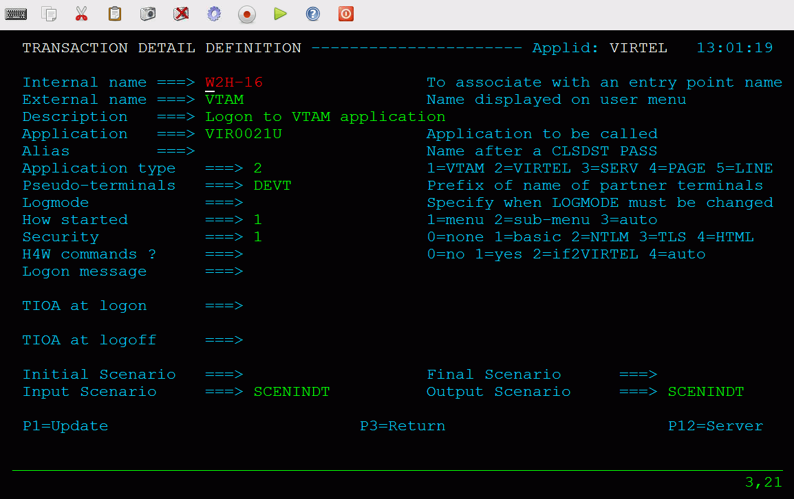
.. |image41| image:: images/media/image42.jpeg
   :width: 5.15687in
   :height: 1.07146in
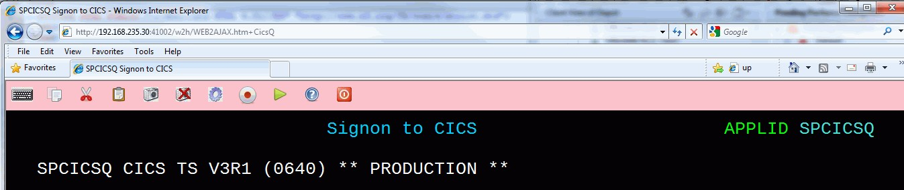
.. |image43| image:: images/media/image44.jpeg
   :width: 5.15531in
   :height: 1.27292in
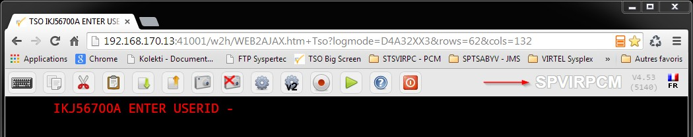
.. |image45| image:: images/media/image46.png
   :width: 5.07834in
   :height: 3.56125in
.. |image46| image:: images/media/image47.png
   :width: 0.22917in
   :height: 0.22917in
.. |image47| image:: images/media/image48.jpeg
   :width: 5.13438in
   :height: 5.81250in

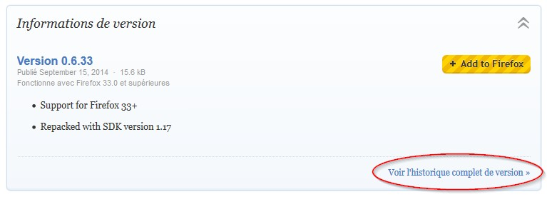
.. |image50| image:: images/media/image51.jpeg
   :width: 5.16146in
   :height: 0.97396in
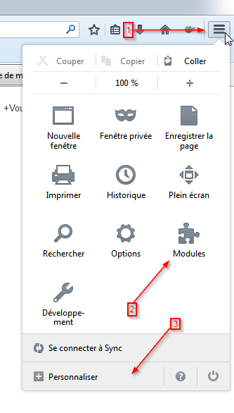
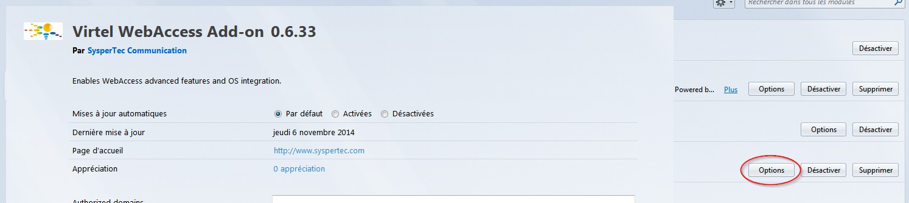
.. |image53| image:: images/media/image54.jpeg
   :width: 5.07937in
   :height: 2.67406in
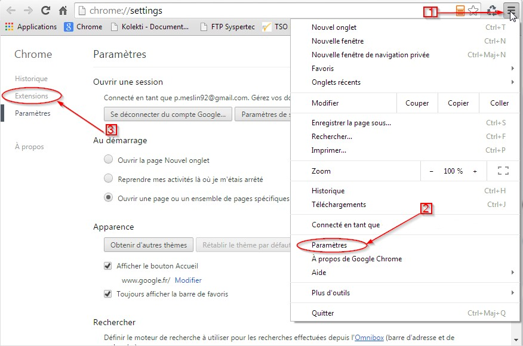
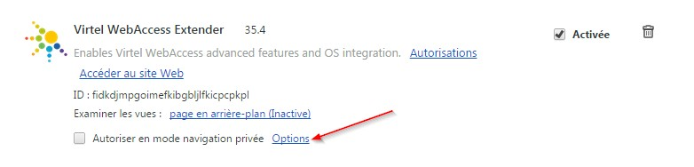

.. |image58| image:: images/media/image59.png
   :width: 1.95686in
   :height: 1.92531in
.. |image59| image:: images/media/image60.png
   :width: 1.95686in
   :height: 1.93583in
.. |image60| image:: images/media/image61.png
   :width: 1.96740in
   :height: 1.94635in
.. |image61| image:: images/media/image62.jpeg
   :width: 0.34375in
   :height: 0.40625in
.. |image62| image:: images/media/image63.png
   :width: 0.34375in
   :height: 0.33333in
.. |image63| image:: images/media/image64.png
   :width: 3.88219in
   :height: 3.16677in
.. |image64| image:: images/media/image65.png
   :width: 5.10583in
   :height: 3.46500in
.. |image65| image:: images/media/image66.png
   :width: 5.09667in
   :height: 7.31500in
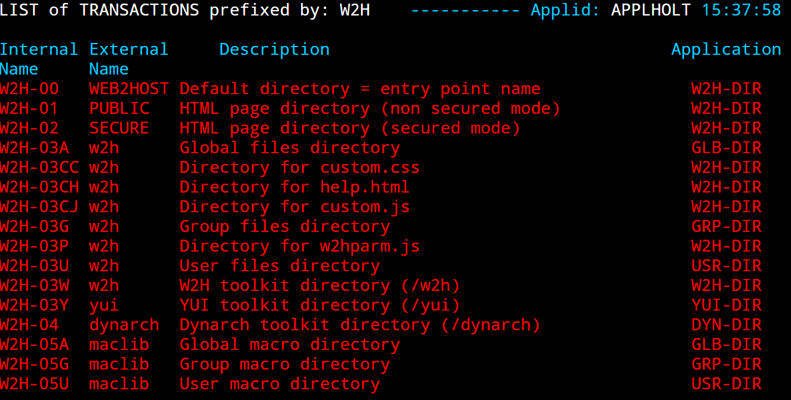
.. |image68| image:: images/media/image68.png
.. |image69| image:: images/media/image69.png

.. |image71| image:: images/media/image71.png
.. |image72| image:: images/media/image72.png
