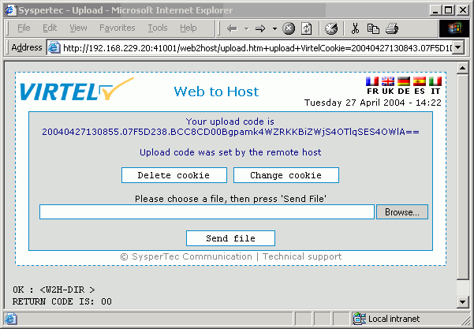
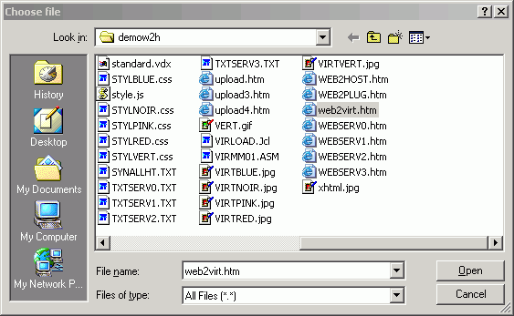
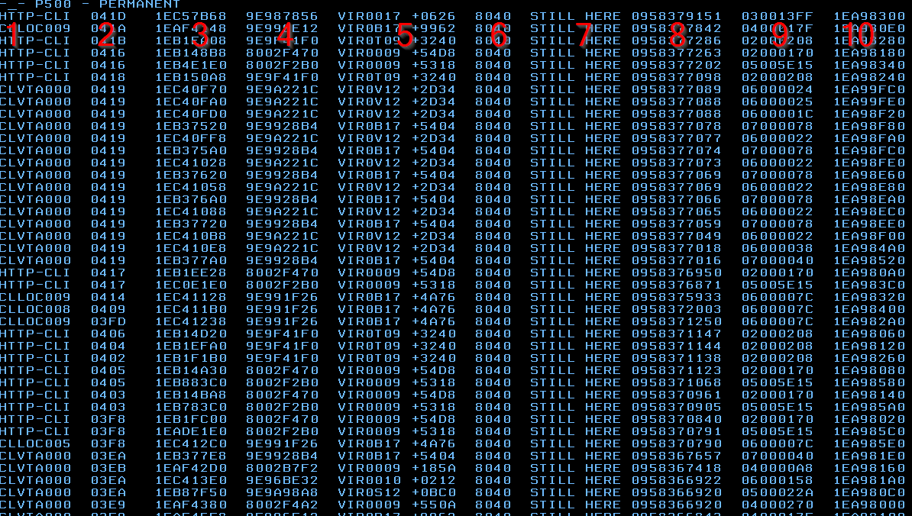

.. _Virtel459AP:

=======================================================
Audit, Administration, Operations and Performance V4.59
=======================================================

|imagelogo|

**VIRTEL Audit, Administration, Operations and Performance**

.. warning:: This is a draft version of the document.

Version : 4.59

Release Date : 08 Jan 2018. Publication Date : 08/02/2018

Syspertec Communication

196, Bureaux de la Colline 92213 Saint-Cloud Cedex Tél. : +33 (0) 1 46 02 60 42

`www.syspertec.com <http://www.syspertec.com/>`__

.. note::

    Reproduction, transfer, distribution, or storage, in any form, of all or any part of 
    the contents of this document, except by prior authorization of SysperTec 
    Communication, is prohibited.

    Every possible effort has been made by SysperTec Communication to ensure that this document 
    is complete and relevant. In no case can SysperTec Communication be held responsible for 
    any damages, direct or indirect, caused by errors or omissions in this document.

    As SysperTec Communication uses a continuous development methodology; the information 
    contained in this document may be subject to change without notice. Nothing in this 
    document should be construed in any manner as conferring a right to use, in whole or in 
    part, the products or trademarks quoted herein.

    "SysperTec Communication" and "VIRTEL" are registered trademarks. Names of other products 
    and companies mentioned in this document may be trademarks or registered trademarks of 
    their respective owners.  

.. _V459AP_Introduction:

Operations
==========

.. index::
   single: Issuing commands    

Commands
--------

VIRTEL allows certain functions to be controlled dynamically by console commands. Use one of the following methods to send a command to VIRTEL, according to the operating system:

.. index::
   pair: z/OS environment; Commands    

z/OS Environment
^^^^^^^^^^^^^^^^

The following modify command may be issued at the z/OS operator console, or from an SDSF session under TSO, in which case the command must be prefixed by the character “/”:

::

    F stcvirte,virtel-command    

stcvirte
    the name of the VIRTEL started task STC

virtel-cmd
    a VIRTEL command, as described in the following section.

.. index::
   pair: z/VSE environment; Commands      

z/VSE Environment
^^^^^^^^^^^^^^^^^

To send a command to VIRTEL, issue the following command at the VSE operator console:

::

    MSG virtel,DATA=virtel-command    

virtel
    The VIRTEL jobname (usually VIRTEL), or the partition in which VIRTEL is executing (for example, F4)

virtel-command
    A VIRTEL command, as described in the following section. Alternatively, issue the following command at the VSE operator console:

::

    MSG Fx    

Fx
    Partition in which VIRTEL is executing

    The system responds with: 

::

    AR 0015 1I40I READY
    Fx-nnnnAR 0015     

.. note::
    
    Note the reply number (nnnn) and issue the following command:

::

    nnnn virtel-command    

nnnn
    reply number

virtel-command
    A VIRTEL command, as described in the following section

.. raw:: latex

    \newpage      

.. index::
   pair: KILL command; Commands    

KILL Command
------------

The KILL command can be used to stop a scenario.

::

    KILL,T=termid

termid
    terminal name

The KILL command requests VIRTEL to abnormally terminate the scenario currently active on the specified terminal.   

.. index::
   pair: LINES command; Commands    

LINES Command
-------------

The LINES command can be used to display a summary of the line status.

::
    
    LINES | LINES,ACT | LINES,INACT    

The LINES command displays the VIRTEL ACB name and a list of the lines defined in the VIRTEL configuration file. The optional keywords ACT or INACT may be used to restrict the display to lines that are in a “active” or “inactive” state respectively.

Example::

    F SPVIREH,LINES                                     
    VIR0200I LINES                                      
    VIR0201I VIRTEL 4.59 APPLID=SPVIREH  LINES          
    VIR0202I ALLOCATED IP ADDRESS = 192.168.170.047     
    VIR0202I INT.NAME EXT.NAME TYPE  ACB OR IP          
    VIR0202I -------- -------- ----- ---------          
    VIR0202I C-HTTP   HTTP-CLI TCP1  :41002             
    VIR0202I E-HTTP   HTTP-EDS TCP1  :41003             
    VIR0202I F-HTTP   HTTP-FOR TCP1  :41005             
    VIR0202I I-CONN   IVP1    *TCP1                     
    VIR0202I LM01TX1  LM01TX1  /FAST UMEHTX1            
    VIR0202I O-HTTP   HTTP-OUT TCP1  £NONE£             
    VIR0202I P-PCLPDF PCL2PDF  TCP1  £NONE£             
    VIR0202I V-HTTP   HTTP-VSR TCP1  :41004             
    VIR0202I W-HTTP   HTTP-W2H TCP1  :41001             
    VIR0202I 9-XMPASS VIRTELXM*XM2   XM44000            
    VIR0202I 9-XMVTA  QLNKHOLT XM1   QLNKCICH           
    VIR0202I ---END OF LIST---                          

.. index::
   pair: LINE command; Commands    

LINE Command
------------

Display line detail
^^^^^^^^^^^^^^^^^^^

To display detail information about a Virtel line use the line detail command.

::

    LINE=linename,DISPLAY (or L=linename,D)

linename
    Internal or external name of the line

The LINE DISPLAY command displays the status of a line and its associated terminals.

Example::

    F SPTHOLTV,LINE=C-HTTP,D                              
    VIR0200I LINE=C-HTTP,D                                
    VIR0207I LINE C-HTTP   TCP1  HTTP STARTED             
    VIR0203I TERMINALS ASSOCIATED WITH LINE C-HTTP        
    VIR0203I TERMINAL RELAY    STATUS                     
    VIR0203I -------- -------- --------                   
    VIR0203I CLLOC000+                              LINKED
    VIR0203I CLLOC001                               LINKED
    VIR0203I CLLOC002                               LINKED
    VIR0203I CLLOC003                               LINKED
    VIR0203I CLLOC004                               LINKED
    VIR0203I CLLOC005                               LINKED
    VIR0203I CLLOC006                               LINKED
    VIR0203I CLLOC007                               LINKED
    VIR0203I CLLOC008                               LINKED
    VIR0203I CLLOC009                               LINKED
    VIR0203I CLVTA000 *W2HPOOL                      LINKED
    VIR0203I CLVTA001 *W2HPOOL                      LINKED
    VIR0203I CLVTA002 *W2HPOOL                      LINKED
    VIR0203I CLVTA003 *W2HPOOL                      LINKED
    VIR0203I CLVTA004 *W2HPOOL                      LINKED
    VIR0203I ---END OF LIST---                            
    VIR0204I TERMINALS IN POOL *W2HPOOL                   
    VIR0204I TERMINAL RELAY    PRINTER  USED BY           
    VIR0204I -------- -------- -------- --------          
    VIR0204I W2HTP000 REHVT000 REHIP000                   
    VIR0204I W2HTP001 REHVT001 REHIP001                   
    VIR0204I W2HTP002 REHVT002 REHIP002                   
    VIR0204I W2HTP003 REHVT003 REHIP003                   
    VIR0204I W2HTP004 REHVT004 REHIP004                   
    VIR0204I ---END OF LIST---           

.. raw:: latex

    \newpage  

.. index::
   pair: Tracing a line; Commands        

Tracing a line
^^^^^^^^^^^^^^^

To activate or deactive a trace on the line the following command can be used:-::

    LINE=linename,NOTRACE | TRACE  [ or L=linename,N | T ]

.. index::
   pair: Starting and Stopping A line; Commands      

Starting and Stopping A Line
^^^^^^^^^^^^^^^^^^^^^^^^^^^^

To STOP or START a line use the LINE command with the START or STOP function.

::

    LINE=linename,START | STOP

    OR
    
    L=linename,P | S  

linename
    Internal or external name of the line

The LINE START and LINE STOP commands perform the same function as the `“S” and “P” commands <#_bookmark12>`__ on the “Status of lines”. These commands may only be issued for line types AntiGATE, AntiPCNE, AntiFASTC, and TCP/IP.
                  
.. index::
   pair: LOG Command; Commands      

LOG command 
-----------

The LOG command enables the VIRTEL log to be spun off to the console, a JES2 output dataset , a dataset [new in V4.58]. The LOG command has the following format:-

::

    F VIRTEL,LOG=CONSOLE | SYSOUT | BOTH | SPIN | FILE

where

    - CONSOLE means switch console messages back to the console.
    - SYSOUT means switch to spooling consoles messages to SYSOUT.
    - BOTH means write console messages to the console and SYSOUT.
    - SPIN means spin off the current SYSOUT dataset.
    - FILE means write messages to file.  

LOG=SYSOUT TCT definition
^^^^^^^^^^^^^^^^^^^^^^^^^

Setting up VIRTEL to use the LOG=SYSOUT facility requires a change to the TCT definition to direct WTOs to a SYSOUT dataset. In the TCT code the following statement:-

::

    LOG=(SYSOUT[,class[,destination]])

    For example, LOG=(SYSOUT,A,EDSPRT)

.. raw:: latex

    \newpage  

This directs all WTOs to a SYSOUT dataset rather than the system console log (SYSLOG). If you want WTO messages going to both the system console and a SYSOUT dataset than issue the following VIRTEL command:-

::

    F VIRTEL,LOG=BOTH

LOG=FILE [New in V4.58]
^^^^^^^^^^^^^^^^^^^^^^^

Setting up Virtel to use the LOG=FILE facility requires a change to the TCT definition. In the TCT code the following statement:- 

::

    LOG=FILE 

This will instruct Virtel to write messages to either the LOGFILEX DD statement or the LOGFILEY DD statement depending on the active LOG. These DDNAMES need to be added to the Virtel procedure to support LOG=FILE option. The following DCB attributes. Recommended space allocation could be 10 tracks for each dataset.  

::

    LOGFILEX and LOGFILEY 
    DCB attributes : PS, LRECL=165, RECFM=VB, BLKSIZE=32000

If either LOGFILE becomes full (X37 Abend) an automatic switch will occur to to the inactive logfile. 

.. index::
   pair: LOG Status Command; Commands

.. index::
   pair: LOG Switch; Commands      

LOG Status | Switch Commands
----------------------------

To determine the status of the LOG file, or to switch the log file manually issue one of the following commands:-

::   
    
    F VIRTEL,LOG,D		Display active logfile
    F VIRTEL,LOG,I		Switch logfiles

.. raw:: latex

    \newpage  

.. index::
   pair: MEMDISPLAY Command; Commands          

MEMDISPLAY Command 
------------------

To display Virtel Internal Memory Usage use the MEMDISPLAY command.

::

    MEMDISPLAY

With the memory diagnostic tool active the MEMDISPLAY command summarize the VIRTEL subpool active allocated memory.

::

    VIR0200I MEMDISPLAY
    VIR0271I DISPLAY 978
    SP1=00024478 SP2=00001044 SP3=0008E35F SP4=00002F61
        00910091 00040009 02380294 000B0011
    SP5=000317DC SP6=0004DF73 SP7=00000000 SP8=00000220
        00C504C7 01370137 00000000 00000002
    POOL CONTROL BLOCK. SUBPOOL=1
    PAG=00109000 NFQ=00109008 #FQ=00000001 FRE=0000B2A0
    PAG=000F9000 NFQ=000F9008 #FQ=00000001 FRE=00000080
    PAG=000E9000 NFQ=000E9008 #FQ=00000001 FRE=00000078
    POOL CONTROL BLOCK. SUBPOOL=2
    PAG=1EC14000 NFQ=1EC14008 #FQ=00000005 FRE=0000EF68
    POOL CONTROL BLOCK. SUBPOOL=3
    PAG=1ECD4000 NFQ=1ECD4008 #FQ=00000002 FRE=00009DF8
    PAG=1ED54000 NFQ=1ED54008 #FQ=00000002 FRE=00001750
    PAG=1EC84000 NFQ=1EC84008 #FQ=00000001 FRE=00000878
    PAG=1ED04000 NFQ=1ED04008 #FQ=00000001 FRE=00000878
    PAG=1ED94000 NFQ=1ED94008 #FQ=00000002 FRE=00002768
    PAG=1ECF4000 NFQ=1ECF4008 #FQ=00000001 FRE=00000878
    PAG=1EE04000 NFQ=1EE04008 #FQ=00000001 FRE=00000878
    PAG=1ED74000 NFQ=1ED74008 #FQ=00000001 FRE=00000878
    PAG=1ECE4000 NFQ=1ECE4008 #FQ=00000001 FRE=00000878
    PAG=1EC64000 NFQ=1EC64008 #FQ=00000001 FRE=00000878
    POOL CONTROL BLOCK. SUBPOOL=4
    PAG=1EC04000 NFQ=1EC04008 #FQ=00000004 FRE=0000CFA0
    POOL CONTROL BLOCK. SUBPOOL=5
    PAG=1ECA4000 NFQ=1ECA4008 #FQ=00000002 FRE=0000D870
    PAG=1ED14000 NFQ=1ED14008 #FQ=00000001 FRE=000043B8
    PAG=1ED24000 NFQ=1ED24008 #FQ=00000001 FRE=000043B8
    PAG=1EC74000 NFQ=1EC74008 #FQ=00000001 FRE=0000A1D8
    PAG=1EC54000 NFQ=1EC54008 #FQ=00000001 FRE=0000A1D8
    PAG=1EBB4000 NFQ=1EBB4008 #FQ=00000001 FRE=000043B8
    POOL CONTROL BLOCK. SUBPOOL=6
    PAG=1EBF4000 NFQ=1EBF4008 #FQ=00000002 FRE=00000A50
    PAG=1EBE4000 NFQ=1EBE4008 #FQ=00000001 FRE=00000088
    PAG=1EBD4000 NFQ=1EBD4008 #FQ=00000001 FRE=000000B8
    PAG=1EBC4000 NFQ=1EBC4008 #FQ=00000001 FRE=000000D0
    PAG=1EBA4000 NFQ=1EBA4008 #FQ=00000001 FRE=00000108
    POOL CONTROL BLOCK. SUBPOOL=7
    PAG=00000000 NFQ=00000000 #FQ=00000000 FRE=00000000
    POOL CONTROL BLOCK. SUBPOOL=8

The display response is split into a summary section for each subpool and a detailed allocated page block and free queue element display for each subpool.In the summary display, each subpool has two displayed values. The top value is the amount of storage currently allocated and the value below represents the current allocation in 1K chunks and a peak allocation in 1K chunks.

For example in the above display in SP5 we can see that there is an allocated value of 317DC bytes, represented by 00C5 in 1K chunks, and a peak value of 04C7 in 1K chunks.At the bottom of the display is a line which provide allocated, free and total values.

.. index::
   pair: Enbaling MEMDISPLAY; MEMDISPLAY Command    

Enabling the MEMDISPLAY function 
^^^^^^^^^^^^^^^^^^^^^^^^^^^^^^^^

Memory Display feature is activated by using the MEMHST subparameter in the MEMORY parameter present in the VIRTCT.(see the VIRTCT subparameter MEMHST in “VIRTEL459 Installation User Guide”).

.. index::
   pair: Disabling MEMDISPLAY; MEMDISPLAY Command    

Disabling the MEMDISPLAY function
^^^^^^^^^^^^^^^^^^^^^^^^^^^^^^^^^

It can be deactivated by using the command.

::

    F VIRTEL,MEMDISPLAY,DISABLE

.. note::

        This command should only be implemented when advised to do so by Technical Support. Performance degradation might occur due to the additional monitoring services. This will depend on VIRTEL demand.

.. raw:: latex

    \newpage  

.. index::
   pair: MSG Command; Commands    

MSG Command
-----------

To send a mesage to VIRTEL Multi-Session users use the MSG command::

    MSG=message text

The specified message will be displayed on the VIRTEL multi-session screen.

.. index::
   pair: NEW Command; Commands   

NEW Command
-----------

The NEW command refreshes a VIRTEL program, VIRSV service or scenario.

::

    NEW=progname

progname
    program name

The NEW command requests VIRTEL to load a fresh copy of a program  (presentation module, exit, etc) into the VIRTEL address space. This is required after an update has been made to a program. The message     VIR0060W PROGRAM progname IS A NEW COPY indicates a successful reload. The message VIR0061W PROGRAM progname NOT IN MEMORY indicates that the program has not yet been loaded into the VIRTEL address space. In this case, VIRTEL will load the program automatically when it is next needed.

.. index::
   pair: RELAY Trace Command; Commands   

RELAY TRACE Command
-------------------

Use the RELAY command to trace the Virtel buffers between Virtel and the application.

RELAY=relayname,NOTRACE | TRACE

.. index::
   pair: RELAYS; Commands   

RELAYS Command
--------------

To display a list of Virtel LU relays use the RELAY command.

::  
  
    RELAYS    

The RELAYS command displays the VIRTEL ACB name and a list of the relay LUs opened by VIRTEL. Foe example::

    F SPTHOLTV,RELAYS                                         
    VIR0200I RELAYS                                           
    VIR0214I ACTIVE RELAY ACBS FOR VIRTEL 4.59 APPLID=APPLHOLT
    VIR0214I TERMINAL RELAY    APPLID   CLIENT                
    VIR0214I -------- -------- -------- ---------------       
    VIR0214I CLVTA004 REHVT000 SPCICST  192.168.92.58         
    VIR0214I W2HIP000 REHIP000                                
    VIR0214I ---END OF LIST---                                

.. raw:: latex

    \newpage  

.. index::
   pair: SILENCE Command; Commands     

SILENCE Command
---------------

To supppress Virtel messages use the SILENCE command::

    SILENCE

The SILENCE command reverses the state of the SILENCE parameter in the VIRTCT. Its purpose is to activate or deactivate the suppression of terminal connection and disconnection messages written to the operator console.

.. note::

    Refer to the section SILENCE parameter in the "Parameters of the VIRTCT" in the VIRTEL Installation Guide for a list messages affected by this command.)
.. index::
   pair: SNAP Command; Commands         

SNAP Command
------------

This command is used to take a dump of the Virtel SNAP internal trace table.

::

    SNAP
 
The SNAP command prints the contents of the VIRTEL internal trace table to the SYSPRINT file . See “VIRTEL SNAP” for further information.

Terminal or Relay SNAP
^^^^^^^^^^^^^^^^^^^^^^

::

    SNAP,T=termid | R=relayname

termid
    terminal name

relayname
    name of VTAM relay LU currently associated with the terminal

.. index::
   pair: SNAPMSG Command; Commands     

SNAPMSG Command
---------------
::

    SNAPMSG,ALL    

The SNAPMSG command requests VIRTEL to generate an automatic SNAP after certain messages (VIRI902W VIR0026W VIR0052I VIR1552I VIR0526W VIR1952I).

::

    SNAPMSG=message,search,action

The SNAPMSG commmand allows a SNAP or DUMP to be taken whenever a particular message number is issued by VIRTEL. The command has an additional search field which can be used to identify a message with a paticular character string, for example a specific return code. This feature is also avalable by using the SNAPMSG parameter in the TCT. See “SNAPMSG parameter” in the Virtel Installation Guide.

message
    Any message that can be issued by Virtel.

search
    Any seache criteria issued within the message. The search file is restricted to a maximu of 10 characters. Anything beyond will be ignored. Default search is none.

action
    Possible values are S for SNAP or A for ABEND. Virtel will abend with a U0999 abend code, reason code 15 if the ABEND action is used.
    
Default action is SNAP.

Example:
::
 
	F VIRTEL,SNAPMSG=VIRHT51I,CALL,S

.. index::
   pair: SNAP80 Command; Commands         

SNAP80 Command
--------------

::

    SNAP80 

The SNAP80 command prints the contents of the VIRTEL internal trace table in 80 column format, whatever the current value of the SNAPW parameter.

.. index::
   pair: SNAPW Command; Commands         

SNAPW Command
-------------

The format of the SNAP output can be adjusted with the SNAPW command.

::

    SNAPW=80 | 132

The SNAPW command sets the width for future SNAP commands (80 or 132 columns). The SNAPW parameter in the VIRTCT determines the default width at VIRTEL startup. Refer to the section “Parameters of the VIRTCT” in the VIRTEL Installation Guide for details of the SNAPW parameter.

.. index::
   pair: STAT Command; Commands      

STAT Command
------------

Display statistics file information
^^^^^^^^^^^^^^^^^^^^^^^^^^^^^^^^^^^

To display information about the Virtel statistics file management use the STAT command.

::
    
    STAT,D

This command displays the status of the VIRSTATx files (message VIR0601I). The STAT command is used to manage the VIRTEL statistics recording files (VIRSTATx). This command can be used only if STATS=MULTI is specified in the VIRTCT.

Switch the VIRSTAT file
^^^^^^^^^^^^^^^^^^^^^^^

To switch the STATISTIC file using the STAT switch command.

::
    
    STAT,I    

This command forces VIRTEL to free the current VIRSTATx file and to start recording onto the next file. 

.. index::
   pair: STOP Command; Commands   

STOP Command
------------

To stop Virtel issue the STOP command::

    STOP        

The STOP command allows to STOP the VIRTEL task. This command is intended to be mainly used in VSE environment even if it is also available in z/OS environmment. On z/OS environment you can also use the following command :

::

    P VIRTEL

.. index::
   pair: TCT Command; Commands     

TCT Command
-----------

The TCT command displays some of the TCT options that have been defined in the active TCT.

::

    F SPVIREH,TCT                                                       
    VIR0200I TCT                                                        
    VIR0270I DISPLAY                                                 
    VIRTEL TCT=VIRTCTEH:                                                
    SILENCE=N,MEMORY=(A,N),BFVSAM=32768,BUFDATA=016,BUFSIZE=20000,STR=03
    COUNTRY=FR,GMT=SYSTZ,DEFUTF8=IBM1147 ,LANG=E,MAXSOCK=00240,VSAMTYP=N
    APPLID=SPVIREH ,SMF=N,PASSTCK=Y,VIRSECU=Y,SWA=N,NBTERM=0500,NTASK=04
    MEMORY=(SYS(0001688K,0001688K),DATA(0002304K,0003200K)),LOG=CONSOLE 
    VIR0280I END                                                        

.. index::
   pair: TERM Command; Commands  

TERM Command
------------

Use the TERM command to activate a Terminal trace. This will trace data between the browser and Virtel.

TERM=termid,NOTRACE | TRACE  [or T=termid,N | T ] 

.. raw:: latex

    \newpage  

.. index::
   pair: TRACE Command; Commands

.. index::
   pair: NOTRACE Command; Commands             

TRACE | NOTRACE Command
-----------------------

A trace can be activated or deactivated on a terminal, line or relay.

::
    
    TRACE,T=termid
    TRACE,L=linename
    TRACE,R=relayname
    NOTRACE,T=termid
    NOTRACE,L=linename
    NOTRACE,R=relayname    
    
termid
    terminal name

linename
    Internal or external name of the line    

relayname
    relay associated to the terminal

It is often easier to identify the relay used whose name appears at the bottom of the 3270 session screen as shown below.

|image23|
*Associated relay names*

linename
    Internal or external name of the line

The following alternate forms of the TRACE/NOTRACE commands are also  valid

::

    TERM=termid,TRACE (or T=termid,T)
    TERM=termid,NOTRACE (or T=termid,N)
    LINE=linename,TRACE (or L=linename,T)
    LINE=linename,NOTRACE (or L=linename,N)
    RELAY=relayname,TRACE (or R=relayname,T)
    RELAY=relayname,NOTRACE (or R=relayname,N)

termid
    terminal name

linename
    Internal or external name of the line

relayname
    Name of VTAM relay LU currently associated with the terminal

.. index::
   single: Display active traces     

Display a list of active traces
^^^^^^^^^^^^^^^^^^^^^^^^^^^^^^^

::

    TRACE,DISPLAY | D 

An example of the response is:-::

    F VIRTEL,TRACE,DISPLAY or F SPVIREH,TRACE,D
    VIR0200I TRACE,D
    VIR0208I VIRTEL INTERNAL TRACE = YYY. EXT. BUFFERS = 0001/00FF.
    VIR0213I NO ACTIVE TRACES      

.. raw:: latex

    \newpage

.. index::
   single: Setting trace options        

Setting trace options
^^^^^^^^^^^^^^^^^^^^^

To set the trace options issue the following command::

    TRACE,VIT=Y|N Y|N Y|N  

The default VIT trace parametr is YYN. The external archive trace setting should only be set when instructed to by Virtel support.

The VIT indicators apply the the level of tracing.

::

    - Y|N           No tracing or minimal tracing
    - Y|N           Data elements traced
    - Y|N           External Archive active

.. index::
   single: Deactivating all traces     

Deactivate all traces        
^^^^^^^^^^^^^^^^^^^^^

::

    NOTRACE,ALL

This command does not affect any memory trace. To stop a memory trace, refer to “Memory trace management”

.. index::
   pair: VIRSV Command; Commands            

VIRSV Command
-------------

Refreshing a VIRSV Service program

::

    VIRSV,NEW=servname    

servname
    service name

The VIRSV,NEW command requests VIRTEL to stop the requested VIRSV service. This has the effect of loading a fresh copy of the associated service program the next time the service is invoked by a scenario. The message VIR0260W SERVICE servname IS A NEW COPY indicates that the service was stopped successfully. The message VIR0261W

SERVICE servname NOT IN MEMORY indicates that the service is not yet started. In this case, VIRTEL will start the service and load the  program automatically when it is next needed.

.. index::
   pair: ZAP Command; Commands            

ZAP Command
-----------

The ZAP command allows dynamic patching of a Virtel Program

::

    ZAP=progname+offset,verify,replace

progname
    program name

offset
    offset into program

verify
    verify value (2 to 8 hexadecimal digits)

replace
    replacement value (2 to 8 hexadecimal digits)

The ZAP command allows the dynamic application of a corrective patch to a program while VIRTEL is running. This command is intended to be used only under the advice of Syspertec technical support personnel.

.. index::
   singlepair: Administration  

Administration
==============

.. index::
   pair: Line Status Application; Administration        

Line Status Application
-----------------------

The Line Status sub-application allows the administrator to display the current status of lines and terminals or irtual circuits (CVC) managed by VIRTEL control, and optionally to modify the status of lines.

.. index::
   pair: Displaying Line Status; Line Status Application        

Displaying line status
^^^^^^^^^^^^^^^^^^^^^^

The Line Status sub-application is invoked by pressing [PF9] in the Configuration Menu, by pressing [PF10] in the Sub- Application Menu, or via the Multi-Session Menu using a transaction which calls module VIR0027.

When the security subsystem is active, access to Line Status sub-application from the Configuration Menu or the Sub- Application Menu is controlled by the resource $$UTIL$$.
When accessed by a transaction, normal transaction security rules will apply. Security management is described in chapter 5 of the VIRTEL Users Guide.

The sub-application begins by displaying the Line Status Display screen. Started lines are displayed in high-intensity or white text, stopped lines are displayed in low intensity or blue text.

|image21|

*Fig.1 - Line Status Display screen*

STATUS OF-LINES
    Allows the administrator to display a subset of lines, by typing the
    first character of the name of each desired line into this field and
    pressing [Enter]. If the field is blank, all lines are displayed.

C
    Command input field.
Name
    The internal name of the line.
In
    The number of virtual circuits currently in use by incoming calls.
Out
    The number of virtual circuits currently in use by outgoing calls.
Links
    The number of terminals linked to the line.
Description
    Comments.
Seen
    User name.

Positioning the list
^^^^^^^^^^^^^^^^^^^^
If the line status display occupies more than one screen, you can scroll through the list of lines by using [PF5], [PF7] and [PF8].

[PF5]
    return to the first page of the list.

[PF7]
    scroll back to previous page.

[PF8]
    scroll forward to next page.

.. index::
   pair: Sending a command; Line Status Application        

Sending a command
^^^^^^^^^^^^^^^^^
To send a command to a line, place the cursor in the “C” field in front of the line name, type the command, then press [Enter]. The  commands available are:

S
    Starts a line.
        If the line is already started, VIRTEL attempts to start or restart any terminals associated with the line but not currently linked. This allows VIRTEL to recover LU’s which have been     deactivated and reactivated by VTAM, without stopping the line.

p
    Stops a line.
        The LINE START and STOP commands can also be issued from the z/OS or VSE console. See “Starting and stopping a line"

To return to the configuration menu, press [PF3] or [Clear].

.. index::
   pair: Displaying Line Usage; Line Status Application   

Displaying Line Usage
^^^^^^^^^^^^^^^^^^^^^

To display the status and line usage place the cursor on the desired line in the Line Status Display screen and press [PF12].

Security rules are the same as those which apply to the previous screen.

This sub-application begins by displaying the terminal usage for the selected line, as shown in the example below:

|image22|

*Fig.2 - Line Usage Detail Display screen*

ACTIVE TERMINALS for LINE
    Indicates the internal name of the line whose virtual circuits are being displayed.
Prefix
    The terminal name prefix associated with this line.
Type
    The line type, as defined in the line definition.
Defined
    The number of terminals defined for this line.
Linked
    The number of terminals currently linked to this line.
Number of occupied circuits
    The number of terminals or virtual circuits currently in use.
Number of connections
    The total number of calls received.
Maximum simultaneously used
    The maximum number of terminals or virtual circuits in use at any one time.
Total time connected
    The total connection time.
Terminal
    The terminal name (name of the virtual circuit).
User
    User name if signed on to VIRTEL.
Sends
    The number of messages sent to the terminal.
Time
    The connection time in minutes.
Node (for Minitel)
    The name of the node to which the terminal is currently connected.
Node (for HTTP lines)
    The relay name (3270 LU name) used to connect to the host application.
Remote number (for X25 lines)
    The X25 called number for an outgoing call, or the X25 calling number for an incoming call.
Remote number (for HTTP lines)
    The IP address of the client.
Call Data (for X25 lines)
    The call user data field of the call packet (for both incoming and outgoing calls).
Call Data (for HTTP lines)
    The external name of the transaction which represents the directory (pathname) in the URL.

    If the Virtual Circuit Status Display occupies more than one screen, you can scroll through the list of terminals by using [PF7] and [PF8].

[PF7]
    scroll back to previous page.

[PF8]
    scroll forward to next page.

    You can use the [PF4] and [PF5] keys to display information about the other lines under VIRTEL control. To view the terminal or Virtual Circuit Status Display screen for the following line, press [PF4]. To return to the Detail Usage Status Display screen for the first line defined in VIRTEL, press [PF5].

    To return to the Lines Status Display, press [PF3]. To return to the Configuration Menu, press [Clear].

.. raw:: latex

    \newpage  

.. index::
   single: Memory Display Application           

Memory Display Application
--------------------------

The VIRTEL memory management sub-application allows the system  administrator to display VIRTEL memory utilisation in real time. The memory management sub-application is a pseudo-graphical display which shows the allocation of VIRTEL memory by function. VIRTEL manages its own memory, in order to avoid memory shortages as a result of fragmentation. The memory management display can be used by the administrator to help understand VIRTEL’s memory requirements during normal operation.

To invoke the memory management sub-application, press [PA2] in the Configuration Menu to display the Sub- Application Menu, then press [PF4] in the Sub-Application Menu. The sub-application displays a screen similar to the example shown below. This screen represents the contents of the VIRTEL address space after deducting the space  occupied by the VIRTEL kernel modules.

|image26|

*Fig 25. Memory display of VIRTEL address space*

Each screen position represents a 2K memory block (if MEMORY=BELOW is specified in the VIRTCT), or a 64K memory block (if MEMORY=ABOVE). The address displayed at the start of each line is the virtual address represented by the first position in the line. Each free memory block is represented by a dot. Lines which consist entirely of dots are not displayed.

Permanently allocated memory blocks are represented by the following character types: 
 
    1. To avoid memory shortages as a result of fragmentation, these blocks are always allocated at the end of the VIRTEL address space. 
    2. Temporarily allocated memory blocks. Blocks of this type are allocated and freed by VIRTEL as required.  
    3. Memory blocks used by the VIRTEL Multi-Session feature to save screen images. Blocks of this type are allocated and freed by VIRTEL as required.
    4. Memory blocks used for saving EIB and other session-related information. Blocks of this type are allocated and freed by VIRTEL as required.
    5. Communication areas by VIRTEL sub-applications. Blocks of this type are allocated and freed by VIRTEL as required.
    6. Sub-application modules loaded in the z/VSE SUBPOOL. Blocks of this type are allocated and freed by VIRTELas required.

.. index::
   pair: Using Memory=Test; Memory Display Application   

Memory display in Memory=Test mode.
^^^^^^^^^^^^^^^^^^^^^^^^^^^^^^^^^^^

If MEMORY=TEST is specified in the VIRTCT, the memory management sub-application displays its results in a different format. MEMORY=TEST mode allows support technicians to analyse memory occupation by module, as a debugging aid for possible memory shortage problems.

|image28|

*Fig. 26 - Memory display in MEMORY=TEST mode*

Each line of the screen represents one VIRTEL module which has obtained one or more memory blocks. The first column represents the number of bytes of memory (en hexadecimal) currently allocated by the module. The first 16 modules are displayed, in descending order of memory utilisation.

Where the memory display occupies more than one screen, you can press [PF8] to view the following page, [PF7] to view the previous page, and [PF6] to go back to the first page.

To refresh the display with up-to-date information, press [Enter].

To return to the sub-application menu, press [PF3] or [Clear]

5.2 Virtual Memory Display

The Memory display feature is a memory diagnostic tool created to trap possible invalid Virtel memory free requests. Such request can lead to ABEND0C4s and other unwanted behaviour. Virtel memory requests (PRENDRE and RENDRE) are tracked in a diagnostic storage area located above the bar. The area is 1MB in size and can contain 65536 active storage requests. An active storage request is a storage area that has been gotten (PRENDRE) and is pending a Virtel storage release (RENDRE).

.. note::
    
    This diagnostic tool should only be used when recommended by Technical Support.

.. index::
   pair: Memory trace management; Memory Display Application       

Memory trace management
^^^^^^^^^^^^^^^^^^^^^^^

Activating the memory trace
"""""""""""""""""""""""""""

A memory trace can be activated using a command or from the VIRTCT. In both case, VIRTEL records an history of memory allocations that appears in a SNAP listing. A memory trace can be activated by using the following command

::
    
    MEMTRACE

The will produce the following response:

::

    VIR0200I MEMTRACE
    VIR0214I MEMORY TRACE STARTED
    VIR0218I MEMORY TRACE FOUND 00000000 BLOCKS USING 0000000000000000 BYTES (00000000 MEGS)

Resetting the memory trace
""""""""""""""""""""""""""

A memory trace can be reseted by using the following command:-

::

    MEMTRACE,Clear     

The trace is stopped, memory blocks used by the memory trace are released, the trace is restarted.

::

    VIR0200I MEMTRACE,CLEAR
    VIR0218I MEMORY TRACE FOUND 00000011 BLOCKS USING 0000000000053344 BYTES (00000000 MEGS)
    VIR0216I CLEARING MEMORY TRACE
    VIR0217I MEMORY TRACE CLEARED
    VIR0214I MEMORY TRACE STARTED
    VIR0218I MEMORY TRACE FOUND 00000000 BLOCKS USING 0000000000000000 BYTES (00000000 MEGS)

Stopping the memory trace
"""""""""""""""""""""""""

A memory trace can be stopped by using the following command:-

::

    NOMEMTRACE

The trace is stopped, memory blocks used by the memory trace are released.

Setting Memory Trace in the VIRTCT 
""""""""""""""""""""""""""""""""""

A memory trace can be activated from the VIRTCT by using MEMORY=TEST or MEMORY=(ABOVE,TRACE) parameter. In such case, the is no message VIR0218I display in the log, but only the benefit of recording the history of memory allocations is kept in the SNAP.

Since it is not possible to stop a trace initialized in this way, it is best to only use this method to perform an analysis of the memory allocation during the startup phase.
Once a memory trace activated, issuing a SNAP command produce a report of the memory allocations history in the SNAP listing.

|image27|

*Example of a memory allocataion history*

Column Explanations
    1. Line or terminal name for which memory allocation is performed. This information is omitted when the allocation relates VIRTEL itself.
    2. Task number behind the allocation request.
    3. Register 14 value.
    4. Register 15 value.
    5. Program name + offset of the origin request.
    6. Memory allocation type. (8040 = GETMAIN).
    7. Memory block state.
    8.  Time of the allocation.
    9.  Type and size of the allocation. The two first bytes represents the type of memory allocated (See “Memory display of VIRTEL address space” for a complete description of the memory block type.). The six last bytes represents the size of the memory block allocated.
    10. Reserved for internal use.

Tracing memory activity can produce an important overhead estimated to 20-30% of the activity. When using MEMTRACE command, the memory previously allocated to records history is released.

.. raw:: latex

    \newpage  

.. _#_V459AP_maintenance:

.. index::
   single: Maintenance    

.. index::
   pair: Maintenance; Administration          

Maintenance
-----------

Maintence is normally delivered through email or by downloading a maintenance package from the Virtel ftp web server - https://ftp-group.syspertec.com/login/. Maintenance comes as either zaps to the Virtel mainframe modules or updates to the web elements. Application of the mainframe zaps is through the IBM Utility AMASPZAP. The updates to the web elements is through a Virtel GUI Drag and Drop interface or via a Virtel Batch process. This is found in the Administration Portal of Virtel. The Drag and Drop interface is described in section 1.6.2 in the Virtel User Guide.

.. index::
   pair: Applying z/OS maintenace via batch; Maintenance

Applying z/OS maintenance.
^^^^^^^^^^^^^^^^^^^^^^^^^^

By default, maintenance to the z/OS components of Virtel is delivered as AMASPZAP control statements either delivered as an email attachment or dowloaded from the Syspertec ftp web server. The mainframe zap packages come as an accumulation file called either *allptfs-mshpvrr.txt* (z/VSE) or *allptfs-mvsvrr-txt* (z/OS). 

|image29|

*Syspertec ftp web server*

.. raw:: latex

    \newpage

Once downloaded and unzipped, the zap package will contain a sequential text file of AMASPZAP statements. These should be uploaded to the Virtel CNTL file as PTFvrrMV. The JOB ZAPJCL, also located in the CNTL file, should then be submiited to apply the zaps contained in the PTFvrrMV file. As the PTFvrrMV is an accumulation of PTFs some editing will have to be done to remove zaps that have already been applied. Virtel will report the zap maintenace level when it starts up.

::

    VIR0018I VIRTEL 4.59 HAS THE FOLLOWING PTF(S) APPLIED
    VIR0018I 5530,5540,5549,5557,5559,5567               
    VIR0089I VIRTEL RUNNING FROM AN AUTHORIZED LIBRARY   

.. index::
   pair: Applying maintenace to the TRSF files; Maintenance

Applying maintenance to the TRSF files
^^^^^^^^^^^^^^^^^^^^^^^^^^^^^^^^^^^^^^

The updates to the web entities are delivered as an accumulation update file called *virtelvrrupdtnnnn1.zip* where nnnn is the update number. These update files can be downloaded from the Syspertec ftp web server. Applying updates to the web elements is through a manual drap and drop GUI or via a batch process. Download the update package and unzip the contents. A directory structure representing the Virtel SAMPTRSF directories will be built. Note, not all of the directories are shipped with an update package, only those that have maintenance will be shipped. Normally, the W2H-DIR contains the majority of web element updates. The Administration portal is used to upload the updates to the Virtel directories. After applying the updates to the Virtel directories refresh the browsers cache to force an update of the client web elements.

|image30|

*Unzipped update file* 

In the above example, the update file contains updates to the W2H and DOC directories. The members in each directory should be selected (CTRL-A) and dragged over to the "Drag and Drop" upload option of the Virtel Administration portal, normally setup on port 41001.

|image31|

*Virtel Administration Portal*

Open the "Drag and Drop" interface in Virtel, and then drag the files over on to the relvant directory in the upload interface. A upload window will open showing the results of the upload.

|image32|

*Virtel Drag and Drop Interface*

.. index::
   pair: Applying maintenace via batch; Maintenance

Applying maintenance via batch.
^^^^^^^^^^^^^^^^^^^^^^^^^^^^^^^

A batch maintenace package called virtelrvvVMPnnnn.zip can also be used to apply maintenance to the SAMPTRSF file. Using the batch process doesn't require any manual process, it runs as a batch job on the mainfram. However, the target Virtel instance cannot be running at the same time. the process for applying a Virtel Maintenace Package is outlined in the Virtel Technical newsletter "TN201709 Virtel batch maintenance". This can be viewed online at http://virtel.readthedocs.io/en/latest/manuals/newsletters/TN201709/TN201709.html  

.. raw:: latex

    \newpage  

.. _#_V459AP_correspondent_management:

.. index::
   single: Correspondent Management

Correspondent Management
------------------------

One of the methods which VIRTEL may use to identify users is by means of a security code which the user presents to VIRTEL, either in an incoming e-mail, or by means of a “cookie” included in an HTTP request by the browser. A user which VIRTEL recognizes in this way is known as a “Correspondent”. VIRTEL stores the list of correspondents in a VSAM file known as the “Correspondent file”, also known as the “VIRHTML” file.

VIRTEL uses the correspondent file for the following purposes:
- the rules of an HTTP line permit VIRTEL to distinguish between correspondents and non-correspondents when processing incoming HTTP requests. When the requesting user is identified as a correspondent, a special entry point may be assigned, or a set of rules specific to the user may be executed. Refer to “Rules” in the VIRTEL Connectivity Reference manual for further details.
- the rules of an HTTP line may assign a specific LU name to a correspondent connecting to a host application via web access. This is known as “LU nailing” and is described in more detail in the VIRTEL LU Nailing HOWTO manual.
- a correspondent may be authorized to upload HTML pages and other elements into an HTMLTRSF file. For further details, refer to :ref:`“Uploading pages by SMTP” <#_V459AP_http_uploading_pages_smtp>` and :ref:`“Uploading pages by HTTP (secured by cookie)” <#_V459AP_http_uploading_pages>`.

There are two types of correspondent: an e-mail correspondent and a local correspondent:
- An **e-mail correspondent** is always defined by the VIRTEL administrator. When the administrator activates an email correspondent, VIRTEL sends an e-mail message to the correspondent containing the security code. The correspondent then either replies to the e-mail message or clicks on a link in the message to connect to VIRTEL.
- A **local correspondent** is activated by the correspondent using a procedure known as “self-registration”. The self-registration procedure creates a clickable link which delivers the security code to the correspondent’s browser via a cookie. The VIRTEL administrator may optionally pre-define or change the characteristics of a correspondent by using the correspondent management sub-application. Self-registration is described in the VIRTEL LU Nailing HOWTO manual.

.. index::
   pair: Access; Correspondent Manangement

Access to the application
^^^^^^^^^^^^^^^^^^^^^^^^^

The correspondent management sub-application, which allows the VIRTEL administrator to define the parameters
associated with a correspondent, is accessible by pressing [PF5] in the VIRTEL configuration menu, or [PF12] in the
system services sub-application menu, or from the VIRTEL Multi-Session screen via an application referencing the
module VIR0041A.

.. index::
   pair: Security; Correspondent Manangement

Security
^^^^^^^^

When security is active, access to the correspondent management sub-application from the configuration menu or
from the system services sub-application menu is controlled by the resource $$PCPC$$.
When it is accessed by a transaction, the rules of security management of transactions will apply.
Security management is described under the heading “Security” 282.

.. index::
   pair: Objectives; Correspondent Manangement

Objectives
^^^^^^^^^^

This sub-application initially displays a summary screen of existing definitions presented in alphanumeric order. Access
to the detail of a correspondent is achieved by positioning the cursor and pressing [PF12].

|image74| 

*Summary of correspondence*

|image75|
*Correspondent detail screen (e-mail correspondent)*

::

        CORRESPONDENT DETAIL DEFINITION -------------------- Applid: SPVIRE2 16:40:04
        Id                 ===> WKSTN-A2FE/SYSPERTEC
                                workstation/lan
        Type of Id         ===> 2             1:Email 2:Local+fixed 3:Local+changing
        Activation message ===>
                                              Text of 'OK' message to user.
        VTAM name          ===> RRVTC006      &1 parameter to specify VTAM LU name
        Rule Set           ===>               Rules to choose an entry point
        Directory          ===>               Where data is to be uploaded
        Last contact       ===> 30 Jun 2009 11:24:49 192.168.002.082
        Contacts           ===> 00000010 Number of times cookie was updated
        Date created       ===> 30 Jun 2009 10:35:30
        Created by         ===> VIRDBA
        Date activated     ===> 30 Jun 2009 10:35:30
        Activated by       ===> VIRDBA
        Date disabled      ===>
        Disabled by        ===>

        P1=Update                           P3=Return                      Enter=Add
        P4=Activate                         P5=Disable                     P6=Rules

*Correspondent detail screen (local correspondent)*

.. raw:: latex

    \newpage 

.. index::
   pair: Field contents; Correspondent Manangement

Field Contents
^^^^^^^^^^^^^^

Id
    For an e-mail correspondent: the e-mail address of the correspondent. For a local correspondent: a unique identifier generated by the self-registration procedure, or assigned by the VIRTEL administrator.

Type of Id
    1. this is an e-mail correspondent
    2. this is a local correspondent whose security code is generated at activation time and subsequently remains constant
    3. this is a local correspondent whose security code changes each time it is accessed.

Activation message    
    Message received by the user at time of activation of his account. This message can contain a link allowing the user to connect to a host application or to open the upload.htm page with automatic installation of an authorization cookie.

        The activation message may include the following variables: 
            &R meaning “insert a blank line”. 

            &C meaning “insert security code”. The activation security code is inserted into the message in the form VirtelCookie=xxx.

Rule Set
    (optional) The name of the rule set associated with this user.
Directory
    (optional) Name of the directory into which this correspondent may upload files.
Last contact
    Date and time of the last transfer, and the IP address of the correspondent.
Contacts
    The number of contacts since the last activation.

.. _#_V459AP_account_activation:    

.. index::
   pair: Account activation; Correspondent Manangement

Account activation
^^^^^^^^^^^^^^^^^^

In order to be operational, a correspondent account must be activated. This is achieved by pressing [PF4] at the CORRESPONDENT DETAIL DEFINITION screen. In the case of an e-mail correspondent, VIRTEL will transmit an initial email to the correspondent containing the security code to be used for the transfers. The message ACTIVATION WAS REQUESTED indicates that the correspondent’s security code has been activated, and, in the case of an e-mail
correspondent, that the e-mail was sent successfully. The number of contacts is reset to zero. 

.. note::

    To activate an e-mail correspondent, the administrator must be logged on to VIRTEL via an entry point containing a transaction with external name $MAIL$ (application type=3) which contains, in the application field, the name of the SMTP line used by VIRTEL. The message YOU ARE NOT AUTHORISED TO USE THIS APPLICATION indicates that the $MAIL$ transaction is not defined.

.. index::
   pair: Account deactivation; Correspondent Manangement

Account deactivation
^^^^^^^^^^^^^^^^^^^^

A correspondent’s security code may be cancelled by deactivating with the [PF5] key. The message DISABLE WAS DONE indicates that the deactivation was successful.

.. index::
   pair: Access to rules; Correspondent Manangement

Access to associated rule set
^^^^^^^^^^^^^^^^^^^^^^^^^^^^^

To display the list of rules associated with this correspondent, press the [PF6] key.

.. raw:: latex

    \newpage  

.. _#_V459AP_web_entity_management:

.. index::
   single: Web Entity Manangement

Web Entity Management
---------------------

Web Entity Management is concerned with maintaining the Virtel Web entities, such as HTML template pages, CSS, JavaScript elements and images etc. These can all be uploaded to the VIRTEL directories by any of the following methods:

1. by web browser (HTTP) from a PC, with signon security. Provided by Administration Portal.
2. Via a batch process from a PC.
3. by e-mail (SMTP). (Corresspondence Management only) 
4. by web browser (HTTP), with cookie security. (Corresspondence Management only)

.. _#_V459AP_http_uploading_pages_signon:

.. index::
   pair: Uploading pages HTTP (Signon); Web Entity Management

Uploading by web browser (HTTP) (secured by signon)
^^^^^^^^^^^^^^^^^^^^^^^^^^^^^^^^^^^^^^^^^^^^^^^^^^^

The upload4.htm page allows the administrator to upload HTML pages and graphics to VIRTEL. When this page is first loaded, the web browser displays a signon dialog box requesting a userid and password. The userid allows the security product (RACF, ACF2, TSS, or VIRTEL) to determine which, if any, of the page upload transactions the user is authorized to use. Each VIRTEL directory has its own upload transaction, so that upload security can be applied individually to each directory, by authorizing users to the corresponding directory’s upload transaction.

.. index::
   pair: HTTP definitions (Signon); Web Entity Management

Definitions for upload (secured by signon)
^^^^^^^^^^^^^^^^^^^^^^^^^^^^^^^^^^^^^^^^^^

All the elements needed for page upload by HTTP secured by signon are contained in the base configuration delivered with VIRTEL. Users who upgrade from a version prior to VIRTEL 4.27 while keeping their existing configuration need to add certain elements to their existing configuration to benefit from the new “page upload secured by signon” function.

The following steps show how to upgrade your configuration based on entry point WEB2HOST. You can also carry out these steps in batch by running the DEFUPLOD job in the SAMPLIB delivered with VIRTEL. Having updated the configuration, you then need to upload one new page (upload4.htm) to the W2H-DIR directory using the existing SMTP upload method.

1. In entry point WEB2HOST, define a new transaction W2H-68 with external name dirlist, application name VIR0041S and application type 2:

|image77|
*Page upload by HTTP with signon : Transaction dirlist*

2. Still in entry point WEB2HOST, define three new transactions W2H–71, W2H-72, W2H-73 with external names uplbas, uplw2h, and uplcli. Each of these transactions specifies VIR0041C as the application name and application type 2. The “Logon message” field contains the name of the target directory: HTMLBAS for transaction uplbas, W2HDIR for transaction uplw2h, and CLI-DIR for uplcli :

|image78| *Page upload by HTTP with signon : Directory HTMLBAS*

|image79| *Page upload by HTTP with signon : Directory W2HDIR*

|image80| *Page upload by HTTP with signon : Directory CLIDIR*

3. Use your security package (VIRTEL/SECURITE, RACF, TOP SECRET, ACF2) to grant access to resources W2H-71 and HTMLBAS (for users authorized to upload pages to the HTMLBAS directory) and/or to resources W2H-72 and W2HDIR (for users authorized to upload pages to the W2H-DIR directory) and/or to resources W2H-73 and CLI-DIR (for users authorized to upload pages to the CLI-DIR directory). For more details, refer to the “VIRTEL Security Guide” manual.

.. index::
   pair: HTTP definitions (Signon); Web Entity Management

Procedure for upload (secured by signon)
^^^^^^^^^^^^^^^^^^^^^^^^^^^^^^^^^^^^^^^^

1. Display the upload4.htm page by entering the URL http://ipaddr:port/SECURE/upload4.htm+dirlist in your browser, or by clicking the “Upload” link on the VIRTEL Web2Host welcome page. Because the directory named SECURE is defined as a secure transaction, VIRTEL first requests the browser to display the password dialog box shown below:

|image8|

*Page upload by HTTP with signon : Entering the userid and password*

The user must have authority to access the resource represented by the internal name of the page upload transaction for the desired directory.

2. After entering the user name and password, the upload4.htm page will be displayed:

|image9| 

*Page upload by HTTP with signon : Displaying the upload4.htm page*

3. Press the “Browse” button to display the file selection dialog:

|image10| 

*Page upload by HTTP with signon : File selection dialog*

4. Select the file you want to upload, then press the “Open” button. The name of the selected file will be displayed in the input field:

|image11| 

*Page upload by HTTP with signon : Sending the file*

5. Press the button corresponding to the target directory (W2H-DIR in this example) to upload the file to VIRTEL. VIRTEL stores the file in the chosen directory, and displays the result:

|image12| 

*Page upload by HTTP with signon : Confirmation of file upload*

Depending on the values specified in the directory definition, VIRTEL may convert the filename to upper case, and truncate the filename to a maximum length, before storing it in the directory. The filename after conversion and truncation must not duplicate any other filename in the directory. For example, when uploading to a directory defined using the default parameters (not case sensitive, with maximum filename length 8), the file links.gif would be stored under the name LINKS.GI

.. raw:: latex

    \newpage  

.. index::
   pair: Uploading pages by drag and Drop; Web Entity Management   

Uploading by web browser (HTTP) by GUI drag and drop
^^^^^^^^^^^^^^^^^^^^^^^^^^^^^^^^^^^^^^^^^^^^^^^^^^^^

The VIRTEL administrator can upload pages to a VIRTEL directory using the drag and drop upload interface with the Firefox or Chrome browser. This method has the advantage that multiple pages can be uploaded to a VIRTEL directory (for example, W2H-DIR) in a single operation.

Upload interface in the VIRTEL menu
"""""""""""""""""""""""""""""""""""

After clicking on the Drag & Drop Upload link on the VIRTEL Web Access menu (URL http://n.n.n.n:41001), the VIRTEL administrator will be presented with a signon screen, followed by the drag and drop upload interface screen shown below:

|image13| 

*Drag and drop upload interface*

The administrator can then select one or more files using the workstation graphical user interface, drag them to the upload interface screen, and drop them on the button representing the VIRTEL directory (for example, CLI-DIR). Files in zipped archive may need to be extracted to a temporary directory first.

Displaying upload results
"""""""""""""""""""""""""

|image14| 

*Displaying upload results*

The results of the upload are displayed on the screen with a return code for each file uploaded. Each file should produce the message RETURN CODE IS: 00 In addition, by clicking on + or -, the administrator can open and close the detail display for each file uploaded.

Upload summary report
"""""""""""""""""""""

After multiple files have been uploaded, the drag and drop upload interface will display a summary showing the number of files processed with return code 00, and, in case of error, the number of files which failed to upload nonzero return codes. 

The summary is not displayed when files are dragged and dropped one at a time.

In this example, one file has failed to upload because of an invalid VIRTEL tag, and the user has clicked on the + sign to the left of the file to expand the error messages:

|image15| 

*Upload summary report*

.. index::
   pair: Extracting upload results; Web Entity Management

Extracting upload results as an Excel spreadsheet
^^^^^^^^^^^^^^^^^^^^^^^^^^^^^^^^^^^^^^^^^^^^^^^^^

|image16| The Excel button allows the administrator to export the results log as a .SLK file which can be opened as an Excel spreadsheet.

+-----------------+------------------------+--------------------------+-------------------------------+
| Directory       | File name              | Report                   | Time                          |
+=================+========================+==========================+===============================+ 
| CLI-DIR         | custom.css             | RETURN CODE IS: 00       | Thu, 13 Sep 2012 08:13:16 GMT |
+-----------------+------------------------+--------------------------+-------------------------------+
| CLI-DIR         | custom.js              | RETURN CODE IS: 00       | Thu, 13 Sep 2012 08:13:16 GMT |
+-----------------+------------------------+--------------------------+-------------------------------+

|image17| The Delete button allows the administrator to clear the results log.

 .. index::
   pair: Uploading pages in batch; Uploading pages

 .. index::
   pair: Uploading (batch) using cURL; Uploading pages

.. raw:: latex

    \newpage  

.. index::
   pair: Uploading in batch with cURL; Web Entity Management    

Uploading in batch with cURL
^^^^^^^^^^^^^^^^^^^^^^^^^^^^

You can upload multiple pages (or other elements) at a time from a Windows workstation by using a command-line HTTP-client program, such as cURL from www.haxx.se.
The following example shows a Windows command to upload all files of type .htm from the current directory to VIRTEL:

::

    for %F in (*.htm) do curl -v -F "file=@%F;type=text/html" -u
    virdba:virdbapw http://192.168.235.30:41001/SECURE/virmsg.txt+uplbas

In this example:

\*.htm
    the files to be uploaded

virdba:virdbapw
    userid and password for VIRTEL

192.168.235.30:41001
    identifies the VIRTEL HTTP line

virmsg.txt
    page template for displaying upload result messages

uplbas
    external name of the upload transaction in VIRTEL which specifies the target directory (HTMLBAS). See :ref:`“Uploading pages by HTTP (secured by signon)” <#_V459AP_http_uploading_pages_signon>` for a list of upload transactions.

.. note::

    %F appears twice in the command shown above. In conformance with the syntax requirements of the Windows command interpreter, you must use %F if you execute the command from the command prompt, but %%F if you execute the command from within a command (.cmd) file.

 .. index::
    pair: Uploading (batch) using upl2virt procedure; Uploading pages

.. index::
   pair: Uploading in batch with the upl2virt command; Web Entity Management        

Uploading in batch using the upl2virt command
^^^^^^^^^^^^^^^^^^^^^^^^^^^^^^^^^^^^^^^^^^^^^^

For users of Windows XP and above, the command procedure upl2virt.cmd may be used to upload elements to VIRTEL from the Windows command prompt, or from Windows Explorer. upl2virt automatically generates the required cURL commands as described in the previous section.

**Pre-requisites**

upl2virt requires as a pre-requisite the cURL package described in the previous section.

Optionally, Bill Stewart’s editvar freeware package from www.westmesatech.com may also be installed. This package allows upl2virt to securely prompt the administrator for a password. If the editvar package is not installed, then upl2virt can still prompt for a password but it will be unable to mask the password as the administrator types it into
the command window.

**Installation**

upl2virt may be downloaded from VIRTEL to the workstation by entering the following URL in your browser:

::

    http://n.n.n.n:41001/upl2virt.cmd 

where n.n.n.n is the IP address of VIRTEL). When prompted, save the upl2virt.cmd file in a directory in your path (for example, C:\WINDOWS).

**Using upl2virt at the command prompt**

.. index::
   pair: Executing upl2virt; Uploading pages

To execute upl2virt as a command, open a Windows command prompt, navigate to the directory which contains the file(s) to be uploaded, and execute the command:

::

    upl2virt [-u userid:password] -d directory -a n.n.n.n
             [-p port] [-r] [-f ctlfile] [-k] [file1 file2 ...]

In the above command:

userid:password
    is your VIRTEL userid and password. If not specified, upl2virt will prompt for userid and password. If userid is specified without the password, then upl2virt will prompt for password.
directory
    is the name of the target VIRTEL directory (for example, CLI-DIR)
n.n.n.n
    is the IP address of VIRTEL
port
    is the VIRTEL administration port number (default 41001).

.. note::
    This is the port number for the WEB2HOST entry point, not the port number associated with the directory you are uploading to.

ctlfile
    specifies the name of a control file containing a list of file names to be uploaded

file1 file2 ...
    are the names of files to be uploaded
\-r
    specifies recursion into subdirectories
\-k
    keeps the command window open after the last upload

If no file names are specified, and no control file is specified, the default is to upload all web elements from the current directory (and also from all subdirectories if the –r option is specified).

.. index::
   pair: Using upl2virt with Windows Explorer; Uploading pages

**Using upl2virt from Windows Explorer**

The upl2virt command may also be used to upload elements to VIRTEL from the Windows Explorer interface. Having selected one or more files in Windows Explorer, the administrator right-clicks on the selected files and chooses the “Send To” option, then chooses “Upload to VIRTEL” from the “Send To” menu. To activate the “Upload to VIRTEL” option in the “Send To” menu, use Windows Explorer to navigate to the “c:\Documents and Settings\username\SendTo” folder, where username is your Windows username. If you cannot see the SendTo folder, then click on “Tools” – “Folder options” – “View”, tick the option “Display hidden files and folders”, and click “OK”.

In the “SendTo” folder, right click and select “New” – “Shortcut”. Then click “Browse”, navigate to the place where you stored the upl2virt.cmd file, and click on it. Click “Next” and enter a descriptive title for the menu item, such as “Upload to VIRTEL”. Then click “Finish”. You now have an item in the “SendTo” folder named “Upload to VIRTEL”. Right-click on this item and choose “Properties”. In the “Target” field you will see the path to the upl2virt.cmd file which you specified. Update this field with parameters as shown in the example below:

::

    C:\WINDOWS\upl2virt.cmd -u MYUSERID -d CLI-DIR -a 10.1.12.101 –k

where:

MYUSERID
    is your VIRTEL userid
CLI-DIR
    is the name of the VIRTEL directory that this shortcut will upload to
10.1.12.101
    is the IP address of VIRTEL.

You may omit the –u MYUSERID parameter and upl2virt will prompt you for your userid.    

.. raw:: latex

    \newpage  

.. _#_V459AP_http_uploading_pages_smtp:    

.. index::
   pair: Uploading template pages using SMTP; Web Entity Management 

Uploading template pages using SMTP
^^^^^^^^^^^^^^^^^^^^^^^^^^^^^^^^^^^^

Upload by SMTP allows the administrator to load HTML pages into VIRTEL by e-mail. VIRTEL sends the administrator an e-mail, and the administrator replies to this e-mail with the pages to be uploaded included as attachments. VIRTEL sends another e-mail to inform the administrator that the upload was successful. The administrator saves this e-mail and replies to it the next time he has a set of pages to upload.

.. index::
   pair: SMTP Definitions; Uploading Pages

Definitions for page upload by SMTP
"""""""""""""""""""""""""""""""""""

- Check the definition of your SMTP line (F1 then F12 from the Configuration Menu, see the VIRTEL Connectivity Reference documentation).
- Press F5 from the Configuration Menu and define an e-mail correspondent specifying W2H-DIR as the directory name:

::

    CORRESPONDENT DETAIL DEFINITION -------------------- Applid: SPVIRE2 14:19:33
    Id                  ===> upload2@saint.cloud.com    
                        email address with '@' sign
    Type of Id          ===> 1 1:Email 2:Local+fixed 3:Local+changing
    Activation message  ===> To upload file(s) to VIRTEL, reply to this message.
                        Text of 'OK' message to user.
    VTAM name           ===> &1 parameter to specify VTAM LU name
    Rule Set            ===> ADMRSET1 Rules to choose an entry point
    Directory           ===> W2H-DIR Where data is to be uploaded
    Last contact        ===> QUEUE ACTIVATION
    Contacts            ===> 00000000 Number of times cookie was updated
    Date created        ===> 11 May 2004 14:19:29
    Created by          ===> VIRDBA
    Date activated      ===> 11 May 2004 14:19:33
    Activated by        ===> VIRDBA
    Date disabled       ===>
    Disabled by         ===>
    P1=Update                       P3=Return                           Enter=Add
    P4=Activate                     P5=Disable                          P6=Rules
    ACTIVATION WAS REQUESTED

*Page upload by SMTP: Creating an e-mail correspondent*

.. index::
   pair: Upload page procedure using SMTP; Uploading pages

Procedure for page upload by SMTP
"""""""""""""""""""""""""""""""""

1. Activate the e-mail correspondent: see “Account activation” under the heading :ref:`“Correspondent Management” <#_V459AP_correspondent_management>`. This triggers the sending of an e-mail containing the security code, as in the following example:-

::

    Date: Tue, 27 Apr 2004 12:04:40 +0100
    From: virtel@client.com
    Organization: SYSPERTEC COMMUNICATION
    To: upload2@saint.cloud.com
    Message-id:
    <20040427120439.07F5DA7C.5E416500Bgpamk4WZRKKBiZWjS4OTlqSES4OWlA==>
    Subject: OK : < W2H-DIR >
    SECURITY TOKEN:
    20040427120439.07F5DA7C.5E416500Bgpamk4WZRKKBiZWjS4OTlqSES4OWlA==
    To upload file(s) to VIRTEL, reply to this message.

*Page upload by SMTP : activation e-mail*

2. Reply to this e-mail, with the files to be uploaded (HTML pages, graphics, etc) included as attachments. VIRTEL recognizes the security code returned automatically by the e-mail client in the “Message-id” field, and loads the attached files into the directory defined in the definition of the correspondent.

3. VIRTEL replies by sending an e-mail containing the result of the upload. The following example shows the reply sent by VIRTEL to a request to upload two files: LOGOVERT.GIF and WEB2VIRT.HTM. The “Message-id” field in this e-mail contains the new security code. You can reply to this e-mail the next time you have files to upload.

::

    Date: Tue, 27 Apr 2004 12:39:14 +0100
    From: virtel@client.com
    Organization: SYSPERTEC COMMUNICATION
    To: upload2@saint.cloud.com
    Message-id:
    <20040427123911.07F5CDC4.F669FC80Bgpamk4WZRKKBiZWjS4OTlqSES4OWlA==>
    Subject: OK : <W2H-DIR >
    VirtelCookie=
    20040427123911.07F5CDC4.F669FC80Bgpamk4WZRKKBiZWjS4OTlqSES4OWlA==
    RETURN CODE IS: 00
    123911 MESSAGE RECEIVED
    123912 LOADING FILE: LOGOVERT
    123912 SIZE : 14357 BYTES (BINARY)
    123912 MIME : image/jpeg
    123914 LOADING FILE: WEB2VIRT
    123914 SIZE : 11477 BYTES (TEXT)
    123914 MIME : text/html
    123914 FIELD : SET-OUTPUT-ENCODING-UTF-8 ""
    123914 FIELD : COPY-FROM (1,1,43)
    123914 FIELD : FIELD-WITH-CURSOR
    123914 FIELD : FIELD-WITH-CURSOR

*Page upload by SMTP : upload response e-mail*

Depending on the values specified in the directory definition, VIRTEL may convert the filename to upper case, and
truncate the filename to a maximum length, before storing it in the directory. The filename after conversion and
truncation must not duplicate any other filename in the directory. For example, when uploading to a directory defined
using the default parameters (not case sensitive, with maximum filename length 8), the file links.gif would be stored
under the name LINKS.GI

.. _#_V459AP_http_uploading_pages:

.. index::
   pair: Upload page procedure using HTML; Web Entity Management 

Uploading pages by HTTP (secured by cookie)
^^^^^^^^^^^^^^^^^^^^^^^^^^^^^^^^^^^^^^^^^^^

The upload.htm page allows HTML pages or graphics to be uploaded to VIRTEL. The user’s identity is guaranteed by a
cookie named VirtelRef= whose value changes after each upload. The value of the cookie is the same as the security
code used for uploading by SMTP.

To upload a page, a user must:

- have a valid cookie (obtained by activation of the VIRTEL e-mail correspondent)
- click on the link contained in the e-mail, which displays the upload.htm page and loads the cookie into the browser (first time only)
- click the “Browse” button and select a file
- click the “Send” button

The VIRTEL response is displayed in the page and is similar to the response received by e-mail when uploading via
SMTP.

Definitions for page upload (secured by cookie)
"""""""""""""""""""""""""""""""""""""""""""""""

All the elements needed for page upload by HTTP secured by cookie are contained in the base configuration delivered
with VIRTEL 4.27. Users who upgrade to VIRTEL 4.27 while keeping their existing configuration need to add certain
elements to their existing configuration to benefit from the new “page upload secured by cookie” function.
The following steps show how to upgrade your configuration based on entry point WEB2HOST. You can also carry out
these steps in batch by running the DEFUPLOD job in the SAMPLIB delivered with VIRTEL version 4.27. Having updated
the configuration, you then need to upload three new elements (upload.htm, default.js, and logo_3.gif) to the W2HDIR
directory using the existing SMTP upload method.

1. In entry point WEB2HOST, define a new transaction W2H–70, with external name upload. This transaction specifies
VIR0041C as the application name and application type 2. The “Logon message” field is blank to indicate to VIRTEL
that the name of the target directory is to be found in the definition of the e-mail correspondent:

|image76|

*Page upload by HTTP with cookie : Creating the ‘upload’ transaction*

2. Check the definition of your SMTP line (F1 then F12 from the Configuration Menu, see the VIRTEL Connectivity Reference documentation).

3. Press F5 from the Configuration Menu and define an e-mail correspondent specifying directory name W2H-DIR and ruleset name ADMRSET1 :

::

    CORRESPONDENT DETAIL DEFINITION -------------------- Applid: SPVIRE2 14:39:04
    e-mail address ===> upload2@saint.cloud.com
                        email address with '@' sign
    Type of Id         ===> 1              1:Email 2:Local+fixed 3:Local+changing
    Activation message ===> To upload to VIRTEL, click:&Rhttp://192.168.229.20:4100
    1/web2host/upload.htm+upload+&C
                                           Text of 'OK' message to user.
    VTAM name          ===> &1 parameter to specify VTAM LU name
    Rule Set           ===> ADMRSET1 Rules to choose an entry point
    Directory          ===> W2H-DIR Where data is to be uploaded
    Last contact       ===>
    Contacts           ===> 00000000 Number of times cookie was updated
    Date created       ===> 11 May 2004 14:19:29
    Created by         ===> VIRDBA
    Date activated     ===> 11 May 2004 14:39:04
    Activated by       ===> VIRDBA
    Date disabled      ===>
    Disabled by        ===>
 
 
    P1=Update                           P3=Return                        Enter=Add
    P4=Activate                         P5=Disable                       P6=Rules
    ACTIVATION WAS REQUESTED

*Page upload by HTTP with cookie : Creating the e-mail correspondent*

4. Press F6 then F12 to create rule UPLOAD1B in ruleset ADMRSET1 :

::

    DETAIL of RULE from RULE SET: ADMRSET1 ------------- Applid: SPVIRE2 14:40:59

    Name          ===> UPLOAD1B               Rule priority is per name
    Status        ===> ACTIVE                 Mon, 24 Sep 2001 14:19:14
    Description   ===> Rule for WEB2HOST administrator
    Entry point   ===> WEB2HOST               Target Entry Point
    Parameter     ===>                                    optional &1 value
    Trace ===>                                1=commands 2=data 3=partner

    C : 0=IGNORE 1=IS 2=IS NOT 3=STARTS WITH 4=DOES NOT 5=ENDS WITH 6=DOES NOT
    0 IP Subnet   ===>                        Mask     ===>
    5 HTTP Host   ===> :41001
    0 eMail       ===>
    0 Calling DTE ===>                        Calling DTE address
    0 Called      ===>                        Called DTE address
    0 CUD0 (Hex)  ===>                        First 4 bytes of CUD (X25 protocol)
    0 User Data   ===>
    0 Days        ===> M:      T:      W:      T:      F:      S:      S:
    0 Start time  ===> H:      M:      S:     End time ===> H:     M:     S:

    P1=Update                          P3=Return                      Enter=Add
    P4=Activate                        P5=Inactivate                  P12=Entry P.

*Page upload by HTTP with cookie : Creating rule UPLOAD1B*

5. Define two new rules attached to the HTTP line. The first rule, which specifies $COOKIE$ as the entry point name, will be used for administrators; the second rule, which specifies entry point WEB2HOST, is for all other users:

::

    LIST of RULES in RULE SET: W-HTTP ---------------- Applid: SPVIRE2     14:44:14

    Name     Status   Description                                        Entry
                                                                         Point
    WHT00100 ACTIVE   HTTP access (users authorised by cookie)           $COOKIE$
    WHT00200 ACTIVE   HTTP access (other users)                          WEB2HOST
 
    P1=Update            P2=Suppress             P3=Return
    P6=1st page          P7=Page-1               P8=Page+1              P12=Edit

*List of rules associated with UPLOAD*

::

    DETAIL of RULE from RULE SET: W-HTTP ------------- Applid: SPVIRE2 14:45:34
    Name          ===> WHT00100              Rule priority is per name
    Status        ===> ACTIVE                Mon, 24 Sep 2001 14:19:14
    Description   ===> HTTP access (users authorised by cookie)
    Entry point   ===> $COOKIE$              Target Entry Point
    Parameter     ===>                                  optional &1 value
    Trace         ===>                       1=commands 2=data 3=partner
    C : 0=IGNORE 1=IS 2=IS NOT 3=STARTS WITH 4=DOES NOT 5=ENDS WITH 6=DOES NOT
    0 IP Subnet   ===>                       Mask ===>
    0 HTTP Host   ===>
    0 eMail       ===>
    0 Calling DTE ===>                       Calling DTE address
    0 Called      ===>                       Called DTE address
    0 CUD0 (Hex)  ===>                       First 4 bytes of CUD (X25 protocol)
    0 User Data   ===>
    0 Days        ===> M:      T:      W:      T:      F:      S:      S:
    0 Start time  ===> H:      M:      S:     End time ===> H:     M:     S:

    P1=Update                          P3=Return                    Enter=Add
    P4=Activate                        P5=Inactivate                P12=Entry P.

*Page upload by HTTP with cookie : Rule $COOKIE$ of the HTTP line*    

::

    DETAIL of RULE from RULE SET: W-HTTP ------------- Applid: SPVIRE2 14:45:34
    Name          ===> WHT00200              Rule priority is per name
    Status        ===> ACTIVE                Mon, 24 Sep 2001 14:19:14
    Description   ===> HTTP a
    ccess (users authorised by cookie)
    Entry point   ===> WEB2HOST              Target Entry Point
    Parameter     ===>                                  optional &1 value
    Trace         ===>                       1=commands 2=data 3=partner
    C : 0=IGNORE 1=IS 2=IS NOT 3=STARTS WITH 4=DOES NOT 5=ENDS WITH 6=DOES NOT
    0 IP Subnet   ===>                       Mask ===>
    0 HTTP Host   ===>
    0 eMail       ===>
    0 Calling DTE ===>                       Calling DTE address
    0 Called      ===>                       Called DTE address
    0 CUD0 (Hex)  ===>                       First 4 bytes of CUD (X25 protocol)
    0 User Data   ===>
    0 Days        ===> M:      T:      W:      T:      F:      S:      S:
    0 Start time  ===> H:      M:      S:     End time ===> H:     M:     S:

    P1=Update                          P3=Return                    Enter=Add
    P4=Activate                        P5=Inactivate                P12=Entry P.

*Page upload by HTTP with cookie : Rule WEB2HOST of the HTTP line*

Procedure for page upload (secured by cookie)
"""""""""""""""""""""""""""""""""""""""""""""

1. (First time only) Activate the e-mail correspondent: see :ref:`“Account activation” <#_V459AP_account_activation>`. This triggers the sending of an e-mail containing the security code, as in the following example:

:: 

    Date: Tue, 27 Apr 2004 13:08:44 +0100
    From: virtel@client.com
    Organization: SYSPERTEC COMMUNICATION
    To: upload2@saint.cloud.com
    Message-id:
    <20040427130843.07F5D1DC.56A85680Bgpamk4WZRKKBiZWjS4OTlqSES4OWlA==>
    Subject: OK : < W2H-DIR >
    SECURITY TOKEN:
    20040427130843.07F5D1DC.56A85680Bgpamk4WZRKKBiZWjS4OTlqSES4OWlA==
    To upload to VIRTEL, click:
    http://192.168.229.20:41001/web2host/upload.htm+upload+VirtelCookie=20040
    427130843.07F5D1DC.56A85680Bgpamk4WZRKKBiZWjS4OTlqSES4OWlA==

*Page upload by HTTP with cookie : activation e-mail*

2. Click the link in the e-mail to open the upload.htm page:

|image4|

*Page upload by HTTP with cookie : Displaying the upload.htm page*

3. Click the “Browse” button and the file selection dialog will be displayed:

|image5|

*Page upload by HTTP with cookie : File selection dialog*

4. Select the file you want to upload, then press the “Open” button. The name of the selected file will be displayed in the input field:

|image6|

*Page upload by HTTP with cookie : Sending the file*

5. Press the “Send File” button to upload the file to VIRTEL. VIRTEL stores the file in the directory (W2H-DIR in this example) specified in the definition of the correspondent associated with the cookie. VIRTEL then displays the result of the upload:

|image7|

*Page upload by HTTP with cookie : Confirmation of file uploadr*

From now on, the cookies are managed automatically. After each upload, VIRTEL sends a new cookie to the browser, as indicated by the message “Upload code was set by the remote host”. 

Depending on the values specified in the directory definition, VIRTEL may convert the file name to upper case, and truncate the filename to a maximum length, before storing it in the directory. The filename after conversion and truncation must not duplicate any other filename in the directory. For example, when uploading to a directory defined using the default parameters (not case sensitive, with maximum filename length 8), the file links.gif would be stored under the name LINKS.GI

.. index::
   single: Performance

Performance
===========

The VIRTEL started task offers the administrator 5 sources of information to verify the correct functioning and performance of VIRTEL, to monitor its activity, or to diagnose possible problems:

-  the CONSOLE file

-  the VIRLOG file

-  the VIRTEL Logger

-  the TRACE in the VIRTRACE file

-  the SNAP in the SYSPRINT file

.. index::
   pair: Console file; Performance 

CONSOLE file
------------

In **z/OS environment**, the CONSOLE file is written to the VIRTEL started task’s JESMSGLG file.

In **VSE environment**, the CONSOLE file is written to the VIRTEL partition’s POWER LST file (LISTLOG)

The CONSOLE file allows the administrator to monitor the startup and subsequent activity of VIRTEL. Using the console file, the administrator can check that the VSAM files are correctly opened, verify that the customer key has been correctly recognized, check the initialization of the TCP/IP sockets interface using the correct IP address and port, and monitor connections and disconnections of terminals and applications.

.. note::
    
    The SILENCE=YES parameter in the VIRTCT allows the suppression of certain console messages relating to the connection and disconnection of terminals.

|image24|
*Fig. 4 Example of CONSOLE file*

.. index::
   pair: Virlog file; Performance 

VIRLOG file
-----------

This is a printable file with record length 131 and record format FA which provides a record of IP connections to VIRTEL. The figure below shows an example of VIRLOG entries for incoming
HTTP calls:

::

    £Software: VIRTEL 4.32
    £Date: 02/01/06
    £Line Local Pseudo Started Ended Price Received Sent Remote Address User
    W-HTTP WHT00200 DELOC003 I 15.34.53 15.34.53 00000007 00000381 00023135 192.168.000.043 200 PUBLIC DATA.JS W2H-DIR
    W-HTTP WHT00200 DELOC002 I 15.34.53 15.34.53 00000004 00000381 00010833 192.168.000.043 200 PUBLIC JS01.JS W2H-DIR
    W-HTTP WHT00200 DELOC003 I 15.34.53 15.34.53 00000007 00000386 00006976 192.168.000.043 200 PUBLIC VIRTBLUE W2H-DIR
    W-HTTP WHT00200 DEVTA003 I 15.34.53 15.34.59 00000649 00001169 00010397 192.168.000.043 PUBLIC WEB2VIRT W2H-10
    W-HTTP WHT00200 DELOC002 I 15.35.02 15.35.02 00000005 00000402 00000049 192.168.000.043 304 WEB2HOSTXHTML.JP W2H-DIR
    
    *Fig. 5 Example of VIRLOG file (HTTP)*

The LINE column shows the internal name of the HTTP line.
The LOCAL column shows the name of the rule selected for each call.
The PSEUDO column shows the VIRTEL terminal name used.

The next column contains “I” to indicate this is an incoming call.

The STARTED and ENDED columns show the start and end time of each IP session.

The PRICE column represents the duration of the transaction in hundredths of a second This value may be modified by exit 7.

The RECEIVED and SENT columns contain the number of bytes received from and sent to the browser. The REMOTE ADDRESS column contains the IP address of the browser.

The USER column contains the userid if the transaction is secured.
The next column contains the HTTP status code (for static pages) The last three 8-byte columns represent:

    -  The external name of the VIRTEL transaction which represents the HTTP path name.
    -  The name of the HTML page.
    -  For static pages: The name of the VIRTEL directory containing the HTML page.
    -  For dynamic pages: The internal name of the HTTP transaction which was used to populate the page.

The figure below shows an example of VIRLOG entries for X25 calls:

::

    £Software: VIRTEL 4.32
    £Date: 11/21/07
    £Line Local Pseudo Started Ended Price Received Sent Remote Address User
    X001LINE 001880 X001T007 I 13.47.37 13.48.00 00002288 00000392 00000119 191334833 MINITEL
    X001LINE G001T004 X001T000 O 13.48.30 13.48.50 00001966 00000001 00000001 191334833001870
    X001LINE P001O001 X001T001 O 13.48.49 13.49.20 00003069 00000001 00000001 001870 PCNE1
    X001LINE G001T003 X001T002 O 13.49.01 13.49.22 00002147 00000001 00000001 001870

    *Fig. 6 Example of VIRLOG file (X25)*

The LINE column shows the internal name of the X25 line.

The LOCAL column shows the called subaddress for incoming calls, or the name of the associated AntiGATE or AntiPCNE terminal for outgoing calls.

The PSEUDO column shows the VIRTEL terminal name used.

In the next column “I” indicates an incoming call, “O” indicates an outgoing call. The STARTED and ENDED columns show the start and end time of each call.

The PRICE column represents the duration of the transaction in hundredths of a second, except for calls on Fast Connect lines, where the PRICE column contains the “X25 units sent” value supplied by NPSI. This value may also be modified by exit 7.

The RECEIVED and SENT columns contain the number of bytes received from and sent to the X25 line.

The REMOTE ADDRESS column contains the caller X25 number for incoming calls, or the called X25 number for outgoing calls.

The last column contains the PCNE call user data (if present), otherwise it contains the default entry point name for X25 calls specified by the DEFENTR parameter in the VIRTCT. For GATE calls this column is blank.

.. raw:: latex

    \newpage  

.. index::
   pair: Virtel logger; Performance     

VIRTEL logger
-------------

The CONSOLE log can also be written to the system logger when LOG=LOGGER is specified in the TCT. VIR0002B is a batch program that can be run to extract the VIRTEL records from the System Logger.

The figure below shows an example of JCL to extract and format the VIRTEL LOG entries recorded in the System Logger:

::

    //LOGGER PROC P=
    //S01 EXEC PGM=VIR0002B,PARM='&P'
    //STEPLIB DD DSN=VIRTEL.LOADLIB,DISP=SHR
    //VIRLOG DD SYSOUT=*,DCB=BLKSIZE=25500
    // PEND
    //S01 EXEC LOGGER,P='DELETE(>2)'
    VIRLOG DCB LRECL=255,BLKSIZE=25500,RECFM=VB

    *Fig. 7 Example of JCL to extract the VIRTEL LOG from the System Logger*

The available JCL parameters are:

::

                (>nnn)
    COPY [----------------------]
            (fromdate[,todate])
                (>nnn)
    DELETE [--------------------]
                (date)

The date format is yyyyddd.

.. index::
   pair: Virtel logger examples; Performance     

Examples
^^^^^^^^

::

    COPY Copy all records
    COPY(>2) Copy records older than 2 days
    COPY(>0) Copy up to yesterday
    DELETE(>2) Delete records older than 2 days
    COPY(2015047) Copy records from 2015.047
    COPY(2015047,2015048) Copy records from 2015.047 thru to 2015.048 DELETE(2015047) Delete records prior to 2015.047
    COPY(>0),DELETE(>1) Will copy records from the previous and earlier,
    and will then delete from 2 days ago leaving about 24 hours of data in the log stream.

*Fig. 8  Example of VIRTEL LOGGER extraction parameter*

.. index::
   pair: Virtel trace; Performance     

Virtel trace
------------

All messages which pass between a terminal and a host application, or all messages received and sent on a line, can be traced to a print file.

Activation and deactivation of a trace on a terminal or a line is performed by means of the TRACE and NOTRACE commands (see “VIRTEL commands” and “Activating and deactivating a terminal or line trace”).

.. note::

    A terminal or line trace remains active until a corresponding NOTRACE command is issued or until the VIRTEL started task terminates.

It is also possible to trace specific incoming calls (“tracing by rule”). In this case, activation of the trace is specified in the definition of the rule which VIRTEL uses to route the incoming call. For example, a rule can be created to activate the trace for calls which originate from a specific terminal address (X25 or IP). The trace can be activated for commands and/or data packets.

Activation or deactivation of a “trace by rule” is performed via the VIRTEL on-line configuration menus, and consists of updating the “Trace” field in the rule definition, followed by pressing the F1 key. See “Rules” in the VIRTEL Connectivity Reference manual for more details.

.. note::

    A “trace by rule” remains active as long as the “Trace” field in the rule definition is not empty. Message VIR0036W confirms the activation of the trace.

In **z/OS environment**, the trace data is written to the VIRTRACE file in the VIRTEL started task. 
In **VSE environment**, the trace data is written to the POWER LST file of the VIRTEL partition.

Activation and deactivation of a memory trace is performed by means of the MEMTRACE and NOMEMTRACE commands (see “Memory Trace Management”). The allocation memory is written in the SNAP file when a SNAP command is issued.

.. index::
   pair: Virtel trace contents; Performance     

Contents of the trace
^^^^^^^^^^^^^^^^^^^^^

    +-----------+------------------------------------------+-----------------------------------------------+
    + Line type + Contents of line trace                   + Contents of terminal trace or trace by rule   +
    +===========+==========================================+===============================================+
    + HTTP      + All messages flowing  between the VIRTEL + Terminal without relay: None                  +
    +           + HTTP server and client browsers          + Terminal with relay: Contents of the 3270     + 
    +           +                                          + datastream between VIRTEL and the host        +  
    +           +                                          + application                                   +
    +-----------+------------------------------------------+-----------------------------------------------+
    + SMTP      + All messages flowing to and from the     + None                                          +
    +           +  VIRTEL SMTP server                      +                                               +    
    +-----------+------------------------------------------+-----------------------------------------------+
    + XOT       + All messages flowing between VIRTEL and  + All X25 messages (excluding the XOT header)   + 
    +           + the router, including the XOT headers    + belonging to the specified virtual circuit.   +
    +-----------+------------------------------------------+-----------------------------------------------+     
    + /GATE     + Messages on the control session between  + Messages on the data session between the CVC  + 
    +           + the MCH LU and the CTCP                  + LU and the CTCP (data packets, X25 RESET and  + 
    +           + (call packet and call acknowledgement)   + CLEAR commands)                               +
    + /FASTC    +                                          +                                               +
    +-----------+------------------------------------------+-----------------------------------------------+
    + /PCNE     + None                                     + Data flowing between the terminal LU and the  +
    +           +                                          + application.                                  + 
    +-----------+------------------------------------------+-----------------------------------------------+ 
    + APPC      + N/A                                      + Messages on the LU6.2 session                 +
    +-----------+------------------------------------------+-----------------------------------------------+
    + GATE      + N/A                                      + Messages on the data session between the NCP  + 
    + FASTC     +                                          + and VIRTEL.                                   +
    +-----------+------------------------------------------+-----------------------------------------------+                                 
    + 3270      + N/A                                      + The 3270 datastream between the terminal and  +  
    +           +                                          + VIRTEL, and the 3270 datastream between VIRTEL+
    +           +                                          + and the host application.                     + 
    +-----------+------------------------------------------+-----------------------------------------------+
    + PCNE      + N/A                                      + The Vidéotex datastream between the terminal  + 
    + (Minitel) +                                          + and VIRTEL, and the 3270 datastream between   + 
    +           +                                          + VIRTEL and the host application.              + 
    +-----------+------------------------------------------+-----------------------------------------------+ 

.. index::
   pair: Virtel trace output examples; Performance     

Trace Examples
^^^^^^^^^^^^^^

::

    LCL712 11A: from application SPCICST 13:05:47.48
    00000 F1C2 *1B * 099A95B4
    LCL712 11A: from application SPCICST 13:05:47.49
    00000 F5C2114B E9131140 5B290242 F1C0F8E2 89879596 9540A396 40C3C9C3 E24011C1 *5B..Z.. $...1é8Signon to CICS .A* 099A95B4
    00020 40290242 F4C0F0C1 D7D7D3C9 C4290242 F5C0F0E2 D7C3C9C3 E2E34011 C8F02902 * ...4é0APPLID...5é0SPCICST .H0..* 099A95D4
    00040 42F4C0F0 E3A89785 40A896A4 9940A4A2 85998984 40819584 409781A2 A2A69699 *.4é0Type your userid and passwor* 099A95F4
    00060 846B40A3 88859540 979985A2 A240C5D5 E3C5D97A 114BD929 0242F4C0 F0E4A285 *d, then press ENTER:..R...4é0Use* 099A9614
    00080 99898440 4B404B40 4B404B29 0241F442 F5114BF1 1DF0114B F4290242 F4C0F0C7 *rid . . . ....4.5..1.0..4...4é0G* 099A9634
    000A0 9996A497 8984404B 404B404B 290241F4 42F5114C 4B1DF011 4CE92902 42F4C0F0 *roupid . . ....4.5.<..0.<Z...4é0* 099A9654
    000C0 D781A2A2 A6969984 404B404B 404B2903 41F442F5 C04C114D C11DF011 4DF92902 *Password . . ....4.5é<.(A.0.(9..* 099A9674
    000E0 42F4C0F0 D3819587 A4818785 404B404B 404B2902 41F442F5 114E4C1D F01150D5 *.4é0Language . . ....4.5.+<.0.&N* 099A9694
    00100 290242F4 C0F0D585 A640D781 A2A2A696 9984404B 404B404B 290341F4 42F5C04C *...4é0New Password . . ....4.5é<* 099A96B4
    00120 1150F11D F0115A50 1D7C115B 5B1DF011 5B602902 42F2C0F8 C4C6C8C3 C5F3F5F2 *.&1.0.&.to.$$.0.$-...2é8DFHCE352* 099A96D4

*Example of terminal trace (inbound 3270 terminal)*

::   
    
    X001T007 XOT: RECEIVED FROM ROUTER                          13:48:15.57
    00000 00000003 100121                                                         * ....                           * 0989117C
    X001T007 XOT: RECEIVED FROM ROUTER                          13:48:15.72
    00000 00000083 10013200 A0402000 D9030853 59535843 46544104 08535953 58434654 *........to ....SYSXCFTA..SYSXCFT* 0989117C
    00020 42050653 59535041 53060102 07030024 02160102 17010163 6E434654 20593D4D *B..SYSPAS......$.......cnCFT Y=M* 0989119C
    00040 2C443D32 30303530 31303531 33343831 3536302C 563D3233 302C5A3D 702D312D *,D=2005010513481560,V=230,Z=p-1-* 098911BC
    00060 31352D2D 4D565332 3230432D 41323330 3033352D 32303031 2F31302F 32322C4B *15--MVS220C-A230035-2001/10/22,K* 098911DC
    00080 3D514334 443248                                                         *=QC4D2H                         * 098911FC
    X001T007 XOT: SENT TO ROUTER                                13:48:15.72
    00000 00000003 100141                                                         * ....                           * 0989117C
    X001T007 XOT: RECEIVED FROM ROUTER 13:48:15.72
    00000 00000023 1001245A 56444850 37444C4E 39374A49 36513153 49594C2C 433D3830 *...£..$ZVDHP7DLN97JI6Q1SIYL,C=80* 0989117C
    00020 33333430 333832                                                         *3340382                         * 0989119C
    X001T007 XOT: SENT TO ROUTER                                13:48:15.73
    00000 00000003 100161

*Example of line trace (XOT line)*    

::

    X001T007 005: INBOUND CALL PACKET                           15:10:11.97
    00000 0BF00806 0018800A 42070743 030302CC 0300C018 80105043 4E4531                  *........B..C..........PCNE1     * 09896176
    X001T007 XOT: OUTBOUND X25 COMMAND                          15:10:11.99
    00000 0F                                                                            *.                               * 0989617E
    X001T007 XOT: INBOUND DATA                                  15:10:12.08
    00000 00C3C6E3 D7E2C9E3 E7C3D7C1 E7F14040 40D7D8D9 E2404040 400D25                  * CFTPSITXCPAX1 PQRS ..          * 09891182
    P001I001 AP80LU51 I09: DATA TO CFTBACB1                     15:10:12.21 
    00000 C3C6E3D7 E2C9E3E7 C3D7C1E7 F1404040 D7D8D9E2 40404040 0D25                    *CFTPSITXCPAX1 PQRS ..           * 0989617D
    P001I001 AP80LU51 I09: DATA FROM CFTBACB1                   15:10:12.23
    00000 C1C3D2F0 0D25                                                                 *ACK0..                          * 0989617C
    X001T007 XOT: OUTBOUND DATA                                 15:10:12.23
    00000 00C1C3D2 F00D25                                                               * ACK0..                         * 098A417C
    X001T007 XOT: INBOUND DATA                                  15:10:12.46
    00000 22003240 2000D903 0D4F5020 20202020 20435041 5831040D 4F502020 20202020       *".to ....OP CPAX1..OP           * 09891182
    00020 43504258 31060101 07030024 02160100 170101                                    *CPBX1......$.......             * 098911A2
    P001I001 AP80LU51 I09: DATA TO CFTBACB1                     15:10:12.47
    00000 00324020 00D9030D 4F502020 20202020 43504158 31040D4F 50202020 20202043       *.to ....OP CPAX1..OP C          * 098A417D
    00020 50425831 06010107 03002402 16010017 0101                                      *PBX1......$.......              * 098A419D
    P001I001 AP80LU51 I09: DATA FROM CFTBACB1                   15:10:12.55
    00000 00114021 D9E20601 01070300 24021701 01                                        * . .RS..... .....               * 0989617C
   

*Example of "trace by rule" (XOT terminal to application on /PCNE line)*

.. raw:: latex

    \newpage  

.. index::
   pair: Virtel Snap output; Performance         

VIRTEL SNAP
-----------

VIRTEL maintains an internal trace table in which it records  significant events which occur during VIRTEL processing. The SNAP command allows the administrator to obtain a snapshot listing of the contents of the trace table at a given point in time.

The SNAP listing is primarily intended for use by VIRTEL development personnel and will normally need to be forwarded to Syspertec for analysis. For customer diagnostics, the TRACE command (described     above) may often be more useful.

.. note::

    The format, the contents, and the size of the SNAP depend on the SNAPW, TRACBIG, TRACEB, TRACEON parameters in the VIRTCT.

The internal trace table is recorded in a circular fashion, so that each new event added to the table overlays and replaces the oldest event in the table. The table contains a fixed number of event slots (determined by the TRACBIG parameter in the VIRTCT), and additionally certain events may have a variable amount (up to 256 bytes) of data recorded. The variable data is stored in a separate area whose size is determined by the TRACEB parameter in the VIRTCT, and this area is also filled in a circular manner, with the oldest information being dropped from the table when new information is added. Thus, depending on the values of the TRACBIG and TRACB parameters, older entries in the trace table may no longer have data associated with them.

Clearly, the greater the level of activity in the VIRTEL system, the quicker the trace table will wrap and information will be pushed out to make way for new entries. Thus, in order for the SNAP listing to provide useful information, the size of the trace table and its associated buffer area must be adequate for the level of system activity, and the SNAP command must be issued as quickly as possible after the event under investigation occurs. In some cases it may be necessary to use an automation tool to issue the SNAP command immediately following the appearance of a certain console message.

As well as dumping the contents of the internal trace table, the SNAP command also dumps certain VIRTEL internal control blocks. A dump of the control blocks associated with a particular terminal may optionally be requested.

The SNAP command is described under the heading “VIRTEL commands”. VIRTEL may also produce a SNAP listing automatically if a program check or other abend occurs during VIRTEL processing.

In **z/OS environment**, the SNAP output is written to the SYSPRINT file in the VIRTEL started task. 
In **z/VSE environment**, the SNAP output is written to the POWER LST file of the VIRTEL partition.

.. note::
    
    Several SNAP commands may be issued during a single run of VIRTEL. The output file may thus contain successive SNAP listings concatenated one after the other.

|image25|

*Example of SNAP listing*

.. index::
   pair: Trigger SNAPS with SNAPMSG; Performance     

Message-triggered SNAPMSG
^^^^^^^^^^^^^^^^^^^^^^^^^

The SNAPMSG command requests VIRTEL to generate an automatic SNAP after certain messages (VIRI902W, VIR0026W, VIR0052I, VIR1552I, VIR0526W or VIR1952I).Only one SNAP can also be obtained with user specific code provided by SYSPERTEC for messages VIRHT31E and VIRHT63E. See “VIRTEL commands”. See the SNAPMSG command for further details.

.. index::
   single: Audit     

Audit
=====

.. index::
   pair: VIRSTAT file; Audit     

VIRSTAT file
------------

The VIRSTAT file is a sequential file into which VIRTEL writes connection statistics.

.. note::

    When the STATS=YES parameter is coded in the VIRTCT, the VIRSTAT file is reinitialised at each VIRTEL startup. With STATS=YES, VIRTEL must be stopped periodically in order to avoid filling the VIRSTAT
    file, and the file should be defined as a GDG in order not to lose the information from a previous run. The STATS=MULTI parameter may be coded in the z/OS environment to permit continuous operation.

    Trying to browse the contents of the file from ISPF while it is in use by VIRTEL, can result to the obtain a system message indicating that the file is empty. In reality this is not true, because in fact
    the records are buffered in memory before being written in block.

The format of the statistics records depends on the value specified in the “Write Stats to” field of the VIRTEL terminal definition (refer to the VIRTEL Connectivity Reference manual for details of terminal definitions). Each terminal may request statistics in one or more of the possible formats:

Classic
    VIRSTAT classic format recording is intended for use with Minitel calls on terminals associated with NPSI lines (Gate or Fast Connect).

Alternate X25
    VIRSTAT alternate format recording may be requested for terminals associated with any X25 line (GATE, FASTC, XOT).

Web
    VIRSTAT format suitable for terminals associated with an HTTP line.

For terminals associated with all other line types (including /GATE, /PCNE, and /FASTC) the statistics record may not contain meaningful information and the statistics field in the terminal definition     should be left blank.

The statistics file may contain a mixture of classic, alternate X25, and web format records. The record type indicator at position 61 of each record identifies the format of the particular record.

.. raw:: latex

    \newpage  

.. index::
   pair: VIRSTAT classic format; Audit     

VIRSTAT classsic format 
^^^^^^^^^^^^^^^^^^^^^^^

For terminals which specify classic format recording (STATS=1), the  VIRSTAT record format is shown in the following table:

::

    **Position    Format          Type of information**
    -----------------------------------------------
    1 to 8      Alphanumeric    Terminal name
    9 to 12     Packed Decimal  Date (CCYYDDDF)
    13 to 16    Packed Decimal  Time (HHMMSSTF)
    17 to 28    Alphanumeric    User id
    29 to 36    Alphanumeric    Originating terminal name (outbound calls)
    37 to 40    Hexadecimal     No of bytes inbound (uncompressed)
    41 to 44    Hexadecimal     No of bytes inbound (compressed)
    45 to 48    Hexadecimal     No of bytes outbound (uncompressed)
    49 to 52    Hexadecimal     No of bytes outbound (compressed)
    53 to 56    Hexadecimal     No of sends
    57 to 60    Hexadecimal     No of receives
    61 to 61    Alphanumeric    Record type (C=cumulative,P=partial,E=end) [1]
    62 to 62    Alphanumeric    Compression level (0,1,2)
    63 to 70    Alphanumeric    Minitel: Server access node
    71 to 74    Alphanumeric    Minitel: Call duration in minutes (ZZZ9)
    75 to 82    Alphanumeric    Session start date (MM/DD/YY)
    83 to 86    Alphanumeric    Session start date (.DDD)
    87 to 94    Alphanumeric    Session start time (HH.MM.SS)
    95 to 102   Alphanumeric    Session end date (MM/DD/YY)
    103 to 106  Alphanumeric    Session end date (.DDD)
    107 to 114  Alphanumeric    Session end time (HH.MM.SS)
    115 to 115  Alphanumeric    Tarification level (External Servers)
    116 to 116  Alphanumeric    Disconnection Type (T=by TIME-OUT)
    117 to 120  Hexadecimal     X25 units received (Fast-Connect)
    121 to 124  Hexadecimal     X25 units sent (Fast-Connect)

*Format of VIRSTAT record (classic format)*

For NPSI Fast Connect lines, the X25 accounting statistics are recorded in billing units provided by NPSI at virtual circuit disconnection time. Their interpretation depends on the TAXUNIT parameter in the NPSI X25.MCH macro. Similarly, the session start and end times (Fast Connect only) are provided by NPSI and depend on the clock settings in the NCP. For other types of lines, accounting statistics and times are generated by VIRTEL.

Type C (cumulative) 
    Records are implemented at terminal disconnection. 
Type P (partial) 
    Records are implemented at regular intervals.
Type E (end of job) 
    Records are implemented at VIRTEL shutdown.

.. raw:: latex

    \newpage  

.. index::
   pair: VIRSTAT alternative X25 format; Audit     

VIRSTAT alternative X25 format
^^^^^^^^^^^^^^^^^^^^^^^^^^^^^^

For terminals which specify alternate X25 format recording (STATS=4), the VIRSTAT record format is shown in the following  table:

::

    Position        Format          Type of information
    1 to 8          Alphanumeric    Terminal name
    9 to 12         Packed Decimal  Date (CCYYDDDF)
    13 to 16        Packed Decimal  Time (HHMMSSTF)
    17 to 36        Alphanumeric    Remote X25 number
    37 to 40        Hexadecimal     Unused
    41 to 44        Hexadecimal     Unused
    45 to 48        Hexadecimal     Unused
    49 to 52        Hexadecimal     Unused
    53 to 56        Hexadecimal     Unused
    57 to 60        Hexadecimal     Unused
    61 to 61        Alphanumeric    Record type (I=inbound,O=outbound) [1]
    62 to 62        Alphanumeric    Unused
    63 to 70        Alphanumeric    Originating GATE/PCNE terminal name (outbound)
                                    Entry point name (inbound)
    71 to 74        Alphanumeric    Unused
    75 to 82        Alphanumeric    Session start date (MM/DD/YY)
    83 to 86        Alphanumeric    Session start date (.DDD)
    87 to 94        Alphanumeric    Session start time (HH.MM.SS)
    95 to 102       Alphanumeric    Session end date (MM/DD/YY)
    103 to 106      Alphanumeric    Session end date (.DDD)
    107 to 114      Alphanumeric    Session end time (HH.MM.SS)
    115 to 115      Alphanumeric    Unused
    116 to 116      Alphanumeric    Disconnection Type (T=by TIME-OUT)
    117 to 120      Hexadecimal     Unused
    121 to 124      Hexadecimal     Call duration in 1/100 second

*Format of VIRSTAT record (alternate X25 format)*

For NPSI Fast Connect lines, the X25 session start and end times are provided by NPSI at virtual circuit disconnection time and depend on the clock settings in the NCP. For other types of lines, times are     generated by VIRTEL.

Type I (inbound)
    Records relate to X25 incoming calls.
Type O (outbound) 
    Records relate to X25 outgoing calls.

For terminals which specify web format recording (STATS=5 or STATS=6), the VIRSTAT record format is shown in the following  tables:

::
    
    Position        Format          Type of information
    1 to 8          Alphanumeric    Terminal name
    9 to 12         Packed Decimal  Date (CCYYDDDF)
    13 to 16        Packed Decimal  Time (HHMMSSTF)
    17 to 31        Alphanumeric    Caller’s IP address
    32 to 36        Alphanumeric    Alphanumeric
    37 to 44        Alphanumeric    Entry point name
    45 to 52        Alphanumeric    Transaction external name
    53 to 60        Alphanumeric    Rule name
    61 to 61        Alphanumeric    Record type (H=HTTP inbound)
    62 to 64        Alphanumeric    Unused
    65 to 68        Alphanumeric    Error code
    69 to 76        Alphanumeric    Relay LU name
    77 to 84        Alphanumeric    Call duration in 1/100 second
    85 to 92        Alphanumeric    No of bytes received
    93 to 100       Alphanumeric    No of bytes sent
    101 to 108      Alphanumeric    Session start date (MM/DD/YY)
    109 to 116      Alphanumeric    Session start time (HH.MM.SS)
    117 to 124      Alphanumeric    Session end time (HH.MM.SS)

*Format of VIRSTAT record (type 5 for Web Access)*

This record type is written when 5 is specified in the STATS field of the terminal definition used for the HTTP line. If the terminal is disconnected by TIMEOUT, the “Error Code” field contains the word     “TIME”.

::

    Position        Format          Type of information
    1 to 8          Alphanumeric    Terminal name
    9 to 12         Packed Decimal  Date (CCYYDDDF)
    13 to 16        Packed Decimal  Time (HHMMSSTF)
    17 to 31        Alphanumeric    Caller’s IP address
    32 to 36        Alphanumeric    Caller’s port number
    37 to 44        Alphanumeric    Entry point name
    45 to 52        Alphanumeric    Transaction external name
    53 to 60        Alphanumeric    Rule name
    61 to 61        Alphanumeric    Record type (B=binary HTTP inbound)
    62 to 64        Alphanumeric    Unused
    65 to 68        Alphanumeric    Error code
    69 to 76        Alphanumeric    Relay LU name
    77 to 80        Hexadecimal     Call duration in 1/100 second
    81 to 84        Hexadecimal     No of bytes received
    85 to 88        Hexadecimal     No of bytes sent
    89 to 108       Alphanumeric    User name
    109 to 124      Alphanumeric    URL parameter

*Format of VIRSTAT record (type 6 for Web Access)*

For this record type, the counters are in binary, and the Session Date and Time fields are replaced by User name (20 bytes) and URL parameter (first 16 bytes).

This record type is written when 6 is specified in the STATS field of the terminal definition used for the HTTP line.

.. index::
   pair: Printing the VIRSTAT file (X25); Audit     

Printing the contents of the VIRSTAT file (X25)
^^^^^^^^^^^^^^^^^^^^^^^^^^^^^^^^^^^^^^^^^^^^^^^

The VIR0070 program allows the contents of the VIRSTAT file to be printed. The source for this program is supplied in the SSL (VSE) or in the SAMPLIB (z/OS) and you can use this as the basis of a     user-written program to print statistics. 

Examples of the JCL required to execute this program are shown below:

::

    * $$ JOB JNM=VIRSTAT,CLASS=0,DISP=D
    * $$ LST DISP=D,CLASS=V,DEST=(,SPTUSER)
    // JOB VIRPRNT
    // LIBDEF *,SEARCH=VIRT442.SUBLIB
    // DLBL STAT,'VIRTEL.VIRSTAT.ESDS',,VSAM,CAT=VSESPUC
    // EXEC VIR0070,SIZE=AUTO
    /*
    /&
    * $$ EOJ

*Fig. 17 VIR0070 JCL to print VIRSTAT file (VSE)*

::
    
    //VIRSTAT JOB 1,USER,CLASS=A,MSGCLASS=X,NOTIFY=&SYSUID
    //TRI EXEC PGM=SORT
    //SYSPRINT DD SYSOUT=*
    //SYSOUT DD SYSOUT=*
    //SORTWK01 DD UNIT=3380,SPACE=(TRK,(100,20),RLSE)
    //SORTWK02 DD UNIT=3380,SPACE=(TRK,(100,20),RLSE)
    //SORTIN DD DISP=SHR,DSN=VIRTEL.STAT
    //SORTOUT DD DSN=&&STAT,UNIT=SYSDA,DISP=(,PASS),
    // DCB=(LRECL=124,BLKSIZE=620,RECFM=FB),
    // SPACE=(TRK,(100,20),RLSE)
    //SYSIN DD *
    SORT FIELDS=(1,16,A),FORMAT=CH
    END
    //STAT EXEC PGM=VIR0070
    //STEPLIB DD DISP=SHR,DSN=VIRT442.LOADLIB
    //SYSUDUMP DD SYSOUT=*
    //SYSPRINT DD SYSOUT=*
    //VIRSTAT DD DISP=(OLD,DELETE),DSN=&&STAT
    //

*VIR0070 JCL to print VIRSTAT file (z/OS)*

.. index::
   pair: Printing the VIRSTAT file (HTTP); Audit     

Printing the contents of the VIRSTAT file (HTTP)
^^^^^^^^^^^^^^^^^^^^^^^^^^^^^^^^^^^^^^^^^^^^^^^^

The PRTSTATW program supplied with the system allows printing of type 6 records from the VIRSTAT file. This program is delivered as a load module in the VIRTEL LOADLIB (from version 4.45 onwards) and the execution JCL is provided as member JCLPRTST in the VIRTEL SAMPLIB. 

Examples of the execution JCL for this program are shown below.

z/VSE JCL
"""""""""

In the VSE environment the VIRPRTST job, loaded into the POWER reader queue during VIRTEL installation, contains an example of JCL for printing the VIRSTAT file. This job is an example only and must be modified before execution:

::
    
    * $$ JOB JNM=VIRPRTST,CLASS=0,DISP=D
    * $$ LST DA
    // JOB VIRPRTST
    * *****************************************************************
    * * VIRTEL: EXAMPLE JCL TO EXECUTE STAT VIRTEL PRINT *
    * *****************************************************************
    // LIBDEF *,SEARCH=(VIRT452.SUBLIB,PRD2.CONFIG,PRD1.BASE)
    // DLBL SORTIN1,'VIRTEL.STAT',,VSAM,CAT=VSESPUC
    // DLBL SORTOUT,'%VIRTEL.SORTFILE',0,VSAM,CAT=VSESPUC,DISP=(NEW,KEEP), C
    RECORDS=(10,100),RECSIZE=124
    * // DLBL SORTOUT,'VIRTEL.SORTFILE',0,SD
    * // EXTENT SYS001,SYSWK2,1,0,NNNN,15
    * // ASSGN SYS001,DISK,VOL=SYSWK2,SHR
    // EXEC SORT,SIZE=100K
    SORT FIELDS=(01,08,A),FORMAT=CH
    RECORD TYPE=F,LENGTH=124
    END
    /*
    * OPTIONS FOR PRINT OR COUNT
    * // DLBL SYSPRINT DD SYSOUT=*
    * // DLBL SYSABEND DD SYSOUT=*
    * // DLBL IJSYSLS DD SYSOUT=*
    *
    // DLBL VIRSTAT,'%VIRTEL.SORTFILE',0,VSAM,CAT=VSESPUC,DISP=(,DELETE)
    // ASSGN SYS007,SYSLST
    // ASSGN SYS006,SYSRDR
    // EXEC PGM=PRTSTATW,SIZE=AUTO
    PRTSTATW PRINT NNN 0250
    SELDATE 01012011 31122012
    SELTERM DEVTA* CLVTA*
    /*
    * * MAIN CARD (REQUIRED)
    * * ---------
    * * 1 2 3 4 5 6
    * *1...!....0....!....0....!....0....!....0....!....0....!....0...
    * *PRTSTATW PRINT BREAK USER NNN PPPP
    * * SPECIFIC REQUEST TO PRINT THE STATISTICS
    * *PRTSTATW COUNT $ALL$ NNN PPPP
    * * SPECIFIC REQUEST TO COUNT THE NUMBERS OF DIFFERENT
    * * USERS
    * *SELECT CARD (OPTIONAL)
    * * -----------
    * * 1 2 3 4 5 6
    * *1...5....0....5....0....5....0....5....0....5....0....5....0
    * *SELDATE DDMMYYYY DDMMYYYY
    * * DATE SELECTION BEGIN,
    * * END DATE
    * *SELTERM TTTTTTTT XXXXXXXX YYYYYYYY ZZZZZZZZ (UP TO 8 BYTES)
    * *SELUSER USER4571890123457789 (UP TO 20 BYTES)
    * *SELPARM PARM457189012345 (UP TO 16 BYTES)
    * *1...!....0....!....0....!....0....!....0....!....0....!....0...
    * * THE '*' CHARACTER ALLOWS A GENERIC EVALUATION.
    /&
    * $$ EOJ

*PRTSTATW JCL to print VIRSTAT file in VSE (type=6)*

z/OS JCL
""""""""

In the z/OS environment the JCL for executing the PRTSTATW program is supplied as member JCLPRTST in the VIRTEL SAMPLIB:

::

    //VIRPRTST JOB 1,USER,CLASS=A,MSGCLASS=X,NOTIFY=&SYSUID
    /*JOBPARM LINES=9999
    //*------------------------------------------------------------*
    //* VIRSTAT FILE PRINTING JOB *
    //* VIRSTAT RECORD TYPE 6 (VSTA-RECORD-TYPE='B') *
    //*------------------------------------------------------------*
    // SET LOAD=yourqual.VIRTnnn.LOADLIB
    // SET STAT=yourqual.VIRTnnn.STAT
    //*------------------------------------------------------------*
    //JOBLIB DD DISP=SHR,DSN=&LOAD
    //*------------------------------------------------------------*
    //*
    //STEP0 EXEC PGM=SORT
    //SYSOUT DD SYSOUT=*
    //SORTIN DD DISP=SHR,DSN=&STAT
    //SORTOUT DD DSN=&&SORTSTAT,DISP=(NEW,PASS),UNIT=SYSDA,
    // DCB=(BLKSIZE=1240,LRECL=124,RECFM=FB),
    // SPACE=(TRK,(1,1))
    //SYSIN DD *
    SORT FIELDS=(1,8,A),FORMAT=CH
    //*
    //STEP1 EXEC PGM=PRTSTATW
    //SYSPRINT DD SYSOUT=*
    //SYSABEND DD SYSOUT=*
    //IJSYSLS DD SYSOUT=*
    //*
    //VIRSTAT DD DSN=&&SORTSTAT,DISP=OLD
    //SYSIN DD *
    PRTSTATW PRINT NNN 0250
    SELDATE 01012011 31122012
    SELTERM DEVTA* CLVTA*
    * ..!....0....!....0....!....0....!....0....!....0....!....0...
    //* MAIN CARD (required)
    //* ---------
    //* 1 2 3 4 5 6
    //* 1...!....0....!....0....!....0....!....0....!....0....!....0...
    //* PRTSTATW PRINT BREAK USER NNN PPPP
    //* specific request to print the statistics
    //* PRTSTATW COUNT $ALL$ NNN PPPP
    //* specific request to count the numbers of different
    //* users
    //* SELECT CARD (optional)
    //* -----------
    //* 1 2 3 4 5 6
    //* 1...5....0....5....0....5....0....5....0....5....0....5....0
    //* SELDATE DDMMYYYY DDMMYYYY
    //* DATE selection begin,
    //* end date
    //* SELTERM TTTTTTTT XXXXXXXX YYYYYYYY ZZZZZZZZ (up to 8 bytes)
    //* SELUSER USER4571890123457789 (up to 20 bytes)
    //* SELPARM PARM457189012345 (up to 16 bytes)
    //* 1...!....0....!....0....!....0....!....0....!....0....!....0...
    //* The '*' character allows a generic evaluation.
    // 

*PRTSTATW JCL to print VIRSTAT file in z/OS (type=6)*

This JCL consists of two main steps:
    -  a first step to sort the file
    -  a second step to PRINT or COUNT the records

.. raw:: latex

    \newpage      

.. index::
   pair: Sorting the VIRSTAT file (HTTP); Audit     

Sorting the VIRSTAT file 
^^^^^^^^^^^^^^^^^^^^^^^^

The sort requirements are determined by the type of report desired. Since the PRTSTATW program offers the option of selecting records and also offers up to two levels of report break to allow printing of subtotals, it is important to specify the appropriate sort criteria to obtain the correct result.

The sort operates on one or more criteria, in ascending (A) or descending (D) mode. You should adapt the SORT SYSIN according to the syntax of the specific SORT program being used.

Several examples of sort criteria are shown below for various fields: terminal (TERM), date (DATE), user name (USER), URL parameter (PARM)

::

    SORT FIELDS=(1,8,A) --> TERM A: ascending D: descending
    SORT FIELDS=(9,4,A) --> DATE
    SORT FIELDS=(89,20,A) --> USER
    SORT FIELDS=(109,16,A) --> PARM
    SORT FIELDS=(1,8,A,),FORMAT=CH sort by TERM
    SORT FIELDS=(1,8,A,89,20,A),FORMAT=CH sort by TERM first then USER
    SORT FIELDS=(17,15,A) --> IP Adress (for $ALL$ request)
    SORT FIELDS=(89,20,A,17,15,A),FORMAT=CH sort for $ALL$ request

*PRTSTATW JCL sort criteria*

.. raw:: latex

    \newpage  

For example, to obtain a report in ascending order of session start date, specify the following statements in the SORT SYSIN:

::
    
    //SYSIN DD *
    SORT FIELDS=(9,4,A),FORMAT=CH
    //*

.. index::
   pair: The PRTSTATW Program; Audit    

PRTSTATW program
^^^^^^^^^^^^^^^^

The PRTSTATW program executed in the second step reads the sorted output file from the first step. It contains required and optional SYSIN cards.

::

    First card (Required)
             1         2         3         4         5         6
    1...!....0....!....0....!....0....!....0....!....0....!....0...
    PRTSTATW PRINT                BREAK USER          NNN  PPPP

*PRTSTATW first SYSIN card*

Columns 1 to 8
    Program name: must be PRTSTATW

Columns 11 to 16
    Report type: specify PRINT (print report) or COUNT (calculate number of distinct users)

Columns 31 to 35
    Optionally specify BREAK if report break is desired (up to 2 levels) for printing (PRINT) or $ALL$ if counting (COUNT)

Columns 37 to 40
    Optionally indicates the type of report break: TERM (break on change of terminal name), USER (break on change of user name), DATE (break on change of date) or PARM (break on change of URL parameter)

Columns 43 to 46
    Optionally indicates the second level report break (TERM, USER, DATE, or PARM)

Columns 51 to 53
    Optionally specify N (no) or O (yes) to print additional trace information (program trace, input/output trace, and miscellaneous trace respectively). The default is N for each trace.

Columns 56 to 59
    Maximum number of pages to be printed (default 50 pages)

::
    
    Second card (Optional)    
             1         2         3         4         5         6
    1...5....0....5....0....5....0....5....0....5....0....5....0
    SELDATE   DDMMYYYY  DDMMYYYY
              DATE selection begin,
                        end date
    SELTERM   TTTTTTTT  XXXXXXXX  YYYYYYYY  ZZZZZZZZ (up to 8 bytes)
    SELUSER   USER4571890123457789     (up to 20 bytes)
    SELPARM   PARM457189012345         (up to 16 bytes)

*PRTSTATW second SYSIN card*

This card allows records to be selected according to 4 fields: DATE (selection by date range), TERM (selection of up to 4 different terminal names, otherwise 4 different HTTP lines), USER (selection by user name), PARM (selection by URL parameter).

It is possible to make a **generic** selection by coding a ‘\*’ character at the end of a field. For example, specifying a terminal selection value of DEVT\* allows the program to select all records whose terminal name begins with DEVT.

Columns 1 to 7
    Optional, indicates the selection type: SELDATE (for DATE), SELTERM (for terminal), SELUSER (for user), or SELPARM (for URL parameter).

Columns 11 to 19
    Indicates up to 8 characters for the chosen value (SELDATE and SELTERM). The value may end in ‘\*’ for a generic search.

Columns 21 to 29
    For SELDATE: second date in the range, for SELTERM: second terminal name (optional)

Columns 31 to 39
    For SELTERM: third terminal name (optional)

Columns 41 to 49
    For SELTERM: fourth terminal name (optional)

Columns 21 to 40
    For SELUSER:up to 20 characters for the user name. The value may end in ‘\*’ for a generic search.

Columns 21 to 36
    For SELPARM: up to 16 characters for the URL parameter. The value  may end in ‘\*’ for a generic search.

Counter Report
""""""""""""""

Clients who wish to obtain the total number of unique users can execute the PRTSTATW program with the SYSIN shown below.

For the SORT: the first sort field is the user name, and the second sort field is the IP address:

::
    
    //SYSIN DD *
    SORT FIELDS=(89,20,A,17,15,A),FORMAT=CH
    //

For the PRTSTATW program:

::
    
    //SYSIN DD *
    PRTSTATW COUNT $ALL$ NNN 0465
    SELDATE 01012011 30122011
    SELTERM DEVTA* CLVTA*

COUNT and $ALL$ are required. The selection cards are optional. They allow for example to report for a given period the number of different users connected to the system in HTTP mode and/or to filter on an HTTP line defined with transaction security active, which requires the user to sign on.

For z/OS, sample JCL for the user counter report is supplied in the JCLCOUST member of the VIRTEL SAMPLIB. For VSE, a sample job named VIRCOUST is loaded into the POWER Reader Queue at installation time.

::
    
    1== VIRTEL == Statistics file COUNT job ==
    Submit on: 18-01-2011 at: 14:23:12              PAGE : 000
    Parameters CARDS list read by PRTSTATW

    PRTSTATW COUNT                  $ALL$   PARM        NNN 0469
    SELDATE 01012010 30122011
    * ..!....0....!....0....!....0....!....0....!....0....!....0...

    18-01-2011      14:23:12                * S U M M A R Y *
    18-01-2011      14:23:12                With criterias put for selection at top of listing:
    18-01-2011      14:23:12                Total Records read              : 00207
    18-01-2011      14:23:12                Total Calls selected            : 00017
    18-01-2011      14:23:12                Total Calls duration            : 001hr04mn35s
    18-01-2011      14:23:12                Total Calls ended by "Timeout"  : 00007
    18-01-2011      14:23:12                Total Defined different Users   : 00004
    18-01-2011      14:23:12                Total Calls without signature   : 00001
    18-01-2011      14:23:12                End of execution  

*PRTSTATW user counter report*

.. raw:: latex

    \newpage  

.. index::
   pair: SMF Support; Audit    

SMF Support
-----------

Using VIRTEL 4.53+ and onwards allows VIRTEL SMF support writing VIRSTATS records into SMF. The VIRTCT must be reassembled and link-edited with a new value SMF or (SMF,nnn) for the STATS parameter to have this feature active. The SMF record format is the same as the current STATS record but prefixed by the standard SMF header. The default SMF record number is 223, but it can be modified using the (SMF,nnn) syntax.

.. index::
   pair: Printing the SMF file; Audit   

Printing the VIRSTAT SMF record
^^^^^^^^^^^^^^^^^^^^^^^^^^^^^^^

The SMFPRINT job in VIRTEL.SAMPLIB can be used to print the SMF records from the SYS1.MANx dataset using SMFREXXP REXX procedure.

Messages "VIR0612E VIRSTAT SMFWTM FAILED. RC=rc" and "VIR0611I VIRSTAT NOW RECORDING TO SMF" are in relation with SMF support. See "Virtel Messages and Operations" manual for more details.

Appendix
========

Trademarks
----------

SysperTec, the SysperTec logo, syspertec.com and VIRTEL are trademarks or registered trademarks of SysperTec Communication Group, registered in France and other countries.

IBM, VTAM, CICS, IMS, RACF, DB2, MVS, WebSphere, MQSeries, System z are trademarks or registered trademarks of International Business Machines Corp., registered in United States and other countries.

Adobe, Acrobat, PostScript and all Adobe-based trademarks are either registered trademarks or trademarks of Adobe Systems Incorporated in the United States and other countries.

Microsoft, Windows, Windows NT, and the Windows logo are trademarks of Microsoft Corporation in the United States and other countries.

UNIX is a registered trademark of The Open Group in the United States and other countries. Java and all Java-based trademarks and logos are trademarks or registered trademarks of Oracle and/or its affiliates.

Linux is a trademark of Linus Torvalds in the United States, other countries, or both. 

Other company, product, or service names may be trademarks or service names of others.

Open Source Software
--------------------

The current VIRTEL Web Access product uses the following open source software:

- jQuery 
    Under MIT license - https://jquery.org/license/
    
- jQuery_UI
    Under MIT license - http://en.wikipedia.org/wiki/JQuery_UI

.. |imagelogo| image:: images/media/logo_virtel_web.png
            :scale: 50 %

.. |image5| image:: images/media/image5.png
.. |image6| image:: images/media/image6.png
.. |image7| image:: images/media/image7.png
.. |image8| image:: images/media/image8.png
.. |image9| image:: images/media/image9.png

.. |image11| image:: images/media/image11.png
.. |image12| image:: images/media/image12.png
.. |image13| image:: images/media/image13.png
.. |image14| image:: images/media/image14.png
.. |image15| image:: images/media/image15.png
.. |image16| image:: images/media/image16.png
.. |image17| image:: images/media/image17.png             
.. |image21| image:: images/media/image21.png
.. |image22| image:: images/media/image22.png
.. |image23| image:: images/media/image23.png
.. |image24| image:: images/media/image24.png
.. |image25| image:: images/media/image25.png
.. |image26| image:: images/media/image26.png

.. |image28| image:: images/media/image28.png
.. |image29| image:: images/media/image29.png

.. |image31| image:: images/media/image31.png

.. |image74| image:: images/media/image74.png

.. |image76| image:: images/media/image76.png

.. |image78| image:: images/media/image78.png

