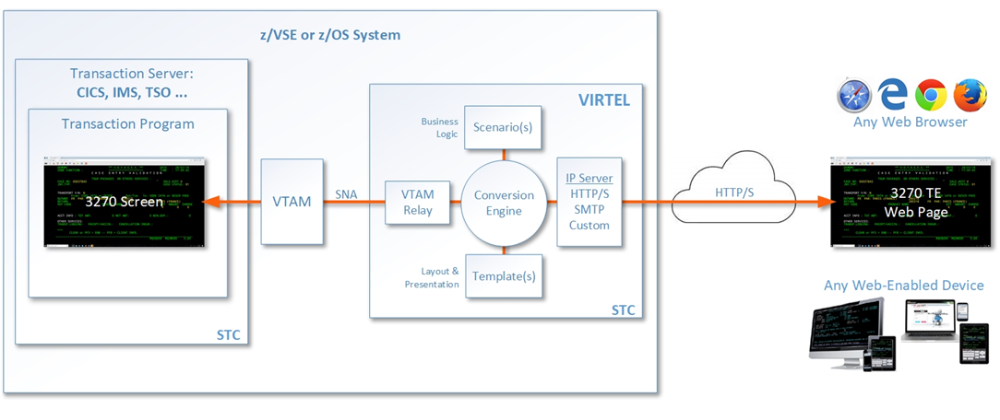
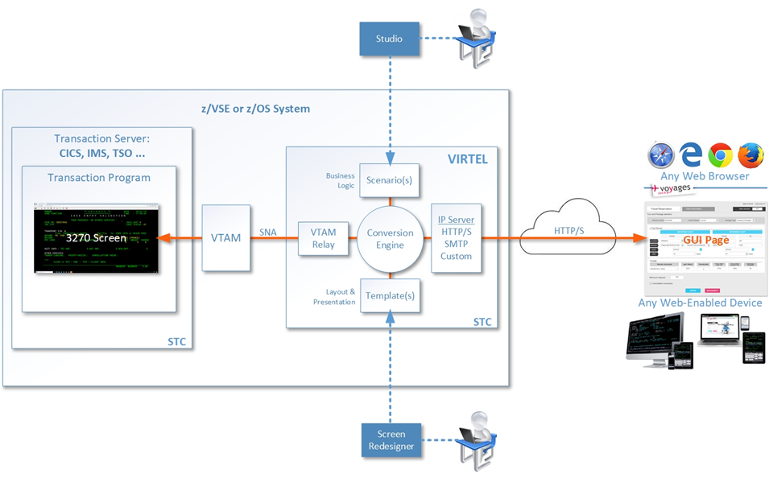

.. toctree::
   :maxdepth: 3
   :caption: Table of Contents:

.. _Virtel461GS:

===========================
Getting Started with Virtel
===========================

|image1|

Version : 4.61

Release Date : 14 October 2021. Publication Date : 10/10/2021

Syspertec Communication

196, Bureaux de la Colline 92213 Saint-Cloud Cedex Tél. : +33 (0) 1 46 02 60 42

`www.syspertec.com <https://www.syspertec.com/>`_

NOTICE

    Reproduction, transfer, distribution, or storage, in any form, of all or any part of 
    the contents of this document, except by prior authorization of SysperTec 
    Communication, is prohibited.

    Every possible effort has been made by SysperTec Communication to ensure that this document 
    is complete and relevant. In no case can SysperTec Communication be held responsible for 
    any damages, direct or indirect, caused by errors or omissions in this document.

    As SysperTec Communication uses a continuous development methodology; the information 
    contained in this document may be subject to change without notice. Nothing in this 
    document should be construed in any manner as conferring a right to use, in whole or in 
    part, the products or trademarks quoted herein.

    "SysperTec Communication" and "VIRTEL" are registered trademarks. Names of other products 
    and companies mentioned in this document may be trademarks or registered trademarks of 
    their respective owners.  

What is Virtel?
---------------

Virtel is a host-based protocol converter that runs as a started task on the mainframe. At the core of Virtel is the Virtel Engine which sits between host applications and external environments such as the web or another external server. Virtel supports the following standard protocols - TCP/IP, SMTP, HTTP/S, SOAP, MQ-SERIES, SNA, 3270, ICAL (IMS) and the inherited protocols - X25, XOT, XTP, LU 6.2 to interface between host applications and external services. 

Virtel provides three models:

- Web Access (VWA)

- Web Modernization (VWM) 

- Web Integration (VWI)
   
.. raw:: latex

    \newpage 

**VIRTEL Web Access** is a set of functions which provides access to mainframe 3270 legacy applications via the user's browser window. In the VWA model the Virtel Engine comprises of two components, a HTTP server and a VTAM component serving the back-end VTAM legacy applications, pertaining to operate as an LU2 device(s), as shown in the following diagram:  

|VWA-arch|
*VIRTEL Web Access*

.. raw:: latex

    \newpage 

**VIRTEL Web Modernization** allows the presentation of 3270 host applications to be modified, without modifying the application itself. The presentation can be adapted to a format (HTML, XML, etc.) suited to the requester, while hiding the details of navigation within the 3270 transactions.

The modernization process involves customizing the Virtel templates in order to change the way in which Virtel presents the host application data to the end-user. Virtel comes with two tools called *Virtel Screen Redesigner* and *Virtel Studio*, to assist developers with the modernization process.

The following diagram illustrates the VWM architecture:

|VWM-arch|
*VIRTEL Web Modernization*

.. raw:: latex

    \newpage 

**VIRTEL Web Integration** allows a host application to take maximum control of its web interface, for example through web services. 

VWI enables an application to create a dynamic dialog between its transactions and web applications through the creation of interactive bidirectional dialogs across the Internet between host (CICS, IMS, Ideal, Natural, etc.) and server-based applications using XML/HTML web services or other communication procedures.

Virtel provides a proprietory scripting language, that is used in *Virtel Scenarios* to implement these dynamic dialogs, as shown in the example below:

|VWI-arch|
*VIRTEL Web Integration*

Release Notes
-------------

Hardware and Software Requirements
==================================

Virtel requires the following hardware and software:

+--------------------+--------------------------------+----------------------------------+
| Component          | Server side                    | Client side                      |
+====================+================================+==================================+
| Web Access         | Any supported IBM zSystem      | Any supported version of one of  |
|                    |                                |                                  |
| Web Modernization  | Any supported version of z/OS  | the following browsers under any |
|                    |                                |                                  |
|                    |                                | operating system (JavaScript     |
|                    |                                |                                  |
|                    |                                | enabled)                         |
|                    |                                |                                  |
|                    |                                | - Internet Explorer or Edge      |
|                    |                                |                                  |
|                    |                                | - Firefox                        |
|                    |                                |                                  |
|                    |                                | - Chrome                         |
|                    |                                |                                  |
|                    |                                | - Safari                         |
|                    |                                |                                  |
|                    |                                | - Opera                          |
+--------------------+--------------------------------+----------------------------------+
| Virtel Screen      |                                | Microsoft Windows                |
| Redesigner         |                                |                                  |
+--------------------+--------------------------------+----------------------------------+
| Virtel Studio      |                                | Microsoft Windows                |
+--------------------+--------------------------------+----------------------------------+

On the server side, the following elements are also required:

- Authorized Library: Virtel initialization program VIR6000 must run from an APF-authorized library. 

- High-Level Assembler: High-Level Assembler is required to assemble the VIRTCTxx configuration module and Virtel Scenarios

- The REGION specified in the Virtel startup JCL depends on the number of terminals defined in the configuration, see the Installation Guide for more details.

- Support for the cryptographic functions of VIRTEL requires ICSF Version HCR7740 or later.

- TCP/IP server stack

**Space requirements:**

+----------------+-------+------------+----------------+
| Dataset        | DSORG | CI/BLKSIZE | Size (TRKS)    |
+================+=======+============+================+
| ARBO           | VS    | 4096       | IX=1  DATA=1   |
+----------------+-------+------------+----------------+
| CNTL           | PO    | 3120       | 75             |
+----------------+-------+------------+----------------+
| HTML           | VS    | 32768      | IX=1  DATA=3   |
+----------------+-------+------------+----------------+
| HTML.TRSF      | VS    | 32768      | IX=5  DATA=75  |
+----------------+-------+------------+----------------+
| LOADLIB        | PO    | 32760      | 150            |
+----------------+-------+------------+----------------+
| MACLIB         | PO    | 3120       | 30             |
+----------------+-------+------------+----------------+
| SAMP.TRSF      | VS    | 32768      | IX=5  DATA=275 |
+----------------+-------+------------+----------------+
| SAMPLIB        | PO    | 3120       | 150            |
+----------------+-------+------------+----------------+
| SCRNAPI.MACLIB | PO    | 3120       | 20             |
+----------------+-------+------------+----------------+
| SERVLIB        | PO-E  | 4096       | 45             |
+----------------+-------+------------+----------------+
| STAT           | PS    | 12400      | 15             |
+----------------+-------+------------+----------------+
| SWAP           | VS    | 8192       | IX=1  DATA=1   |
+----------------+-------+------------+----------------+

What's new in this release?
===========================

Installation changes
--------------------

**5825 VSE tape - add missing SCRNAPI macros to sublib**

- Updated VSE installation tape with missing SCRNAPI macros

**5832 V4.61 Installation updates**

- Updated MVS and VSE installation tapes with new JCL for v4.61

**5865/5884 complete VSE and FSE installations**

- Corrected some installation jobs for z/VSE and Free Starter Edition

**5885 sources.zip**

- Updated sources.zip file included with product

Migration considerations
------------------------

V4.61 
^^^^^

**End of support for COMPATIBILITY mode**

The "COMPATIBILITY" mode for w2hparm, that was introduced in version 4.54 to provide seamless migration of 4.53 w2hparm to 4.54 w2hparm is no longer supported in v4.61. It is recommended to switch to "Option" mode before migrating to 4.61.

**ARBO changes**

There have been no changes to the ARBO which would require migration from V4.59 or V4.58. Customers who are migrating from older releases should review the 
“What’s new in Virtel V4.XX” newsletters to determine applicable migration actions for new distributed features. 
Depending on requirements not all actions may be applicable. These newsletters are available online at https://virtel.readthedocs.io/en/latest/ 

Fixes, changes and new features
-------------------------------

Presentation
^^^^^^^^^^^^

**5782 w2h page capture improved**

- Improved capture feature to support older IE browsers and multiple captures on one page

**5799 FTP and Macro Interface enhancements**

- Improved FTP interface, corrected macro panel for Edge browsers

**5800 Macro and Capture Enhancements.**

- Improved layout for macros and screen capture

**5803 FTP V1.1**

- Enhanced version of Virtel FTP feature

**5801 Insert Key support as a Joker Key**

- Allows to redefine a key as the Insert key for keyboards that do not have an Insert key
 
  - First set a Joker Key in w2hparm.js, for instance::

         w2hparm.jokerkey = 192;  // leftmost key on second row of US keyboard     

  - Then use user settings to change one of 'joker' or 'shiftjoker' or 'altjoker' to 'Ins'

  - The administrator can preset these values in w2hparm with, for instance::

         w2hparm.joker = "Ins"

    or::

         w2hparm.shiftjoker = "Ins"

.. note ::
  To determine the scancode of a key, one can use the scancode tester in the w2h directory, for instance: http://192.168.170.50:41001/w2h/scancode.htm         

**5806 Correct error with data.js to avoid old D&D template**

- Removed references to old drag and drop admin interface

**5808 Update Macro Sources, languages and fix for V4.58**

- Harmonized code for AS/400 version of Virtel (TBT Web Access)

**5820 CTRL left SHIFT as ENTER**

- Added support for SHIFT + left CTRL 

  - If CTRL has been assigned to ENTER, pressing SHIFT + left CTRL will be processed as an ENTER key.

  - You must press first SHIFT then CTRL for this to work consistently.

  - Ctrl + shift is by default the 'change keyboard layout' hotkey for Windows. So you possibly would have to unset this in the Windows Settings.

**5822 backspace and keypad +-**

- backspace may now be set to: 		["no", "Backtab", "Newline", "Ins"]
- shift+backspace may now be set to:	["no", "Backtab", "CLEAR", "Ins"]}

**5823 SMARTWEB2VIRT parameters - keypad display - click position**

- Corrected version of the SMARTWEB2VIRT template for tablets and smartphones

**5826 backspace and keypad +- - correction**

- Corrects an error in update 5822

**5827 Misc. updates to VSR**

- New "Wizard" mode for Virtel Screen Redesigner

**5829 incorrect display of a large template when using Virtel cache**

- Corrects Virtel caching of large page templates

**5830 Update to Virtel Online Doc. and Capture fix.**

- Updated online help documentation for cut & paste and capture

**5835 Screen Presentation and Language Support Changes**

- Corrected screen sizing in NOSTRETCH mode, to avoid vertical slider from appearing

**5840 incorrect graphic characters**

- Corrects an issue where vertical lines where displayed as superscript character

**5841 VWA Macros fix. IE11**

- Correct corruption of macro list in IE11

**5843 Misc. VWA fixes.**

- Corrected processing of data pasted into Virtel from external spreadsheet

**5844 Introduce new settings color palette and other VWA updates**

- Introduction of new color palette "Classic 3270" to differentiate between "base color" and "default color" modes

**5848 Toolbar and settings correction**

- Correction of an issue where some user settings were not correctly saved when set before sign-on

**5855 ADM VWM updates**

- Support for additional BMS fields

**5861 add FTPPARM scenario to LOADLIB**

- FTPPARM scenario was only present in SCE-DIR, not LOADLIB

**5866 replace X'0C' by a blank**

- Display fixed for pages containing x'0C' characters

**5867 hideinfo + VWA-captures parm badly reported**

- Fixed code that hides icons in the Virtel toolbar.

**5870 Adding keys PF22 PF23 for pgup/pgdn, obsolete links removed**

- Added support to map PF22 and PF23 keys to PgUp/PgDown

**5874 Safari CmdCV, PF22/23, Autoprint, Deferred Authentification and autocapture, w2hparm considerations, MAXIMUM-PASSWORD-LENGTH, fold/unfo**

- Fixed code for printing and screen-capture
- Added support for Cmd+C and Cmd+V in Safari

**5882 Vtam app print no longer works**

- Corrected 3270 printing feature for IE11

.. raw:: latex

    \newpage 

Base Components
^^^^^^^^^^^^^^^

**5776 Add symbolics to VIR0021W**

- Add @@@@DATE, @@@@TIME and @@PRT variables in USSTAB support

**5778 Return US Date format if COUNTRY=US in TCT**

- @@@@DATE is returned as MM\DD\YY string if COUNTRY=US is specified in TCT

**5780 Possible abend trying to restore a session**

- Corrects s0C4 abend that occurs when Virtel tries to restore a NCAccess session 

**5781 z 0 error**

- Corrects Virtel behaviour when a key is pressed during a temporary TCPIP disconnection, to avoid Z 0 errors.

**5783/5797/5810/5814/5836/5849/5850/5853 IPV6 support**

- Add IPv6 support to Virtel. See *Appendix B* for more details.

**5786 Service transaction terminals not reused**

- Corrects error in 5463 that prevented service transaction terminals from being reused

**5787 TPX error LOGONID TOO LONG**

- Corrects bind to TPX to avoid too many characters from being read for LOGONID

**5788 TPX: unsolicited BIND may arrive before TSO BIND**

- Corrects situation with TPX where user has to press Enter twice to access an application

**5789 Correct S0C4 in VIR0021W**

- Prevent erroneous TSO logons via USSTAB from corrupting VIR0021W storage areas

**5790 VIRPLEX Writer updates not propagated**

- Fixes broadcast problems from Writer to Reader instances of Virtel in Virplex

**5792 Hang in APPLIST following UPDT5771**

- Corrected applist application for Security type 4 to prevent hangs for unavailable transactions

**5802 Possible abend in BATCH mode**

- Fixes ASRA abend in program VIR0015 when running Virtel in batch mode, for batch upload of JS updates.

**5804 Correct memory corruption caused by VIR0021W**

- Fixes memory corruption when date retrieved by USSTAB routine

**5807 X-SYSTEM lock although LONGPOLL**

- Fixes Virtel behaviour when Longpoll session is resent by a proxy server.

**5809 VIRPLEX PARMS no longer updated on a READONLY Virtel**

- Fixes situation where in a Virplex some userparms are lost when updated via a READONLY Virtel. 

**5811 Cannot enter one specific chinese character 'Air Condition'**

- Fixes Virtel processing of DBCS characters containing x'0E'

**5813 Possible screen freeze after LongPoll failure**

- Fixes Longpoll errors 

**5815 Possible s0c6 after VSAM error**

- Fixes error in FREEMAIN logic

**5816 abend after late APPSTAT return**

- Avoid abend when VTAM is slow in processing APPSTAT command

**5817 Abend trying to process a HOST: header RULE when there is no HOST: header**

- Avoid ASRA abend when RULE definition is incomplete

**5837 VIRCONF corrections**

- Corrected errors in VIRCONF header

**5846 although no USERPARM transaction, a USER-PARMS-DIRECTORY is generated**

- Fix for configurations mixing centralized and non-centralized USERPARMS

**5847 possible s0C1 on late BIND**

- Fixes s0C1 abend for application BINDs that reach Virtel after timeout

**5851 Correct settings and reconnection issues**

- Fixes loss of toolbar settings after reconnection to Virtel

**5852 XWTO TRIM=Y parameter**

- Suppress excessive blanks in WTO messages

**5856 possible s0c4 processing a RULE prefix**

- Fixes possible s0C4 abend when processing an IPv6 prefix in a Virtel rule

**5860 possible s0C4 for a looping page.**

- Fixes s0C4 abend for large "MANY-TO-ONE" screens in Virtel Web Modernization

**5863 possible loop processing one specific HTTP input**

- Avoid possible loop when processing unexpected ASCII control characters in incoming HTTP message

**5864 prefix RULE always succeeds**

- Fixed IPv6 Prefix RULE processing

**5871 Correct VIR0070 STATS output**

- Virtel STATS updated for IPv6

**5872 Update VIR0021W for IPV6 address**

- Virtel USSPARM feature updated to be able to include IPv6 addresses

**5876 Don't open DD VIRSTAT if STATS=SMF**

- Fixed VIRSTAT processing for STATS=SMF

**5877 Change MSG T61I to T64I in VIRHTTP**

- Corrected invalid message VIRT61I

**5879 VIRSECU wrong display in F VIRTEL,TCT command**

- Corrected wrong display of VIRTCT VIRSECU parameter in F VIRTEL,TCT command

**5883 Add DSASIZE to VIRTERM macro**

- Increased default for DSASIZE in VIRTERM

**5886 possible 0P77I INVALID STORAGE ADDRESS**

- Fixed possible ASRA abend in Virtel for z/VSE

.. raw:: latex

    \newpage 

Virtel Administration
^^^^^^^^^^^^^^^^^^^^^

**5805 Calling DTE RULE fails if asked for '1=IS' address**

- Fixes RULE workflow for cases that worked with 1=STARTS-WITH but not 1=IS

**5821 Support password and passphrase in Virtel Admin Application**

- Add Passphrase support for Virtel 3270 admin interface

**5831 Allow DNS name in LINE definition**

- Introduce DNS name support for LINE definitions and parameters in Virtel startup JCL (See also *Appendix B*)

**5834 IPV6 rules and maps**

- Update Virtel administration panels and rulesets for IPv6 syntax

**5839 Dynamically allocate SYSPUNCH DD card for VIRCONF**

- SYSPUNCH will be dynamically allocated if not present when doing a F VIRTEL,UNLOAD command.
- Additional keyword added to command - DSN=unload_dataset. This will be the target dataset for the UNLOAD command. By default UNLOAD writes the ARBO statements to SYSOUT=B
- Note: unload_dataset must be preallocated with DCB parameters (LRECL=80,BLKSIZE=3120,RECFM=FB)

**5842 VIRCONF - Fix DESC if > 48 chars.**

- Fixes situation where VIRCONF produced invalid control cards on UNLOAD if DESC is greater than 48 chars for TERMINAL statements.

**5854 VIRCONF rejects square brackets**

- VIRCONF has been corrected to support square brackets \[ and \] for IPv6 addresses

**5878 VIRTCT compile date in VIR0096I**

- Added message in Virtel log with compile date for VIRTCT module

**5881 Add Sample Jobs to print SMF records**

- Added sample jobs to activate SMF stats printing

.. raw:: latex

    \newpage 

Scenario Language
^^^^^^^^^^^^^^^^^

**5777 possible abend in vir0s12 if scenario repetedly executes the same MAP$ instructions**

- Corrects a situation where, when a MAP$ sequence was executed several times, Virtel sometimes failed to match a MAP$ END to the appropriate MAP$ BEGIN

**5779 MAP$ descriptions lost after ACTION$ TO-APPLICATION**

- Fixes processing of MAP$ descriptions that precede an ACTION$ TO-APPLICATION statement

**5793 WHEN-NON-BLANK may skip not to be skipped statements**

- Fixes a situation where with an END-WHEN-NOT-BLANK statement, the END statement was not found and following statements were ignored as if they had been part of the WHEN-NOT-BLANK block.

**5819 TOVAR$ in a SCENARIO SUBROUTINE**

- Corrects TOVAR$ processing so that this instruction can be used in a subroutine

**5824 COPY$ LIST-TO-VARIABLE with ADD-PREFIX12 error**

- Fixes processing of COPY$ LIST-TO-VARIABLE with ADD-PREFIX12 parameter

**5833 SCRNAPI updates containing @ sign are badly converted to EBCDIC**

- Corrects an issue with characters in SCRNAPI macros that were not being interpreted correctly on sites with Codepage 037

**5838 CASE$ does not correctly handle multiple ATTRIBUTE fields**

- Fixes a situation where CASE$ instruction does not correctly handle a sequence of multiple 3270 ATTRIBUTE fields.

**5873 IPV6 VALUE-OF USER-IP-ADDRESS**

- Added new option VALUE-OF USER-IP-ADDRESS that can be included in Virtel pages

.. note:: For further details see the Virtel Technical Newsletter TN202003: Whats new in Virtel 4.61.

Before you install the product
------------------------------

Prepare to download the product
===============================

The Virtel products and PTFs can be downloaded from the SysperTec FTP server, at https://ftp-group.syspertec.com

Credentials to access this server can be requested from SysperTec support at support@syspertec.com

Obtain your product license key
===============================

To start the Virtel STC, you will need a valid product license key, that will be supplied by SysperTec support. This key needs to be pasted into the VIRTCTxx configuration file before it is assembled. See the Virtel Installation Guide for more details on this process.

Access your documentation
=========================

Virtel documentation (including the detailed installation guide) is available in PDF format on the SysperTec FTP server at https://ftp-group.syspertec.com or in HTML format at https://virtel.readthedocs.io 

Security planning
=================

To provide secure HTTP (https) sessions between the mainframe and client browsers, VIRTEL uses the system TLS services:

- On z/OS, the IBM Application Transparent Transport Layer Security (AT-TLS) feature of z/OS Communication Server: AT-TLS allows socket applications to access encrypted sessions by invoking system SSL within the transport layer of the TCP/IP stack. The Policy Agent decides which connections are to use AT-TLS, and provides system SSL configuration for those connections. The application continues to send and receive clear text over the socket, but data sent over the network is protected by system SSL. Setup for AT-TLS is performed outside of Virtel. This process is described in the Installation Guide.

- On z/VSE, the system TLS feature of the selected TCP/IP stack (BSI/CSI).

Quick Installation
------------------

z/OS
====

Here are the instructions to quick install and start Virtel on z/OS:

1. After unzipping virtel461mvs.zip run job $ALOCDSU to create the TRANSFER.XMIT file.

2. Upload the virtel461mvs.xmit file to the TRANSFER.XMIT file IN BINARY MODE.

3. Edit the job $RESTDSU specifying the high-level qualifiers and SMS or volume serial information for the VIRTEL datasets, then run the job $RESTDSU to create the VIRTEL datasets

4. Apply the PTFs in the allptfs-mvs461.txt file using job ZAPJCL in the VIRTEL CNTL library. If allptfs-mvs461.txt doesn't exist skip this step.

5. Use the SETPROG APF command to add the VIRTEL LOADLIB to your system APF authorized program library list::

    SETPROG APF,ADD,DSN=yourqual.VIRT461.LOADLIB,VOL=volser

6. Edit member VIRTCT01 in the VIRTEL CNTL library:

   (a) set the APPLID= parameter to the VTAM ACBNAME you will use to log
       on to VIRTEL (the suggested value is APPLID=VIRTEL).

   (b) the TCP1= parameter must match the jobname of your z/OS
       TCP/IP stack (the suggested value TCPIP is usually correct)

   (c) if you prefer VIRTEL to display English language panels, then set
       the following parameters::

               LANG='E',                                               *
               COUNTRY=xxxx,                                           *
               DEFUTF8=IBMnnnn,                                        *

       (xxxx and nnnn depend on your country, see below).

       Users in France should leave these parameters unchanged, as the
       default is French language with codepage 1147.

   (d) set the COMPANY ADDR1 ADDR2 LICENCE EXPIRE CODE parameters using
       the license key supplied to you by Syspertec.

   (e) Run the job ASMTCT in the VIRTEL CNTL library to assemble VIRTCT01
       into the VIRTEL LOADLIB.

.. note:: COUNTRY can be:

      FR or FRANCE, US or USA, PORTUGAL, BRAZIL, AUSTRALIA,
      NETHERLAND, BE or BELGIUM, SWITZERLAND, CANADA, ALBANIA,
      NO ou NORWAY, DENMARK, DE or GERMANY, FI or FINLAND,
      SWEDEN, IT or ITALY, SP or SPAIN, UK, IRELAND, IC or ICELAND.
      If your country is not listed, specify COUNTRY=US

.. note:: DEFUTF8 is your default EBCDIC codepage.

   Check the Virtel Installation Guide to see which SBCS and DBCS codepages are available in VIRTEL.
      
7. Edit member ARBOLOAD in the VIRTEL CNTL library:

   (a) change LANG=EN to LANG=FR if French language is desired

   (b) set LOAD= the name of your VIRTEL LOADLIB

   (c) set SAMP= the name of your VIRTEL SAMPLIB

   (d) set ARBO= the name of your VIRTEL ARBO file

   (e) set VTAMLST= the name of a your VIRTEL CNTL library. The job will create a sample VTAMLST member in this library.

   (f) CHANGE ALL 'DBDCCICS' 'xxxxxx' where xxxxxx is the APPLID of your CICS system.

   (g) if you plan to run Virtel Screen Redesigner, set VSR=YES 
   
   (h) if you changed the APPLID of VIRTEL in step 6 from its default value VIRTEL, then you must also change the ACBNAME=parameter in step VTAMDEF near the end of the ARBOLOAD job. The value of ACBNAME= in ARBOLOAD must match the value of APPLID= in VIRTCT01. (i) if you plan to use Virtel Web Access for iPad, set IPAD=YES

   (i) Submit the job ARBOLOAD. This creates your VIRTEL CONFIGURATION (the ARBO file) and a sample VTAMLST member VIRTAPPL.

.. note:: If you need to rerun the ARBOLOAD job, you must change PARM='LOAD,NOREPL' to PARM='LOAD,REPL'.

          If you wish to completely start over from the beginning, you can run the job ARBOBASE to delete and reinitialize the ARBO file, followed by a rerun of the ARBOLOAD job.

8. Submit the job ASMMOD from the VIRTEL CNTL library:

   This job assembles the VIRTEL logon mode table (MODVIRT) into your SYS1.VTAMLIB dataset.  You will need to set the QUAL=parameter to match the high-level qualifiers of your SAMPLIB dataset.

9. Copy the VIRTAPPL member (created by the ARBOLOAD job in step 8) from the VIRTEL CNTL library into your SYS1.VTAMLST dataset.

   Now activate the VTAMLST member using this command::
      V NET,ACT,ID=VIRTAPPL

10. Edit the procedure VIRTEL4 in your VIRTEL CNTL library so that the high-level qualifiers match the names you used when you loaded the files in step 3.  Copy the procedure to your system PROCLIB, renaming it as VIRTEL.

11. Ask your security administrator to create a userid for the VIRTEL started task, and to authorize this userid to access the datasets you created in step 3. This userid must also have an OMVS segment which authorizes VIRTEL to use TCP/IP. Your security administrator can use the job RACFSTC in the VIRTEL SAMPLIB as an example.

12. Start VIRTEL

13. You can now logon to VIRTEL from a 3270 terminal using the APPLID specified in the VIRTCT01, and you can display the VIRTEL Web Access menu in your web browser using the following URL: 

    http://nnn.nnn.nnn.nnn:41001

    where nnn.nnn.nnn.nnn is the IP address of your z/OS system.

14. The supplied system is configured with security disabled. If you wish, you can activate external security using RACF, ACF2, or TOP SECRET; please refer to separate documentation. 
    
15. Apply any "update" maintenance (virtel461updtnnnn.zip) according to the instructions in the Readme-updtnnnn.txt file in the virtel461updtnnnn.zip if available. Skip this step if no zip file is available.

z/VSE
=====

1. Virtel is provided as an AWS tape file. Load the installation jobs into the POWER READER QUEUE using a S RDR,cuu command.

2. Define the VIRTvrr.SUBLIB sublibrary using the VIRTLIB job

3. Load the CIL and SSL libraries using the VIRTCIL and VIRTSSL jobs

4. Define the Virtel runtime files, using the VIRTVS job

5. Customize and assemble the VIRTCT:

   (a) set the APPLID= parameter to the VTAM ACBNAME you will use to log on to VIRTEL (the suggested value is APPLID=VIRTEL).

   (b) if you prefer VIRTEL to display English language panels, then set the following parameters::

               LANG='E',                                               *
               COUNTRY=xxxx,                                           *
               DEFUTF8=IBMnnnn,                                        *
       
       (xxxx and nnnn depend on your country, see below).

       Users in France should leave these parameters unchanged, as the default is French language with codepage 1147.

   (c) set the COMPANY ADDR1 ADDR2 LICENCE EXPIRE CODE parameters using the license key supplied to you by Syspertec.

   (d) Run the job ASMTCT  to assemble the TCT table into the VIRTEL LOADLIB.

6. Assemble the VTAM mode table using the VIRMOD job

7. Update the VIRARBO file (ARBOLOAD) using the VIRCONF job

8. Define the VTAM application relays using the VIRTAPPL job

9. Define the VIRTEL start procedure

10. Start VIRTEL

11. You can now logon to VIRTEL from a 3270 terminal using the APPLID specified in the VIRTCT01, and you can display the VIRTEL Web Access menu in your web browser using the following URL:

     http://nnn.nnn.nnn.nnn:41001

    where nnn.nnn.nnn.nnn is the IP address of your z/OS system.

12. Apply any "update" maintenance (virtel461updtnnnn.zip) according to the instructions in the Readme-updtnnnn.txt file in the virtel461updtnnnn.zip if available. Skip this step if no zip file is available.

Accessing SysperTec support
===========================

To contact SysperTec support, please send an email to support@syspertec.com. If you have the necessary credentials, you can also open an issue at https://support.syspertec.com 

Appendix
--------

Trademarks
==========

SysperTec, the SysperTec logo, syspertec.com and VIRTEL are trademarks or registered trademarks of SysperTec
Communication Group, registered in France and other countries.

IBM, VTAM, CICS, IMS, RACF, DB2, MVS, WebSphere, MQSeries, System z are trademarks or registered trademarks of
International Business Machines Corp., registered in United States and other countries.

Adobe, Acrobat, PostScript and all Adobe-based trademarks are either registered trademarks or trademarks of Adobe
Systems Incorporated in the United States and other countries.

Microsoft, Windows, Windows NT, and the Windows logo are trademarks of Microsoft Corporation in the United States
and other countries.

UNIX is a registered trademark of The Open Group in the United States and other countries.
Java and all Java-based trademarks and logos are trademarks or registered trademarks of Oracle and/or its affiliates.

Linux is a trademark of Linus Torvalds in the United States, other countries, or both.

Other company, product, or service names may be trademarks or service names of others.

Open Source Software
====================

The current VIRTEL Web Access product uses the following open source software:

- jQuery 
    Under MIT license - https://jquery.org/license/
- StoreJson
    Under MIT license - https://github.com/marcuswestin/store.js/commit/baf3d41b7092f0bacd441b768a77650199c25fa7
- jQuery_UI
    Under MIT license - http://en.wikipedia.org/wiki/JQuery_UI

.. |image1| image:: images/media/logo_virtel_web.png
            :scale: 50 % 

.. |VWI-arch| image:: images/media/VWI-architecture.png