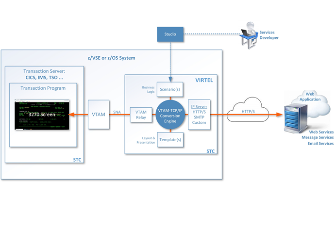

.. toctree::
   :maxdepth: 3
   :caption: Table of Contents:

.. _Virtel462GS:

===========================
Getting Started with Virtel
===========================

|image1|

Version : 4.62

Release Date : TBA. Publication Date : 17/02/2024

Virtel SAS

302, Bureaux de la Colline 92213 Saint-Cloud Cedex Tél. : +33 (0) 1 46 02 60 42

`www.virtelweb.com <https://www.virtelweb.com/>`_

NOTICE

    Reproduction, transfer, distribution, or storage, in any form, of all or any part of 
    the contents of this document, except by prior authorization of SysperTec 
    Communication, is prohibited.

    Every possible effort has been made by SysperTec Group to ensure that this document 
    is complete and relevant. In no case can SysperTec Group be held responsible for 
    any damages, direct or indirect, caused by errors or omissions in this document.

    As SysperTec Group uses a continuous development methodology; the information 
    contained in this document may be subject to change without notice. Nothing in this 
    document should be construed in any manner as conferring a right to use, in whole or in 
    part, the products or trademarks quoted herein.

    "SysperTec Group" and "VIRTEL" are registered trademarks. Names of other products 
    and companies mentioned in this document may be trademarks or registered trademarks of 
    their respective owners.  

What is Virtel?
---------------

Virtel is a host-based protocol converter that runs as a started task on the mainframe. At the core of Virtel is the Virtel Engine which sits between host applications and external environments such as the web or another external server. Virtel supports the following standard protocols - TCP/IP, SMTP, HTTP/S, SOAP, MQ-SERIES, SNA, 3270, ICAL (IMS) and the inherited protocols - X25, XOT, XTP, LU 6.2 to interface between host applications and external services. 

Virtel provides three models:

- Web Access (VWA)

- Web Modernization (VWM) 

- Web Integration (VWI)
   
.. raw:: latex

    \newpage 

**VIRTEL Web Access** is a set of functions which provides access to mainframe 3270 legacy applications via the user's browser window. In the VWA model the Virtel Engine comprises of two components, a HTTP server and a VTAM component serving the back-end VTAM legacy applications, pertaining to operate as an LU2 device(s), as shown in the following diagram:  

|VWA-arch|
*VIRTEL Web Access*

.. raw:: latex

    \newpage 

**VIRTEL Web Modernization** allows the presentation of 3270 host applications to be modified, without modifying the application itself. The presentation can be adapted to a format (HTML, XML, etc.) suited to the requester, while hiding the details of navigation within the 3270 transactions.

The modernization process involves customizing the Virtel templates in order to change the way in which Virtel presents the host application data to the end-user. Virtel comes with two tools called *Virtel Screen Redesigner* and *Virtel Studio*, to assist developers with the modernization process.

The following diagram illustrates the VWM architecture:

|VWM-arch|
*VIRTEL Web Modernization*

.. raw:: latex

    \newpage 

**VIRTEL Web Integration** allows a host application to take maximum control of its web interface, for example through web services. 

VWI enables an application to create a dynamic dialog between its transactions and web applications through the creation of interactive bidirectional dialogs across the Internet between host (CICS, IMS, Ideal, Natural, etc.) and server-based applications using XML/HTML web services or other communication procedures.

Virtel provides a proprietary scripting language, that is used in *Virtel Scenarios* to implement these dynamic dialogs, as shown in the example below:

|VWI-arch|
*VIRTEL Web Integration*

Release Notes
-------------

Hardware and Software Requirements
==================================

Virtel requires the following hardware and software:

+--------------------+--------------------------------+----------------------------------+
| Component          | Server side                    | Client side                      |
+====================+================================+==================================+
| Web Access         | Any supported IBM zSystem      | Any supported version of one of  |
|                    |                                |                                  |
| Web Modernization  | Any supported version of z/OS  | the following browsers under any |
|                    | or VSEn                        |                                  |
|                    |                                | operating system (JavaScript     |
|                    |                                |                                  |
|                    |                                | enabled)                         |
|                    |                                |                                  |
|                    |                                | - Edge                           |
|                    |                                |                                  |
|                    |                                | - Firefox                        |
|                    |                                |                                  |
|                    |                                | - Chrome                         |
|                    |                                |                                  |
|                    |                                | - Safari                         |
|                    |                                |                                  |
|                    |                                | - Opera                          |
+--------------------+--------------------------------+----------------------------------+
| Virtel Screen      |                                | Microsoft Windows                |
| Redesigner         |                                |                                  |
+--------------------+--------------------------------+----------------------------------+
| Virtel Studio      |                                | Microsoft Windows                |
|                    |                                | Java 11                          |
+--------------------+--------------------------------+----------------------------------+

On the server side, the following elements are also required:

- Authorized Library: Virtel initialization program VIR6000 must run from an APF-authorized library. 

- High-Level Assembler: High-Level Assembler is required to assemble the VIRTCTxx configuration module and Virtel Scenarios

- The REGION specified in the Virtel startup JCL depends on the number of terminals defined in the configuration, see the Installation Guide for more details.

- Support for the cryptographic functions of VIRTEL requires ICSF Version HCR7740 or later.

- TCP/IP server stack

**Space requirements:**

+----------------+-------+------------+----------------+
| Dataset        | DSORG | CI/BLKSIZE | Size (TRKS)    |
+================+=======+============+================+
| ARBO           | VS    | 4096       | IX=1  DATA=1   |
+----------------+-------+------------+----------------+
| CNTL           | PO    | 3120       | 75             |
+----------------+-------+------------+----------------+
| HTML           | VS    | 32768      | IX=1  DATA=3   |
+----------------+-------+------------+----------------+
| HTML.TRSF      | VS    | 32768      | IX=5  DATA=75  |
+----------------+-------+------------+----------------+
| LOADLIB        | PO    | 32760      | 150            |
+----------------+-------+------------+----------------+
| MACLIB         | PO    | 3120       | 30             |
+----------------+-------+------------+----------------+
| SAMP.TRSF      | VS    | 32768      | IX=5  DATA=275 |
+----------------+-------+------------+----------------+
| SAMPLIB        | PO    | 3120       | 150            |
+----------------+-------+------------+----------------+
| SCRNAPI.MACLIB | PO    | 3120       | 20             |
+----------------+-------+------------+----------------+
| SERVLIB        | PO-E  | 4096       | 45             |
+----------------+-------+------------+----------------+
| STAT           | PS    | 12400      | 15             |
+----------------+-------+------------+----------------+
| SWAP           | VS    | 8192       | IX=1  DATA=1   |
+----------------+-------+------------+----------------+

What's new in this release?
===========================

.. note:: For further details see the Virtel Technical Newsletter TN202403: Whats new in Virtel 4.62.

Before you install the product
------------------------------

Prepare to download the product
===============================

The Virtel products and PTFs can be downloaded from the SysperTec FTP server, at https://ftp-group.syspertec.com

Credentials to access this server can be requested from SysperTec support at https://ftp-group.syspertec.com/request/

Obtain your product license key
===============================

To start the Virtel STC, you will need a valid product license key, that will be supplied by SysperTec support (please contact support@syspertec.com). This key needs to be pasted into the VIRTCTxx configuration file before it is assembled. See the Virtel Installation Guide for more details on this process.

Access your documentation
=========================

Virtel documentation (including the detailed installation guide) is available in PDF format on the SysperTec FTP server at https://ftp-group.syspertec.com or in HTML format at https://virtel.readthedocs.io 

Security planning
=================

To provide secure HTTP (https) sessions between the mainframe and client browsers, VIRTEL uses the system TLS services:

- On z/OS, the IBM Application Transparent Transport Layer Security (AT-TLS) feature of z/OS Communication Server: AT-TLS allows socket applications to access encrypted sessions by invoking system SSL within the transport layer of the TCP/IP stack. The Policy Agent decides which connections are to use AT-TLS, and provides system SSL configuration for those connections. The application continues to send and receive clear text over the socket, but data sent over the network is protected by system SSL. Setup for AT-TLS is performed outside of Virtel. This process is described in the Installation Guide.

- On z/VSE, the system TLS feature of the selected TCP/IP stack (BSI/CSI).

Virtel can also be interfaced with RACF to protect access to specific applications or features. This is detailed in the Installation Guide.

A new component called Virtel SSO is now available to interface Virtel with OIDC and SAML identity servers for Single-Sign-On. Please contact SysperTec Support for more details.

Quick Installation
------------------

z/OS
====

Here are the instructions to quick install and start Virtel on z/OS:

1. After unzipping virtel462mvs.zip run job $ALOCDSU to create the TRANSFER.XMIT file.

2. Upload the virtel462mvs.xmit file to the TRANSFER.XMIT file IN BINARY MODE.

3. Edit the job $RESTDSU specifying the high-level qualifiers and SMS or volume serial information for the VIRTEL datasets, then run the job $RESTDSU to create the VIRTEL datasets

4. Apply the PTFs in the allptfs-mvs462.txt file using job ZAPJCL in the VIRTEL CNTL library. If allptfs-mvs462.txt doesn't exist skip this step.

5. Use the SETPROG APF command to add the VIRTEL LOADLIB to your system APF authorized program library list::

    SETPROG APF,ADD,DSN=yourqual.VIRT462.LOADLIB,VOL=volser

6. Edit member VIRTCT01 in the VIRTEL CNTL library:

   (a) set the APPLID= parameter to the VTAM ACBNAME you will use to log
       on to VIRTEL (the suggested value is APPLID=VIRTEL).

   (b) the TCP1= parameter must match the jobname of your z/OS
       TCP/IP stack (the suggested value TCPIP is usually correct)

   (c) if you prefer VIRTEL to display English language panels, then set
       the following parameters::

               LANG='E',                                               *
               COUNTRY=xxxx,                                           *
               DEFUTF8=IBMnnnn,                                        *

       (xxxx and nnnn depend on your country, see below).

       Users in France should leave these parameters unchanged, as the
       default is French language with codepage 1147.

   (d) set the COMPANY ADDR1 ADDR2 LICENCE EXPIRE CODE parameters using
       the license key supplied to you by Syspertec.

   (e) Run the job ASMTCT in the VIRTEL CNTL library to assemble VIRTCT01
       into the VIRTEL LOADLIB.

.. note:: COUNTRY can be:

      FR or FRANCE, US or USA, PORTUGAL, BRAZIL, AUSTRALIA,
      NETHERLAND, BE or BELGIUM, SWITZERLAND, CANADA, ALBANIA,
      NO ou NORWAY, DENMARK, DE or GERMANY, FI or FINLAND,
      SWEDEN, IT or ITALY, SP or SPAIN, UK, IRELAND, IC or ICELAND.
      If your country is not listed, specify COUNTRY=US

.. note:: DEFUTF8 is your default EBCDIC codepage.

   Check the Virtel Installation Guide to see which SBCS and DBCS codepages are available in VIRTEL.
      
7. Edit member ARBOLOAD in the VIRTEL CNTL library:

   (a) change LANG=EN to LANG=FR if French language is desired

   (b) set LOAD= the name of your VIRTEL LOADLIB

   (c) set SAMP= the name of your VIRTEL SAMPLIB

   (d) set ARBO= the name of your VIRTEL ARBO file

   (e) set VTAMLST= the name of a your VIRTEL CNTL library. The job will create a sample VTAMLST member in this library.

   (f) CHANGE ALL 'DBDCCICS' 'xxxxxx' where xxxxxx is the APPLID of your CICS system.

   (g) if you plan to run Virtel Screen Redesigner, set VSR=YES 
   
   (h) if you changed the APPLID of VIRTEL in step 6 from its default value VIRTEL, then you must also change the ACBNAME=parameter in step VTAMDEF near the end of the ARBOLOAD job. The value of ACBNAME= in ARBOLOAD must match the value of APPLID= in VIRTCT01. (i) if you plan to use Virtel Web Access for iPad, set IPAD=YES

   (i) Submit the job ARBOLOAD. This creates your VIRTEL CONFIGURATION (the ARBO file) and a sample VTAMLST member VIRTAPPL.

.. note:: If you need to rerun the ARBOLOAD job, you must change PARM='LOAD,NOREPL' to PARM='LOAD,REPL'.

          If you wish to completely start over from the beginning, you can run the job ARBOBASE to delete and reinitialize the ARBO file, followed by a rerun of the ARBOLOAD job.

8. Submit the job ASMMOD from the VIRTEL CNTL library:

   This job assembles the VIRTEL logon mode table (MODVIRT) into your SYS1.VTAMLIB dataset.  You will need to set the QUAL=parameter to match the high-level qualifiers of your SAMPLIB dataset.

9. Copy the VIRTAPPL member (created by the ARBOLOAD job in step 8) from the VIRTEL CNTL library into your SYS1.VTAMLST dataset.

   Now activate the VTAMLST member using this command::
      V NET,ACT,ID=VIRTAPPL

10. Edit the procedure VIRTEL4 in your VIRTEL CNTL library so that the high-level qualifiers match the names you used when you loaded the files in step 3.  Copy the procedure to your system PROCLIB, renaming it as VIRTEL.

11. Ask your security administrator to create a userid for the VIRTEL started task, and to authorize this userid to access the datasets you created in step 3. This userid must also have an OMVS segment which authorizes VIRTEL to use TCP/IP. Your security administrator can use the job RACFSTC in the VIRTEL SAMPLIB as an example.

12. Start VIRTEL

13. You can now logon to VIRTEL from a 3270 terminal using the APPLID specified in the VIRTCT01, and you can display the VIRTEL Web Access menu in your web browser using the following URL: 

    http://nnn.nnn.nnn.nnn:41001

    where nnn.nnn.nnn.nnn is the IP address of your z/OS system.

14. The supplied system is configured with security disabled. If you wish, you can activate external security using RACF, ACF2, or TOP SECRET; please refer to separate documentation. 
    
15. Apply any "update" maintenance (virtel462updtnnnn.zip) according to the instructions in the Readme-updtnnnn.txt file in the virtel462updtnnnn.zip if available. Skip this step if no zip file is available.

VSEn
====

1. Virtel is provided as an AWS tape file. Load the installation jobs into the POWER READER QUEUE using a S RDR,cuu command.

2. Define the VIRTvrr.SUBLIB sublibrary using the VIRTLIB job

3. Load the CIL and SSL libraries using the VIRTCIL and VIRTSSL jobs

4. Define the Virtel runtime files, using the VIRTVS job

5. Customize and assemble the VIRTCT:

   (a) set the APPLID= parameter to the VTAM ACBNAME you will use to log on to VIRTEL (the suggested value is APPLID=VIRTEL).

   (b) if you prefer VIRTEL to display English language panels, then set the following parameters::

               LANG='E',                                               *
               COUNTRY=xxxx,                                           *
               DEFUTF8=IBMnnnn,                                        *
       
       (xxxx and nnnn depend on your country, see below).

       Users in France should leave these parameters unchanged, as the default is French language with codepage 1147.

   (c) set the COMPANY ADDR1 ADDR2 LICENCE EXPIRE CODE parameters using the license key supplied to you by Syspertec.

   (d) Run the job ASMTCT  to assemble the TCT table into the VIRTEL LOADLIB.

6. Assemble the VTAM mode table using the VIRMOD job

7. Update the VIRARBO file (ARBOLOAD) using the VIRCONF job

8. Define the VTAM application relays using the VIRTAPPL job

9. Define the VIRTEL start procedure

10. Start VIRTEL

11. You can now logon to VIRTEL from a 3270 terminal using the APPLID specified in the VIRTCT01, and you can display the VIRTEL Web Access menu in your web browser using the following URL:

     http://nnn.nnn.nnn.nnn:41001

    where nnn.nnn.nnn.nnn is the IP address of your z/OS system.

12. Apply any "update" maintenance (virtel462updtnnnn.zip) according to the instructions in the Readme-updtnnnn.txt file in the virtel462updtnnnn.zip if available. Skip this step if no zip file is available.

Accessing SysperTec support
===========================

To contact SysperTec support, please send an email to support@syspertec.com. If you have the necessary credentials, you can also open an issue at https://support.syspertec.com 

Appendix
--------

Trademarks
==========

SysperTec, the SysperTec logo, syspertec.com and VIRTEL are trademarks or registered trademarks of SysperTec
Group, registered in France and other countries.

IBM, VTAM, CICS, IMS, RACF, DB2, MVS, WebSphere, MQSeries, System z are trademarks or registered trademarks of
International Business Machines Corp., registered in United States and other countries.

Adobe, Acrobat, PostScript and all Adobe-based trademarks are either registered trademarks or trademarks of Adobe
Systems Incorporated in the United States and other countries.

Microsoft, Windows, Windows NT, and the Windows logo are trademarks of Microsoft Corporation in the United States
and other countries.

UNIX is a registered trademark of The Open Group in the United States and other countries.
Java and all Java-based trademarks and logos are trademarks or registered trademarks of Oracle and/or its affiliates.

Linux is a trademark of Linus Torvalds in the United States, other countries, or both.

Other company, product, or service names may be trademarks or service names of others.

Open Source Software
====================

The current VIRTEL Web Access product uses the following open source software:

- jQuery 
    Under MIT license - https://jquery.org/license/
- StoreJson
    Under MIT license - https://github.com/marcuswestin/store.js/commit/baf3d41b7092f0bacd441b768a77650199c25fa7
- jQuery_UI
    Under MIT license - http://en.wikipedia.org/wiki/JQuery_UI

.. |image1| image:: images/media/logo_virtel_web.png
            :scale: 50 % 
.. |VWA-arch| image:: images/media/VWA-architecture.png
.. |VWM-arch| image:: images/media/VWM-architecture.png
