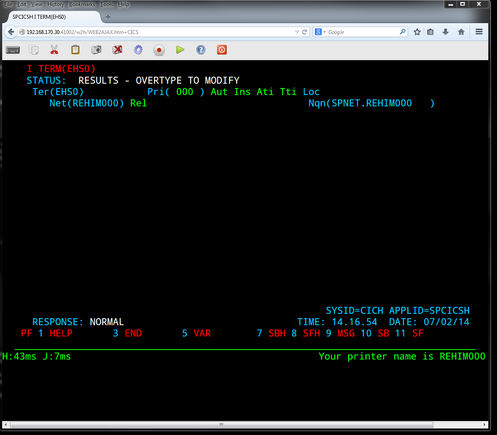
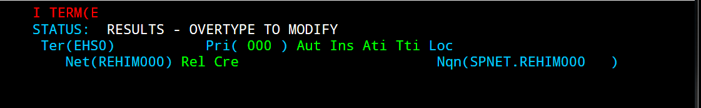
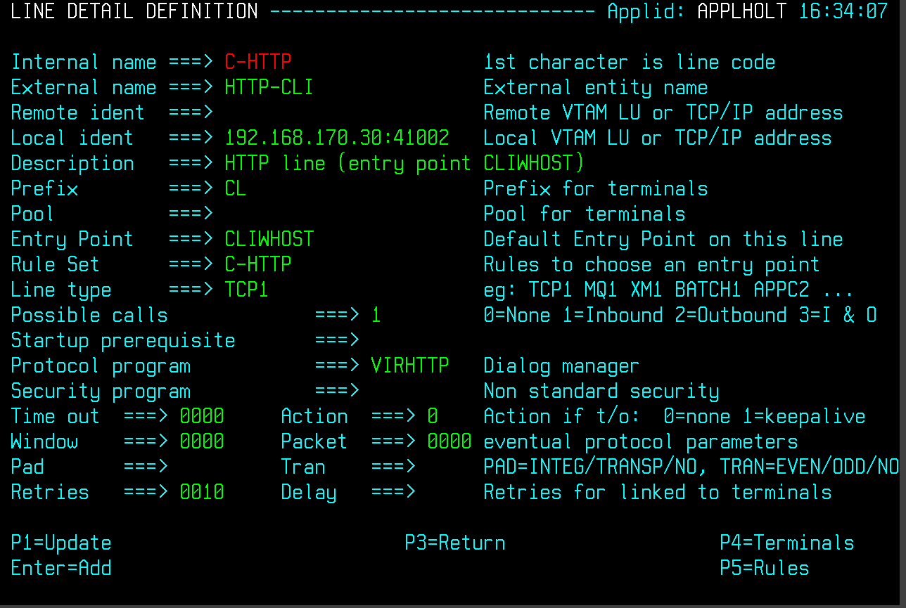
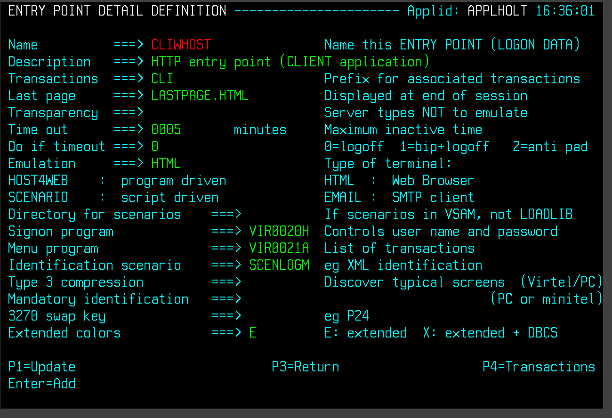
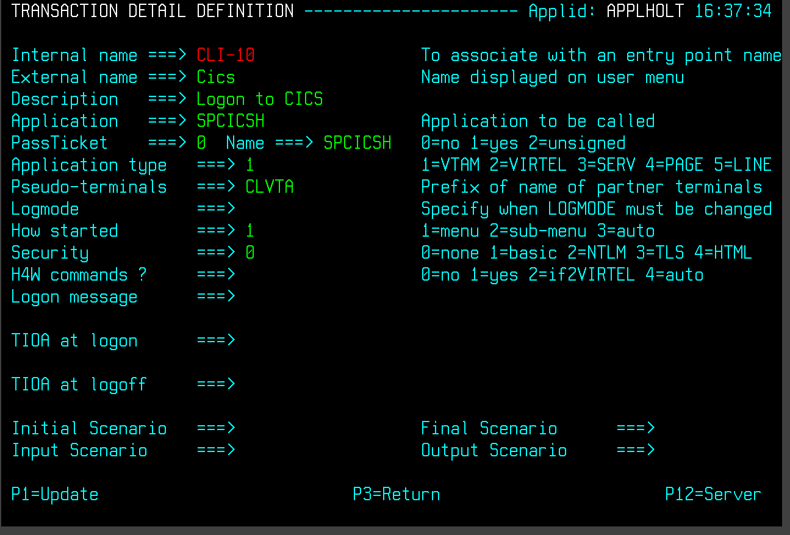

.. _tn201414:

CICS Printing problem
=====================

The following is a CICS log which highlights the problem of CICS
printing with Virtel.

::

   NQNAME **EHS0**,CSNE,15:35:51,SPNET REHIM000 **Entry 1 **
   DFHZC3461 I 07/01/2014 15:38:01 SPCICSH EHT0 CSNE Node REHVT000 session started. ((2) Module name: DFHZOPX)
   NQNAME EHT0,CSNE,15:38:01,SPNET REHVT000
   DFHSN1100 07/01/2014 15:38:01 SPCICSH Signon at netname REHVT000 by user SPTHOLT in group SPGPTECH is complete.
   DFHZC3461 I 07/01/2014 15:39:13 SPCICSH EHS0 CSNE Node REHIM000 session started. ((2) Module name: DFHZOPX)

   NQNAME **EHS0**,CSNE,15:39:13,SPNET REHIM000 **Entry 2**
   DFHZC2410 E 07/01/2014 15:40:30 SPCICSH EHT0 CSNE Node Unrecoverable. VTAM LOSTERM Error Code X'14'. ((1) Module name: DFHZLTX)
   DFHZC3437 I 07/01/2014 15:40:30 SPCICSH EHT0 CSNE Node REHVT000 action taken: NOCREATE CLSDST ABTASK ABSEND ABRECV ((1) Module name: DFHZNAC)
   DFHZC3424 E 07/01/2014 15:40:30 SPCICSH **EHS0** CSNE Session failure. Session terminated immediately. ((2) Module name: DFHZNSP)

   NQNAME EHS0,CSNE,15:40:30,SPNET REHIM000 **Entry 3 **
   DFHZC3437 I 07/01/2014 15:40:30 SPCICSH EHS0 CSNE Node REHIM000 **action** taken: CLSDST ABTASK ABSEND ABRECV **SIMLOGON** ((1) Module name:DFHZNAC)
   DFHZC3462 I 07/01/2014 15:40:30 SPCICSH EHS0 CSNE Node REHIM000 session terminated. ((2) Module name: DFHZCLS) NQNAME EHS0,CSNE,15:40:30,SPNET REHIM000
   DFHSN1200 07/01/2014 15:40:30 SPCICSH Signoff at netname REHVT000 by user SPTHOLT is complete. 1 transactions entered with 0 errors.
   DFHZC3462 I 07/01/2014 15:40:30 SPCICSH EHT0 CSNE Node REHVT000 session terminated. ((2) Module name: DFHZCLS)

   NQNAME EHT0,CSNE,15:40:30,SPNET REHVT000 **Entry 4**
   DFHZC2405 E 07/01/2014 15:40:30 SPCICSH EHS0 CSNE Node REHIM000 not activated. VTAM RETURN CODE 1000 ((6) Module name: DFHZSYX)
   DFHZC3437 I 07/01/2014 15:40:30 SPCICSH EHS0 CSNE Node REHIM000 **action** taken: **NOCREATE** CLSDST ABTASK ABSEND ABRECV ((1) Module name: DFHZNAC)
   DFHZC3462 I 07/01/2014 15:40:30 SPCICSH EHS0 CSNE Node REHIM000 session terminated. ((2) Module name: DFHZCLS) NQNAME EHS0,CSNE,15:40:30,SPNET REHIM000
   DFHZC3461 I 07/01/2014 15:42:20 SPCICSH EHT0 CSNE Node REHVT000 session started. ((2) Module name: DFHZOPX)

   NQNAME EHT0,CSNE,15:42:20,SPNET REHVT000 **Entry 5 **
   DFHSN1100 07/01/2014 15:42:20 SPCICSH Signon at netname REHVT000 by user SPTHOLT in group SPGPTECH is complete.
   DFHZC2405 E 07/01/2014 15:42:20 SPCICSH EHS0 CSNE Node REHIM000 not activated. VTAM RETURN CODE 1000 ((6) Module name: DFHZSYX)
   DFHZC3437 I 07/01/2014 15:42:20 SPCICSH EHS0 CSNE Node REHIM000 action taken: NOCREATE CLSDST ABTASK ABSEND ABRECV ((1) Module name: DFHZNAC)
   DFHZC3462 I 07/01/2014 15:42:20 SPCICSH EHS0 CSNE Node REHIM000 session terminated. ((2) Module name: DFHZCLS)

Scenario:

**Entry 1**

Logon to CICS via Virtel, perform a CICS print transaction –
CMSG for example. Virtel printer is acquired (EHS0) and print is
successful.

**Entry 2**

Virtel session is closed. This causes a session failure for
relay terminals associated with the CICS definitions EHS0/EHT0. LOSTTERM
exit driven for terminal EHT0 but not for printer EHS0. CICS behaviour
is different for printers; this is the cause of the problem.

**Entry 3**

The ACTION to be taken by CICS for the ESH0’s session failure
includes SIMLOGON. CICS tries to reconnect the printer to the VIRTEL
application. Of course the VIRTEL relay application REHIM000 has gone so
this fails.

**Entry 4**

The failure of the SIMLOGON returns a VTAM RC 1000. The ACTION
that CICS now takes with regard to EHS0 is NOCREATE which places the
printer in a REL state. Any further print requests will fail.

**Entry 5**

A new session is started. The terminal EHT0 successfully
connects with CICS but the printer fails. VTAM return code 1000 plus
action of NOCREATE.

This situation will remain until the printer is reset.

**How to reset the printer.**

The easiest method is to issue a CICS command CEMT I (EHS0) and place
the printer back in session.

The following Screen Images capture this process.

Logon to CICS and issue CEMT I (EHS0) or whatever CICS definition you
have that relates to the printer. The following display will be the
status of the printer after disconnecting from Virtel. This printer will
not accept more print request.

    |image0|

Tab down until the cursor is next to the Ter line and press enter. You
will then see the full terminql display. Notice that the Createsess
parameter is set to NoCreate. This is why there is no printing.

|image1|

Change this to create and press enter; PF3 and then press Enter to
reissue the CEMT command. The printer display should look like this:-

|image2|

Virtel will now be able to print to using this printer terminal with the
CMSG command.

**How to fix the problem.**

There are several solutions to this:-

This first is not to terminate your Virtel session, particularly during
a demo, as you will expose the problem. Of course if this does occur you
can manually put the terminal back into CRE mode by following the
instructions above.

A second option and more long term is to create a DFHZNEP module,
assemble it, and place it in a CICS load library. This will prevent the
SIMLOGON taking place following a Session failure. Example code
follows:–

::

   *ASM XOPTS(NOPROLOG NOEPILOG)
            TITLE 'CICS NODE ERROR PROGRAM'
            DFHSNEP TYPE=INITIAL,NAME=DFHZNEP,CS=NO
            DFHSNEP TYPE=ERRPROC,GROUP=4,CODE=(5C)
   ***********************************************************************
   * NEPROC04
   ***********************************************************************
   * THE GROUP 4 ERRPROC WILL HANDLE RETURN CODES 5C (SESSION FAILURE),
   * ON EACH OCCASION WHERE TWAEC IS EQUAL TO X'5C' WE WILL TURN OFF
   * THE SIMLOGON SPECIFICATION.
   *                             SYMBOLIC LABEL TCZNSP02
   * DFH3424 (SESSION FAILURE)   OCCURS WITH TWAEC SET TO X'5C'
   ***********************************************************************
   EP4BASE EQU R8 BASE REGISTER
            USING NEPROC04,EP4BASE        ESTABLISH BASE
            ST CSVTBAR,NEPEPRS            SAVE RETURN REGISTER
            LR EP4BASE,EPBAR              LOAD BASE REGISTER
            CLI TWAEC,TCZNSP02            DFHZC3424 SESSION FAILURE?
            BNE NEP04RET                  NO, GET OUT
            NI TWAOPT2,X'FF'-TWAOASM      TURN OFF SIMLOGON
   NEP04RET DS 0H
            L CSVTBAR,NEPEPRS             RESTORE LINK REGISTER
            BR CSVTBAR                    RETURN
   ***********************************************************************
            DFHSNEP TYPE=FINAL
            END DFHNEPNA

The third option, and probably the most common solution, is to create a
CICS AUTOLOGON session which monitors terminals every thirty seconds and
places them back into their correct status. Most shops tend to have
these AUTOLOGON operators running under CICS for this very purpose.
Check with your CICS SysProg as it could be the case that the solution
is in hand and therefore this situation wouldn’t occur very often.

**Virtel setup**

For this test we used the C-HHTP line, recommended customer default, on
port 41002.

|image3|

The default entry point looks like this:-

|image4|

And the transaction we are using is CICS which has the following
definition CLI-10

|image5|

.. |image1| image:: images/media/image2.png
   :width: 6.30000in
   :height: 5.51389in

