.. _#_Virtel457CN:

============================
Connectivity Reference V4.57
============================

|image00|

**VIRTEL Connectivity Reference**

.. danger:: This book is currently under construction. Do not use!

Version : 4.57

Release Date : 01 Jul 2017 Publication Date : 01/07/2017

Syspertec Communication

196, Bureaux de la Colline 92213 Saint-Cloud Cedex Tél. : +33 (0) 1 46 02 60 42

`www.syspertec.com <http://www.syspertec.com/>`__

.. note::

    Reproduction, transfer, distribution, or storage, in any form, of all or any part of 
    the contents of this document, except by prior authorization of SysperTec 
    Communication, is prohibited.

    Every possible effort has been made by SysperTec Communication to ensure that this document 
    is complete and relevant. In no case can SysperTec Communication be held responsible for 
    any damages, direct or indirect, caused by errors or omissions in this document.

    As SysperTec Communication uses a continuous development methodology; the information 
    contained in this document may be subject to change without notice. Nothing in this 
    document should be construed in any manner as conferring a right to use, in whole or in 
    part, the products or trademarks quoted herein.

    "SysperTec Communication" and "VIRTEL" are registered trademarks. Names of other products 
    and companies mentioned in this document may be trademarks or registered trademarks of 
    their respective owners.  

.. _V457CN_Introduction:

1. Introduction
===============

1.1 Configuration Elements
--------------------------

The VIRTEL configuration is stored in a VSAM file called the “ARBO
file” (VIRARBO). The ARBO file contains various types of elements,
which are described in this chapter:

- Lines, which represent connections between VIRTEL and other network entities

- Rules, which are applied to incoming calls in order to establish the appropriate entry point for the call

- Entry points, which define how the call is processed by VIRTEL and contain a list of transactions available to the incoming call

- Transactions, which define VTAM applications or external servers which process incoming calls

- Terminals, which represent the virtual circuits through which calls flow between VIRTEL and its partners

- External servers, which define the connection parameters used by VIRTEL to connect outgoing calls to other network entities

1.2 Configuration Elements
--------------------------

The VIRTEL system administrator uses a set of programs called
sub-applications to display and update the various elements in the
VIRTEL configuration. The sub-applications are invoked via the
Configuration Menu or the Sub- Application Menu. The Configuration
Menu, introduced in VIRTEL version 4.27, provides access to the most
commonly- used sub-applications required for VIRTEL Web Access and
XOT. It is invoked from the VIRTEL Multi-Session menu via a
transaction which calls module VIR0022. The Sub-Application Menu,
invoked from the Configuration Menu, gives access to all of the
sub-applications, including those rarely used today.

If you log on to VIRTEL in 3270 mode using the default entry point
(“PC”), the VIRTEL Multi-Session menu offers the choice F1 – Admin
to invoke the Configuration Menu.

The first screen you will see is the Multi-Session menu:

|image1|

*Fig. 1 - The VIRTEL Multi-Session menu*

Press [F1] to display the Configuration Menu:

|image2|

*Fig. 2 - Configuration Menu*

To invoke a sub-application, press one of the function keys shown in
the menu (for example, F1 – Lines). To exit from the Configuration
Menu and return to the Multi-Session menu, press CLEAR.

You can optionally display the Sub-Application Menu by pressing
[PA2]:

|image3|

*Fig. 3 - Sub-Application Menu*

To invoke a sub-application, press one of the function keys shown in
the menu (for example, F7 – Videotex Definitions). To exit from the
Sub-Application Menu and return to the Configuration Menu, press
CLEAR or PA2.

1.3 Sub-application Operation
-----------------------------

The sub-applications have certain common operational
characteristics:

- Most of the sub-applications start by displaying a list of the elements currently defined in the configuration file.

- To scroll up or down the list, press [F7] or [F8].

- To find an element in the list, overtype the name of the first element displayed with the first few characters of the element name you are looking for, then press [ENTER].

- To display the detail screen for a particular element, place the cursor on the element name in the list and press [F12].

- To alter the definition of an element, type the desired changes into the appropriate fields in the list and press [F1]. VIRTEL recognizes the changes only when you press [F1]. If you change a transaction you must also press [F1] on the entry point that the transaction belongs to.

- To delete an element, place the cursor on the element name in the list and press [F2]. Then press [F2] again to confirm the deletion.

- To create a new element, place the cursor on a part of the screen outside the list, and press [F12]. A detail screen will be displayed with all fields blank. Fill in the fields and press [ENTER].

- To copy an existing element, first press [F12] to display the detail screen for the existing element, then overtype the element name with the desired name of the new element, and press [ENTER].

- To rename an element, first copy it to a new element as above, then delete the old element.

2. Lines
========

2.1. Introduction
=================

**2.1.1. Access to the application**

The “Line” is one of the basic elements of the VIRTEL configuration.
A line represents a connection between VIRTEL and another network
element: an NPSI MCH, an X25 router, an X25 application (GATE,
PCNE), a CICS system, a VIRNT server, an SMTP server; alternatively,
a line can represent a VIRTEL server (HTTP, SMTP) listening on a
TCP/IP port.

This chapter describes all the functions associated with the
definition of lines. A detailed example will be presented later in
this chapter for each type of line.

The Line Management sub-application is invoked by pressing [PF1] in
the Configuration Menu, by pressing [PF14] in the Sub-Application
Menu, or via the Multi-Session Menu using a transaction which calls
module VIR0046. This sub- application allows the management of all
the line parameters under VIRTEL control.

**2.1.2. Security**

When the security subsystem is active, access to Line Management
sub-application from the Configuration Menu or the Sub-Application
Menu is controlled by the resource $$LINE$$.

When accessed by a transaction, normal transaction security rules
will apply. Security management is described in chapter 8 of the
VIRTEL Installation Guide.

**2.1.3 Objectives**

This sub-application facilitates the definition of X25 and Reverse
X25 lines, APPC connections, and TCP/IP lines. When the
sub-application is started, it first displays a summary of existing
definitions in alphanumeric order.

2.2. Summary of existing definitions
====================================

The first screen shows a summay of existing line definitions in
alphanumeric order:

|image4|

*Fig. 4 - Summary of existing lines*

**2.2.1 Associated Functions**

*Positioning a line*
    In browse, alter, or delete mode, it is possible to scroll the list of lines under the control of VIRTEL.

Search
    Type the name (or partial name) of the required entity on the first
    line under the heading “Internal Name”, then press [Enter].
[PF6]
    Return to the first page of the list.
[PF7]
    Display the previous page.
[PF8]
    Display the next page.

*Modifying a line*    
    Type the desired modifications into the appropriate fields then
    press [PF1]. Multiple definitions can be modified at the same time.
    If the modification affects a field not displayed on the summary
    screen, first position the cursor on the definition concerned, then
    press [PF12] to access the definition detail screen.

    Modifications are not recognized until you press the [PF1] key.
    Certain modifications require a restart of the VIRTEL system.

*Deleing a line*    
    Position the cursor under the name of the entity to be deleted, then
    press [PF2]. The line associated with the entity to be deleted then
    appears highlighted, accompanied by the message CONFIRM DELETE. Then
    press [PF2] again to confirm deletion. The message DELETE OK
    confirms successful completion of the operation. Repeat the
    procedure for each entity to be deleted.

*Adding a line*
    To add a new definition, press [PF12] at the summary screen, either
    with the cursor on an existing definition to copy its attributes, or
    on an empty line to create a new definition from a blank screen.

2.3. Line Parameters
====================

    Pressing [PF12] at the line summary screen displays the line detail
    definition screen. This sub-application allows the definition of the
    various parameters for each type of line.

|image5|

*Fig. 5 - Line detail definition screen*

Internal name
    Internal name of the line. This is the name by which VIRTEL refers
    to the line internally. It must be unique within a VIRTEL instance.

External name
    External name of the line. This name appears in certain console
    messages. It can be used, for example, to display the real name of
    the line or link.

Remote ident
    This field contains the name or address of the remote partner. Usage
    depends on the line type and protocol. The contents of this field
    are described for each line type in the detailed examples which
    follow.

.. _#_bookmark13:

Local ident
    This field contains the name or address used by VIRTEL. Usage
    depends on the line type and protocol. The contents of this field
    are described for each line type in the detailed examples which
    follow.

    For an IP connection, this field represents the listening port
    opened by VIRTEL. The port can be specified in any of the following
    forms:

    : pppp
        VIRTEL opens port pppp on the default home IP address of the host
        TCP/IP. For example, :2048

    nnn.nnn.nnn.nnn: pppp
        VIRTEL opens port pppp on the indicated IP address. nnn.nnn.nnn.nnn
        must be a valid HOME address defined in the host TCP/IP. For
        example, 192.168.0.100:2048

    0: pppp
        VIRTEL opens port pppp without associating itself with a particular
        IP address. VIRTEL can receive calls on any HOME address defined in
        the host TCP/IP. For example, 0:2048 (or 0.0.0.0:2048)

        The combination of IP address and port number must be unique. No two
        VIRTEL can contain a TCP/IP line with the same IP address and port
        number, except that:

        - multiple VIRTELs can use a single distributed VIPA address, provided that the address is defined with a non-zero value for the TIMEDAFFINITY parameter.

        - multiple XOT lines within a single VIRTEL can listen on the same IP address and port number, providing that this same address and port number are not used by another VIRTEL.

        .. note::

            Note that the use of port numbers less than 1024 may require authorization in the profile of the TCP/IP stack (see for example the RESTRICTLOWPORTS, PORT, and PORTRANGE parameters of the z/OS Communications Server). In general, port numbers 1024 and above do not require authorization.

Description
    Free-form description with no particular significance or syntax
    requirement, except for SMTP lines (see the detailed example of an
    SMTP line which follows).

Prefix
    Terminal prefix associated with the line. As a general rule, the
    terminal prefix is a required field. It allows VIRTEL to associate a
    series of terminals to a line. Two lines cannot share the same group
    of terminals. The particular details of this field are described for
    each line type in the detailed examples which follow.

Pool
    The name of a logical pool of terminals associated with the line.
    This pool is used for HTTP connections without predefined terminals
    (see :ref:`“HTTP connections with non-predefined LU names”,<#_V457CN_ForceLUNAME>`). In all other cases this field can be left
    blank.

Entry Point
    Defines the default entry point used by the line. This is a required
    field for HTTP and SMTP lines. It is optional in all other cases.
    Entry point management is described in section 1.4.

Rule Set
    The name of the rule set used by this line. The same rule set can be
    used by more than one line. If this field is blank, no rules are
    used. Rules are described in detail in section .

    For compatability with VIRTEL versions prior to 4.26, the rule set
    name is usually the same as the internal name of the line.

Line type
    Defines the category to which the line belongs. VIRTEL supports the
    following categories of lines:

    X25 lines
        Represented by the values GATE or FASTC

        Support for this type of line is governed by the presence of the
        parameters MINITEL=YES, GATE=GENERAL and possibly FASTC=YES in the
        VIRTCT.

    Reverse-X25 lines
        Represented by the values /GATE, /FASTC, or /PCNE

        Support for this type of line does not require any special
        parameters in the VIRTCT.

    APPC lines
        Represented by the values APPC1 or APPC2.

        APPC1 represents a link with a BATCH environment

        APPC2 represents all other types of APPC link with partners such as
        CICS or NT. Support for this type of line does not require any
        special parameters in the VIRTCT.

    TCP/IP lines
        Represented by the values TCP1 or TCP2.

        Support for this type of line is governed by the presence of the
        parameter TCP1 or TCP2 in the VIRTCT. Used for HTTP, SMTP, ICONNECT,
        XOT, NATIVE, VIRPESIT, VIRNEOX, or VIRPASS TCP lines.

    Cross-memory lines
        Represented by the values XM1 or XM2

        Support for this type of line is governed by the presence of the
        parameter XM1 or XM2 in the VIRTCT. Used for VIRPASS XM lines.

    MQSeries lines
        Represented by the values MQ1 or MQ2

        Support for this type of line is governed by the presence of the
        parameter MQ1 or MQ2 in the VIRTCT.

    Batch lines
        Represented by the values BATCH1 or BATCH2

        Support for this type of line is governed by the presence of the
        parameter BATCH1 or BATCH2 in the VIRTCT.

Possible calls
    Determines which calls can be made on this line. Since the line
    management interface is common to all types of lines, all values
    between 0 and 3 are accepted.

    In addition to being used to authorize incoming, outgoing, or both
    incoming and outgoing calls, this parameter also has an effect
    during VIRTEL startup. Any line which has “Possible calls” set to 0
    will not be activated at VIRTEL startup. Also note the“Possible
    calls” field in the definition of the associated terminals.

Startup prerequisite
    Allows conditional startup of the line. If this field is blank,
    VIRTEL starts the line automatically at system startup.

    WAIT-LINE(n-xxxxxx)
        Waits for line n-xxxxxx to start. The name specified can be either
        the internal or external name of the other line.
    WAIT-MINUTES(nn)
        Waits nn minutes after system startup before starting this line.
    WAIT-COMMAND
        Waits for a console command LINE=linename,START (see “List of
        commands” in the VIRTEL Audit And Performance Guide)
    WAIT-PARTNER
        Waits until VIRTEL receives an SNA BIND command from its partner LU.
    MIMIC-LINE(n-xxxxxx)
        specifies that this line starts and stops in synchronisation with
        line n-xxxxxx. The name specified can be either the internal or
        external name of the other line.

Protocol program
    Indicates the protocol used for a TCP, XM, or MQ type line. The
    following values are valid for a TCP line:

    HTTP or VIRHTTP
        For an HTTP line
    NATIVE2(P) or NATIVE4(P)
        For a line in native TCP/IP mode
    SMTP or VIRSMTP
        For an SMTP line
    ICONNECT
        For a RESUME TPIPE connection with IMS Connect
    VIRPASS
        For a VIRPASS TCP connection with an VIRNT or VIRKIX system
    VIRPESIT
        For a TCP connection with a file transfer program such as CFT/IP
    VIRNEOX
        For a TCP connection with a remote program using the VIRNEOX
        protocol
    XOT or VIRXOT
        For an XOT line

    The following values are valid for an XM line:
    
    VIRPASS
        For a VIRPASS XM connection with a VIRKIX system running on the same MVS 

    The following values are valid for an MQ line:
    
    RAW
        For communication via an MQSeries message queue

    PREFIXED or PREFIX12
        For communication via an MQSeries message queue. This is similar to
        the RAW protocol except that VIRTEL adds 12 bytes of additional
        context information for the application program.

    PREFIX20
        For communication via an MQSeries message queue. This is similar to
        the RAW protocol except that VIRTEL adds 20 bytes of additional
        context information for the application program.

        .. note::

            This field must not be completed for lines whose type is APPC1, APPC2, GATE, FASTC, /GATE, /FASTC, or /PCNE.

Security program
    Reserved for future use.

Time out
    Inactivity time in seconds after which the action specified in the
    following field will be taken. The value 0 inhibits the time out.

Action if T/O
    Action taken if a time out occurs. 0 = no action

    1 = keepalive

KEEPALIVE
    is a message sent by the TCP/IP stack, during periods of inactivity,
    to check whether the connection has been broken. The value 1 is thus
    only valid for lines of type TCP. After a certain number of
    KEEPALIVE messages have been sent without being acknowledged by the
    partner (the number is determined by the TCP/IP stack), the session
    will be considered unusable and the connection will be terminated.

OS/390 and z/OS
    KEEPALIVE must also be activated in the PROFILE of the TCP/IP stack
    (refer to parameters KEEPALIVEOPTIONS or TCPCONFIG INTERVAL). For
    z/OS V1R7 and later, the time out value specified in the preceding
    field determines the interval between KEEPALIVE messages. If the
    time out value is zero then the default TCPCONFIG INTERVAL will be
    used. For OS/390 and z/OS prior to V1R7, the TCP/IP stack uses a
    single KEEPALIVE interval which applies to all sessions, and the
    time out value specified in the preceding field is ignored.

TCP/IP for VSE
    KEEPALIVE is managed globally by the TCP/IP command SET PULSE\_TIME,
    and the parameters “Time Out” and “Action=1” are ignored.

Window
    Window size at the packet level. This parameter is meaningful only
    for X25 (GATE or FASTC) and XOT lines.

    Must correspond with your X25 service provider subscription, or with
    the X25 switch parameters if this type of equipment is used.

Packet
    Packet size. Usually 128. This parameter is meaningful only for X25
    (GATE or FASTC) and XOT lines.

    Must correspond with your TRANSPAC subscription, or with the X25
    switch parameters if this type of equipment is used.

    Replaces the PACKET global parameter in the VIRTCT for versions
    prior to 4.0.

Pad
    This parameter is meaningful only for X25 GATE non Fast-Connect
    lines and AntiGATE lines.

    INTEG
        Data without X’00’ prefix

    TRANSP
        Data with prefix
    NO
        Data with prefix

    Must correspond with the NPSI parameters, or with the X25 switch
    parameters if this type of equipment is used.

Tran
    This parameter is meaningful only for Reverse-X25 AntiPCNE lines.
    Specifies whether EBCDIC/ASCII translation occurs.

    EVEN
        ASCII data from the network is translated to EBCDIC when presented
        to the application, and vice versa (Even Parity)

    ODD
        Ditto (Odd Parity)

    NO
        No ASCII/EBCDIC translation

Retries
    Number of attempts to reacquire auto-activated terminals during
    VIRTEL startup. The delay between attempts is specified by the
    “Delay” parameter.

Delay
    Interval in seconds between attempts to reacquire terminals. The
    default delay is 2 seconds.

2.4. Examples of line definitions
=================================

2.4.1 Definition of a HTTP line
-------------------------------    

When an HTTP line is started, VIRTEL becomes an HTTP server,
authorising connections from a web browser to applications at the
host site. Activation of this type of line is subject to the
presence of the TCP1 parameter in the VIRTCT, as well as to a
definition providing linkage to a file containing the HTML pages.

|image6|

*Fig. 6 - Definition of an HTTP line*

Remote ident
    Always blank.

Local ident
    This is the VIRTEL IP address and port number which browser users must specify in order to connect to VIRTEL. If the port number is omitted then the default is port 80. See the description of the
    “Local ident” field under the heading :ref:`“Line Parameters”,<#_bookmark13>` for more details about how to code this field.

Prefix
    Terminal name prefix (see below).

Entry Point
    When defining an HTTP line, it is obligatory to define a default
    entry point. This entry point will be used for all incoming calls
    which do not match any of the rules of the line. The entry point
    contains a list of transactions, and these transactions determine which directories are used to retrieve
    the HTML pages, and which 3270 applications are accessible to the
    user.

    .. note::
        According to the type of application accessed, each transaction must
        refer to one of the terminal sub-groups associated with the HTTP
        line (see ”HTTP terminals” below).

    For type 1 (Application) transactions
        The prefix will be that of the terminal sub-group with an associated relay.
    For type 2 (Virtel) or type 4 (Page) transactions
        The prefix will be that of the terminal sub-group without an associated relay.
    For type 3 (Server) transactions
        No terminal prefix is required.

Line type
    One of the TCP/IP protocols defined in the VIRTCT, for example TCP1.

Possible calls
    Specify 1 (incoming calls only) to indicate that this line
    represents a listening port where VIRTEL is acting as an HTTP
    server.

    For the case where VIRTEL acts as an HTTP requester, refer to the following section :ref:`“Definition of a HTTP Outbound line”<#_bookmark42>`.

Protocol
    VIRHTTP or HTTP.

Window
    Always 0.

Packet
    Always 0.

Pad
    Always blank.

Tran
    Always blank.

*2.4.1.1 HTTP terminals*    

An HTTP line uses two sub-groups of type-3 terminals having a common prefix (in this case HT). Each terminal in the first sub-group represents one session between the client browser and VIRTEL; no
relay is configured for this sub- group. Each terminal in the second sub-group represents one session between VIRTEL and a host application; in this sub-group, either a relay must be configured
for each terminal, or the sub-group must refer to :ref:`“logical pool of relays”<#_bookmark246>`. Whichever method is chosen, each relay must be defined by an APPL statement in a VTAM node of type APPL. Either explicit or repeated terminal definitions may be used.

Press [PF4] at the HTTP line detail definition screen to display the
list of associated terminals whose prefix matches the prefix
specified in the line definition. If the terminals refer to a
logical pool, the pool itself may have a different prefix and will
therefore not be displayed. In this case you can press [PF2] at the
Configuration Menu to display a list of all terminals.

The example below shows the terminals for two HTTP lines which share
a logical pool of relays. This list was displayed by pressing [PF2]
at the Configuration Menu. The terminals with prefix HT belong to
line H-HTTP, while the terminals with prefix DE belong to line
W-HTTP. For line H-HTTP, the first sub-group consists of terminals
HTLOC000-015 without a relay. The second sub-group consists of
terminals HTVTA000-015 which refer to a logical pool of relays named

\*W2HPOOL. For line W-HTTP, the first sub-group is DELOC000-015, and
the second sub-group is DEVTA000-015 which also refers to the
logical pool named \*W2HPOOL. The logical pool itself consists of
terminals W2HTP000-015 whose

relay LU names are RHTVT000-015. The logical pool also refers to a
pool of associated printer LU’s. The printers are defined with
terminal names W2HIP000-015 and LU names RHTIP000-015. In each case,
the terminal name is an internal name used only within VIRTEL, while
the relay name is an LU name defined by a VTAM APPL statement. The
relay LU name is the name by which the terminal is known to CICS or
other VTAM applications.

|image7|

*Fig. 7 - Definition of terminals associated with an HTTP line*

|image8|

*Fig. 8 - Definition of HTTP terminals without relay*

|image9|

*Fig. 9 - Definition of HTTP terminals with relay*

|image10|

*Fig. 10 - Definition of logical pool of relays for HTTP*

|image11|

*Fig. 11 - Definition of associated printer relays for HTTP*

    Refer to the VIRTEL Web Access Guide for further information about
    printers.

*2.4.1.2. Selection of LU by rule*    

    When the terminals attached to an HTTP line are defined with a
    logical pool of relays, it is possible to force the use of a
    particular LU or group of LU’s for specific callers. This is done by
    coding the desired LU name, or alternatively an LU name prefix
    terminated by an asterisk, in the “Parameter” field of the rule
    which selects the incoming HTTP request. Alternatively, if the value
    $URL$ is entered in the “Parameter” field of the rule, then the
    desired LU name will be taken from the userdata supplied in the
    caller’s URL (see “VIRTEL URL formats: Dynamic pages” in the VIRTEL
    Web Access Guide).

    The rules attached to the HTTP line allow the LU name to be selected
    according to the caller’s IP address, by using the fields “IP
    Subnet” and “Mask” in the rule to match with an IP address or range
    of IP addresses. The rules associated with a user (see
    “Correspondent management” in the VIRTEL Web Access Guide) allow an
    LU name to be assigned to a user according to the user’s e-mail
    address; in this case, the user is identified by a “Cookie” which
    the browser presents to VIRTEL with the HTTP request.

.. _#_V457CN_ForceLUNAME:

*2.4.1.3. HTTP connections with non-predefined terminals. ForceLUNAME option*    

It is possible for an HTTP client to connect to VIRTEL with a parameter specifying an arbitrary VTAM LU name to be used as relay name for host applications. For this to work, four conditions must be fulfilled:

-  the VTAM LU name should be specified in the connection URL. For
   example, if the desired LU name is RLHVT500:

::

   http://n.n.n.n:41002/w2h/web2ajax.htm+IMS+ForceLUNAME=RLHVT500

-  the VIRTEL transaction must specifiy $LINE$ in the “Pseudo-terminals”
   field instead of a terminal name prefix.

-  the HTTP line must specify a pool name

-  a terminal pool of the same name should be defined; only the pool is
   needed, not the predefined pseudo- terminals that are normaly defined
   alongside a pool. The terminal and printer pseudo-terminals will be
   automatically generated using the pool as a template together with
   the relay name specified in the ForceLUNAME parameter of the URL.

The ForceLUNAME=luname parameter in the URL is valid only for transactions which specify TERMINAL=$LINE$ when attached to a line which has an associated terminal pool.

An example of a line with non-predefined LU names is shown below.

2.4.1.3.1 Examples

    In this example the transaction whose external name is IMS defined
    under entry point CLIWHOST. The terminal prefix in the transaction
    definition is $LINE$:

|image12|

*Fig. 12 - Transaction definition using non-predefined LU names*    

The definition of line C-HTTP on port 41002 specifies \*MYPOOL as the line pool name:

|image13|

*Fig. 13 - HTTP line definition using non-predefined LU names*

The definition of the terminal pool \*MYPOOL contains mask characters in the “Relay” and “2nd relay” fields. When a terminal is dynamically created, each “=” sign is substituted by the corresponding character in the ForceLUNAME parameter of the URL:

|image14|

*Fig. 14 - Terminal pool definition using non-predefined LU names*

..note:

    The name of the pool is only used to match the pool to its associated line.

Using these definitions with URL parameter ForceLUNAME=RLHVT500 will dynamically generate two pseudo- terminals: RLHVT500 for the terminal session, and RLHPR500 for the associated printer.

The TCT option RTERM= can be used to check that ForceLUNAME parameter. If RTERM=classname is specified in the TCT than a RACHECK against the ForcedLUNAME will be executed to ensure that the luname is allowed for a particular user.

2.4.1.3.2 Reconnecting to an existing session

The presence of a ForceLUNAME=luname parameter in the URL implies $UseCookieSession$. If a valid VirtelSession cookie is supplied, which corresponds to a currently active session, then the request will be reconnected to that session.

If no VirtelSession cookie is present, or if the cookie does not correspond to any currently open session, then an LU name will be constructed by applying the value of the ForceLUNAME parameter with the mask specified in the pool associated with the line.

If the LU name constructed in the preceding step is already in use then the request will be rejected with HTTP code 406. Otherwise a new session will be opened using the constructed LU name.

*2.4.1.4 VTAM definitions for HTTP terminals*

HTTP relay LU’s must be defined to VTAM by means of APPL statements in an application major node, as shown in the following example:

::

        C52VIRTM VBUILD TYPE=APPL
    * ------------------------------------------------------------------ *
    * RHTVTxxx : Relay for VTAM appl accessed by WEB to HOST *
    * ------------------------------------------------------------------ *
    RHTVT000 APPL AUTH=(ACQ,PASS),MODETAB=ISTINCLM,DLOGMOD=SNX32702,EAS=1
    RHTVT001 APPL AUTH=(ACQ,PASS),MODETAB=ISTINCLM,DLOGMOD=SNX32702,EAS=1
    RHTVT002 APPL AUTH=(ACQ,PASS),MODETAB=ISTINCLM,DLOGMOD=SNX32702,EAS=1
    RHTVT003 APPL AUTH=(ACQ,PASS),MODETAB=ISTINCLM,DLOGMOD=SNX32702,EAS=1
    * ------------------------------------------------------------------ *
    * RHTIPxxx : Printer relays for WEB to HOST terminals *
    * ------------------------------------------------------------------ *
    RHTIP000 APPL AUTH=(ACQ,PASS),MODETAB=ISTINCLM,DLOGMOD=DSILGMOD,EAS=1
    RHTIP001 APPL AUTH=(ACQ,PASS),MODETAB=ISTINCLM,DLOGMOD=DSILGMOD,EAS=1
    RHTIP003 APPL AUTH=(ACQ,PASS),MODETAB=ISTINCLM,DLOGMOD=DSILGMOD,EAS=1
    RHTIP004 APPL AUTH=(ACQ,PASS),MODETAB=ISTINCLM,DLOGMOD=DSILGMOD,EAS=1

*2.4.1.5 VTAM definitions for HTTP terminals*

The HTTP relay LU’s must also be defined to CICS, as shown in the following example:

::

    * VIRTEL 3270 TERMINALS FOR WEB2HOST
    DEFINE TERMINAL(T000) GROUP(VIRTEL) TYPETERM(DFHLU2E2)
    NETNAME(RHTVT000) PRINTER(I000)
    DESC(VIRTEL WEB TO HOST TERMINAL)
    DEFINE TERMINAL(T001) GROUP(VIRTEL) TYPETERM(DFHLU2E2)
    NETNAME(RHTVT001) PRINTER(I001)
    DESC(VIRTEL WEB TO HOST TERMINAL)
    DEFINE TERMINAL(T002) GROUP(VIRTEL) TYPETERM(DFHLU2E2)
    NETNAME(RHTVT002) PRINTER(I002)
    DESC(VIRTEL WEB TO HOST TERMINAL)
    DEFINE TERMINAL(T003) GROUP(VIRTEL) TYPETERM(DFHLU2E2)
    NETNAME(RHTVT003) PRINTER(I003)
    DESC(VIRTEL WEB TO HOST TERMINAL)
    * VIRTEL 3284 PRINTERS FOR WEB2HOST
    DEFINE TERMINAL(I000) GROUP(VIRTEL) TYPETERM(DFHLU3)
    NETNAME(RHTIP000)
    DESC(VIRTEL WEB TO HOST PRINTER)
    DEFINE TERMINAL(I001) GROUP(VIRTEL) TYPETERM(DFHLU3)
    NETNAME(RHTIP001)
    DESC(VIRTEL WEB TO HOST PRINTER)
    DEFINE TERMINAL(I002) GROUP(VIRTEL) TYPETERM(DFHLU3)
    NETNAME(RHTIP002)
    DESC(VIRTEL WEB TO HOST PRINTER)
    DEFINE TERMINAL(I003) GROUP(VIRTEL) TYPETERM(DFHLU3)
    NETNAME(RHTIP003)
    DESC(VIRTEL WEB TO HOST PRINTER)

This job is supplied in member CSDW2H of the VIRTEL SAMPLIB.

.. _#_bookmark42:

**2.4.2 Definition of a HTTP Outbound line**    

An HTTP Outbound line allows VIRTEL to act as an HTTP requester. Activation of this type of line is subject to the presence of the TCP1 parameter in the VIRTCT.

By means of the OPTION$ FOR-HTTP and SEND$ TO-LINE instructions, a VIRTEL scenario can make requests to the remote HTTP server whose address is specified in the HTTP Outbound line definition. Multiple HTTP Outbound lines may be defined to allow requests to be sent to different HTTP servers. Refer to “VIRTEL Web Modernisation Scenarios” in the VIRTEL Web Access Guide for examples of the OPTION$ FOR-HTTP instruction. The $SITE$ defines the IP address of the outbound server. It is passed via a sceanrio. See the OPTION$ FOR-HTTP scenario instruction.

|image15|

*Fig. 15 - Definition of an HTTP Outbound line*

Internal name
    Must be unique.

External name
    Should be unique. Either the internal name or the external name may
    be specified in the SEND$ TO-LINE instruction in the scenario.

Remote ident
    This is the IP address and port number of the remote HTTP server.
    The format is **nnn.nnn.nnn.nnn:pppp** where nnn.nnn.nnn.nnn is the
    IP address and pppp is the port number. The port number (normally
    port 80) must be specified, there is no default.

    The remote HTTP server may also be specified by its DNS name and
    port number, for example webservices.mycompany.com:80

    The special value $SITE$ indicates that the name and port number of
    the remote HTTP server are specified in the SITE parameter of the
    OPTION$ FOR-HTTP instruction.

Local ident
    $NONE$ indicates that VIRTEL will not open a listening port for this
    line.

Prefix
    Leave blank. No terminals are required for an HTTP Outbound line.

Line type
    One of the TCP/IP protocols defined in the VIRTCT, for example TCP1.

Possible calls
    Specify 2 to indicate that this line is used for outbound calls.

Protocol
    VIRHTTP or HTTP.

**2.4.3 Definition of a HTTP Outbound line**        

    An SMTP line establishes a TCP/IP link between VIRTEL and an
    external SMTP server. The external SMTP server receives outgoing
    mail from VIRTEL for distribution to users. The SMTP line also
    defines the characteristics of VIRTEL’s internal SMTP server which
    receives incoming mail sent to VIRTEL.

    The activation of this type of line requires the presence of the
    TCP1 parameter in the VIRTCT.

..note::
    In case of SMTP problems, use the command F VIRTEL,TRACE,L=S-SMTP to
    trace the dialog between VIRTEL and the SMTP server. The trace
    output is written to SYSPRINT or SYSLST.

|image16|

*Fig. 16 - Definition of an SMTP line*

Remote ident
    This field is required and represents the IP address and port number
    of the SMTP server to which VIRTEL sends outgoing mail.

Local ident
    The IP address and port number on which VIRTEL listens for incoming mail. For details of how to code this field, refer to “Local ident” under the heading :ref:`“Line Parameters”,<#_bookmark13>`.

Description
    The sender name generated in outgoing e-mails. Not used for incoming
    e-mails.

    Generally, the description field does not contain any significant
    information. However, in the case of an SMTP line, the contents of
    this field are used by VIRTEL.

    The description field for an SMTP line must be in a specific format.
    It must contain a domain name, followed by an e-mail address
    enclosed in angle brackets (characters “<” and “>”). Everything up
    to the first angle bracket is the operand of the HELO command which
    VIRTEL sends to the SMTP server. The e-mail address in angle
    brackets is the default operand of the MAIL FROM command which
    VIRTEL sends to the SMTP server. This default e-mail address can
    optionally be overridden by the sending application by means of the
    FAD4 structured field. The e-mail address used will normally need to
    be defined to the SMTP server.

Prefix
    Terminal name prefix (see below).

Entry Point
    When defining an SMTP line, it is obligatory to define a default
    entry point. This entry point will be used for all incoming calls
    which do not match any of the rules of the line.

    Entry points for use with SMTP lines are described under the heading
    “Incoming E-mails” in the VIRTEL Web Access Guide.

Line type
    One of the TCP/IP protocols defined in the VIRTCT, for example TCP1.

Possible calls
    Direction of calls.

    The value 3 must be used in order to allow exchanges in both
    directions between VIRTEL and the partner SMTP server.

Protocol
    Always SMTP.

Window
    Always 0.

Packet
    Always 0.

Pad
    Always blank.

Tran
    Always blank.

*2.4.3.1 SMTP terminals*

    By pressing [PF4], the list of terminals associated with the SMTP
    line will be displayed. An SMTP line uses a single sub- group of
    type-3 terminals having a common prefix (in this case SM). The
    number of terminals defined determines the number of simultaneous
    SMTP sessions authorised. Either explicit or repeated terminal
    definitions may be used.

    The example below shows a group of 16 SMTP terminals with associated
    relays:

|image17|

*Fig. 17 - Definition of terminals associated with an SMTP line*

Terminal
    The terminal name must match the prefix of the line.

Relay
    A relay LU must be specified if incoming e-mails are used to trigger
    the start of a CICS transaction (or another VTAM application). The
    relay LU’s must be defined by APPL statements in a VTAM application
    major node, as described below.

Entry point
    Leave blank. The entry point is defined in the line (or in the rules
    of the line) for this type of terminal.

Type de terminal
    Always 3.

Compression
    Always 2.

Possible Calls
    Always 3.

Repeat
    The number of terminals defined.

2.4.3.1.1 VTAM definitions for SMTP terminals

::

    RWSVT200 APPL AUTH=(ACQ,PASS),MODETAB=MODVIRT,DLOGMOD=DLOGREL
    RWSVT201 APPL AUTH=(ACQ,PASS),MODETAB=MODVIRT,DLOGMOD=DLOGREL
    RWSVT202 APPL AUTH=(ACQ,PASS),MODETAB=MODVIRT,DLOGMOD=DLOGREL
    RWSVT203 APPL AUTH=(ACQ,PASS),MODETAB=MODVIRT,DLOGMOD=DLOGREL    

2.4.3.1.2 CICS definitions for SMTP relay LUs

    Where incoming e-mails are used to trigger a CICS transaction (or
    other VTAM application), the SMTP relay LU’s must be defined by APPL
    statements in a VTAM application major node, as shown in this
    example:

::

    DEFINE TYPETERM(SMTP3270) GROUP(VIRTSMTP)
    DESCRIPTION(TYPETERM FOR SMTP PSEUDO-TERMINAL)
    DEVICE(3270) TERMMODEL(2) SHIPPABLE(YES) RECEIVESIZE(16384)
    PAGESIZE(24,80) DEFSCREEN(24,80) EXTENDEDDS(YES) QUERY(ALL)
    TTI(YES) RELREQ(YES) DISCREQ(YES) LOGONMSG(NO) UCTRAN(NO)
    DEFINE TERMINAL(SM00) GROUP(VIRTSMTP)
    DESCRIPTION(PSEUDO-TERMINAL FOR SMTP)
    TYPETERM(SMTP3270) NETNAME(RWSVT200) USERID(SPVIRSTC)
    DEFINE TERMINAL(SM01) GROUP(VIRTSMTP)
    DESCRIPTION(PSEUDO-TERMINAL FOR SMTP)
    TYPETERM(SMTP3270) NETNAME(RWSVT201) USERID(SPVIRSTC)
    DEFINE TERMINAL(SM02) GROUP(VIRTSMTP)
    DESCRIPTION(PSEUDO-TERMINAL FOR SMTP)
    TYPETERM(SMTP3270) NETNAME(RWSVT202) USERID(SPVIRSTC)
    DEFINE TERMINAL(SM03) GROUP(VIRTSMTP)
    DESCRIPTION(PSEUDO-TERMINAL FOR SMTP)
    TYPETERM(SMTP3270) NETNAME(RWSVT203) USERID(SPVIRSTC)    

**2.4.4 Definition of an IMS Connect line**        

An IMS Connect line establishes a TCP/IP connection between VIRTEL and IMS Connect using the RESUME TPIPE protocol. Once the connection is established, IMS application programs running in an MPP or BMP region can send requests to VIRTEL using the ICAL DL/I call. VIRTEL processes these requests by launching a customer-written scenario. The scenario can perform actions such as making an outbound HTTP call to a web service before returning the result to the IMS application program. Activation of this type of line requires the presence of the TCP1 parameter in the VIRTCT.

|image18|

*Fig. 18 - Definition of an IMS Connect line*

Internal name
    The VIRTEL internal name for this connection.

External name
    Must match the IMS destination id (IRM\_IMSDestId).

Remote ident
    IP address of IMS Connect followed by the port number.

Local ident
    Leave blank.

Prefix
    Terminal name prefix (see below).

Entry Point
    The entry point name must match the IMS TPIPE name (IRM\_CLIENTID).

Line type
    One of the TCP/IP protocols defined in the VIRTCT, for example TCP1.

Possible calls
    Always 1.

Protocol
    Always ICONNECT.

*2.4.4.1 IMS Connect Terminals*

Press [PF4] at the Line Detail Definition screen to display the list
    of terminals associated with an IMS Connect line. An IMS Connect
    line uses a single sub-group of type-3 terminals having a common
    prefix (ICAL in this example). No relays are defined for this type
    of line. The number of terminals defined determines the maximum
    number of simultaneous RESUME TPIPE sessions between VIRTEL and IMS
    Connect.

|image19|

*Fig. 19 - Definition of terminals associated with an IMS Connect line*

Terminal
    The terminal name must match the prefix of the line.

Relais
    Leave blank.

Entry point
    Leave blank.

Terminal Type
    Always 3.

Compression
    Always 2.

Possible calls
    Always 1.

Repeat
    Number of terminals (RESUME TPIPE sessions) defined.

2.4.4.1.1 IMS Connect Entry Point

    Each IMS Connect line must have an associated Entry Point whose name
    is specified in the line definition. An example is shown below:

|image20|

*Fig. 20 - Definition of entry point associated with an IMS Connect line*

Name
    The name of the entry point must match the IMS TPIPE name specified
    in the IRM\_CLIENTID parameter of the IMS Connect definition.

Transactions
    Prefix of associated transaction names (see next section).

Emulation
    Always SCENARIO.

Directory for scenarios
    The name of the VIRTEL directory which contains the scenario(s) for
    processing requests from IMS.

2.4.4.1.2 IMS Connect transactions

Each IMS Connect entry point must have one or more associated
    transactions. Press [PF4] at the Entry Point Detail Definition
    screen to display the list of transactions associated with an IMS
    Connect entry point. The transaction definition specifies the name
    of the scenario which will be invoked to process an incoming request
    from IMS. If the incoming request does not specify a transaction
    name, or if the specified transaction name is not defined in the
    entry point, then VIRTEL will invoke the transaction whose external
    name is the same as the entry point name. If there is no such
    default transaction, then the request is rejected and VIRTEL issues
    message VIRIC57E.

|image21|

*Fig. 21 - Definition of a transaction associated with an IMS Connect entry point*

Internal name
    Must match the transaction prefix specified in the entry point.

External name
    This is the transaction name specified by the IMS application in the
    message header. For the default transaction, the external name must
    be the same as the entry point name.

Application
    Always $NONE$.

Application type
    Always 2.

Security
    Always 0.

TIOA at logon
    Always &/S.

Initial scenario
    The name of the VIRTEL scenario which will process requests from IMS
    for this transaction.

2.4.4.1.3 IMS Connect Scenarios

    When a scenario is invoked to process a request message from IMS connect, VIRTEL places the contents of the request message in the variable $INFILE$. After processing the message, the scenario  returns a response message to IMS by means of the SEND$ AS-ANSWER instruction. By way of illustration, the simple example shown below converts the request message to uppercase before sending it back as a response message to IMS:

::

    OTMACL SCREENS APPL=OTMACL
    *
    * Scenario for testing an IMS CONNECT connection
    *
    SCENARIO INITIAL
    *
    CONVERT$ EBCDIC-TO-UPPERCASE,VAR='$INFILE$'
    SEND$ AS-ANSWER,VAR='$INFILE$',TYPE='TEXT'
    *
    SCENARIO END
    *
    SCRNEND
    END    

*Example scenario for processing an IMS Connect request*

..note::
    More complex scenarios may be constructed with the aid of VIRTEL Studio.

2.4.4.1.4 IMS Connect messqge format

    Messages sent from an IMS application to VIRTEL may be prefixed by a
    12-byte header. The format of the header is shown in the figure
    below:

+----+----+--------+--------+----------------------------------+
+ Bytes   + Length + EBCDIC + Meaning                          +
+=========+========+========+==================================+
+ 0 - 3   + 4      +  /V1/  + Identifies type of prefix        +
+---------+--------+--------+----------------------------------+
+ 4 - 11  + 8      + xxxxxx + Externql transaction name. Left  +
+         +        +        + justified and padded with blanks +
+---------+--------+--------+----------------------------------+         

*Format of an IMS Connect message header*

All data following the header is treated as binary data which is passed to the scenario without translation in the $INFILE$ variable.

**2.4.5 Definition of a XOT line** 

    An XOT line establishes a connection between VIRTEL and a CISCO
    router. Across this type of line, VIRTEL processes incoming and
    outgoing calls to and from the X25 network. Activation of this type
    of line requires the presence of the TCP1 parameter in the VIRTCT.

|image22|

*Fig. 22 - Definition of an XOT line*

Remote ident
    IP address of the router followed by the port number 1998.

    The address specified here is used by VIRTEL as the destination
    address for outgoing calls. Incoming calls are accepted from any IP
    address, except in the case of XOT lines which share a common IP
    address and port (specified in the “Local ident” field). Such lines
    only accept calls whose IP source address matches the router address
    specified in the “Remote ident” field. This allows VIRTEL to
    allocate incoming calls to the correct XOT line. The parameter
    UNIQUEP=Y (which can be specified only in batch definition mode
    using the VIRCONF utility) allows this check to be enforced
    regardless of whether the “Local ident” field specifies a shared
    address.

..note::
    Take care to ensure that the router presents the expected address to
    VIRTEL. You may need to use the xot-source parameter in the router
    configuration to ensure that the router presents the correct IP
    address to VIRTEL for incoming calls. Example:

::

    x25 route .* xot 10.0.1.1 xot-source loopback0

Local ident
    The IP address and port number on the VIRTEL side. For details of how to code this field, refer to “Local ident” under the heading :ref:`“Line Parameters”,<#_bookmark13>`.

    The port number must be 1998. This port number is fixed by the XOT
    protocol, and the router does not provide any configuration
    statement which allows the port number to be altered.

    From VIRTEL version 4.24 onwards, multiple XOT lines with the same
    local IP address and port number can be defined within a single
    instance of VIRTEL. As explained above, VIRTEL uses the router IP
    address (“Remote ident”) to match calls from a router with the
    correct XOT line. However, if multiple instances of VIRTEL are
    started on a single MVS system, each VIRTEL must have its own
    distinct IP address for XOT. The use of VIPA allows multiple IP
    addresses to be defined within a single TCP/IP stack (see the IBM
    manual z/OS Communications Server IP Configuration Guide for details
    of VIPA).

Prefix
    Terminal name prefix (see below).

Entry Point
    Not required for this type of line.

Line type
    One of the TCP/IP protocols defined in the VIRTCT, for example TCP1.

Possible calls
    No special restriction.

Protocol
    Always XOT.

Window
    In accordance with the window size for the X25 line specified in the
    router configuration (see note below).

Packet
    In accordance with the packet size for the X25 line specified in the
    router configuration (see note below).

    Note: VIRTEL will normally use the window size and packet size
    negotiated with the partner during call setup. The Window and Packet
    values specified in the line definition are the default values which
    will be used if no values are supplied by the partner in the Call or
    Call Accepted packets.

Pad
    Always blank.

Tran
    Normally blank, unless non-standard ASCII translation is required
    for special applications.

*2.4.5.1 XOT Terminals*

    Press [PF4] at the line definition screen to display the list of
    terminals associated with an XOT line. An XOT line uses a single
    sub-group of type-3 terminals having a common prefix (XOTF in this
    example). Each terminal may be associated with an application relay
    defined by a VTAM APPL statement. The number of terminals defined
    determines the maximum number of simultaneous sessions (or virtual
    circuits) between the router and VIRTEL.

|image23|    

*Fig. 23 - Definition of terminals associated with an XOT line*

Terminal
    The terminal name must match the prefix of the line.

Relais
    The name of a relay LU must be specified if incoming calls are
    routed to a type-1 transaction (VTAM application). The relay LU’s
    must be defined by APPL statements in a VTAM application major node,
    as described below. If all incoming calls are routed to a type-3
    transaction (external server), as is the case for calls routed to a
    GATE or PCNE application such as CFT or Inter.PEL, no relay is
    required on the terminals attached to the XOT line.

Entry point
    Leave blank.

Terminal Type
    Always 3.

Compression
    Always 2.

Possible calls
    Always 3.

Repeat
    Number of terminals (virtual circuits) defined.

*2.4.5.2 VTAM definition for XOT terminals*

When incoming calls are routed to a type-1 transaction (VTAM
    application), the relay LU’s must be defined by APPL statements in a
    VTAM application major node, as shown in the example below:

::    

    RXOTF000 APPL AUTH=(ACQ,PASS),MODETAB=MODVIRT,DLOGMOD=DLOGREL
    RXOTF001 APPL AUTH=(ACQ,PASS),MODETAB=MODVIRT,DLOGMOD=DLOGREL
    RXOTF002 APPL AUTH=(ACQ,PASS),MODETAB=MODVIRT,DLOGMOD=DLOGREL
    RXOTF003 APPL AUTH=(ACQ,PASS),MODETAB=MODVIRT,DLOGMOD=DLOGREL

**2.4.6 Definition of a MQ line** 

    An MQ line establishes a connection between VIRTEL and an MQSeries
    message queue. Each MQ line can receive messages from, or send
    messages to, one MQSeries message queue. Activation of this type of
    line requires the presence of the MQ1 or MQ2 parameter in the
    VIRTCT. The queue can be shared with another application (another
    VIRTEL for instance) or used in exclusive mode depending on its own
    definition.

|image24|

*Fig. 24 - Definition of an MQ line*

Remote ident
    For the RAW protocol: Leave blank.

    For the PREFIXED, PREFIX12, and PREFIX20 protocols: The special
    value $REPLYTOQ indicates that outbound messages are sent to the
    destination indicated by the REPLYTOQ and REPLYTOQMGR parameters
    taken from the inbound message and saved in the 12- or 20-byte
    header.

Local ident
    The name of the MQSeries message queue. The queue name prefix
    specified in the MQn parameter of the VIRTCT will be added to the
    front of this name. Refer to “Parameters of the VIRTCT” in the
    VIRTEL Installation Guide for details of the MQn parameter.

Prefix
    Terminal name prefix (see below).

Entry Point
    Required for MQ input queue.

Line type
    One of the MQn protocols defined in the VIRTCT, for example MQ1.

Possible calls
    Specify one of the following values:

    -1 = Input: VIRTEL receives messages from the MQSeries queue
    -2 = Output: VIRTEL writes messages to the MQSeries queue

Protocol
    RAW, PREFIXED, PREFIX12, or PREFIX20.

Tran
    Specify the way in which messages are processed on the line.

   -STR = The messages are processed as MQFMT_STRING formatted messages. This will allow MQ to perform the appropriate character set translations between the communicating systems. To support this feature, the PTF5135 must be applied on the system.
   -no value = The messages are processed as MQFMT_NONE formatted messages.

*2.4.6.1 MQ Terminals*

    Press [PF4] at the line definition screen to display the list of
    terminals associated with an MQ line. An MQ line uses a single
    sub-group of type-3 terminals having a common prefix (MQIN in this
    example). The number of terminals defined determines the maximum
    number of messages which can be processed simultaneously by VIRTEL.

|image25|

 *Fig. 25 - Definition of terminals associated with an MQ line*

Terminal
    The terminal name must match the prefix of the line.

Relais
    Leave blank.

Entry point
    Leave blank.

Terminal Type
    Always 3.

Compression
    Always 2.

Possible calls
    Always 3.

Repeat
    Number of terminals defined.

**2.4.7 Definition of a Batch line**

    A batch line allows VIRTEL to process HTTP requests in batch mode.
    When a batch line is defined in the VIRTEL configuration, VIRTEL
    reads HTTP requests from an input sequential file at startup,
    processes the requests, writes the responses to an output sequential
    file, and shuts down. Activation of this type of line is subject to
    the presence of the BATCHn parameter in the VIRTCT.

|image26|

*Fig. 26 - Definition of a batch line*

Remote ident
    Always blank.

Local ident
    Always blank.

Prefix
    Terminal name prefix (see below).

Entry Point
    When defining a batch line, it is obligatory to define a default
    entry point. This entry point is similar to the entry point used for
    an HTTP line. The entry point contains a list of transactions, and
    these transactions determine which directories are used to retrieve
    page templates, and which 3270 applications are accessible to the
    batch requests.

    Each transaction must refer to one of the terminal sub-groups
    associated with the batch line (see ”Batch terminals” below).

    For type 1 (Application) transactions:
        The prefix will be that of the terminal sub-group with an associated relay.

    For type 2 (Virtel) or type 4 (Page) transactions
        The prefix will be that of the terminal sub-group without an associated relay.

    For type 3 (Server) transactions
        No terminal prefix is required.

Line type
    BATCH1 or BATCH2, corresponding to one of the BATCH parameters defined in the VIRTCT.

Possible calls
    Specify 1 (incoming calls only).

Protocol
    VIRHTTP or HTTP.

Window
    Always 0.

Packet
    Always 0.

Pad
    Always blank.

Tran
    Always blank.

2.4.7.1 Batch terminals

    Like an HTTP line, a batch line uses up to two sub-groups of type-3
    terminals having a common prefix (in this case BT1). Refer to “HTTP
    terminals” 26 for further details. If the batch requests do not
    require connection to a host VTAM application, then it is only
    necessary to define the first terminal sub-group (the sub-group
    without relays).

    Press [PF4] at the line detail definition screen to display the list
    of associated terminals whose prefix matches the prefix specified in
    the line definition. Then press [PF12] to display the terminal
    detail definition. The example below shows the terminals for a batch
    line without relays:

|image27|     

*Fig. 27 - Definition of terminals without relay for a batch line*

**2.4.8 Definition of a Native TCP/IP**

    VIRTEL can act as an IP-to-SNA gateway allowing existing VTAM
    applications to communicate with partner applications via the IP
    network. By connecting to a VIRTEL NATIVE TCP/IP port, a remote
    application can establish a TCP/IP session with VIRTEL and exchange
    messages with a host VTAM application using a simple record-oriented
    protocol.

    The connection is always established by the remote TCP/IP
    application, but messages can flow in both directions. Each message
    exchanged between VIRTEL and the partner application is preceded by
    a two- or four-byte length field.

    Typically the host application is a CICS application designed to
    communicate with banking terminals such as the IBM 3650.

    The activation of this type of line requires the presence of the
    TCP1 parameter in the VIRTCT.

|image28|

*Fig. 28 Definition of a NATIVE TCP/IP line*

Remote ident
    Not used for a NATIVE TCP/IP line.

Local ident
    The IP address and port number on which VIRTEL listens for incoming connections from the partner application. For details of how to code this field, refer to “Local ident” under the heading :ref:`“Line Parameters”<#_bookmark13>`.

Prefix
    Terminal name prefix (see below).

Entry Point
    The default entry point will be used for all incoming calls which do
    not match any of the rules of the line. Entry points for use with
    native TCP/IP lines must specify Emulation type $NONE$

Line type
    One of the TCP/IP protocols defined in the VIRTCT, for example TCP1.

Possible calls
    Specify 1 to allow inbound calls.

Protocol
    NATIVE2 or NATIVE2P for native TCP/IP protocol with a two-byte
    length field NATIVE4 or NATIVE4P for native TCP/IP protocol with a
    four-byte length field

Packet
    Specify a packet size sufficient to contain the largest message sent
    by either the host or the partner application, plus 2 or 4 bytes for
    the length field.

2.4.8.1 NATIVE TCP/IP Terminals

    By pressing [PF4], the list of terminals associated with the NATIVE
    TCP/IP line will be displayed. A NATIVE TCP/IP line uses a single
    group of type-3 terminals having a common prefix (VIP in this
    example). The number of terminals defined determines the number of
    simultaneous conversations authorised.

    The example below shows a group of 4 NATIVE TCP/IP terminals:

|image29|

*Fig. 29 - Definition of terminals associated with a NATIVE TCP/IP line*

Terminal
    The terminal name must match the prefix of the line.

Relay
    Specify the name of the relay pool which defines the terminal LU
    names as seen by the VTAM application. The first character is an
    asterisk indicating that this is the name of a pool.

Entry point
    Leave blank. The entry point is defined in the line (or in the rules
    of the line) for this type of terminal.

Terminal type
    Always 3.

Compression
    Always 2.

Possible Calls
    Always 3.

Repeat
    The number of terminals defined.

2.4.8.2 NATIVE TCP/IP relay pool

    The figure below shows the definition of the NATIVE TCP/IP relay
    pool:

|image30|

*Fig. 30 - Definition of terminals associated with a NATIVE TCP/IP line*

Terminal
    Any terminal name may be used for the relay pool.

Relay
    Specify the name of the the terminal LU names as seen by the VTAM
    application.

Pool name
    Must match the relay name field in the NATIVE TCP/IP terminal
    definition. The first character is an asterisk indicating that this
    is the name of a pool.

Entry point
    Leave blank.

Terminal type
    Always 3.

Compression
    Always 2.

Possible Calls
    Always 3.

Repeat
    The number of terminals defined.

2.4.8.3 VTAM definitions for NATIVE TCP/IP terminals

    Relay LU’s must be defined to VTAM by means of APPL statements in an
    application major node, as shown in the following example:

::

    VIRTAPPL VBUILD TYPE=APPL
    * ------------------------------------------------------------------ *
    * RVIPLU00 : VTAM relays for VIRTEL NATIVE TCP/IP terminals          *
    * ------------------------------------------------------------------ *
    RVIPLU00 APPL AUTH=(ACQ,PASS),MODETAB=MODVIRT,DLOGMOD=DLOGREL
    RVIPLU01 APPL AUTH=(ACQ,PASS),MODETAB=MODVIRT,DLOGMOD=DLOGREL
    RVIPLU02 APPL AUTH=(ACQ,PASS),MODETAB=MODVIRT,DLOGMOD=DLOGREL
    RVIPLU03 APPL AUTH=(ACQ,PASS),MODETAB=MODVIRT,DLOGMOD=DLOGREL

*VTAM definitions for NATIVE TCP/IP relay LU’s*

2.4.8.4 CICS definitions for NATIVE TCP/IP terminals

The NATIVE TCP/IP relay LU’s must also be defined to CICS, as shown in the following example:

::

    DEFINE TYPETERM(DT3650) GROUP(VIRTEL)
    DESC(3650 FOR VIRTEL TCP/IP)
    DEVICE(3650) SESSIONTYPE(USERPROG)
    SENDSIZE(1536) RECEIVESIZE(1536)
    DEFINE TERMINAL(VR00) GROUP(VIRTEL) NETNAME(RVIPLU00)
    DESC(VIRTEL NATIVE TCP/IP TERMINAL) TYPETERM(DT3650)
    DEFINE TERMINAL(VR01) GROUP(VIRTEL) NETNAME(RVIPLU01)
    DESC(VIRTEL NATIVE TCP/IP TERMINAL) TYPETERM(DT3650)
    DEFINE TERMINAL(VR02) GROUP(VIRTEL) NETNAME(RVIPLU02)
    DESC(VIRTEL NATIVE TCP/IP TERMINAL) TYPETERM(DT3650)
    DEFINE TERMINAL(VR03) GROUP(VIRTEL) NETNAME(RVIPLU03)
    DESC(VIRTEL NATIVE TCP/IP TERMINAL) TYPETERM(DT3650)

*CICS definitions for NATIVE TCP/IP relay LU’s*

2.4.8.5

All messages sent on a NATIVE TCP/IP conversation are prefixed by a 2-byte or 4-byte header. The format of the header for the NATIVE2 protocol is shown in the figure below:

+---------+--------+--------------------------------------------------------------+
+ Bytes   + Length + Meaning                                                      +
+=========+========+==============================================================+
+ 0 - 1   + 2      + Message length in bytes, excluding the length field itself   +
+         +        + This is a 16-bit unsigned binary number in big-endian format +
+         +        + (Most significant byte first)                                +
+---------+--------+--------------------------------------------------------------+         

*Format of NATIVE2 message header*

The format of the header for the NATIVE4 protocol is shown in the figure below:

+---------+--------+--------------------------------------------------------------+
+ Bytes   + Length + Meaning                                                      +
+=========+========+==============================================================+
+ 0 - 3   + 4      + Message length in bytes, excluding the length field itself   +
+         +        + This is a 32-bit unsigned binary number in big-endian format +
+         +        + (Most significant byte first)                                +
+---------+--------+--------------------------------------------------------------+      

*Format of NATIVE4 message header*

2.4.8.6

    All data following the header is treated as binary data which is
    passed to the CICS application without translation. The maximum
    message length is specified in the definition of the NATIVE TCP/IP
    line.

    The variants NATIVE2P and NATIVE4P may be used if the terminal is
    defined to the application as a 3270 (LU2) device. In this case,
    VIRTEL will add the prefix X'7D4040' to inbound messages before
    sending them to the application, and will remove the 3270 prefix
    (for example X'F1C1') from outbound messages before sending them to
    the terminal. The message format to the terminal is the same as
    described above for NATIVE2 and NATIVE4.

**2.4.9 Definition of VIRPASS TCP line for VIRKIX**

    Communication between VIRTEL and CICS can be established via APPC,
    TCP/IP, or Cross-memory. This section describes communications in
    TCP/IP mode using the VIRKIX program on the CICS side.

|image31|

*Fig. 31 - Definition of a VIRPASS TCP line for VIRKIX*

Remote ident
    Contains the IP address and port number of the CICS side of the
    link. It must match the fields “adresse TCP/IP” and “port serveur”
    of the TCP/IP interface defined in VIRKIX. This field should only be
    used when the VIRKIX relay type is “Virpass TCP/IP” (previously
    known as “Virpass Symétrique”). If the VIRKIX relay type is “Virpass
    Asymétrique” (previously known as “Virtel TCP/IP”), this field must
    be blank, and VIRTEL will wait for VIRKIX to make the connection on
    the address specified in the “Local ident” field.

Local ident
    Must be specified. Contains the IP address and port number of the
    VIRTEL side of the link. Must match the fields “Adresse TCP/IP” and
    “port du serveur” specified in the VIRPASS interface (relay type
    “Virpass TCP/IP” or “Virpass Asymétrique”) defined in VIRKIX.

Prefix
    Terminal name prefix (see below).

Entry point
    Leave blank.

Line type
    TCP1

Possible calls
    Always 3.

Protocol
    Always VIRPASS.

Window
    Always 0.

Packet
    Always 0.

Pad, Tran
    Always blank.

2.4.9.1 Terminals on a VIRPASS TCP line for VIRKIX 

    A VIRPASS TCP line for communication with VIRKIX uses a single
    sub-group of terminals dedicated to outgoing calls. Either explicit
    or repeated definitions can be used. The terminals are defined as
    type 3, compression 2, and the “Possible calls” field must be set to
    2. The “Relay” field in the terminal definition must contain the
    name of the VIRKIX relay which will be activated at connection time.
    In the case of incoming X25 calls this relay is defined in the
    VIRKIX menu “Interface X25” – “Appels X25 entrant”. The “Type de
    ligne” field in the relay definition must contain the value X25VIRPA
    (or E25TCPIP in previous versions of VIRKIX). Unlike other terminal
    types, the relay name specified here is not the name of a VTAM LU.

|image32|

*Fig. 32 - Terminals on a VIRPASS TCP line for VIRKIX*

**2.4.10 Definition of a VIRPASS TCP line for VIRNT**

    A VIRNT system can be connected to VIRTEL to act as an X25 gateway
    handling incoming and outgoing connections to and from VIRTEL, or to
    act as a LECAM server. Communication between VIRTEL and VIRNT can be
    established using either an APPC line or a TCP/IP line. This section
    describes TCP/IP mode.

|image33|

*Fig. 33 - Definition of a VIRPASS TCP line for VIRNT*

Remote ident
    Always blank.

Local ident
    This field must be the same as the TCP/IP port referenced under the
    heading “HOST IP Port” in the VIRPASS.INI file on the VIRNT system.

Prefix
    Terminal name prefix (see below).

Entry Point
    Not required for this type of line.

Line type
    TCP1

Possible calls
    No special restriction.

Protocol
    Always VIRPASS.

Window
    Always 0.

Packet
    Always 0.

Pad, Tran
    Always blank.

2.4.10.1
    A VIRPASS TCP connection with a VIRNT system can use up to two
    sub-groups of terminals. The first sub-group is dedicated to
    incoming calls and has an associated relay. The second sub-group is
    dedicated to outgoing calls and has no associated relay. The two
    sub-groups have a common prefix which associates them with the line.
    Either explicit or repeated terminal definitions may be used.

+----------------+------------+----------------+-------------+-----+-----+
|     NTTCE980   |     0020   |     RNTTC000   |     $X25$   | 3   | 1   |
+================+============+================+=============+=====+=====+
|     NTTCS980   |     0020   |                |     $X25$   | 3   | 2   |
+----------------+------------+----------------+-------------+-----+-----+

*List of terminals for a VIRPASS TCP line for VIRNT*

Each terminal in the pool dedicated to incoming calls must have an associated relay. The terminals are defined as type 3, compression 2, and the “Possible Calls” field must be set to 1:

|image34|

*Fig. 34 - Inbound terminals for a VIRPASS TCP line for VIRNT*

    Terminals in the pool dedicated to outgoing calls do not have an
    associated relay. The terminals are defined as type 3, compression
    2, and the “Possible Calls” field must be set to 2:

|image35|

*Fig. 35 - Outbound terminals for a VIRPASS TCP line for VIRNT*

**2.4.11 Definition of a VIRPASS XM line for VIRKIX**

    Communication between VIRTEL and CICS can be established via APPC,
    TCP/IP, or Cross-memory. This section describes communications in
    Cross-memory (XM) mode using the VIRKIX program on the CICS side.

|image36|   

*Fig. 36 - Definition of a VIRPASS XM line for VIRKIX*

External name
    Must match the relay name of a VIRPASS cross-memory interface in VIRKIX.

Remote ident
    Contains the jobname of the CICS region in which VIRKIX is running.
    The CICS region must be in the same MVS system as VIRTEL.

Local ident
    Must match the field “Nom de la liaison” specified in the definition
    of the VIRPASS cross-memory interface in VIRKIX.

Prefix
    Terminal name prefix (see below).

Entry point
    Leave blank.

Line type
    XM1

Possible calls
    Always 3.

Protocol
    Always VIRPASS.

Window
    Always 0.

Packet
    Always 0.

Pad, Tran
    Always blank.

2.4.11.1 Terminals on a VIRPASS XM line for VIRKIX

    A VIRPASS XM line for communication with VIRKIX uses a single
    sub-group of terminals dedicated to outgoing calls. Either explicit
    or repeated definitions can be used. The terminals are defined as
    type 3, compression 2, and the “Possible calls” field must be set to
    2. The “Relay” field in the terminal definition must contain the
    name of the VIRKIX relay which will be activated at connection time.
    In the case of incoming X25 calls this relay is defined in the
    VIRKIX menu “Interface X25” – “Appels X25 entrant”. The “Type de
    ligne” field in the relay definition must contain the value X25VIRPA
    (this is the same value as for VIRPASS TCP, which was coded as
    E25TCPIP in previous versions of VIRKIX).

    Unlike other terminal types, the relay name specified here is not
    the name of a VTAM LU.

|image37|

*Fig. 37 - Terminals on a VIRPASS XM line for VIRKIX*

    A VIRPASS cross-memory connection is defined in VIRKIX by means of
    an entity known as a “Virpass cross-memory interface”:

::

    KIXADMIN - Virpass Cross-Memory ----------        V2R5 - 30/06/2005 - 10:54:55
                                                                  Sysid CICS: CICT
    Nom interface XM: VIRTELXM
    ------------------------------------------------------------------------------
    Nom du job partenaire : SPTSABYV
    Nom de la liaison :     XM44000
    ------------------------------------------------------------------------------
    Autres définitions:
    Lancement :                             A M:Manuel A:Autom,évt dans SYSID:
    Nbr maxi de connexions: 0010            de 01 à 1024
    Transaction associée : APIW             APIW par défaut
    Trace et Snap : O                       O:Oui N:Non
    Trace Connexion : O                     O:Oui N:Non
    Snap centralisé : O                     O:Oui N:Non
    Priorité : 080                          de 000 à 255
    ------------------------------------------------------------------------------
   
   
    P3--------P4--------P5--------P6--------P7--------P8--------P12-------ENTER----
    Menu Quitter M.A.J Supprimer Saisir Valider    

*VIRKIX definitions for a VIRPASS XM connection*

Nom interface
    The name of the VIRPASS cross-memory interface (also known as the
    relay name or “nom relais”) must match the “external name” of the
    VIRPASS XM line in VIRTEL.

Nom du job partenaire
    Specifies the jobname of the VIRTEL STC, which must be in the same
    MVS system as VIRKIX.

Nom de la liaison
    Must match the “Local ident” of the VIRPASS XM line in VIRTEL.

    Refer to the VIRKIX Configuration documentation for details of the
    other fields on this panel.

**2.4.12 Definition of a VIRPESIT line**

    A VIRPESIT line establishes a TCP/IP link between VIRTEL and a file
    transfer application such as CFT. A VIRPESIT line allows VIRTEL to
    act as an IP-to-X25 gateway for file transfer sessions using the
    PESIT and ETEBAC protocols. File transfer requests arriving via IP
    on a VIRPESIT line may be routed either to a local GATE or PCNE
    application, or to a remote partner via the X25 network. Similarly,
    file transfer requests from the X25 network or from local GATE or
    PCNE applications may be routed to the IP network via a VIRPESIT
    line.

    The activation of this type of line requires the presence of the
    TCP1 parameter in the VIRTCT.

|image38|

*Fig. 38 - Definition of a VIRPESIT line*

Remote ident
    (optional) IP address and port number of the default partner (for
    outbound calls when the external server does not specify a partner
    IP address).

Local ident
    The IP address and port number on which VIRTEL listens for incoming connections from the partner application. For details of how to code this field, refer to “Local ident” under the heading :ref:`“Line Parameters”<#_bookmark13>`.

Prefix
    Terminal name prefix (see below).

Entry Point
    The default entry point will be used for all incoming calls which do
    not match any of the rules of the line.

    Entry points for use with VIRPESIT lines are described under the
    heading “VIRPESIT gateway” in the “Incoming calls” section of the
    VIRTEL Technical Documentation.

Line type
    One of the TCP/IP protocols defined in the VIRTCT, for example TCP1.

Possible calls
    Specify 3 to allow exchanges in both directions.

Protocol
    Always VIRPESIT.

2.4.12.1

    By pressing [PF4], the list of terminals associated with the
    VIRPESIT line will be displayed. A VIRPESIT line uses a single group
    of type-3 terminals having a common prefix (I001T in this example).
    The number of terminals defined determines the number of
    simultaneous file transfer sessions authorised.

    The example below shows a group of 8 VIRPESIT terminals:

|image39|

*Fig. 39 - Definition of terminals associated with a VIRPESIT line*

Terminal
    The terminal name must match the prefix of the line.

Relay
    Leave blank.

Entry point
    Leave blank. The entry point is defined in the line (or in the rules
    of the line) for this type of terminal.

Terminal type
    Always 3.

Compression
    Always 2.

Possible Calls
    Always 3.

Repeat
    The number of terminals defined.

**2.4.13 Definition of a VIRNEOX line**

    A VIRNEOX line allows VIRTEL to act as a server for communications
    with application programs over a TCP/IP connection using a
    simplified X25-like protocol. Typically the application will be an
    existing X25 application which has been converted to TCP/IP.

    The activation of this type of line requires the presence of the
    TCP1 parameter in the VIRTCT.

|image40|

*Fig. 40 - Definition of a VIRNEOX line*

Local ident
    The IP address and port number on which VIRTEL listens for incoming connections from the partner application. For details of how to code this field, refer to “Local ident” under the heading :ref:`“Line Parameters”<#_bookmark13>`.

Prefix
    Terminal name prefix (see below).

Entry Point
    The default entry point will be used for all incoming calls which do
    not match any of the rules of the line. Entry points for use with
    VIRNEOX lines must specify Emulation type $NONE$

Line type
    One of the TCP/IP protocols defined in the VIRTCT, for example TCP1.

Possible calls
    Specify 1 to allow inbound calls.

Protocol
    Always VIRNEOX.

Packet
    Specify a packet size sufficient to contain the largest message sent
    by either the host or the partner application.

    By pressing [PF4], the list of terminals associated with the VIRNEOX
    line will be displayed. A VIRNEOX line uses a single group of type-3
    terminals having a common prefix (XNE3 in this example). The number
    of terminals defined determines the number of simultaneous
    conversations authorised.

    The example below shows a group of 8 VIRNEOX terminals:

|image41|

*Fig. 41 - Definition of terminals associated with a VIRNEOX line*

Terminal
    The terminal name must match the prefix of the line.

Relay
    Leave blank.

Entry point
    Leave blank. The entry point is defined in the line (or in the rules
    of the line) for this type of terminal.

Terminal type
    Always 3.

Compression
    Always 2.

Possible Calls
    Always 3.

Repeat
    The number of terminals defined.

.. _#_bookmark94:    

**2.4.14 Definition of a X25 GATE Non Fast-Connect line**

    An X25 GATE Non Fast-Connect line establishes a connection between VIRTEL and an X25 line connected to an IBM 3745 communications controller. Across this type of line, VIRTEL handles incoming and
    outgoing calls to and from the X25 network. Activation of this type of line requires the presence of the GATE and MINITEL parameters in the VIRTCT.

|image42|    

*Fig. 42 - Definition of an X25 GATE non-Fast Connect line*

Remote ident
    Name of the MCH LU generated by NPSI.

Local ident
    Always blank.

Prefix
    Terminal name prefix (see below). The terminal names must be
    identical to the virtual circuit LU names generated by NPSI.

Entry Point
    Not required for this type of line.

Line type
    Always GATE.

Possible calls
    No special restriction.

Protocol
    Always blank.

Window
    Must agree with the NPSI definition.

Packet
    Must agree with the NPSI definition.

Pad
    Must agree with the NPSI definition.

Tran
    Must agree with the NPSI definition.

    From VIRTEL version 4.15 onwards, TRAN must be blank if TRAN=EVEN is specified in the NPSI definition.

2.4.14.1

    An X25 GATE Non Fast-Connect line uses a single sub-group of
    terminals dedicated to the management of sessions between VIRTEL and
    the switched virtual circuits on the one hand, and between VIRTEL
    and the host applications on the other hand. Each terminal is
    associated with an application relay defined by a VTAM APPL
    statement.

    The relay name is compulsory for this type of terminal.

|image43|

*Fig. 43 - Terminals on an X25 GATE Non Fast-Connect line*

Terminal
    The terminal name must match the virtual circuit LU names generated
    by the X25.VC macro in the NPSI.

Relay
    The application relay is a VTAM LU which represents the VIRTEL side
    of the session with NPSI for each virtual circuit. Relay LUs are
    defined in a VTAM application major node.

Terminal type
    Always 1.

Compression
    Always 2.

Possible calls
    Specify 3 to allow both incoming and outgoing calls.

Repeat
    The number of virtual circuits defined by NPSI.

2.4.14.2 VTAM definitions for GATE terminals

    Each Minitel or PC wishing to benefit from VIRTEL functionality must
    be defined in a VTAM switched major node similar to the one shown
    below.

::

    VIRTMINI VBUILD TYPE=SWNET
    PU01 PU ADDR=01,                   *
    IDBLK=003,                         *
    IDNUM=xxyyy,              Note 1   *
    MAXDATA=4101,             Note 2   *
    MODETAB=MODVIRT,          Note 3   *
    DLOGMOD=DLOGMINI,                  *
    PACING=1,                          *
    VPACING=3,                         *
    PUTYPE=1,                          *
    DISCNT=YES,                        *
    SSCPFM=USSNTO,                     *
    LOGAPPL=vvvvvv            Note 4   *
    MINI1 LU LOCADDR=0,                *
    TERM=TWX

..note::
    
    The switched major nodes must be defined as shown in the above
    example. The associated relays must refer to DLOGMODE DLOGREL in the
    MODVIRT mode table.

Note 1
    IDNUM takes the value xxyyy with xx equal to the value of the
    parameter IDNUMH in the NPSI X25MCH MACRO; yyy is a hexadecimal
    value decrementing in steps of 2 from the CVC number assigned to the
    LU.

    Let us suppose for example that we have a configuration made up of
    two TRANSPAC lines, L1 and L2, containing respectively 16 and 8
    entries. The Minitels are installed on line L2. The value yyy
    assigned to the first Minitel is X'030' ((16 + 8) x 2) in
    hexadecimal. The values of yyy respectively assigned to the other
    Minitels are X'02E', X'02C', X'02A', X'028', etc.

Note 2
    The value of MAXDATA must not exceed MAXBFRU times UNITSZ, nor must
    it exceed the NCP MAXDATA value.

Note 3
    The MODVIRT mode table must be placed in an executable module
    library (VSE) or in a LOADLIB (MVS, VM) known to VTAM before
    activation of the switched major node.

Note 4
    LOGAPPL takes the value specified in the APPLID TYPE=INITIAL
    parameter in the VIRTCT. If both Minitels and PC’s are used
    simultaneously, the LOGAPPL parameter must be replaced by the value
    USSTAB=USSVIRT (the source of this USSTAB is in the VIRTEL SSL for
    VSE and in the MACLIB for MVS).

..note::

    The LOGAPPL and USSTAB parameters are valid only for non GATE lines.
    For sites making outgoing calls, from NCP 5.40 onwards, USSTAB and
    GATE are incompatible, and therefore the USSTAB keyword should be
    omitted for a switched major node describing type 1 LU’s.

2.4.14.3 NCP parameters for a GATE line

    The LUDRPOOL MACRO must contain an NUMTYP1 parameter with a value
    greater than or equal to the number of CVC available on the lines.
    For LU6.2 connections, check for the presence of the NUMILU
    parameter which indicates the number of available PU type 2.1.

2.4.14.4 NPSI parameters for a GATE line

    The following parameters must agree with the specification of your
    TRANSPAC subscription.

2.4.14.4.1 Macro X25VCCPT    

MAXPKTL (packet length)
    Must equal the value given for “Packet Size” on your TRANSPAC
    subscription (usually 128).

VWINDOW (packet level window size)
    Must equal the value given for “Packet Window Size” on your TRANSPAC
    subscription (usually 3).

2.4.14.4.2 Macro X25MCH    

CONNECT
    Must be specified as NO.

GATE
    Must be specified as GENERAL.

LLCLIST
    Must have the value LLC4. LLC0,LLC2,LLC3,LLC4 and LLC5 can for
    example take the values 0, 2, 3, 4 et 5. Only the value assigned to
    the LLC4 parameter is important, because it will be appended to the
    TRANSPAC number allowing access to the server.

MWINDOW (frame level window size)
    Must equal the value given for “Frame Window Size” on your TRANSPAC
    subscription (usually 7).

FRMLENGTH
    Must equal MAXPKTL + 3 (usually 131).

PAD
    Permissible values are NO, INTEG or TRANSP. If the value is INTEG,
    support for DARK (invisible fields) is not provided on Minitels in
    80 column mode. It is provided where PAD=TRANSP.

    In GATE mode, VIRTEL supports DARK in 80 column mode whatever the
    value of the PAD parameter.

SUBADDR
    Must be YES.

TRAN
    Must be EVEN or NO.

2.4.14.5 Routing on incoming calls

    Incoming calls are routed by means of an entry point name specified
    in the Call User Data of the incoming call packet. If no Call User
    Data is specified, the value specified in the “Entry Point”
    parameter of the terminal definition is used. If this field is not
    supplied, the second value of the DEFENTR parameter in the VIRTCT is
    used.

    Other possibilities are available through the use of a type 1 user
    exit.

    While the sharing of a line in Fast-Connect mode would give better
    performance, it may prove necessary to use another method if, for
    example, the line is used for 3174 connections, or by another
    product which does not support Fast-Connect. Except for the
    definition of the line itself, the remainder of the configuration is
    similar to that of a non- shared GATE line. Be aware, however, that
    the implementation of such a solution can be complex.

    To be able to support line sharing without Fast-Connect mode, the
    line must be defined as GATE=GENERAL and the X25MCH CONNECT
    parameter must be set to NO. The parameters SUBADDR, CTCP and CUD0
    define the routing of connections and the use of the associated
    QLLC’s.

::

    X25.MCH RESS=003,                                              *
    FRMLENGTH=131,                                                 *
    LUNAME=(XU01,XU02), LU MCH (Application x, VIRTEL)             *
    LCGDEF=(0,19),                                                 *
    MWINDOW=3,                                                     *
    ANS=CONT,                                                      *
    DBIT=NO,                                                       *
    GATE=GENERAL,                                                  *
    CONNECT=NO,               Multi applications without F-C       *
    CTCP=(00,01),             Reference CTCP                       *
    CUD0=(09,01),                                                  *
    * Calls with subaddr 9 connect the terminal to the application
    * controlling line XU01 (CTCP=00)
    * Calls with subaddr 1 connect the terminal to the application
    * VIRTEL controlling line XU02 (CTCP=01)
    LLCLIST=(LLC0,LLC4,LLCn,...),                                  *
    LOGAPPL=(PELC00,VIRTEL),                                       *
    SUBADDR=YES,                                                   *
    IDBLKC=62, Idblk for PCNE (LLC0)                               *
    IDBLKG=63, Idblk for GATE (LLC4)                               *
    * In VTAM there are 2 switched major nodes with the same IDNUM
    * but different IDBLK (062 for the first, 063 for VIRTEL)
    PAD=INTEG,                                                     *
    PKTMODL=8,                                                     *
    STATION=DTE,                                                   *
    SPPED=19200,                                                   *
    TRAN=EVEN
    X25.LCG LCGN=0
    X25.VC LCN=(0,19),                             20 physical CVC *
    TYPE=SWITCHED,                                                 *
    MAXDATA=4101,                        Largest VTAM message size *
    VCCINDX=1,                                                     *
    CALL=INOUT                         Incoming and outgoing calls

..note::

    Each application can potentially use up to 20 CVC’s. It is not
    possible to limit the number of circuits which can be used by each
    application, as can be done with Fast-Connect.

**2.4.15 Definition of an X25 GATE Fast-Connect line**

An X25 GATE Fast-Connect line establishes a connection between VIRTEL and an X25 line connected to an IBM 3745 communications
    controller. Across this type of line, VIRTEL handles incoming and
    outgoing calls to and from the X25 network. Activation of this type
    of line requires the presence of the FASTC, GATE and MINITEL
    parameters in the VIRTCT.

|image44|    

*Fig. 44 - Definition of an X25 GATE Fast Connect line*

Remote ident
    Name of the MCH LU generated by NPSI.

Local ident
    Always blank.

Prefix
    An X25 GATE Fast-Connect line uses a single sub-group of terminals
    dedicated to the management of sessions between VIRTEL and the
    switched virtual circuits on the one hand, and between VIRTEL and
    the host applications on the other hand. Each terminal is associated
    with an application relay defined by a VTAM APPL statement.

Entry Point
    Not required for this type of line.

Line type
    Always FASTC.

Possible calls
    No special restriction.

Protocol
    Always blank.

Window
    Must agree with the NPSI definition.

Packet
    Must agree with the NPSI definition.

Pad
    Must agree with the NPSI definition.

Tran
    Must agree with the NPSI definition.

2.4.15.1 Terminals on a X25 GATE Fast-Connect line

    An X25 GATE Fast-Connect line uses a single sub-group of terminals
    dedicated to the management of sessions between VIRTEL and the
    switched virtual circuits on the one hand, and between VIRTEL and
    the host applications on the other hand. Each terminal is associated
    with an application relay defined by a VTAM APPL statement.

    The relay name is compulsory for this type of terminal.

|image45|    

*Fig. 45 - Terminals on an X25 GATE Fast-Connect line*

Terminal
    The terminal name must match the virtual circuit LU names generated
    by the X25.VC macro in the NPSI.

Relay
    The application relay is a VTAM LU which represents the VIRTEL side
    of the session with NPSI for each virtual circuit. Relay LUs are
    defined in a VTAM application major node.

Terminal type
    Always 1.

Compression
    Always 2.

Possible calls
    Specify 3 to allow both incoming and outgoing calls.

Repeat
    The number of virtual circuits defined by NPSI.

2.4.15.2 VTAM definitions for Fast-Connect

    Each Minitel or PC wishing to take advantage of VIRTEL functionality must be defined to VTAM in a switched major node similar to that shown in section :ref:`“Definition of a X25 GATE Non Fast-Connect line”<#_bookmark94>`.

2.4.15.3 NCP/NPSI parameters for Fast-Connect

    As well as offering a noticable performance improvement, the use of
    Fast-Connect allows one line to be shared between several CTCP’s.
    When the Fast-Connect option is used, there is no VTAM switched
    major node. The switched virtual circuit is directly connected to
    the CTCP. This permanent connection minimizes connection time as
    well as the consumption of memory and CPU resources.

    The definition of a Fast-Connect line is similar to that of a GATE
    line, apart from:

2.4.15.3.1 Macro X25MCH

CONNECT
    Must have a value other than NO. The remaining parameters depend on
    the value of the CONNECT parameter.

LLCLIST
    Must contain the value LLC5.

2.4.15.4 Sharing of Fast-Connect lines

::    

    X25.MCH ADRESS=003,                                *
    FRMLENGTH=131,                                     *
    LUNAME=(XU01,XU02), LU associated with each VIRTEL *
    LCGDEF=(0,19),                                     *
    MWINDOW=3,                                         *
    ANS=CONT,                                          *
    DBIT=NO,                                           *
    GATE=GENERAL,                                      *
    CONNECT=SUBD, F-C to multiple VIRTEL               * 
    SUBD=(4,9,1),                 Subaddresses 4, 9, 1 *
    CTCP=(0,1,1)                  1st VIRTEL if 4,     *
                                  2nd VIRTEL if 9 or 1 *
    LOGAPPL=(VIRTEL1,VIRTEL2)    Applid of each VIRTEL *
    LLCLIST=(LLC4)                                     *
    SUBADDR=NO,                                        *
    PAD=NO,                                            *
    PKTMODL=8,                                         *
    STATION=DTE,                                       *
    SPEED=19200,                                       *
    TRAN=NO
    X25.LCG LCGN=0
    X25.VC LCN=(0,19),                 20 physical CVC *
    TYPE=SWITCHED,                                     *
    MAXDATA=4101,            Largest VTAM message size *
    VCCINDX=1,                                         *
    CALL=INOUT              Incoming and outgoing calls
    X25.FCG QTY=(15),        No.of CVC used for CTCP 0 *
    CTCPNO=(0),                            CTCP number *
    ANS=CONT,                                          *
    MAXDATA=4101,                                      *
    PRFLINE=XU01, Line name prefix                     *
    PRFPU=XP01, PU name prefix                         *
    PRFLU=XL01, Virtual LU name prefix                 *
    SUFFIX=0001             LU numbers incremented by 1
    X25.FCG QTY=(15),        No of CVC used for CTCP 1 *
    CTCPNO=(1),                            CTCP number *
    ANS=CONT,                                          *
    MAXDATA=4101,                                      *
    PRFLINE=XU02,                     Line name prefix *
    PRFPU=XP02,                         PU name prefix *
    PRFLU=XL02,                 Virtual LU name prefix *
    SUFFIX=0001             LU numbers incremented by 1

*Example of a Fast-Connect line shared between 2 VIRTELs using subaddressing*

..note::

    The number of “logical” virtual circuits can be greater than the
    number of “physical” virtual circuits. This example has 20 physical
    virtual circuits for 30 (2 X 15) logical virtual circuits.

::

    X25.MCH ADRESS=003,                                *
    FRMLENGTH=131,                                     *
    LUNAME=XU01,         MCH LU associated with VIRTEL *
    LCGDEF=(0,19),                                     *
    MWINDOW=3,                                         *
    ANS=CONT,                                          *
    DBIT=NO,                                           *
    GATE=GENERAL,                                      *
    CONNECT=YES,                F-C to multiple VIRTEL *
    LOGAPPL=VIRTEL1,                  Applid of VIRTEL *
    LLCLIST=LLC4,                                      *
    SUBD=NO,                    SUBD=NO                *  
    PAD=NO,                                            *
    PKTMODL=8,                                         *
    STATION=DTE,                                       *
    SPPED=19200,                                       *
    TRAN=NO
    X25.LCG                     LCGN=0
    X25.VC LCN=(0,19),                 20 physical CVC *
    TYPE=SWITCHED,                                     *
    MAXDATA=4101,            Largest VTAM message size *
    PRFLINE=ZL01,                                      *
    PRFPU=ZPU01,                                       *
    PRFLU=ZLU01,                                       *
    VCCINDX=1,                                         *
    CALL=INOUT Incoming and outgoing calls

*Example of a Fast-Connect line with a single CTCP without subaddressing*

**2.4.16 Definition of an X25 AntiGATE line**

    A Reverse-X25 AntiGATE line establishes a link between VIRTEL and a
    Communication and Transmission Control Program (CTCP) application.
    On this type of line, VIRTEL communicates with the CTCP to manage
    incoming and outgoing calls to and from the X25 network. Once a
    virtual circuit is established, data flows across LU-LU sessions
    between the VIRTEL terminals and the CTCP. In this way, VIRTEL
    emulates an IBM 3745 controller with NPSI.

|image46|

*Fig. 46 - Definition of an X25 AntiGATE line*

Remote ident
    LU name of the CTCP (CFT, Inter.PEL, etc). May be blank if
    WAIT-PARTNER is coded in the “Startup pre-requisite” field.

Local ident
    Name of the LU which represents the physical circuit for the
    AntiGATE line (analogous to the LU generated by the NPSI X25.MCH
    macro in the NCP). This LU must be defined by a VTAM APPL statement.

Prefix
    Terminal name prefix (see below).

Entry Point
    The default entry point, if no entry point is defined at the
    terminal level, or in the line rules or call user data.

Line type
    Always /GATE.

Possible calls
    No special restriction.

Startup prerequisite
    WAIT-PARTNER is recommended for AntiGATE lines. WAIT-PARTNER must be
    specified if the partner is CFT.

Protocol
    Always blank.

Window, Packet
    Must agree with the definition in the CTCP.

Pad, Tran
    Must agree with the definition in the CTCP.

2.4.16.1 Terminals on an AntiGATE line

    An AntiGATE line uses a single sub-group of terminals which
    represent the virtual circuits allocated to the line (analogous to
    the LU’s linked to the virtual circuits defined by the NPSI macro
    X25.VC in the NCP). The terminal name is an internal name which is
    used to associate the terminal definition with the AntiGATE line.
    The associated relay name must match the name of a VTAM APPL
    statement. Either explicit or repeated terminal definitions may be
    used.

|image47|

*Fig. 47 - Terminals on an X25 AntiGATE line*

2.4.16.2 VTAM definitions for ANTIGATE

    The The LU’s representing the line and the virtual circuits must be
    defined by APPL statements in a VTAM application major node similar
    to the following example:

::

    VIRAGATE VBUILD TYPE=APPL
    * ------------------------------------------------------------------ *
    * Pseudo ligne gate émulée par Virtel (note 1) *
    * ------------------------------------------------------------------ *
    VXU21 APPL AUTH=(ACQ,PASS),MODETAB=MODVIRT,DLOGMOD=DLOGANTI
    * ------------------------------------------------------------------ *
    * Pseudo cvcs pour ligne gate émulée par Virtel (note 1) *
    * ------------------------------------------------------------------ *
    AG21LU01 APPL AUTH=(ACQ,PASS),MODETAB=MODVIRT,DLOGMOD=DLOGANTI
    AG21LU02 APPL AUTH=(ACQ,PASS),MODETAB=MODVIRT,DLOGMOD=DLOGANTI
    AG21LU03 APPL AUTH=(ACQ,PASS),MODETAB=MODVIRT,DLOGMOD=DLOGANTI
    AG21LU04 APPL AUTH=(ACQ,PASS),MODETAB=MODVIRT,DLOGMOD=DLOGANTI
    ...

*VTAM definitions for an X25 AntiGATE line*

Note 1
    The LU’s defined in the “Local ident” field of the line must specify
    logmode DLOGANTI.
Note 2
    The LU’s for the terminal relays can use a logmode appropriate for
    the application.
Note 3
    The MODVIRT phase must be placed in an executable library (VSE) or
    in a LOADLIB (MVS, VM) defined to VTAM before the application major
    node can be activated.

**2.4.17 Definition of a X25 AntiFastConnect line**

    Similar to an AntiGATE line, a Reverse-X25 AntiFastC line
    establishes a link between VIRTEL and a Communication and
    Transmission Control Program (CTCP) application. On this type of
    line, VIRTEL communicates with the CTCP to manage incoming and
    outgoing calls to and from the X25 network. Once a virtual circuit
    is established, data flows across LU-LU sessions between the VIRTEL
    terminals and the CTCP. In this way, VIRTEL emulates an IBM 3745
    controller with NPSI.

|image48|

*Fig. 48 - Definition of an X25 AntiFastC line*

Remote ident
    CTCP LU name.

Local ident
    Name of the LU which represents the physical circuit for the
    AntiFastC line (analogous to the LU generated by the NPSI X25.MCH
    macro in the NCP). This LU must be defined by a VTAM APPL statement.

Prefix
    Terminal name prefix (see below).

Entry Point
    The default entry point, if no entry point is defined at the
    terminal level, or in the line rules or call user data.

Line type
    Always /FASTC.

Possible calls
    No special restriction.

Protocol
    Always blank.

Window, Packet
    Must agree with the definition in the CTCP.

Pad
    Must agree with the definition in the CTCP.

Tran
    Specify EVEN, ODD, or NO according to the requirements of the CTCP.
    Additionally, for AntiFastC lines only: the special value EBCD
    indicates that VIRTEL will perform the necessary conversion to allow
    a Videotex server CTCP to be accessed in 3270 mode (VIRTEL
    Multisession or Web Access).

2.4.17.1 Terminals on an AnticFastC line

    An AntiFastC link uses a single sub-group of terminals which
    represent the virtual circuits allocated to the line (analogous to
    the LU’s linked to the virtual circuits defined by the NPSI macro
    X25.VC in the NCP). The terminal name is an internal name which is
    used to associate the terminal definition with the AntiFastC line.
    The associated relay name must match the name of a VTAM APPL
    statement. Either explicit or repeated terminal definitions may be
    used.

|image49|

*Fig. 49 - Terminals on an X25 AntiFastC line*

    The LU’s representing the line and the virtual circuits must be
    defined by APPL statements in a VTAM application major node similar
    to the following example:

::

    VIRAFAST VBUILD TYPE=APPL
    * ------------------------------------------------------------------ *
    * Pseudo ligne fastc émulée par Virtel (note 1) *
    * ------------------------------------------------------------------ *
    VXU14 APPL AUTH=(ACQ,PASS),MODETAB=MODVIRT,DLOGMOD=DLOGANTI
    * ------------------------------------------------------------------ *
    * Pseudo cvcs pour ligne fastc émulée par Virtel (note 1) *
    * ------------------------------------------------------------------ *
    X25AF500 APPL AUTH=(ACQ,PASS),MODETAB=MODVIRT,DLOGMOD=DLOGANTI
    X25AF501 APPL AUTH=(ACQ,PASS),MODETAB=MODVIRT,DLOGMOD=DLOGANTI
    X25AF502 APPL AUTH=(ACQ,PASS),MODETAB=MODVIRT,DLOGMOD=DLOGANTI
    X25AF503 APPL AUTH=(ACQ,PASS),MODETAB=MODVIRT,DLOGMOD=DLOGANTI

*VTAM definitions for an X25 AntiFastC line*

Note 1
    The LU’s defined in the “Local ident” field of the line must specify
    logmode DLOGANTI.

Note 2
    The LU’s for the terminal relays can use a logmode appropriate for
    the application.

Note 3
    The MODVIRT phase must be placed in an executable library (VSE) or
    in a LOADLIB (MVS, VM) defined to VTAM before the application major
    node can be activated.

**2.4.18 Definition of an X25 AntiPCNE line**

    Like an AntiGATE or AntiFastC line, a Reverse-X25 AntiPCNE line
    establishes a link between VIRTEL and an application. By contrast
    however, VIRTEL does not use a line-level LU to manage call setup,
    and the application does not supply VIRTEL with a call packet.
    Instead, the application makes outgoing calls by choosing a
    particular LU associated with the AntiPCNE line. The X25 called
    number is defined at the terminal level by means of an associated
    external server definition. In this way, VIRTEL emulates an IBM 3745
    controller with NPSI.

|image50|    

*FFig. 50 - Definition of an X25 AntiPCNE line*

Remote ident
    Partner application LU name.

Local ident
    Always blank.

Prefix
    Terminal name prefix (see below).

Entry Point
    Leave blank. The entry point should be defined in the rules of the
    line.

Line type
    Always /PCNE.

Possible calls
    No special restriction.

Protocol
    Always blank.

Window
    Not used for an AntiPCNE line.

Packet
    Not used for an AntiPCNE line.

Pad
    Always NO.

Tran
    Always NO.

2.4.18.1 Terminals on an AntiPCNE line

    An AntiPCNE line uses two sub-groups of terminals. In each case, the
    terminal name is an internal name which is used to associate the
    terminal definition with the AntiPCNE line. The associated relay
    name must match the name of a VTAM APPL statement.

    The first sub-group is used for outgoing calls (from the point of
    view of the application), and consists of explicitly defined
    terminals with the “Possible calls” field set to 1. Each terminal in
    this first sub-group corresponds to a single remote partner. The
    “Relay” field of each terminal in this first sub-group must contain
    the LU name which the application uses to make outgoing calls to the
    remote partner concerned. The entry point specified by the rules of
    the line contains a type-3 transaction which specifies “&R” as the
    application name. This makes the link with an external server whose
    name is identical to the Relay LU name. The external server contains
    the call parameters (X25 number, etc) needed to route calls to the
    required partner.

    The example below shows the definition of an AntiPCNE terminal for
    outbound calls made using LU name AP1LU01O, and the associated
    external server containing the X25 call parameters:

|image51|

*Fig. 51 - Outbound terminal definition for X25 AntiPCNE*

|image52|

*Fig. 52 - External server definition for X25 AntiPCNE*

    The second sub-group is used for incoming calls (from the point of
    view of the application). In this sub-group, the “Possible calls”
    field is set to 2. Either explicit or repeated terminal definitions
    may be used for this second sub-group, and no entry point is
    necessary. Each terminal in the second sub-group can be used for
    calls originating from any remote partner. This method is suitable
    for applications such as CFT which do not verify the LU name for
    incoming calls.

|image53|    

*Fig. 53 - Inbound terminal definition for X25 AntiPCNE (method 1)*

    A second method of defining AntiPCNE terminals allows the administrator to specify the selection of an LU name according to the characteristics of the incoming call. This method is suitable for applications such as Inter.PEL which require incoming calls to arrive on specific LU names according to the identity of the partner which originated the call. In this case, the terminals in the second
    sub-group specify the name of a logical pool instead of a relay LU name (see :ref:`“logical pool of relays”<#_bookmark246>`). The terminals in the logical pool contain the relay LU’s. The selection of an LU is done by means of the rule which routes the incoming call, by specifying the required LU name in the “Parameter” field of the rule. Note that the rules which route incoming calls are those attached to the line on which the call arrives (for example, an XOT line) and not those attached to the AntiPCNE line.

    The example below shows the definition of a set of inbound terminals (PCN1TM51-54) attached to an AntiPCNE line. These terminals, which are defined using the repeated method, all refer to a logical pool
    \*POOLPCN. Terminal definitions PCNETM51-54 are explicitly defined and constitute the logical pool. The relay names AP30LU51-54 are defined in the logical pool. A set of rules attached to the XOT line
    on which incoming calls arrive assigns an LU from the pool to each incoming call according to the contents of the CUD0 field in the incoming call packet.

::

    +----------------+----------------+-----------------+-------------+------------+-----------+-----------------+-----------------+
    |     Terminal   |     Repeated   |     Relay       |     Entry   |     Type   |     I/O   |     Pool        |     2nd Relay   |
    +================+================+=================+=============+============+===========+=================+=================+
    |     PCNETM51   |     0001       |     AP30LU51    |             |     3      |     2     |     *POOLPCN    |                 |
    +----------------+----------------+-----------------+-------------+------------+-----------+-----------------+-----------------+
    |     PCNETM52   |     0001       |     AP30LU52    |             |     3      |     2     |     *POOLPCN    |                 |
    +----------------+----------------+-----------------+-------------+------------+-----------+-----------------+-----------------+
    |     PCNETM53   |     0001       |     AP30LU53    |             |     3      |     2     |     *POOLPCN    |                 |
    +----------------+----------------+-----------------+-------------+------------+-----------+-----------------+-----------------+
    |     PCNETM54   |     0001       |     AP30LU54    |             |     3      |     2     |     *POOLPCN    |                 |
    +----------------+----------------+-----------------+-------------+------------+-----------+-----------------+-----------------+
    |     PCN1TM01   |     0000       |     AP30LU01    |             |     3      |     1     |                 |                 |
    +----------------+----------------+-----------------+-------------+------------+-----------+-----------------+-----------------+
    |     PCN1TM02   |     0001       |     AP30LU02    |             |     3      |     1     |                 |                 |
    +----------------+----------------+-----------------+-------------+------------+-----------+-----------------+-----------------+
    |     PCN1TM03   |     0001       |     AP30LU03    |             |     3      |     1     |                 |                 |
    +----------------+----------------+-----------------+-------------+------------+-----------+-----------------+-----------------+
    |     PCN1TM04   |     0001       |     AP30LU04    |             |     3      |     1     |                 |                 |
    +----------------+----------------+-----------------+-------------+------------+-----------+-----------------+-----------------+
    |     PCN1TM51   |     0004       |     *POOLPCN    |             |     3      |     2     |                 |                 |
    +----------------+----------------+-----------------+-------------+------------+-----------+-----------------+-----------------+

*List of inbound terminal definitions for X25 AntiPCNE*

|image54|

*Fig. 54 - Inbound terminal definition for X25 AntiPCNE*

|image55|

*Fig. 55 - Logical pool definition for X25 AntiPCNE*

|image56|

*Fig. 56 - Rule for incoming X25 AntiPCNE calls*

2.4.18.2 VTAM definitions for AntiPCNE

The LU’s representing the line and the virtual circuits must be
    defined by APPL statements in a VTAM application major node similar
    to the following example:

::

    VIRAPCNE VBUILD TYPE=APPL
    * ------------------------------------------------------------------ *
    * Pseudo cvcs pour ligne pcne émulée par Virtel (note 1) *
    * ------------------------------------------------------------------ *
    AP30LU01 APPL AUTH=(ACQ,PASS),MODETAB=MODVIRT,DLOGMOD=DLOGPCNE
    AP30LU02 APPL AUTH=(ACQ,PASS),MODETAB=MODVIRT,DLOGMOD=DLOGPCNE
    AP30LU03 APPL AUTH=(ACQ,PASS),MODETAB=MODVIRT,DLOGMOD=DLOGPCNE
    AP30LU04 APPL AUTH=(ACQ,PASS),MODETAB=MODVIRT,DLOGMOD=DLOGPCNE
    AP30LU51 APPL AUTH=(ACQ,PASS),MODETAB=MODVIRT,DLOGMOD=DLOGPCNE
    AP30LU52 APPL AUTH=(ACQ,PASS),MODETAB=MODVIRT,DLOGMOD=DLOGPCNE
    AP30LU53 APPL AUTH=(ACQ,PASS),MODETAB=MODVIRT,DLOGMOD=DLOGPCNE
    AP30LU54 APPL AUTH=(ACQ,PASS),MODETAB=MODVIRT,DLOGMOD=DLOGPCNE    

*VTAM definitions for an X25 AntiPCNE line*

Note 1
    The LU’s for the terminal relays must specify logmode DLOGPCNE.

Note 2
    The MODVIRT phase must be placed in an executable library (VSE) or
    in a LOADLIB (MVS, VM) defined to VTAM before the application major
    node can be activated.

2.4.18.3 Adding or changing AntiPCNE LU names

    From VIRTEL version 4.28 onwards, it is possible to add a new
    terminal to an AntiPCNE line, or to change the relay LU name in an
    existing terminal, without stopping and restarting VIRTEL.

    The procedure for adding a new AntiPCNE terminal is as follows:

1. For an outbound terminal, add a new terminal definition by pressing
   [PF12] at the List of Terminals screen (position the cursor on an
   existing terminal if desired to copy its definition). Specify the new
   terminal name and LU name in the “Terminal” and “Relay” fields, and
   specify “Terminal type 3” “Compression 0” and “Possible Calls 1”.
   Then press [Enter] to add the new definition. While still in the
   Terminal Detail Definition screen, press [PF12] to define a new
   external server with the same name as the relay. Fill in the outbound
   call parameters and press [Enter] to add the new definition.

2. For an inbound terminal, add a new terminal definition as above but
   with “Possible Calls 2”. Specify either an LU name or the name of a
   logical pool in the “Relay” field. If using a logical pool, also add
   a new terminal definition to the logical pool specifying the LU name
   in the “Relay” field, and add a rule to the XOT line to allocate
   incoming calls to this LU.

3. Define the new LU name as an APPL statement in a VTAM application
   major node and activate it.

4. Use the VIRTEL LINE START command to activate the new terminal(s) on
   the AntiPCNE line. For example:

::
    F VIRTEL,LINE=P-PCNE1,START

The procedure for changing the LU name of an existing AntiPCNE terminal is as follows:

1. Enter the new LU name in the “Relay” field of the Terminal Detail
   Definition screen for the terminal or logical pool concerned, and
   press [PF1] to record the change.

2. For an outbound terminal, copy the existing external server
   definition for the old LU name, renaming it using the new LU name.
   For an inbound terminal, go to the XOT line definition and alter the
   rule (if any) which specifies the old LU name in its “Parameter”
   field, replacing the old LU name by the new LU name, and press [PF1].

3. Inactivate the existing VTAM LU.

4. Define the new LU name as an APPL statement in a VTAM application
   major node and activate it.

5. Use the VIRTEL LINE START command to reactivate the changed
   terminal(s) on the AntiPCNE line. For example: F
   VIRTEL,LINE=P-PCNE1,START

**2.4.19 Support of X25 non GATE terminals**

    Support for incoming connections via an X25 non GATE line still
    exists. This type of connection does not require a line definition
    in VIRTEL. All that is needed is to create a series of terminals
    using the Terminal Management sub- application. Each terminal is
    defined as type 1 compression 2 and is associated with an
    application relay.

..note::

    This mode allows only incoming calls, with no facility for call
    routing.

*2.4.19.1 VTAM definitions for X25 non GATE terminals*    

Each Minitel or PC which is to log on to VIRTEL must be defined in a VTAM switched major node as described in :ref:`“Definition of an X25 GATE Non Fast-Connect line”<#_bookmark94>`.

*2.4.19.2 NCP/NPSI parameters for X25 non GATE terminals*

The information presented in the section “Definition of an X25 GATE Non Fast-Connect line” applies here with the following addition:

*2.4.19.2.1 Macro X25.MCH*

LLCLIST
    Must contain the value LLC5.

2.5 Lines Overview
==================

*2.5.1 Introduction*

    VIRTEL call routing is performed by sets of interrelated
    definitions. A call arriving on a line is processed by a set of
    rules which assign an entry point. The entry point contains a set of
    transactions which indicate the application or external server which
    will process the call. An external server refers to one or more
    lines on which the call may exit from VIRTEL. Each type of entity
    (lines, terminals, entry points, external servers) is defined by a
    separate sub-application

    but it is often useful to have an overall view of all the related
    definitions. The summary screen displayed by the Lines Overview
    sub-application presents an overall view and allows the
    administrator to zoom in on individual definitions to display and
    optionally modify the detailed definition. Missing definitions
    (those referenced by another entity but not defined in the
    configuration) are highlighted in red.

|image57|

*Fig. 57 - Lines overview*

*2.5.2 Access to the application*

    The Lines Overview sub-application is invoked by pressing [PF8] at
    the Configuration Menu, by pressing [PF15] at the Sub-Application
    Menu, or via the Multi-Session using a transaction which calls
    module VIR0049.

*2.5.3 Security*

    When the security subsystem is active, access to Lines Overview
    sub-application from the Configuration Menu or the Sub-Application
    Menu is controlled by the resource $$LINE$$.

    When accessed by a transaction, normal transaction security rules
    will apply.

    Security management is described in chapter 4 of the VIRTEL
    Technical Documentation.

*2.5.4 Objectives*

    This sub-application allows the administrator to display and
    optionally modify the various entities associated with each line
    defined in the VIRTEL configuration. When the sub-application is
    started, it first displays a summary of existing definitions in
    alphanumeric order of lines.

3. Rules
========

3.1 Introduction
================

Each line can have a set of rules which allow the selection of an entry point for each incoming call according to the
characteristics of the call.

3.2. Summary Of Existing Definitions
====================================

Press [PF5] at the line definition screen to display the list of rules associated with the line:

|image58|

*Fig. 58 - List of rules for a line*

**3.2.1. Associated functions**

*3.2.1.1. Positioning the list*

Search
    Type the name (or partial name) of the required entity on the first line under the heading “Name”, then press [Enter].
[PF6]
    Return to the first page of the list.
[PF7]
    Display the previous page.
[PF8]
    Display the next page.

*3.2.1.2. Modifying a rule*

Type the desired modifications into the appropriate fields then press [PF1]. Multiple definitions can be modified at the
same time. If the modification affects a field not displayed on the summary screen, first position the cursor on the
definition concerned, then press [PF12] to access the definition detail screen.

..note::
    Modifications are not recognized until you press the [PF1] key. Certain modifications require a restart of the VIRTEL system.

*3.2.1.3. Deleting a rule*

Position the cursor under the name of the entity to be deleted, then press [PF2]. The line associated with the entity to
be deleted then appears highlighted, accompanied by the message CONFIRM DELETE. Then press [PF2] again to
confirm deletion. The message DELETE OK confirms successful completion of the operation. Repeat the procedure for
each entity to be deleted.

*3.2.1.4. Adding a rule*

To add a new definition, press [PF12] at the summary screen, either with the cursor on an existing definition to copy its
attributes, or on an empty line to create a new definition from a blank screen.

*3.2.1.5. Displaying detailed definitions*

To display or update the detailed definition of an entity, place the cursor on the name of the entity and press [PF12].
The detail definition screen will then be displayed.

**3.2.2. Contents of each field**

Name
    The name of the rule. Rules associated with a line are processed in alphanumeric order.
Status
    Indicates whether the rule is ACTIVE or INACTIVE. To change the status, display the detailed definition of the rule [PF12], then press [PF4] to activate, or [PF5] to inactivate.
Description
    Free-form description of the rule.
Entry Point
    Name of the entry point which will be assigned to incoming calls whose characteristics match this rule.

3.3. Rule Parameters
====================

To display the detailed characteristics of a rule, position the cursor on the desired rule on the summary screen and press [PF12].

|image59|

*Fig. 59 - Rule detail definition screen*

**3.3.1. Contents of each field**

Name
    The name of the rule. This name must be unique across all rules in the system. The rules associated with a line are processed in alphanumeric order of this name. The rule name thus determines the priority of the rule within the line.
Status
    Indicates whether the rule is ACTIVE or INACTIVE. To activate a rule, press [PF4]. To inactivate a rule, press [PF5].
Description
    Description of the rule. This information is not used.
Entry point
    The name of the entry point which will be assigned to the incoming call if this rule matches the call characteristics.

.. note::

     The value $COOKIE$ in the “Entry Point” field has a special meaning. This value is meaningful only in rules attached to an HTTP line. If a rule with this value is found, and if the HTTP request contains a cookie named VirtelRef, then the value of the cookie is used to identify the user, and VIRTEL switches to the rule set associated with the user, instead of processing the remainder of the rules attached to the line. If the HTTP request does not contain a cookie named VirtelRef, VIRTEL ignores this rule, and continues with the next rule attached to the line. See “Correspondent management” in the VIRTEL Web Access Guide.

Parameter
    (optional) A parameter which will be associated with incoming calls matched by this rule. This parameter can be used in the following cases:
    
    - the value of the parameter can be retrieved in a connection script via the '&1' variable (see “Connection – Disconnection Scripts”)
    - For an XOT line: the parameter can specify the LU name for an incoming PCNE call. The terminals on the AntiPCNE line to which the call is routed must be defined in a logical pool (see “Terminals on an AntiPCNE line”) 
    - For an HTTP line: the parameter can specify the LU name to be used as the VTAM relay for an incoming HTTP call. The relay terminals on the HTTP line must be defined in a logical pool (see “Terminals on an HTTP line”).

An asterisk at the end of the LU name signifies that the parameter is a prefix rather than a specific value.

For an HTTP line: The value $URL$ in the “Parameter” field indicates that the actual parameter value will be obtained
from the userdata field of the URL (see “VIRTEL URL formats” in the VIRTEL Web Access Guide).

.. note::

    The value $COOKIE$ in the “Parameter” field has a special meaning. This value is meaningful only in rules attached to an HTTP line. If a rule with this value is found, and if the HTTP request contains a cookie named VirtelRef, and the value of the cookie matches a record in the VIRTEL correspondent file (see “Correspondent management” in the VIRTEL Web Access Guide), then VIRTEL selects this rule and uses the VTAM LU name contained in the correspondent record as the VTAM relay for the incoming HTTP call. If the HTTP request does not contain a cookie named VirtelRef, or if the value of the cookie does not match any user in the correspondent file, then VIRTEL ignores this rule, and continues with the next rule attached to the line.

Trace
    Trace indicator for incoming calls which match this rule.
    
    Blank
        No trace.
    1
        Trace X25 commands.
    2
        Trace X25 data.
    12
        Trace X25 commands + data.
    123
        Where the call is rerouted via an external server, the trace will also be applied on the line used for the outgoing call.

.. note::
    Each of the following fields is preceded by a comparison indicator. The comparison indicator can be 0 (ignore), 1 (must equal), 2 (must not equal), 3 (must begin with), 4 (must not begin with), 5 (must end with), or 6 (must not end with). An incoming call matches this rule if all of the fields (except those whose comparison indicator is 0) match the corresponding characteristic of the call. A rule with all its comparison indicators set to 0 is an unconditional rule, which matches all incoming calls not matched by a higher priority rule.

IP Subnet
    For an HTTP or SMTP line: The originating IP address or subnet address.
Mask
    Indicates which bit positions in the IP address form the subnet address. For example, IP address 192.168.210.0 combined with mask 255.255.255.0 corresponds to addresses 192.168.210.0 through 192.168.210.255.

HTTP Host
    For an HTTP line: The host name (possibly followed by a port number) supplied by the browser in the Host: HTTP header when connecting to VIRTEL.

    For example, www.virtel.com:21000

    In the case of requests forwarded by a reverse proxy (bastion host), the rule compares the value of this field with the X-Forwarded-Host: header (if present) instead of the Host: header.
    
    For an SMTP line: The recipient’s email address.
eMail
    For an SMTP line: The sender’s email address.
Calling DTE
    For an X25 line: The calling number specified in the X25 call packet.

    For an HTTP line: The IP address of the reverse proxy (bastion host) which forwarded the request on behalf of the originating user. If this field is present in the rule, and matches the source IP address of the HTTP request, then a “forwarding header” (see below) in the HTTP request is considered to contain the real originating IP address. This real originating IP address will be the one used for testing against the “IP Subnet” and “Mask” fields (if any) in the rule. If the rule matches, then message VIRHT56I will be issued and the call will henceforth be considered to have originated from the real originating IP address for the purposes of console messages and VIRLOG. 

    VIRTEL recognizes the following “forwarding headers” (in order of priority):
    
    - iv-remote-address:
    - X-Forwarded-For:

    .. note::
       When the “Calling DTE” field contains an IP address, leading zeroes must be included where necessary. For example, 192.168.001.020

    Reverse proxy addresses may also be specified in the HTFORWD parameter of the VIRTCT (see “Parameters of the VIRTCT” in the VIRTEL Installation Guide).

Called
    For an X25 line: The called number specified in the X25 call packet. CUD0 (Hex)For an X25 line: Up to 8 hexadecimal digits representing the first 4 bytes of the CUD field of the X25 call packet. For example, 01000000 (PAD), C0123450 (PCNE), C4 (GATE).
User Data
    For an X25 line: The remaining part of the CUD (call user data) in the X25 call packet. The data in this field is expressed in character format. It is compared with the ASCII data starting at the 5th byte of the CUD field in the X25 call packet. VIRTEL performs the necessary ASCII-EBCDIC translation prior to comparing the contents of this field. To test the first 4 bytes of the CUD, use the CUD0 field in the rule instead. Example: a call packet whose “Call User Data” field contains: C0123450 41424331 matches a rule which specifies CUD0=C0123450 and UserData=ABC1. For an HTTP line: The contents of the userdata field of the URL (see “VIRTEL URL formats” in the VIRTEL Web Access Guide).

.. note::
    The following fields indicate the time periods during which this rule is active. The comparison indicator can be 0, 1, or 2.

Days
    The days of the week on which this rule applies. Applicable days are marked by an ‘X’.
Start Time / End Time
    Indicates the period of operation of this rule for each applicable day.

4. Entry Points
===============

4.1 Introduction
================

Entry points define the session context for a terminal or for certain types of lines. A terminal connecting to VIRTEL must connect via an entry point. This chapter describes the functions associated with entry point management, as well as the correlation with other elements of VIRTEL system administration, for example, line and terminal management.

**4.1.1. Definition of an Entry Point**

An entry point is a named entity that groups certain information designed to authorise, personalise and protect access to the host site. Entry points define the type of emulation required, the type of security control, which sign-on screen
must be sent to the user at log on time, what type of Multi-session menu must be used and what applications are to be made available to the user.

**4.1.2. Accessing the application**

The Entry Point Management sub-application is accessed by pressing [PF3] in the Configuration Menu, or [PF13] in the
Sub-Application Menu, or from the Multi-Session Menu via a transaction referencing module VIR0044. This subapplication
allows management of the parameters associated with each entry point.

**4.1.3. Security**

When security is active, access to entry point management from the Configuration Menu or the Sub-Application Menu
is controlled by the resource $$GLOG$$.
When accessed by a transaction, the rules governing the management of transaction security apply.
Security management is described in chapter 4 of the VIRTEL Technical Documentation.

**4.1.4. Choosing the Entry Point**

The entry point used in the connection from a terminal may be specified in various ways:

*4.1.4.1. 3270 Terminals*

The entry point to be used for a connection from a 3270 terminal can be specified:
- In the DATA parameter of a logon sequence. For example: LOGON APPLID(VIRTEL) DATA(PE-0001)
- In the VIRTEL terminal definition (see “Parameters Of The Terminal”).
- If no entry point is specified, the default entry point is the first value of the DEFENTR parameter in the VIRTCT. If this value does not exist, the terminal receives a signon screen compatible with the original Multi-Session VIRTEL (before version 3.0).

*4.1.4.2. Asynchronous terminals on X25 non-GATE lines*

A Minitel connecting to VIRTEL in LLC5 mode uses a VIRTEL terminal not associated with any line (see “Support of X25
non GATE terminals”, page 71). The entry point used for this type of connection can be specified:
- In the X25 call packet. The entry point is specified in the CUD (Call User Data) field of the call packet. The entry point name is in ASCII character format starting at the 5th byte of the CUD field, following the 4-byte protocol identifier.
- In the VIRTEL terminal definition (see “Parameters Of The Terminal”, page 109).
- If no entry point is specified, the default entry point is the second value of the DEFENTR parameter in the VIRTCT. If this value does not exist, the terminal is rejected.

*4.1.4.3. Incoming calls on X25 lines - GATE, FastC, XOT*

The entry point to be used for an X25 connection (GATE, FastConnect, XOT) can be specified:
- By the rules of the line. If one of the rules associated with the line matches the characteristics of the call, the entry point chosen by the rule takes precedence over that specified in the call packet.
- In the X25 call packet. The entry point is specified in the CUD (Call User Data) field of the call packet. The entry point name is in ASCII character format starting at the 5th byte of the CUD field, following the 4-byte protocol identifier. 
- A default entry point can be specified in the line definition (see “Line Parameters”, page 11).
- If no entry point is specified, the default entry point is the second value of the DEFENTR parameter in the VIRTCT. If this value does not exist, the call is rejected.

*4.1.4.4. Incoming calls on HTTP or SMTP lines*

For an incoming call on this type of line, the entry point is chosen:
- By the rules of the line, if a rule exists which matches the characteristics of the request.
- Otherwise the default entry point specified in the definition of the HTTP or SMTP line will be used.

*4.1.4.5. Outgoing calls from an X25 application via a reverse X25 line - /GATE, /FASTC, or /PCNE*

For an outgoing call from an application connected to VIRTEL via this type of line, the entry point is chosen according
to the following procedure. Note that incoming calls (network to application) on this type of line are processed by the
rules attached to the incoming line (X25 GATE, FASTC, XOT) and not by the rules attached to the reverse X25 line.
- The entry point defined in the terminal associated with the reverse X25 line, if specified. This value takes precedence over all other values.
- The entry point chosen by the rules of the reverse X25 line, if a rule matches the characteristics of the outgoing call from the application.
- The entry point specified in the Call User Data of the call packet sent by the application, if present.
- The default entry point defined in the reverse X25 line, if specified.
- If no entry point was specified by any of the preceding steps, the default is the second value of the DEFENTR parameter in the VIRTCT. If this value does not exist, the call is rejected.

4.2. Summary Of Existing Definitions
====================================

The entry point management application manages the entry points and their associated transactions. The first screen
displayed shows a summary of existing entry points in alphanumeric order. A complete description of each field is
presented in the following section.

|image60|

*Fig. 60 - Summary of existing entry point definitions*

**4.2.1 Associated functions**

*4.2.1.2. Modifying an entry point definition*

To modify the definition of an entry point, enter the required information in the field then press [PF1]. Several
definitions may be modified simultaneously. If the field you wish to modify does not appear on the summary screen,
position the cursor on the entry and press [PF12] to display the definition detail screen.
Modifications do not take effect until you press [PF1]. Certain modifications, for instance a modification to an entry
point used by a line, require a restart of VIRTEL.

*4.2.1.3. Deleting an entry point definition*

To delete a definition, position the cursor on the name of the entry to be deleted and press [PF2]. The line associated
with the entry to be deleted will appear highlighted with the message CONFIRM DELETE. Press [PF2] again to confirm
deletion. The message DELETE OK confirms successful completion of the operation. Repeat the procedure for each
entry to be deleted.

*4.2.1.4. Adding an entry point definition*

To add a new definition, press [PF12] at the summary screen, either with the cursor on an existing definition to copy
certain of its attributes, or on an empty line to create a new definition.

*4.2.1.5. Displaying the list of associated transactions*

To access the list of transactions associated with an entry point, position the cursor on the desired entry point and
press [PF4]. The transaction management menu will then appear.

**4.2.2. Contents of each field**

Name
    The name of the entry point.
Description
    Description of the entry point.
Transaction
    Prefix of the names of the transactions associated with this entry point (maximum 6 characters).

4.3. The Entry Point Parameters
===============================

To display the details of an entry point, position the cursor on the desired entry point in the summary screen and press
[PF12].

|image61|

*Fig. 61 - Entry point detail definition screen*

**4.3.1. Contents of each field**

Name
    Represents the name of the entry point as specified in a logon sequence, or in the “Entry point” field of a terminal, line, or rule definition.
Description
    Describes the entry point.
Transactions
    Indicates the prefix (0 to 6 charaters) of the transactions associated with this entry point.
Last page
    This field, which is used only for HTTP connections, indicates the name of the HTML page which will be displayed after the connection with the host application terminates. If blank, then the default page (whose name is equal to the entry point name) will be displayed.

.. note::    
    
    For Minitel entry points, the “Last page” field is not displayed, and the “Videotex key” field is displayed instead.

Videotex key
    This field, which is used only for Minitel connections, indicates the key word used to direct the request to the Minitel tree structure.

.. note::
    
    If routing is not necessary, for example for STI or JOUTEL, the keyword $NONE$ may be used.

Transparency
    Indicates the type(s) of external server(s) where translation from ASCII to EBCDIC must not used.
Time Out
    User inactivity timeout period (in minutes). If the user (or calling terminal) sends no messages during this period,the “Do if timeout” procedure is invoked. This timeout takes effect only for terminals using this entry point via HTTP, VIRTELPC, or X25 connections. It has no effect for 3270 connections.

Do if timeout    
    Action to be taken if the value specified in the “Time Out” field is exceeded.
        
        0
            Break the session.
        1
            Sound an alarm, the break the session if user takes no action.
        2
            Generate an inaudible alarm to avoid X25 PAD timeout.

.. note::

    While the terminal is connected to an external server application, session outage can also occur if the timeouts specified in the external server definition are exceeded.

Emulation    
    Indicates the type of emulation if the terminal using the entry point is not a 3270.
        
        BORNE
            For Minitels without accentuated character support.
        EBCDIC
            For asynchronous connections without ASCII / EBCDIC translation.
        EMAIL
            For SMTP connections.
        HTML
            For HTTP connections.
        HOST4WEB or H4W
            For HTTP connections. Same as HTML, except that it also allows HOST4WEB commands to be embedded in 3270 screens (for details, refer to the “Programming Interfaces” section in the VIRTEL Web Access Guide).
        MINITEL
            For Minitel connections in 40 or 80 column mode.
        PC
            For connections via VIRTEL/PC.
        VT
            For VT100 or VT200 type connections.
        X25
            For connections via Reverse-X25 or APPC2 lines.
        $NONE$
            For simple terminals in LUTYPE0 mode with ASCII translation. Even or odd parity, if required, can be specified at the line level.
        $NONE$-E
            Same as $NONE$ but without ASCII translation.

Signon program
    Indicates the name of the program used to control user sign-on with the active security tool. If this field is not completed, no sign-on control is performed. Allowable values for this field are listed in section 1.4.4 117.
Menu program
    Indicates the name of the program which presents the list of transactions which the user is allowed to access. Permissible values are listed in section 1.4.5.
Identification scenario
    For emulation type MINITEL: Indicates the name of the program responsible for physical identification of Minitels connecting to VIRTEL. For all other emulation types: Indicates the name of the presentation module containing the identification scenario for this entry point.
    
    Scenarios are described under the heading “Presentation modules” in the VIRTEL Web Access Guide.

Type 3 compression
    Indicates whether this entry point allows the use of level 3 compression. For more information on this subject, refer to “Parameters Of The Terminal”. An 'X' in this field activates support for level 3 compression.
Mandatory identification
    Indicates whether connections made via VIRTEL/PC must present a physical identification of the connecting PC. Refer to the chapter VIRTEL PC/VT100 for more information on this subject. An 'X' in this field activates the PC identification process.
3270 swap key
    Indicates the function key which allows the user to return from a transaction to the Multi-Session Menu. Permissible values are PF1 to PF24, PA1, PA2, PA3. If this field is blank, the swap key is specified by the SWAP parameter in the VIRTCT.
Extended colors
    An 'E' in this field indicates support for 3270 extended attributes and colors. An 'X' indicates support for 3270 extended attributes and colors together with support for DBCS (Double Byte Character Set).

**4.3.2. Associated functions**

*4.3.2.1. Updating an entry point*
    Type the modifications and press [PF1]. The message UPDATE OK is displayed to indicate successful completion of the operation.

*4.3.2.2. Creating a new entry point*
    To create a new entry point, complete the fields on the screen and press [Enter]. The message CREATION OK is displayed to indicate successful completion of the operation.

*4.3.2.3. Display list of associated transactions*
    Press [PF4] to display the list of transactions associated with the entry point

4.4. Signon Programs
====================

The Signon Program field of the entry point indicates the name of the program used to control user sign-on. The following signon programs are supplied with VIRTEL:

VIR0020A
    Standard program for sign-on processing by entry of USER/PASSWORD sequence via sign-on screen.
VIR0020B
    Program used to process a logon sequence containing USER and PASSWORD. The logon sequence must conform to the following format: LOGON APPLID(ACBVIRTEL) DATA(EP USER PASSWORD) or EP (where EP is the entry point name).
VIR0020C
    Program identical to VIR0020B, but without any validity check on the password.
VIR0020H
    Sign-on program with WINDOWS user interface for HTTP mode.
VIR0020M
    Standard sign-on program for 40-column Minitel.
VIR0020L
    Standard sign-on program for 40-column Minitel by entry of USER and PASSWORD. The sign-on screen is produced with the help of a Videotex overlay whose name is the same as the entry point used. The source of this screen is in the member MAPSIGN. After changing the source, the resultant phase or load module can be placed into a separate LOADLIB concatenated to DFHRPL.
VIR0020P
    Program similar to VIR0020L which allows access to public transactions (those defined with security = 0), if sign-on is rejected by the security system.

4.5. Menu Programs
==================

The Menu Program field of the entry point indicates the name of the program which presents the list of transactions which the user is allowed to access. The following program names can be specified:

VIR0021A
    Standard menu program for VIRTEL Multi-Session and HTTP.
VIR0021B
    Program for connecting to a single transaction. This program only manages transactions defined in startup mode 1. The terminal is directly connected to the first transaction defined in startup mode 1.
VIR0021C
    Program for connecting in Flip-Flop mode to authorized transactions. This program only manages transactions defined in startup mode 1. The user is directly connected to the first transaction defined in startup mode 1. When the user exits this application, the user is automatically connected to the next one and so on. When the last transaction in the list is reached, the user is reconnected to the first one. The use of a transaction referencing the LOGOFF subapplication allows the user to exit from VIRTEL.
VIR0021D
    Program reserved for STI.
VIR0021E
    Program for connecting incoming X25 calls destined for an AntiPCNE line. This program emulates the function of a VTAM logon interpret table. It reads the first message and selects the transaction whose external name matches the first 8 characters of the message. If there is no matching transaction then message VIR2151E is issued and the call is cleared.
VIR0021F
    Program for connecting incoming X25 calls destined for an AntiPCNE line. This program emulates the function of a VTAM logon interpret table. It reads the first message sent by the partner (known as the pre-connexion message) and selects the transaction whose “Logon message” field matches the start of the pre-connextion message. The “Logon message” field can contain an EBCDIC character string enclosed in apostrophes (case sensitive), or a hexadecimal string in the format X’hh...hh’. An empty string (two apostrophes) matches any message. The pre-connexion message is passed on to the application. If there is no transaction whose “Logon message” matches the pre-connexion message, then console message VIR2161E is issued and the call is cleared.
VIR0021G
    Program for connecting incoming X25 calls destined for an AntiPCNE line. This program is similar to VIR0021F except that (a) the pre-connexion message is not passed on to the transaction, and (b) if the pre-connexion message does not match any transaction, the program continues to read incoming messages until a match is found. The entry point may contain additional transactions whose external name is USSMSGnn. These transactions do not participate in the matching of pre-connexion messages, but instead are used to generate responses to the terminal during the preconnexion phase. If a transaction with external name USSMSG10 is present, the contents of its “Logon message” field are sent to the terminal upon receipt of the call packet. If a pre-connexion message arrives from the terminal which does not match any transaction, then the program looks for a transaction whose external name is USSMSG01 and sends the contents of its “Logon message” field to the terminal; if there is no transaction named USSMSG01 then message VIR2172E is issued and the call is cleared. If a transaction with external name USSMSG00 is present, the contents of its “Logon message” field are sent to the terminal immediately before the call is connected to the target application.
VIR0021J
    Program for connecting to the first available transaction in a list. This program is similar to VIR0021B, but instead of connecting to the first transaction, it connects to the first transaction whose application is active. This allows VIRTEL to automatically select a backup application if the primary application is down.
VIR0021M
    Standard menu program for 40-column Minitel. Identical to VIR0021A, this program is not a Multi-Session program.
VIR0021O
    Program for connecting to a single transaction. Identical to VIR0021B, except that it does not disconnect the terminal when the application finishes.

5. Transactions
===============

5.1 Introduction
================

A transaction is a named entity that allows access to an “application” at the host site. The term “application” may be
either a VTAM application, a VIRTEL sub-application, an external server, or an HTML directory.

Each transaction is known to the user by its external name, and defines the rules of connection / disconnection of the
referenced application. When a security tool is used, for example VIRTEL security, only the transactions defined as
resources appearing in the profiles of a user are accessible by that user.

Each entry point has a list of associated transactions. The entry point management sub-application allows the
administrator to manage the entry point and its associated transactions.

5.2. Summary Of Existing Definitions
====================================

Press [PF4] at the entry point detail screen to display the list of associated transactions:

|image62|

*Fig. 62 - Summary of transactions associated with an entry point*

**5.2.1. Associated functions**

*5.2.1.1. Positioning the list*

The list can be positioned in the following ways:

Search
    Type the name, or the partial name, of the desired entity in the first line of the first column and press [Enter].
[PF6]
    Return to the first page of the list.
[PF7]
    Display the previous page of the list.
[PF8]
    Display the next page of the list.

*5.2.1.2. Modifying a transaction definition*

To modify the details of a transaction, type the required changes in the appropriate fields and press [PF1]. You can
change more than one definition at a time. To modify a field not shown on the summary screen, position the cursor on
the transaction and press [PF12] to display the transaction detail screen.
Important note: Changes do not take effect until you press [PF1]. After updating a transaction definition, you must also
update the entry point(s) concerned by pressing [PF3] twice (to return to the list of entry points) then [PF1] to register
the change(s) to the entry point.

*5.2.1.3. Deleting a transaction definition*

To delete a definition, position the cursor on the name of the transaction to be deleted and press [PF2]. The line
associated with the transaction to be deleted will appear highlighted with the message CONFIRM DELETE. Press [PF2]
again to confirm deletion. The message DELETE OK confirms successful completion of the operation. Repeat the
procedure for each transaction to be deleted.

*5.2.1.4. Adding a transaction definition*

To add a new definition, press [PF12] at the summary screen, either with the cursor on an existing definition to copy
certain of its attributes, or on an empty line to create a new definition.

*5.2.1.5. Displaying the transaction detail screen*

To access the detailed transaction definition, position the cursor on the desired transaction and press [PF12]. The
transaction detail definition screen will then be displayed.

**5.2.2. Contents of each field**

Internal name
    Indicates the internal name of the transaction as it is known to the system. If a security tool is used, this name must be defined as a resource. Only those users with the resource in one of their profiles can access this transaction.

.. note::
     Note that on the Multi-Session Menu, these transactions appear by alphanumeric order of their internal name.

External name
    Indicates the name of the transaction as it is known to the end user. This name appears in field [10] of the Multi-Session Menu, as shown in the chapter describing Multi-Session. This is also the name by which the transaction is referenced in an HTTP request.
Description
    Caption associated with the transaction. This caption appears on the Multi-Session Menu.
Application
    Indicates the name of the application accessed via the transaction. This application can be a VTAM application, a VIRTEL sub-application, an external server, or a directory of HTML pages.

5.3. Transaction Parameters
===========================

Pressing [PF12] in the transaction summary screen allows access to the transaction definition detail screen:

|image63|

*Fig. 63 - Transaction definition detail screen - non-HTML transaction*

|image64|

*Fig. 64 - Transaction definition detail screen - HTML transaction*

**5.3.1. Contents of each field**

Internal name
    The name of the transaction as it is known to the system. The first “n” characters of this name are the prefix by which the transaction is linked to one or more entry points. Transaction security is based on this internal name. It should be noted that the transactions are placed on the Multi-Session Menu in alphanumeric order of the internal name.
External name
    The name of the transaction as it is presented to the user in the selection screen. This is also the name by which the transaction is referenced in an HTTP request (see “VIRTEL URL formats” in the VIRTEL Web Access Guide).
Description
    The descriptive label associated with the transaction as it is presented to the user in the selection screen.
Application
    The name of the application associated with the transaction. This application can be a VTAM application, a VIRTEL sub-application, an external server, a directory containing HTML pages, or the name of a VIRTEL line. When the “Application Type” is 3 (external server), the following values have special meaning: 

        &L
            the server name is the same as the terminal name
        &R
            the server name is the same as the relay name
        &1
            the server name is the same as the “parameter” field of the rule which matched the incoming call
        \=
            (for incoming calls via a VIRPESIT line only) the server name is the same as the destination partner name specified in the PESIT file transfer header.

    For application type 3 or 4, you can press [PF12] to display the detailed definition of the external server or HTML directory.

    When the “Application Type” is 5, this field contains the internal or external name of a VIRTEL line. Application type 5 is used by the SEND$ TO and SEND$ VARIABLE-TO instructions (see “VIRTEL Scenarios” in the VIRTEL Web Access Guide)

PassTicket
    Indicates whether VIRTEL should generate les PassTickets for this application. Possible values are:

        0
            (default value) indicates that VIRTEL should not generate PassTickets for this application.
        1
            specifies that VIRTEL should generate a PassTicket, using the specified RACF application name, if the user has signed on to VIRTEL. The PASSTCK=YES parameter must also be specified in the VIRTCT.
        2
            specifies that VIRTEL should generate a PassTicket, even if the user has not signed on to VIRTEL. The PASSTCK=YES parameter must also be specified in the VIRTCT.

.. note::            
    Note: The value 2 implies that the user has supplied the userid in some other way, for example by means of a scenario containing the COPY$ VARIABLE-TO-SYSTEM,FIELD=(NAME-OF,USER) instruction (see VIRTEL Web Access Guide)

Name
    The name of the application as known to RACF for generation of PassTickets. This may be different from the VTAM application name.
Application Type
    Defines the type of application described in the “Application” field. Permissible values for this field are:

        1
            for a VTAM application
        2
            for a VIRTEL sub-application
        3
            for an external server
        4
            for a directory containing HTML pages
        5
            for a reference to a VIRTEL line

Pseudo Terminals
    Specifies the prefix of the name of the VIRTEL terminal which will be used to connect to the application. The value $LINE$ in the “Pseudo Terminals” field indicates that this transaction is reserved for HTTP connections using non-predefined terminals (see :ref:`“HTTP connections with non-predefined LU names”<#_V457CN_ForceLUNAME>`).
Logmode
    The name of the new LOGMODE that must be used to connect to the application.
How started
    Represents the desired startup mode for the transaction. Permissible values are as follows:

        1
            The transaction is integrated in the primary list. If authorised after security checking, it will appear in the primary Multi-Session menu. User intervention will be required to access this application, unless menu programs VIR0021B or VIR0021C are used.
        2
            The transaction is integrated in the secondary list. If authorised after security checking, it will appear in the Multi-Session sub-menu. User intervention will be required to access this application.
        3
            The transaction is integrated in the primary list with automatic startup when the terminal connects to VIRTEL. If several transactions defined with automatic startup appear in the primary list, only the last one in the hierarchy is activated at connection time.

    Do not confuse automatic startup in transparent mode (menu program VIR0021B + transaction startup mode 1) with automatic startup offering the possibility to return to a selection menu screen (menu program other than VIR0021B or VIR0021C + transaction startup mode 3).

.. note::    

    Note than startup mode 4 which was present in VIRTEL prior to version 4.0 has been replaced by value 0 in the “Security” field.

Security
    The type of security applied to the transaction.
        
        0
            Public transaction. A public transaction is always available whatever security tool is used.
        1
            Secure transaction (Basic security). A secure transaction is only available to a user if authorized by the active security tool. For HTTP access, the user is prompted, if necessary, for a userid and password.
        2
            Secure transaction (NTLM security). For HTTP access only, security type 2 allows VIRTEL to obtain the Windows userid of the user, without prompting the user to signon again. The active security tool must recognize the userid and grant access to the transaction. This type of security should only be used on a LAN or on an encrypted session.
        3
            Secure transaction (Certificate security). A transaction with type 3 security must be accessed via HTTPS (secure session), and the client browser must present a certificate recognized by the active security tool (RACF). The userid associated with the certificate must be granted permission by the security tool to access the transaction. Type 3 security is only possible when running z/OS V1R7 or later, using a secure connection provided by AT-TLS
        4
            Secure transaction (HTML security). Used with HTTP access, security type 4 allows VIRTEL to obtain the userid and password of the user from fields supplied in the HTML page. The fields must be declared by means of the DECLARE-FIELD-AS tag in the page template. For more details, refer to the section “Creating HTML and XML template pages: Signon and password management” in the VIRTEL Web Access Guide.
Translation(s)
    Type(s) of translation supported for MINITEL connections. Specify one or more of the following values:

        0
            Same type of translation required in the sub-server node definition.
        1
            3270 messages are processed in 80 column format but are only displayed as 40 columns unless otherwise specified (for example, if $%80 is present in the data stream).
        2
            3270 messages are processed in and displayed in 80 column format unless otherwise specified (for example, if $%40 is present in the data stream).
            Modes 1 and 2 are mutually exclusive.
        3
            3270 messages are processed in 40 column format. This mode is used only for certain IMS applications.
        4
            Automatic detection of translation mode.
            This mode supports applications which produce both 3270 messages and videotex messages. VIRTEL adapts the display format automatically according to the type of message being processed. For example suppose a transaction defined with translation modes 2 and 4 is accessed from a sub-server node. Messages from this application will be automatically displayed as if they were already in videotex format (mode 4) or displayed directly in 80 column format for other cases (mode 2). 
            This translation mode is compulsory for SRTV applications. 
            For transactions attached to an entry point type HTML, HOST4WEB, or H4W the field “Translation(s)” is replaced by the field “H4W commands”
H4W commands
    For HTTP connections, this field indicates under what conditions HOST4WEB commands should be processed. Specify one of the following values:

        0
            Never process HOST4WEB commands.
        1
            Always process HOST4WEB commands.
        2
            Process HOST4WEB commands only if the first field of the message begins with the characters “2VIRTEL”.
        4
            Process HOST4WEB commands if either (a) the entry point specifies emulation type HOST4WEB or H4W, or (b) the entry point specifies HTML and the first field of the message begins with the characters “2VIRTEL”. 
            These values are meaningful only when the entry point specifies emulation type HTML, HOST4WEB, or H4W. For further details, refer to the “Programming Interfaces” section in the VIRTEL Web Access Guide.
Logon message
    Application type 1: Character string sent to the application as “Logon data” at connection time. This string may also contain certain script variables and orders as described below.
    Application type 3: For transactions associated with an entry point which specifies menu program VIR0021F or VIR0021G (see “Menu Programs”) this field is used to identify incoming calls. For type 4 (HTML directory definition) transactions, the field “Logon message” is replaced by the field “Check URL Prefix”

Check URL Prefix
    Application type 4: If the pathname of a URL matches the character string specified in this field, then the pathname corresponds to the VIRTEL directory whose name is specified in the “Application” field. See “How the path name corresponds to a VIRTEL directory” in the “VIRTEL URL formats” section of the VIRTEL Web Access Guide.
TIOA at logon
    Application types 1-3: Script to be run at application connection time. Scripts are described under the heading “Connection – Disconnection Scripts”. Application type 4: For type 4 (HTML directory definition) transactions having the same name as an entry point, the “TIOA at logon” field contains the default URL for the entry point. Refer to the “VIRTEL URL formats” section of the VIRTEL Web Access Guide for further details.
TIOA at logoff
    Application types 1-3: Script to be run before disconnecting from the application.

Initial Scenario

Final Scenario

Input Scenario

Output Scenario
    For HTML transactions, each of these fields may contain the name of an HTML presentation module. For each field which is non-blank, VIRTEL will call the corresponding scenario (INITIAL, FINAL, INPUT, or OUTPUT) in the named presentation module.
    An OUTPUT scenario may also be referenced by a VIRTEL Multi-Session transaction.

.. note::

    Scenarios are described under the heading “Presentation modules” in the VIRTEL Web Access Guide.

5.3.1.1. Associated functions

Update a transaction
    After entering the modifications press [PF1]. The message UPDATE OK indicates that the operation completed successfully.
Create a new transaction
    To create a new transaction, complete all required fields and press [ENTER]. The message CREATE OK indicates that the operation completed successfully.

.. note::

    After adding, deleting or updating a transaction, it is essential to update the entry points used by this transaction by pressing [PF1] at the entry point summary screen.

5.4. Connection / Disconnection Scripts
=======================================

When connecting to an application, it may be useful, if desired, to automatically execute certain operations to direct
the user to a defined point within the application. The most commonly used operations are application signon
procedures. Similarly, when the user logs off from an application, it can be useful to run various commands to release
application resources. These operations are called “connection and disconnection scripts”.
Scripts are entered in the fields “TIOA at logon” and “TIOA at logoff” of a transaction, or in the “TIOA at start up” field
of an external server, with the help of the language described below. A script can send data and 3270 (or Minitel)
attention keys to the application, send data to the terminal, and wait for specific data from the application.

**5.4.1. Script language description**
A connection / disconnection script consists of a sequence of “clauses”. A clause consists of some data (which may
contain embedded variables and orders) followed by a command. All commands, variables, and orders begin with the
'&' character.

*5.4.1.1. Transmission and filter commands*

The command acts upon the data which precedes it. The commands are as follows:-

+------------------------------------------------------------------------------------------------------------+-----------+
| Desired operation                                                                                          | Command   |
+============================================================================================================+===========+
| Transmit the preceding data to the application                                                             | &/A       |
+------------------------------------------------------------------------------------------------------------+-----------+
| Transmit the preceding data to the terminal                                                                | &/T       |
+------------------------------------------------------------------------------------------------------------+-----------+
| Ignore and discard the current application message                                                         | &/I       |
+------------------------------------------------------------------------------------------------------------+-----------+
| Wait until the application sends a message containing the character string specified in the preceding data | &/W       |
+------------------------------------------------------------------------------------------------------------+-----------+
| Same as &/W except that messages are still sent to the terminal while being filtered                       | &/F       |
+------------------------------------------------------------------------------------------------------------+-----------+
| Kill the script (connection / disconnection)                                                               | &/K       |
+------------------------------------------------------------------------------------------------------------+-----------+

.. note::
    
    Any blanks immediately following a &/ command are ignored.

For compatibility with versions of VIRTEL prior to 4.31, the / (slash) in the above commands may also be coded as the EBCDIC character whose hexadecimal value is X’4F’. In the US, Canada, and UK codepages, X’4F’ is represented by a vertical bar. In some European countries, X’4F’ appears as an exclamation point.

*5.4.1.2. System variables*

System variables are information known only to VIRTEL at the time of accessing an application. These variables are in the format &n where “n” represents the desired variable.
Available information Corresponding variable:-

+---------------------------+-------------------------+
| Available information     | Corressponding variable |
+===========================+=========================+
| Transaction name          |  &T                     |
+---------------------------+-------------------------+
| VTAM terminal name        |  &L                     |
+---------------------------+-------------------------+
| Transaction external name |  &X                     |
+---------------------------+-------------------------+ 
| Transaction description   |  &D                     |
+---------------------------+-------------------------+
| Application name          |  &A                     |
+---------------------------+-------------------------+
| Call User Data (12 bytes) |  &C                     |
+---------------------------+-------------------------+
| Relay name                |  &R                     |
+---------------------------+-------------------------+
| User name                 |  &U                     |
+---------------------------+-------------------------+
| User password             |  &P                     |
+---------------------------+-------------------------+
| Rerouting parameters      |  &1, &82, &83,..., &8F  |
+---------------------------+-------------------------+
| URL parameter             |  &=paramn=              |
+---------------------------+-------------------------+
| VIRTEL variable           |  &=varname=             |
+---------------------------+-------------------------+

Note 1
    System variables may also be coded in the Logon Message field.
Note 2
    The system variable &=name= is used to obtain the value of either a URL parameter or of a VIRTEL variable created by a scenario (described in the VIRTEL Web Access Guide). If both a URL parameter and a VIRTEL variable exist with the same name then the VIRTEL variable takes precedence.

*5.4.1.3. Orders*

Orders may be embedded in the clause data. Orders are used to set the 3270 (or Minitel) attention key to be sent by the following &/A command, to embed hexadecimal or special values in the data, or to cause the script to wait for the
first message from the application, or to process a scenario. 

+-------------------------------------------------------------+----------------------------------------------------------------------------+
| Information to be sent                                      |  Corresponding order                                                       |
+=============================================================+============================================================================+
| Set the AID and cursor address for a 3270                   |  &*xxrrcc where xx is:                                                     | 
| read operation. See note 1                                  |  F1-F9=PF1-PF9, 7A-7C=PF10-PF12, C1-C9=PF13-PF21, 4A-4C=PF22-24, 7D=Enter; |  
|                                                             |  rrcc is the cursor address in 3270 buffer address format                  |
+-------------------------------------------------------------+----------------------------------------------------------------------------+ 
| Set the AID for a 3270 short read operation (note 2)        |  &#yy or &*yy where yy is:                                                 |
|                                                             |  6C=PA1, 6E=PA2, 6B=PA3,                                                   |
|                                                             |  6D=Clear, FD=Attn                                                         |
+-------------------------------------------------------------+----------------------------------------------------------------------------+
| Minitel keys in external server                             |  &*0Dxx40 where xx is:                                                     |
|                                                             |  F1=Guide, F2=Repet, F3=Somm, F4=Annul, F7=Retour, F8=Suite, F9=Copier,    | 
|                                                             |  7B=EndPage, 7C=Corr, 7D=Envoi, 6D=Conn/Fin                                |
+-------------------------------------------------------------+----------------------------------------------------------------------------+
| Data in hexadecimal (note 4)                                |  &'hhhhhhhhhhh'                                                            |
+-------------------------------------------------------------+----------------------------------------------------------------------------+
| Ampersand character (note 4)                                |  &&                                                                        |
+-------------------------------------------------------------+----------------------------------------------------------------------------+
| Wait for first message (note 3)                             |  &W                                                                        |
+-------------------------------------------------------------+----------------------------------------------------------------------------+
| Write preceding character string to console and discard     |  &/M                                                                       |
+-------------------------------------------------------------+----------------------------------------------------------------------------+
| Start of repeating script for service transaction (note 5)  |  &(                                                                        |
+-------------------------------------------------------------+----------------------------------------------------------------------------+
| End of repeating script for service transaction (note 5)    |  &)                                                                        |
+-------------------------------------------------------------+----------------------------------------------------------------------------+
| Execute scenario (note 6)                                   |  &/S                                                                       |
+-------------------------------------------------------------+----------------------------------------------------------------------------+
| Use tab key to skip to next available input field (note 7)  |  &>                                                                        |
+-------------------------------------------------------------+----------------------------------------------------------------------------+

Note 1
    If a function key occurs in the middle of a script, the transmission sequence for the function key must be &*xxrrcc&/A. Where the function key is at the end of the script, there is no need to add &/A. If &/A or end of script occurs with no AID key specified, the default is &*7D4040 (Enter with cursor at row 1 col 1).
Note 2
    Never use &/A to send PA keys or Clear to the application.
Note 3
    The &W order is processed only if it appears at the start of the script; otherwise it is ignored.
Note 4
    Orders &’hh...hh’ and && may also be coded in the Logon Message field.
Note 5
    &( and &) enclose a section of the script which will be repeated. When the script reaches the &) order, the transaction is converted into a “service transaction” and remains active waiting for similar requests from other users (see “Service transactions” in the VIRTEL Web Access Guide).
Note 6
    The &/S order executes a scenario. If coded in the connexion script (“TIOA at logon”), it executes the INITIAL scenario of the presentation module named in the “Initial Scenario” field of the transaction. If coded in the disconnexion script (“TIOA at logoff”), it executes the FINAL scenario of the presentation module named in the “Final Scenario” field of the transaction (see “Presentation modules” in the VIRTEL Web Access Guide). Any data preceding the &/S order is ignored. Any blanks immediately following the &/S order are ignored.
Note 7
    The &> order does not transmit anything and must be completed with a transmission order. This order can be concatenated as many times as necessary before transmission. Exemple : &>&> can be used to simulate two tab key usage.

*5.4.2. Script method of operation*

If present, a script is first called when the initial connection is made to the application. VIRTEL examines the start of the script to see if it begins with the order &W (wait for first message from application). If so, then no further action is taken at this time, and script processing continues after the first message is received from the application. Otherwise, the first clause of the script is actioned according to its command code, as follows:

- &/W, &/F, &/I : no further action is taken at this time, the clause will be reprocessed when the first message arrives from the application
- &/T, &/A : the data preceding the command is transmitted to the terminal or application
- &/K : the connection is scheduled for termination

Subsequently, VIRTEL processes one clause of the script each time a message arrives from the application. Each clause is actioned according to its command code, as follows:

- &/W : VIRTEL tests whether the data preceding the &/W command appears in the message. If the data is not found, then the message is discarded, and the &/W clause is processed again when the next message arrives from the application. If the data is found, then the message is discarded and the next clause in the script is immediately processed.
- &/F : VIRTEL tests whether the data preceding the &/F command appears in the message. If the data is not found, then the message is sent to the terminal, and the &/F clause is processed again when the next message arrives from the application. If the data is found, then the message is discarded and the next clause in the script is immediatelyprocessed.
- &/I : the application message is discarded.
- &/T, &/A : the data preceding the command is transmitted to the terminal or application.
- &/K : VIRTEL will send the message and immediately disconnect the communication, without waiting for the response (asynchronous mode used with certain servers).

Data sent to the application by means of the &/A command must be constructed in the format expected by the application. In the case of a 3270 application, the message is in the form of a 3270 data stream. VIRTEL adds a standard 3-byte 3270 prefix (consisting of AID character and cursor SBA) which defaults to default is 7D4040 but may be overridden by a &* or &£ order embedded in the preceding script data. In the case of a Minitel application, VIRTEL adds the appropriate suffix (0Dxx) as indicated by an &* order embedded in the preceding script data (see table of script orders below).

Data sent to the terminal by means of the &/T command must be constructed in the same format as the application would generate. In the case of a 3270 application, the message must be in the form of a 3270 data stream prefixed by a 3270 command code and WCC. VIRTEL will translate the message to the format required by the terminal (for example, HTML or Minitel) as appropriate.

*5.4.3. Examples of scripts*

.. note::
    In these examples, script commands are introduced by the preferred sequence &/ (ampersand slash). For compatibility with existing scripts created before version 4.31 of VIRTEL, the slash may optionally be replaced by the EBCDIC character whose hexadecimal value is X’4F’.

*5.4.3.1. Connection to CICS (no sign-on) with automatic start of a transaction*

In the simplest case, the CICS transaction code is entered in the field “TIOA at logon”. The script below simply sends the ABC1 transaction code to CICS at connection time:

::

    Internal name ===> W2H-10               To associate with an entry point name
    External name ===> Cics                 Name displayed on user menu
    Description ===>   Logon to CICS
    Application ===>   ACBCICS              Application to be called
    Application type ===> 1                 1=VTAM 2=VIRTEL 3=SERV 4=PAGE 5=LINE
    Pseudo-terminals ===> DEVT              Prefix of name of partner terminals
    Security         ===> 0                 0=none 1=basic 2=NTLM 3=TLS 4=HTML
    Logon message    ===>
    TIOA at logon    ===> ABC1

*Connection script to start a CICS transaction*

This example works only if the CICS TYPETERM definition specifies LOGONMSG(NO). If CICS is configured to send an initial message to the terminal at logon, by means of the LOGONMSG(YES) parameter, then a bracket error would
occur when the above script is executed. To avoid this, the transaction code must be prefixed by &W to wait for the initial message to be delivered, as shown in the next example.

*5.4.3.2. Connect to CICS and start transaction CESN with transmission of USER PASSWORD*

The variables &U and &P can be used to pass the current VIRTEL userid and password to the CICS signon transaction:-

::

    Internal name ===> W2H-11                To associate with an entry point name
    External name ===> Cics2                 Name displayed on user menu
    Description   ===> Logon to CICS
    Application   ===> ACBCICS2              Application to be called
    Application type ===> 1                  1=VTAM 2=VIRTEL 3=SERV 4=PAGE 5=LINE
    Security         ===> 1                  0=none 1=basic 2=NTLM 3=TLS 4=HTML
    Logon message    ===>
    TIOA at logon    ===> &WCESN&/ASignon&/F&*7D4EC9&'114BE9'&U&'114CF9'&P&/A

*Connection script with automatic signon to CICS*

This script waits for the initial message from CICS, then enters the transaction code CESN. It waits for the “Signon” prompt to be displayed, then enters the userid and password in two separate fields and sends the completed screen to
the host. Security=1 is specified to ensure that the user is signed on to VIRTEL. The SBA orders 11xxxx identify the position of the userid and password fields in the CESN signon panel and may vary as a function of the site.

*5.4.3.3. Connection to CICS VSE with ICCF sign-on and start transaction CEMT*

The following script illustrates the use of a PF key:

::

    Internal name ===> W2H-12                To associate with an entry point name
    External name ===> ICCF                  Name displayed on user menu
    Description   ===> Logon to CICS VSE
    Application   ===> DBDCCICS              Application to be called
    Application type ===> 1                  1=VTAM 2=VIRTEL 3=SERV 4=PAGE 5=LINE
    Security         ===> 1                  0=none 1=basic 2=NTLM 3=TLS 4=HTML
    Logon message    ===>
    TIOA at logon    ===> REMOTE&/W&'11E35C'&U&'11E560'&P&/AEscape&/W&*F64040&/ACEMT&/A

*Connection script with automatic signon to ICCF*

This script waits for the ICCF signon screen (recognized by the word ‘REMOTE’), then enters the userid and password in two separate fields and sends the completed screen to the host. It waits for the ICCF main menu (recognized by the
word “Escape”) and presses F6. It then enters the transaction code CEMT. The SBA orders 11xxxx identify the position of the userid and password fields in the ICCF signon panel and may vary as a function of the site.

*5.4.3.4. Connect to TSO with USER and PASSWORD and await start of ISPF*

This is an example of an HTTP transaction which uses the “Logon Message” field to pass the userid to TSO, followed by a script to complete the TSO/ISPF logon process:

::

    Internal name ===> W2H-13                To associate with an entry point name
    External name ===> Tso                   Name displayed on user menu
    Description   ===> Logon to Tso
    Application   ===> TSO                   Application to be called
    Application type ===> 1                  1=VTAM 2=VIRTEL 3=SERV 4=PAGE 5=LINE
    Security         ===> 1                  0=none 1=basic 2=NTLM 3=TLS 4=HTML
    Logon message    ===> &U
    TIOA at logon    ===> TSO/E LOGON&/W&'11C9C3'&P&/A***&/W&/A

*Connection script with automatic logon to TSO/ISPF*

The script waits for the TSO/E LOGON panel for the specified userid, then enters the password into the appropriate field. It waits for the \*** prompt to appear, and presses enter. Security=1 is specified to ensure that the user is already signed on to VIRTEL. The SBA order 11C9C3 identifies the password field (at row 8 col 20) in the TSO/E LOGON panel and may vary as a function of the site.

*5.4.3.5. Connect to CICS and navigate a user applicaction*

::

    Internal name ===> W2H-14                To associate with an entry point name
    External name ===> Cics4                 Name displayed on user menu
    Description   ===> Logon to CICS
    Application   ===> ACBCICS2              Application to be called
    Application type ===> 1                  1=VTAM 2=VIRTEL 3=SERV 4=PAGE 5=LINE
    Security         ===> 1                  0=none 1=basic 2=NTLM 3=TLS 4=HTML
    Logon message    ===>
    TIOA at logon    ===> &'F5C21140401D4013'&/TWELCOME&/W&*7D40C1
    TIOA at logoff   ===> &#6BCESF LOGOFF&/A

*Connection script with message to terminal*

This script sends an initial 3270 message to the terminal to format the screen and position the cursor. The data in this initial message consists of a 3270 Write-Erase command (F5), a Write Control Character (C2), a Set Buffer Address
order (114040), a Start Field order (1D40) and an Insert Cursor order (13). Having sent this message, the script waits for the CICS application to send a message containing the string “WELCOME”, then it sends the “Enter” key to the CICS
application. When the terminal user disconnects, the logoff script sends the “Clear” key to CICS followed by CESF LOGOFF.

*5.4.3.6. Connect and run service transaction*

This example shows a script which connects to CICS and repeatedly issues an enquiry transaction whose parameters are supplied in the URL of an HTTP request:

::

    Internal name ===> W2H-15                 To associate with an entry point name
    External name ===> Cics5                  Name displayed on user menu
    Description   ===> CICS Service Transaction
    Application   ===> ACBCICS2               Application to be called
    Application type ===> 1                   1=VTAM 2=VIRTEL 3=SERV 4=PAGE 5=LINE
    Security         ===> 1                   0=none 1=basic 2=NTLM 3=TLS 4=HTML
    Logon message    ===>
    TIOA at logon    ===> Signon to CICS&/W&*F34BE9&/A&(TRA1&=MYPARAM=&/A&)

*Connection script for service transaction*

The first part of this script signs on to CICS using the default CICS userid. This part of the script is executed once only when the VIRTEL transaction is called for the first time. The remainder of the script, bracketed by the &( and &) orders, is executed repeatedly. Because the script has a repeating part, this transaction is known as a “Service Transaction”. Each time an HTTP request arrives in the form http://ipaddr:port/pagename+cics5?myparam=xyz123 it is dispatched to the service transaction, if one is available, and the script executes the CICS transaction TRA1xyz123 where xyz123 is the value of the URL parameter “myparam=” specified in the HTTP request. The result of this CICS transaction is returned to the requester using pagename as a page template. The request is then terminated, but the session between VIRTEL and CICS remains connected waiting for the next request.

6. External Servers
===================

6.1 Introduction
================

The external server management sub-application allows the administrator to maintain the call parameters relating to
the various servers available for outgoing calls. External server definitions allow users at 3270 terminals to access
Videotex servers via an X25 network. Additionally, starting with VIRTEL version 4.14, the concept of an external server
is extended to handle the routing of incoming and outgoing calls to and from X25 GATE/PCNE applications such as CFT
and Inter.PEL. Starting with VIRTEL version 4.42, the external server may also be used to define the parameters for
outbound calls to a PESIT/IP file transfer server via a VIRPESIT line.

**6.1.1. Access to the application**

The external server management sub-application is accessed by pressing [PF7] in the Configuration Menu, or [PF11] in
the Sub-Application Menu, or from the Multi-Session Menu via a transaction referencing module VIR0031. This subapplication
allows management of the parameters associated with each external server.

*6.1.2. Security*

When security is active, access to external server management from the Configuration Menu or the Sub-Application
Menu is controlled by the resource $$SERV$$.
When accessed by a transaction, the rules governing the management of transaction security apply.
Security management is described in chapter 4 of the VIRTEL Technical Documentation.

6.2. Summary Of Existing Definitions
====================================

The first screen displayed by the external server management sub-application shows a summary of existing definitions
in alphanumeric order:

|image65|

*Fig. 65 - External server list*

**6.2.1. Associated functions**

*6.2.1.1. Positioning the list*

In browse, alter, or delete mode, it is possible to scroll the list of external servers under the control of VIRTEL.

Search
    Type the name (or partial name) of the required entity on the first line under the heading “Service”, then press [Enter].
[PF6]
    Return to the first page of the list.
[PF7]
    Display the previous page.
[PF8]
    Display the next page.

*6.2.1.2. Modifying an external server definition*

Type the desired modifications into the appropriate fields then press [PF1]. Multiple definitions can be modified at the
same time. The message UPDATE OK indicates that the modifications have been accepted. If the modification affects a
field not displayed on the summary screen, first position the cursor on the definition concerned, then press [PF12] to
access the definition detail screen.

*6.2.1.3. Deleting an external server definition*

To delete a definition, position the cursor on the name of the service to be deleted and press [PF2]. The line associated
with the service to be deleted will appear highlighted with the message CONFIRM DELETE. Press [PF2] again to confirm
deletion. The message DELETE OK confirms successful completion of the operation. Repeat the procedure for each
external server to be deleted.

*6.2.1.4. Adding an external server definition*

To add a new definition, press [PF12] at the summary screen, either with the cursor on an existing definition to copy its
attributes, or on an empty line to create a new definition.

*6.2.1.5. Displaying the external server detail screen*

To access the detailed definition of an external server, position the cursor on the desired service and press [PF12]. The
external server detail definition screen will then be displayed.

*6.2.1.6. Return to the configuration menu*

To return to the configuration menu, press [PF3] or [Clear].

6.3. The External Server
========================

Pressing [PF12] in the list of external servers displays the detail definition screen for the selected service:

|image66|

*Fig. 66 - External server detail definition screen*

**6.3.1. Contents of each field**

Name
    Contains the name of the service as displayed to the user in the “Call External Server” screen. This name may also be referenced in the “Application” field of a type 3 transaction.
Description
    Description of the service as displayed to the user in the “Call External Server” screen.
Number
    For outbound calls via an X25 line:

    The X25 call number required to access the service.

    If the service is invoked by an X25 incoming call, the called number can be defined as “=”. In this case, the called number for the outgoing call will be copied from the incoming call packet. In the case of an external server which processes outgoing calls originating from an application linked to VIRTEL via an AntiGATE line (CFT, Pelican), the value “=” indicates that the called number will be supplied by the application. In the case of an external server which processes outgoing calls originating from a VIRKIX application, the “Number” field must be blank, which indicates to VIRTEL that the called number and the caller number, as well as the data, facilities, and CUD0 (if applicable), will all be supplied by application. However, if the “Caller” field of the external server is non-blank, then this value will override the caller number supplied by the application. For this type of external server, the entry point must contain a transaction whose external name is “Mirror” as the first transaction. 

    For outbound calls via a VIRPESIT line:

        The IP address of the partner in the form nnn.nnn.nnn.nnn
Data
    For outbound calls via an X25 line:

    User data. The contents of this field will be converted to ASCII and placed in the outgoing call packet immediately following the contents of the CUD0 field. If the service is invoked by an X25 incoming call, the data can be defined as “=”. In this case, the Call User Data for the outgoing call (Data and CUD0 fields) will be copied from the incoming call packet. In the case of an external server invoked by an HTTP request, for example:

::    

    GET /PUBLIC/WEB3270.htm+videotex+SERVICE1

    the value “=” indicates that the parameter (SERVICE1 in this example) will be placed in ASCII in the outgoing call packet immediately following the CUD0 field. 
    
    For outbound calls via a VIRPESIT line:

        The TCP port number of the partner.

Line number
    Specifies the internal name of the line on which the outgoing call will be made. The line type may be either X25 (GATE, FASTC, XOT, AntiGATE, AntiPCNE, AntiFC) or TCP with protocol VIRPESIT. “*” indicates that the first available line will be used.

.. note::

    For users of VIRTEL prior to version 4.20:

        External server definitions which were created using a version of VIRTEL prior to 4.20 refer to the line using a single character name. When processing these definitions, VIRTEL selects the first line whose internal name begins with the character specified, and VIRTEL displays the complete name of the selected line in this field on the external server definition detail screen. When the external server definition is updated for the first time under VIRTEL 4.20 or later, the single character reference is replaced in the external server definition by the complete line name. Prior to VIRTEL version 4.20, if the “Line number” field of the external server was blank, the line selected for the outgoing call was the first line whose internal name began with the figure 1. From VIRTEL version 4.20 onwards, it will be necessary to update any such external server definitions, by specifying explicitly the full internal name of the required line.

Backup line
    The internal name of the backup line which will be used for the outgoing call if the primary line is not available. Following an error on the primary line, VIRTEL uses the backup line for all subsequent calls. Similarly, following an error on the backup line, VIRTEL switches back to the primary line for all subsequent calls. From version 4.24 onwards, if both the primary and backup lines are available and operational, both will be used for outgoing calls. For each line, VIRTEL maintains a counter of outgoing calls which have been made but which have not yet received a response. Before making each call, VIRTEL compares the counters of each of the two lines, and selects the line with the lowest number of calls awaiting response. This procedure has the effect of balancing the load between the two lines, and bypasses possible blockages caused by router errors. The rules for specifying the backup line are the same as for the primary line.

Caller
    Optional caller number to be placed in the outgoing call packet. If the service is invoked by an X25 incoming call, the caller number can be defined as “*” or “=”. In this case, the caller number for the outgoing call will be copied from the incoming call packet.
Emulation
    Type of emulation required. Possible values are:
    
    0
        no emulation (Called by FA25 API)
    1
        VIRTELPC emulation
    2
        Minitel 40 column emulation, reverse X25, or VIRPESIT
    3
        Minitel 80 column emulation
    4
        VT100 emulation
    5
        3174 switched node
    6
        VT200 emulation
    7
        Minitel emulation with LECAM via VIRNT
    8
        BULL emulation

Character set
    Type of characters expected by the external server.

    1
        ASCII 7 bits
    2
        ASCII 8 bits
    3
        EBCDIC

Server time out
    Timeout period (in seconds) for the server. VIRTEL will disconnect the call if the server sends no messages during this period. 0 indicates that there is no timeout.
User time out
    Timeout period (in minutes) for the caller. VIRTEL will disconnect the call if the caller sends no messages during this period. If 0 is specified, the value of the TIMEOUT parameter in the VIRTCT is used instead.
Cut off warning
    Type of message sent to the user before disconnection occurs due to user time out. Possible values are:

    0
        User receives no warning of disconnection
    1
        User is warned by an audible 'bip' 30 seconds before disconnection
    2
        User is warned by a message 30 seconds before disconnection or if the server does not respond 
Price level 
    The tariff for this service. Possible values are:

    0
        Cost is not calculated for this service
    n
        (n is a value from 1 to Z), the cost of the call is calculated and presented to the user at the end of the connection. The values of n are defined in VIRTEL exit 7 (see VIRTEL Installation Guide).
Secret
    1 indicates that this service will not appear in the list of servers shown to the user in the “Call External Server” screen. This value is typically used in external server definitions which are intended to be called only by a type 3 transaction.
Facilities
    Optional facilities (in hexadecimal) to be placed in the X25 call packet.

    If the service is invoked by an X25 incoming call, the facilities can be defined as “=”. In this case, the facilities for the outgoing call will be copied from the incoming call packet.

    If neither packet size (42) nor window size (43) appears in the facilities specified here or copied from the incoming call packet, then VIRTEL will generate packet size and window size facilities fields in the outgoing call packet according to the values specified in the outbound line definition.
CUD0 (hex)
    Protocol indicator (2 to 8 hexadecimal characters) to be placed in the outgoing call packet before the user data. If this field is blank, the default value is 01000000 (indicating PAD protocol).If the value of the “Data” field is “=” then the “Data” and “CUD0” will be copied from the incoming call packet.
TIOA at start up
    Contains a connection script to be run immediately after connection to the server. For more information, see “Connection – Disconnection Scripts”.

7. Terminals
============

7.1 Introduction
================

All terminals, whether physical or virtual, using the services of VIRTEL must be referenced. This chapter describes the
group of functions associated with the management of the terminals as well as their existing relationship to other
administration functions, for example, management of lines or entry points.

**7.1.1. Access to the application**

The terminal management sub-application is accessed by pressing [PF2] in the Configuration Menu, or [PF5] in the Sub
Application Menu, or from the Multi-session Menu via a transaction referencing module VIR0023. This sub-application
allows for the management of the parameters associated with each terminal under control of VIRTEL. This subapplication
is also accessible by pressing [PF4] from the line management sub-application.

**7.1.2. Security**

When security is active, access to the terminal management menu from the Configuration Menu or the Sub-
Application Menu is controlled by the resource $$TERM$$.
When this menu is accessed via a transaction, the rules governing the security management of transactions will apply.
Security management is described in chapter 4 of the VIRTEL Technical Documentation.

**7.1.3. Objectives**

This sub-application enables the definition of VIRTEL terminals either in the form of a pool, or individually. When the
sub-application is started, it first presents a summary of existing terminal definitions presented in alphanumeric order.

**7.1.4. Note**

VIRTEL version 4.0 introduces the concepts of dynamic repetition and logical pools.
In the remainder of this chapter, the terms “entity”, “terminal entry” and “terminal” all refer to the concept of a
terminal, a dynamic pool of terminals or a repeating pool of terminals.

7.2. Summary Of Existing Definitions
====================================

The first screen displayed by the terminal management sub-application shows a summary of existing definitions in
alphanumeric order. A complete description of each field is given in the following paragraphs.

|image67|

*Fig. 67 - Summary of terminal definitions*

**7.2.1. Associated functions**

*7.2.1.1. Positioning the list*
In browse, alter, or delete mode, it is possible to scroll the list of terminals under the control of VIRTEL.

Search
    Type the name (or partial name) of the required entity on the first line under the heading “Terminal”, then press [Enter].
[PF6]
    Return to the first page of the list.
[PF7]
    Display the previous page.
[PF8]
    Display the next page.

*7.2.1.2. Modifying a terminal entry*

Type the desired modifications into the appropriate fields then press [PF1]. Multiple definitions can be modified at the
same time. If the modification affects a field not displayed on the summary screen, first position the cursor on the
definition concerned, then press [PF12] to access the definition detail screen.
Modifications are not recognized until you press the [PF1] key. Certain modifications require a restart of the VIRTEL
system.

*7.2.1.3. Adding a terminal entry*

To add a new definition, press [PF12] at the summary screen, either with the cursor on an existing definition to copy its
attributes, or on an empty line to create a new definition.

*7.2.1.4. Deleting a terminal entry*

Position the cursor under the name of the entry to be deleted, then press [PF2]. The line associated with the terminal
to be deleted then appears highlighted, accompanied by the message CONFIRM DELETE. Then press [PF2] again to
confirm deletion. The message DELETE OK confirms successful completion of the operation. Repeat the procedure for
each entry to be deleted.

*7.2.1.5. Exiting the terminal management sub-application*

To return to the previous menu, press [PF3]. To return to the Configuration Menu, press [Clear].

7.3. Parameters Of The Terminal
===============================

Pressing [PF12] at the summary screen displays the Terminal Detail Definition screen, which allows creation of a new
terminal definition, or modification of an existing definition:

|image68|

*Fig. 68 - Terminal definition detail screen*

**7.3.1. Contents of each field**

Terminal
    Maximum of 8 characters containing:
        
        - For a 3270 terminal which logs on to the VIRTEL application: The VTAM-defined LU name of the terminal
        - For an LU which connects to VIRTEL via a GATE or FASTC line: The NPSI-defined LU name, whose prefix associates the terminal with the VIRTEL GATE or FASTC line
        - For all other types of terminal: An internal name whose prefix associates the terminal with a VIRTEL line.
        - For a logical pool: An internal name of no significance.
        - For a physical pool: A sequence of 8 characters starting with “?” (see “Physical pool of terminals”).

        If the “Repeat” field contains a value greater than 1, then the terminal name must contain a numeric portion which will be incremented for each occurrence of the terminal (see “Repeat” parameter below).
Relay
    (Optional) The name of the relay LU associated with this terminal. The relay name corresponds to a VTAM APPL statement. The same relay cannot be shared between multiple definitions.
    
    The “Relay” field may alternatively contain a name in the form \*POOLNAM which refers to the logical pool which has the same name \*POOLNAM specified in its “\*Pool name” field. In this case, a relay will be assigned dynamically from the specified logical pool each time a relay is required. See “logical pool of relays”. Certain terminals (those associated with an AntiPCNE line) require the definition of an external server whose name is equal to the relay name of the terminal. In this case, you can press [PF12] to display the external server detail definition. If the “Repeat” field contains a value greater than 1, then the relay name, if supplied, must contain a numeric portion which will be incremented for each occurrence of the terminal (see “Repeat” parameter below), or it must refer to a logical pool. If SYSPLUS=YES is specified (see “Parameters of the VIRTCT” in the VIRTEL Installation Guide), any '+' character in the relay name will be replaced by the value of the SYSCLONE system symbol. SYSCLONE is specified in the IEASYMxx member of SYS1.PARMLIB, and identifies the particular LPAR that VIRTEL is running on in a sysplex environment.

    Terminal definition records in the VIRARBO file whose repeat count is greater than 1 may now contain special pattern characters in the "terminal name", "relay", and "2nd relay" fields. Multiple instances of the terminal will be generated at Virtel startup by incrementing the pattern characters according to the rules shown below. If a name contains no pattern characters then Virtel will increment the rightmost numeric portion of the name, as before.

    Pattern characters:

::    

    >  Alphabetic A-Z
    ?  Alphanumeric A-Z, 0-9, $, #, @
    %  Hexadecimal digits 0-9, A-F
    <  Decimal digits 0-9

.. note::
    Different combinations of pattern characters may be specified within a single field, for example RH>VT?%% the terminal name and relay names do not have to follow the same pattern (see example below). The '?' character cannot be used in the first character position of the terminal name field because this indicates a physical pool

::

    Example:-
    Terminal name    W2HVT000
    Relay name       RHTERM%%
    Relay2 name      RH>X<Z00
    Repeat count     256

    Would generate terminals W2HVT000-W2HVT255 with relay names 
    RHTERM00-RHTERMFF and relay2 names RHAX0Z00-RHIX5Z00

\*Pool name
    In the definition of a logical pool, this field contains the name of the pool. A logical pool name is a 7 character name preceded by an asterisk, in the form \*POOLNAM, which matches the logical pool name specified in the “Relay” field of all terminals which use the logical pool. See “logical pool of relays”. For regular terminals, this field must be blank.
Description
    Free-format field.
Entry Point
    An optional field which may contains the name of the associated entry point. For details of how VIRTEL uses this field, see “Choosing the Entry Point”. It is only useful to specify the entry point at the terminal level in the following cases:

        - 3270 terminals
        - Asynchronous terminals on X25 non-GATE lines.Since this type of terminal is not associated with a VIRTEL line, it may be useful to specify a default entry point at the terminal level. This overrides the default defined by the DEFENTR parameter in the VIRTCT.        
        - Terminals on VIRNT or VIRKIX lines in APPC mode. If the link between the NT or CICS system and VIRTEL is of type APPC2, the terminal must specify entry point $X25$ (for a connection with VIRNT) or VAPI (for a connection with VIRKIX). It is not necessary to create entry point definitions for these special names, as they are entry points implicitly defined by VIRTEL.
        - Type P or S printer terminals on HTTP lines.This type of printer will be automatically connected to the host application defined by the first transaction under the specified entry point.

    In all other cases, the “Entry Point” field in the terminal definition should be blank, as the preferred method of defining the entry point is by the rules of the line (see “Rules”). Rules have the advantage that they can be
    altered dynamically, while allowing more flexibility in the selection of the entry point according to the characteristics of the incoming call.
2nd Relay
    Contains the name of a relay associated with an virtual printer simulated by VIRTEL. Each of these relays corresponds to an APPL statement known to VTAM. This virtual printer must be defined in VIRTEL in the form of a terminal of type
    1, 2, P, or S.

    This field must only be completed for type 1 or type 3 terminals.

    If the “Repeat” field contains a value greater than 1, then the 2nd relay name, if supplied, must contain a numeric portion which will be incremented for each occurrence of the terminal (see “Repeat” parameter below).
Terminal type
    Indicates the type of terminal. Permissible values are:

    1
        for an asynchronous Non Fast-Connect terminal (Minitel, PC or VT) or a pseudo-printer of type SCS (LUTYPE1)
    2
        for a 3270 synchronous terminal (LUTYPE2) or a pseudo-printer of type 3270 (LUTYPE3)
    3
        for all terminals other than type 1 and 2
    P
        for a virtual printer of type 3270 (LUTYPE3) with auto-connection to the application defined by the “Entry Point” field
    S
        for a virtual printer of type SCS (LUTYPE1) with auto-connection to the application defined by the “Entry Point” field

    The concept of an APPC connection now being at the line level, definitions of type 6 no longer exist at the terminal
    level.
Compression
    Indicates the optimization mode applicable during transmission of 3270 messages towards the terminal. Permissible values are:

    0
        no optimisation.
        No message compression is performed by VIRTEL. This value is usually used at sites which only use VIRTEL Multi-Session or file-transfer terminals. This value is only allowed for type 2 terminals.
    1   
        simple message optimisation.
        Replacement of repeated characters by Repeat-to-Address orders, allowing a throughput gain of approximately 30%. This value could for example be used for local 3270 terminals.
        This value is only allowed for type 2 terminals.
    2
        simple message optimisation + logical compression.
        Replacement of repeated characters by Repeat-to-Address orders, and VIRTEL only sends to the terminal those characters which have changed compared with the contents of the 3270 buffer. The management of the MDT bits allows a further
        optimization for inbound data, i.e. in the terminal to host direction. This level of compression allows a gain of 40% to 60 %. This value is mandatory for type 1 and type 3 terminals.
    3
        message optimisation + logical compression + learning of screen types. (VIRTEL/PC only)
        All messages destined for these terminals are subject to special processing. VIRTEL determines gradually from their frequency of use which the most commonly used screen images and automatically creates a “screen type” referenced by number and stored at the host. When a message is to be sent to a PC type terminal, VIRTEL performs a lookup to determine whether the message to be sent can be associated with a “screen type”. If it can, then it sends a datastream representing the difference between the screen type and the final desired result. The PC automatically learns the “screen types” which it must use.
       
    This level of compression allows a reduction of approximately 80% of the message volume. It can for example be used for PC’s connected at 1200 or 2400 Bps, thereby allowing response times approaching those of a 9600 Bps synchronous line.

.. note::

    This value can only be used for VIRTEL/PC connections. It is however possible to assign this value to type 2 color terminals in order to facilitate the learning of “screen types”.

Possible calls
    Determines which calls can be made on this terminal. Depending on the associated line, certain values are meaningless. For example, the value 2 (outgoing calls) is not appropriate for a definition associated with an HTTP line since outgoing calls are impossible on this type of line.

    In addition to being used to authorize incoming, outgoing, or both incoming and outgoing calls, this parameter also has an effect during VIRTEL startup. Any terminal which has “Possible calls” set to 0 will not be activated at VIRTEL startup. Also note the“Possible calls” field in the definition of the associated line.
Write stats to
    Indicates the recording of statistics for the terminal entry.

    Blank
        No statistics.
    1
        Recording in VIRSTAT (classic format).
    2
        Recording in VIRLOG.
    4
        Recording in VIRSTAT (alternate format for X25).
    5
        Recording in VIRSTAT (web format, alphanumeric).
    6
        Recording in VIRSTAT (web format, with binary fields for the PRTSTATW program).
    
    More than one value may be specified. For example:

    12
        Recording in both VIRSTAT (classic format) and VIRLOG.
    24
        Recording in both VIRLOG and VIRSTAT (alternate format).
    124
        Recording in VIRSTAT (classic and alternate formats) and VIRLOG.

    VIRSTAT classic format recording is intended for use with Minitel calls on terminals associated with NPSI lines (Gate or Fast Connect). VIRSTAT alternate format recording may be requested for terminals associated with any X25 line (GATE, FASTC, XOT). Either of the two VIRSTAT web formats may be requested for terminals associated with HTTP lines.VIRLOG recording may be requested for terminals associated with X25 lines (GATE, FASTC, XOT) and HTTP lines. For terminals associated with all other line types (including /GATE, /PCNE, and /FASTC) the statistics field should be left blank. Refer to the “Audit and Performance” chapter of the VIRTEL Messages and Operations Guide for details of the VIRSTAT and VIRLOG record formats.
Repeat
    Up to 4 decimal digits indicating the number of desired repetitions of this terminal definition. See “Repeated fixed entries” for more details and examples.
    A repeat count of blank, zero, or 1 indicates definition of a single terminal.

7.4. Choosing A Definition Mode
===============================

There are various methods of connecting terminals to VIRTEL.

**7.4.1. Connection in WELCOME mode**

Exclusively for 3270 terminals, WELCOME mode allows 3270 terminals to connect to VIRTEL without being predefinied.
There are two conditions which must be fulfilled:
- The ACCUEIL parameter in the VIRTCT must be set to YES,
- The connecting terminal must not match any existing fixed terminal definition or terminal pool definition.

In this mode, terminals not defined in VIRTEL can connect, but they cannot benefit from compression or full Multi-
Session functionality. The first screen displayed depends on the characteristics of the entry point used. If no entry
point is used, each terminal connecting in WELCOME mode will see the VIRTEL sign-on screen, or the Multi-Session
Menu, or the Configuration Menu depending on the options specified in the VIRTCT for the SECUR and MULTI
parameters.

If the Multi-Session Menu is accessible from a terminal connected in WELCOME mode, it is regarded simply as a
selection screen. Thus, when an application is selected, VIRTEL connects the terminal directly to this application and
relinquishes control of the terminal. In this case, VIRTEL functions somewhat like a dynamic USSTAB.

**7.4.2. Connection in RELAY mode**

3270 terminals can be connected in RELAY mode if a suitable definition exists in the system. The relays are defined to VTAM by means of APPL statements. Each terminal connected in this way can benefit from VIRTEL compression and/or Multi-Session functionality. Whether a sign-on screen or a Multi-Session Menu is displayed depends on the characteristics associated with the entry point used. When no entry point is used, the rules described in the previous paragraph apply.

**7.4.3. Fixed entry, physical pool, or logical pool?**

The definition of a terminal / relay pair can be accomplished in various ways: by means of a fixed entry; by inclusion in a physical pool (which may be dynamic or non-dynamic); or by means of a reserved entry (logical pool). A fixed entry is a definition which can only be used by one specific terminal. A physical pool is a generic definition which can be shared by several different terminals. A logical pool is a reserved definition which is used not for connecting a terminal to VIRTEL, but for connection to a VTAM application. This definition allows the same physical terminal, for example a Minitel, to be presented to applications with different relays depending on the context. Each type of definition can be explicit or repeated.

**7.4.4. Explicit fixed entries**

Each terminal in the group is explicitly named within VIRTEL. This mode of definition is useful when a group of relays must be attached to a line via a common terminal name prefix, but the relay LU names do not follow a numeric pattern. The following example shows a group of terminals and corresponding relay LU names associated with a line via prefix PCN1:

::

    LIST of TERMINALS ---------------------------------- Applid: SPVIRH1 18:15:52
    Terminal Repeated Relay Entry Type I/O Pool 2nd Relay
    PCN1TM01 0001     PARIS       3    1
    PCN1TM02 0001     ROMA        3    1
    PCN1TM03 0001     BERLIN      3    1
    PCN1TM04 0001     BRUSSEL     3    1
    PCN1TM05 0001     DENHAAG     3    1
    PCN1TM06 0001     KOBNHAVN    3    1
    PCN1TM07 0001     LONDON      3    1
    PCN1TM08 0001     DUBLIN      3    1
    P1=Update        P2=Delete    P3=Return    P6=1st Page
    P7=Page-1        P8=Page+1    P12=Details

*Explicit fixed terminals*

**7.4.5. Repeated fixed entries**

Only the first terminal in the list is defined. The repeat count indicates the number of terminals which VIRTEL will create. The numeric portion of the terminal name, relay name, and 2nd relay name (if supplied) are incremented for each occurrence of the terminal.

.. note::
    The repetition increment takes effect from the rightmost numeric character and continues until the next nonnumeric character to the left. The increment is decimal and not hexadecimal.

*7.4.5.1. Examples*

In the examples shown below:
- Terminal TERM0001, relay RELAY001, repetition 0016 causes the creation of 16 terminals TERM0001 to TERM0016 with relays RELAY001 to RELAY016.
- Terminal G001T001, relay RELAY200, repetition 0020 causes the creation of 20 terminals G001T001 to G001T020 with relays RELAY200 to RELAY219.
- Terminal TER00LUA, relay REL00CVA, 2nd relay FIX00CVA, repetition 0100 causes the creation of 100 terminals TER00LUA to TER99LUA with relays REL00CVA to REL99CVA and 2nd relays FIC00CVA to FIC99CVA.
- The remaining examples show invalid repetitions caused by improper definitions. In each case the size of the numeric portion of one or more of the names is insufficient to allow the generation of a unique name for each occurrence in the repeat range.

::

    LIST of TERMINALS ---------------------------------- Applid: SPVIRH1 18:13:49
    Terminal Repeated Relay    Entry    Type I/O Pool     2nd Relay
    TERM0001 0016     RELAY001 PC       2    3
    G001T001 0020     RELAY200          3    3
    TER00LUA 0100     REL00CVA          3    3            FIC00CVA
    TERX0LUB 0015     REL00CVB          3    3            FIC00CVB
    TER00LUC 0015     RELX0CVC          3    3            FIC00CVC
    TER00LUD 0015     REL00CVD          3    3            FICX0CVD
    TER90LUE 0015     REL00CVE          3    3
    P1=Update         P2=Delete         P3=Return          P6=1st Page
    P7=Page-1         P8=Page+1         P12=Details

*Repeated fixed terminals*

**7.4.6. Physical pools**

Physical pools allow 3270 terminals to connect to VIRTEL and to be assigned a relay LU, without the need to create an individual defininition for each connecting terminal. A relay LU is assigned from the physical pool at the time the terminal connects to VIRTEL. There are two types of physical pool, dynamic and non-dynamic, as described later.

Whether or not a pool is dynamic, the definition of a physical pool is indicated by the presence of a “?” character in the first position of the terminal name. The next three characters denote the characteristics of the pool. The last four characters are free-format and serve to distinguish one definition from another.

A physical pool thus has a name in the format ?xxxyyyy.

The concept of a physical pool only applies to 3270 terminals. Other types of terminal cannot be defined by means of a physical pool.

Although a physical pool allows connection of a large number of terminals, it is sometimes necessary to restrict the connection to certain types of terminals This selection is done with the three characters represented by “x” in the name of the physical pool definition.

1st character
    Tests the terminal type.

    \*
        No restriction on terminal type
    S
        SNA terminal
    N
        Non SNA terminal

2nd character
    Tests the terminal model

    \*
        No restriction on model
    2 to 5
        Restricted to specified model

3rd character
    Tests colour support

    \*
        No restriction on colour support
    C
        Colour terminal
    N
        Monochrome terminal

Examples:

    - ?S\*\*YZABVIRTEL tests only if the terminal is SNA.
    - ?S3CYZABVIRTEL tests if the terminal is SNA model 3 colour.

*7.4.6.1. Dynamic pool*

In a dynamic physical pool, the associated relay is defined by a combination of alphanumeric characters and “=” signs. Each “=” sign will be dynamically replaced by the value of the corresponding character in the name of the connecting
terminal. 

For example, for a definition specifying VIR===== as the relay name, each terminal connecting to VIRTEL will be allocated a relay whose first three characters are VIR and whose last five characters are the last five characters of the terminal LU name. VIRTEL must be able to open a VTAM application LU for each possible relay defined in the pool. The use of the VTAM generic character “?” allows all possible relay names to be defined to VTAM by a single APPL statement, as shown in the following example:

::

    VIR????? APPL AUTH=(ACQ,PASS)

A single definition may be sufficient to connect all 3270 terminals in the network.

*7.4.6.2. Non-dynamic pool*

In a non-dynamic physical pool, the associated relay is defined by a combination of alphanumeric characters without “=” signs. A given terminal may be assigned a different relay on each connection according to availability. Each relay in the pool must be defined to VTAM by means of an APPL statement.

It is advisable to define as many entries as there are terminals to be connected.

*7.4.6.3. Examples*

In the examples shown below, ?\*\*\*0000 is a dynamic physical pool which allows connection of an unlimited number of terminals. ?S5CTM01 is a non-dynamic physical pool which allows connection of up to 8 terminals (of type 3270-5 SNA Colour) which will be assigned relay names VIR5LU01 to VIR5LU08.

::

    LIST of TERMINALS ---------------------------------- Applid: SPVIRH1 18:13:49
    Terminal Repeated   Relay    Entry   Type I/O Pool 2nd Relay
    ?***0000            VIR===== PC      2    3
    ?S5CTM01 0008       VIR5LU01 PC5     2    3
  
  
    P1=Update           P2=Delete        P3=Return         P6=1st Page
    P7=Page-1           P8=Page+1        P12=Details

*Physical pools of terminals*

.. _#_bookmark246:

*7.4.7. Logical pool of Relays*

A logical pool is a group of relays which are not permanently assigned to any terminal. Instead, the relays in the group are available for allocation by terminals as and when required. The logical pool is defined as a group of terminals (the definitions can be explicit or repeated) whose “\*Pool name” field contains a name prefixed preceded by the character “\*”. The terminal name is not significant, except to distinguish it from other terminal definitions. Terminals which use the pool specify the pool name (with the “\*” prefix) in their relay name field. The difference between a logical pool and a physical pool is that a relay in a physical pool is assigned when the requesting terminal connects, whereas a relay in a logical pool is assigned at the time the requesting terminal needs the relay to connect to a VTAM application.

In the example shown below, W2HTP000 is a logical pool whose pool name is \*W2HPOOL. The logical pool contains 16 relay LU’s named RHDVT000 to RHDVT015, with associated printer LU’s named RHDIM000 to RHDIM015. The relays in 7. Terminals 117 the \*W2HPOOL logical pool are available for use by terminals CLVTA000-015, DEVTA000-015, and HTVTA000-015. Appropriate VTAM APPL statements must be provided for RHDVT??? And RHDIM???.

::

    LIST of TERMINALS ---------------------------------- Applid: SPVIRD1 18:02:53
    Terminal Repeated    Relay       Entry    Type I/O  Pool      2nd Relay
    ?***0000             RVTAM===    PC       2
    CLLOC000 0010                             3    3
    CLVTA000 0016        *W2HPOOL             3    3
    DELOC000 0010                             3    3
    DEVTA000 0016        *W2HPOOL             3    3
    HTLOC000 0016                             3    3
    HTVTA000 0016        *W2HPOOL             3    3
    SMLOC000 0016                    SMTP     3    3
    W2HIM000 0016        RHDIM000             S    1
    W2HTP000 0016        RHDVT000             3    3    *W2HPOOL   RHDIM000
 
 
 
    P1=Update            P2=Delete            P3=Return             P6=1st Page
    P7=Page-1            P8=Page+1            P12=Details

*Definition of a logical pool of terminals*

Terminals using a logical pool are defined with a “Relay” field referencing the logical pool rather than a VTAM APPL statement.

*7.4.8. Pool selection*

When a 3270 terminal is defined to a physical pool, the selection of a pool is managed automatically by VIRTEL at connection time. It starts from the end of the list of defined terminals. When the characteristics of the terminal match those of the entry being processed, the terminal assumes an application relay.

*7.4.9. Rules for opening relay ACBs*

For explicit or repeated fixed entry definitions, the relay ACBs are opened at VIRTEL startup time. For terminals defined in a physical pool, the relay ACBs are opened at terminal connection time. For terminals which reference a logical pool, the relay ACB is opened only when accessing an application.

*7.4.10. Use of a terminal logical pool*

When a single terminal must be presented under a different name according to the applications it logs on to across the same line, a logical pool must be used.

.. note::
    Logical pools are not usable on X25 Fast-Connect lines managed by NPSI. The following examples reference type 3 (Fast-Connect) terminals, used for example on an XOT line.

As a concrete example, suppose that Minitels use an X25 line with 50 logical channels to logon to 3 distinct applications under different names according to sub-address or a specific user data value. The first two applications are accessible via the same entry point ENTRYP01, the third via entry point ENTRYP02. Applications APPLI01, APPLI02, APPLI03 must be accessed via relays with prefixes AP01R, BP02R and CP03R respectively. The first application only allows 5 simultaneous logons, the second has no limit, and the third allows 2 simultaneous logons. The set of VIRTEL definitions to resolve this problem is as follows.

*7.4.10.1. Terminal definitions*

The definition of the physical terminals and their association with the 3 sub-groups of logical terminals belonging to the same pool is:

::

    DEFINITION OF X25 TERMINALS
    Terminal Repeat    Relay    Entry    Type Compression 2nd Relay
    
    XOTF0001 0050      *POOL001 Libre    3    2           Vide
    
    DEFINITION OF 3 GROUPS OF RESERVED TERMINALS
    Terminal Repeat    Relay    Entry    Type Compression 2nd Relay

    ARESA001 0005      AP01R001 Libre    3    2           Libre
    BRESA001 0050      BP02R001 Libre    3    2           Libre
    CRESA001 0002      CP03R001 Libre    3    2           Libre

.. note::
    These 3 terminal groups contain the value \*POOL001 under the heading “\*Pool name” in their definition. When virtual printers are associated with a logical pool, they may be defined as fixed explicit or repeated entries, but they must not be placed in a logical pool.

*7.4.10.2. Entry point definitions*

The two entry points are assigned transactions TRPE01 and TRPE02 respectively.

::

    DEFINITION OF ENTRY POINTS
    Name     Description                    Transactions
    ENTRYP01 EP for APPLI01 and APPLI02     TRPE01
    ENTRYP02 EP for APPLI03                 TRPE02

*7.4.10.3. Transaction definitions and terminal selection*

Transactions TRPE0101, TRPE0102 and TRPE0203 are defined as illustrated below.

::

    DEFINITION OF THE FIRST TRANSCACTION FOR ENTRYP01
 
    Nom interne   ===> TRPE0101       Pour l'associer a un point d'entrée
    Nom externe   ===> APPLI-01       Nom affiche dans le menu utilisateur
    Description   ===> Application 01 avec terminaux ARESA
    Application   ===> APPLI01        Application gérant la transaction
    Alias         ===>                Nom suite a CLSDST PASS
    Type d'application ===> 1         1=VTAM 2=VIRTEL 3=SERVEUR 4=PAGES
    Terminaux          ===> ARESA     Préfixe des terminaux associés

::    

    DEFINITION OF THE SECOND TRANSCACTION FOR ENTRYP01
 
    Nom interne    ===> TRPE0102      Pour l'associer a un point d'entrée
    Nom externe    ===> APPLI-02      Nom affiche dans le menu utilisateur
    Description    ===> Application 02 avec terminaux BRESA
    Application    ===> APPLI02       Application gérant la transaction
    Alias          ===>               Nom suite a CLSDST PASS
    Type d'application  ===> 1        1=VTAM 2=VIRTEL 3=SERVEUR 4=PAGES
    Terminaux           ===> BRESA    Préfixe des terminaux associés

::

    DEFINITION OF THE FIRST TRANSCACTION FOR ENTRYP02
 
    Nom interne    ===> TRPE0201     Pour l'associer a un point d'entrée
    Nom externe    ===> APPLI-03     Nom affiche dans le menu utilisateur
    Description    ===> Application 03 avec terminaux CRESA
    Application    ===> APPLI03      Application gérant la transaction
    Alias ===>                       Nom suite a CLSDST PASS
    Type d'application  ===> 1       1=VTAM 2=VIRTEL 3=SERVEUR 4=PAGES
    Terminaux           ===> CRESA   Préfixe des terminaux associés

7.5. Example Terminal Definitions
=================================

This section presents a number of examples covering the definitions relating to terminals and details the parameters
required on the VIRTEL and VTAM sides. The list is not exhaustive.

**7.5.1. 3270 terminal in WELCOME mode**

This mode allows any terminal to logon to VIRTEL. The ACCUEIL parameter in the VIRTCT must be set to YES. There must be no definition which allows an application relay to be assigned to the terminal.

**7.5.2. 3270 terminal in RELAY mode**

A VTAM APPL statement must be defined for each terminal. If there is no such definition then message VIR0005W is issued at VIRTEL startup time. Example definitions:

::

    DEFINITION EXPLICITE
 
    Terminal Répété  Relais    Entrée    Type Compression 2eme Relais
    
    TERM0001 0000    RELAY001  Libre     2    Libre       Vide
    TERM0002 0000    RELAY003  Libre     2    Libre       Vide
    TERM0003 0000    RELAY004  Libre     2    Libre       Vide
    TERM0004 0000    RELAY005  Libre     2    Libre       Vide

::

    DEFINITION REPETEE
 
    Terminal Répété  Relais    Entrée    Type Compression 2eme Relais
 
    TERM0001 0004    RELAY001  Libre     2    Libre       Vide

::

    DEFINITION DYNAMIQUE
 
    Terminal Répété  Relais    Entrée    Type Compression 2eme Relais
 
    ?***0001 0000    RELAY===  Libre     2    Libre       Vide

::

    DEFINITION EN POOL NON DYNAMIQUE

    Terminal Répété Relais Entrée Type Compression 2eme Relais

    ?***0001 0000 RELAY001 Libre 2 Libre Vide
    ?***0002 0000 RELAY002 Libre 2 Libre Vide
    ?***0003 0000 RELAY003 Libre 2 Libre Vide
    ?***0004 0000 RELAY004 Libre 2 Libre Vide

**7.5.3. Asynchronous terminal on an X25 or XOT line**

A VTAM APPL statement must be defined for each terminal. If there is no such definition then message VIR0005W is issued at VIRTEL startup time. Example definitions:

::

    EXPLICIT DEFINITION WITHOUT PSEUDO-PRINTER

    Terminal Répété  Relais    Entrée    Type    Compression 2eme Relais

    X25F0001 0000    RX25F001  Libre     3       2           Libre
    X25F0002 0000    RX25F002  Libre     3       2           Libre
    X25G0001 0000    RX25G001  Libre     1       2           Libre
    X25G0002 0000    RX25G002  Libre     1       2           Libre

::

    REPEATED DEFINITION WITHOUT PSEUDO-PRINTER

    Terminal Répété  Relais    Entrée    Type    Compression 2eme Relais

    X25F0001 0004    RX25F001  Libre     3       2           Libre
    X25G0001 0004    RX25G001  Libre     3       2           Libre

::

    EXPLICIT DEFINITION WITH PSEUDO-PRINTER

    Terminal Répété  Relais    Entrée    Type    Compression 2eme Relais

    FICTF001 0000    IMPRF001  Vide      2       0
    FICTF002 0000    IMPRF002  Vide      2       0
    FICTG001 0000    IMPRG001  Vide      2       0
    FICTG002 0000    IMPRG002  Vide      2       0
    X25F0001 0000    RX25F001  Libre     3       2           IMPRF001
    X25F0002 0000    RX25F002  Libre     3       2           IMPRF002
    X25G0001 0000    RX25G001  Libre     1       2           IMPRG001
    X25G0002 0000    RX25G002  Libre     1       2           IMPRG002

::

    DEFINITION REPETEE AVEC IMPRIMANTE FICTIVE

    Terminal Répété  Relais    Entrée    Type    Compression 2eme Relais

    FICTF001 0002    IMPRF001  Vide      2       0
    FICTG001 0002    IMPRG001  Vide      2       0
    X25F0001 0002    RX25F001  Libre     3       2           IMPRF001
    X25G0001 0002    RX25G001  Libre     1       2           IMPRG001

The value entered in the “2nd Relay” field of an X25 terminal corresponds to the value in the “Relay” field of the pseudo-printer definition. Pseudo-printer definitions are type 2 and do not correspond to any terminal known to VTAM.

*7.5.4. Logical terminals*

It is possible to assign a physical terminal to a relay when a transaction connects the terminal to an application, instead of when the terminal connects to VIRTEL. An example of such a definition is:

::

    PHYSICAL TERMINAL DEFINITION
 
    Terminal Repeat  Relay    Entry    Type    Compression 2nd Relay

    TERM0001 0050    *POOL001 Free     Free    2           Empty

::

    DEFINITION OF 3 GROUPS OF RESERVED TERMINALS

    Terminal Repeat  Relay    Entry    Type    Compression 2nd Relay

    TRESA001 0005    RELAYA01 Free     2 or 3  2           Free
    TRESB001 0050    RELAYB01 Free     3 or 3  2           Free
    TRESC001 0002    RELAYC01 Free     3 or 3  2           Free

The 3 groups of terminals contain the value \*POOL001 under the heading “\*Pool name” in their definition. When virtual printers are associated with a logical pool, they must be defined as fixed explicit or repeated entries – they cannot be placed in a logical pool.

A. Appendix
===========

A.1 Trademarks
==============

SysperTec, the SysperTec logo, syspertec.com and VIRTEL are trademarks or registered trademarks of SysperTec
Communication Group, registered in France and other countries.

IBM, VTAM, CICS, IMS, RACF, DB2, MVS, WebSphere, MQSeries, System z are trademarks or registered trademarks of
International Business Machines Corp., registered in United States and other countries.

Adobe, Acrobat, PostScript and all Adobe-based trademarks are either registered trademarks or trademarks of Adobe
Systems Incorporated in the United States and other countries.

Microsoft, Windows, Windows NT, and the Windows logo are trademarks of Microsoft Corporation in the United States
and other countries.

UNIX is a registered trademark of The Open Group in the United States and other countries.
Java and all Java-based trademarks and logos are trademarks or registered trademarks of Oracle and/or its affiliates.

Linux is a trademark of Linus Torvalds in the United States, other countries, or both.

Other company, product, or service names may be trademarks or service names of others.

A.2. Open Source Software
=========================

The current VIRTEL Web Access product uses the following open source software:

- jQuery 
    Under MIT license - https://jquery.org/license/
- StoreJson
    Under MIT license - https://github.com/marcuswestin/store.js/commit/baf3d41b7092f0bacd441b768a77650199c25fa7
- jQuery_UI
    Under MIT license - http://en.wikipedia.org/wiki/JQuery_UI

.. |image00| image:: images/media/logo_virtel_web.png
            :scale: 50 %    
.. |image1| image:: images/media/image1.png
   :width: 6.49562in
   :height: 4.01500in
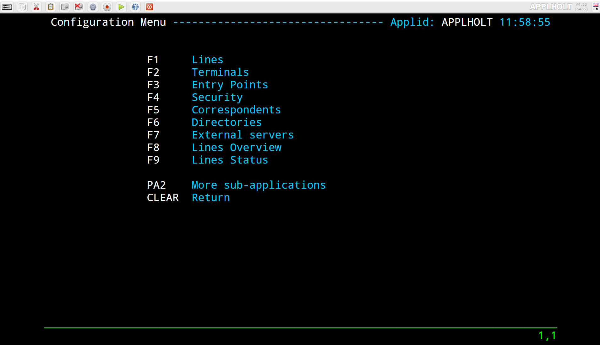
.. |image3| image:: images/media/image3.png
   :width: 6.49562in
   :height: 4.01500in
.. |image4| image:: images/media/image4.png
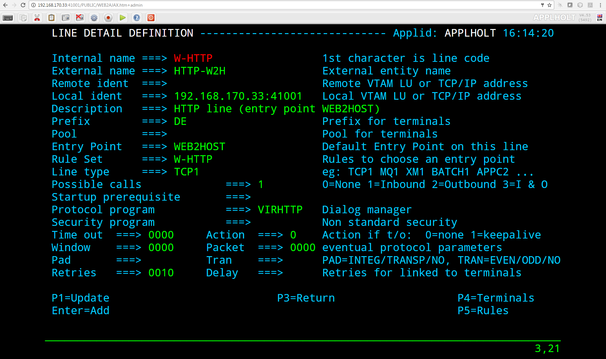
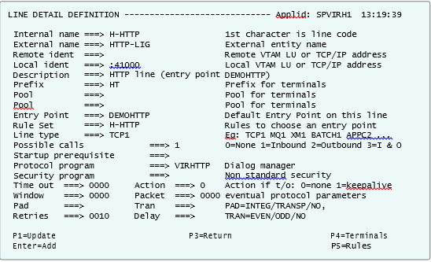
.. |image7| image:: images/media/image7.png
.. |image8| image:: images/media/image8.png
.. |image9| image:: images/media/image9.png
.. |image10| image:: images/media/image10.png
.. |image11| image:: images/media/image11.png
.. |image12| image:: images/media/image12.png
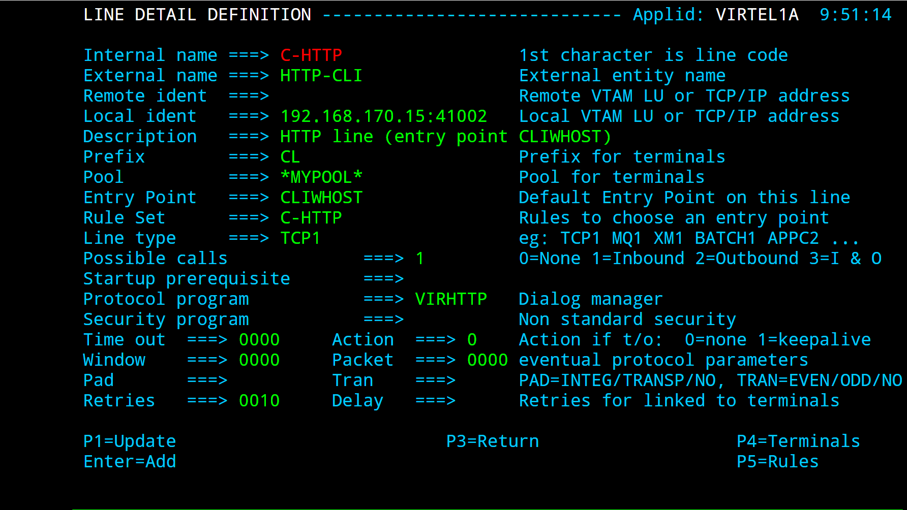
.. |image14| image:: images/media/image14.png
.. |image15| image:: images/media/image15.png
.. |image16| image:: images/media/image16.png
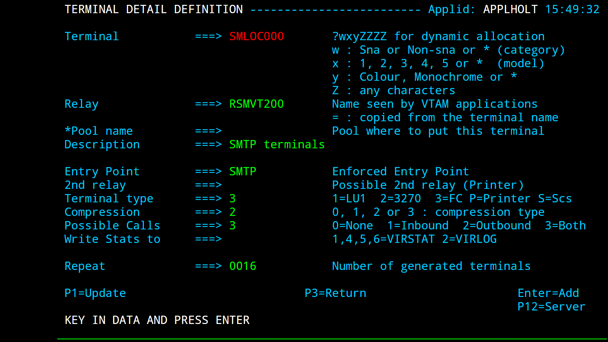
.. |image18| image:: images/media/image18.png
.. |image19| image:: images/media/image19.png
.. |image20| image:: images/media/image20.png
.. |image21| image:: images/media/image21.png
.. |image22| image:: images/media/image22.png
.. |image23| image:: images/media/image23.png
.. |image24| image:: images/media/image24.png
.. |image25| image:: images/media/image25.png
.. |image26| image:: images/media/image26.png
.. |image27| image:: images/media/image27.png
.. |image28| image:: images/media/image28.png
.. |image29| image:: images/media/image29.png
.. |image30| image:: images/media/image30.png
.. |image31| image:: images/media/image31.png

.. |image33| image:: images/media/image33.png
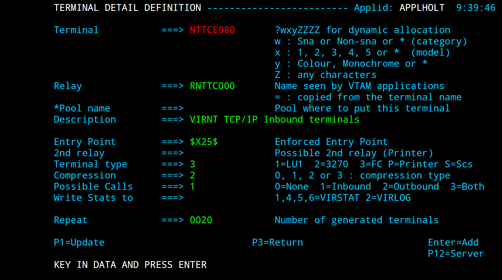
.. |image35| image:: images/media/image35.png
.. |image36| image:: images/media/image36.png
.. |image37| image:: images/media/image37.png
.. |image38| image:: images/media/image38.png
.. |image39| image:: images/media/image39.png
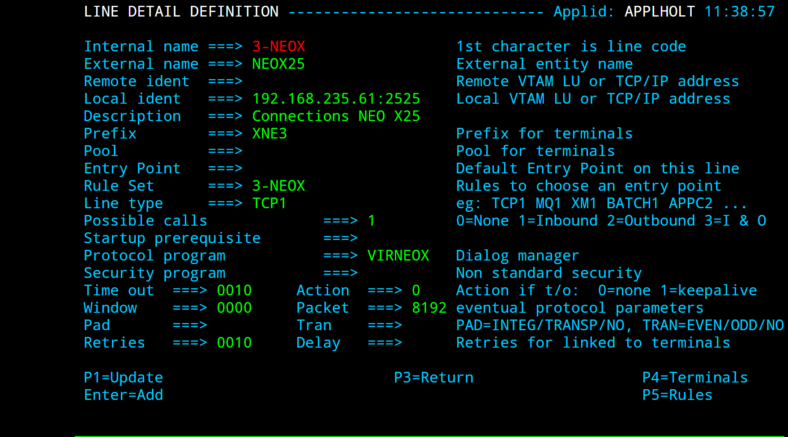
.. |image41| image:: images/media/image41.png
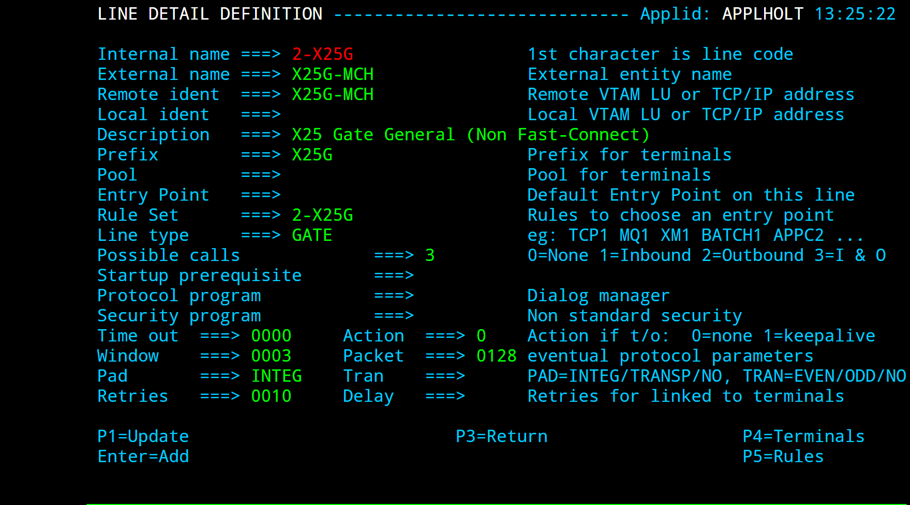
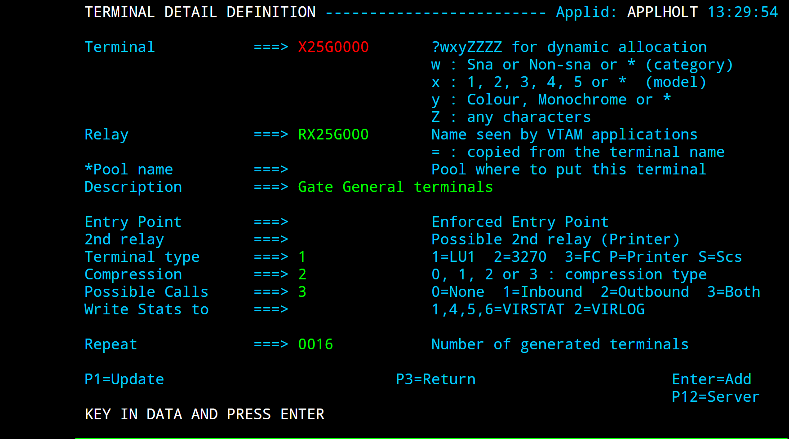
.. |image44| image:: images/media/image44.png

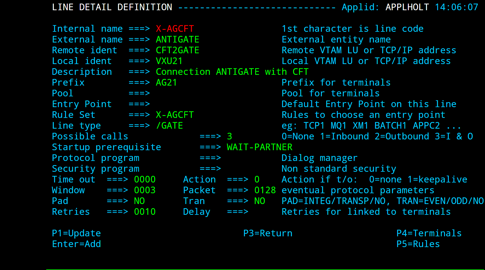
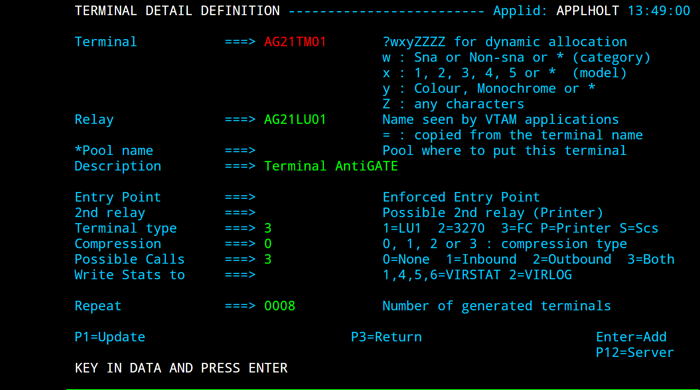
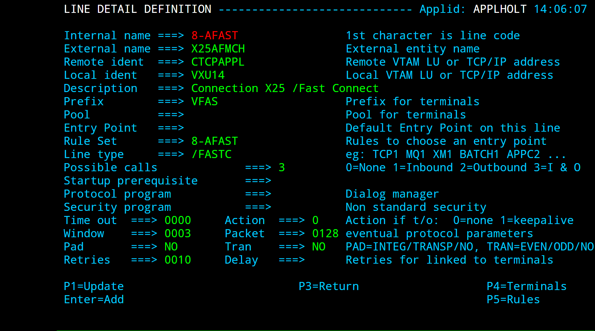
.. |image49| image:: images/media/image49.png
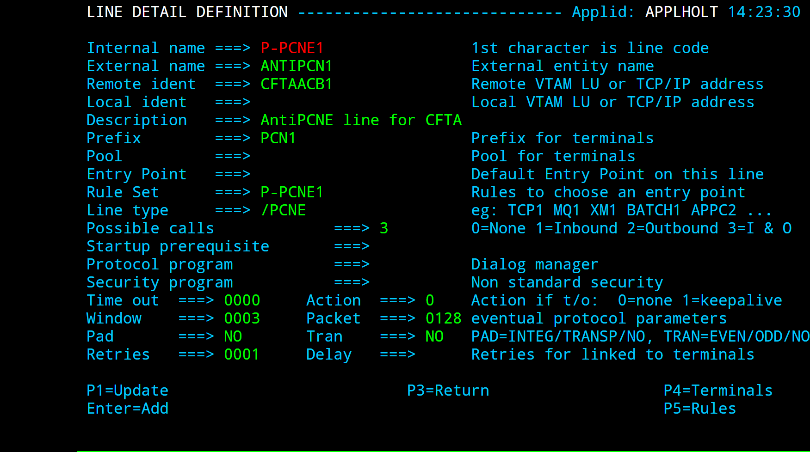
.. |image51| image:: images/media/image51.png
.. |image52| image:: images/media/image52.png

.. |image54| image:: images/media/image54.png
.. |image55| image:: images/media/image55.png
.. |image56| image:: images/media/image56.png
.. |image57| image:: images/media/image57.png
.. |image58| image:: images/media/image58.png
.. |image59| image:: images/media/image59.png
.. |image60| image:: images/media/image60.png
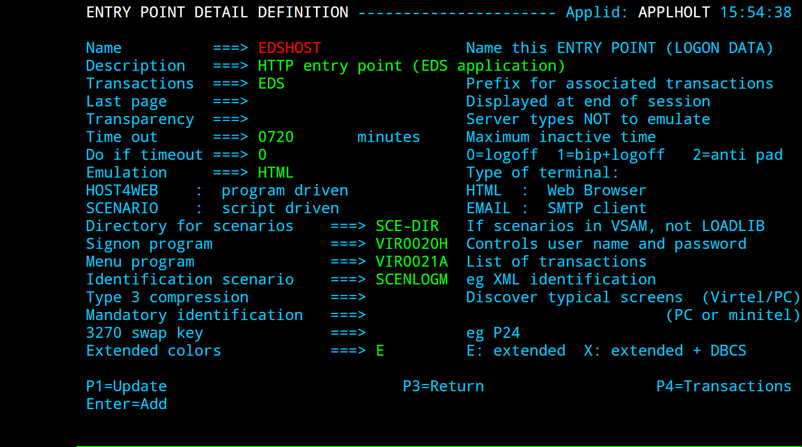
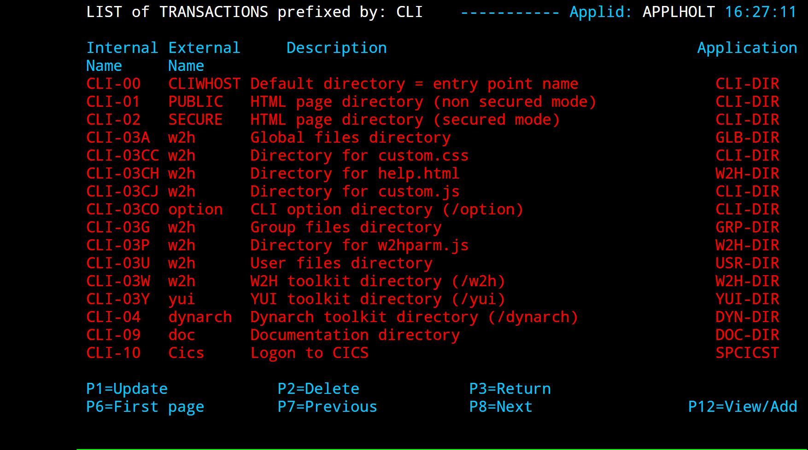
.. |image63| image:: images/media/image63.png
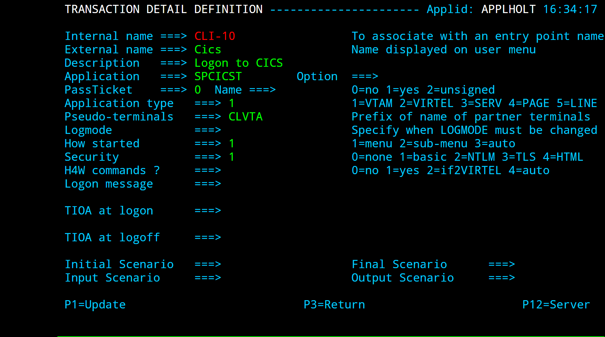
.. |image65| image:: images/media/image65.png
.. |image66| image:: images/media/image66.png
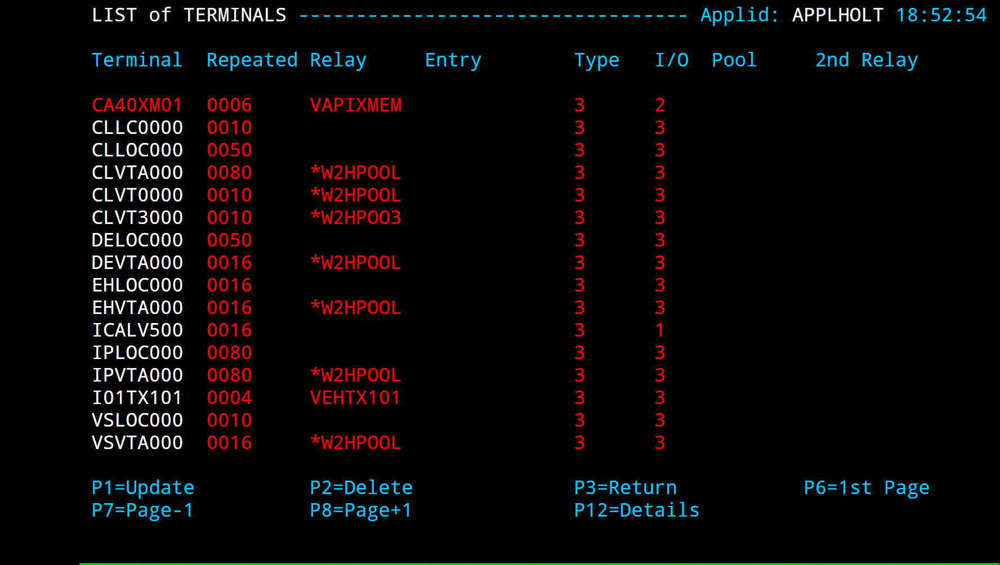
.. |image68| image:: images/media/image68.png

