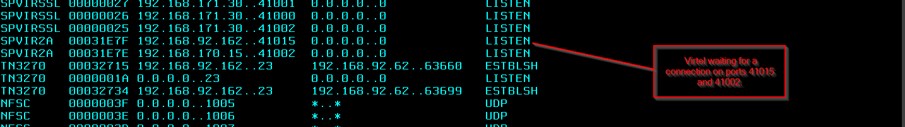
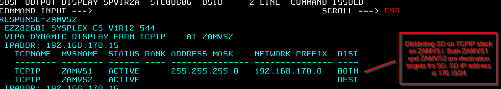
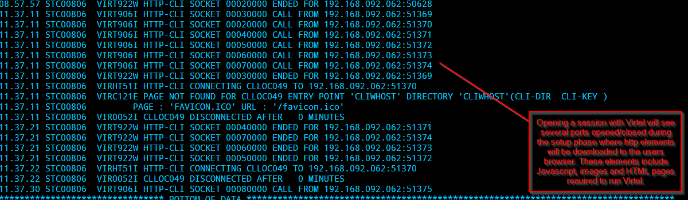
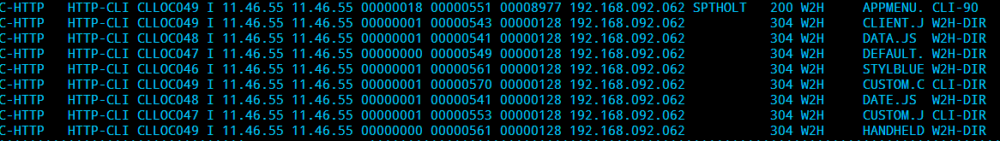
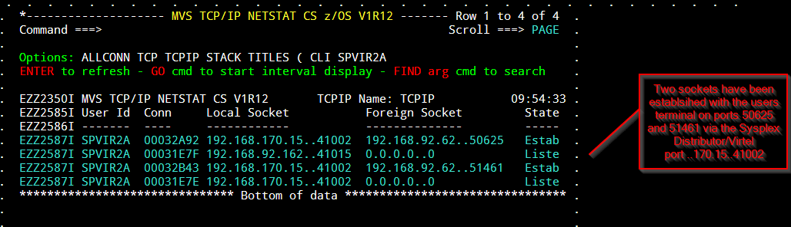
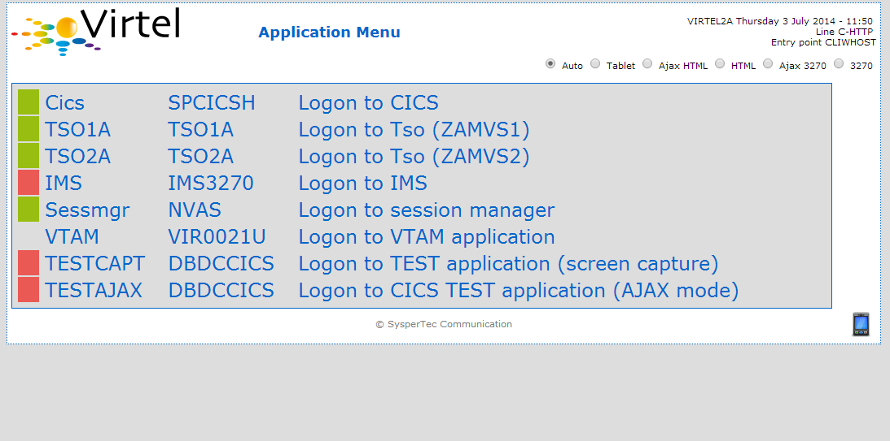
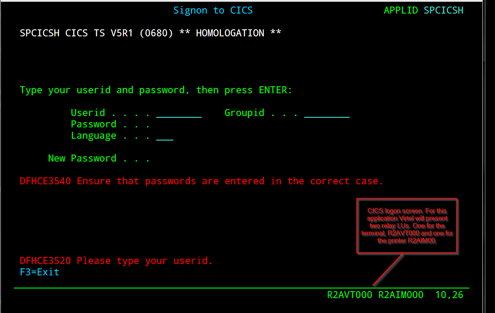
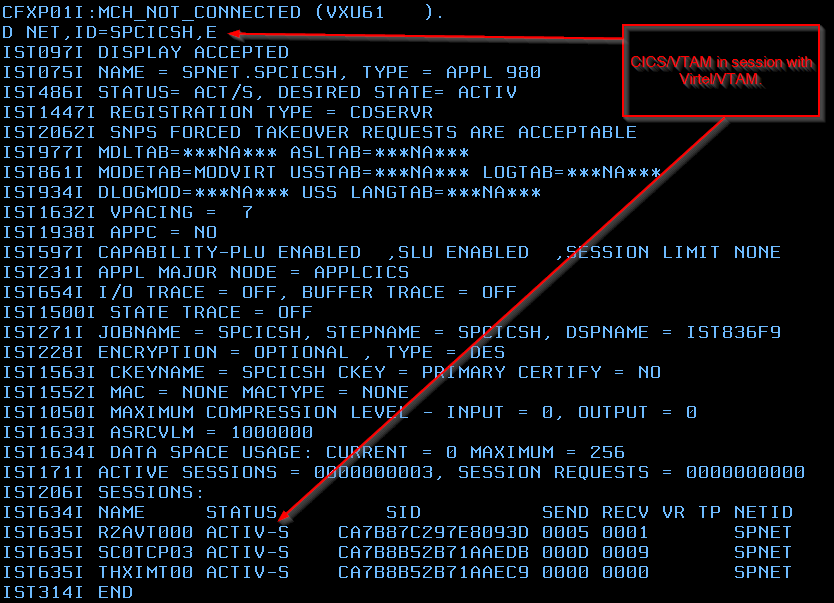
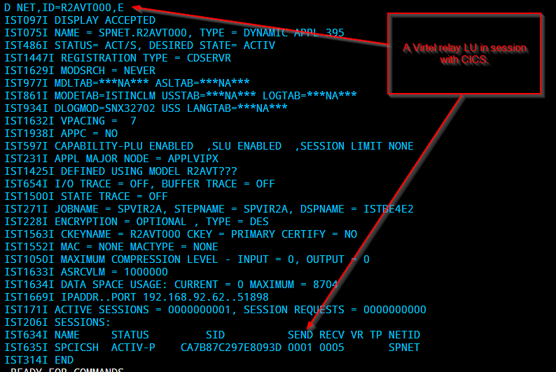
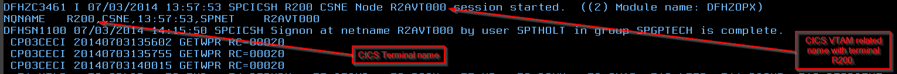

Overview of a Virtel Session
============================

    Virtel uses APIs provided by other protocols such as HTTP, TCP/IP,
    SNA to support Virtel session endpoints between a Web Browser and
    VTAM application. These underlying protocols are well documented in
    IBM manuals and/or other manuals. From an end to end session
    perspective Virtel acts like a conduit passing data between the HTTP
    session through to the CICS application. However, there are two
    faces that Virtel presents, one for each protocol. To the internet
    it acts like a HTTP Web server and to CICS like a 3270 logical
    unit:-

    Within the Virtel logic, data is transformed between SNA and HTTP
    presentation formats, depending on the data flow. With regard to
    states, at higher levels, a session state can be either in a send
    state or receive state. In effect though, at a lower level the HTTP
    side is stateless (HTTP is a stateless protocol), whereas on the
    VTAM side the SNA protocol demands a stateful protocol. Virtel
    internally manages the overall session state between these protocols
    for any one session. Virtel employs AJAX long polling and other web
    technologies to maintain state on the Web side of the session and
    confirms to SNA protocols as described in the VTAM programming
    manual. *See IBM SNA Network Product Formats LY43\_0081 for details
    on SNA formats and Data Flow*.

    **Session establishment**

    A session is establish through a user opening a browser window to a
    defined Virtel URL. For example http:

    http://192.168.170.15:41002/w2h/WEB2AJAX.htm+TSO1A?logmode=D4A32XX3&rows=52&cols=132

    It is the URI which determines what Virtel is to do on behalf of the
    user. In the above example the user is requesting that Virtel
    establish a SNA session to TSO. Logical the session between the user
    and TSO will now comprise of two half session elements. One half
    session representing the Web Server to Web Browser, another
    representing a SNA Logical unit to VTAM.

    Session establish on the Web Server side is triggered through the
    Z/OS TCP/IP stack receiving a packet from the web browser with the
    SYN bit set to 1. This will cause Virtel to open a socket with the
    web browser. In is not the intention of this document to detail TCP
    connection logic and hand shaking. *See Web Protocols and Practices.
    Balachander Krishnamurthy & Jennifer Rexford.*

    After opening the socket, Virtel will inspect the URI passed and
    determine an appropriate action. In this case it will establish a
    SNA VTAM session to TSO through the use of the REQSESS VTAM macro.
    This will open a logical unit session to the TSO application as
    requested in the URI. Of course this can be any VTAM application,
    for example CICS. The *Virtel Connectivity* manual documents the URI
    formats. This new SNA relay session will now support the SNA session
    between Virtel and the TSO application. Data flow will now commence
    between the Web client (Users Browser window) and the TSO
    application. Presentation data will be converted by Virtel between
    HTTP and SNA formats and the independent half session states that
    represent the each session half, web on one side, SNA on the other,
    will be managed by Virtel internal logic.

    **Session disconnection**

    When Virtel determines that a session has been disconnected it will
    close the supporting SNA relay session. Session disconnection can
    present itself to Virtel in many forms. From the user closing a
    window; triggered by the user pressing the “Disconnect” button in
    the Virtel OIA, or simplying turning the PC off. Virtel employs
    various mechanisms and timers as part of its internal state manager
    to detect whether the web half session is still “alive”. As HTTP is
    stateless it has no underlying “are you there” handshake mechanism
    and as such it is up to Virtel to determine if the web session is
    still active.

    **Session affinity**

    It is important that session affinity is maintained between a user’s
    browser session and the VTAM application. Virtel maintains affinity
    on the web side session id through the use of HTTP parameters. A
    Virtel line trace will reveal the protocol flow between the web
    browser and Virtel. Here can be seen the session ids that Virtel
    maintains in order to identify a particular session. The session id
    logic is handled and managed by Virtel’s internal session manager.
    An example of a line trace is shown below:-

    Loss of affinity will cause unpredictable results as Virtel will not
    be able to tie up the two half sessions. Loss of affinity can result
    from network configurations which do not employ affinity
    technologies. For example IBMs Sysplex Distributor requires the
    **TIMEDAFF** parameter to be specified. If Proxy Servers are used
    than the “Sticky Session” feature must be set\ *. See z/OS
    Communications Server: IP Configuration Reference SC27-3651-00 *

    For more information on setting up a Sysplex Distributor or visit
    http://httpd.apache.org/docs/2.2/mod/mod_proxy_balancer.html for
    further information on “sticky sessions”. In the following
    configuration an Apache Proxy Server is used to balance sessions
    request across two Virtel instances running on separate z/OS LPARS:-

    |image0|

    **Cache storage considerations**

    On the web side Virtel runs as a web server and therefore is
    subjected to the protocols of the underlying browser support, be it
    IE, Chrome or whatever browser support is utilized by the user. The
    standard logic is such that when the user opens a Virtel session by
    specifying a Virtel URI, Virtel will download the necessary HTML,
    CSS and Javacript elements. The browser will maintain these elements
    in storage, in this instance in the browsers cache storage. Most of
    these elements are static in nature, once in the browser’s cache
    they needn’t be served again. However, dynamic elements such as user
    macros, which are also maintained in the browser’s cache need to be
    reflected back to the Virtel TRSF file(s). The transfer of these
    elements is performed by Virtel through various web technologies.
    For example JSON array to reflect user macros. Virtel will enforce a
    storage cache refresh for some elements in certain conditions. For
    example, if a new copy of a JavaScript element is to be served as
    part of a maintenance upgrade, Virtel will ensure that the new
    JavaScript element is downloaded and updated in the browsers cache.

**Session example.**

In this scenario we look at a session between a browser and CICS with
Virtel providing the HTTP server and SNA conduit services. The
underlying network infrastructure is a Sysplex Distributor sharing load
between two TCP/IP target stacks running on separate LPARS.

Each LPAR runs an instance of Virtel. The CLI access port is defined as
170.15/24 in both the SPVIR1A and SPVIR2A ARBO definitions.

The TCPIP VIPA definitions in MVS1A look like:-

; 192.168.170.20 SPVIRMAN for VIPARANGE test

**; 192.168.170.15 VIPA for SPVIR1A and SPVIR2A distribution tests **

VIPADYNAMIC

VIPARANGE DEFINE MOVEABLE NONDISRUPTIVE 255.255.255.0 192.168.170.20

**VIPADEFINE MOVE IMMED 255.255.255.0 192.168.170.15 **

**VIPADISTRIBUTE DEFINE TIMEDAFF 300 DISTMETHOD ROUNDROBIN
192.168.170.15**

DESTIP ALL

ENDVIPADYNAMIC

The TCPIP VIPA definitions in MVS2A look like. It is a target for
170.15/24. Nothing special is defined.

VIPADYNAMIC

VIPARANGE DEFINE MOVEABLE NONDISRUPT 255.255.255.0 192.168.170.20

ENDVIPADYNAMIC

The SYSPLEX distributor will distribute sessions between MVS1A and MVS2A
in a round robin fashion. Not that this based up a new IP address not a
new browser session.

**IP Schematic**

+------> TCP/IP (92.161/24) MVS1A - > VTAM – SPVIR1A

\|

Terminal -> SD (170.15/24) \|

\|

+------> TCP/IP (92.162/24) MVS1B - > VTAM – SPVIR2A

**zOS setup**

MVS1A SPVIR1A(STC), SPCICSH(STC)

MVS1B SPVIR2A(STC)

SPVIR1A ACB = VIRTEL1A (Only used for Admin. Functions)

SPVIR2A ACB = VIRTEL2A (Only used for Admin. Functions)

Sysplex Distributor (SD) running on MVSA

Session Status before terminal establishes a session with Virtel using
the following URL:-

192.168.170.15:41002

z/OS Command : **D TCPIP,,N,CONN,MAX=\***

|image1|

The SD setup shows the SD running on MVSA and target stacks on both
MVS1A and MVS1B. Note that port 41002 is associated with the SD and the
ADMIN port 41015 is associated with the specific instance of Virtel
running on MVS2A on IP address 192.168.92.162. On MVS1A we have a
similar display for SPVIR1A.

|image2|

z/OS Command : D TCPIP,,SYSPLEX,VIPAD

|image3|

After opening a HTTP session with Virtel we can see the Virtel server
will initialize the browser environment by sending the necessary HTML
elements to support Virtel running within the browser environment.

|image4|

If we take a look at the Virtel log we can see which element names have
been downloaded and there source directories.

|image5|

In the Virtel JESMSGLG log we can see that Virtel is using the CLI-DIR
(Customized elements) and the W2H-DIR (distributed elements)
directories; These directories have been accessed by Virtel to download
HTML elements to the users’s browser environment.

If we now look at the session setup now we should see some sockets
established with Virtel and the user’s terminal.

|image6|

On the user’s terminal their browser window will have the Virtel
Application Menu screen. This is the default for the URI
192.168.170.15:41002 that we used when establishing a session with
Virtel.

|image7|

We can see from this screen that the TSO and CICS applications are
active (Green). Login to CICS will drive Virtel to establish SNA relay
sessions with the target CICS application.

Logging on to CICS from the Virtel Application Menu screen we get the
CICS logon panel.

|image8|

We can see from the screen that the two VTAM relay LUs that Virtel has
provided to support this session is R2AVT000 (Terminal) and
R2AIM000(Printer). Session status for CICS in VTAM looks like this:

|image9|

…..and Virtel’s relay LU in VTAM looks like:-

|image10|

We can logon to CICS and have a look at the CICS view.

|image11|

Finally, to summarize; the end-to-end session for this particular Virtel
session looks like this :-

Term. <---> VIRTEL/IP <---> VIRTEL/SNA <–--> R2AVT000 <---> SPCICSH

<----- VIRTEL STC ------> <----- CICS STC ----->

<-------- HTTP --------><------------- 3270 DataStreams ---------->

<------- TCP/IP -------><-------------------- SNA ---------------->

.. |image0| image:: images/media/image1.jpg
   :width: 6.30000in
   :height: 3.54375in

.. |image2| image:: images/media/image3.png
   :width: 7.08333in
   :height: 1.65625in

