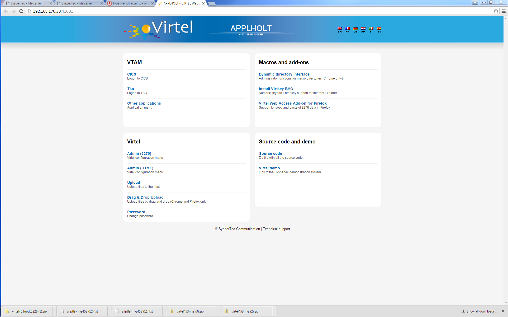
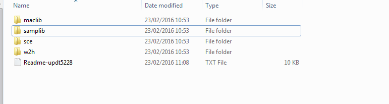

Installing Virtel V4.53 from scratch
====================================

**Cleaning up from a previous installation. **

If you want to delete all the files from a previous installation use the
following job:-

//S00 EXEC PGM=ADRDSSU,REGION=0M

//SYSPRINT DD SYSOUT=\*

//TEMP DD DUMMY

DUMP DATASET -

(INCLUDE( -

SPTHOLT.VIRT453.\*\* -

)) -

DELETE -

PURGE -

TOL(ENQF) -

OUTDDNAME(TEMP)

**Getting the software**

Download relevant files from the FTP server: http://ftp.syspertec.com

/VIRTEL 4.53/Produits/virtel453mvs.zip

/VIRTEL 4.53/Produits/allptfs-mvs453.txt

/VIRTEL 4.53/Produits/virtel453updt5380.zip

Unzip “virtel453mvs.zip” into a folder on your workstation.

Print off the “install.txt” document.

Unzip “/VIRTEL 4.53/Produits/virtel453updt5380.zip” into a folder on
your workstation.

Print off the readme document.

**Installing the software**

1.  Upload to the mainframe and edit the text file $alocdsu. Run it to
    allocate a XMIT file.

2.  Upload the XMIT file virt453.xmit to the file allocated by $alocdsu.

3.  Upload to the mainframe and edit the text file $restdsu. Run it to
    restore and install VIRTEL from the uploaded XMIT file.

4.  Upload text file allptfs-mvs453.txt to
    *yourqual.VIRT453.CNTL(PTF453MV).*

5.  Modify and run job *yourqual.VIRT453.CNTL(ZAPJCL)*. This will apply
    maintenance to the VIRTEL load library.

6.  Authorize the VIRTEL load library. Use the z/OS SETPROG APF command
    - SETPROG APF,ADD,DSN=\ *yourqual.VIRT453.LOADLIB*,[VOL=volser \|
    SMS ]

7.  Edit the VIRTEL TCT member *yourqual.VIRT453.CNTL(VIRTCT01*) and
    assemble using *yourqual.VIRT453.CNTL(ASMTCT).* See note 6 of
    “install.txt” for further information.

8.  Edit *yourqual.VIRT453.CNTL(ARBOLOAD)* and submit the job. This
    builds the default configuration and sample VTAMLST member. See note
    8 of the “install.txt” for further information.

9.  Copy *yourqual.VIRT453.CNTL(member)* to SYS1.VTAMLST. Member is
    either VIRTAPPL, the default member name, or the VTAM applid
    specified in the ARBOLOAD job on the NODEAPPL= statement. Activate
    the “member” with the z/OS command V NET,ACT,ID=member.

10. Edit member *yourqual.VIRT453.CNTL(VIRTEL4)* and copy to
    SYS1.PROCLIB as member VIRTEL. See notes 11,12 of the “install.txt”.

11. Start Virtel.

Note: You can run VIRTEL as a JOB rather than a STC. This can be useful
during testing. See the JCL below for an example:-

//SPTHOLTV JOB 9000,'VIRTEL',CLASS=A,MSGCLASS=X,NOTIFY=&SYSUID

//VIRTEL PROC QUAL=SPTHOLT.VIRT453,

// TCT=01 = Change to 01

//\*-------------------------------------------------------------------\*

//\* PROCEDURE FOR VIRTEL STARTER EDITION \*

//\*-------------------------------------------------------------------\*

//VIRTEL EXEC PGM=VIR6000,TIME=1440,REGION=32M,PARM=&TCT

//STEPLIB DD DSN=&QUAL..LOADLIB,DISP=SHR

//DFHRPL DD DSN=&QUAL..LOADLIB,DISP=SHR

//SERVLIB DD DSN=&QUAL..SERVLIB,DISP=SHR

//VIRARBO DD DSN=&QUAL..ARBO,DISP=SHR

//VIRSWAP DD DSN=&QUAL..SWAP,DISP=SHR

//VIRHTML DD DSN=&QUAL..HTML,DISP=SHR

//SAMPTRSF DD DSN=&QUAL..SAMP.TRSF,DISP=SHR

//HTMLTRSF DD DSN=&QUAL..HTML.TRSF,DISP=SHR

//SYSOUT DD SYSOUT=\*

//VIRLOG DD SYSOUT=\*

//VIRTRACE DD SYSOUT=\*

//SYSPRINT DD SYSOUT=\*

//SYSUDUMP DD SYSOUT=\*

// PEND

//S01 EXEC VIRTEL

Once Virtel is started you now need to apply maintenance to the SAMPTRSF
file. This file contains all the related web elements used by VIRTEL.
Before doing so, just check that VIRTEL is running and has correctly
opened sessions to ports 41001 and 41002. Issue the following command:-

F VIRTEL,LINES

The output should be similar to:-

F VIRTEL,LINES

+VIR0200I LINES

+VIR0201I VIRTEL 4.53 APPLID=APPLHOLT LINES

+VIR0202I INT.NAME EXT.NAME TYPE ACB OR IP

+VIR0202I -------- -------- ----- ---------

+VIR0202I C-HTTP HTTP-CLI TCP1 192.168.170.30:41002

+VIR0202I W-HTTP HTTP-W2H TCP1 192.168.170.30:41001

+VIR0202I ---END OF LIST---

**
Applying maintenance to Virtel.**

Stop VIRTEL if it is running.

**ARBO Changes**

Upload the text files ARBOMACR and ARBOMIGR to yourqual.VIRT453.SAMPLIB.

Edit and run ARBOMACR and ARBOMIGR to apply maintenance to the ARBO file
in preparation for the TRSF maintenance. Change the following SET XXXX=
keywords in the JCL to reflect the relevant library names:-

// SET LOAD=yourqual.VIRT453.LOADLIB

// SET ARBO=yourqual.VIRT453.ARBO

ARBOMIGR adds the SCE-DIR (Scenario directory) for loading scenarios.

ARBOMACR turns on the new macro support.

**MACLIB changes**

Upload the text file VIRTERM to yourqual.VIRT453.MACLIB. Reassemble
TCT01 using *yourqual.VIRT453.CNTL(ASMTCT*).

Note: If the assembly fails because the at (@) character has been
translated to a French accent à using codepage 1147 (French Euro) when
doing the file upload.

**
TRSF changes**

Start Virtel.

Using a Chrome Browser navigate to the Administration Virtel Portal
which can be accessed through port 41001. The Drag and Drop upload
feature is supported by Chrome and Firefox only.

http://192.168.170.30:41001/

The following screen image should appear:-

|image0|

Select Drag and Drop Upload and login with your credentials. The Drag
and Drop Interface will be displayed.

|image1|

Keeping this browser window open, go to your desktop directory where you
unzipped the virtel453updt5380.zip file:-

|image2|

Open the sce directory and select all the files (CTRL-A). Drag this
selection across to the browser window and drop over the SCE-DIR ICON.
This should start an upload of all the files in the SCE directory on
your desktop into the SCE-DIR directory of the SAMP TRSF VSAM file.
There should be 4 files.

|image3|

Repeat the exercise, but this time with the W2H directory, dragging the
83 elements into the W2H-DIR directory.

After all the elements have been uploaded into the TRSF CTRL-R in your
browser to refresh the browser’s cache.

**Note:** With some versions of Chrome there is a bug which prevents the
upload from starting. In this case:-

Close the browser.

Re-open a browser window and type in the following URL replacing the IP
stack address (192.168.170.30) with yours. The rest of the URL should be
the same. For example:-

http://192.168.170.30:41001/SECURE/upload.htm+dirlist

This will open the Drag and Drop interface Window. Continue to upload
the “w2h” and “sce” directories. Once the uploads have completed, CTRL-R
in the browser to refresh the browser’s cache. Close the browser window
and reopen the Virtel portal with the URL http://192.168.170.30:41001/

The last thing to do is to modify the WEB2HOST entry point to use the
SCE-DIR. Stop VIRTEL and then run the following JCL:-

//\*--------------------------------------------------------------\*

//\* \*

//\* ARBO MIGRATION. UPDATE ARBO TO CHANGE WEB2HOSTS \*

//\* \*

//\* Change Description Release \*

//\* UPDT5380 Change directory for WEB2HOST V453 \*

//\* \*

//\*--------------------------------------------------------------\*

//\*

// SET LOAD=yourqual.VIRTnnn.LOADLIB

// SET ARBO=yourqual.VIRTnnn.ARBO

//\*

//CONFIG EXEC PGM=VIRCONF,PARM='LOAD,REPL',REGION=2M

//STEPLIB DD DSN=&LOAD,DISP=SHR

//SYSPRINT DD SYSOUT=\*

//SYSUDUMP DD SYSOUT=\*

//VIRARBO DD DSN=&ARBO,DISP=SHR

//SYSIN DD \*

ENTRY ID=WEB2HOST, -

DESC='HTTP entry point (SysperTec menu)', -

TRANSACT=W2H, -

TIMEOUT=0720, -

ACTION=0, -

EMUL=HTML, -

SIGNON=VIR0020H, -

MENU=VIR0021A, -

IDENT=SCENLOGM, -

EXTCOLOR=E, -

SCENDIR=SCE-DIR

Start VIRTEL.

Virtel 4.53 maintenance is now complete.

**
Basic health test of Virtel**

From the Virtel Portal Page select “Other Applications”. An application
menu should appear with some default applications.

|image4|

Select any application that is flagged green. If no applications are
flagged green (available) then configure you ARBO and add applications
relevant to your site. See the *Virtel Connectivity Guide* for more
information.

This completes the Virtel 4.53 installation.

.. |image1| image:: images/media/image2.png
   :width: 6.26806in
   :height: 3.89722in

.. |image3| image:: images/media/image4.png
   :width: 6.26806in
   :height: 2.41667in
.. |image4| image:: images/media/image5.png
   :width: 6.26806in
   :height: 1.80556in
